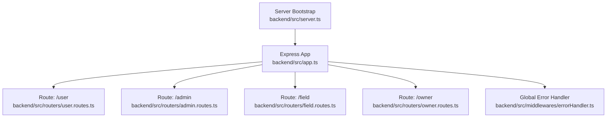
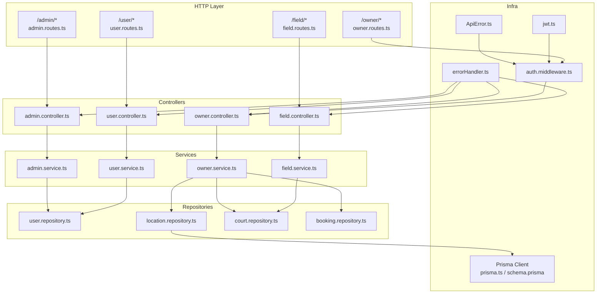
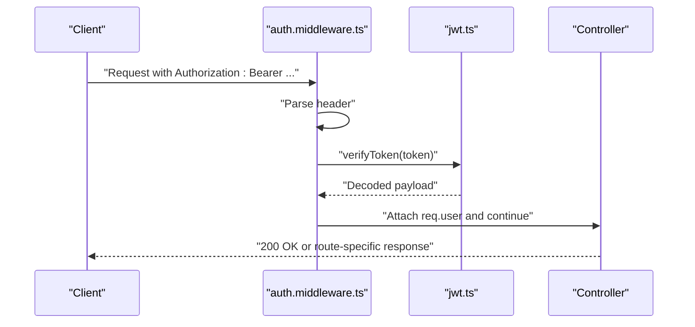
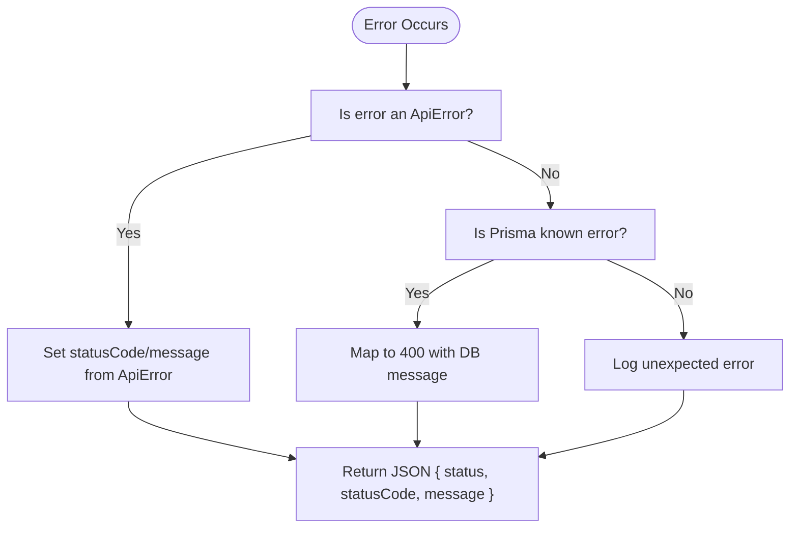
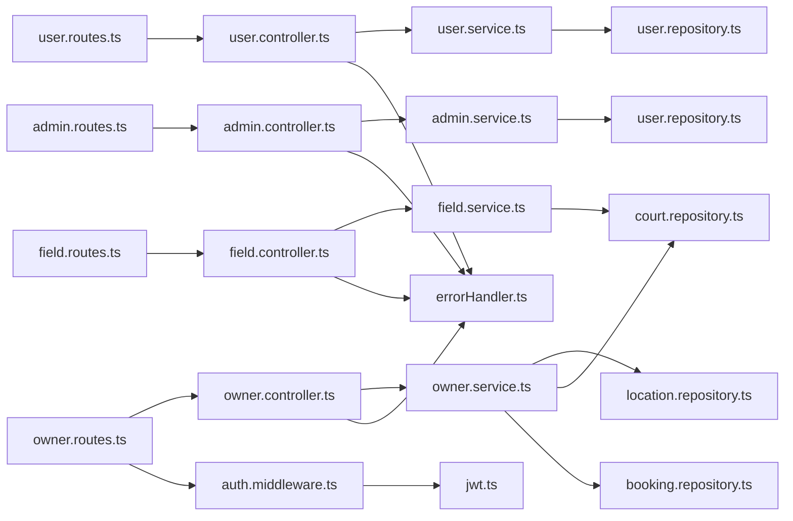

# API Documentation

<cite>
**Referenced Files in This Document**
- [app.ts](file://backend/src/app.ts)
- [server.ts](file://backend/src/server.ts)
- [auth.middleware.ts](file://backend/src/middlewares/auth.middleware.ts)
- [errorHandler.ts](file://backend/src/middlewares/errorHandler.ts)
- [jwt.ts](file://backend/src/utils/jwt.ts)
- [ApiError.ts](file://backend/src/utils/ApiError.ts)
- [user.routes.ts](file://backend/src/routers/user.routes.ts)
- [admin.routes.ts](file://backend/src/routers/admin.routes.ts)
- [field.routes.ts](file://backend/src/routers/field.routes.ts)
- [owner.routes.ts](file://backend/src/routers/owner.routes.ts)
- [user.controller.ts](file://backend/src/controllers/user.controller.ts)
- [admin.controller.ts](file://backend/src/controllers/admin.controller.ts)
- [field.controller.ts](file://backend/src/controllers/field.controller.ts)
- [owner.controller.ts](file://backend/src/controllers/owner.controller.ts)
- [user.service.ts](file://backend/src/services/user.service.ts)
- [admin.service.ts](file://backend/src/services/admin.service.ts)
- [field.service.ts](file://backend/src/services/field.service.ts)
- [owner.service.ts](file://backend/src/services/owner.service.ts)
- [user.repository.ts](file://backend/src/repositories/user.repository.ts)
- [location.repository.ts](file://backend/src/repositories/location.repository.ts)
- [court.repository.ts](file://backend/src/repositories/court.repository.ts)
- [booking.repository.ts](file://backend/src/repositories/booking.repository.ts)
- [prisma.ts](file://backend/src/config/prisma.ts)
- [schema.prisma](file://backend/prisma/schema.prisma)
</cite>

## Table of Contents
1. [Introduction](#introduction)
2. [Project Structure](#project-structure)
3. [Core Components](#core-components)
4. [Architecture Overview](#architecture-overview)
5. [Detailed Component Analysis](#detailed-component-analysis)
6. [Dependency Analysis](#dependency-analysis)
7. [Performance Considerations](#performance-considerations)
8. [Troubleshooting Guide](#troubleshooting-guide)
9. [Conclusion](#conclusion)
10. [Appendices](#appendices)

## Introduction
This document provides comprehensive API documentation for the sports facility booking platform. It covers all REST endpoints grouped by roles: User, Admin, Field, and Owner. For each endpoint, you will find HTTP methods, URL patterns, request/response schemas, authentication requirements, validation rules, error handling patterns, and practical cURL examples. Additional topics include rate limiting, pagination strategies, API versioning, and integration guidelines for frontend and third-party clients.

## Project Structure
The backend is an Express.js application that mounts route groups under base paths:
- /user
- /admin
- /field
- /owner

Global middleware applies CORS, JSON parsing, and centralized error handling. Authentication middleware enforces bearer tokens for protected routes.

**Diagram sources**
- [app.ts:15-19](file://backend/src/app.ts#L15-L19)
- [user.routes.ts:1-10](file://backend/src/routers/user.routes.ts#L1-L10)
- [admin.routes.ts:1-6](file://backend/src/routers/admin.routes.ts#L1-L6)
- [field.routes.ts:1-5](file://backend/src/routers/field.routes.ts#L1-L5)
- [owner.routes.ts:1-23](file://backend/src/routers/owner.routes.ts#L1-L23)
- [server.ts:1-20](file://backend/src/server.ts#L1-L20)

**Section sources**
- [app.ts:1-21](file://backend/src/app.ts#L1-L21)
- [server.ts:1-20](file://backend/src/server.ts#L1-L20)

## Core Components
- Authentication: Bearer token via Authorization header. Decoding is performed in the auth middleware using a JWT utility.
- Error Handling: Centralized handler converts known application errors and Prisma errors into structured JSON responses.
- Repositories: Data access is delegated to repositories for users, locations, courts, and bookings.
- Services: Business logic orchestrates repositories and transactions (e.g., owner registration uses Prisma transactions).

Key responsibilities:
- User endpoints handle registration and login.
- Admin endpoints expose user listing and retrieval by ID.
- Field endpoints return aggregated field listings with computed ratings and metadata.
- Owner endpoints support owner registration, managing courts, and booking status updates.

**Section sources**
- [auth.middleware.ts:1-28](file://backend/src/middlewares/auth.middleware.ts#L1-L28)
- [errorHandler.ts:1-38](file://backend/src/middlewares/errorHandler.ts#L1-L38)
- [jwt.ts](file://backend/src/utils/jwt.ts)
- [ApiError.ts](file://backend/src/utils/ApiError.ts)
- [user.repository.ts](file://backend/src/repositories/user.repository.ts)
- [location.repository.ts](file://backend/src/repositories/location.repository.ts)
- [court.repository.ts](file://backend/src/repositories/court.repository.ts)
- [booking.repository.ts](file://backend/src/repositories/booking.repository.ts)

## Architecture Overview
The API follows a layered architecture:
- Routers define routes and bind controller handlers.
- Controllers receive requests, delegate to services, and send responses.
- Services encapsulate business logic and coordinate repositories.
- Repositories abstract database operations.
- Middleware handles authentication and global error handling.

**Diagram sources**
- [user.routes.ts:1-10](file://backend/src/routers/user.routes.ts#L1-L10)
- [admin.routes.ts:1-6](file://backend/src/routers/admin.routes.ts#L1-L6)
- [field.routes.ts:1-5](file://backend/src/routers/field.routes.ts#L1-L5)
- [owner.routes.ts:1-23](file://backend/src/routers/owner.routes.ts#L1-L23)
- [user.controller.ts:1-14](file://backend/src/controllers/user.controller.ts#L1-L14)
- [admin.controller.ts:1-13](file://backend/src/controllers/admin.controller.ts#L1-L13)
- [field.controller.ts:1-11](file://backend/src/controllers/field.controller.ts#L1-L11)
- [owner.controller.ts:1-110](file://backend/src/controllers/owner.controller.ts#L1-L110)
- [user.service.ts:1-69](file://backend/src/services/user.service.ts#L1-L69)
- [admin.service.ts:1-57](file://backend/src/services/admin.service.ts#L1-L57)
- [field.service.ts:1-42](file://backend/src/services/field.service.ts#L1-L42)
- [owner.service.ts:1-148](file://backend/src/services/owner.service.ts#L1-L148)
- [user.repository.ts](file://backend/src/repositories/user.repository.ts)
- [location.repository.ts](file://backend/src/repositories/location.repository.ts)
- [court.repository.ts](file://backend/src/repositories/court.repository.ts)
- [booking.repository.ts](file://backend/src/repositories/booking.repository.ts)
- [auth.middleware.ts:1-28](file://backend/src/middlewares/auth.middleware.ts#L1-L28)
- [errorHandler.ts:1-38](file://backend/src/middlewares/errorHandler.ts#L1-L38)
- [jwt.ts](file://backend/src/utils/jwt.ts)
- [ApiError.ts](file://backend/src/utils/ApiError.ts)
- [prisma.ts](file://backend/src/config/prisma.ts)
- [schema.prisma](file://backend/prisma/schema.prisma)

## Detailed Component Analysis

### Authentication and Authorization
- Header: Authorization: Bearer <token>
- Behavior:
  - Missing or malformed header yields 401 Unauthorized.
  - Invalid token yields 401 Unauthorized.
  - On success, the decoded payload is attached to req.user for protected routes.
- Token generation and verification are handled by the JWT utility.

**Diagram sources**
- [auth.middleware.ts:9-27](file://backend/src/middlewares/auth.middleware.ts#L9-L27)
- [jwt.ts](file://backend/src/utils/jwt.ts)

**Section sources**
- [auth.middleware.ts:1-28](file://backend/src/middlewares/auth.middleware.ts#L1-L28)
- [jwt.ts](file://backend/src/utils/jwt.ts)

### Error Handling
- Known ApiError instances propagate statusCode and message.
- PrismaClientKnownRequestError mapped to 400 with specific messages for duplicates and other DB errors.
- Unexpected errors logged and returned as generic 500.

**Diagram sources**
- [errorHandler.ts:4-37](file://backend/src/middlewares/errorHandler.ts#L4-L37)
- [ApiError.ts](file://backend/src/utils/ApiError.ts)

**Section sources**
- [errorHandler.ts:1-38](file://backend/src/middlewares/errorHandler.ts#L1-L38)
- [ApiError.ts](file://backend/src/utils/ApiError.ts)

### User Endpoints
Base path: /user

- POST /register
  - Purpose: Register a new user.
  - Auth: None.
  - Request body: Fields for user creation (name, email, phone, password).
  - Response: Created user object and JWT token.
  - Validation: Duplicate email or phone triggers 400.
  - cURL example:
    - curl -X POST http://localhost:3000/user/register -H "Content-Type: application/json" -d '{...}'
  - Notes: Password is hashed before storage.

- POST /login
  - Purpose: Authenticate user and return token.
  - Auth: None.
  - Request body: Email/phone and password.
  - Response: User object and JWT token.
  - Validation: Not found, missing password, or invalid password yield 404/400.
  - cURL example:
    - curl -X POST http://localhost:3000/user/login -H "Content-Type: application/json" -d '{...}'

**Section sources**
- [user.routes.ts:7-8](file://backend/src/routers/user.routes.ts#L7-L8)
- [user.controller.ts:7-14](file://backend/src/controllers/user.controller.ts#L7-L14)
- [user.service.ts:8-42](file://backend/src/services/user.service.ts#L8-L42)
- [user.repository.ts](file://backend/src/repositories/user.repository.ts)

### Admin Endpoints
Base path: /admin

- GET /
  - Purpose: List all users.
  - Auth: None (no auth middleware applied).
  - Response: Array of users.
  - cURL example:
    - curl http://localhost:3000/admin

- GET /:id
  - Purpose: Retrieve a user by ID.
  - Auth: None.
  - Path param: id (string).
  - Response: User object.
  - Validation: 404 if not found.
  - cURL example:
    - curl http://localhost:3000/admin/{id}

**Section sources**
- [admin.routes.ts:4-5](file://backend/src/routers/admin.routes.ts#L4-L5)
- [admin.controller.ts:4-12](file://backend/src/controllers/admin.controller.ts#L4-L12)
- [admin.service.ts:7-19](file://backend/src/services/admin.service.ts#L7-L19)
- [user.repository.ts](file://backend/src/repositories/user.repository.ts)

### Field Endpoints
Base path: /field

- GET /
  - Purpose: Retrieve fields with computed average rating and representative image.
  - Auth: None.
  - Response: Array of fields with keys: id, name, average stars, sport type, venue name, address, representative image, coordinates, price per 30 minutes.
  - cURL example:
    - curl http://localhost:3000/field

**Section sources**
- [field.routes.ts:4](file://backend/src/routers/field.routes.ts#L4)
- [field.controller.ts:4-10](file://backend/src/controllers/field.controller.ts#L4-L10)
- [field.service.ts:4-38](file://backend/src/services/field.service.ts#L4-L38)
- [court.repository.ts](file://backend/src/repositories/court.repository.ts)

### Owner Endpoints
Base path: /owner

- POST /register
  - Purpose: Register a new owner with two uploaded CCCD images.
  - Auth: None.
  - Request form-data:
    - Fields: name, email, phone, password, venue name, address.
    - Files: anh_cccd_truoc, anh_cccd_sau (required).
  - Response: Success flag, message, user, location, token.
  - Validation: Missing images yield 400; duplicate email/phone yield 400.
  - cURL example:
    - curl -X POST http://localhost:3000/owner/register -F "name=..." -F "email=..." -F "phone=..." -F "password=..." -F "venueName=..." -F "address=..." -F "anh_cccd_truoc=@front.jpg" -F "anh_cccd_sau=@back.jpg"

- GET /my-courts
  - Purpose: List courts owned by the authenticated owner.
  - Auth: Required (Bearer).
  - Response: Success flag and array of courts.
  - cURL example:
    - curl http://localhost:3000/owner/my-courts -H "Authorization: Bearer {token}"

- POST /add-court
  - Purpose: Add a new court under the owner’s venue.
  - Auth: Required (Bearer).
  - Request form-data:
    - Fields: court name, sport type, price per 30 min, status.
    - Files: multiple images (optional).
  - Response: Success flag, message, and created court.
  - Validation: Owner’s venue must exist; otherwise 404.
  - cURL example:
    - curl -X POST http://localhost:3000/owner/add-court -H "Authorization: Bearer {token}" -F "name=..." -F "sportType=..." -F "price=..." -F "status=..." -F "images=@img1.jpg"

- PUT /update-court/:ma_san
  - Purpose: Update an existing court (owner-only).
  - Auth: Required (Bearer).
  - Path param: ma_san (string).
  - Request body: Updates to name, sport type, price, status.
  - Response: Success flag and updated court.
  - Validation: 404 if court does not belong to owner.
  - cURL example:
    - curl -X PUT http://localhost:3000/owner/update-court/{ma_san} -H "Authorization: Bearer {token}" -H "Content-Type: application/json" -d '{...}'

- GET /my-bookings
  - Purpose: List bookings associated with owner’s courts.
  - Auth: Required (Bearer).
  - Response: Success flag and array of bookings.
  - cURL example:
    - curl http://localhost:3000/owner/my-bookings -H "Authorization: Bearer {token}"

- PATCH /update-booking-status/:id
  - Purpose: Update booking status for a booking linked to owner’s courts.
  - Auth: Required (Bearer).
  - Path param: id (string).
  - Request body: status (string).
  - Response: Success flag and updated booking.
  - Validation: 404 if booking does not belong to owner.
  - cURL example:
    - curl -X PATCH http://localhost:3000/owner/update-booking-status/{id} -H "Authorization: Bearer {token}" -H "Content-Type: application/json" -d '{"status":"accepted"}'

**Section sources**
- [owner.routes.ts:15-20](file://backend/src/routers/owner.routes.ts#L15-L20)
- [owner.controller.ts:6-40](file://backend/src/controllers/owner.controller.ts#L6-L40)
- [owner.controller.ts:42-50](file://backend/src/controllers/owner.controller.ts#L42-L50)
- [owner.controller.ts:52-65](file://backend/src/controllers/owner.controller.ts#L52-L65)
- [owner.controller.ts:67-82](file://backend/src/controllers/owner.controller.ts#L67-L82)
- [owner.controller.ts:84-92](file://backend/src/controllers/owner.controller.ts#L84-L92)
- [owner.controller.ts:94-109](file://backend/src/controllers/owner.controller.ts#L94-L109)
- [owner.service.ts:12-64](file://backend/src/services/owner.service.ts#L12-L64)
- [owner.service.ts:66-70](file://backend/src/services/owner.service.ts#L66-L70)
- [owner.service.ts:72-111](file://backend/src/services/owner.service.ts#L72-L111)
- [owner.service.ts:113-129](file://backend/src/services/owner.service.ts#L113-L129)
- [owner.service.ts:131-133](file://backend/src/services/owner.service.ts#L131-L133)
- [owner.service.ts:135-144](file://backend/src/services/owner.service.ts#L135-L144)
- [location.repository.ts](file://backend/src/repositories/location.repository.ts)
- [court.repository.ts](file://backend/src/repositories/court.repository.ts)
- [booking.repository.ts](file://backend/src/repositories/booking.repository.ts)

## Dependency Analysis
- Route-to-Controller binding is explicit in routers.
- Controllers depend on services for business logic.
- Services depend on repositories for persistence and Prisma client for transactions.
- Authentication middleware is selectively applied to owner routes requiring ownership checks.

**Diagram sources**
- [user.routes.ts:1-10](file://backend/src/routers/user.routes.ts#L1-L10)
- [admin.routes.ts:1-6](file://backend/src/routers/admin.routes.ts#L1-L6)
- [field.routes.ts:1-5](file://backend/src/routers/field.routes.ts#L1-L5)
- [owner.routes.ts:1-23](file://backend/src/routers/owner.routes.ts#L1-L23)
- [user.controller.ts:1-14](file://backend/src/controllers/user.controller.ts#L1-L14)
- [admin.controller.ts:1-13](file://backend/src/controllers/admin.controller.ts#L1-L13)
- [field.controller.ts:1-11](file://backend/src/controllers/field.controller.ts#L1-L11)
- [owner.controller.ts:1-110](file://backend/src/controllers/owner.controller.ts#L1-L110)
- [user.service.ts:1-69](file://backend/src/services/user.service.ts#L1-L69)
- [admin.service.ts:1-57](file://backend/src/services/admin.service.ts#L1-L57)
- [field.service.ts:1-42](file://backend/src/services/field.service.ts#L1-L42)
- [owner.service.ts:1-148](file://backend/src/services/owner.service.ts#L1-L148)
- [user.repository.ts](file://backend/src/repositories/user.repository.ts)
- [location.repository.ts](file://backend/src/repositories/location.repository.ts)
- [court.repository.ts](file://backend/src/repositories/court.repository.ts)
- [booking.repository.ts](file://backend/src/repositories/booking.repository.ts)
- [auth.middleware.ts:1-28](file://backend/src/middlewares/auth.middleware.ts#L1-L28)
- [errorHandler.ts:1-38](file://backend/src/middlewares/errorHandler.ts#L1-L38)
- [jwt.ts](file://backend/src/utils/jwt.ts)

**Section sources**
- [app.ts:4-8](file://backend/src/app.ts#L4-L8)
- [owner.routes.ts:3](file://backend/src/routers/owner.routes.ts#L3)
- [auth.middleware.ts:9-27](file://backend/src/middlewares/auth.middleware.ts#L9-L27)

## Performance Considerations
- Token verification occurs on protected routes; keep token size minimal.
- Image uploads for owner registration and courts are stored via Cloudinary/Multer; ensure appropriate file sizes and types to avoid large payloads.
- Aggregated field listing computes average ratings client-side; consider caching or precomputing averages at the database level for scalability.
- Use pagination for lists when they grow large (e.g., /admin, /owner/my-bookings).

[No sources needed since this section provides general guidance]

## Troubleshooting Guide
Common issues and resolutions:
- 401 Unauthorized:
  - Missing or malformed Authorization header.
  - Invalid/expired token.
- 400 Bad Request:
  - Duplicate email/phone during user/owner registration.
  - Missing required fields (e.g., images for owner registration, ma_san for updates).
  - Prisma constraint violations (e.g., unique index conflicts).
- 404 Not Found:
  - User not found by ID.
  - Owner’s venue not found.
  - Court or booking not found or does not belong to owner.
- 500 Internal Server Error:
  - Unexpected server errors; check logs.

**Section sources**
- [errorHandler.ts:14-30](file://backend/src/middlewares/errorHandler.ts#L14-L30)
- [user.service.ts:14-21](file://backend/src/services/user.service.ts#L14-L21)
- [owner.service.ts:18-21](file://backend/src/services/owner.service.ts#L18-L21)
- [owner.controller.ts:15-17](file://backend/src/controllers/owner.controller.ts#L15-L17)
- [owner.controller.ts:73-75](file://backend/src/controllers/owner.controller.ts#L73-L75)
- [owner.controller.ts:100-102](file://backend/src/controllers/owner.controller.ts#L100-L102)
- [admin.controller.ts:14-16](file://backend/src/controllers/admin.controller.ts#L14-L16)
- [owner.service.ts:78-80](file://backend/src/services/owner.service.ts#L78-L80)
- [owner.service.ts:119-121](file://backend/src/services/owner.service.ts#L119-L121)
- [owner.service.ts:139-141](file://backend/src/services/owner.service.ts#L139-L141)

## Conclusion
This API provides a clear separation of concerns with explicit authentication for owner-related endpoints, robust error handling, and straightforward CRUD operations for users, admins, fields, and owners. The documentation above should enable frontend and third-party integrators to build reliable clients against the platform.

[No sources needed since this section summarizes without analyzing specific files]

## Appendices

### Rate Limiting
- Not implemented in the current codebase. Consider adding rate limiting at the Express layer (e.g., per IP or per user) to protect endpoints from abuse.

[No sources needed since this section provides general guidance]

### Pagination Strategies
- Not implemented in the current codebase. For large lists (e.g., /admin, /owner/my-bookings), introduce query parameters like page and limit and return total count and next/prev links.

[No sources needed since this section provides general guidance]

### API Versioning
- Not implemented in the current codebase. To evolve the API safely, adopt a version prefix (e.g., /v1/user) or a version header.

[No sources needed since this section provides general guidance]

### Integration Guidelines
- Frontend:
  - Store JWT securely (HttpOnly cookies or secure storage) and attach Authorization header on protected requests.
  - Use FormData for multipart uploads (owner registration and add-court).
- Third-party Clients:
  - Respect error responses and retry transient failures with exponential backoff.
  - Validate response schemas before rendering or processing.

[No sources needed since this section provides general guidance]