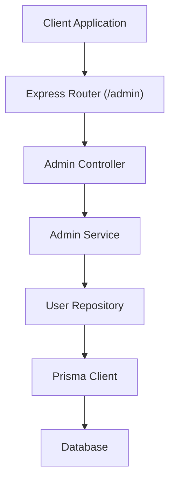
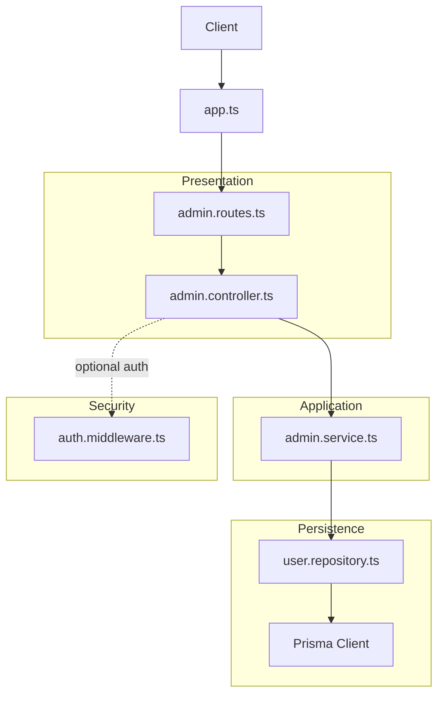
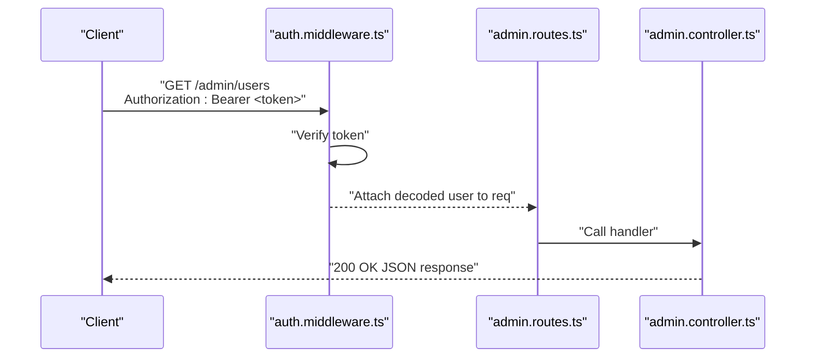
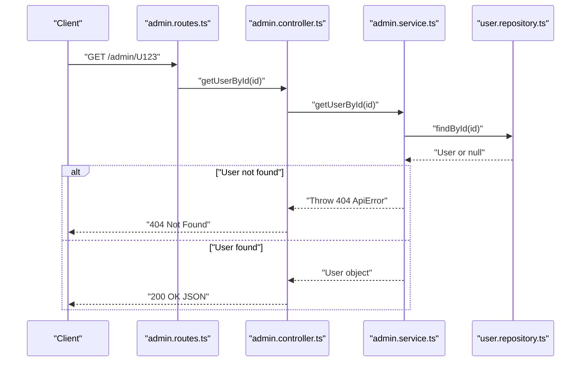
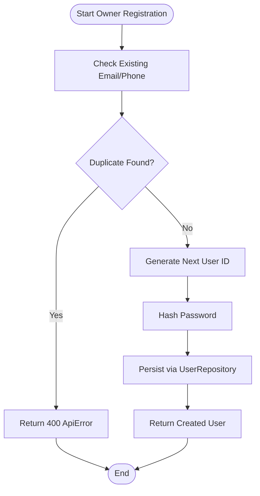
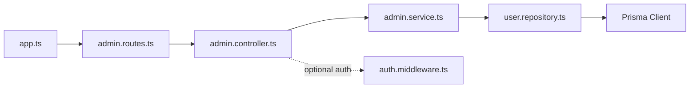

# Admin API Endpoints

<cite>
**Referenced Files in This Document**
- [admin.controller.ts](file://backend/src/controllers/admin.controller.ts)
- [admin.routes.ts](file://backend/src/routers/admin.routes.ts)
- [admin.service.ts](file://backend/src/services/admin.service.ts)
- [auth.middleware.ts](file://backend/src/middlewares/auth.middleware.ts)
- [app.ts](file://backend/src/app.ts)
- [user.repository.ts](file://backend/src/repositories/user.repository.ts)
- [ApiError.ts](file://backend/src/utils/ApiError.ts)
- [user.type.ts](file://backend/src/types/user.type.ts)
- [owner.type.ts](file://backend/src/types/owner.type.ts)
- [schema.prisma](file://backend/prisma/schema.prisma)
</cite>

## Table of Contents
1. [Introduction](#introduction)
2. [Project Structure](#project-structure)
3. [Core Components](#core-components)
4. [Architecture Overview](#architecture-overview)
5. [Detailed Component Analysis](#detailed-component-analysis)
6. [Dependency Analysis](#dependency-analysis)
7. [Performance Considerations](#performance-considerations)
8. [Troubleshooting Guide](#troubleshooting-guide)
9. [Conclusion](#conclusion)

## Introduction
This document provides comprehensive API documentation for Admin management endpoints. It covers administrative functions including user management, facility approval workflows, and system oversight capabilities. The documentation details authentication requirements for admin roles, authorization patterns, permission-based access control, request/response schemas, validation rules, error handling, and integration with the admin dashboard.

## Project Structure
The Admin API is implemented in the backend service using Express.js. The routes are mounted under `/admin` and delegate to controller functions, which in turn use service classes to interact with repositories and the database.

**Diagram sources**
- [admin.routes.ts:1-6](file://backend/src/routers/admin.routes.ts#L1-L6)
- [admin.controller.ts:1-13](file://backend/src/controllers/admin.controller.ts#L1-L13)
- [admin.service.ts:1-57](file://backend/src/services/admin.service.ts#L1-L57)
- [user.repository.ts:1-53](file://backend/src/repositories/user.repository.ts#L1-L53)
- [app.ts:15-19](file://backend/src/app.ts#L15-L19)

**Section sources**
- [admin.routes.ts:1-6](file://backend/src/routers/admin.routes.ts#L1-L6)
- [admin.controller.ts:1-13](file://backend/src/controllers/admin.controller.ts#L1-L13)
- [admin.service.ts:1-57](file://backend/src/services/admin.service.ts#L1-L57)
- [user.repository.ts:1-53](file://backend/src/repositories/user.repository.ts#L1-L53)
- [app.ts:15-19](file://backend/src/app.ts#L15-L19)

## Core Components
- Admin Routes: Mount GET endpoints for listing users and retrieving a user by ID.
- Admin Controller: Thin handlers that call service methods and return JSON responses.
- Admin Service: Orchestrates business logic, including user retrieval and owner creation workflows.
- User Repository: Provides CRUD operations against the database using Prisma.
- Authentication Middleware: Validates bearer tokens and attaches user context to requests.

Key implementation references:
- Route registration and handlers: [admin.routes.ts:1-6](file://backend/src/routers/admin.routes.ts#L1-L6)
- Controller functions: [admin.controller.ts:4-12](file://backend/src/controllers/admin.controller.ts#L4-L12)
- Service methods: [admin.service.ts:7-19](file://backend/src/services/admin.service.ts#L7-L19), [admin.service.ts:21-54](file://backend/src/services/admin.service.ts#L21-L54)
- Repository methods: [user.repository.ts:4-20](file://backend/src/repositories/user.repository.ts#L4-L20), [user.repository.ts:36-49](file://backend/src/repositories/user.repository.ts#L36-L49)
- Authentication middleware: [auth.middleware.ts:9-27](file://backend/src/middlewares/auth.middleware.ts#L9-L27)

**Section sources**
- [admin.routes.ts:1-6](file://backend/src/routers/admin.routes.ts#L1-L6)
- [admin.controller.ts:1-13](file://backend/src/controllers/admin.controller.ts#L1-L13)
- [admin.service.ts:1-57](file://backend/src/services/admin.service.ts#L1-L57)
- [user.repository.ts:1-53](file://backend/src/repositories/user.repository.ts#L1-L53)
- [auth.middleware.ts:1-28](file://backend/src/middlewares/auth.middleware.ts#L1-L28)

## Architecture Overview
The Admin API follows a layered architecture:
- Presentation Layer: Express routes and controllers handle HTTP requests/responses.
- Application Layer: Services encapsulate business logic and orchestrate operations.
- Persistence Layer: Repositories abstract database interactions via Prisma.
- Security Layer: Authentication middleware validates tokens and enriches requests.

**Diagram sources**
- [admin.routes.ts:1-6](file://backend/src/routers/admin.routes.ts#L1-L6)
- [admin.controller.ts:1-13](file://backend/src/controllers/admin.controller.ts#L1-L13)
- [admin.service.ts:1-57](file://backend/src/services/admin.service.ts#L1-L57)
- [user.repository.ts:1-53](file://backend/src/repositories/user.repository.ts#L1-L53)
- [auth.middleware.ts:1-28](file://backend/src/middlewares/auth.middleware.ts#L1-L28)
- [app.ts:15-19](file://backend/src/app.ts#L15-L19)

## Detailed Component Analysis

### Authentication and Authorization
- Authentication: Implemented via a bearer token scheme. The middleware extracts the token from the Authorization header, verifies it, and attaches the decoded user payload to the request object.
- Authorization: The current admin routes do not enforce role-specific permissions. To secure admin endpoints, integrate role checks after authentication.

**Diagram sources**
- [auth.middleware.ts:9-27](file://backend/src/middlewares/auth.middleware.ts#L9-L27)
- [admin.routes.ts:4-5](file://backend/src/routers/admin.routes.ts#L4-L5)
- [admin.controller.ts:4-12](file://backend/src/controllers/admin.controller.ts#L4-L12)

**Section sources**
- [auth.middleware.ts:1-28](file://backend/src/middlewares/auth.middleware.ts#L1-L28)
- [admin.routes.ts:1-6](file://backend/src/routers/admin.routes.ts#L1-L6)
- [admin.controller.ts:1-13](file://backend/src/controllers/admin.controller.ts#L1-L13)

### Endpoint Catalog

#### GET /admin
- Purpose: Retrieve all users in the system.
- Authentication: Optional in current implementation; recommended to require admin role.
- Authorization: Not enforced; consider adding role check.
- Response: Array of user objects.
- Notes: Integrate pagination for large datasets.

**Section sources**
- [admin.routes.ts:4](file://backend/src/routers/admin.routes.ts#L4)
- [admin.controller.ts:4-7](file://backend/src/controllers/admin.controller.ts#L4-L7)
- [admin.service.ts:7-9](file://backend/src/services/admin.service.ts#L7-L9)
- [user.repository.ts:18-20](file://backend/src/repositories/user.repository.ts#L18-L20)

#### GET /admin/:id
- Purpose: Retrieve a specific user by ID.
- Authentication: Optional in current implementation; recommended to require admin role.
- Authorization: Not enforced; consider adding role check.
- Path Parameters:
  - id (string): Unique identifier of the user.
- Response: Single user object.
- Errors:
  - 404 Not Found: If user does not exist.

**Diagram sources**
- [admin.routes.ts:5](file://backend/src/routers/admin.routes.ts#L5)
- [admin.controller.ts:9-12](file://backend/src/controllers/admin.controller.ts#L9-L12)
- [admin.service.ts:11-19](file://backend/src/services/admin.service.ts#L11-L19)
- [user.repository.ts:4-8](file://backend/src/repositories/user.repository.ts#L4-L8)
- [ApiError.ts:1-13](file://backend/src/utils/ApiError.ts#L1-L13)

**Section sources**
- [admin.routes.ts:5](file://backend/src/routers/admin.routes.ts#L5)
- [admin.controller.ts:9-12](file://backend/src/controllers/admin.controller.ts#L9-L12)
- [admin.service.ts:11-19](file://backend/src/services/admin.service.ts#L11-L19)
- [user.repository.ts:4-8](file://backend/src/repositories/user.repository.ts#L4-L8)
- [ApiError.ts:1-13](file://backend/src/utils/ApiError.ts#L1-L13)

### Administrative Actions: Owner Creation Workflow
While the current admin routes focus on user retrieval, the Admin Service includes a method to create owners. This workflow can be extended to support admin-managed owner approvals.

**Diagram sources**
- [admin.service.ts:21-54](file://backend/src/services/admin.service.ts#L21-L54)
- [user.repository.ts:36-49](file://backend/src/repositories/user.repository.ts#L36-L49)
- [ApiError.ts:1-13](file://backend/src/utils/ApiError.ts#L1-L13)

**Section sources**
- [admin.service.ts:21-54](file://backend/src/services/admin.service.ts#L21-L54)
- [user.repository.ts:22-34](file://backend/src/repositories/user.repository.ts#L22-L34)
- [ApiError.ts:1-13](file://backend/src/utils/ApiError.ts#L1-L13)

### Data Models and Validation

#### User Types
- Client-facing user model for registration/login requests.
- Login model supports either email or phone contact fields.

References:
- [user.type.ts:1-13](file://backend/src/types/user.type.ts#L1-L13)

#### Owner Types
- CreateOwner includes personal and facility details for owner registration.

References:
- [owner.type.ts:1-17](file://backend/src/types/owner.type.ts#L1-L17)

#### Database Schema Context
- The Prisma schema defines the nguoidung table and its fields, which align with the repository and service operations.

References:
- [schema.prisma](file://backend/prisma/schema.prisma)

**Section sources**
- [user.type.ts:1-13](file://backend/src/types/user.type.ts#L1-L13)
- [owner.type.ts:1-17](file://backend/src/types/owner.type.ts#L1-L17)
- [schema.prisma](file://backend/prisma/schema.prisma)

## Dependency Analysis
The Admin API components exhibit clean separation of concerns with low coupling and high cohesion.

**Diagram sources**
- [admin.routes.ts:1-6](file://backend/src/routers/admin.routes.ts#L1-L6)
- [admin.controller.ts:1-13](file://backend/src/controllers/admin.controller.ts#L1-L13)
- [admin.service.ts:1-57](file://backend/src/services/admin.service.ts#L1-L57)
- [user.repository.ts:1-53](file://backend/src/repositories/user.repository.ts#L1-L53)
- [auth.middleware.ts:1-28](file://backend/src/middlewares/auth.middleware.ts#L1-L28)
- [app.ts:15-19](file://backend/src/app.ts#L15-L19)

**Section sources**
- [admin.routes.ts:1-6](file://backend/src/routers/admin.routes.ts#L1-L6)
- [admin.controller.ts:1-13](file://backend/src/controllers/admin.controller.ts#L1-L13)
- [admin.service.ts:1-57](file://backend/src/services/admin.service.ts#L1-L57)
- [user.repository.ts:1-53](file://backend/src/repositories/user.repository.ts#L1-L53)
- [auth.middleware.ts:1-28](file://backend/src/middlewares/auth.middleware.ts#L1-L28)
- [app.ts:15-19](file://backend/src/app.ts#L15-L19)

## Performance Considerations
- Pagination: Implement pagination for GET /admin to handle large user lists efficiently.
- Indexing: Ensure database indexes exist on frequently queried fields (e.g., ma_nguoi_dung, email, so_dien_thoai).
- Caching: Consider caching read-heavy user data where appropriate.
- Validation: Add input validation to reduce unnecessary service/repository calls.

## Troubleshooting Guide
Common errors and resolutions:
- 401 Unauthorized: Missing or invalid bearer token. Verify Authorization header format and token validity.
- 404 Not Found: User ID not found. Confirm the user exists and the ID is correct.
- 400 Bad Request: Duplicate email or phone during owner creation. Resolve duplicates before retrying.

Operational references:
- Authentication error handling: [auth.middleware.ts:13-26](file://backend/src/middlewares/auth.middleware.ts#L13-L26)
- User not found error: [admin.service.ts:14-16](file://backend/src/services/admin.service.ts#L14-L16)
- Duplicate owner data error: [admin.service.ts:28-33](file://backend/src/services/admin.service.ts#L28-L33)
- Error class definition: [ApiError.ts:1-13](file://backend/src/utils/ApiError.ts#L1-L13)

**Section sources**
- [auth.middleware.ts:13-26](file://backend/src/middlewares/auth.middleware.ts#L13-L26)
- [admin.service.ts:14-16](file://backend/src/services/admin.service.ts#L14-L16)
- [admin.service.ts:28-33](file://backend/src/services/admin.service.ts#L28-L33)
- [ApiError.ts:1-13](file://backend/src/utils/ApiError.ts#L1-L13)

## Conclusion
The Admin API currently provides essential user retrieval endpoints under /admin. To fulfill comprehensive administrative oversight, extend the routes to include:
- Approve/reject facility listings
- Manage user accounts (activate/deactivate, role assignments)
- View system reports and analytics
- Enforce role-based access control after authentication

Integrate the authentication middleware with role checks and introduce new controller/service/repository methods to support these advanced administrative capabilities.