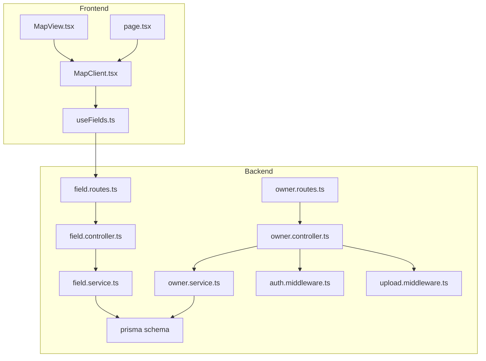
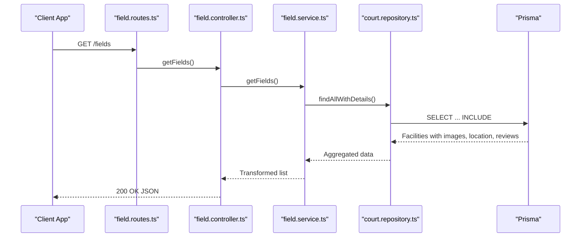
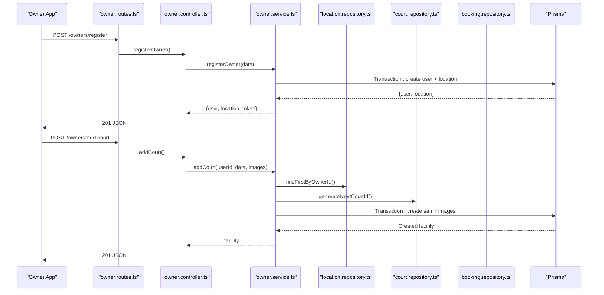
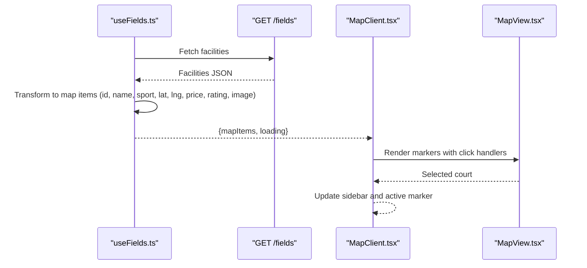
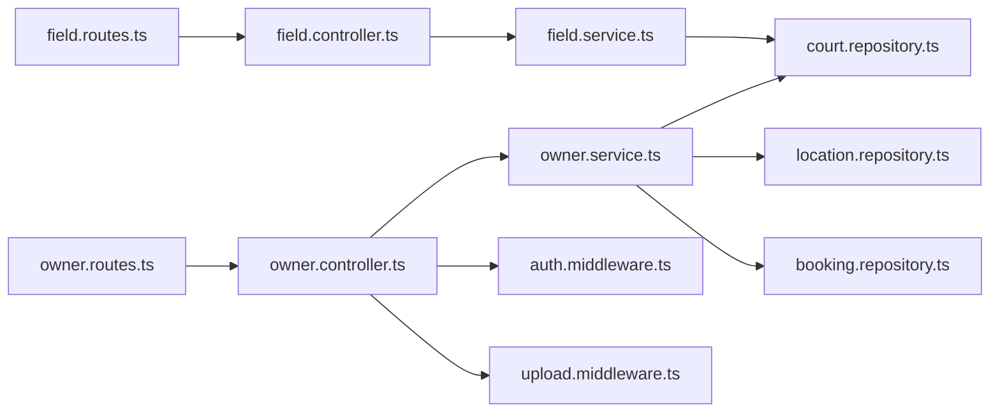

# Field & Facility API Endpoints

<cite>
**Referenced Files in This Document**
- [field.routes.ts](file://backend/src/routers/field.routes.ts)
- [field.controller.ts](file://backend/src/controllers/field.controller.ts)
- [field.service.ts](file://backend/src/services/field.service.ts)
- [court.repository.ts](file://backend/src/repositories/court.repository.ts)
- [location.repository.ts](file://backend/src/repositories/location.repository.ts)
- [owner.routes.ts](file://backend/src/routers/owner.routes.ts)
- [owner.controller.ts](file://backend/src/controllers/owner.controller.ts)
- [owner.service.ts](file://backend/src/services/owner.service.ts)
- [upload.middleware.ts](file://backend/src/middlewares/upload.middleware.ts)
- [auth.middleware.ts](file://backend/src/middlewares/auth.middleware.ts)
- [booking.repository.ts](file://backend/src/repositories/booking.repository.ts)
- [owner.type.ts](file://backend/src/types/owner.type.ts)
- [MapView.tsx](file://frontend/src/components/map/MapView.tsx)
- [MapClient.tsx](file://frontend/src/components/map/MapClient.tsx)
- [useFields.ts](file://frontend/src/hooks/useFields.ts)
- [page.tsx](file://frontend/src/app/(user)/map/page.tsx)
</cite>

## Table of Contents
1. [Introduction](#introduction)
2. [Project Structure](#project-structure)
3. [Core Components](#core-components)
4. [Architecture Overview](#architecture-overview)
5. [Detailed Component Analysis](#detailed-component-analysis)
6. [Dependency Analysis](#dependency-analysis)
7. [Performance Considerations](#performance-considerations)
8. [Troubleshooting Guide](#troubleshooting-guide)
9. [Conclusion](#conclusion)
10. [Appendices](#appendices)

## Introduction
This document provides comprehensive API documentation for Field and Facility management endpoints. It covers:
- Facility listing, search, and detail retrieval
- Facility creation, modification, and deletion for owners
- Search and filtering parameters, pagination support, and geographic location queries
- Image upload endpoints
- Facility status management
- Availability checking mechanisms
- Examples of complex queries and integration patterns for the interactive map interface

## Project Structure
The backend follows a layered architecture:
- Routers define endpoint routes
- Controllers handle HTTP requests and responses
- Services encapsulate business logic
- Repositories manage database operations
- Middlewares handle authentication and uploads
- Frontend integrates with the backend APIs for map and listing views

**Diagram sources**
- [field.routes.ts:1-5](file://backend/src/routers/field.routes.ts#L1-L5)
- [owner.routes.ts:1-23](file://backend/src/routers/owner.routes.ts#L1-L23)
- [field.controller.ts:1-11](file://backend/src/controllers/field.controller.ts#L1-L11)
- [owner.controller.ts:1-110](file://backend/src/controllers/owner.controller.ts#L1-L110)
- [field.service.ts:1-42](file://backend/src/services/field.service.ts#L1-L42)
- [owner.service.ts:1-148](file://backend/src/services/owner.service.ts#L1-L148)
- [auth.middleware.ts:1-28](file://backend/src/middlewares/auth.middleware.ts#L1-L28)
- [upload.middleware.ts:1-19](file://backend/src/middlewares/upload.middleware.ts#L1-L19)
- [useFields.ts:37-77](file://frontend/src/hooks/useFields.ts#L37-L77)
- [MapClient.tsx:1-45](file://frontend/src/components/map/MapClient.tsx#L1-L45)
- [MapView.tsx:41-62](file://frontend/src/components/map/MapView.tsx#L41-L62)
- [page.tsx](file://frontend/src/app/(user)/map/page.tsx#L1-L14)

**Section sources**
- [field.routes.ts:1-5](file://backend/src/routers/field.routes.ts#L1-L5)
- [owner.routes.ts:1-23](file://backend/src/routers/owner.routes.ts#L1-L23)
- [field.controller.ts:1-11](file://backend/src/controllers/field.controller.ts#L1-L11)
- [owner.controller.ts:1-110](file://backend/src/controllers/owner.controller.ts#L1-L110)
- [field.service.ts:1-42](file://backend/src/services/field.service.ts#L1-L42)
- [owner.service.ts:1-148](file://backend/src/services/owner.service.ts#L1-L148)
- [auth.middleware.ts:1-28](file://backend/src/middlewares/auth.middleware.ts#L1-L28)
- [upload.middleware.ts:1-19](file://backend/src/middlewares/upload.middleware.ts#L1-L19)
- [useFields.ts:37-77](file://frontend/src/hooks/useFields.ts#L37-L77)
- [MapClient.tsx:1-45](file://frontend/src/components/map/MapClient.tsx#L1-L45)
- [MapView.tsx:41-62](file://frontend/src/components/map/MapView.tsx#L41-L62)
- [page.tsx](file://frontend/src/app/(user)/map/page.tsx#L1-L14)

## Core Components
- Field listing endpoint: GET /fields
- Owner endpoints: registration, court CRUD, booking management
- Authentication middleware for protected routes
- Upload middleware for owner documents and court images
- Geographic data model for facilities

Key responsibilities:
- FieldService aggregates facility data and computes average ratings
- CourtRepository handles facility persistence and ID generation
- LocationRepository manages owner locations and facility associations
- OwnerService orchestrates owner registration, court creation, and booking updates
- Frontend hooks and components integrate with the backend for map and listing

**Section sources**
- [field.controller.ts:1-11](file://backend/src/controllers/field.controller.ts#L1-L11)
- [field.service.ts:1-42](file://backend/src/services/field.service.ts#L1-L42)
- [court.repository.ts:1-83](file://backend/src/repositories/court.repository.ts#L1-L83)
- [location.repository.ts:1-51](file://backend/src/repositories/location.repository.ts#L1-L51)
- [owner.controller.ts:1-110](file://backend/src/controllers/owner.controller.ts#L1-L110)
- [owner.service.ts:1-148](file://backend/src/services/owner.service.ts#L1-L148)

## Architecture Overview
The system uses Express routers mapped to controllers, which delegate to services. Services interact with repositories backed by Prisma ORM. Authentication and uploads are handled by dedicated middlewares. The frontend consumes the backend APIs to render map and listing views.

**Diagram sources**
- [field.routes.ts:1-5](file://backend/src/routers/field.routes.ts#L1-L5)
- [field.controller.ts:1-11](file://backend/src/controllers/field.controller.ts#L1-L11)
- [field.service.ts:1-42](file://backend/src/services/field.service.ts#L1-L42)
- [court.repository.ts:52-64](file://backend/src/repositories/court.repository.ts#L52-L64)

## Detailed Component Analysis

### Field Listing Endpoint
- Method: GET
- Path: /fields
- Purpose: Retrieve a list of facilities with aggregated details (average rating, representative image, location coordinates, pricing)
- Response shape: Array of facility objects with fields such as facility ID, name, sport type, location name, address, representative image, latitude/longitude, and hourly rate derived from half-hour rental price

Processing logic:
- Controller delegates to FieldService
- FieldService queries facilities with images, location, and review details
- Computes average star rating per facility
- Returns transformed list suitable for map and grid displays

Pagination and filtering:
- Current implementation returns all facilities without pagination or filters
- To add pagination, introduce query parameters for page and limit in the controller and repository

Geographic queries:
- Facilities include latitude and longitude for map rendering
- No radius-based proximity search is implemented yet

**Section sources**
- [field.routes.ts:1-5](file://backend/src/routers/field.routes.ts#L1-L5)
- [field.controller.ts:1-11](file://backend/src/controllers/field.controller.ts#L1-L11)
- [field.service.ts:1-42](file://backend/src/services/field.service.ts#L1-L42)
- [court.repository.ts:52-64](file://backend/src/repositories/court.repository.ts#L52-L64)
- [useFields.ts:37-77](file://frontend/src/hooks/useFields.ts#L37-L77)

### Owner Registration and Facility Management
Endpoints:
- POST /owners/register: Owner registration with document uploads
- GET /owners/my-courts: List owner’s facilities
- POST /owners/add-court: Add a new facility with images
- PUT /owners/update-court/:ma_san: Update facility details
- GET /owners/my-bookings: View bookings for owned facilities
- PATCH /owners/update-booking-status/:id: Update booking status

Authentication:
- All owner endpoints require a Bearer token validated by the authentication middleware

Uploads:
- Document uploads for owner registration use a field-specific storage configuration
- Court image uploads support up to 5 images

Facility creation flow:
- OwnerService generates user and location IDs, creates user and location records in a transaction
- Adds facility with computed ID and optional images in another transaction
- Returns created facility data

Facility update flow:
- Validates ownership before updating facility attributes
- Supports updating name, sport type, hourly price, and status

Booking management:
- Retrieves booking details for owner’s facilities
- Updates booking status with validation

**Diagram sources**
- [owner.routes.ts:1-23](file://backend/src/routers/owner.routes.ts#L1-L23)
- [owner.controller.ts:1-110](file://backend/src/controllers/owner.controller.ts#L1-L110)
- [owner.service.ts:1-148](file://backend/src/services/owner.service.ts#L1-L148)
- [location.repository.ts:1-51](file://backend/src/repositories/location.repository.ts#L1-L51)
- [court.repository.ts:66-80](file://backend/src/repositories/court.repository.ts#L66-L80)
- [booking.repository.ts:1-49](file://backend/src/repositories/booking.repository.ts#L1-L49)

**Section sources**
- [owner.routes.ts:1-23](file://backend/src/routers/owner.routes.ts#L1-L23)
- [owner.controller.ts:1-110](file://backend/src/controllers/owner.controller.ts#L1-L110)
- [owner.service.ts:1-148](file://backend/src/services/owner.service.ts#L1-L148)
- [location.repository.ts:1-51](file://backend/src/repositories/location.repository.ts#L1-L51)
- [court.repository.ts:66-80](file://backend/src/repositories/court.repository.ts#L66-L80)
- [booking.repository.ts:1-49](file://backend/src/repositories/booking.repository.ts#L1-L49)
- [upload.middleware.ts:1-19](file://backend/src/middlewares/upload.middleware.ts#L1-L19)
- [auth.middleware.ts:1-28](file://backend/src/middlewares/auth.middleware.ts#L1-L28)
- [owner.type.ts:1-17](file://backend/src/types/owner.type.ts#L1-L17)

### Authentication Middleware
- Validates Authorization header presence and format
- Verifies JWT token and attaches decoded user info to the request
- Returns 401 Unauthorized for invalid or missing tokens

Integration pattern:
- Apply to owner endpoints requiring owner identity
- Use AuthRequest type to access req.user safely

**Section sources**
- [auth.middleware.ts:1-28](file://backend/src/middlewares/auth.middleware.ts#L1-L28)

### Upload Middleware
- Cloudinary-backed storage for owner documents and court images
- Field-specific configuration for document uploads
- Array configuration for multiple court images

Integration pattern:
- Use uploadCCCD for owner registration document uploads
- Use uploadCourt for adding/updating facility images

**Section sources**
- [upload.middleware.ts:1-19](file://backend/src/middlewares/upload.middleware.ts#L1-L19)

### Frontend Integration Patterns
- useFields hook fetches facility listings and transforms them for map and grid components
- MapClient renders map markers and sidebar based on filtered facilities
- MapView displays clickable markers and re-centers on selection
- Map page wraps the map client and sets metadata

**Diagram sources**
- [useFields.ts:37-77](file://frontend/src/hooks/useFields.ts#L37-L77)
- [field.routes.ts:1-5](file://backend/src/routers/field.routes.ts#L1-L5)
- [MapClient.tsx:1-45](file://frontend/src/components/map/MapClient.tsx#L1-L45)
- [MapView.tsx:41-62](file://frontend/src/components/map/MapView.tsx#L41-L62)

**Section sources**
- [useFields.ts:37-77](file://frontend/src/hooks/useFields.ts#L37-L77)
- [MapClient.tsx:1-45](file://frontend/src/components/map/MapClient.tsx#L1-L45)
- [MapView.tsx:41-62](file://frontend/src/components/map/MapView.tsx#L41-L62)
- [page.tsx](file://frontend/src/app/(user)/map/page.tsx#L1-L14)

## Dependency Analysis
- Controllers depend on services for business logic
- Services depend on repositories for data access
- Repositories depend on Prisma ORM for database operations
- Owner endpoints depend on authentication and upload middlewares
- Frontend depends on backend endpoints for data

**Diagram sources**
- [field.routes.ts:1-5](file://backend/src/routers/field.routes.ts#L1-L5)
- [field.controller.ts:1-11](file://backend/src/controllers/field.controller.ts#L1-L11)
- [field.service.ts:1-42](file://backend/src/services/field.service.ts#L1-L42)
- [court.repository.ts:1-83](file://backend/src/repositories/court.repository.ts#L1-L83)
- [owner.routes.ts:1-23](file://backend/src/routers/owner.routes.ts#L1-L23)
- [owner.controller.ts:1-110](file://backend/src/controllers/owner.controller.ts#L1-L110)
- [owner.service.ts:1-148](file://backend/src/services/owner.service.ts#L1-L148)
- [location.repository.ts:1-51](file://backend/src/repositories/location.repository.ts#L1-L51)
- [booking.repository.ts:1-49](file://backend/src/repositories/booking.repository.ts#L1-L49)
- [auth.middleware.ts:1-28](file://backend/src/middlewares/auth.middleware.ts#L1-L28)
- [upload.middleware.ts:1-19](file://backend/src/middlewares/upload.middleware.ts#L1-L19)

**Section sources**
- [field.routes.ts:1-5](file://backend/src/routers/field.routes.ts#L1-L5)
- [field.controller.ts:1-11](file://backend/src/controllers/field.controller.ts#L1-L11)
- [field.service.ts:1-42](file://backend/src/services/field.service.ts#L1-L42)
- [court.repository.ts:1-83](file://backend/src/repositories/court.repository.ts#L1-L83)
- [owner.routes.ts:1-23](file://backend/src/routers/owner.routes.ts#L1-L23)
- [owner.controller.ts:1-110](file://backend/src/controllers/owner.controller.ts#L1-L110)
- [owner.service.ts:1-148](file://backend/src/services/owner.service.ts#L1-L148)
- [location.repository.ts:1-51](file://backend/src/repositories/location.repository.ts#L1-L51)
- [booking.repository.ts:1-49](file://backend/src/repositories/booking.repository.ts#L1-L49)
- [auth.middleware.ts:1-28](file://backend/src/middlewares/auth.middleware.ts#L1-L28)
- [upload.middleware.ts:1-19](file://backend/src/middlewares/upload.middleware.ts#L1-L19)

## Performance Considerations
- Field listing currently returns all facilities; consider implementing pagination (page, limit) and filtering (sport type, price range, rating threshold) to reduce payload size
- Aggregation of average ratings occurs in memory; for large datasets, compute averages at the database level
- Image URLs are returned; consider lazy-loading and CDN optimization for map rendering
- Authentication middleware performs token verification on each protected request; ensure efficient token caching if needed

## Troubleshooting Guide
Common errors and resolutions:
- Unauthorized access: Ensure Authorization header with Bearer token is present and valid
- Missing required fields for owner registration: Verify document uploads and required form fields
- Facility not found or insufficient permissions: Confirm facility ID and ownership association
- Booking not found or insufficient permissions: Confirm booking detail ID and ownership association
- Upload failures: Verify Cloudinary configuration and allowed formats

**Section sources**
- [auth.middleware.ts:1-28](file://backend/src/middlewares/auth.middleware.ts#L1-L28)
- [owner.controller.ts:1-110](file://backend/src/controllers/owner.controller.ts#L1-L110)
- [owner.service.ts:1-148](file://backend/src/services/owner.service.ts#L1-L148)
- [upload.middleware.ts:1-19](file://backend/src/middlewares/upload.middleware.ts#L1-L19)

## Conclusion
The Field and Facility API provides a solid foundation for listing, managing, and visualizing facilities. Current capabilities include owner-driven CRUD operations, document and image uploads, and basic facility listing with geographic data. Enhancements such as pagination, advanced filtering, and geographic search would improve scalability and user experience.

## Appendices

### API Reference

- GET /fields
  - Description: Retrieve all facilities with aggregated details
  - Response: Array of facility objects
  - Example response fields: facility ID, name, sport type, location name, address, representative image, latitude, longitude, hourly price

- POST /owners/register
  - Description: Register a new owner with documents and initial location
  - Body: Owner registration data and uploaded documents
  - Response: Created user, location, and token
  - Uploads: Documents for identification

- GET /owners/my-courts
  - Description: List all facilities owned by the authenticated owner
  - Response: Array of facilities

- POST /owners/add-court
  - Description: Add a new facility under the owner’s location
  - Body: Facility details and optional images
  - Response: Created facility
  - Uploads: Up to 5 images

- PUT /owners/update-court/:ma_san
  - Description: Update facility details for the authenticated owner
  - Path params: Facility ID
  - Body: Updated facility fields
  - Response: Updated facility

- GET /owners/my-bookings
  - Description: View all bookings for the owner’s facilities
  - Response: Array of booking details

- PATCH /owners/update-booking-status/:id
  - Description: Update booking status for a booking under the owner’s facilities
  - Path params: Booking detail ID
  - Body: New status
  - Response: Updated booking

### Filtering and Search Parameters
- Current implementation: No query parameters for filtering or pagination
- Recommended additions:
  - Pagination: page, limit
  - Filtering: sport type, price range, rating threshold
  - Geographic queries: radius, bounding box, or proximity sorting

### Geographic Data Model
- Facilities include latitude and longitude for map rendering
- Owner locations are linked to facilities via location ID

**Section sources**
- [field.service.ts:1-42](file://backend/src/services/field.service.ts#L1-L42)
- [court.repository.ts:52-64](file://backend/src/repositories/court.repository.ts#L52-L64)
- [location.repository.ts:1-51](file://backend/src/repositories/location.repository.ts#L1-L51)
- [useFields.ts:37-77](file://frontend/src/hooks/useFields.ts#L37-L77)