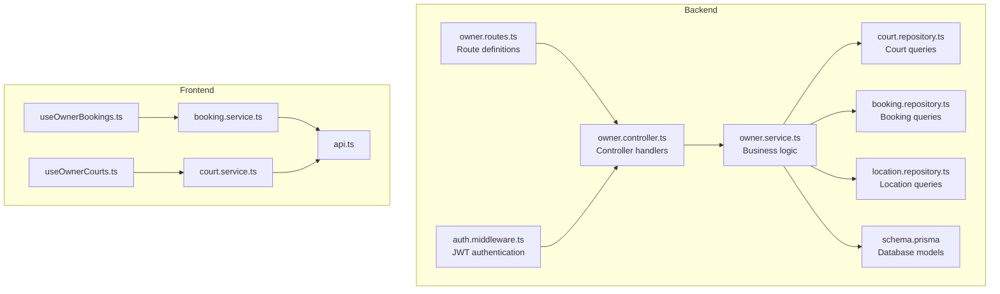
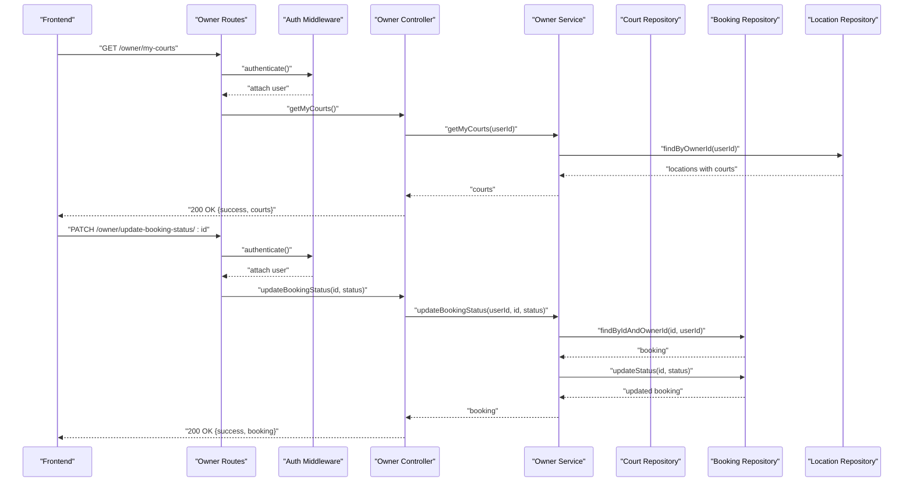
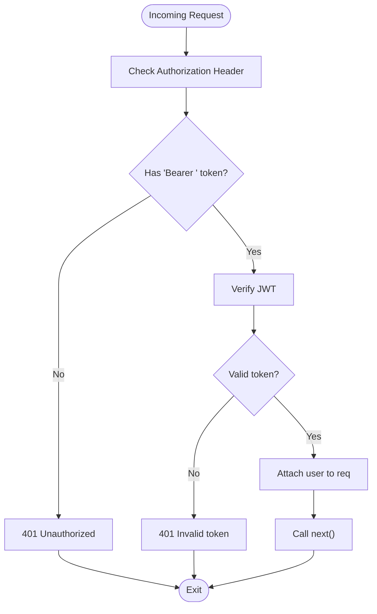
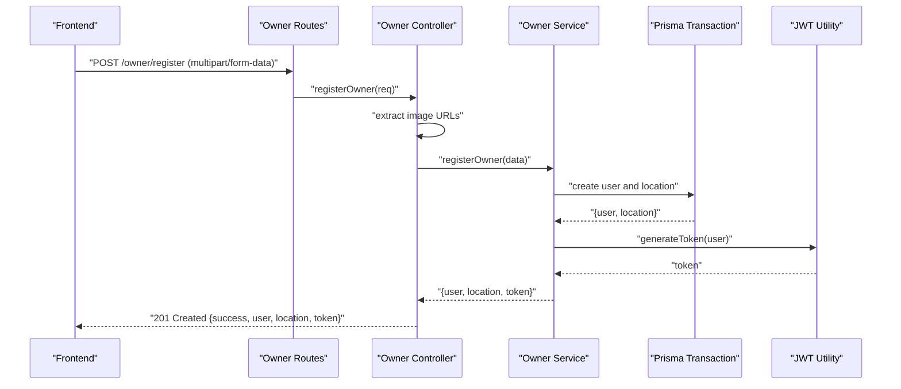
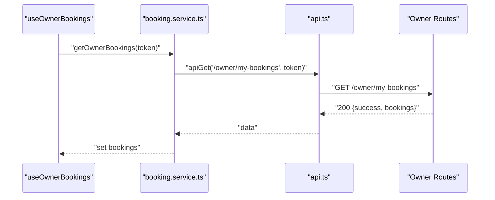
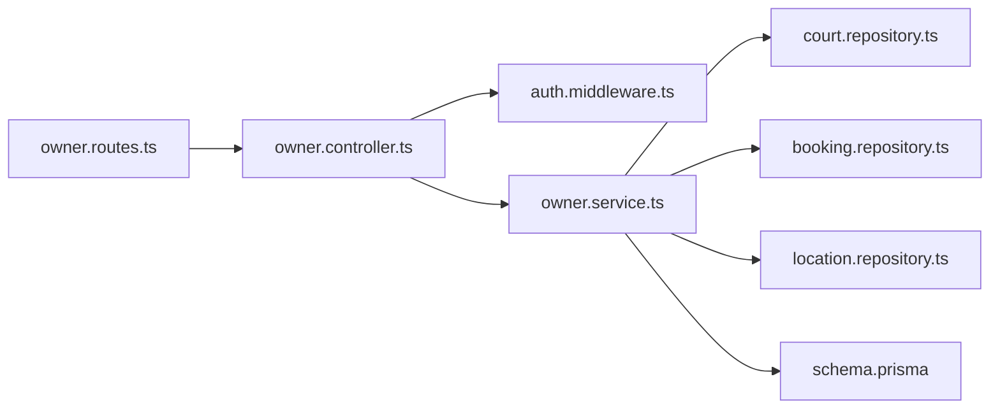
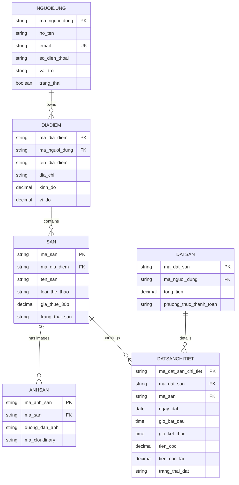

# Owner API Endpoints

<cite>
**Referenced Files in This Document**
- [owner.routes.ts](file://backend/src/routers/owner.routes.ts)
- [owner.controller.ts](file://backend/src/controllers/owner.controller.ts)
- [owner.service.ts](file://backend/src/services/owner.service.ts)
- [auth.middleware.ts](file://backend/src/middlewares/auth.middleware.ts)
- [court.repository.ts](file://backend/src/repositories/court.repository.ts)
- [booking.repository.ts](file://backend/src/repositories/booking.repository.ts)
- [location.repository.ts](file://backend/src/repositories/location.repository.ts)
- [schema.prisma](file://backend/prisma/schema.prisma)
- [booking.service.ts](file://frontend/src/services/booking.service.ts)
- [court.service.ts](file://frontend/src/services/court.service.ts)
- [api.ts](file://frontend/src/services/api.ts)
- [useOwnerBookings.ts](file://frontend/src/hooks/useOwnerBookings.ts)
- [useOwnerCourts.ts](file://frontend/src/hooks/useOwnerCourts.ts)
- [booking.types.ts](file://frontend/src/types/booking.types.ts)
- [court.types.ts](file://frontend/src/types/court.types.ts)
</cite>

## Table of Contents
1. [Introduction](#introduction)
2. [Project Structure](#project-structure)
3. [Core Components](#core-components)
4. [Architecture Overview](#architecture-overview)
5. [Detailed Component Analysis](#detailed-component-analysis)
6. [Dependency Analysis](#dependency-analysis)
7. [Performance Considerations](#performance-considerations)
8. [Troubleshooting Guide](#troubleshooting-guide)
9. [Conclusion](#conclusion)
10. [Appendices](#appendices)

## Introduction
This document provides comprehensive API documentation for Owner management endpoints. It covers owner-specific functionality including facility management, booking handling, and dashboard-related operations. The documented endpoints enable owner registration, facility listing management, booking approval/rejection, and status control. It also details booking management endpoints for viewing, updating, and managing reservations, along with facility status management, pricing configuration, and availability scheduling endpoints. Finally, it outlines owner-only authenticated requests and integration patterns with the owner management interface.

## Project Structure
The Owner API is implemented in the backend using Express routes, controllers, services, and repositories, with Prisma ORM for data persistence. Frontend integration is handled via React hooks and service wrappers that attach Bearer tokens for authenticated requests.

**Diagram sources**
- [owner.routes.ts:1-23](file://backend/src/routers/owner.routes.ts#L1-L23)
- [owner.controller.ts:1-110](file://backend/src/controllers/owner.controller.ts#L1-L110)
- [owner.service.ts:1-148](file://backend/src/services/owner.service.ts#L1-L148)
- [auth.middleware.ts:1-28](file://backend/src/middlewares/auth.middleware.ts#L1-L28)
- [court.repository.ts:1-83](file://backend/src/repositories/court.repository.ts#L1-L83)
- [booking.repository.ts:1-49](file://backend/src/repositories/booking.repository.ts#L1-L49)
- [location.repository.ts:1-51](file://backend/src/repositories/location.repository.ts#L1-L51)
- [schema.prisma:1-126](file://backend/prisma/schema.prisma#L1-L126)
- [booking.service.ts:1-13](file://frontend/src/services/booking.service.ts#L1-L13)
- [court.service.ts:1-26](file://frontend/src/services/court.service.ts#L1-L26)
- [api.ts:1-78](file://frontend/src/services/api.ts#L1-L78)
- [useOwnerBookings.ts:1-67](file://frontend/src/hooks/useOwnerBookings.ts#L1-L67)
- [useOwnerCourts.ts:1-95](file://frontend/src/hooks/useOwnerCourts.ts#L1-L95)

**Section sources**
- [owner.routes.ts:1-23](file://backend/src/routers/owner.routes.ts#L1-L23)
- [owner.controller.ts:1-110](file://backend/src/controllers/owner.controller.ts#L1-L110)
- [owner.service.ts:1-148](file://backend/src/services/owner.service.ts#L1-L148)
- [auth.middleware.ts:1-28](file://backend/src/middlewares/auth.middleware.ts#L1-L28)
- [court.repository.ts:1-83](file://backend/src/repositories/court.repository.ts#L1-L83)
- [booking.repository.ts:1-49](file://backend/src/repositories/booking.repository.ts#L1-L49)
- [location.repository.ts:1-51](file://backend/src/repositories/location.repository.ts#L1-L51)
- [schema.prisma:1-126](file://backend/prisma/schema.prisma#L1-L126)
- [booking.service.ts:1-13](file://frontend/src/services/booking.service.ts#L1-L13)
- [court.service.ts:1-26](file://frontend/src/services/court.service.ts#L1-L26)
- [api.ts:1-78](file://frontend/src/services/api.ts#L1-L78)
- [useOwnerBookings.ts:1-67](file://frontend/src/hooks/useOwnerBookings.ts#L1-L67)
- [useOwnerCourts.ts:1-95](file://frontend/src/hooks/useOwnerCourts.ts#L1-L95)

## Core Components
- Authentication middleware enforces Bearer token validation for owner-only endpoints.
- Owner controller exposes endpoints for owner registration, facility listing, booking retrieval, and booking status updates.
- Owner service orchestrates business logic, coordinates repositories, and performs transactions for atomic operations.
- Repositories encapsulate Prisma queries for courts, bookings, and locations.
- Frontend services wrap HTTP requests and integrate with React hooks for state management.

Key responsibilities:
- Owner registration: Validates uniqueness of email/phone, hashes password, creates user and location records, and returns a JWT token.
- Facility management: Retrieves owner’s courts, adds new courts with images, and updates court details including pricing and status.
- Booking management: Lists owner’s bookings and updates booking statuses with permission checks.
- Status control: Facilities can be toggled between operational and maintenance states.

**Section sources**
- [auth.middleware.ts:9-27](file://backend/src/middlewares/auth.middleware.ts#L9-L27)
- [owner.controller.ts:6-40](file://backend/src/controllers/owner.controller.ts#L6-L40)
- [owner.controller.ts:42-92](file://backend/src/controllers/owner.controller.ts#L42-L92)
- [owner.controller.ts:94-109](file://backend/src/controllers/owner.controller.ts#L94-L109)
- [owner.service.ts:12-64](file://backend/src/services/owner.service.ts#L12-L64)
- [owner.service.ts:66-70](file://backend/src/services/owner.service.ts#L66-L70)
- [owner.service.ts:72-111](file://backend/src/services/owner.service.ts#L72-L111)
- [owner.service.ts:113-129](file://backend/src/services/owner.service.ts#L113-L129)
- [owner.service.ts:131-133](file://backend/src/services/owner.service.ts#L131-L133)
- [owner.service.ts:135-144](file://backend/src/services/owner.service.ts#L135-L144)

## Architecture Overview
The Owner API follows a layered architecture:
- Routes define endpoint contracts and bind middleware.
- Controllers handle request parsing, validation, and response formatting.
- Services encapsulate domain logic and orchestrate repository operations.
- Repositories abstract database queries and maintain referential integrity.
- Middleware enforces authentication and authorization.

**Diagram sources**
- [owner.routes.ts:15-20](file://backend/src/routers/owner.routes.ts#L15-L20)
- [auth.middleware.ts:9-27](file://backend/src/middlewares/auth.middleware.ts#L9-L27)
- [owner.controller.ts:42-50](file://backend/src/controllers/owner.controller.ts#L42-L50)
- [owner.controller.ts:84-92](file://backend/src/controllers/owner.controller.ts#L84-L92)
- [owner.controller.ts:94-109](file://backend/src/controllers/owner.controller.ts#L94-L109)
- [owner.service.ts:66-70](file://backend/src/services/owner.service.ts#L66-L70)
- [owner.service.ts:131-133](file://backend/src/services/owner.service.ts#L131-L133)
- [owner.service.ts:135-144](file://backend/src/services/owner.service.ts#L135-L144)
- [court.repository.ts:10-17](file://backend/src/repositories/court.repository.ts#L10-L17)
- [booking.repository.ts:27-38](file://backend/src/repositories/booking.repository.ts#L27-L38)

## Detailed Component Analysis

### Authentication and Authorization
- All owner endpoints require a Bearer token attached to the Authorization header.
- The middleware validates token presence and decodes the payload to attach user identity to the request.

**Diagram sources**
- [auth.middleware.ts:9-27](file://backend/src/middlewares/auth.middleware.ts#L9-L27)

**Section sources**
- [auth.middleware.ts:9-27](file://backend/src/middlewares/auth.middleware.ts#L9-L27)

### Owner Registration Endpoint
- Endpoint: POST /owner/register
- Purpose: Registers a new owner with personal details, documents, and facility location.
- Request:
  - Form fields: personal info, contact info, password, facility name, and address.
  - Uploads: front and back images of ID document.
- Response: Returns success flag, user info, location, and a JWT token.
- Validation: Checks for missing ID images and duplicate email/phone.

**Diagram sources**
- [owner.routes.ts:15](file://backend/src/routers/owner.routes.ts#L15)
- [owner.controller.ts:6-40](file://backend/src/controllers/owner.controller.ts#L6-L40)
- [owner.service.ts:12-64](file://backend/src/services/owner.service.ts#L12-L64)

**Section sources**
- [owner.routes.ts:15](file://backend/src/routers/owner.routes.ts#L15)
- [owner.controller.ts:6-40](file://backend/src/controllers/owner.controller.ts#L6-L40)
- [owner.service.ts:12-64](file://backend/src/services/owner.service.ts#L12-L64)

### Facility Management Endpoints

#### Get My Courts
- Endpoint: GET /owner/my-courts
- Purpose: Retrieve all courts associated with the owner’s location(s).
- Request: Requires Bearer token.
- Response: Returns success flag and array of courts.

**Section sources**
- [owner.routes.ts:16](file://backend/src/routers/owner.routes.ts#L16)
- [owner.controller.ts:42-50](file://backend/src/controllers/owner.controller.ts#L42-L50)
- [owner.service.ts:66-70](file://backend/src/services/owner.service.ts#L66-L70)
- [location.repository.ts:4-14](file://backend/src/repositories/location.repository.ts#L4-L14)

#### Add Court
- Endpoint: POST /owner/add-court
- Purpose: Add a new court under the owner’s location with optional images.
- Request: Bearer token + form data (name, sport type, hourly rate, optional status) + images.
- Response: Returns success flag, message, and created court.

**Section sources**
- [owner.routes.ts:17](file://backend/src/routers/owner.routes.ts#L17)
- [owner.controller.ts:52-65](file://backend/src/controllers/owner.controller.ts#L52-L65)
- [owner.service.ts:72-111](file://backend/src/services/owner.service.ts#L72-L111)
- [location.repository.ts:17-21](file://backend/src/repositories/location.repository.ts#L17-L21)
- [court.repository.ts:66-79](file://backend/src/repositories/court.repository.ts#L66-L79)

#### Update Court
- Endpoint: PUT /owner/update-court/:ma_san
- Purpose: Update court details (name, sport type, hourly rate, status).
- Request: Bearer token + path param (court ID) + JSON body.
- Response: Returns success flag, message, and updated court.

**Section sources**
- [owner.routes.ts:18](file://backend/src/routers/owner.routes.ts#L18)
- [owner.controller.ts:67-82](file://backend/src/controllers/owner.controller.ts#L67-L82)
- [owner.service.ts:113-129](file://backend/src/services/owner.service.ts#L113-L129)
- [court.repository.ts:10-17](file://backend/src/repositories/court.repository.ts#L10-L17)

### Booking Management Endpoints

#### Get My Bookings
- Endpoint: GET /owner/my-bookings
- Purpose: List all bookings for courts owned by the current user.
- Request: Bearer token.
- Response: Returns success flag and array of booking details with user and court info.

**Section sources**
- [owner.routes.ts:19](file://backend/src/routers/owner.routes.ts#L19)
- [owner.controller.ts:84-92](file://backend/src/controllers/owner.controller.ts#L84-L92)
- [owner.service.ts:131-133](file://backend/src/services/owner.service.ts#L131-L133)
- [booking.repository.ts:4-25](file://backend/src/repositories/booking.repository.ts#L4-L25)

#### Update Booking Status
- Endpoint: PATCH /owner/update-booking-status/:id
- Purpose: Approve, reject, or manage booking status with permission checks.
- Request: Bearer token + path param (booking detail ID) + JSON body with status.
- Response: Returns success flag, message, and updated booking.

**Section sources**
- [owner.routes.ts:20](file://backend/src/routers/owner.routes.ts#L20)
- [owner.controller.ts:94-109](file://backend/src/controllers/owner.controller.ts#L94-L109)
- [owner.service.ts:135-144](file://backend/src/services/owner.service.ts#L135-L144)
- [booking.repository.ts:27-45](file://backend/src/repositories/booking.repository.ts#L27-L45)

### Frontend Integration Patterns
- Authentication: Frontend attaches Authorization: Bearer <token> to all owner endpoints.
- Hooks: useOwnerBookings and useOwnerCourts encapsulate data fetching and state updates.
- Services: bookingService and courtService abstract HTTP calls and map to typed responses.

**Diagram sources**
- [useOwnerBookings.ts:14-33](file://frontend/src/hooks/useOwnerBookings.ts#L14-L33)
- [booking.service.ts:5-7](file://frontend/src/services/booking.service.ts#L5-L7)
- [api.ts:19-27](file://frontend/src/services/api.ts#L19-L27)
- [owner.routes.ts:19](file://backend/src/routers/owner.routes.ts#L19)

**Section sources**
- [booking.service.ts:1-13](file://frontend/src/services/booking.service.ts#L1-L13)
- [court.service.ts:1-26](file://frontend/src/services/court.service.ts#L1-L26)
- [api.ts:1-78](file://frontend/src/services/api.ts#L1-L78)
- [useOwnerBookings.ts:1-67](file://frontend/src/hooks/useOwnerBookings.ts#L1-L67)
- [useOwnerCourts.ts:1-95](file://frontend/src/hooks/useOwnerCourts.ts#L1-L95)

## Dependency Analysis
Owner endpoints depend on:
- Authentication middleware for Bearer token validation.
- Owner controller for request handling and response formatting.
- Owner service for business logic and repository coordination.
- Repositories for Prisma queries and transactions.
- Prisma schema for model definitions and constraints.

**Diagram sources**
- [owner.routes.ts:1-23](file://backend/src/routers/owner.routes.ts#L1-L23)
- [owner.controller.ts:1-110](file://backend/src/controllers/owner.controller.ts#L1-L110)
- [auth.middleware.ts:1-28](file://backend/src/middlewares/auth.middleware.ts#L1-L28)
- [owner.service.ts:1-148](file://backend/src/services/owner.service.ts#L1-L148)
- [court.repository.ts:1-83](file://backend/src/repositories/court.repository.ts#L1-L83)
- [booking.repository.ts:1-49](file://backend/src/repositories/booking.repository.ts#L1-L49)
- [location.repository.ts:1-51](file://backend/src/repositories/location.repository.ts#L1-L51)
- [schema.prisma:1-126](file://backend/prisma/schema.prisma#L1-L126)

**Section sources**
- [owner.routes.ts:1-23](file://backend/src/routers/owner.routes.ts#L1-L23)
- [owner.controller.ts:1-110](file://backend/src/controllers/owner.controller.ts#L1-L110)
- [owner.service.ts:1-148](file://backend/src/services/owner.service.ts#L1-L148)
- [court.repository.ts:1-83](file://backend/src/repositories/court.repository.ts#L1-L83)
- [booking.repository.ts:1-49](file://backend/src/repositories/booking.repository.ts#L1-L49)
- [location.repository.ts:1-51](file://backend/src/repositories/location.repository.ts#L1-L51)
- [schema.prisma:1-126](file://backend/prisma/schema.prisma#L1-L126)

## Performance Considerations
- Use pagination for listing large sets of bookings or courts when extending endpoints.
- Minimize N+1 queries by leveraging Prisma’s include patterns already present in repositories.
- Cache frequently accessed facility images and metadata at the application level if needed.
- Batch operations for image uploads and updates to reduce round trips.

## Troubleshooting Guide
Common issues and resolutions:
- Unauthorized: Ensure Authorization header includes a valid Bearer token.
- Missing images during registration: Verify both front and back ID image uploads are present.
- Not found errors: Confirm resource ownership (court or booking belongs to the authenticated owner).
- Duplicate email/phone: Registration fails if email or phone already exists.

**Section sources**
- [auth.middleware.ts:12-19](file://backend/src/middlewares/auth.middleware.ts#L12-L19)
- [owner.controller.ts:15-17](file://backend/src/controllers/owner.controller.ts#L15-L17)
- [owner.service.ts:18-21](file://backend/src/services/owner.service.ts#L18-L21)
- [owner.service.ts:119-121](file://backend/src/services/owner.service.ts#L119-L121)
- [owner.service.ts:139-141](file://backend/src/services/owner.service.ts#L139-L141)

## Conclusion
The Owner API provides a robust set of endpoints for managing facilities and bookings with strong authentication and authorization controls. The backend architecture cleanly separates concerns across routes, controllers, services, and repositories, while the frontend integrates seamlessly via typed services and hooks. Extending the API with dashboard endpoints and advanced reporting would build upon the existing foundation.

## Appendices

### API Definitions

- POST /owner/register
  - Headers: Content-Type: multipart/form-data
  - Body: personal info, contact info, password, facility name, address, front/back ID images
  - Response: success, user, location, token

- GET /owner/my-courts
  - Headers: Authorization: Bearer <token>
  - Response: success, courts

- POST /owner/add-court
  - Headers: Authorization: Bearer <token>
  - Body: form fields (name, sport type, hourly rate, optional status) + images
  - Response: success, message, court

- PUT /owner/update-court/:ma_san
  - Headers: Authorization: Bearer <token>
  - Path params: ma_san (court ID)
  - Body: JSON (name, sport type, hourly rate, status)
  - Response: success, message, court

- GET /owner/my-bookings
  - Headers: Authorization: Bearer <token>
  - Response: success, bookings

- PATCH /owner/update-booking-status/:id
  - Headers: Authorization: Bearer <token>
  - Path params: id (booking detail ID)
  - Body: JSON { status }
  - Response: success, message, booking

### Data Models

**Diagram sources**
- [schema.prisma:10-126](file://backend/prisma/schema.prisma#L10-L126)

### Frontend Types

- BookingDetail fields: identifiers, dates/times, fees, status, nested court and user info.
- OwnerBookingsResponse: success flag and bookings array.
- UpdateBookingStatusResponse: success flag, message, and updated booking object.
- OwnerCourt fields: identifiers, name, sport type, status, hourly rate, optional images.
- OwnerCourtsResponse: success flag and courts array.
- AddCourtResponse and UpdateCourtResponse: success flag, message, and modified entity.

**Section sources**
- [booking.types.ts:3-37](file://frontend/src/types/booking.types.ts#L3-L37)
- [court.types.ts:54-82](file://frontend/src/types/court.types.ts#L54-L82)