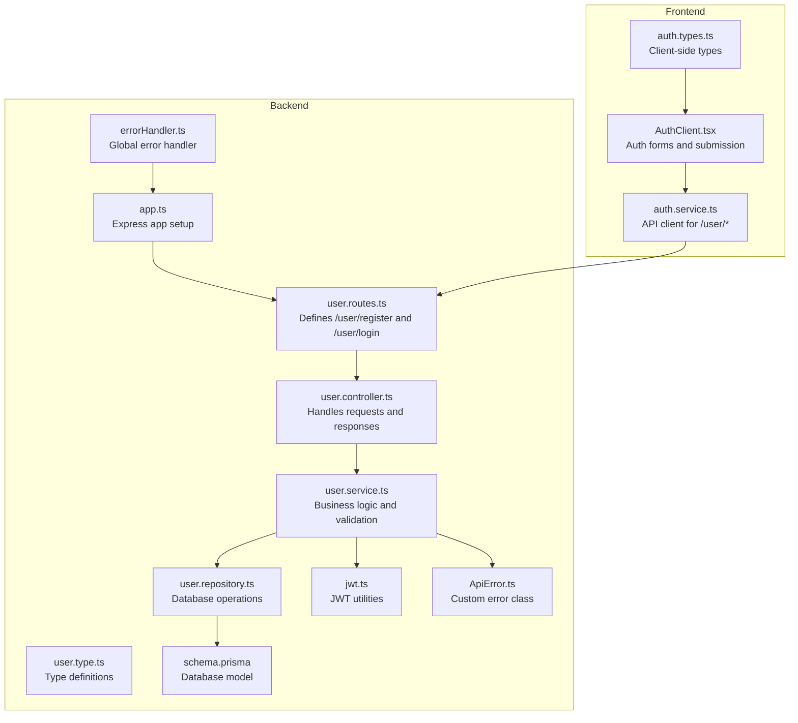
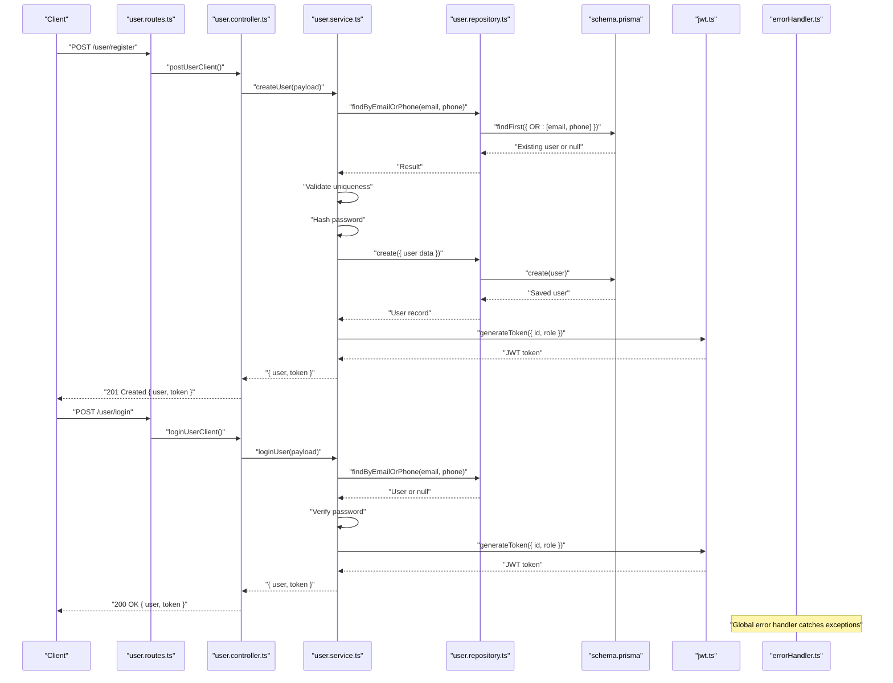
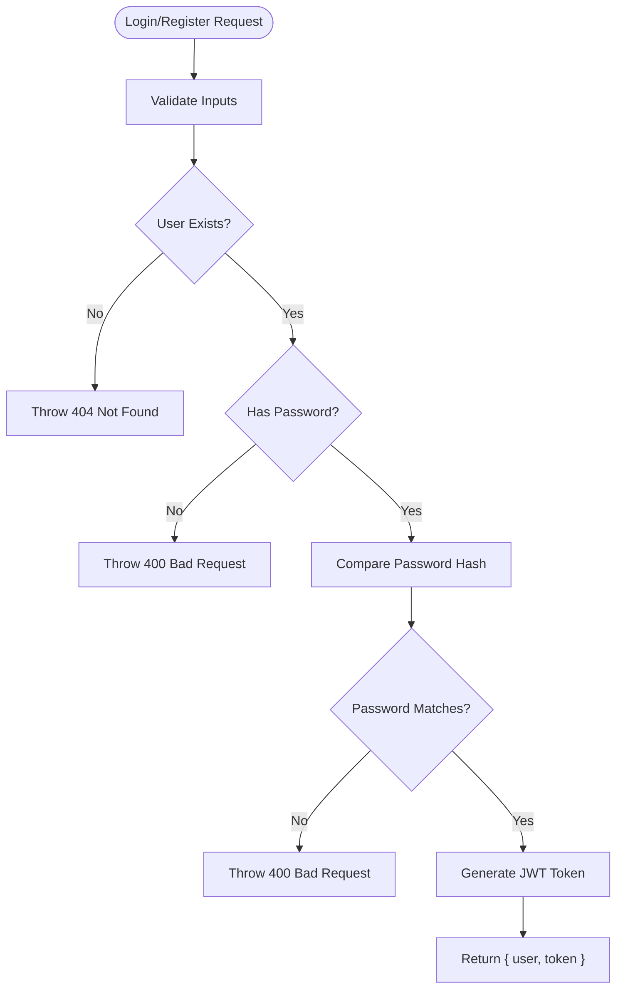
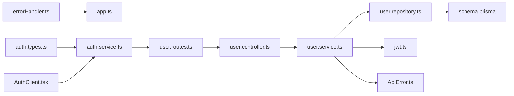

# User API Endpoints

<cite>
**Referenced Files in This Document**
- [user.routes.ts](file://backend/src/routers/user.routes.ts)
- [user.controller.ts](file://backend/src/controllers/user.controller.ts)
- [user.service.ts](file://backend/src/services/user.service.ts)
- [user.repository.ts](file://backend/src/repositories/user.repository.ts)
- [user.type.ts](file://backend/src/types/user.type.ts)
- [jwt.ts](file://backend/src/utils/jwt.ts)
- [ApiError.ts](file://backend/src/utils/ApiError.ts)
- [errorHandler.ts](file://backend/src/middlewares/errorHandler.ts)
- [app.ts](file://backend/src/app.ts)
- [schema.prisma](file://backend/prisma/schema.prisma)
- [auth.service.ts](file://frontend/src/services/auth.service.ts)
- [auth.types.ts](file://frontend/src/types/auth.types.ts)
- [AuthClient.tsx](file://frontend/src/components/auth/AuthClient.tsx)
</cite>

## Table of Contents
1. [Introduction](#introduction)
2. [Project Structure](#project-structure)
3. [Core Components](#core-components)
4. [Architecture Overview](#architecture-overview)
5. [Detailed Component Analysis](#detailed-component-analysis)
6. [Dependency Analysis](#dependency-analysis)
7. [Performance Considerations](#performance-considerations)
8. [Troubleshooting Guide](#troubleshooting-guide)
9. [Conclusion](#conclusion)
10. [Appendices](#appendices)

## Introduction
This document provides comprehensive API documentation for User management endpoints focused on registration and login. It covers request/response schemas, authentication requirements, validation rules, error handling patterns, success responses, and common failure scenarios. Practical cURL examples and JSON payload samples are included for both POST /user/register and POST /user/login endpoints.

## Project Structure
The user-related functionality is implemented in the backend under the src directory with clear separation of concerns:
- Routes define the endpoint URLs and bind them to controller handlers.
- Controllers orchestrate request handling and response formatting.
- Services encapsulate business logic, including validation, hashing, and token generation.
- Repositories abstract database operations.
- Types define request/response contracts.
- Utilities provide JWT token generation and centralized error handling.
- Middleware integrates global error handling into the Express application.
- Frontend services consume the API and prepare payloads.

**Diagram sources**
- [user.routes.ts](file://backend/src/routers/user.routes.ts)
- [user.controller.ts](file://backend/src/controllers/user.controller.ts)
- [user.service.ts](file://backend/src/services/user.service.ts)
- [user.repository.ts](file://backend/src/repositories/user.repository.ts)
- [user.type.ts](file://backend/src/types/user.type.ts)
- [jwt.ts](file://backend/src/utils/jwt.ts)
- [ApiError.ts](file://backend/src/utils/ApiError.ts)
- [errorHandler.ts](file://backend/src/middlewares/errorHandler.ts)
- [app.ts](file://backend/src/app.ts)
- [schema.prisma](file://backend/prisma/schema.prisma)
- [auth.service.ts](file://frontend/src/services/auth.service.ts)
- [auth.types.ts](file://frontend/src/types/auth.types.ts)
- [AuthClient.tsx](file://frontend/src/components/auth/AuthClient.tsx)

**Section sources**
- [user.routes.ts](file://backend/src/routers/user.routes.ts)
- [user.controller.ts](file://backend/src/controllers/user.controller.ts)
- [user.service.ts](file://backend/src/services/user.service.ts)
- [user.repository.ts](file://backend/src/repositories/user.repository.ts)
- [user.type.ts](file://backend/src/types/user.type.ts)
- [jwt.ts](file://backend/src/utils/jwt.ts)
- [ApiError.ts](file://backend/src/utils/ApiError.ts)
- [errorHandler.ts](file://backend/src/middlewares/errorHandler.ts)
- [app.ts](file://backend/src/app.ts)
- [schema.prisma](file://backend/prisma/schema.prisma)
- [auth.service.ts](file://frontend/src/services/auth.service.ts)
- [auth.types.ts](file://frontend/src/types/auth.types.ts)
- [AuthClient.tsx](file://frontend/src/components/auth/AuthClient.tsx)

## Core Components
- Endpoints
  - POST /user/register: Creates a new user account.
  - POST /user/login: Authenticates an existing user and returns a JWT token.
- Authentication
  - JWT token generation with expiration configured in the backend.
  - Token returned on successful registration and login.
- Validation
  - Email and phone uniqueness enforced at the service level.
  - Password hashing performed before persistence.
  - Database constraints enforce unique email and phone at the schema level.
- Error Handling
  - Centralized error handling middleware converts errors to structured JSON responses.
  - Custom ApiError class supports explicit status codes and messages.

**Section sources**
- [user.routes.ts](file://backend/src/routers/user.routes.ts)
- [user.controller.ts](file://backend/src/controllers/user.controller.ts)
- [user.service.ts](file://backend/src/services/user.service.ts)
- [user.repository.ts](file://backend/src/repositories/user.repository.ts)
- [user.type.ts](file://backend/src/types/user.type.ts)
- [jwt.ts](file://backend/src/utils/jwt.ts)
- [ApiError.ts](file://backend/src/utils/ApiError.ts)
- [errorHandler.ts](file://backend/src/middlewares/errorHandler.ts)
- [schema.prisma](file://backend/prisma/schema.prisma)

## Architecture Overview
The request lifecycle for user registration and login follows a layered architecture:
- Route binding maps HTTP endpoints to controller handlers.
- Controllers delegate to services for business logic.
- Services validate inputs, check uniqueness, hash passwords, persist data, and generate tokens.
- Repositories interact with the database using Prisma.
- Errors are normalized by the global error handler middleware.
- Frontend clients call the backend endpoints and manage tokens.

**Diagram sources**
- [user.routes.ts](file://backend/src/routers/user.routes.ts)
- [user.controller.ts](file://backend/src/controllers/user.controller.ts)
- [user.service.ts](file://backend/src/services/user.service.ts)
- [user.repository.ts](file://backend/src/repositories/user.repository.ts)
- [jwt.ts](file://backend/src/utils/jwt.ts)
- [errorHandler.ts](file://backend/src/middlewares/errorHandler.ts)
- [schema.prisma](file://backend/prisma/schema.prisma)

## Detailed Component Analysis

### POST /user/register
Purpose: Create a new user account with validated credentials and return a JWT token.

- Endpoint
  - Method: POST
  - Path: /user/register
- Request Body Schema (JSON)
  - ho_ten: string, required
  - email: string, required
  - so_dien_thoai: string, required
  - mat_khau: string, required
- Response Body Schema (JSON)
  - user: object
    - ma_nguoi_dung: string
    - ho_ten: string
    - email: string
    - so_dien_thoai: string
    - vai_tro: string
    - trang_thai: boolean
  - token: string (JWT)
- Authentication Requirements
  - No prior authentication required.
- Validation Rules
  - Unique email and phone numbers enforced by service logic and database constraints.
  - Password is hashed before storage.
  - Role defaults to a predefined value at the database level.
- Success Response
  - Status: 201 Created
  - Body: { user, token }
- Error Handling Patterns
  - Duplicate email or phone triggers a 400 error with a specific message.
  - Database constraint violations are normalized to 400 with a descriptive message.
  - Other exceptions result in 500 Internal Server Error with a standardized JSON body.
- Practical cURL Example
  - curl -X POST https://your-domain.com/user/register \
    -H "Content-Type: application/json" \
    -d '{
      "ho_ten": "Nguyen Van A",
      "email": "nguyenvana@example.com",
      "so_dien_thoai": "0987654321",
      "mat_khau": "SecurePass123!"
    }'
- JSON Payload Sample
  - {
    "ho_ten": "Nguyen Van A",
    "email": "nguyenvana@example.com",
    "so_dien_thoai": "0987654321",
    "mat_khau": "SecurePass123!"
  }

Common Failure Scenarios
- Duplicate email or phone number
  - Status: 400
  - Message: "Email đã tồn tại trong hệ thống" or "Số điện thoại đã tồn tại trong hệ thống"
- Missing required fields
  - Status: 400
  - Message: Database or validation error depending on the failure point
- Database constraint violation
  - Status: 400
  - Message: "Dữ liệu bị trùng lặp: target" or a database-specific error message

**Section sources**
- [user.routes.ts](file://backend/src/routers/user.routes.ts)
- [user.controller.ts](file://backend/src/controllers/user.controller.ts)
- [user.service.ts](file://backend/src/services/user.service.ts)
- [user.repository.ts](file://backend/src/repositories/user.repository.ts)
- [user.type.ts](file://backend/src/types/user.type.ts)
- [jwt.ts](file://backend/src/utils/jwt.ts)
- [ApiError.ts](file://backend/src/utils/ApiError.ts)
- [errorHandler.ts](file://backend/src/middlewares/errorHandler.ts)
- [schema.prisma](file://backend/prisma/schema.prisma)

### POST /user/login
Purpose: Authenticate an existing user and return a JWT token along with user details.

- Endpoint
  - Method: POST
  - Path: /user/login
- Request Body Schema (JSON)
  - so_dien_thoai: string, required
  - email: string, required
  - mat_khau: string, required
- Response Body Schema (JSON)
  - user: object
    - ma_nguoi_dung: string
    - ho_ten: string
    - email: string
    - so_dien_thoai: string
    - vai_tro: string
    - trang_thai: boolean
  - token: string (JWT)
- Authentication Requirements
  - No prior authentication required.
- Validation Rules
  - User must exist by either email or phone.
  - Account must have a password set.
  - Provided password must match the stored hash.
- Success Response
  - Status: 200 OK
  - Body: { user, token }
- Error Handling Patterns
  - User not found: 404 Not Found
  - Account has no password set: 400 Bad Request
  - Invalid password: 400 Bad Request
  - Other exceptions result in 500 Internal Server Error with a standardized JSON body.
- Practical cURL Example
  - curl -X POST https://your-domain.com/user/login \
    -H "Content-Type: application/json" \
    -d '{
      "email": "nguyenvana@example.com",
      "so_dien_thoai": "0987654321",
      "mat_khau": "SecurePass123!"
    }'
- JSON Payload Sample
  - {
    "email": "nguyenvana@example.com",
    "so_dien_thoai": "0987654321",
    "mat_khau": "SecurePass123!"
  }

Common Failure Scenarios
- User not found
  - Status: 404
  - Message: "User not found"
- Account has no password set
  - Status: 400
  - Message: "Tài khoản chưa được thiết lập mật khẩu (có thể đăng nhập bằng phương thức khác)."
- Invalid password
  - Status: 400
  - Message: "Invalid password"

**Section sources**
- [user.routes.ts](file://backend/src/routers/user.routes.ts)
- [user.controller.ts](file://backend/src/controllers/user.controller.ts)
- [user.service.ts](file://backend/src/services/user.service.ts)
- [user.repository.ts](file://backend/src/repositories/user.repository.ts)
- [user.type.ts](file://backend/src/types/user.type.ts)
- [jwt.ts](file://backend/src/utils/jwt.ts)
- [ApiError.ts](file://backend/src/utils/ApiError.ts)
- [errorHandler.ts](file://backend/src/middlewares/errorHandler.ts)
- [schema.prisma](file://backend/prisma/schema.prisma)

### JWT Token Generation and Role-Based Access
- Token Generation
  - Payload includes user identifier and role.
  - Expiration is configured in the JWT utility.
- Role-Based Access
  - The token payload carries the user role, enabling downstream authorization decisions.
  - The database default role is applied during user creation.

**Diagram sources**
- [user.service.ts](file://backend/src/services/user.service.ts)
- [jwt.ts](file://backend/src/utils/jwt.ts)
- [ApiError.ts](file://backend/src/utils/ApiError.ts)

**Section sources**
- [user.service.ts](file://backend/src/services/user.service.ts)
- [jwt.ts](file://backend/src/utils/jwt.ts)

## Dependency Analysis
Key dependencies and relationships:
- Routes depend on controllers.
- Controllers depend on services.
- Services depend on repositories and utilities.
- Repositories depend on the Prisma schema.
- Error handling middleware depends on the custom error class.
- Frontend services depend on backend route paths and types.

**Diagram sources**
- [user.routes.ts](file://backend/src/routers/user.routes.ts)
- [user.controller.ts](file://backend/src/controllers/user.controller.ts)
- [user.service.ts](file://backend/src/services/user.service.ts)
- [user.repository.ts](file://backend/src/repositories/user.repository.ts)
- [jwt.ts](file://backend/src/utils/jwt.ts)
- [ApiError.ts](file://backend/src/utils/ApiError.ts)
- [errorHandler.ts](file://backend/src/middlewares/errorHandler.ts)
- [app.ts](file://backend/src/app.ts)
- [schema.prisma](file://backend/prisma/schema.prisma)
- [auth.service.ts](file://frontend/src/services/auth.service.ts)
- [auth.types.ts](file://frontend/src/types/auth.types.ts)
- [AuthClient.tsx](file://frontend/src/components/auth/AuthClient.tsx)

**Section sources**
- [user.routes.ts](file://backend/src/routers/user.routes.ts)
- [user.controller.ts](file://backend/src/controllers/user.controller.ts)
- [user.service.ts](file://backend/src/services/user.service.ts)
- [user.repository.ts](file://backend/src/repositories/user.repository.ts)
- [jwt.ts](file://backend/src/utils/jwt.ts)
- [ApiError.ts](file://backend/src/utils/ApiError.ts)
- [errorHandler.ts](file://backend/src/middlewares/errorHandler.ts)
- [app.ts](file://backend/src/app.ts)
- [schema.prisma](file://backend/prisma/schema.prisma)
- [auth.service.ts](file://frontend/src/services/auth.service.ts)
- [auth.types.ts](file://frontend/src/types/auth.types.ts)
- [AuthClient.tsx](file://frontend/src/components/auth/AuthClient.tsx)

## Performance Considerations
- Password hashing uses a cost factor suitable for interactive login; adjust as needed for production environments.
- Database queries leverage Prisma's findOne/findFirst with OR conditions; ensure appropriate indexing on email and phone.
- Token generation is lightweight; avoid excessive token refreshes.
- Centralized error handling prevents unhandled exceptions from leaking internal details.

[No sources needed since this section provides general guidance]

## Troubleshooting Guide
Common issues and resolutions:
- Duplicate email or phone
  - Symptom: 400 Bad Request with a duplication message.
  - Resolution: Use a unique email/phone combination.
- Database constraint errors
  - Symptom: 400 Bad Request with a message indicating duplicated data.
  - Resolution: Inspect the specific target column reported in the error message.
- User not found during login
  - Symptom: 404 Not Found.
  - Resolution: Verify the provided email or phone is registered.
- Account has no password
  - Symptom: 400 Bad Request indicating the account was not set up with a password.
  - Resolution: Use an alternative sign-in method or set a password.
- Invalid password
  - Symptom: 400 Bad Request.
  - Resolution: Confirm the password matches the account's stored hash.
- Unexpected server errors
  - Symptom: 500 Internal Server Error with a generic message.
  - Resolution: Check server logs for the captured stack trace.

**Section sources**
- [errorHandler.ts](file://backend/src/middlewares/errorHandler.ts)
- [ApiError.ts](file://backend/src/utils/ApiError.ts)
- [user.service.ts](file://backend/src/services/user.service.ts)

## Conclusion
The User API provides robust endpoints for registration and login with clear validation, secure password handling, and standardized error responses. JWT tokens enable role-aware access control, while centralized error handling ensures predictable client experiences. The documented schemas, examples, and troubleshooting steps facilitate reliable integration.

[No sources needed since this section summarizes without analyzing specific files]

## Appendices

### Endpoint Reference Summary
- POST /user/register
  - Request: { ho_ten, email, so_dien_thoai, mat_khau }
  - Response: { user, token }
  - Success: 201 Created
  - Errors: 400 (duplicate), 500 (internal)
- POST /user/login
  - Request: { email, so_dien_thoai, mat_khau }
  - Response: { user, token }
  - Success: 200 OK
  - Errors: 404 (not found), 400 (no password/invalid password), 500 (internal)

### Frontend Integration Notes
- Frontend services map user inputs to backend payloads for both endpoints.
- AuthClient manages form states and handles submission outcomes, including navigation based on user roles.

**Section sources**
- [auth.service.ts](file://frontend/src/services/auth.service.ts)
- [auth.types.ts](file://frontend/src/types/auth.types.ts)
- [AuthClient.tsx](file://frontend/src/components/auth/AuthClient.tsx)