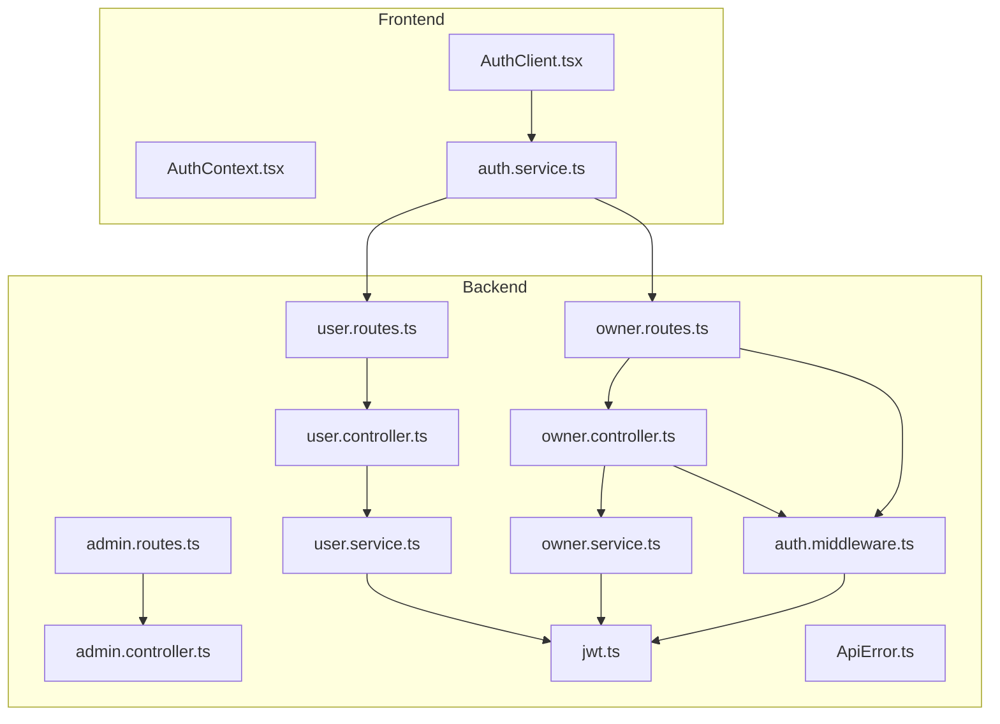
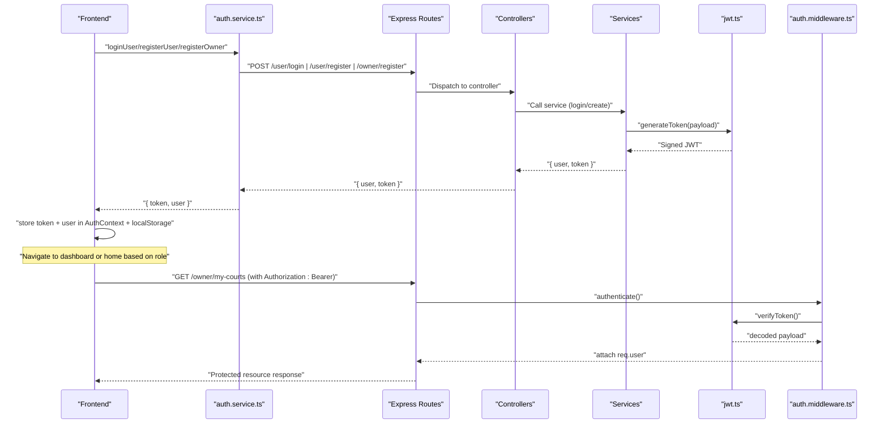
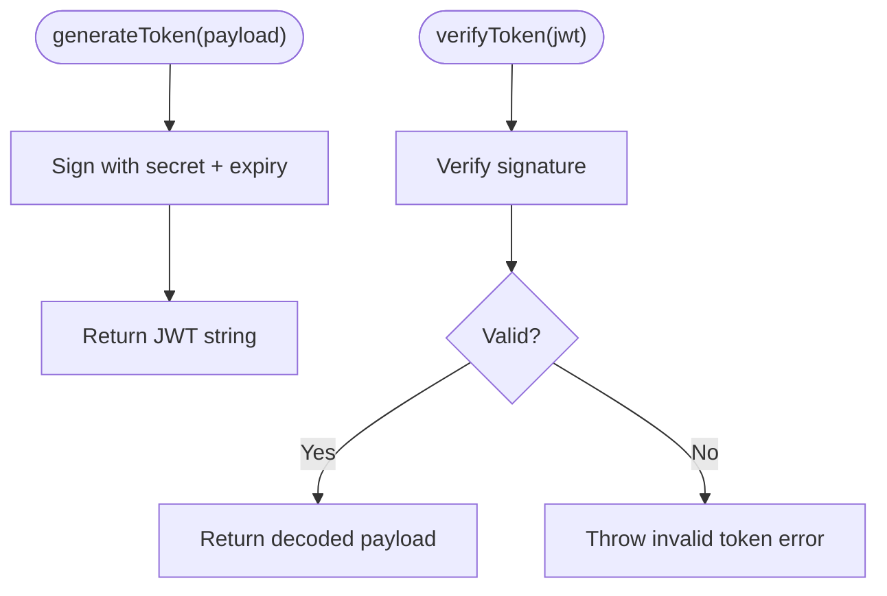
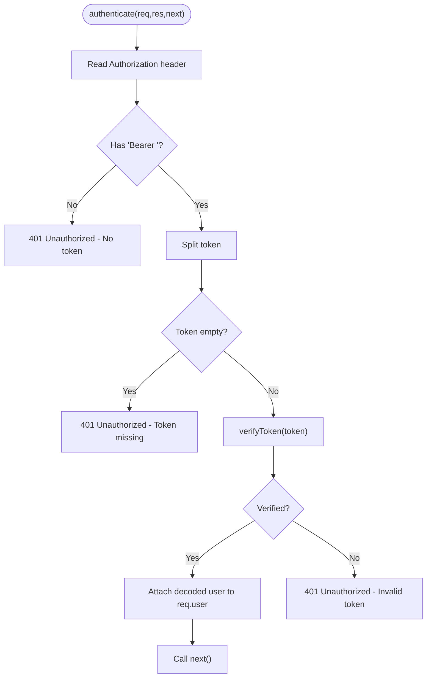
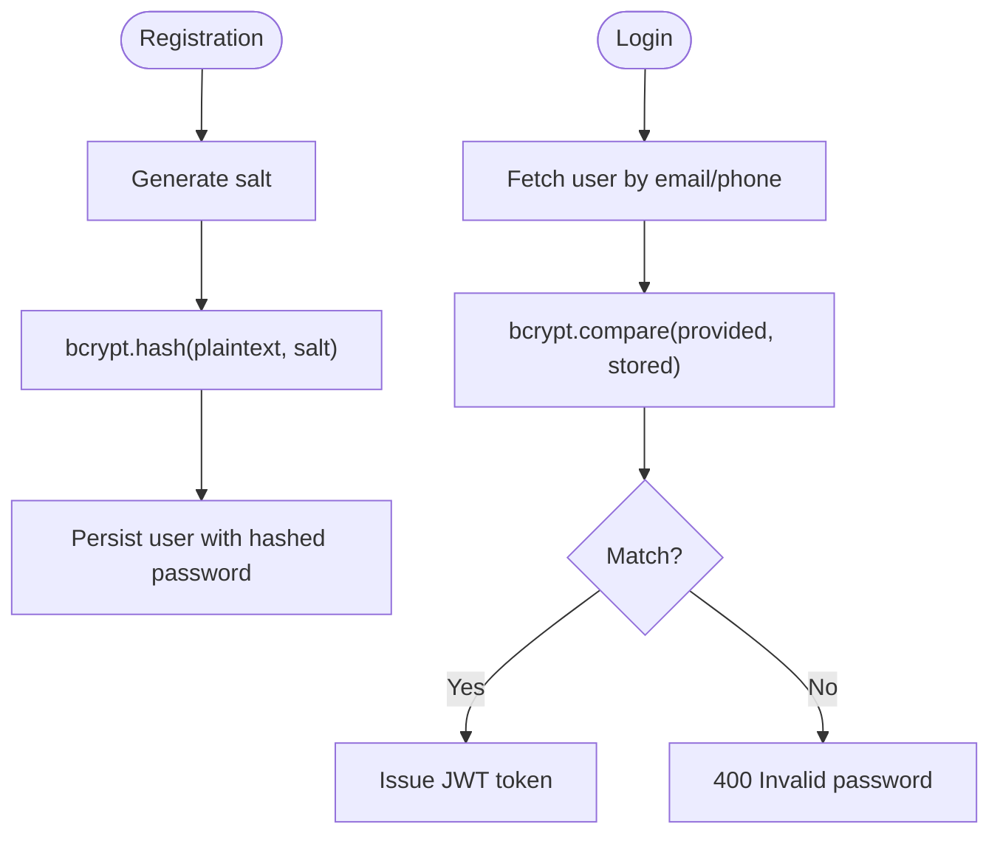
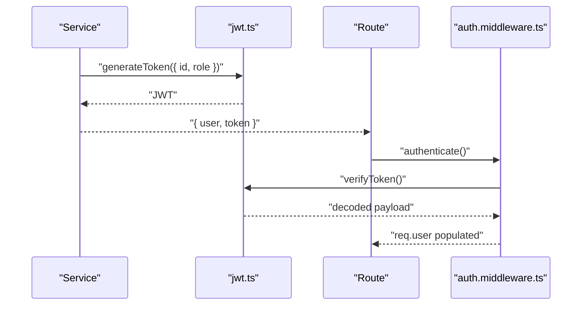
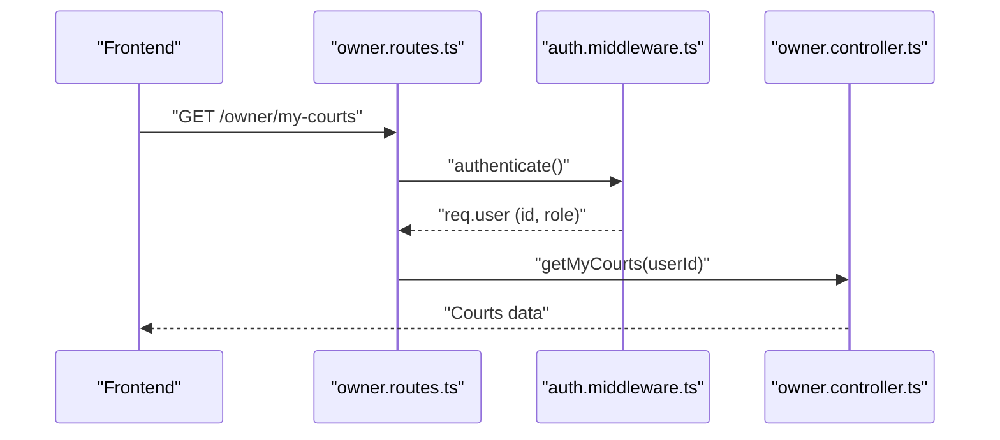
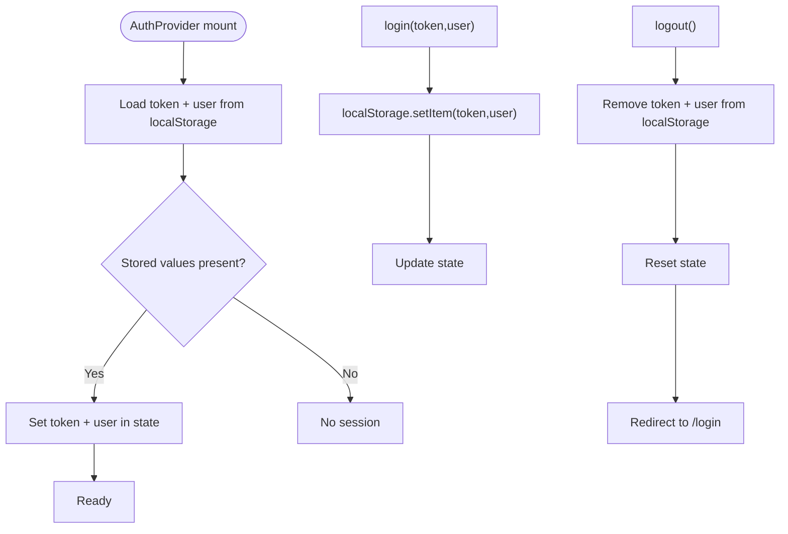
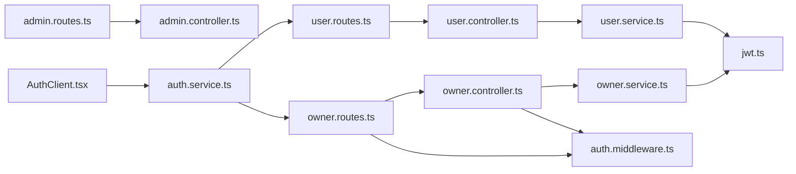

# Authentication & Authorization

<cite>
**Referenced Files in This Document**
- [jwt.ts](file://backend/src/utils/jwt.ts)
- [auth.middleware.ts](file://backend/src/middlewares/auth.middleware.ts)
- [ApiError.ts](file://backend/src/utils/ApiError.ts)
- [user.controller.ts](file://backend/src/controllers/user.controller.ts)
- [owner.controller.ts](file://backend/src/controllers/owner.controller.ts)
- [admin.controller.ts](file://backend/src/controllers/admin.controller.ts)
- [user.service.ts](file://backend/src/services/user.service.ts)
- [owner.service.ts](file://backend/src/services/owner.service.ts)
- [user.routes.ts](file://backend/src/routers/user.routes.ts)
- [owner.routes.ts](file://backend/src/routers/owner.routes.ts)
- [admin.routes.ts](file://backend/src/routers/admin.routes.ts)
- [user.type.ts](file://backend/src/types/user.type.ts)
- [owner.type.ts](file://backend/src/types/owner.type.ts)
- [AuthContext.tsx](file://frontend/src/contexts/AuthContext.tsx)
- [auth.service.ts](file://frontend/src/services/auth.service.ts)
- [AuthClient.tsx](file://frontend/src/components/auth/AuthClient.tsx)
</cite>

## Table of Contents
1. [Introduction](#introduction)
2. [Project Structure](#project-structure)
3. [Core Components](#core-components)
4. [Architecture Overview](#architecture-overview)
5. [Detailed Component Analysis](#detailed-component-analysis)
6. [Dependency Analysis](#dependency-analysis)
7. [Performance Considerations](#performance-considerations)
8. [Troubleshooting Guide](#troubleshooting-guide)
9. [Conclusion](#conclusion)

## Introduction
This document explains the authentication and authorization model for the multi-role sports platform. It covers JWT token generation and verification, role-based access control (User, Owner, Admin), middleware-based authorization, password hashing with bcrypt, token lifecycle, and frontend authentication state management. It also outlines protected route handling, session persistence, and common troubleshooting steps.

## Project Structure
Authentication spans backend services and controllers, middleware, and frontend state management and UI components. The backend exposes REST endpoints for registration and login, while the frontend manages user sessions and navigates protected areas.

**Diagram sources**
- [user.routes.ts:1-10](file://backend/src/routers/user.routes.ts#L1-L10)
- [owner.routes.ts:1-23](file://backend/src/routers/owner.routes.ts#L1-L23)
- [admin.routes.ts:1-6](file://backend/src/routers/admin.routes.ts#L1-L6)
- [auth.middleware.ts:1-28](file://backend/src/middlewares/auth.middleware.ts#L1-L28)
- [user.controller.ts:1-14](file://backend/src/controllers/user.controller.ts#L1-L14)
- [owner.controller.ts:1-110](file://backend/src/controllers/owner.controller.ts#L1-L110)
- [admin.controller.ts:1-13](file://backend/src/controllers/admin.controller.ts#L1-L13)
- [user.service.ts:1-69](file://backend/src/services/user.service.ts#L1-L69)
- [owner.service.ts:1-148](file://backend/src/services/owner.service.ts#L1-L148)
- [jwt.ts:1-13](file://backend/src/utils/jwt.ts#L1-L13)
- [ApiError.ts:1-13](file://backend/src/utils/ApiError.ts#L1-L13)
- [AuthClient.tsx:1-566](file://frontend/src/components/auth/AuthClient.tsx#L1-L566)
- [AuthContext.tsx:1-83](file://frontend/src/contexts/AuthContext.tsx#L1-L83)
- [auth.service.ts:1-36](file://frontend/src/services/auth.service.ts#L1-L36)

**Section sources**
- [user.routes.ts:1-10](file://backend/src/routers/user.routes.ts#L1-L10)
- [owner.routes.ts:1-23](file://backend/src/routers/owner.routes.ts#L1-L23)
- [admin.routes.ts:1-6](file://backend/src/routers/admin.routes.ts#L1-L6)
- [auth.middleware.ts:1-28](file://backend/src/middlewares/auth.middleware.ts#L1-L28)
- [user.controller.ts:1-14](file://backend/src/controllers/user.controller.ts#L1-L14)
- [owner.controller.ts:1-110](file://backend/src/controllers/owner.controller.ts#L1-L110)
- [admin.controller.ts:1-13](file://backend/src/controllers/admin.controller.ts#L1-L13)
- [user.service.ts:1-69](file://backend/src/services/user.service.ts#L1-L69)
- [owner.service.ts:1-148](file://backend/src/services/owner.service.ts#L1-L148)
- [jwt.ts:1-13](file://backend/src/utils/jwt.ts#L1-L13)
- [ApiError.ts:1-13](file://backend/src/utils/ApiError.ts#L1-L13)
- [AuthClient.tsx:1-566](file://frontend/src/components/auth/AuthClient.tsx#L1-L566)
- [AuthContext.tsx:1-83](file://frontend/src/contexts/AuthContext.tsx#L1-L83)
- [auth.service.ts:1-36](file://frontend/src/services/auth.service.ts#L1-L36)

## Core Components
- JWT utilities: token signing and verification with a secret and fixed expiry.
- Authentication middleware: extracts Bearer token from Authorization header, verifies it, and attaches user payload to the request.
- User and Owner services: handle registration and login, hash passwords with bcrypt, and issue JWT tokens.
- Controllers: expose endpoints for user and owner operations.
- Routes: define public endpoints and apply authentication middleware to protected endpoints.
- Frontend AuthContext: stores token and user data in memory and persists them in localStorage; provides login/logout and navigation helpers.
- Frontend auth service: encapsulates API calls to login/register endpoints.

Key roles:
- User (Player): standard authenticated user.
- Owner: authenticated user with role "Owner" who can manage courts and bookings.
- Admin: exposed via admin routes (no dedicated middleware shown in the provided files).

**Section sources**
- [jwt.ts:1-13](file://backend/src/utils/jwt.ts#L1-L13)
- [auth.middleware.ts:1-28](file://backend/src/middlewares/auth.middleware.ts#L1-L28)
- [user.service.ts:1-69](file://backend/src/services/user.service.ts#L1-L69)
- [owner.service.ts:1-148](file://backend/src/services/owner.service.ts#L1-L148)
- [user.controller.ts:1-14](file://backend/src/controllers/user.controller.ts#L1-L14)
- [owner.controller.ts:1-110](file://backend/src/controllers/owner.controller.ts#L1-L110)
- [user.routes.ts:1-10](file://backend/src/routers/user.routes.ts#L1-L10)
- [owner.routes.ts:1-23](file://backend/src/routers/owner.routes.ts#L1-L23)
- [AuthContext.tsx:1-83](file://frontend/src/contexts/AuthContext.tsx#L1-L83)
- [auth.service.ts:1-36](file://frontend/src/services/auth.service.ts#L1-L36)

## Architecture Overview
The authentication flow consists of:
- Registration/Login requests from the frontend to backend endpoints.
- Backend validates credentials, hashes passwords when needed, and issues JWT tokens.
- Frontend stores tokens and user metadata, then navigates to appropriate dashboards.
- Protected routes require a valid Bearer token, enforced by middleware.

**Diagram sources**
- [auth.service.ts:1-36](file://frontend/src/services/auth.service.ts#L1-L36)
- [user.routes.ts:1-10](file://backend/src/routers/user.routes.ts#L1-L10)
- [owner.routes.ts:1-23](file://backend/src/routers/owner.routes.ts#L1-L23)
- [user.controller.ts:1-14](file://backend/src/controllers/user.controller.ts#L1-L14)
- [owner.controller.ts:1-110](file://backend/src/controllers/owner.controller.ts#L1-L110)
- [user.service.ts:1-69](file://backend/src/services/user.service.ts#L1-L69)
- [owner.service.ts:1-148](file://backend/src/services/owner.service.ts#L1-L148)
- [jwt.ts:1-13](file://backend/src/utils/jwt.ts#L1-L13)
- [auth.middleware.ts:1-28](file://backend/src/middlewares/auth.middleware.ts#L1-L28)

## Detailed Component Analysis

### JWT Utilities
- Secret and expiry are configured centrally.
- Tokens are signed with user id and role, and verified on subsequent requests.

**Diagram sources**
- [jwt.ts:1-13](file://backend/src/utils/jwt.ts#L1-L13)

**Section sources**
- [jwt.ts:1-13](file://backend/src/utils/jwt.ts#L1-L13)

### Authentication Middleware
- Extracts Authorization header, checks Bearer scheme, splits token, verifies it, and attaches decoded user to the request.
- On failure, forwards an unauthorized error.

**Diagram sources**
- [auth.middleware.ts:1-28](file://backend/src/middlewares/auth.middleware.ts#L1-L28)
- [jwt.ts:1-13](file://backend/src/utils/jwt.ts#L1-L13)
- [ApiError.ts:1-13](file://backend/src/utils/ApiError.ts#L1-L13)

**Section sources**
- [auth.middleware.ts:1-28](file://backend/src/middlewares/auth.middleware.ts#L1-L28)
- [ApiError.ts:1-13](file://backend/src/utils/ApiError.ts#L1-L13)

### Password Hashing with bcrypt
- Both user and owner registration hash the plaintext password using bcrypt before persisting.
- Login compares the provided password against the stored hash.

**Diagram sources**
- [user.service.ts:1-69](file://backend/src/services/user.service.ts#L1-L69)
- [owner.service.ts:1-148](file://backend/src/services/owner.service.ts#L1-L148)

**Section sources**
- [user.service.ts:1-69](file://backend/src/services/user.service.ts#L1-L69)
- [owner.service.ts:1-148](file://backend/src/services/owner.service.ts#L1-L148)

### Token Generation and Validation
- Payload includes user id and role.
- Expiration is configured globally.
- Validation occurs in middleware for protected routes.

**Diagram sources**
- [user.service.ts:1-69](file://backend/src/services/user.service.ts#L1-L69)
- [owner.service.ts:1-148](file://backend/src/services/owner.service.ts#L1-L148)
- [jwt.ts:1-13](file://backend/src/utils/jwt.ts#L1-L13)
- [auth.middleware.ts:1-28](file://backend/src/middlewares/auth.middleware.ts#L1-L28)

**Section sources**
- [user.service.ts:1-69](file://backend/src/services/user.service.ts#L1-L69)
- [owner.service.ts:1-148](file://backend/src/services/owner.service.ts#L1-L148)
- [jwt.ts:1-13](file://backend/src/utils/jwt.ts#L1-L13)
- [auth.middleware.ts:1-28](file://backend/src/middlewares/auth.middleware.ts#L1-L28)

### Protected Routes and Role-Based Access Control
- Owner endpoints are protected by the authentication middleware.
- Roles are embedded in the JWT payload; navigation is handled on the frontend based on role.
- Admin routes exist but do not show explicit role guards in the provided files.

**Diagram sources**
- [owner.routes.ts:1-23](file://backend/src/routers/owner.routes.ts#L1-L23)
- [auth.middleware.ts:1-28](file://backend/src/middlewares/auth.middleware.ts#L1-L28)
- [owner.controller.ts:1-110](file://backend/src/controllers/owner.controller.ts#L1-L110)

**Section sources**
- [owner.routes.ts:1-23](file://backend/src/routers/owner.routes.ts#L1-L23)
- [owner.controller.ts:1-110](file://backend/src/controllers/owner.controller.ts#L1-L110)
- [AuthClient.tsx:1-566](file://frontend/src/components/auth/AuthClient.tsx#L1-L566)

### Frontend Authentication State Management
- AuthContext stores token and user in memory and persists them in localStorage.
- Provides login and logout functions and exposes an isAuthenticated flag.
- AuthClient triggers login actions and navigates after successful authentication.

**Diagram sources**
- [AuthContext.tsx:1-83](file://frontend/src/contexts/AuthContext.tsx#L1-L83)
- [AuthClient.tsx:1-566](file://frontend/src/components/auth/AuthClient.tsx#L1-L566)
- [auth.service.ts:1-36](file://frontend/src/services/auth.service.ts#L1-L36)

**Section sources**
- [AuthContext.tsx:1-83](file://frontend/src/contexts/AuthContext.tsx#L1-L83)
- [AuthClient.tsx:1-566](file://frontend/src/components/auth/AuthClient.tsx#L1-L566)
- [auth.service.ts:1-36](file://frontend/src/services/auth.service.ts#L1-L36)

### Refresh Token Strategies
- The current implementation does not include refresh tokens.
- JWT expiry is fixed; clients should re-authenticate after expiration.

**Section sources**
- [jwt.ts:1-13](file://backend/src/utils/jwt.ts#L1-L13)

### Session Management
- Sessions are client-side: token and user persisted in localStorage.
- No server-side session store is evident in the provided files.

**Section sources**
- [AuthContext.tsx:1-83](file://frontend/src/contexts/AuthContext.tsx#L1-L83)

## Dependency Analysis
- Controllers depend on services for business logic.
- Services depend on JWT utilities and repositories.
- Routes depend on controllers and middleware.
- Frontend depends on auth service and context.

**Diagram sources**
- [user.routes.ts:1-10](file://backend/src/routers/user.routes.ts#L1-L10)
- [owner.routes.ts:1-23](file://backend/src/routers/owner.routes.ts#L1-L23)
- [admin.routes.ts:1-6](file://backend/src/routers/admin.routes.ts#L1-L6)
- [user.controller.ts:1-14](file://backend/src/controllers/user.controller.ts#L1-L14)
- [owner.controller.ts:1-110](file://backend/src/controllers/owner.controller.ts#L1-L110)
- [admin.controller.ts:1-13](file://backend/src/controllers/admin.controller.ts#L1-L13)
- [user.service.ts:1-69](file://backend/src/services/user.service.ts#L1-L69)
- [owner.service.ts:1-148](file://backend/src/services/owner.service.ts#L1-L148)
- [jwt.ts:1-13](file://backend/src/utils/jwt.ts#L1-L13)
- [auth.middleware.ts:1-28](file://backend/src/middlewares/auth.middleware.ts#L1-L28)
- [AuthClient.tsx:1-566](file://frontend/src/components/auth/AuthClient.tsx#L1-L566)
- [auth.service.ts:1-36](file://frontend/src/services/auth.service.ts#L1-L36)

**Section sources**
- [user.routes.ts:1-10](file://backend/src/routers/user.routes.ts#L1-L10)
- [owner.routes.ts:1-23](file://backend/src/routers/owner.routes.ts#L1-L23)
- [admin.routes.ts:1-6](file://backend/src/routers/admin.routes.ts#L1-L6)
- [user.controller.ts:1-14](file://backend/src/controllers/user.controller.ts#L1-L14)
- [owner.controller.ts:1-110](file://backend/src/controllers/owner.controller.ts#L1-L110)
- [admin.controller.ts:1-13](file://backend/src/controllers/admin.controller.ts#L1-L13)
- [user.service.ts:1-69](file://backend/src/services/user.service.ts#L1-L69)
- [owner.service.ts:1-148](file://backend/src/services/owner.service.ts#L1-L148)
- [jwt.ts:1-13](file://backend/src/utils/jwt.ts#L1-L13)
- [auth.middleware.ts:1-28](file://backend/src/middlewares/auth.middleware.ts#L1-L28)
- [AuthClient.tsx:1-566](file://frontend/src/components/auth/AuthClient.tsx#L1-L566)
- [auth.service.ts:1-36](file://frontend/src/services/auth.service.ts#L1-L36)

## Performance Considerations
- Token verification is lightweight; ensure minimal overhead by avoiding unnecessary re-verifications.
- bcrypt cost is fixed; consider monitoring login latency and scaling compute if needed.
- Avoid storing sensitive data in localStorage; prefer secure, httpOnly cookies if moving to server-rendered sessions.

## Troubleshooting Guide
Common issues and resolutions:
- 401 Unauthorized on protected routes
  - Ensure Authorization header includes "Bearer " followed by a valid token.
  - Confirm token was issued by the backend and not expired.
  - Verify middleware is applied to the route.

- Invalid token errors
  - Check JWT secret consistency across deployments.
  - Validate token signing and verification paths.

- Login fails with invalid password
  - Confirm bcrypt comparison matches stored hash.
  - Ensure user record contains a hashed password.

- Duplicate email or phone during registration
  - Backend throws explicit errors when duplicates are detected.

- Owner registration missing required documents
  - Owner registration requires both front and back images; ensure uploads are present.

- Frontend not navigating after login
  - Verify AuthClient receives token and role, then navigates accordingly.
  - Confirm AuthContext login updates state and localStorage.

**Section sources**
- [auth.middleware.ts:1-28](file://backend/src/middlewares/auth.middleware.ts#L1-L28)
- [user.service.ts:1-69](file://backend/src/services/user.service.ts#L1-L69)
- [owner.service.ts:1-148](file://backend/src/services/owner.service.ts#L1-L148)
- [owner.controller.ts:1-110](file://backend/src/controllers/owner.controller.ts#L1-L110)
- [AuthClient.tsx:1-566](file://frontend/src/components/auth/AuthClient.tsx#L1-L566)
- [AuthContext.tsx:1-83](file://frontend/src/contexts/AuthContext.tsx#L1-L83)

## Conclusion
The platform implements a straightforward JWT-based authentication system with bcrypt password hashing and middleware-driven authorization. Roles are embedded in tokens and used to guide frontend navigation. While refresh tokens and server-side sessions are not implemented here, the current design is clear, maintainable, and suitable for iterative enhancements such as refresh token rotation and secure cookie storage.