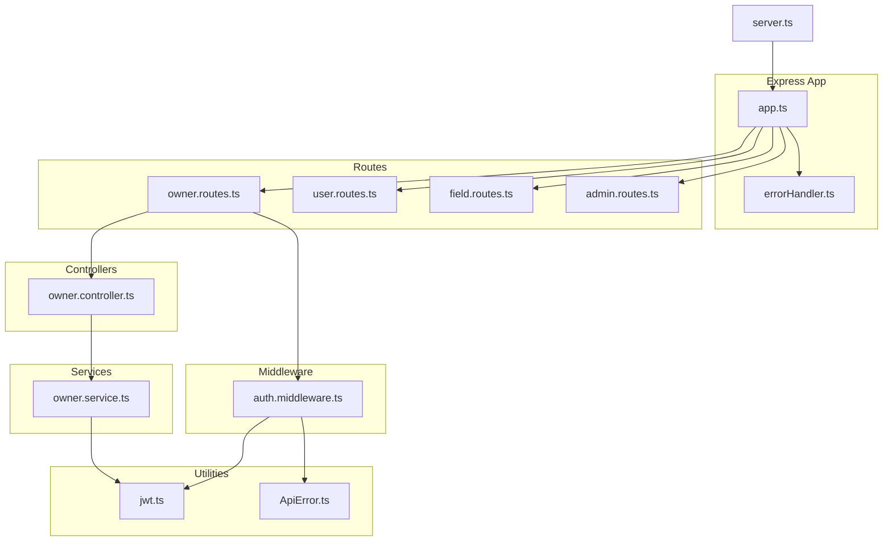
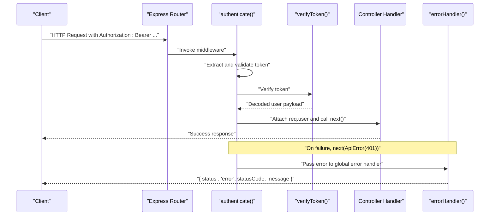
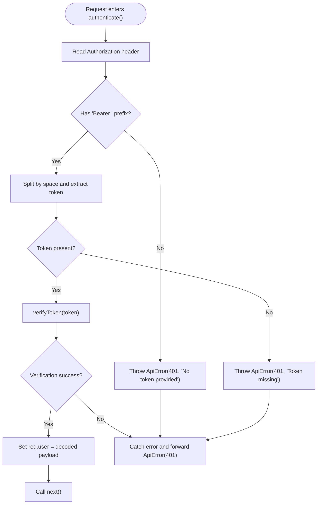
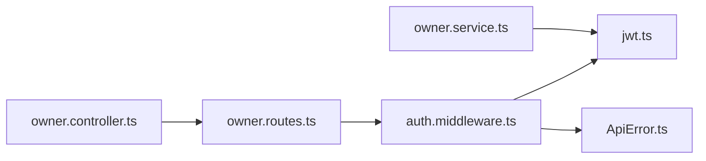

# Authentication Middleware

<cite>
**Referenced Files in This Document**
- [auth.middleware.ts](file://backend/src/middlewares/auth.middleware.ts)
- [jwt.ts](file://backend/src/utils/jwt.ts)
- [ApiError.ts](file://backend/src/utils/ApiError.ts)
- [errorHandler.ts](file://backend/src/middlewares/errorHandler.ts)
- [owner.routes.ts](file://backend/src/routers/owner.routes.ts)
- [user.routes.ts](file://backend/src/routers/user.routes.ts)
- [field.routes.ts](file://backend/src/routers/field.routes.ts)
- [admin.routes.ts](file://backend/src/routers/admin.routes.ts)
- [owner.controller.ts](file://backend/src/controllers/owner.controller.ts)
- [owner.service.ts](file://backend/src/services/owner.service.ts)
- [app.ts](file://backend/src/app.ts)
- [server.ts](file://backend/src/server.ts)
</cite>

## Table of Contents
1. [Introduction](#introduction)
2. [Project Structure](#project-structure)
3. [Core Components](#core-components)
4. [Architecture Overview](#architecture-overview)
5. [Detailed Component Analysis](#detailed-component-analysis)
6. [Dependency Analysis](#dependency-analysis)
7. [Performance Considerations](#performance-considerations)
8. [Troubleshooting Guide](#troubleshooting-guide)
9. [Conclusion](#conclusion)

## Introduction
This document explains the authentication middleware system used to protect backend routes. It covers bearer token extraction, validation flow, error handling, the AuthRequest interface extension, token parsing logic, and middleware integration patterns. It also provides practical examples of protecting routes, handling unauthorized access, integrating with Express.js routing, and common configuration issues with debugging techniques.

## Project Structure
The authentication system spans several modules:
- Middleware: authentication guard and global error handling
- Utilities: JWT generation and verification
- Routes: Express route definitions that apply the authentication middleware
- Controllers: Route handlers that consume the authenticated user payload
- Services: Business logic that may generate tokens during registration
- Application bootstrap: Express app wiring and middleware stack

**Diagram sources**
- [app.ts:1-21](file://backend/src/app.ts#L1-L21)
- [auth.middleware.ts:1-28](file://backend/src/middlewares/auth.middleware.ts#L1-L28)
- [jwt.ts:1-13](file://backend/src/utils/jwt.ts#L1-L13)
- [ApiError.ts:1-13](file://backend/src/utils/ApiError.ts#L1-L13)
- [errorHandler.ts:1-38](file://backend/src/middlewares/errorHandler.ts#L1-L38)
- [owner.routes.ts:1-23](file://backend/src/routers/owner.routes.ts#L1-L23)
- [user.routes.ts:1-10](file://backend/src/routers/user.routes.ts#L1-L10)
- [field.routes.ts:1-5](file://backend/src/routers/field.routes.ts#L1-L5)
- [admin.routes.ts:1-6](file://backend/src/routers/admin.routes.ts#L1-L6)
- [owner.controller.ts:1-110](file://backend/src/controllers/owner.controller.ts#L1-L110)
- [owner.service.ts:1-148](file://backend/src/services/owner.service.ts#L1-L148)
- [server.ts:1-20](file://backend/src/server.ts#L1-L20)

**Section sources**
- [app.ts:1-21](file://backend/src/app.ts#L1-L21)
- [server.ts:1-20](file://backend/src/server.ts#L1-L20)

## Core Components
- Authentication middleware: extracts and validates the bearer token, attaches user payload to the request, and forwards to downstream handlers or error handler.
- JWT utilities: sign and verify tokens using a secret from environment configuration.
- Error handling: converts thrown ApiError instances and other errors into consistent JSON responses.
- Route integration: applies authentication middleware to protected routes.
- Controller usage: reads authenticated user id from the request to perform authorized operations.

Key responsibilities:
- Bearer token extraction from Authorization header
- Token validation via JWT verification
- Attaching verified user payload to the request object
- Consistent unauthorized error responses

**Section sources**
- [auth.middleware.ts:1-28](file://backend/src/middlewares/auth.middleware.ts#L1-L28)
- [jwt.ts:1-13](file://backend/src/utils/jwt.ts#L1-L13)
- [ApiError.ts:1-13](file://backend/src/utils/ApiError.ts#L1-L13)
- [errorHandler.ts:1-38](file://backend/src/middlewares/errorHandler.ts#L1-L38)

## Architecture Overview
The authentication flow is applied per-route. On successful validation, the middleware attaches a user object to the request, enabling controllers to access the authenticated identity.

**Diagram sources**
- [auth.middleware.ts:9-27](file://backend/src/middlewares/auth.middleware.ts#L9-L27)
- [jwt.ts:10-12](file://backend/src/utils/jwt.ts#L10-L12)
- [errorHandler.ts:5-37](file://backend/src/middlewares/errorHandler.ts#L5-L37)

## Detailed Component Analysis

### Authentication Middleware
Purpose:
- Enforce bearer token presence and validity
- Attach verified user payload to the request object
- Delegate to the next handler on success or pass an unauthorized error to the global error handler

Behavior highlights:
- Expects Authorization header in the form "Bearer <token>"
- Throws a 401 ApiError on missing or malformed headers
- On invalid token, catches the error and forwards a 401 ApiError to the error handler
- On success, sets req.user to the decoded token payload and continues

Integration pattern:
- Applied as a middleware function on specific routes
- Used in combination with other middlewares (e.g., upload) when needed

**Diagram sources**
- [auth.middleware.ts:9-27](file://backend/src/middlewares/auth.middleware.ts#L9-L27)
- [jwt.ts:10-12](file://backend/src/utils/jwt.ts#L10-L12)
- [ApiError.ts:1-13](file://backend/src/utils/ApiError.ts#L1-13)

**Section sources**
- [auth.middleware.ts:1-28](file://backend/src/middlewares/auth.middleware.ts#L1-L28)

### AuthRequest Interface Extension
The middleware extends the Express Request type to include an optional user property. Controllers that require an authenticated user can safely type their requests using this interface to access req.user.

Usage example:
- Controllers receive AuthRequest and read req.user.id to perform authorized actions

**Section sources**
- [auth.middleware.ts:5-7](file://backend/src/middlewares/auth.middleware.ts#L5-L7)
- [owner.controller.ts:42-49](file://backend/src/controllers/owner.controller.ts#L42-L49)

### JWT Utilities
Responsibilities:
- Generate signed tokens with expiration
- Verify tokens using the configured secret

Security considerations:
- Secret is loaded from environment configuration
- Tokens carry a user identifier and role for downstream authorization decisions

**Section sources**
- [jwt.ts:1-13](file://backend/src/utils/jwt.ts#L1-L13)

### Error Handling
The global error handler:
- Converts ApiError instances to JSON responses with appropriate status codes
- Handles Prisma-specific known request errors and logs them
- Logs unexpected server errors and responds with a generic internal server error

**Section sources**
- [errorHandler.ts:1-38](file://backend/src/middlewares/errorHandler.ts#L1-L38)
- [ApiError.ts:1-13](file://backend/src/utils/ApiError.ts#L1-L13)

### Route Protection Examples
Protected routes:
- Owner module routes apply the authentication middleware to enforce access control
- Public routes (e.g., user registration/login, field listing) remain unauthenticated

Integration points:
- Middleware is imported and attached to specific routes
- Controllers consume req.user after authentication passes

**Section sources**
- [owner.routes.ts:1-23](file://backend/src/routers/owner.routes.ts#L1-L23)
- [user.routes.ts:1-10](file://backend/src/routers/user.routes.ts#L1-L10)
- [field.routes.ts:1-5](file://backend/src/routers/field.routes.ts#L1-L5)
- [admin.routes.ts:1-6](file://backend/src/routers/admin.routes.ts#L1-L6)

### Controller Usage of Authenticated User
Controllers that require authentication:
- Access req.user.id to fetch or modify resources owned by the authenticated user
- Forward other errors to the global error handler

**Section sources**
- [owner.controller.ts:42-49](file://backend/src/controllers/owner.controller.ts#L42-L49)
- [owner.controller.ts:52-64](file://backend/src/controllers/owner.controller.ts#L52-L64)
- [owner.controller.ts:67-81](file://backend/src/controllers/owner.controller.ts#L67-L81)
- [owner.controller.ts:84-91](file://backend/src/controllers/owner.controller.ts#L84-L91)
- [owner.controller.ts:94-108](file://backend/src/controllers/owner.controller.ts#L94-L108)

### Token Generation During Registration
The owner service generates a JWT for newly registered users. This demonstrates how tokens are produced and returned to clients upon successful registration.

**Section sources**
- [owner.service.ts:62](file://backend/src/services/owner.service.ts#L62)

## Dependency Analysis
The authentication middleware depends on:
- JWT utilities for token verification
- ApiError for consistent error signaling
- Express Request/Response/NextFunction for middleware integration

Route protection depends on:
- Importing the authentication middleware
- Applying it to target routes

**Diagram sources**
- [auth.middleware.ts:1-28](file://backend/src/middlewares/auth.middleware.ts#L1-L28)
- [jwt.ts:1-13](file://backend/src/utils/jwt.ts#L1-L13)
- [ApiError.ts:1-13](file://backend/src/utils/ApiError.ts#L1-L13)
- [owner.routes.ts:1-23](file://backend/src/routers/owner.routes.ts#L1-L23)
- [owner.controller.ts:1-110](file://backend/src/controllers/owner.controller.ts#L1-L110)
- [owner.service.ts:1-148](file://backend/src/services/owner.service.ts#L1-L148)

**Section sources**
- [auth.middleware.ts:1-28](file://backend/src/middlewares/auth.middleware.ts#L1-L28)
- [owner.routes.ts:1-23](file://backend/src/routers/owner.routes.ts#L1-L23)

## Performance Considerations
- Token verification occurs synchronously; keep JWT_SECRET secure and avoid excessive token signing/verification in hot paths.
- Prefer short-lived tokens for sensitive endpoints and refresh token patterns if needed.
- Centralize error logging and avoid leaking secrets in production responses.

## Troubleshooting Guide
Common issues and resolutions:
- Missing Authorization header or wrong scheme
  - Symptom: 401 Unauthorized with a message indicating missing token
  - Resolution: Ensure the client sends "Authorization: Bearer <token>" and the token is not empty
  - Reference: [auth.middleware.ts:12-19](file://backend/src/middlewares/auth.middleware.ts#L12-L19)

- Invalid or expired token
  - Symptom: 401 Unauthorized during verification
  - Resolution: Regenerate a valid token with the correct secret and expiration
  - Reference: [auth.middleware.ts:21-26](file://backend/src/middlewares/auth.middleware.ts#L21-L26), [jwt.ts:10-12](file://backend/src/utils/jwt.ts#L10-L12)

- Environment misconfiguration
  - Symptom: Verification failures or runtime errors
  - Resolution: Confirm JWT_SECRET is set in the environment and matches the value used to sign tokens
  - Reference: [jwt.ts:3](file://backend/src/utils/jwt.ts#L3)

- Unexpected server errors
  - Symptom: 500 Internal Server Error
  - Resolution: Inspect server logs; the global error handler logs unexpected errors
  - Reference: [errorHandler.ts:28-30](file://backend/src/middlewares/errorHandler.ts#L28-L30)

- Route not protected
  - Symptom: Unauthorized access to protected endpoints
  - Resolution: Ensure the authentication middleware is imported and applied to the intended routes
  - Reference: [owner.routes.ts:16-20](file://backend/src/routers/owner.routes.ts#L16-L20)

- Debugging techniques
  - Add logging around token extraction and verification
  - Validate token payload shape in controllers (e.g., req.user.id)
  - Use consistent error responses via ApiError to simplify client-side handling
  - Reference: [auth.middleware.ts:24-26](file://backend/src/middlewares/auth.middleware.ts#L24-L26), [errorHandler.ts:14-16](file://backend/src/middlewares/errorHandler.ts#L14-L16)

## Conclusion
The authentication middleware enforces bearer token-based access control by extracting and validating tokens, attaching user identities to requests, and delegating errors to a centralized handler. By applying the middleware to targeted routes and consuming req.user in controllers, the system achieves consistent, secure, and maintainable authorization patterns. Proper environment configuration and logging practices are essential for reliable operation and effective troubleshooting.