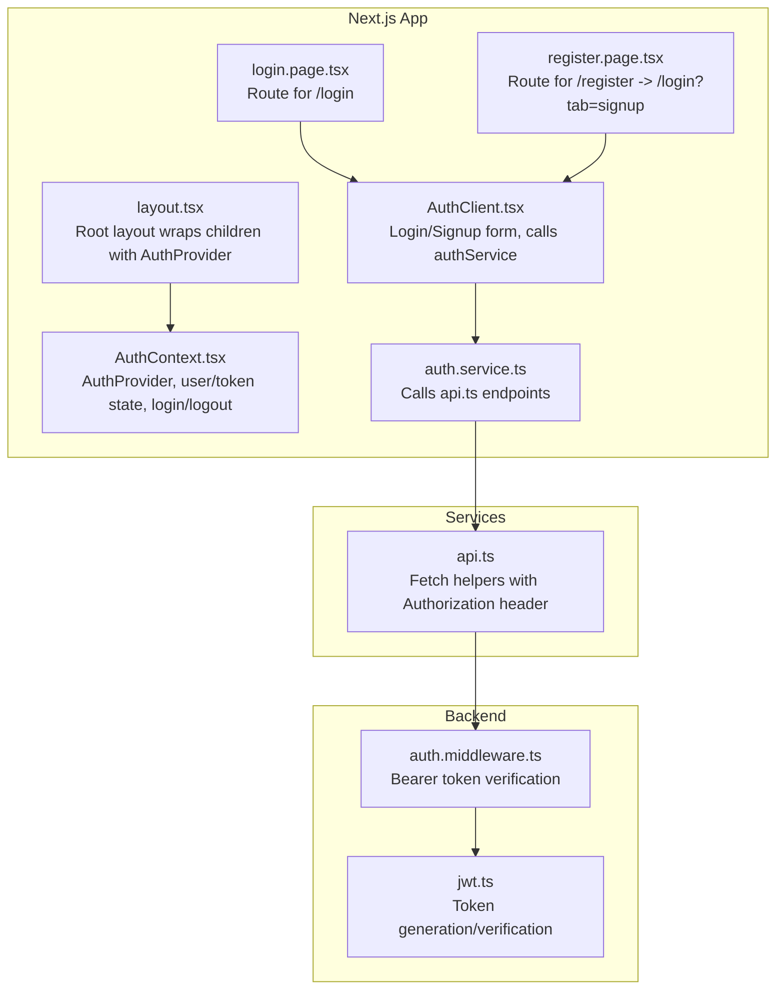
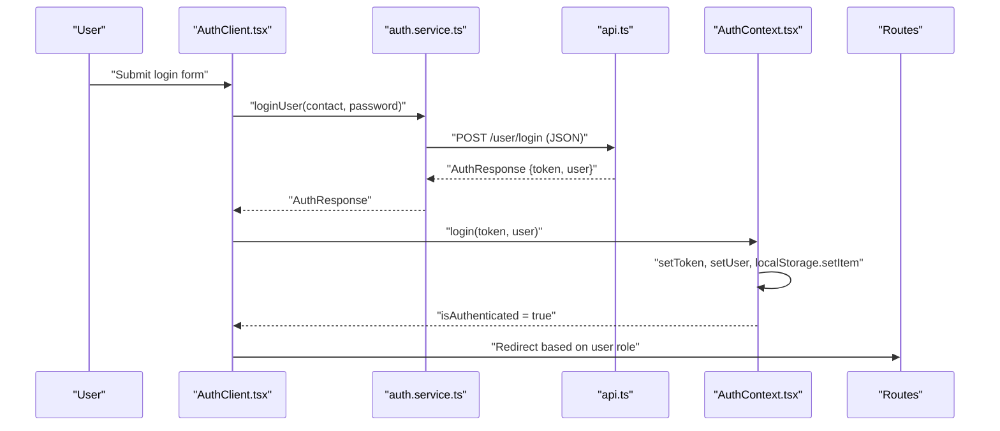
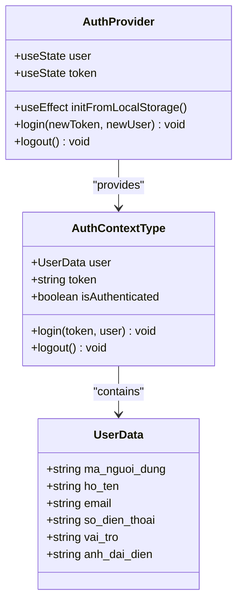
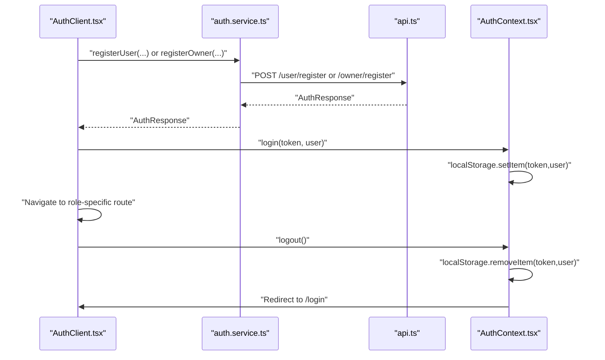
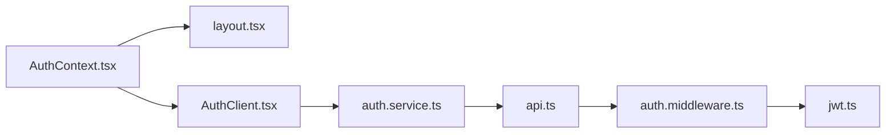

# Frontend Authentication State Management

<cite>
**Referenced Files in This Document**
- [AuthContext.tsx](file://frontend/src/contexts/AuthContext.tsx)
- [AuthClient.tsx](file://frontend/src/components/auth/AuthClient.tsx)
- [auth.service.ts](file://frontend/src/services/auth.service.ts)
- [api.ts](file://frontend/src/services/api.ts)
- [auth.types.ts](file://frontend/src/types/auth.types.ts)
- [layout.tsx](file://frontend/src/app/layout.tsx)
- [login.page.tsx](file://frontend/src/app/(auth)/login/page.tsx)
- [register.page.tsx](file://frontend/src/app/(auth)/register/page.tsx)
- [auth.middleware.ts](file://backend/src/middlewares/auth.middleware.ts)
- [jwt.ts](file://backend/src/utils/jwt.ts)
</cite>

## Table of Contents
1. [Introduction](#introduction)
2. [Project Structure](#project-structure)
3. [Core Components](#core-components)
4. [Architecture Overview](#architecture-overview)
5. [Detailed Component Analysis](#detailed-component-analysis)
6. [Dependency Analysis](#dependency-analysis)
7. [Performance Considerations](#performance-considerations)
8. [Troubleshooting Guide](#troubleshooting-guide)
9. [Conclusion](#conclusion)

## Introduction
This document explains the frontend authentication state management built with React Context API in a Next.js application. It covers session persistence using local storage, token storage strategies, automatic logout mechanisms, the authentication provider implementation, state update patterns, protected route handling, login/logout flows, error state management, and security considerations including cross-tab synchronization.

## Project Structure
The authentication system spans three primary areas:
- Context Provider: global authentication state and actions
- Authentication UI: login/signup forms and navigation
- API Services: HTTP requests with bearer token injection

**Diagram sources**
- [layout.tsx:26](file://frontend/src/app/layout.tsx#L26)
- [AuthContext.tsx:26](file://frontend/src/contexts/AuthContext.tsx#L26)
- [AuthClient.tsx:13](file://frontend/src/components/auth/AuthClient.tsx#L13)
- [auth.service.ts:4](file://frontend/src/services/auth.service.ts#L4)
- [api.ts:1](file://frontend/src/services/api.ts#L1)
- [login.page.tsx:9](file://frontend/src/app/(auth)/login/page.tsx#L9)
- [register.page.tsx:3](file://frontend/src/app/(auth)/register/page.tsx#L3)
- [auth.middleware.ts:9](file://backend/src/middlewares/auth.middleware.ts#L9)
- [jwt.ts:6](file://backend/src/utils/jwt.ts#L6)

**Section sources**
- [layout.tsx:26](file://frontend/src/app/layout.tsx#L26)
- [AuthContext.tsx:26](file://frontend/src/contexts/AuthContext.tsx#L26)
- [AuthClient.tsx:13](file://frontend/src/components/auth/AuthClient.tsx#L13)
- [auth.service.ts:4](file://frontend/src/services/auth.service.ts#L4)
- [api.ts:1](file://frontend/src/services/api.ts#L1)
- [login.page.tsx:9](file://frontend/src/app/(auth)/login/page.tsx#L9)
- [register.page.tsx:3](file://frontend/src/app/(auth)/register/page.tsx#L3)

## Core Components
- Authentication Context: manages user and token state, exposes login/logout, and indicates authentication status.
- Authentication Client: handles login/signup forms, validates inputs, calls service methods, and navigates after successful auth.
- API Service: centralizes HTTP requests and injects Authorization headers when a token exists.
- Routes: expose login and registration pages; registration redirects to login with appropriate tab.

Key responsibilities:
- Persist token and user data in local storage for session continuity across browser reloads.
- Provide a clean login action that updates state and persists credentials.
- Provide a logout action that clears state and local storage and redirects to login.
- Expose an isAuthenticated flag derived from token presence.

**Section sources**
- [AuthContext.tsx:6](file://frontend/src/contexts/AuthContext.tsx#L6-L22)
- [AuthContext.tsx:26](file://frontend/src/contexts/AuthContext.tsx#L26-L74)
- [AuthClient.tsx:55](file://frontend/src/components/auth/AuthClient.tsx#L55-L83)
- [api.ts:3](file://frontend/src/services/api.ts#L3-L9)
- [login.page.tsx:9](file://frontend/src/app/(auth)/login/page.tsx#L9-L15)
- [register.page.tsx:3](file://frontend/src/app/(auth)/register/page.tsx#L3-L5)

## Architecture Overview
The authentication flow integrates UI, context, services, and backend middleware:

**Diagram sources**
- [AuthClient.tsx:55](file://frontend/src/components/auth/AuthClient.tsx#L55-L83)
- [auth.service.ts:5](file://frontend/src/services/auth.service.ts#L5-L11)
- [api.ts:29](file://frontend/src/services/api.ts#L29-L43)
- [AuthContext.tsx:46](file://frontend/src/contexts/AuthContext.tsx#L46-L51)
- [login.page.tsx:9](file://frontend/src/app/(auth)/login/page.tsx#L9-L15)

## Detailed Component Analysis

### Authentication Context Provider
Implements:
- State: user object and token string
- Initialization: reads token and user from local storage on mount
- Actions: login (updates state and persists), logout (clears state and local storage, redirects)
- Derived state: isAuthenticated computed from token presence

**Diagram sources**
- [AuthContext.tsx:16](file://frontend/src/contexts/AuthContext.tsx#L16-L22)
- [AuthContext.tsx:26](file://frontend/src/contexts/AuthContext.tsx#L26-L74)
- [auth.types.ts:1](file://frontend/src/types/auth.types.ts#L1-L8)

**Section sources**
- [AuthContext.tsx:26](file://frontend/src/contexts/AuthContext.tsx#L26-L74)
- [auth.types.ts:1](file://frontend/src/types/auth.types.ts#L1-L8)

### Login and Logout Flows
- Login:
  - Form submission triggers service call with contact/password.
  - On success, context login updates state and persists token/user.
  - Redirects to different dashboards depending on user role.
- Logout:
  - Clears token and user, removes entries from local storage.
  - Redirects to login page.

**Diagram sources**
- [AuthClient.tsx:85](file://frontend/src/components/auth/AuthClient.tsx#L85-L133)
- [auth.service.ts:13](file://frontend/src/services/auth.service.ts#L13-L34)
- [api.ts:29](file://frontend/src/services/api.ts#L29-L75)
- [AuthContext.tsx:53](file://frontend/src/contexts/AuthContext.tsx#L53-L59)

**Section sources**
- [AuthClient.tsx:55](file://frontend/src/components/auth/AuthClient.tsx#L55-L83)
- [AuthClient.tsx:85](file://frontend/src/components/auth/AuthClient.tsx#L85-L133)
- [AuthContext.tsx:46](file://frontend/src/contexts/AuthContext.tsx#L46-L59)

### Protected Route Handling
- The application does not implement explicit route guards in the frontend code shown.
- Authentication state is centralized in the context; downstream components can use `useAuth().isAuthenticated` to conditionally render content or redirect.
- Backend middleware enforces Bearer token verification for protected endpoints.

Recommendations:
- Add route guards at the Next.js app directory level to protect pages based on authentication status.
- Use the context's `isAuthenticated` flag to decide whether to render protected content or redirect to login.

**Section sources**
- [AuthContext.tsx:68](file://frontend/src/contexts/AuthContext.tsx#L68)
- [auth.middleware.ts:9](file://backend/src/middlewares/auth.middleware.ts#L9-L27)

### Token Storage Strategies
- Local storage is used to persist the token and user object across sessions.
- On login, both token and user are written to local storage.
- On logout, both are removed.
- During initialization, the provider reads token and user from local storage to restore session.

Security considerations:
- Local storage is accessible to JavaScript and vulnerable to XSS.
- Consider storing tokens in httpOnly cookies for stronger protection against XSS.
- For multi-tab synchronization, listen to storage events to reflect state changes across tabs.

**Section sources**
- [AuthContext.tsx:32](file://frontend/src/contexts/AuthContext.tsx#L32-L44)
- [AuthContext.tsx:49](file://frontend/src/contexts/AuthContext.tsx#L49-L50)
- [AuthContext.tsx:56](file://frontend/src/contexts/AuthContext.tsx#L56-L57)

### Automatic Logout Mechanisms
- The current implementation does not include automatic logout on token expiration or invalidation.
- To implement automatic logout:
  - Store token expiration time alongside the token.
  - Periodically check expiration and trigger logout if expired.
  - On 401 responses from API calls, clear state and local storage, then redirect to login.

**Section sources**
- [api.ts:11](file://frontend/src/services/api.ts#L11-L17)

### Error State Management
- Forms display user-friendly error messages returned from service calls.
- Validation errors (e.g., mismatched passwords) are handled before network requests.
- General errors are caught and displayed to the user.

Best practices:
- Normalize error messages from backend for user readability.
- Distinguish between network errors, validation errors, and auth errors.
- Provide retry mechanisms or clear error states after successful operations.

**Section sources**
- [AuthClient.tsx:89](file://frontend/src/components/auth/AuthClient.tsx#L89-L92)
- [AuthClient.tsx:74](file://frontend/src/components/auth/AuthClient.tsx#L74-L82)

### Cross-Tab Synchronization
- The current implementation does not subscribe to storage events to synchronize state across browser tabs.
- To support cross-tab sync:
  - Listen to the storage event on window.
  - On receiving a change for token/user keys, update context state accordingly.
  - Ensure consistent behavior when a user logs out in one tab while logged in another.

**Section sources**
- [AuthContext.tsx:32](file://frontend/src/contexts/AuthContext.tsx#L32-L44)

## Dependency Analysis
The authentication stack depends on:
- Context provider for state management
- Service layer for API communication
- API helpers for Authorization header injection
- Backend middleware for token verification

**Diagram sources**
- [AuthContext.tsx:26](file://frontend/src/contexts/AuthContext.tsx#L26)
- [layout.tsx:26](file://frontend/src/app/layout.tsx#L26)
- [AuthClient.tsx:19](file://frontend/src/components/auth/AuthClient.tsx#L19)
- [auth.service.ts:4](file://frontend/src/services/auth.service.ts#L4)
- [api.ts:1](file://frontend/src/services/api.ts#L1)
- [auth.middleware.ts:9](file://backend/src/middlewares/auth.middleware.ts#L9)
- [jwt.ts:6](file://backend/src/utils/jwt.ts#L6)

**Section sources**
- [AuthContext.tsx:26](file://frontend/src/contexts/AuthContext.tsx#L26)
- [layout.tsx:26](file://frontend/src/app/layout.tsx#L26)
- [AuthClient.tsx:19](file://frontend/src/components/auth/AuthClient.tsx#L19)
- [auth.service.ts:4](file://frontend/src/services/auth.service.ts#L4)
- [api.ts:1](file://frontend/src/services/api.ts#L1)
- [auth.middleware.ts:9](file://backend/src/middlewares/auth.middleware.ts#L9)
- [jwt.ts:6](file://backend/src/utils/jwt.ts#L6)

## Performance Considerations
- Avoid unnecessary re-renders by keeping only essential data in context (token and user).
- Debounce or batch UI updates during form submissions.
- Cache frequently accessed user data in memory to reduce repeated parsing of local storage.

## Troubleshooting Guide
Common issues and resolutions:
- Session not restored after reload:
  - Verify local storage contains token and user entries.
  - Ensure JSON parsing succeeds; check for malformed data.
- Login appears successful but navigation does not occur:
  - Confirm the service returns token and user.
  - Check that context login is invoked and local storage writes succeed.
- Logout does not clear state:
  - Ensure localStorage removal occurs and router navigation is triggered.
- 401 Unauthorized errors:
  - Confirm Authorization header is present in requests.
  - Validate token signature and expiration on backend.

**Section sources**
- [AuthContext.tsx:32](file://frontend/src/contexts/AuthContext.tsx#L32-L44)
- [AuthContext.tsx:53](file://frontend/src/contexts/AuthContext.tsx#L53-L59)
- [api.ts:3](file://frontend/src/services/api.ts#L3-L9)
- [auth.middleware.ts:9](file://backend/src/middlewares/auth.middleware.ts#L9-L27)

## Conclusion
The frontend authentication system leverages React Context API to manage user and token state, persists session data in local storage, and integrates with service-layer APIs that inject Authorization headers. While the current implementation provides robust login/logout flows and basic error handling, enhancements such as automatic logout on token expiration, route guards, and cross-tab synchronization would improve reliability and security. Backend middleware ensures token validation for protected endpoints, complementing the frontend state management.