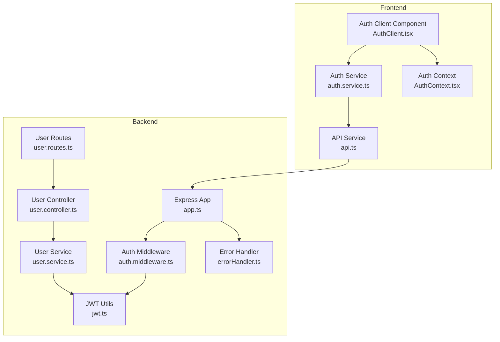
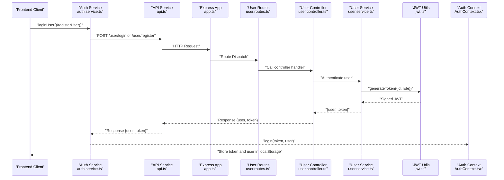
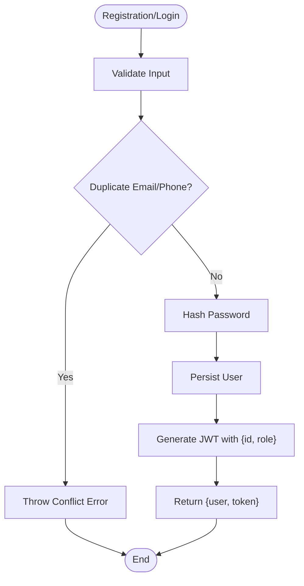
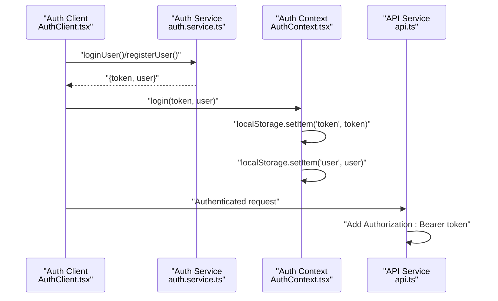
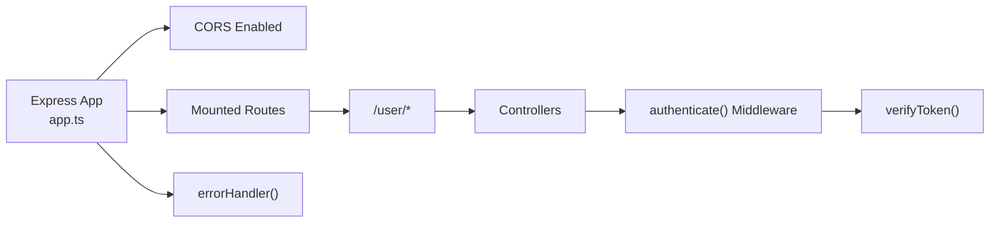
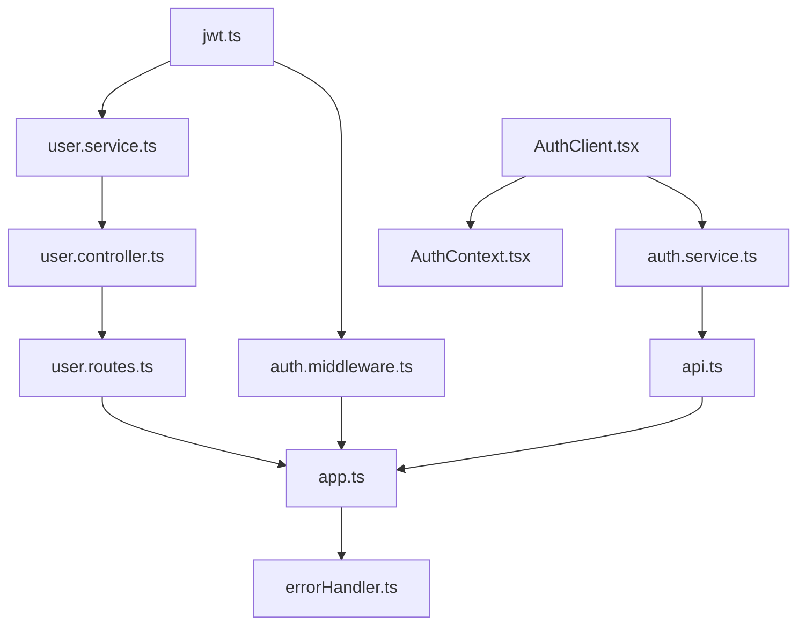

# JWT Token Implementation

<cite>
**Referenced Files in This Document**
- [jwt.ts](file://backend/src/utils/jwt.ts)
- [auth.middleware.ts](file://backend/src/middlewares/auth.middleware.ts)
- [user.service.ts](file://backend/src/services/user.service.ts)
- [user.controller.ts](file://backend/src/controllers/user.controller.ts)
- [user.routes.ts](file://backend/src/routers/user.routes.ts)
- [app.ts](file://backend/src/app.ts)
- [errorHandler.ts](file://backend/src/middlewares/errorHandler.ts)
- [ApiError.ts](file://backend/src/utils/ApiError.ts)
- [auth.service.ts](file://frontend/src/services/auth.service.ts)
- [AuthClient.tsx](file://frontend/src/components/auth/AuthClient.tsx)
- [AuthContext.tsx](file://frontend/src/contexts/AuthContext.tsx)
- [api.ts](file://frontend/src/services/api.ts)
</cite>

## Table of Contents
1. [Introduction](#introduction)
2. [Project Structure](#project-structure)
3. [Core Components](#core-components)
4. [Architecture Overview](#architecture-overview)
5. [Detailed Component Analysis](#detailed-component-analysis)
6. [Dependency Analysis](#dependency-analysis)
7. [Performance Considerations](#performance-considerations)
8. [Troubleshooting Guide](#troubleshooting-guide)
9. [Conclusion](#conclusion)

## Introduction
This document provides comprehensive documentation for the JWT token implementation in the sports booking platform. It covers token generation, verification, and validation processes, payload structure, expiration handling, secret key management, and security considerations. Practical examples of token creation, decoding, and error handling are included, along with recommendations for token storage and cross-origin security implications.

## Project Structure
The JWT implementation spans both backend and frontend components:
- Backend: JWT utilities, authentication middleware, user service/controller routes, and global error handling
- Frontend: Authentication service, client-side authentication component, context provider, and API service for HTTP requests

**Diagram sources**
- [jwt.ts:1-13](file://backend/src/utils/jwt.ts#L1-L13)
- [auth.middleware.ts:1-28](file://backend/src/middlewares/auth.middleware.ts#L1-L28)
- [user.service.ts:1-69](file://backend/src/services/user.service.ts#L1-L69)
- [user.controller.ts:1-14](file://backend/src/controllers/user.controller.ts#L1-L14)
- [user.routes.ts:1-10](file://backend/src/routers/user.routes.ts#L1-L10)
- [app.ts:1-21](file://backend/src/app.ts#L1-L21)
- [errorHandler.ts:1-38](file://backend/src/middlewares/errorHandler.ts#L1-L38)
- [auth.service.ts:1-36](file://frontend/src/services/auth.service.ts#L1-L36)
- [AuthClient.tsx:1-566](file://frontend/src/components/auth/AuthClient.tsx#L1-L566)
- [AuthContext.tsx:1-83](file://frontend/src/contexts/AuthContext.tsx#L1-L83)
- [api.ts:1-78](file://frontend/src/services/api.ts#L1-L78)

**Section sources**
- [jwt.ts:1-13](file://backend/src/utils/jwt.ts#L1-L13)
- [auth.middleware.ts:1-28](file://backend/src/middlewares/auth.middleware.ts#L1-L28)
- [user.service.ts:1-69](file://backend/src/services/user.service.ts#L1-L69)
- [user.controller.ts:1-14](file://backend/src/controllers/user.controller.ts#L1-L14)
- [user.routes.ts:1-10](file://backend/src/routers/user.routes.ts#L1-L10)
- [app.ts:1-21](file://backend/src/app.ts#L1-L21)
- [errorHandler.ts:1-38](file://backend/src/middlewares/errorHandler.ts#L1-L38)
- [auth.service.ts:1-36](file://frontend/src/services/auth.service.ts#L1-L36)
- [AuthClient.tsx:1-566](file://frontend/src/components/auth/AuthClient.tsx#L1-L566)
- [AuthContext.tsx:1-83](file://frontend/src/contexts/AuthContext.tsx#L1-L83)
- [api.ts:1-78](file://frontend/src/services/api.ts#L1-L78)

## Core Components
- JWT Utilities: Provide token signing and verification with a configurable secret and expiration
- Authentication Middleware: Extracts Bearer tokens from Authorization headers, verifies them, and attaches decoded user info to the request
- User Service: Generates tokens upon successful registration and login, embedding user ID and role
- Frontend Authentication: Handles login/signup, stores tokens in localStorage, and sends Authorization headers with requests

Key responsibilities:
- Token generation with payload containing user ID and role
- Token verification during protected route access
- Secure header transmission and storage practices
- Centralized error handling for authentication failures

**Section sources**
- [jwt.ts:1-13](file://backend/src/utils/jwt.ts#L1-L13)
- [auth.middleware.ts:1-28](file://backend/src/middlewares/auth.middleware.ts#L1-L28)
- [user.service.ts:40-65](file://backend/src/services/user.service.ts#L40-L65)
- [auth.service.ts:5-20](file://frontend/src/services/auth.service.ts#L5-L20)
- [AuthContext.tsx:46-51](file://frontend/src/contexts/AuthContext.tsx#L46-L51)

## Architecture Overview
The JWT flow integrates backend and frontend components to secure user sessions and protect routes.

**Diagram sources**
- [auth.service.ts:5-20](file://frontend/src/services/auth.service.ts#L5-L20)
- [api.ts:29-43](file://frontend/src/services/api.ts#L29-L43)
- [app.ts:15-19](file://backend/src/app.ts#L15-L19)
- [user.routes.ts:7-8](file://backend/src/routers/user.routes.ts#L7-L8)
- [user.controller.ts:11-14](file://backend/src/controllers/user.controller.ts#L11-L14)
- [user.service.ts:44-65](file://backend/src/services/user.service.ts#L44-L65)
- [jwt.ts:6-8](file://backend/src/utils/jwt.ts#L6-L8)
- [AuthContext.tsx:46-51](file://frontend/src/contexts/AuthContext.tsx#L46-L51)

## Detailed Component Analysis

### JWT Utilities
Implements token signing and verification with a secret key and expiration policy.

Implementation highlights:
- Secret key sourced from environment variables with a fallback default
- Token expiration configured to seven days
- Exported functions for generating and verifying tokens

Security considerations:
- Ensure the secret key is rotated periodically and stored securely
- Avoid exposing the secret in client-side code
- Consider stronger algorithms and shorter expiration for sensitive endpoints

**Section sources**
- [jwt.ts:1-13](file://backend/src/utils/jwt.ts#L1-L13)

### Authentication Middleware
Protects routes by extracting and validating JWTs from Authorization headers.

Processing logic:
- Validates presence of Authorization header and Bearer scheme
- Extracts token and passes to verification utility
- Attaches decoded payload to request object for downstream handlers
- Converts verification errors into standardized unauthorized responses

Error handling:
- Throws unauthorized errors for missing or malformed tokens
- Relies on global error handler for consistent response formatting

**Section sources**
- [auth.middleware.ts:9-27](file://backend/src/middlewares/auth.middleware.ts#L9-L27)
- [errorHandler.ts:5-37](file://backend/src/middlewares/errorHandler.ts#L5-L37)
- [ApiError.ts:1-13](file://backend/src/utils/ApiError.ts#L1-L13)

### User Service and Controller
Generates tokens during registration and login, returning both user data and JWT.

Token payload structure:
- id: User identifier from database
- role: User role (e.g., player or owner)

Flow:
- Registration: Hashes password, persists user, generates JWT
- Login: Verifies credentials, generates JWT

**Diagram sources**
- [user.service.ts:8-42](file://backend/src/services/user.service.ts#L8-L42)
- [user.service.ts:44-65](file://backend/src/services/user.service.ts#L44-L65)

**Section sources**
- [user.service.ts:40-65](file://backend/src/services/user.service.ts#L40-L65)
- [user.controller.ts:11-14](file://backend/src/controllers/user.controller.ts#L11-L14)

### Frontend Authentication and Token Storage
Handles user interactions, stores tokens, and sends Authorization headers.

Key behaviors:
- Stores token and user data in localStorage after successful login/signup
- Sends Authorization headers with Bearer token for authenticated requests
- Redirects based on user role after login

**Diagram sources**
- [AuthClient.tsx:55-83](file://frontend/src/components/auth/AuthClient.tsx#L55-L83)
- [AuthClient.tsx:85-133](file://frontend/src/components/auth/AuthClient.tsx#L85-L133)
- [AuthContext.tsx:46-51](file://frontend/src/contexts/AuthContext.tsx#L46-L51)
- [api.ts:3-9](file://frontend/src/services/api.ts#L3-L9)

**Section sources**
- [AuthClient.tsx:55-133](file://frontend/src/components/auth/AuthClient.tsx#L55-L133)
- [AuthContext.tsx:46-51](file://frontend/src/contexts/AuthContext.tsx#L46-L51)
- [api.ts:3-9](file://frontend/src/services/api.ts#L3-L9)

### Route Protection and Error Handling
Routes are mounted under a base path, and authentication middleware is applied to protect endpoints.

**Diagram sources**
- [app.ts:12-19](file://backend/src/app.ts#L12-L19)
- [auth.middleware.ts:9-27](file://backend/src/middlewares/auth.middleware.ts#L9-L27)
- [errorHandler.ts:5-37](file://backend/src/middlewares/errorHandler.ts#L5-L37)

**Section sources**
- [app.ts:15-19](file://backend/src/app.ts#L15-L19)
- [auth.middleware.ts:9-27](file://backend/src/middlewares/auth.middleware.ts#L9-L27)
- [errorHandler.ts:5-37](file://backend/src/middlewares/errorHandler.ts#L5-L37)

## Dependency Analysis
The JWT implementation exhibits clear separation of concerns across backend and frontend layers.

**Diagram sources**
- [jwt.ts:1-13](file://backend/src/utils/jwt.ts#L1-L13)
- [user.service.ts:1-69](file://backend/src/services/user.service.ts#L1-L69)
- [auth.middleware.ts:1-28](file://backend/src/middlewares/auth.middleware.ts#L1-L28)
- [user.controller.ts:1-14](file://backend/src/controllers/user.controller.ts#L1-L14)
- [user.routes.ts:1-10](file://backend/src/routers/user.routes.ts#L1-L10)
- [app.ts:1-21](file://backend/src/app.ts#L1-L21)
- [errorHandler.ts:1-38](file://backend/src/middlewares/errorHandler.ts#L1-L38)
- [api.ts:1-78](file://frontend/src/services/api.ts#L1-L78)
- [AuthClient.tsx:1-566](file://frontend/src/components/auth/AuthClient.tsx#L1-L566)
- [auth.service.ts:1-36](file://frontend/src/services/auth.service.ts#L1-L36)
- [AuthContext.tsx:1-83](file://frontend/src/contexts/AuthContext.tsx#L1-L83)

**Section sources**
- [jwt.ts:1-13](file://backend/src/utils/jwt.ts#L1-L13)
- [user.service.ts:1-69](file://backend/src/services/user.service.ts#L1-L69)
- [auth.middleware.ts:1-28](file://backend/src/middlewares/auth.middleware.ts#L1-L28)
- [user.controller.ts:1-14](file://backend/src/controllers/user.controller.ts#L1-L14)
- [user.routes.ts:1-10](file://backend/src/routers/user.routes.ts#L1-L10)
- [app.ts:1-21](file://backend/src/app.ts#L1-L21)
- [errorHandler.ts:1-38](file://backend/src/middlewares/errorHandler.ts#L1-L38)
- [api.ts:1-78](file://frontend/src/services/api.ts#L1-L78)
- [AuthClient.tsx:1-566](file://frontend/src/components/auth/AuthClient.tsx#L1-L566)
- [auth.service.ts:1-36](file://frontend/src/services/auth.service.ts#L1-L36)
- [AuthContext.tsx:1-83](file://frontend/src/contexts/AuthContext.tsx#L1-L83)

## Performance Considerations
- Token verification is lightweight; keep payloads minimal to reduce overhead
- Consider rotating secrets and shortening expiration for high-risk endpoints
- Avoid storing tokens in memory caches that persist across requests
- Monitor error rates from the authentication middleware to detect token-related issues

## Troubleshooting Guide
Common scenarios and resolutions:
- Missing Authorization header: Ensure frontend sends Authorization header with Bearer token
- Invalid token: Verify secret consistency and token expiration; regenerate tokens if expired
- Duplicate user registration: Handle duplicate key errors from the database layer
- Cross-origin issues: Confirm CORS configuration allows Authorization headers and credentials

Error handling flow:
- Authentication middleware throws unauthorized errors for invalid tokens
- Global error handler standardizes responses and logs unexpected errors

**Section sources**
- [auth.middleware.ts:10-26](file://backend/src/middlewares/auth.middleware.ts#L10-L26)
- [errorHandler.ts:14-36](file://backend/src/middlewares/errorHandler.ts#L14-L36)
- [ApiError.ts:1-13](file://backend/src/utils/ApiError.ts#L1-L13)

## Conclusion
The JWT implementation provides a straightforward and effective mechanism for securing user sessions in the sports booking platform. By centralizing token generation and verification, enforcing strict route protection, and implementing robust error handling, the system ensures secure and reliable authentication. For production deployments, prioritize secret rotation, shorter expirations for sensitive endpoints, and secure token storage practices to mitigate risks associated with token exposure and replay attacks.