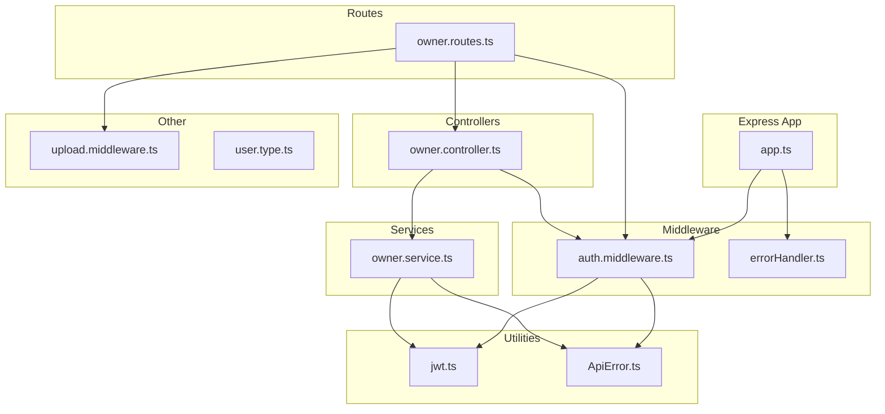
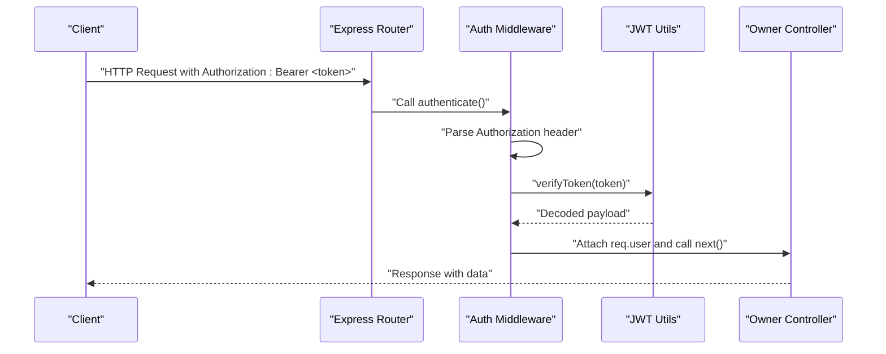
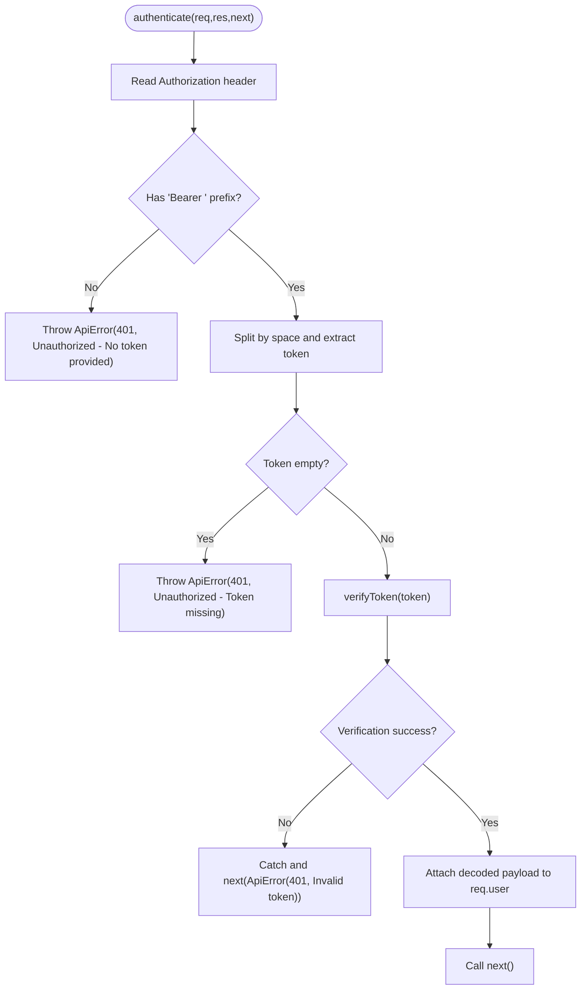
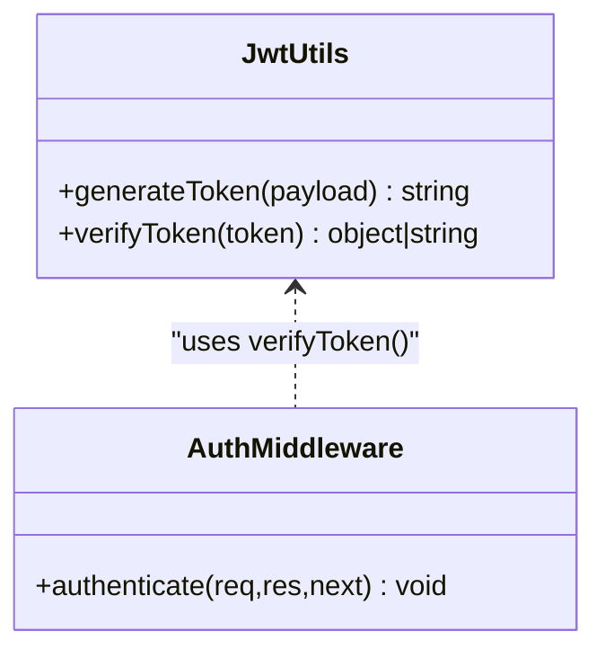
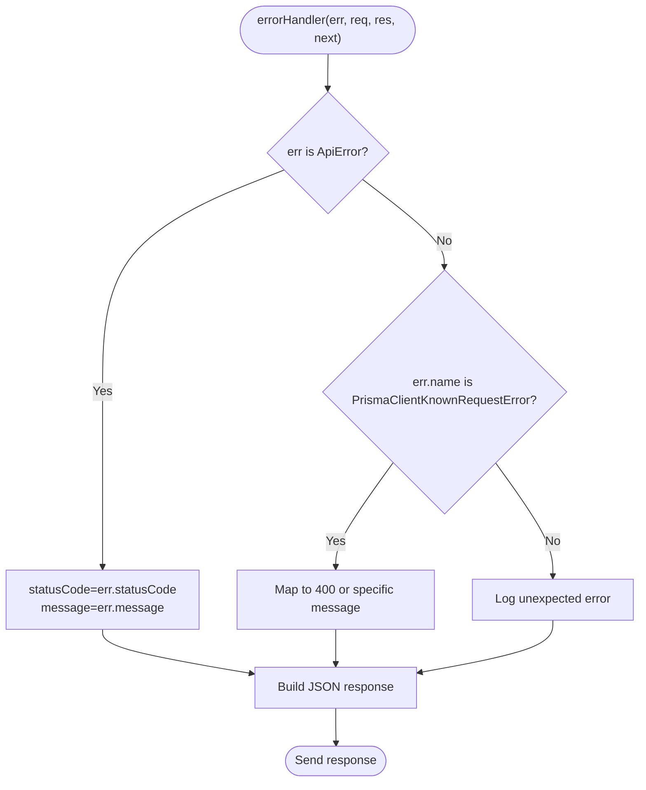
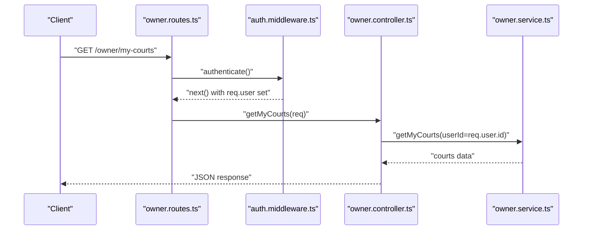
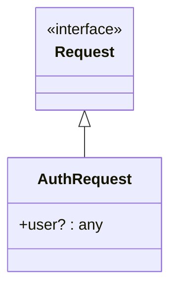
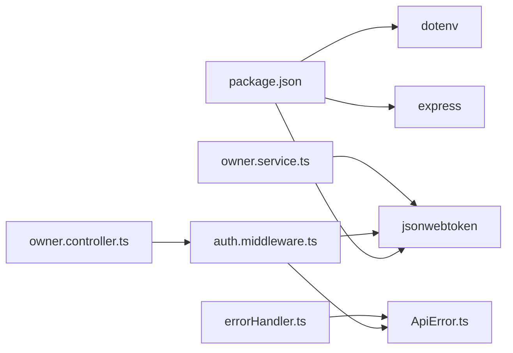
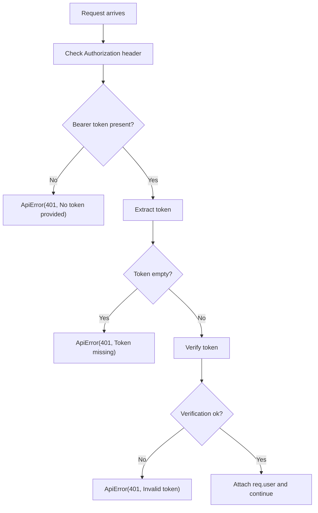

# Backend Authentication Middleware

<cite>
**Referenced Files in This Document**
- [auth.middleware.ts](file://backend/src/middlewares/auth.middleware.ts)
- [jwt.ts](file://backend/src/utils/jwt.ts)
- [ApiError.ts](file://backend/src/utils/ApiError.ts)
- [errorHandler.ts](file://backend/src/middlewares/errorHandler.ts)
- [owner.routes.ts](file://backend/src/routers/owner.routes.ts)
- [owner.controller.ts](file://backend/src/controllers/owner.controller.ts)
- [owner.service.ts](file://backend/src/services/owner.service.ts)
- [app.ts](file://backend/src/app.ts)
- [upload.middleware.ts](file://backend/src/middlewares/upload.middleware.ts)
- [user.type.ts](file://backend/src/types/user.type.ts)
- [package.json](file://backend/package.json)
</cite>

## Table of Contents
1. [Introduction](#introduction)
2. [Project Structure](#project-structure)
3. [Core Components](#core-components)
4. [Architecture Overview](#architecture-overview)
5. [Detailed Component Analysis](#detailed-component-analysis)
6. [Dependency Analysis](#dependency-analysis)
7. [Performance Considerations](#performance-considerations)
8. [Troubleshooting Guide](#troubleshooting-guide)
9. [Conclusion](#conclusion)

## Introduction
This document explains the backend authentication middleware system used to protect routes via JWT-based bearer tokens. It covers the JWT token verification process, authorization header parsing, error handling mechanisms, and how decoded user information is attached to request objects. It also documents the AuthRequest interface extension, controller usage patterns, and integration with Express routing. Security considerations, token expiration handling, and authentication failure scenarios are addressed.

## Project Structure
The authentication system spans several layers:
- Middleware: authentication guard and global error handling
- Utilities: JWT generation and verification
- Routes: protected endpoints for owners
- Controllers: handlers that access decoded user information from requests
- Services: business logic that uses the authenticated user context
- Application bootstrap: Express app wiring and middleware registration

**Diagram sources**
- [app.ts:1-21](file://backend/src/app.ts#L1-L21)
- [auth.middleware.ts:1-28](file://backend/src/middlewares/auth.middleware.ts#L1-L28)
- [jwt.ts:1-13](file://backend/src/utils/jwt.ts#L1-L13)
- [ApiError.ts:1-13](file://backend/src/utils/ApiError.ts#L1-L13)
- [errorHandler.ts:1-38](file://backend/src/middlewares/errorHandler.ts#L1-L38)
- [owner.routes.ts:1-23](file://backend/src/routers/owner.routes.ts#L1-L23)
- [owner.controller.ts:1-110](file://backend/src/controllers/owner.controller.ts#L1-L110)
- [owner.service.ts:1-148](file://backend/src/services/owner.service.ts#L1-L148)
- [upload.middleware.ts:1-19](file://backend/src/middlewares/upload.middleware.ts#L1-L19)
- [user.type.ts:1-13](file://backend/src/types/user.type.ts#L1-L13)

**Section sources**
- [app.ts:1-21](file://backend/src/app.ts#L1-L21)
- [auth.middleware.ts:1-28](file://backend/src/middlewares/auth.middleware.ts#L1-L28)
- [jwt.ts:1-13](file://backend/src/utils/jwt.ts#L1-L13)
- [errorHandler.ts:1-38](file://backend/src/middlewares/errorHandler.ts#L1-L38)
- [owner.routes.ts:1-23](file://backend/src/routers/owner.routes.ts#L1-L23)
- [owner.controller.ts:1-110](file://backend/src/controllers/owner.controller.ts#L1-L110)
- [owner.service.ts:1-148](file://backend/src/services/owner.service.ts#L1-L148)
- [upload.middleware.ts:1-19](file://backend/src/middlewares/upload.middleware.ts#L1-L19)
- [user.type.ts:1-13](file://backend/src/types/user.type.ts#L1-L13)

## Core Components
- Authentication middleware: parses Authorization header, validates Bearer token, decodes payload, attaches user to request, and forwards to next handler or error.
- JWT utilities: generate and verify tokens using a secret and expiration configuration.
- Error handling: converts ApiError instances to JSON responses with appropriate status codes.
- Route protection: owner routes demonstrate middleware usage for GET/POST/PUT/PATCH endpoints.
- Controller access: controllers read req.user.id to perform owner-specific operations.
- Service integration: services receive authenticated user context and enforce ownership checks.

**Section sources**
- [auth.middleware.ts:5-27](file://backend/src/middlewares/auth.middleware.ts#L5-L27)
- [jwt.ts:6-12](file://backend/src/utils/jwt.ts#L6-L12)
- [errorHandler.ts:4-37](file://backend/src/middlewares/errorHandler.ts#L4-L37)
- [owner.routes.ts:15-20](file://backend/src/routers/owner.routes.ts#L15-L20)
- [owner.controller.ts:42-109](file://backend/src/controllers/owner.controller.ts#L42-L109)
- [owner.service.ts:66-144](file://backend/src/services/owner.service.ts#L66-L144)

## Architecture Overview
The authentication flow integrates with Express routing and middleware chains. Requests pass through the authentication middleware before reaching protected controllers. Decoded user information is attached to the request object for downstream handlers.

**Diagram sources**
- [auth.middleware.ts:9-26](file://backend/src/middlewares/auth.middleware.ts#L9-L26)
- [jwt.ts:10-12](file://backend/src/utils/jwt.ts#L10-L12)
- [owner.routes.ts:16-20](file://backend/src/routers/owner.routes.ts#L16-L20)
- [owner.controller.ts:42-109](file://backend/src/controllers/owner.controller.ts#L42-L109)

## Detailed Component Analysis

### Authentication Middleware
The middleware enforces bearer token authentication:
- Parses the Authorization header and ensures it starts with "Bearer ".
- Extracts the token portion after the "Bearer " prefix.
- Verifies the token using the JWT utility.
- Attaches decoded user information to req.user for subsequent handlers.
- On failure, throws an ApiError with 401 status.

**Diagram sources**
- [auth.middleware.ts:9-26](file://backend/src/middlewares/auth.middleware.ts#L9-L26)
- [jwt.ts:10-12](file://backend/src/utils/jwt.ts#L10-L12)
- [ApiError.ts:1-13](file://backend/src/utils/ApiError.ts#L1-13)

**Section sources**
- [auth.middleware.ts:5-27](file://backend/src/middlewares/auth.middleware.ts#L5-L27)

### JWT Utilities
- Secret and expiration are configured in the JWT utility module.
- Tokens are generated with an expiration period and verified against the secret.
- The verify function returns the decoded payload used by the middleware.

**Diagram sources**
- [jwt.ts:6-12](file://backend/src/utils/jwt.ts#L6-L12)
- [auth.middleware.ts:21](file://backend/src/middlewares/auth.middleware.ts#L21)

**Section sources**
- [jwt.ts:3-12](file://backend/src/utils/jwt.ts#L3-L12)

### Error Handling
- The global error handler inspects thrown errors.
- ApiError instances propagate their status codes and messages.
- Non-ApiError exceptions are logged and returned as generic internal server errors.
- Prisma-specific errors are normalized to user-friendly messages.

**Diagram sources**
- [errorHandler.ts:4-37](file://backend/src/middlewares/errorHandler.ts#L4-L37)
- [ApiError.ts:1-13](file://backend/src/utils/ApiError.ts#L1-L13)

**Section sources**
- [errorHandler.ts:4-37](file://backend/src/middlewares/errorHandler.ts#L4-L37)

### Route Protection and Controller Usage
- Owner routes apply the authenticate middleware to multiple endpoints.
- Controllers access req.user.id to perform owner-specific operations.
- Ownership checks are enforced in services to prevent unauthorized access.

**Diagram sources**
- [owner.routes.ts:16](file://backend/src/routers/owner.routes.ts#L16)
- [auth.middleware.ts:22](file://backend/src/middlewares/auth.middleware.ts#L22)
- [owner.controller.ts:42-50](file://backend/src/controllers/owner.controller.ts#L42-L50)
- [owner.service.ts:66-70](file://backend/src/services/owner.service.ts#L66-L70)

**Section sources**
- [owner.routes.ts:15-20](file://backend/src/routers/owner.routes.ts#L15-L20)
- [owner.controller.ts:42-109](file://backend/src/controllers/owner.controller.ts#L42-L109)
- [owner.service.ts:66-144](file://backend/src/services/owner.service.ts#L66-L144)

### AuthRequest Interface Extension
- The AuthRequest interface extends Express Request to include an optional user property.
- Controllers typed as AuthRequest can safely access req.user.id after middleware passes.

**Diagram sources**
- [auth.middleware.ts:5-7](file://backend/src/middlewares/auth.middleware.ts#L5-L7)
- [owner.controller.ts:4](file://backend/src/controllers/owner.controller.ts#L4)

**Section sources**
- [auth.middleware.ts:5-7](file://backend/src/middlewares/auth.middleware.ts#L5-L7)
- [owner.controller.ts:4](file://backend/src/controllers/owner.controller.ts#L4)

### Token Payload and User Object Structure
- The token payload used by the system includes at least an identifier and role.
- The middleware attaches the decoded payload to req.user; controllers then use req.user.id for operations.
- The user type definitions in the project define client-side structures but do not reflect the server-side token payload.

**Section sources**
- [jwt.ts:62](file://backend/src/utils/jwt.ts#L62)
- [auth.middleware.ts:22](file://backend/src/middlewares/auth.middleware.ts#L22)
- [owner.controller.ts:44](file://backend/src/controllers/owner.controller.ts#L44)
- [user.type.ts:1-13](file://backend/src/types/user.type.ts#L1-L13)

### Express Routing Integration
- The Express app registers routes under path prefixes and applies the global error handler last.
- Owner routes import and apply the authenticate middleware to selected endpoints.

**Section sources**
- [app.ts:15-19](file://backend/src/app.ts#L15-L19)
- [owner.routes.ts:1-23](file://backend/src/routers/owner.routes.ts#L1-L23)

## Dependency Analysis
The authentication system relies on:
- jsonwebtoken for token signing and verification
- dotenv for environment configuration
- Express for middleware and routing
- Global error handling for consistent error responses

**Diagram sources**
- [package.json:14-28](file://backend/package.json#L14-L28)
- [auth.middleware.ts:2](file://backend/src/middlewares/auth.middleware.ts#L2)
- [ApiError.ts:1-13](file://backend/src/utils/ApiError.ts#L1-L13)
- [errorHandler.ts:2](file://backend/src/middlewares/errorHandler.ts#L2)
- [owner.controller.ts:4](file://backend/src/controllers/owner.controller.ts#L4)
- [owner.service.ts:4](file://backend/src/services/owner.service.ts#L4)

**Section sources**
- [package.json:14-28](file://backend/package.json#L14-L28)
- [auth.middleware.ts:1-3](file://backend/src/middlewares/auth.middleware.ts#L1-L3)
- [errorHandler.ts:1-2](file://backend/src/middlewares/errorHandler.ts#L1-L2)
- [owner.controller.ts:1-4](file://backend/src/controllers/owner.controller.ts#L1-L4)
- [owner.service.ts:1-9](file://backend/src/services/owner.service.ts#L1-L9)

## Performance Considerations
- Token verification occurs per request; keep the JWT_SECRET secure and avoid excessive middleware overhead.
- Consider caching frequently accessed user roles or permissions if needed, but ensure cache invalidation aligns with token lifecycle.
- Ensure proper logging and monitoring for authentication failures to detect abuse patterns.

## Troubleshooting Guide
Common authentication failure scenarios and their handling:
- Missing Authorization header or malformed Bearer scheme:
  - The middleware throws an ApiError with 401 status and a clear message.
- Empty or missing token value after "Bearer ":
  - The middleware throws an ApiError with 401 status.
- Invalid or expired token:
  - The JWT verify operation fails; the middleware catches the error and forwards an ApiError with 401 status.
- Global error response:
  - The error handler converts ApiError instances into JSON responses with appropriate status codes.

**Diagram sources**
- [auth.middleware.ts:11-26](file://backend/src/middlewares/auth.middleware.ts#L11-L26)
- [jwt.ts:10-12](file://backend/src/utils/jwt.ts#L10-L12)
- [ApiError.ts:1-13](file://backend/src/utils/ApiError.ts#L1-L13)

**Section sources**
- [auth.middleware.ts:11-26](file://backend/src/middlewares/auth.middleware.ts#L11-L26)
- [errorHandler.ts:14-16](file://backend/src/middlewares/errorHandler.ts#L14-L16)

## Conclusion
The authentication middleware provides a robust, standardized mechanism for protecting routes using JWT bearer tokens. It parses headers, verifies tokens, attaches decoded user information to the request, and delegates to controllers and services. The global error handler ensures consistent error responses, while route-level middleware application demonstrates practical usage patterns. Security considerations include enforcing the Bearer scheme, validating token presence, and leveraging the error handling pipeline for transparent failure reporting.