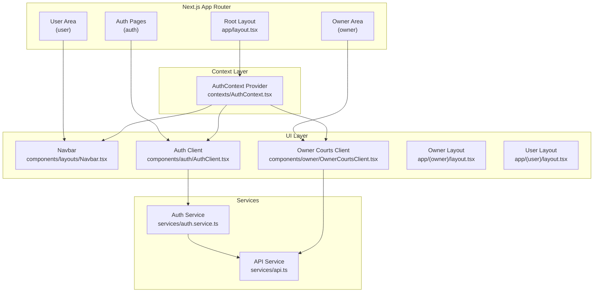
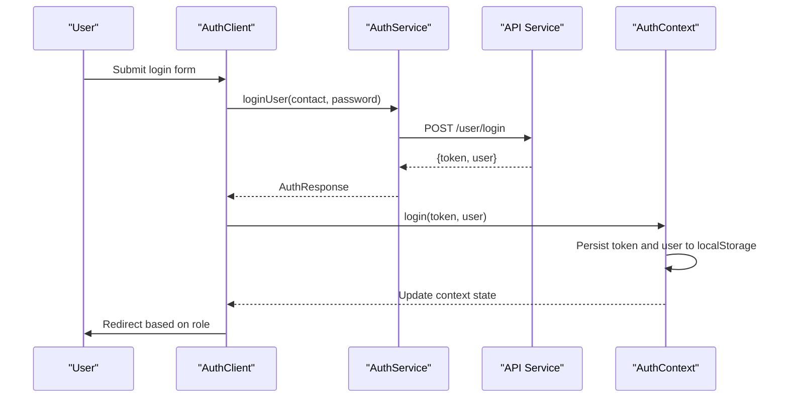
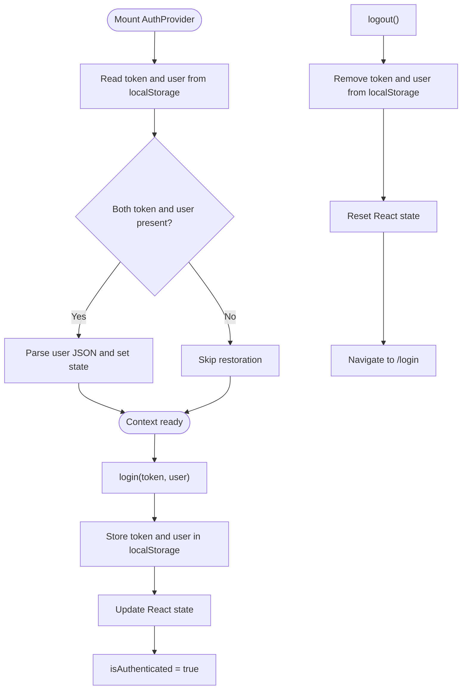
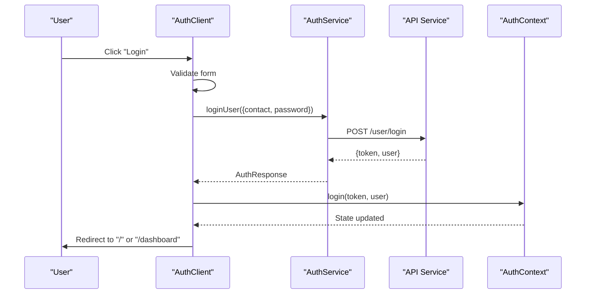
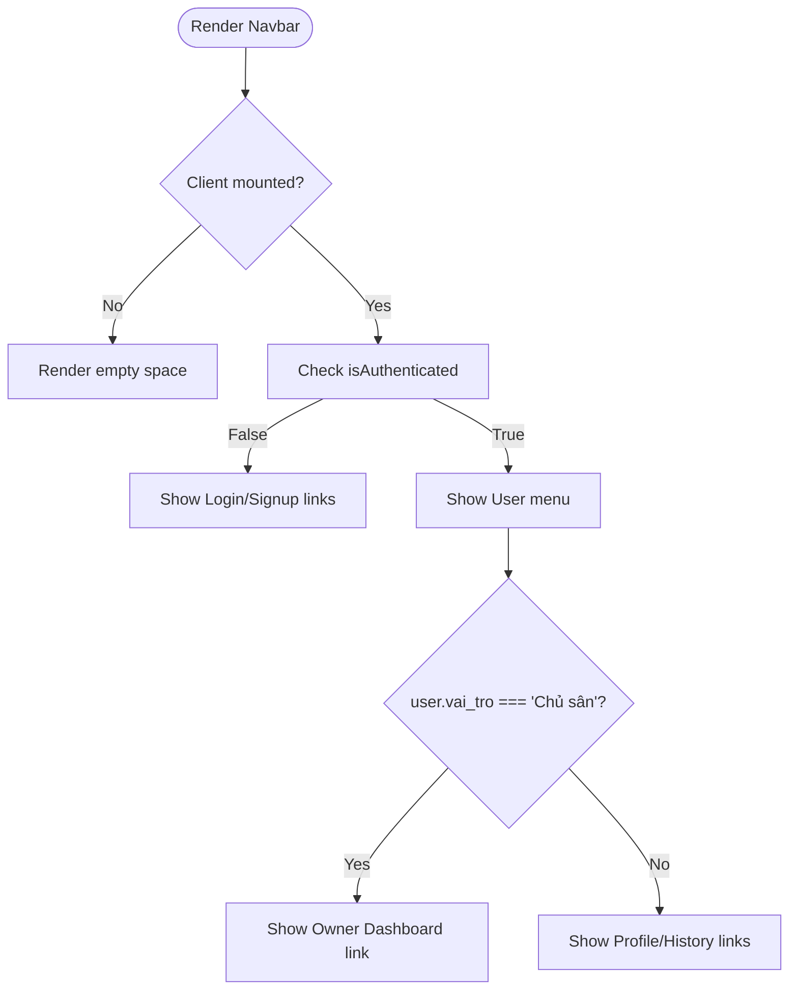
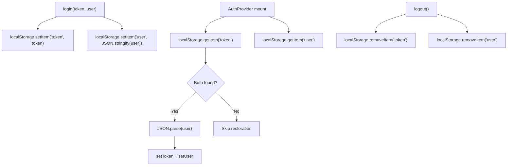
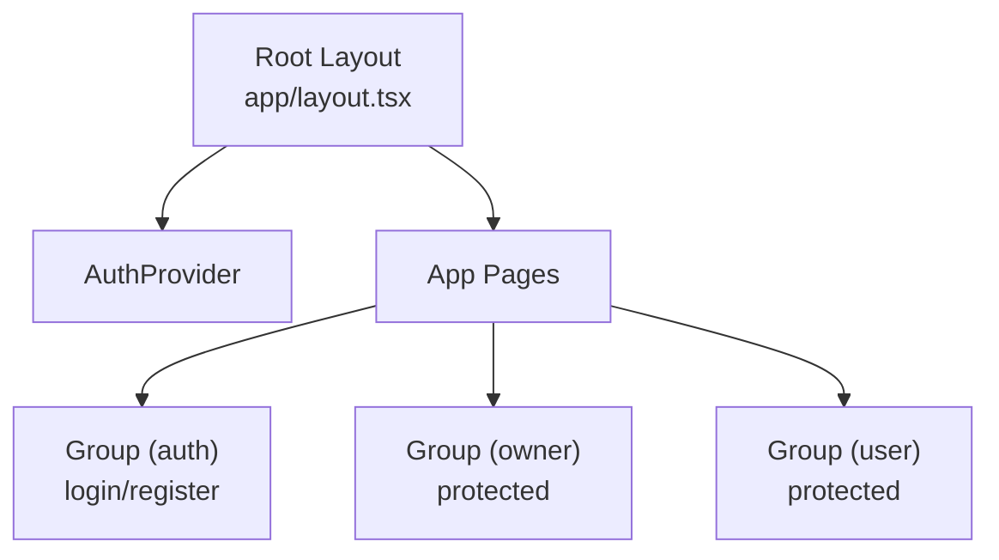
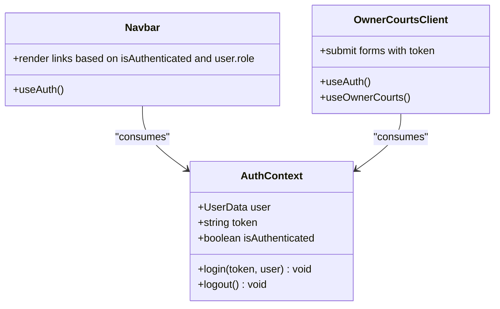
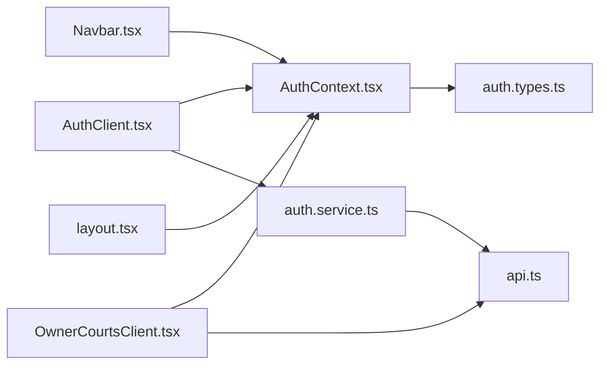

# Frontend Authentication Context

<cite>
**Referenced Files in This Document**
- [AuthContext.tsx](file://frontend/src/contexts/AuthContext.tsx)
- [AuthClient.tsx](file://frontend/src/components/auth/AuthClient.tsx)
- [auth.service.ts](file://frontend/src/services/auth.service.ts)
- [api.ts](file://frontend/src/services/api.ts)
- [auth.types.ts](file://frontend/src/types/auth.types.ts)
- [layout.tsx](file://frontend/src/app/layout.tsx)
- [login/page.tsx](file://frontend/src/app/(auth)/login/page.tsx)
- [register/page.tsx](file://frontend/src/app/(auth)/register/page.tsx)
- [Navbar.tsx](file://frontend/src/components/layouts/Navbar.tsx)
- [OwnerCourtsClient.tsx](file://frontend/src/components/owner/OwnerCourtsClient.tsx)
- [OwnerBookingsClient.tsx](file://frontend/src/components/owner/OwnerBookingsClient.tsx)
- [owner/layout.tsx](file://frontend/src/app/(owner)/layout.tsx)
- [user/layout.tsx](file://frontend/src/app/(user)/layout.tsx)
</cite>

## Table of Contents
1. [Introduction](#introduction)
2. [Project Structure](#project-structure)
3. [Core Components](#core-components)
4. [Architecture Overview](#architecture-overview)
5. [Detailed Component Analysis](#detailed-component-analysis)
6. [Dependency Analysis](#dependency-analysis)
7. [Performance Considerations](#performance-considerations)
8. [Troubleshooting Guide](#troubleshooting-guide)
9. [Conclusion](#conclusion)

## Introduction
This document explains the frontend authentication context system built with React Context API in a Next.js application. It covers how user state is managed, how authentication state is persisted across browser sessions, and how login/logout flows integrate with the application. It also documents how to consume the authentication context in components, how role-based UI conditional rendering works, and how the system integrates with Next.js App Router for protected pages and layouts.

## Project Structure
The authentication system spans several layers:
- Context provider that manages user and token state and persists them to localStorage
- Service layer that performs network requests for login and registration
- UI components that trigger authentication actions and render role-aware views
- Next.js App Router pages and layouts that wrap the app with the provider and define protected areas

**Diagram sources**
- [layout.tsx:26-44](file://frontend/src/app/layout.tsx#L26-L44)
- [AuthContext.tsx:26-74](file://frontend/src/contexts/AuthContext.tsx#L26-L74)
- [AuthClient.tsx:13-133](file://frontend/src/components/auth/AuthClient.tsx#L13-L133)
- [auth.service.ts:4-35](file://frontend/src/services/auth.service.ts#L4-L35)
- [api.ts:1-78](file://frontend/src/services/api.ts#L1-L78)
- [Navbar.tsx:9-118](file://frontend/src/components/layouts/Navbar.tsx#L9-L118)
- [OwnerCourtsClient.tsx:18-149](file://frontend/src/components/owner/OwnerCourtsClient.tsx#L18-L149)
- [owner/layout.tsx](file://frontend/src/app/(owner)/layout.tsx#L9-L19)
- [user/layout.tsx](file://frontend/src/app/(user)/layout.tsx#L4-L16)

**Section sources**
- [layout.tsx:26-44](file://frontend/src/app/layout.tsx#L26-L44)
- [AuthContext.tsx:26-74](file://frontend/src/contexts/AuthContext.tsx#L26-L74)

## Core Components
- AuthContext: Provides user, token, login, logout, and isAuthenticated to the app. Persists state to localStorage and restores it on initial render.
- AuthClient: Implements the login and registration forms, calls the auth service, and invokes the context login to update state and storage.
- AuthService: Encapsulates API calls for login, user registration, and owner registration.
- API Service: Centralizes HTTP requests with Authorization header injection and response handling.
- Navbar: Consumes authentication context to conditionally render role-specific navigation and user actions.
- OwnerCourtsClient: Demonstrates consuming token from context for authenticated API calls.
- Root Layout: Wraps the entire app with AuthProvider to make authentication state globally available.

**Section sources**
- [AuthContext.tsx:6-82](file://frontend/src/contexts/AuthContext.tsx#L6-L82)
- [AuthClient.tsx:55-133](file://frontend/src/components/auth/AuthClient.tsx#L55-L133)
- [auth.service.ts:4-35](file://frontend/src/services/auth.service.ts#L4-L35)
- [api.ts:1-78](file://frontend/src/services/api.ts#L1-L78)
- [Navbar.tsx:9-118](file://frontend/src/components/layouts/Navbar.tsx#L9-L118)
- [OwnerCourtsClient.tsx:18-149](file://frontend/src/components/owner/OwnerCourtsClient.tsx#L18-L149)
- [layout.tsx:26-44](file://frontend/src/app/layout.tsx#L26-L44)

## Architecture Overview
The authentication flow connects UI components, services, and the context provider:

**Diagram sources**
- [AuthClient.tsx:55-83](file://frontend/src/components/auth/AuthClient.tsx#L55-L83)
- [auth.service.ts:5-11](file://frontend/src/services/auth.service.ts#L5-L11)
- [api.ts:29-43](file://frontend/src/services/api.ts#L29-L43)
- [AuthContext.tsx:46-51](file://frontend/src/contexts/AuthContext.tsx#L46-L51)

## Detailed Component Analysis

### AuthContext Implementation
AuthContext manages:
- State: user object and token
- Persistence: localStorage for token and user
- Restoration: On mount, reads localStorage and sets state
- Actions: login updates state and storage; logout clears state and storage and redirects

Key behaviors:
- Automatic restoration: On first render, the provider reads token and user from localStorage and parses JSON safely.
- Token propagation: The login action stores both token and user in localStorage and updates React state.
- Logout flow: Clears state and localStorage, then navigates to the login page.

**Diagram sources**
- [AuthContext.tsx:31-59](file://frontend/src/contexts/AuthContext.tsx#L31-L59)

**Section sources**
- [AuthContext.tsx:26-82](file://frontend/src/contexts/AuthContext.tsx#L26-L82)

### Login and Registration Forms (AuthClient)
AuthClient handles:
- Tab switching between login and signup
- Role selection for signup (player vs owner)
- Form validation and submission
- Calling AuthService methods
- Invoking context login to persist credentials
- Conditional redirects after successful auth

Important flows:
- Login submit: Validates inputs, calls authService.loginUser, then calls context login and redirects depending on user role.
- Registration submit: Validates password confirmation, chooses owner or player registration, calls appropriate service, then calls context login and redirects.

**Diagram sources**
- [AuthClient.tsx:55-83](file://frontend/src/components/auth/AuthClient.tsx#L55-L83)
- [auth.service.ts:5-11](file://frontend/src/services/auth.service.ts#L5-L11)
- [api.ts:29-43](file://frontend/src/services/api.ts#L29-L43)
- [AuthContext.tsx:46-51](file://frontend/src/contexts/AuthContext.tsx#L46-L51)

**Section sources**
- [AuthClient.tsx:55-133](file://frontend/src/components/auth/AuthClient.tsx#L55-L133)
- [auth.types.ts:10-39](file://frontend/src/types/auth.types.ts#L10-L39)

### Protected Route Rendering and Role-Based UI
Protected rendering and role-based UI are handled in two ways:
- UI-level conditional rendering: Navbar checks isAuthenticated and user role to show different links and actions.
- Page-level routing: Next.js App Router groups routes under folders like (owner) and (user) to segment protected areas.

Examples:
- Navbar displays profile/dashboard links conditionally based on isAuthenticated and user role.
- Owner area layout demonstrates a protected section for owners.

**Diagram sources**
- [Navbar.tsx:21-35](file://frontend/src/components/layouts/Navbar.tsx#L21-L35)
- [layout.tsx:26-44](file://frontend/src/app/layout.tsx#L26-L44)

**Section sources**
- [Navbar.tsx:9-118](file://frontend/src/components/layouts/Navbar.tsx#L9-L118)
- [owner/layout.tsx](file://frontend/src/app/(owner)/layout.tsx#L9-L19)
- [user/layout.tsx](file://frontend/src/app/(user)/layout.tsx#L4-L16)

### Token Storage Mechanisms and Automatic Restoration
- Storage: Both token and user are stored in localStorage during login.
- Restoration: On initial render, the provider reads localStorage and parses user JSON to restore state.
- Cleanup: On logout, both token and user are removed from localStorage.

**Diagram sources**
- [AuthContext.tsx:31-59](file://frontend/src/contexts/AuthContext.tsx#L31-L59)

**Section sources**
- [AuthContext.tsx:31-59](file://frontend/src/contexts/AuthContext.tsx#L31-L59)

### Integration with Next.js App Router and Protected Pages
- Root layout wraps the entire app with AuthProvider, ensuring global availability of authentication state.
- Auth pages are grouped under (auth) and rendered with suspense boundaries.
- Protected areas are grouped under (owner) and (user) with dedicated layouts.

**Diagram sources**
- [layout.tsx:26-44](file://frontend/src/app/layout.tsx#L26-L44)
- [login/page.tsx](file://frontend/src/app/(auth)/login/page.tsx#L9-L15)
- [register/page.tsx](file://frontend/src/app/(auth)/register/page.tsx#L3-L5)
- [owner/layout.tsx](file://frontend/src/app/(owner)/layout.tsx#L9-L19)
- [user/layout.tsx](file://frontend/src/app/(user)/layout.tsx#L4-L16)

**Section sources**
- [layout.tsx:26-44](file://frontend/src/app/layout.tsx#L26-L44)
- [login/page.tsx](file://frontend/src/app/(auth)/login/page.tsx#L9-L15)
- [register/page.tsx](file://frontend/src/app/(auth)/register/page.tsx#L3-L5)

### Consuming Authentication Context in Components
Common patterns:
- Using useAuth to access user, token, login, logout, and isAuthenticated
- Role-based UI rendering in Navbar
- Token consumption for authenticated API calls in OwnerCourtsClient

**Diagram sources**
- [AuthContext.tsx:16-22](file://frontend/src/contexts/AuthContext.tsx#L16-L22)
- [Navbar.tsx:9-118](file://frontend/src/components/layouts/Navbar.tsx#L9-L118)
- [OwnerCourtsClient.tsx:18-149](file://frontend/src/components/owner/OwnerCourtsClient.tsx#L18-L149)

**Section sources**
- [Navbar.tsx:9-118](file://frontend/src/components/layouts/Navbar.tsx#L9-L118)
- [OwnerCourtsClient.tsx:18-149](file://frontend/src/components/owner/OwnerCourtsClient.tsx#L18-L149)

## Dependency Analysis
The authentication system exhibits clear separation of concerns:
- Context depends on React state and localStorage
- Services depend on API service for HTTP communication
- UI components depend on context and services
- Router groups pages to enforce logical separation of public and protected areas

**Diagram sources**
- [AuthContext.tsx:6-22](file://frontend/src/contexts/AuthContext.tsx#L6-L22)
- [auth.types.ts:1-40](file://frontend/src/types/auth.types.ts#L1-L40)
- [AuthClient.tsx:55-133](file://frontend/src/components/auth/AuthClient.tsx#L55-L133)
- [auth.service.ts:4-35](file://frontend/src/services/auth.service.ts#L4-L35)
- [api.ts:1-78](file://frontend/src/services/api.ts#L1-L78)
- [Navbar.tsx:9-118](file://frontend/src/components/layouts/Navbar.tsx#L9-L118)
- [OwnerCourtsClient.tsx:18-149](file://frontend/src/components/owner/OwnerCourtsClient.tsx#L18-L149)
- [layout.tsx:26-44](file://frontend/src/app/layout.tsx#L26-L44)

**Section sources**
- [AuthContext.tsx:6-22](file://frontend/src/contexts/AuthContext.tsx#L6-L22)
- [auth.types.ts:1-40](file://frontend/src/types/auth.types.ts#L1-L40)
- [AuthClient.tsx:55-133](file://frontend/src/components/auth/AuthClient.tsx#L55-L133)
- [auth.service.ts:4-35](file://frontend/src/services/auth.service.ts#L4-L35)
- [api.ts:1-78](file://frontend/src/services/api.ts#L1-L78)
- [Navbar.tsx:9-118](file://frontend/src/components/layouts/Navbar.tsx#L9-L118)
- [OwnerCourtsClient.tsx:18-149](file://frontend/src/components/owner/OwnerCourtsClient.tsx#L18-L149)
- [layout.tsx:26-44](file://frontend/src/app/layout.tsx#L26-L44)

## Performance Considerations
- LocalStorage I/O: Reading/writing token and user on mount and login is lightweight but avoid excessive writes.
- Hydration: The provider runs on the client, preventing hydration mismatches when used inside a client component.
- Conditional rendering: Role-based UI avoids unnecessary computations by gating links behind isAuthenticated checks.

## Troubleshooting Guide
Common issues and resolutions:
- useAuth outside provider: Ensure components using useAuth are rendered within the AuthProvider. The hook throws an error if used outside the provider.
- Invalid localStorage data: On mount, the provider attempts to parse user JSON. If parsing fails, it logs an error and continues without restoring state.
- Authentication errors: AuthService and API service propagate errors thrown by the backend. Handle these in components to display user-friendly messages.

**Section sources**
- [AuthContext.tsx:76-82](file://frontend/src/contexts/AuthContext.tsx#L76-L82)
- [AuthContext.tsx:31-44](file://frontend/src/contexts/AuthContext.tsx#L31-L44)
- [AuthClient.tsx:74-82](file://frontend/src/components/auth/AuthClient.tsx#L74-L82)
- [api.ts:11-17](file://frontend/src/services/api.ts#L11-L17)

## Conclusion
The frontend authentication context system provides a robust, client-side state management solution integrated with Next.js App Router. It persists authentication state to localStorage, restores it automatically on load, and exposes a simple API for components to consume. Login and registration flows integrate seamlessly with services and the context, while role-based UI rendering ensures appropriate navigation and access patterns. The current implementation focuses on client-side state and storage; token refresh strategies and session management can be considered for future enhancements.