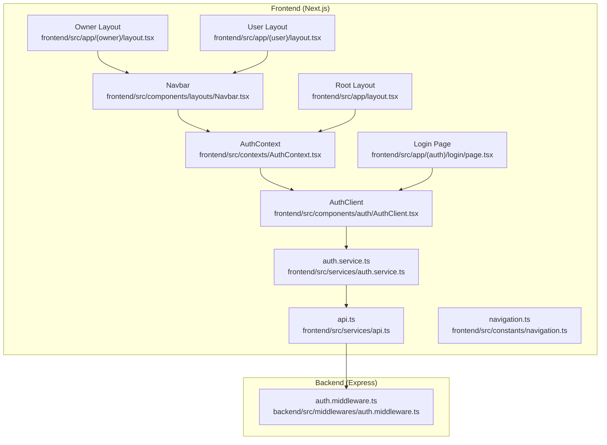
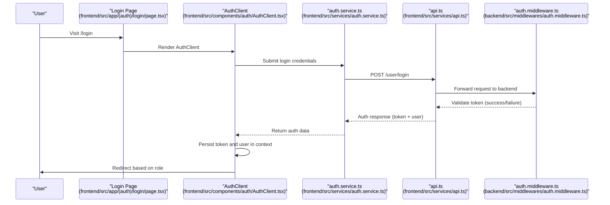
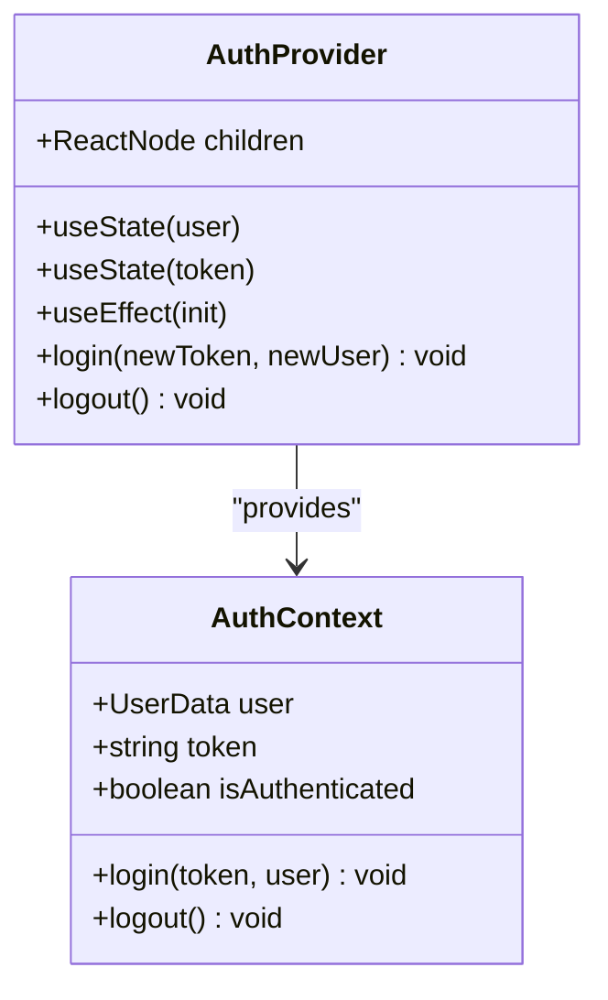
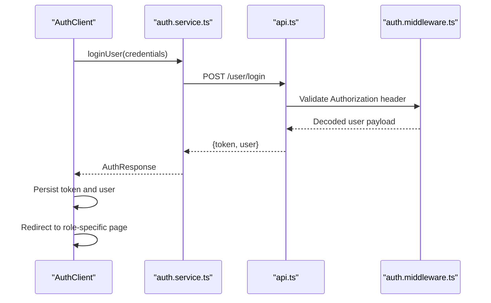
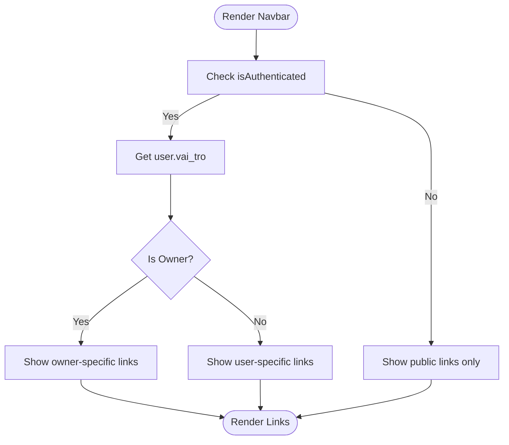
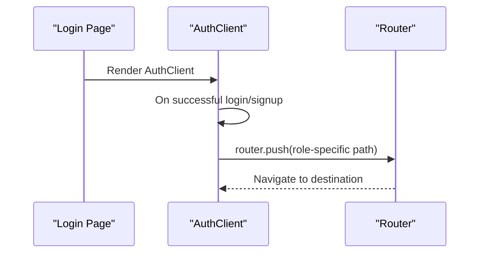
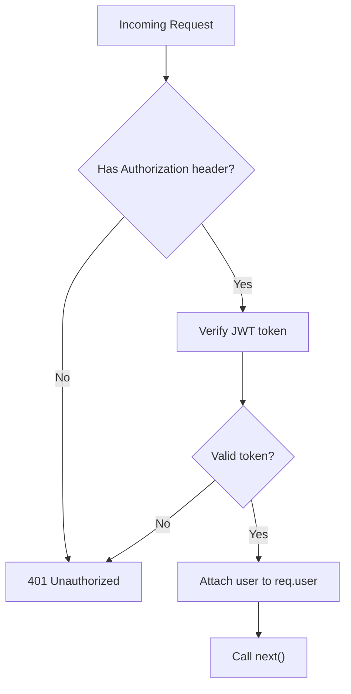
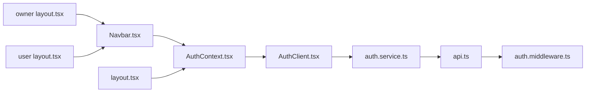

# Protected Route Implementation

<cite>
**Referenced Files in This Document**
- [AuthContext.tsx](file://frontend/src/contexts/AuthContext.tsx)
- [AuthClient.tsx](file://frontend/src/components/auth/AuthClient.tsx)
- [auth.service.ts](file://frontend/src/services/auth.service.ts)
- [api.ts](file://frontend/src/services/api.ts)
- [auth.middleware.ts](file://backend/src/middlewares/auth.middleware.ts)
- [Navbar.tsx](file://frontend/src/components/layouts/Navbar.tsx)
- [navigation.ts](file://frontend/src/constants/navigation.ts)
- [layout.tsx](file://frontend/src/app/layout.tsx)
- [layout.tsx](file://frontend/src/app/(owner)/layout.tsx)
- [layout.tsx](file://frontend/src/app/(user)/layout.tsx)
- [page.tsx](file://frontend/src/app/(auth)/login/page.tsx)
- [page.tsx](file://frontend/src/app/(owner)/bookings/page.tsx)
- [page.tsx](file://frontend/src/app/(user)/page.tsx)
- [auth.types.ts](file://frontend/src/types/auth.types.ts)
</cite>

## Table of Contents
1. [Introduction](#introduction)
2. [Project Structure](#project-structure)
3. [Core Components](#core-components)
4. [Architecture Overview](#architecture-overview)
5. [Detailed Component Analysis](#detailed-component-analysis)
6. [Dependency Analysis](#dependency-analysis)
7. [Performance Considerations](#performance-considerations)
8. [Troubleshooting Guide](#troubleshooting-guide)
9. [Conclusion](#conclusion)

## Introduction
This document explains the protected route implementation across different role tiers in a Next.js App Router application. It covers authentication guards, route protection strategies, redirect mechanisms, and how authentication state determines access to routes and navigation visibility. The system integrates client-side authentication state with server-side validation and provides role-based navigation structures for users, owners, and administrators.

## Project Structure
The application follows a layered structure with clear separation between frontend and backend concerns:
- Frontend (Next.js App Router):
  - Authentication context and provider
  - Client-side authentication forms and services
  - Role-aware navigation and layouts
  - Public and protected pages organized under route groups
- Backend (Express):
  - Authentication middleware validating JWT tokens
  - API endpoints for user and owner operations

**Diagram sources**
- [AuthContext.tsx:1-83](file://frontend/src/contexts/AuthContext.tsx#L1-L83)
- [AuthClient.tsx:1-566](file://frontend/src/components/auth/AuthClient.tsx#L1-L566)
- [auth.service.ts:1-36](file://frontend/src/services/auth.service.ts#L1-L36)
- [api.ts:1-78](file://frontend/src/services/api.ts#L1-L78)
- [Navbar.tsx:1-119](file://frontend/src/components/layouts/Navbar.tsx#L1-L119)
- [navigation.ts:1-25](file://frontend/src/constants/navigation.ts#L1-L25)
- [layout.tsx:1-50](file://frontend/src/app/layout.tsx#L1-L50)
- [layout.tsx](file://frontend/src/app/(owner)/layout.tsx#L1-L20)
- [layout.tsx](file://frontend/src/app/(user)/layout.tsx#L1-L17)
- [page.tsx](file://frontend/src/app/(auth)/login/page.tsx#L1-L16)
- [auth.middleware.ts:1-28](file://backend/src/middlewares/auth.middleware.ts#L1-L28)

**Section sources**
- [layout.tsx:26-48](file://frontend/src/app/layout.tsx#L26-L48)
- [auth.middleware.ts:9-27](file://backend/src/middlewares/auth.middleware.ts#L9-L27)

## Core Components
- Authentication Context and Provider:
  - Manages user session state, token persistence, and login/logout actions.
  - Provides centralized authentication state to all components.
- Client-Side Authentication:
  - Handles login/signup flows, form validation, and role-based redirection after authentication.
- API Layer:
  - Encapsulates HTTP requests with optional Authorization headers.
- Server-Side Middleware:
  - Validates JWT tokens and attaches user info to requests.
- Navigation and Layouts:
  - Role-aware navigation menus and page layouts for user, owner, and admin roles.

**Section sources**
- [AuthContext.tsx:26-74](file://frontend/src/contexts/AuthContext.tsx#L26-L74)
- [AuthClient.tsx:55-83](file://frontend/src/components/auth/AuthClient.tsx#L55-L83)
- [auth.service.ts:4-35](file://frontend/src/services/auth.service.ts#L4-L35)
- [api.ts:3-9](file://frontend/src/services/api.ts#L3-L9)
- [auth.middleware.ts:9-27](file://backend/src/middlewares/auth.middleware.ts#L9-L27)
- [Navbar.tsx:21-35](file://frontend/src/components/layouts/Navbar.tsx#L21-L35)

## Architecture Overview
The protected route architecture combines client-side authentication state with server-side validation. On successful authentication, the client stores token and user data, then navigates to role-specific destinations. Protected pages rely on the presence of a valid token for server-side validation.

**Diagram sources**
- [page.tsx](file://frontend/src/app/(auth)/login/page.tsx#L9-L15)
- [AuthClient.tsx:55-83](file://frontend/src/components/auth/AuthClient.tsx#L55-L83)
- [auth.service.ts:5-11](file://frontend/src/services/auth.service.ts#L5-L11)
- [api.ts:29-43](file://frontend/src/services/api.ts#L29-L43)
- [auth.middleware.ts:9-27](file://backend/src/middlewares/auth.middleware.ts#L9-L27)

## Detailed Component Analysis

### Authentication Context and Provider
- Responsibilities:
  - Initialize authentication state from localStorage on mount.
  - Expose login and logout functions that update context and persist data.
  - Provide isAuthenticated flag and user/token access to child components.
- Key behaviors:
  - On logout, clears localStorage and redirects to the login page.

**Diagram sources**
- [AuthContext.tsx:6-24](file://frontend/src/contexts/AuthContext.tsx#L6-L24)
- [AuthContext.tsx:26-74](file://frontend/src/contexts/AuthContext.tsx#L26-L74)

**Section sources**
- [AuthContext.tsx:26-74](file://frontend/src/contexts/AuthContext.tsx#L26-L74)

### Client-Side Authentication Flow
- Responsibilities:
  - Manage login/signup forms and validation.
  - Call authentication services and handle errors.
  - Redirect users to role-specific destinations after successful login/signup.
- Integration points:
  - Uses AuthContext for state updates.
  - Uses authService for network requests.
  - Uses api.ts for HTTP communication with Authorization headers.

**Diagram sources**
- [AuthClient.tsx:55-83](file://frontend/src/components/auth/AuthClient.tsx#L55-L83)
- [auth.service.ts:5-11](file://frontend/src/services/auth.service.ts#L5-L11)
- [api.ts:29-43](file://frontend/src/services/api.ts#L29-L43)
- [auth.middleware.ts:9-27](file://backend/src/middlewares/auth.middleware.ts#L9-L27)

**Section sources**
- [AuthClient.tsx:55-83](file://frontend/src/components/auth/AuthClient.tsx#L55-L83)
- [auth.service.ts:5-11](file://frontend/src/services/auth.service.ts#L5-L11)
- [api.ts:3-9](file://frontend/src/services/api.ts#L3-L9)

### Role-Based Navigation and Layouts
- Navigation visibility:
  - Navbar renders different links based on authentication state and user role.
  - Role-aware links include owner dashboards and user-specific profiles/history.
- Layouts:
  - Owner layout wraps protected owner pages with sidebar navigation.
  - User layout integrates Navbar and Footer for authenticated users.
- Constants:
  - navigation.ts centralizes nav links for user/admin/owner roles.

**Diagram sources**
- [Navbar.tsx:21-35](file://frontend/src/components/layouts/Navbar.tsx#L21-L35)
- [navigation.ts:6-24](file://frontend/src/constants/navigation.ts#L6-L24)

**Section sources**
- [Navbar.tsx:21-35](file://frontend/src/components/layouts/Navbar.tsx#L21-L35)
- [navigation.ts:6-24](file://frontend/src/constants/navigation.ts#L6-L24)
- [layout.tsx](file://frontend/src/app/(owner)/layout.tsx#L9-L19)
- [layout.tsx](file://frontend/src/app/(user)/layout.tsx#L4-L16)

### Protected Route Patterns and Redirect Mechanisms
- Login page:
  - Suspense wrapper ensures smooth loading while AuthClient hydrates.
  - After successful login/signup, redirects to role-specific destination.
- Owner and User pages:
  - Owner pages are grouped under a dedicated route group with a layout.
  - User pages are grouped under a route group with a layout integrating Navbar/Footer.
- Redirect logic:
  - AuthClient redirects to owner dashboard for owner users and to home for regular users.

**Diagram sources**
- [page.tsx](file://frontend/src/app/(auth)/login/page.tsx#L9-L15)
- [AuthClient.tsx:68-73](file://frontend/src/components/auth/AuthClient.tsx#L68-L73)

**Section sources**
- [page.tsx](file://frontend/src/app/(auth)/login/page.tsx#L9-L15)
- [AuthClient.tsx:68-73](file://frontend/src/components/auth/AuthClient.tsx#L68-L73)
- [layout.tsx](file://frontend/src/app/(owner)/layout.tsx#L9-L19)
- [layout.tsx](file://frontend/src/app/(user)/layout.tsx#L4-L16)

### Server-Side Validation Integration
- Middleware:
  - Extracts Authorization header, verifies token, and attaches user payload to request.
  - Returns 401 Unauthorized for missing or invalid tokens.
- API service:
  - Automatically includes Authorization header when token is present.

**Diagram sources**
- [auth.middleware.ts:9-27](file://backend/src/middlewares/auth.middleware.ts#L9-L27)
- [api.ts:3-9](file://frontend/src/services/api.ts#L3-L9)

**Section sources**
- [auth.middleware.ts:9-27](file://backend/src/middlewares/auth.middleware.ts#L9-L27)
- [api.ts:3-9](file://frontend/src/services/api.ts#L3-L9)

### Fallback Mechanisms for Unauthorized Access
- Client-side:
  - AuthContext logout clears token and user, then redirects to login.
  - Navbar hides role-specific links when not authenticated.
- Server-side:
  - Middleware rejects requests without valid tokens, ensuring unauthorized access is blocked at the API boundary.

**Section sources**
- [AuthContext.tsx:53-59](file://frontend/src/contexts/AuthContext.tsx#L53-L59)
- [Navbar.tsx:24-35](file://frontend/src/components/layouts/Navbar.tsx#L24-L35)
- [auth.middleware.ts:12-26](file://backend/src/middlewares/auth.middleware.ts#L12-L26)

## Dependency Analysis
The authentication system exhibits clear separation of concerns:
- Frontend depends on:
  - AuthContext for state management
  - AuthClient for user interactions
  - AuthService for API calls
  - API service for HTTP transport with Authorization headers
- Backend depends on:
  - JWT verification utility for token validation
  - Express middleware pattern for request interception

**Diagram sources**
- [AuthContext.tsx:1-83](file://frontend/src/contexts/AuthContext.tsx#L1-L83)
- [AuthClient.tsx:1-566](file://frontend/src/components/auth/AuthClient.tsx#L1-L566)
- [auth.service.ts:1-36](file://frontend/src/services/auth.service.ts#L1-L36)
- [api.ts:1-78](file://frontend/src/services/api.ts#L1-L78)
- [auth.middleware.ts:1-28](file://backend/src/middlewares/auth.middleware.ts#L1-L28)
- [Navbar.tsx:1-119](file://frontend/src/components/layouts/Navbar.tsx#L1-L119)
- [layout.tsx:26-48](file://frontend/src/app/layout.tsx#L26-L48)
- [layout.tsx](file://frontend/src/app/(owner)/layout.tsx#L1-L20)
- [layout.tsx](file://frontend/src/app/(user)/layout.tsx#L1-L17)

**Section sources**
- [AuthContext.tsx:1-83](file://frontend/src/contexts/AuthContext.tsx#L1-L83)
- [AuthClient.tsx:1-566](file://frontend/src/components/auth/AuthClient.tsx#L1-L566)
- [auth.service.ts:1-36](file://frontend/src/services/auth.service.ts#L1-L36)
- [api.ts:1-78](file://frontend/src/services/api.ts#L1-L78)
- [auth.middleware.ts:1-28](file://backend/src/middlewares/auth.middleware.ts#L1-L28)
- [Navbar.tsx:1-119](file://frontend/src/components/layouts/Navbar.tsx#L1-L119)
- [layout.tsx:26-48](file://frontend/src/app/layout.tsx#L26-L48)

## Performance Considerations
- Minimize re-renders:
  - Keep authentication state in a dedicated context to avoid prop drilling.
- Efficient token handling:
  - Store tokens in secure, HTTP-only cookies or localStorage depending on deployment needs.
- Lazy loading:
  - Continue using Suspense for login page hydration to improve perceived performance.
- Network optimization:
  - Reuse API service helpers to reduce duplication and improve caching strategies.

## Troubleshooting Guide
Common issues and resolutions:
- Stuck on login page after authentication:
  - Verify token and user are persisted in localStorage and context.
  - Confirm AuthClient redirects to the correct role-specific path.
- Navigation links not appearing:
  - Ensure isAuthenticated is true and user role is correctly populated.
  - Check Navbar conditional rendering logic.
- 401 Unauthorized errors:
  - Confirm Authorization header is included in requests.
  - Verify token validity and expiration on the backend.

**Section sources**
- [AuthContext.tsx:32-51](file://frontend/src/contexts/AuthContext.tsx#L32-L51)
- [AuthClient.tsx:68-73](file://frontend/src/components/auth/AuthClient.tsx#L68-L73)
- [Navbar.tsx:24-35](file://frontend/src/components/layouts/Navbar.tsx#L24-L35)
- [api.ts:3-9](file://frontend/src/services/api.ts#L3-L9)
- [auth.middleware.ts:12-26](file://backend/src/middlewares/auth.middleware.ts#L12-L26)

## Conclusion
The protected route implementation leverages a robust client-side authentication context integrated with server-side token validation. Role-aware navigation and layout grouping provide a seamless user experience, while centralized authentication services and middleware ensure consistent security across the application. The design supports scalable enhancements for additional roles and fine-grained access controls.