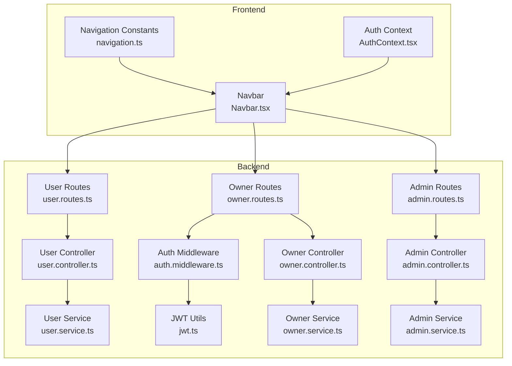
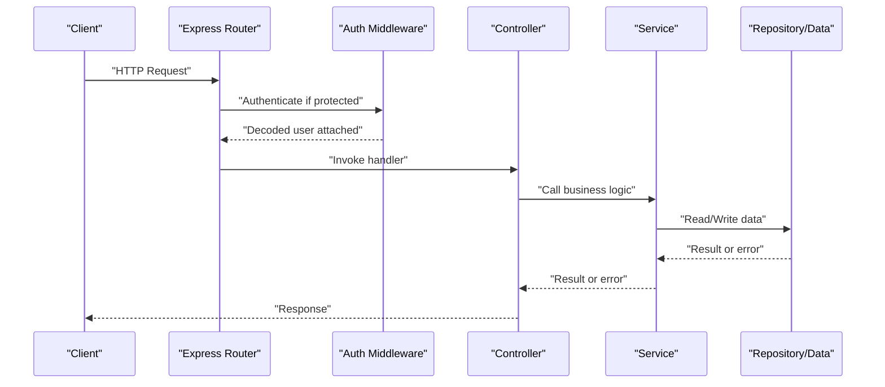
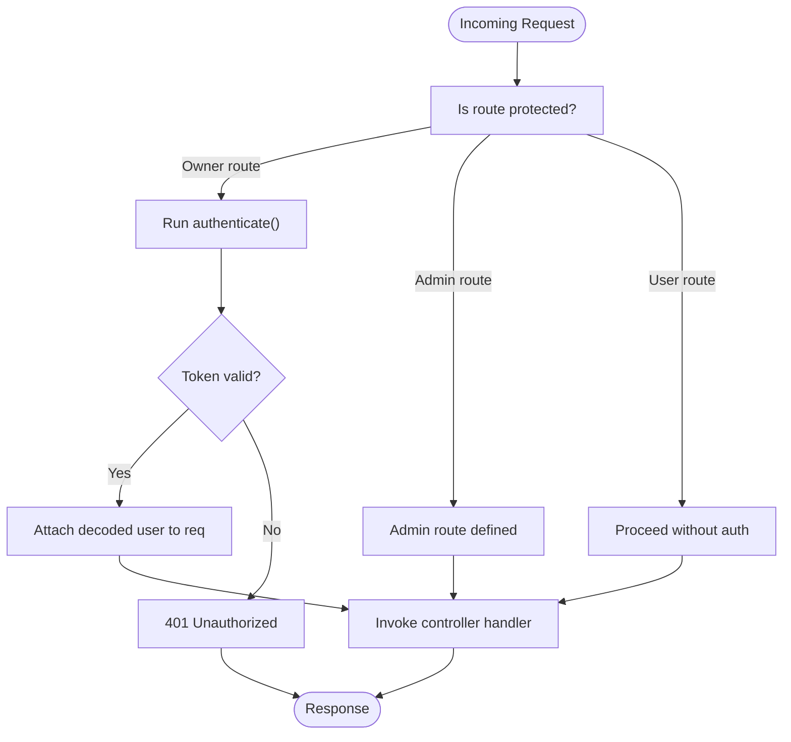
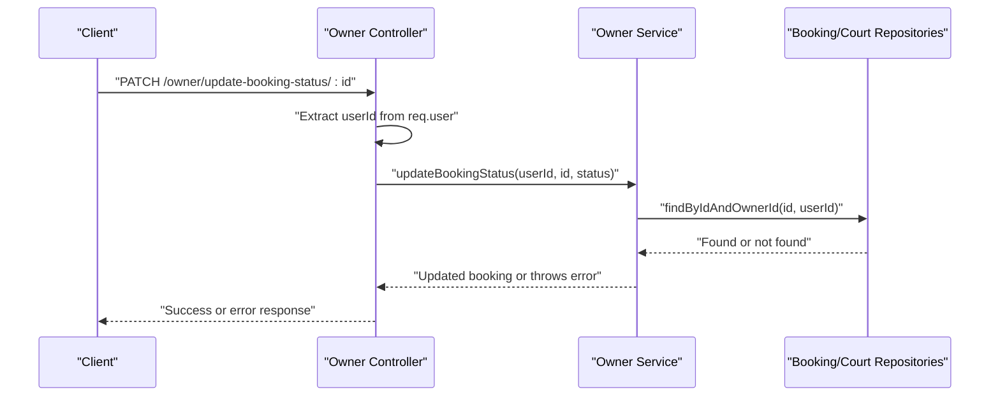
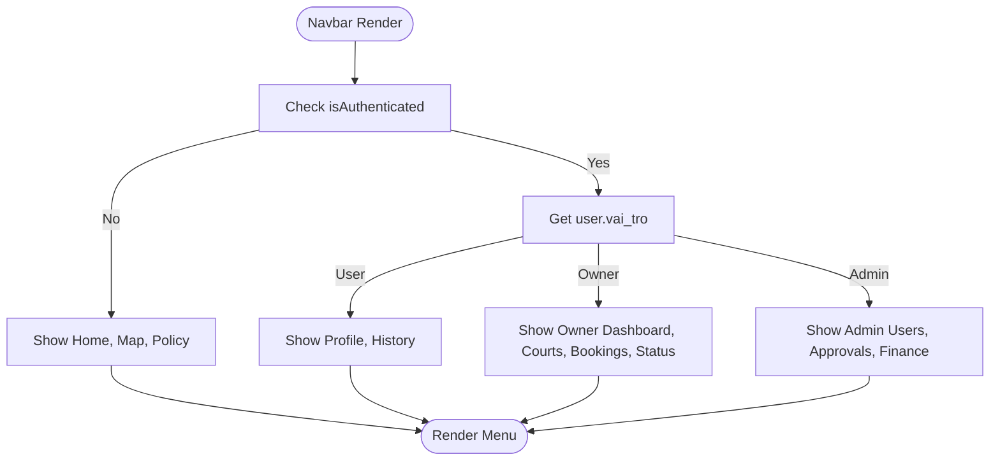
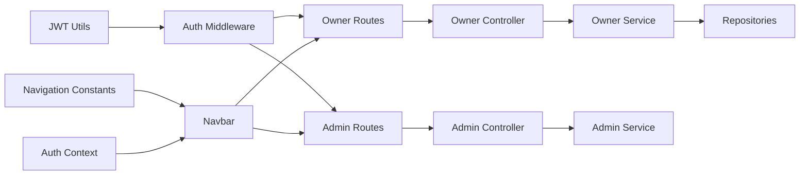

# Role Permission Mapping

<cite>
**Referenced Files in This Document**
- [auth.middleware.ts](file://backend/src/middlewares/auth.middleware.ts)
- [jwt.ts](file://backend/src/utils/jwt.ts)
- [admin.routes.ts](file://backend/src/routers/admin.routes.ts)
- [owner.routes.ts](file://backend/src/routers/owner.routes.ts)
- [user.routes.ts](file://backend/src/routers/user.routes.ts)
- [admin.controller.ts](file://backend/src/controllers/admin.controller.ts)
- [owner.controller.ts](file://backend/src/controllers/owner.controller.ts)
- [user.controller.ts](file://backend/src/controllers/user.controller.ts)
- [admin.service.ts](file://backend/src/services/admin.service.ts)
- [owner.service.ts](file://backend/src/services/owner.service.ts)
- [user.service.ts](file://backend/src/services/user.service.ts)
- [navigation.ts](file://frontend/src/constants/navigation.ts)
- [AuthContext.tsx](file://frontend/src/contexts/AuthContext.tsx)
- [Navbar.tsx](file://frontend/src/components/layouts/Navbar.tsx)
- [user.type.ts](file://backend/src/types/user.type.ts)
- [owner.type.ts](file://backend/src/types/owner.type.ts)
</cite>

## Table of Contents
1. [Introduction](#introduction)
2. [Project Structure](#project-structure)
3. [Core Components](#core-components)
4. [Architecture Overview](#architecture-overview)
5. [Detailed Component Analysis](#detailed-component-analysis)
6. [Dependency Analysis](#dependency-analysis)
7. [Performance Considerations](#performance-considerations)
8. [Troubleshooting Guide](#troubleshooting-guide)
9. [Conclusion](#conclusion)
10. [Appendices](#appendices)

## Introduction
This document explains the role-to-permission mapping and access control matrices implemented in the application. It documents the three-tier role hierarchy (User, Owner, Admin), route-level protection mechanisms, controller-level authorization checks, and frontend navigation restrictions. It also presents permission matrices, inheritance patterns, escalation workflows, privilege boundaries, and practical debugging guidance for unauthorized access attempts.

## Project Structure
The access control system spans backend routes, middleware, controllers, services, and frontend navigation and authentication context. Authentication is token-based and enforced at the route level. Authorization is primarily role-based, with explicit checks in controllers for resource ownership.

**Diagram sources**
- [navigation.ts:1-25](file://frontend/src/constants/navigation.ts#L1-L25)
- [AuthContext.tsx:1-83](file://frontend/src/contexts/AuthContext.tsx#L1-L83)
- [Navbar.tsx:1-119](file://frontend/src/components/layouts/Navbar.tsx#L1-L119)
- [user.routes.ts:1-10](file://backend/src/routers/user.routes.ts#L1-L10)
- [owner.routes.ts:1-23](file://backend/src/routers/owner.routes.ts#L1-L23)
- [admin.routes.ts:1-6](file://backend/src/routers/admin.routes.ts#L1-L6)
- [auth.middleware.ts:1-28](file://backend/src/middlewares/auth.middleware.ts#L1-L28)
- [user.controller.ts:1-14](file://backend/src/controllers/user.controller.ts#L1-L14)
- [owner.controller.ts:1-110](file://backend/src/controllers/owner.controller.ts#L1-L110)
- [admin.controller.ts:1-13](file://backend/src/controllers/admin.controller.ts#L1-L13)
- [user.service.ts:1-69](file://backend/src/services/user.service.ts#L1-L69)
- [owner.service.ts:1-148](file://backend/src/services/owner.service.ts#L1-L148)
- [admin.service.ts:1-57](file://backend/src/services/admin.service.ts#L1-L57)
- [jwt.ts:1-13](file://backend/src/utils/jwt.ts#L1-L13)

**Section sources**
- [user.routes.ts:1-10](file://backend/src/routers/user.routes.ts#L1-L10)
- [owner.routes.ts:1-23](file://backend/src/routers/owner.routes.ts#L1-L23)
- [admin.routes.ts:1-6](file://backend/src/routers/admin.routes.ts#L1-L6)
- [auth.middleware.ts:1-28](file://backend/src/middlewares/auth.middleware.ts#L1-L28)
- [jwt.ts:1-13](file://backend/src/utils/jwt.ts#L1-L13)
- [user.controller.ts:1-14](file://backend/src/controllers/user.controller.ts#L1-L14)
- [owner.controller.ts:1-110](file://backend/src/controllers/owner.controller.ts#L1-L110)
- [admin.controller.ts:1-13](file://backend/src/controllers/admin.controller.ts#L1-L13)
- [user.service.ts:1-69](file://backend/src/services/user.service.ts#L1-L69)
- [owner.service.ts:1-148](file://backend/src/services/owner.service.ts#L1-L148)
- [admin.service.ts:1-57](file://backend/src/services/admin.service.ts#L1-L57)
- [navigation.ts:1-25](file://frontend/src/constants/navigation.ts#L1-L25)
- [AuthContext.tsx:1-83](file://frontend/src/contexts/AuthContext.tsx#L1-L83)
- [Navbar.tsx:1-119](file://frontend/src/components/layouts/Navbar.tsx#L1-L119)

## Core Components
- Authentication middleware enforces bearer token presence and validates tokens, attaching the decoded user payload to the request.
- Controllers implement route handlers and perform controller-level authorization checks against resource ownership.
- Services encapsulate business logic and repository interactions, returning data or throwing errors for unauthorized access.
- Frontend navigation and context manage role-aware UI rendering and user session state.

Key implementation references:
- Authentication middleware and token verification: [auth.middleware.ts:1-28], [jwt.ts:1-13]
- Route definitions and middleware binding: [user.routes.ts:1-10], [owner.routes.ts:1-23], [admin.routes.ts:1-6]
- Controller authorization checks: [owner.controller.ts:42-110], [admin.controller.ts:1-13]
- Service-level ownership validations: [owner.service.ts:113-144], [admin.service.ts:1-57]
- Frontend role-aware navigation: [navigation.ts:1-25], [AuthContext.tsx:1-83], [Navbar.tsx:1-119]

**Section sources**
- [auth.middleware.ts:1-28](file://backend/src/middlewares/auth.middleware.ts#L1-L28)
- [jwt.ts:1-13](file://backend/src/utils/jwt.ts#L1-L13)
- [user.routes.ts:1-10](file://backend/src/routers/user.routes.ts#L1-L10)
- [owner.routes.ts:1-23](file://backend/src/routers/owner.routes.ts#L1-L23)
- [admin.routes.ts:1-6](file://backend/src/routers/admin.routes.ts#L1-L6)
- [owner.controller.ts:42-110](file://backend/src/controllers/owner.controller.ts#L42-L110)
- [admin.controller.ts:1-13](file://backend/src/controllers/admin.controller.ts#L1-L13)
- [owner.service.ts:113-144](file://backend/src/services/owner.service.ts#L113-L144)
- [admin.service.ts:1-57](file://backend/src/services/admin.service.ts#L1-L57)
- [navigation.ts:1-25](file://frontend/src/constants/navigation.ts#L1-L25)
- [AuthContext.tsx:1-83](file://frontend/src/contexts/AuthContext.tsx#L1-L83)
- [Navbar.tsx:1-119](file://frontend/src/components/layouts/Navbar.tsx#L1-L119)

## Architecture Overview
Access control follows a layered approach:
- Route-level protection: Owner-only routes require authentication; Admin-only endpoints are exposed but not bound to an auth middleware in the provided files.
- Controller-level authorization: Controllers check whether the authenticated user owns the target resource.
- Frontend navigation: UI visibility and routing depend on the user’s role and authentication state.

**Diagram sources**
- [owner.routes.ts:1-23](file://backend/src/routers/owner.routes.ts#L1-L23)
- [auth.middleware.ts:1-28](file://backend/src/middlewares/auth.middleware.ts#L1-L28)
- [owner.controller.ts:42-110](file://backend/src/controllers/owner.controller.ts#L42-L110)
- [owner.service.ts:113-144](file://backend/src/services/owner.service.ts#L113-L144)

## Detailed Component Analysis

### Roles and Permissions Matrix
The application defines three roles:
- User: Registered clients who can create accounts and log in.
- Owner: Venue owners who can manage their courts and bookings.
- Admin: Administrators who can list users and approve venues.

Permission matrix (endpoints and UI components):

- User role
  - Endpoints: POST /user/register, POST /user/login
  - UI components: Profile, History, Home, Map
  - Notes: No route-level auth required for registration/login; Owner-only routes require authentication.

- Owner role
  - Endpoints: POST /owner/register, GET /owner/my-courts, POST /owner/add-court, PUT /owner/update-court/:ma_san, GET /owner/my-bookings, PATCH /owner/update-booking-status/:id
  - Controller-level checks: Ownership verification per resource (court, booking).
  - UI components: Owner Dashboard, Courts, Bookings, Status

- Admin role
  - Endpoints: GET /admin/, GET /admin/:id
  - Controller-level checks: Not present in provided files; authorization should be enforced at controller/service level.
  - UI components: Admin Users, Approvals, Finance

Notes:
- The provided backend route files do not bind an authentication middleware to admin routes. Authorization enforcement should be implemented in admin controllers/services.
- Frontend navigation constants define role-specific links; Navbar renders role-aware menus.

**Section sources**
- [user.routes.ts:1-10](file://backend/src/routers/user.routes.ts#L1-L10)
- [owner.routes.ts:1-23](file://backend/src/routers/owner.routes.ts#L1-L23)
- [admin.routes.ts:1-6](file://backend/src/routers/admin.routes.ts#L1-L6)
- [user.controller.ts:1-14](file://backend/src/controllers/user.controller.ts#L1-L14)
- [owner.controller.ts:42-110](file://backend/src/controllers/owner.controller.ts#L42-L110)
- [admin.controller.ts:1-13](file://backend/src/controllers/admin.controller.ts#L1-L13)
- [owner.service.ts:113-144](file://backend/src/services/owner.service.ts#L113-L144)
- [navigation.ts:1-25](file://frontend/src/constants/navigation.ts#L1-L25)
- [Navbar.tsx:1-119](file://frontend/src/components/layouts/Navbar.tsx#L1-L119)

### Route-Level Protection Mechanisms
- Owner routes are protected by the authentication middleware:
  - GET /owner/my-courts
  - POST /owner/add-court
  - PUT /owner/update-court/:ma_san
  - GET /owner/my-bookings
  - PATCH /owner/update-booking-status/:id
- Admin routes are defined but not bound to authentication middleware in the provided files.

**Diagram sources**
- [owner.routes.ts:1-23](file://backend/src/routers/owner.routes.ts#L1-L23)
- [auth.middleware.ts:1-28](file://backend/src/middlewares/auth.middleware.ts#L1-L28)

**Section sources**
- [owner.routes.ts:1-23](file://backend/src/routers/owner.routes.ts#L1-L23)
- [auth.middleware.ts:1-28](file://backend/src/middlewares/auth.middleware.ts#L1-L28)

### Controller-Level Authorization Checks
Controllers enforce ownership-based authorization:
- Owner endpoints validate that requested resources belong to the authenticated user:
  - Update court: [owner.controller.ts:113-129], [owner.service.ts:113-129]
  - Update booking status: [owner.controller.ts:135-144], [owner.service.ts:135-144]
- Admin endpoints currently lack explicit authorization checks in the provided files.

**Diagram sources**
- [owner.controller.ts:94-109](file://backend/src/controllers/owner.controller.ts#L94-L109)
- [owner.service.ts:135-144](file://backend/src/services/owner.service.ts#L135-L144)

**Section sources**
- [owner.controller.ts:94-109](file://backend/src/controllers/owner.controller.ts#L94-L109)
- [owner.service.ts:135-144](file://backend/src/services/owner.service.ts#L135-L144)

### Frontend Navigation Restrictions
- Navigation constants define role-specific links for Admin and Owner.
- Navbar renders role-aware menu items and redirects unauthenticated users to login.
- Auth context stores user role and token, enabling UI decisions.

**Diagram sources**
- [navigation.ts:1-25](file://frontend/src/constants/navigation.ts#L1-L25)
- [AuthContext.tsx:1-83](file://frontend/src/contexts/AuthContext.tsx#L1-L83)
- [Navbar.tsx:1-119](file://frontend/src/components/layouts/Navbar.tsx#L1-L119)

**Section sources**
- [navigation.ts:1-25](file://frontend/src/constants/navigation.ts#L1-L25)
- [AuthContext.tsx:1-83](file://frontend/src/contexts/AuthContext.tsx#L1-L83)
- [Navbar.tsx:1-119](file://frontend/src/components/layouts/Navbar.tsx#L1-L119)

### Role Inheritance Patterns and Privilege Boundaries
- Role hierarchy:
  - User: Base role for general clients.
  - Owner: Elevated privileges to manage venues and bookings.
  - Admin: Highest privileges for system administration.
- Privilege boundaries:
  - Owner actions are restricted to resources owned by the user (enforced in controllers/services).
  - Admin actions are not bound to auth middleware in the provided files; authorization should be enforced in admin controllers/services.
- Escalation workflow:
  - Users self-register and receive the "User" role.
  - Owners self-register and receive the "Owner" role pending admin approval.
  - Admin approvals elevate status; admin routes remain protected by auth in other parts of the backend.

**Section sources**
- [owner.service.ts:40-45](file://backend/src/services/owner.service.ts#L40-L45)
- [admin.routes.ts:1-6](file://backend/src/routers/admin.routes.ts#L1-L6)
- [owner.controller.ts:42-110](file://backend/src/controllers/owner.controller.ts#L42-L110)

### Permission Validation Examples
- Successful owner update of booking status:
  - Controller extracts userId from the authenticated request and delegates to service.
  - Service verifies ownership and updates status.
  - Reference: [owner.controller.ts:94-109], [owner.service.ts:135-144]
- Unauthorized access attempt:
  - Attempting to update another owner’s booking without proper authorization results in an error response.
  - Reference: [owner.service.ts:139-141]

**Section sources**
- [owner.controller.ts:94-109](file://backend/src/controllers/owner.controller.ts#L94-L109)
- [owner.service.ts:135-144](file://backend/src/services/owner.service.ts#L135-L144)

## Dependency Analysis
Access control depends on:
- Authentication middleware for token validation and user attachment.
- Controllers for enforcing ownership-based authorization.
- Services for performing repository queries and returning errors for unauthorized access.
- Frontend context and navbar for role-aware UI rendering.

**Diagram sources**
- [jwt.ts:1-13](file://backend/src/utils/jwt.ts#L1-L13)
- [auth.middleware.ts:1-28](file://backend/src/middlewares/auth.middleware.ts#L1-L28)
- [owner.routes.ts:1-23](file://backend/src/routers/owner.routes.ts#L1-L23)
- [owner.controller.ts:42-110](file://backend/src/controllers/owner.controller.ts#L42-L110)
- [owner.service.ts:113-144](file://backend/src/services/owner.service.ts#L113-L144)
- [admin.routes.ts:1-6](file://backend/src/routers/admin.routes.ts#L1-L6)
- [admin.controller.ts:1-13](file://backend/src/controllers/admin.controller.ts#L1-L13)
- [admin.service.ts:1-57](file://backend/src/services/admin.service.ts#L1-L57)
- [navigation.ts:1-25](file://frontend/src/constants/navigation.ts#L1-L25)
- [AuthContext.tsx:1-83](file://frontend/src/contexts/AuthContext.tsx#L1-L83)
- [Navbar.tsx:1-119](file://frontend/src/components/layouts/Navbar.tsx#L1-L119)

**Section sources**
- [jwt.ts:1-13](file://backend/src/utils/jwt.ts#L1-L13)
- [auth.middleware.ts:1-28](file://backend/src/middlewares/auth.middleware.ts#L1-L28)
- [owner.routes.ts:1-23](file://backend/src/routers/owner.routes.ts#L1-L23)
- [owner.controller.ts:42-110](file://backend/src/controllers/owner.controller.ts#L42-L110)
- [owner.service.ts:113-144](file://backend/src/services/owner.service.ts#L113-L144)
- [admin.routes.ts:1-6](file://backend/src/routers/admin.routes.ts#L1-L6)
- [admin.controller.ts:1-13](file://backend/src/controllers/admin.controller.ts#L1-L13)
- [admin.service.ts:1-57](file://backend/src/services/admin.service.ts#L1-L57)
- [navigation.ts:1-25](file://frontend/src/constants/navigation.ts#L1-L25)
- [AuthContext.tsx:1-83](file://frontend/src/contexts/AuthContext.tsx#L1-L83)
- [Navbar.tsx:1-119](file://frontend/src/components/layouts/Navbar.tsx#L1-L119)

## Performance Considerations
- Token verification occurs on every protected owner route; caching decoded user payloads is unnecessary given short-lived tokens and per-request validation.
- Controller-level authorization checks involve single-record lookups; ensure database indexes exist on foreign keys and ownership fields.
- Frontend navigation filtering is client-side; keep navigation constants minimal and centralized to avoid redundant computations.

## Troubleshooting Guide
Common access control scenarios and debugging steps:
- Unauthorized due to missing or invalid token:
  - Symptom: 401 responses on owner routes.
  - Action: Verify Authorization header format ("Bearer <token>") and token validity.
  - References: [auth.middleware.ts:12-26], [jwt.ts:10-12]
- Forbidden due to ownership mismatch:
  - Symptom: Errors when updating another owner’s booking or court.
  - Action: Confirm the authenticated user owns the target resource; inspect controller/service ownership checks.
  - References: [owner.controller.ts:113-129], [owner.service.ts:113-129], [owner.controller.ts:135-144], [owner.service.ts:135-144]
- Admin endpoint access denied:
  - Symptom: 401 or 403 on admin routes.
  - Action: Ensure admin routes are protected by authentication and that admin controllers enforce role checks.
  - References: [admin.routes.ts:1-6], [admin.controller.ts:1-13]
- Frontend navigation issues:
  - Symptom: Links not visible or redirect loops.
  - Action: Verify token and user role in Auth context; confirm Navbar reads user.vai_tro correctly.
  - References: [AuthContext.tsx:46-69], [Navbar.tsx:24-35]

**Section sources**
- [auth.middleware.ts:12-26](file://backend/src/middlewares/auth.middleware.ts#L12-L26)
- [jwt.ts:10-12](file://backend/src/utils/jwt.ts#L10-L12)
- [owner.controller.ts:113-129](file://backend/src/controllers/owner.controller.ts#L113-L129)
- [owner.service.ts:113-129](file://backend/src/services/owner.service.ts#L113-L129)
- [owner.controller.ts:135-144](file://backend/src/controllers/owner.controller.ts#L135-L144)
- [owner.service.ts:135-144](file://backend/src/services/owner.service.ts#L135-L144)
- [admin.routes.ts:1-6](file://backend/src/routers/admin.routes.ts#L1-L6)
- [admin.controller.ts:1-13](file://backend/src/controllers/admin.controller.ts#L1-L13)
- [AuthContext.tsx:46-69](file://frontend/src/contexts/AuthContext.tsx#L46-L69)
- [Navbar.tsx:24-35](file://frontend/src/components/layouts/Navbar.tsx#L24-L35)

## Conclusion
The application implements a clear three-tier role model with token-based authentication and ownership-based authorization at the controller level. Owner routes are protected, while Admin routes are defined but not protected in the provided files. Frontend navigation is role-aware, relying on the Auth context. To strengthen the system, implement explicit admin authorization checks and ensure admin routes are protected consistently.

## Appendices

### Endpoint-to-Role Matrix
- User endpoints: POST /user/register, POST /user/login
- Owner endpoints: POST /owner/register, GET /owner/my-courts, POST /owner/add-court, PUT /owner/update-court/:ma_san, GET /owner/my-bookings, PATCH /owner/update-booking-status/:id
- Admin endpoints: GET /admin/, GET /admin/:id

**Section sources**
- [user.routes.ts:1-10](file://backend/src/routers/user.routes.ts#L1-L10)
- [owner.routes.ts:1-23](file://backend/src/routers/owner.routes.ts#L1-L23)
- [admin.routes.ts:1-6](file://backend/src/routers/admin.routes.ts#L1-L6)