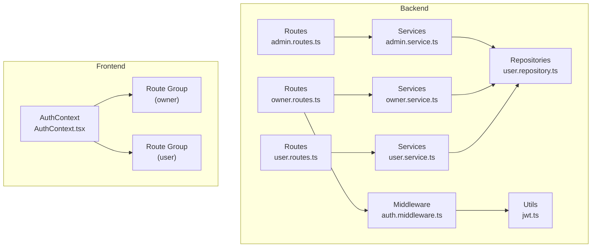
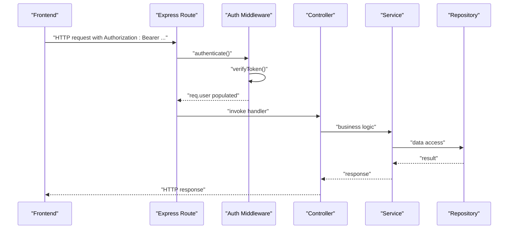
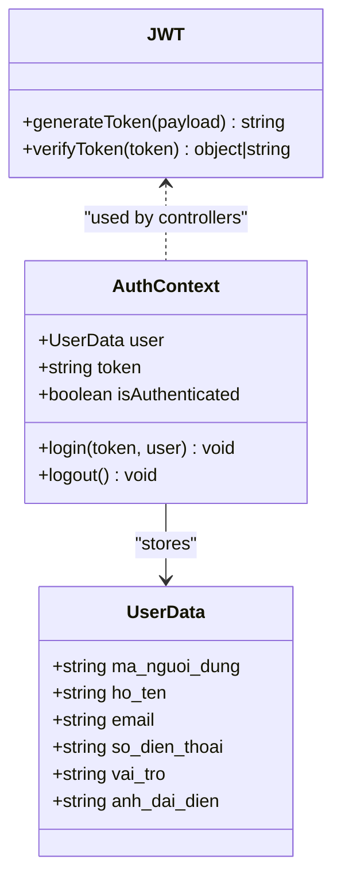
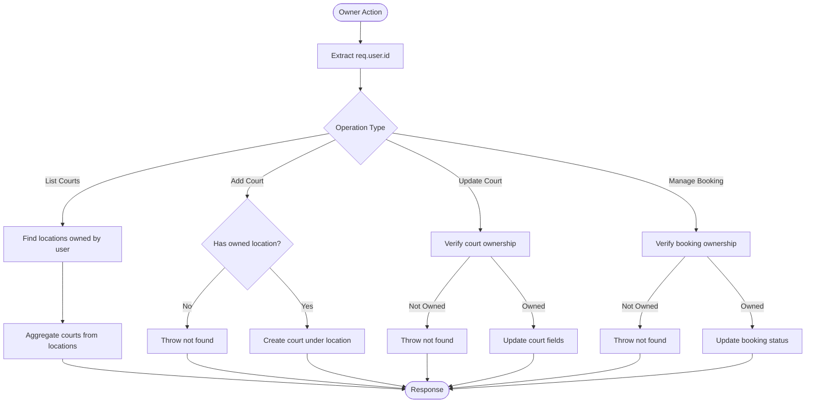
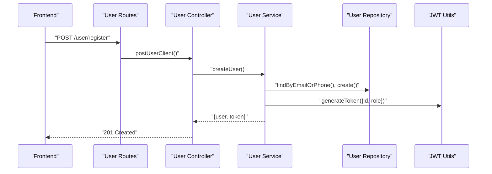
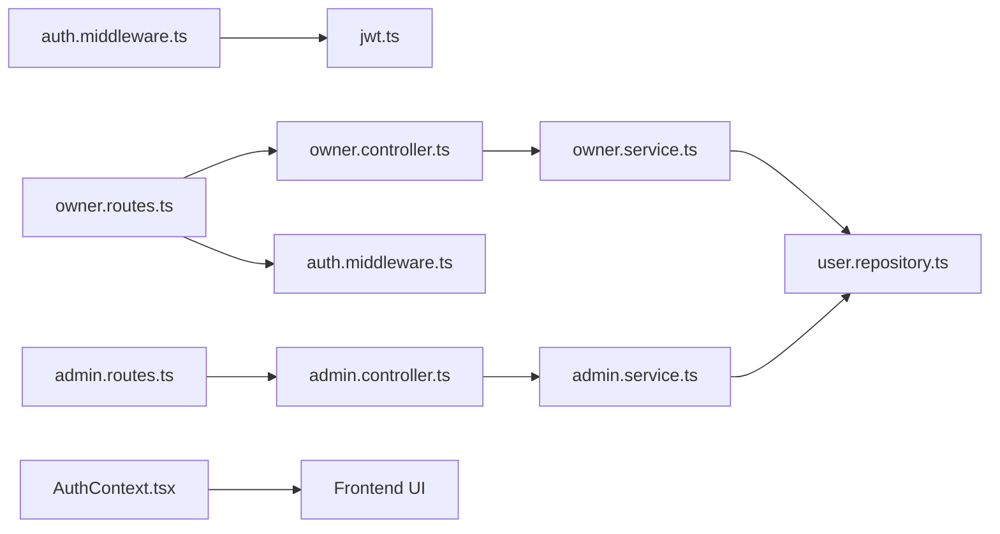

# Role-Based Access Control

<cite>
**Referenced Files in This Document**
- [auth.middleware.ts](file://backend/src/middlewares/auth.middleware.ts)
- [jwt.ts](file://backend/src/utils/jwt.ts)
- [admin.routes.ts](file://backend/src/routers/admin.routes.ts)
- [owner.routes.ts](file://backend/src/routers/owner.routes.ts)
- [user.routes.ts](file://backend/src/routers/user.routes.ts)
- [admin.controller.ts](file://backend/src/controllers/admin.controller.ts)
- [owner.controller.ts](file://backend/src/controllers/owner.controller.ts)
- [user.controller.ts](file://backend/src/controllers/user.controller.ts)
- [admin.service.ts](file://backend/src/services/admin.service.ts)
- [owner.service.ts](file://backend/src/services/owner.service.ts)
- [user.service.ts](file://backend/src/services/user.service.ts)
- [user.repository.ts](file://backend/src/repositories/user.repository.ts)
- [upload.middleware.ts](file://backend/src/middlewares/upload.middleware.ts)
- [AuthContext.tsx](file://frontend/src/contexts/AuthContext.tsx)
- [owner.layout.tsx](file://frontend/src/app/(owner)/layout.tsx)
- [user.layout.tsx](file://frontend/src/app/(user)/layout.tsx)
</cite>

## Table of Contents
1. [Introduction](#introduction)
2. [Project Structure](#project-structure)
3. [Core Components](#core-components)
4. [Architecture Overview](#architecture-overview)
5. [Detailed Component Analysis](#detailed-component-analysis)
6. [Dependency Analysis](#dependency-analysis)
7. [Performance Considerations](#performance-considerations)
8. [Troubleshooting Guide](#troubleshooting-guide)
9. [Conclusion](#conclusion)
10. [Appendices](#appendices)

## Introduction
This document explains the Role-Based Access Control (RBAC) model implemented in the application, focusing on three roles: User, Owner, and Admin. It covers role hierarchies, route protection, permission checks, frontend role validation, role inheritance patterns, permission matrices, and dynamic access control. It also provides examples of role-specific UI rendering, API endpoint protection, administrative privileges, role assignment workflows, and security implications of role escalation.

## Project Structure
The RBAC implementation spans backend routes, controllers, services, repositories, and middleware, plus frontend authentication context and route groups.

**Diagram sources**
- [admin.routes.ts:1-6](file://backend/src/routers/admin.routes.ts#L1-L6)
- [owner.routes.ts:1-23](file://backend/src/routers/owner.routes.ts#L1-L23)
- [user.routes.ts:1-10](file://backend/src/routers/user.routes.ts#L1-L10)
- [auth.middleware.ts:1-28](file://backend/src/middlewares/auth.middleware.ts#L1-L28)
- [admin.service.ts:1-57](file://backend/src/services/admin.service.ts#L1-L57)
- [owner.service.ts:1-148](file://backend/src/services/owner.service.ts#L1-L148)
- [user.service.ts:1-69](file://backend/src/services/user.service.ts#L1-L69)
- [user.repository.ts:1-53](file://backend/src/repositories/user.repository.ts#L1-L53)
- [jwt.ts:1-13](file://backend/src/utils/jwt.ts#L1-L13)
- [AuthContext.tsx:1-83](file://frontend/src/contexts/AuthContext.tsx#L1-L83)
- [owner.layout.tsx](file://frontend/src/app/(owner)/layout.tsx)
- [user.layout.tsx](file://frontend/src/app/(user)/layout.tsx)

**Section sources**
- [admin.routes.ts:1-6](file://backend/src/routers/admin.routes.ts#L1-L6)
- [owner.routes.ts:1-23](file://backend/src/routers/owner.routes.ts#L1-L23)
- [user.routes.ts:1-10](file://backend/src/routers/user.routes.ts#L1-L10)
- [auth.middleware.ts:1-28](file://backend/src/middlewares/auth.middleware.ts#L1-L28)
- [admin.service.ts:1-57](file://backend/src/services/admin.service.ts#L1-L57)
- [owner.service.ts:1-148](file://backend/src/services/owner.service.ts#L1-L148)
- [user.service.ts:1-69](file://backend/src/services/user.service.ts#L1-L69)
- [user.repository.ts:1-53](file://backend/src/repositories/user.repository.ts#L1-L53)
- [jwt.ts:1-13](file://backend/src/utils/jwt.ts#L1-L13)
- [AuthContext.tsx:1-83](file://frontend/src/contexts/AuthContext.tsx#L1-L83)
- [owner.layout.tsx](file://frontend/src/app/(owner)/layout.tsx)
- [user.layout.tsx](file://frontend/src/app/(user)/layout.tsx)

## Core Components
- Authentication middleware validates bearer tokens and attaches user identity to requests.
- Services encapsulate role-aware business logic and enforce ownership checks.
- Controllers orchestrate request handling and delegate to services.
- Repositories abstract persistence and ID generation.
- Frontend AuthContext stores user role and token, enabling role-based UI rendering.

Key RBAC-related observations:
- Roles are represented as strings (e.g., “Chủ sân” for Owner) and included in JWT claims.
- Ownership checks restrict Owner actions to resources owned by the authenticated user.
- Admin routes currently expose endpoints without explicit role guards; see “Security Implications” below.

**Section sources**
- [auth.middleware.ts:9-27](file://backend/src/middlewares/auth.middleware.ts#L9-L27)
- [jwt.ts:6-12](file://backend/src/utils/jwt.ts#L6-L12)
- [owner.service.ts:113-144](file://backend/src/services/owner.service.ts#L113-L144)
- [admin.controller.ts:4-13](file://backend/src/controllers/admin.controller.ts#L4-L13)
- [AuthContext.tsx:7-22](file://frontend/src/contexts/AuthContext.tsx#L7-L22)

## Architecture Overview
The backend enforces RBAC via middleware and service-layer checks. The frontend consumes role information from the AuthContext to conditionally render UI and route to appropriate pages.

**Diagram sources**
- [auth.middleware.ts:9-27](file://backend/src/middlewares/auth.middleware.ts#L9-L27)
- [jwt.ts:10-12](file://backend/src/utils/jwt.ts#L10-L12)
- [owner.controller.ts:42-92](file://backend/src/controllers/owner.controller.ts#L42-L92)
- [owner.service.ts:66-133](file://backend/src/services/owner.service.ts#L66-L133)
- [user.repository.ts:3-34](file://backend/src/repositories/user.repository.ts#L3-L34)

## Detailed Component Analysis

### Role Model and Claims
- JWT payload includes user identifier and role string.
- Controllers generate tokens after successful user creation or login.
- Frontend stores user data (including role) and token in AuthContext.

**Diagram sources**
- [AuthContext.tsx:7-22](file://frontend/src/contexts/AuthContext.tsx#L7-L22)
- [jwt.ts:6-12](file://backend/src/utils/jwt.ts#L6-L12)
- [user.service.ts:40-41](file://backend/src/services/user.service.ts#L40-L41)
- [owner.service.ts:62-63](file://backend/src/services/owner.service.ts#L62-L63)

**Section sources**
- [jwt.ts:3-12](file://backend/src/utils/jwt.ts#L3-L12)
- [user.service.ts:40-41](file://backend/src/services/user.service.ts#L40-L41)
- [owner.service.ts:62-63](file://backend/src/services/owner.service.ts#L62-L63)
- [AuthContext.tsx:46-59](file://frontend/src/contexts/AuthContext.tsx#L46-L59)

### Role Hierarchies and Inheritance
- User: Basic end-user role with read/write permissions scoped to themselves.
- Owner: Provider role with additional capabilities to manage courts and bookings associated with their location.
- Admin: Elevated role with access to administrative endpoints; current implementation lacks explicit role guards.

Inheritance pattern:
- Owner inherits User’s base capabilities and adds provider-specific operations.
- Admin is distinct and currently unguarded in exposed routes.

**Section sources**
- [owner.service.ts:113-144](file://backend/src/services/owner.service.ts#L113-L144)
- [admin.controller.ts:4-13](file://backend/src/controllers/admin.controller.ts#L4-L13)

### Permission Matrix (by Route)
- User registration/login: open to all (no authentication required).
- Owner registration: uploads required documents; role assigned upon creation.
- Owner routes: protected by authentication middleware; ownership checks enforced in service layer.
- Admin routes: currently unprotected; require explicit guards.

Note: The matrix below reflects current protections observed in the codebase.

| Endpoint | Method | Auth Required | Ownership Check | Notes |
|---|---|---|---|---|
| /user/register | POST | No | N/A | Public registration |
| /user/login | POST | No | N/A | Public login |
| /owner/register | POST | No | N/A | Uploads required; role assigned |
| /owner/my-courts | GET | Yes | By user id | Returns courts owned by user |
| /owner/add-court | POST | Yes | By user id | Creates court under user’s location |
| /owner/update-court/:ma_san | PUT | Yes | By user id and court id | Updates only owned courts |
| /owner/my-bookings | GET | Yes | By user id | Lists bookings for owned courts |
| /owner/update-booking-status/:id | PATCH | Yes | By user id and booking id | Updates only owned bookings |
| /admin | GET | No | N/A | Admin list users |
| /admin/:id | GET | No | N/A | Admin get user by id |

**Section sources**
- [user.routes.ts:7-8](file://backend/src/routers/user.routes.ts#L7-L8)
- [owner.routes.ts:15-20](file://backend/src/routers/owner.routes.ts#L15-L20)
- [admin.routes.ts:4-5](file://backend/src/routers/admin.routes.ts#L4-L5)
- [auth.middleware.ts:9-27](file://backend/src/middlewares/auth.middleware.ts#L9-L27)
- [owner.service.ts:113-144](file://backend/src/services/owner.service.ts#L113-L144)

### Dynamic Access Control and Ownership Checks
Ownership checks ensure that Owners can only operate on data they own:
- Listing courts: aggregates courts from locations owned by the user.
- Creating courts: requires an existing location owned by the user.
- Updating courts: verifies court ownership before updating.
- Managing bookings: filters by ownership to prevent unauthorized updates.

**Diagram sources**
- [owner.service.ts:66-144](file://backend/src/services/owner.service.ts#L66-L144)

**Section sources**
- [owner.service.ts:66-144](file://backend/src/services/owner.service.ts#L66-L144)

### Role-Based Route Protection
- Authentication middleware enforces bearer token validation for Owner endpoints.
- Admin endpoints are currently exposed without role guards.

Recommendations:
- Add role guards to Admin routes to ensure only Admin users can access them.
- Consider adding a dedicated Admin middleware similar to the authentication middleware.

**Section sources**
- [auth.middleware.ts:9-27](file://backend/src/middlewares/auth.middleware.ts#L9-L27)
- [admin.routes.ts:4-5](file://backend/src/routers/admin.routes.ts#L4-L5)

### Frontend Role Validation and UI Rendering
- AuthContext stores user role and token, enabling conditional UI rendering.
- Next.js route groups separate Owner and User areas, aligning with role-based navigation.

Examples:
- Role-specific UI rendering: conditionally show Owner-only menus and actions based on role.
- Protected navigation: route group (owner) implies Owner-only access; route group (user) implies User-only access.

**Section sources**
- [AuthContext.tsx:46-69](file://frontend/src/contexts/AuthContext.tsx#L46-L69)
- [owner.layout.tsx](file://frontend/src/app/(owner)/layout.tsx)
- [user.layout.tsx](file://frontend/src/app/(user)/layout.tsx)

### Administrative Privileges
- Admin can list all users and fetch user details by id.
- Current implementation does not enforce Admin role on these endpoints.

Recommendations:
- Add Admin-only guards to admin routes.
- Consider introducing a dedicated Admin middleware and applying it to admin routes.

**Section sources**
- [admin.controller.ts:4-13](file://backend/src/controllers/admin.controller.ts#L4-L13)
- [admin.routes.ts:4-5](file://backend/src/routers/admin.routes.ts#L4-L5)

### Role Assignment Workflows
- User registration: creates a regular active user.
- Owner registration: creates a pending user with role assigned; requires document uploads; admin approval required elsewhere.
- Login: generates JWT with role claim.

**Diagram sources**
- [user.routes.ts:7-8](file://backend/src/routers/user.routes.ts#L7-L8)
- [user.controller.ts:7-10](file://backend/src/controllers/user.controller.ts#L7-L10)
- [user.service.ts:8-42](file://backend/src/services/user.service.ts#L8-L42)
- [user.repository.ts:10-34](file://backend/src/repositories/user.repository.ts#L10-L34)
- [jwt.ts:6-8](file://backend/src/utils/jwt.ts#L6-L8)

**Section sources**
- [user.service.ts:8-42](file://backend/src/services/user.service.ts#L8-L42)
- [user.repository.ts:10-34](file://backend/src/repositories/user.repository.ts#L10-L34)
- [jwt.ts:6-8](file://backend/src/utils/jwt.ts#L6-L8)

### Security Implications of Role Escalation
- Admin endpoints are currently unprotected; any authenticated user could potentially access them if routed accordingly.
- Ownership checks mitigate cross-user data access for Owner actions but do not replace role-based authorization.
- Recommendations:
  - Enforce Admin-only access to admin routes.
  - Introduce centralized role guards and consistent error handling for unauthorized access.
  - Consider audit logs for sensitive admin actions.

**Section sources**
- [admin.routes.ts:4-5](file://backend/src/routers/admin.routes.ts#L4-L5)
- [admin.controller.ts:4-13](file://backend/src/controllers/admin.controller.ts#L4-L13)

## Dependency Analysis
The RBAC implementation depends on:
- Authentication middleware for bearer token verification.
- JWT utilities for token generation and verification.
- Service-layer ownership checks to enforce resource boundaries.
- Frontend AuthContext for role-aware UI decisions.

**Diagram sources**
- [auth.middleware.ts:1-28](file://backend/src/middlewares/auth.middleware.ts#L1-L28)
- [jwt.ts:1-13](file://backend/src/utils/jwt.ts#L1-L13)
- [owner.routes.ts:1-23](file://backend/src/routers/owner.routes.ts#L1-L23)
- [owner.controller.ts:1-110](file://backend/src/controllers/owner.controller.ts#L1-L110)
- [owner.service.ts:1-148](file://backend/src/services/owner.service.ts#L1-L148)
- [user.repository.ts:1-53](file://backend/src/repositories/user.repository.ts#L1-L53)
- [admin.routes.ts:1-6](file://backend/src/routers/admin.routes.ts#L1-L6)
- [admin.controller.ts:1-13](file://backend/src/controllers/admin.controller.ts#L1-L13)
- [admin.service.ts:1-57](file://backend/src/services/admin.service.ts#L1-L57)
- [AuthContext.tsx:1-83](file://frontend/src/contexts/AuthContext.tsx#L1-L83)

**Section sources**
- [auth.middleware.ts:1-28](file://backend/src/middlewares/auth.middleware.ts#L1-L28)
- [jwt.ts:1-13](file://backend/src/utils/jwt.ts#L1-L13)
- [owner.routes.ts:1-23](file://backend/src/routers/owner.routes.ts#L1-L23)
- [owner.controller.ts:1-110](file://backend/src/controllers/owner.controller.ts#L1-L110)
- [owner.service.ts:1-148](file://backend/src/services/owner.service.ts#L1-L148)
- [user.repository.ts:1-53](file://backend/src/repositories/user.repository.ts#L1-L53)
- [admin.routes.ts:1-6](file://backend/src/routers/admin.routes.ts#L1-L6)
- [admin.controller.ts:1-13](file://backend/src/controllers/admin.controller.ts#L1-L13)
- [admin.service.ts:1-57](file://backend/src/services/admin.service.ts#L1-L57)
- [AuthContext.tsx:1-83](file://frontend/src/contexts/AuthContext.tsx#L1-L83)

## Performance Considerations
- Token verification occurs per request; keep JWT secret secure and consider token caching only for short-lived checks.
- Ownership queries are straightforward; ensure database indexes on foreign keys (e.g., user-to-location, booking-to-court) for scalability.
- Batch operations (e.g., image uploads) are handled via middleware; ensure Cloudinary storage limits and timeouts are configured appropriately.

## Troubleshooting Guide
Common issues and resolutions:
- Unauthorized errors on Owner endpoints: verify Authorization header and token validity.
- Ownership violation errors: confirm the authenticated user owns the target resource.
- Admin endpoint access: ensure Admin-only guards are applied to prevent unauthorized access.

**Section sources**
- [auth.middleware.ts:12-25](file://backend/src/middlewares/auth.middleware.ts#L12-L25)
- [owner.service.ts:119-140](file://backend/src/services/owner.service.ts#L119-L140)
- [admin.routes.ts:4-5](file://backend/src/routers/admin.routes.ts#L4-L5)

## Conclusion
The application implements a practical RBAC model with clear role boundaries:
- User: self-managed account with basic permissions.
- Owner: provider role with ownership-scoped operations on courts and bookings.
- Admin: elevated access to administrative endpoints.

Current gaps include missing Admin-only guards on admin routes and lack of centralized role enforcement. Addressing these will strengthen security and enable robust role escalation controls.

## Appendices

### Appendix A: Recommended Admin Guards
- Create an Admin middleware mirroring the authentication middleware.
- Apply it to admin routes to enforce Admin-only access.
- Centralize error handling for unauthorized access attempts.

**Section sources**
- [admin.routes.ts:4-5](file://backend/src/routers/admin.routes.ts#L4-L5)
- [auth.middleware.ts:9-27](file://backend/src/middlewares/auth.middleware.ts#L9-L27)

### Appendix B: Role-Specific UI Examples
- Use AuthContext to conditionally render Owner-only menus and actions.
- Route groups (owner, user) provide natural separation for role-based navigation.

**Section sources**
- [AuthContext.tsx:46-69](file://frontend/src/contexts/AuthContext.tsx#L46-L69)
- [owner.layout.tsx](file://frontend/src/app/(owner)/layout.tsx)
- [user.layout.tsx](file://frontend/src/app/(user)/layout.tsx)