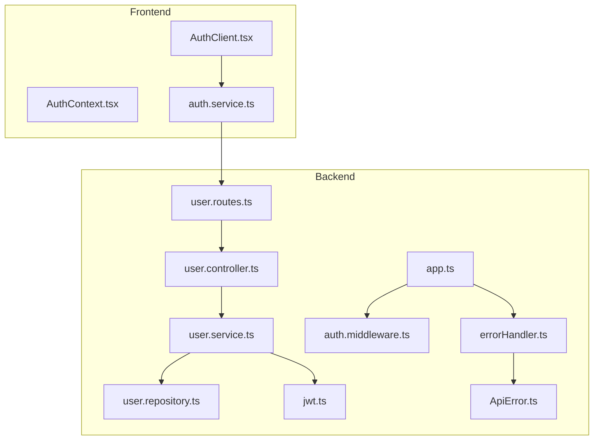
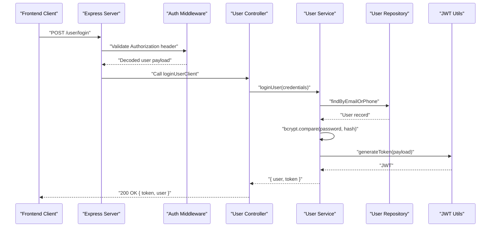
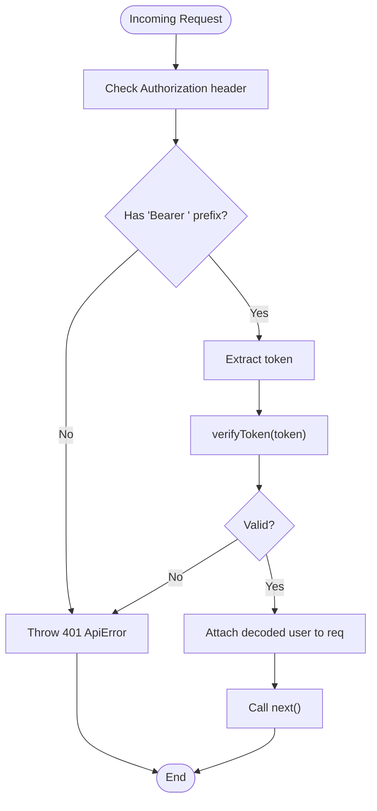
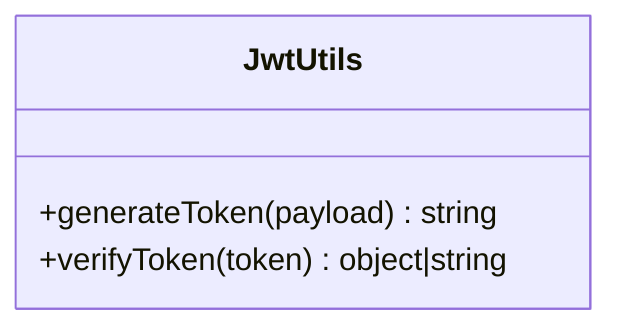
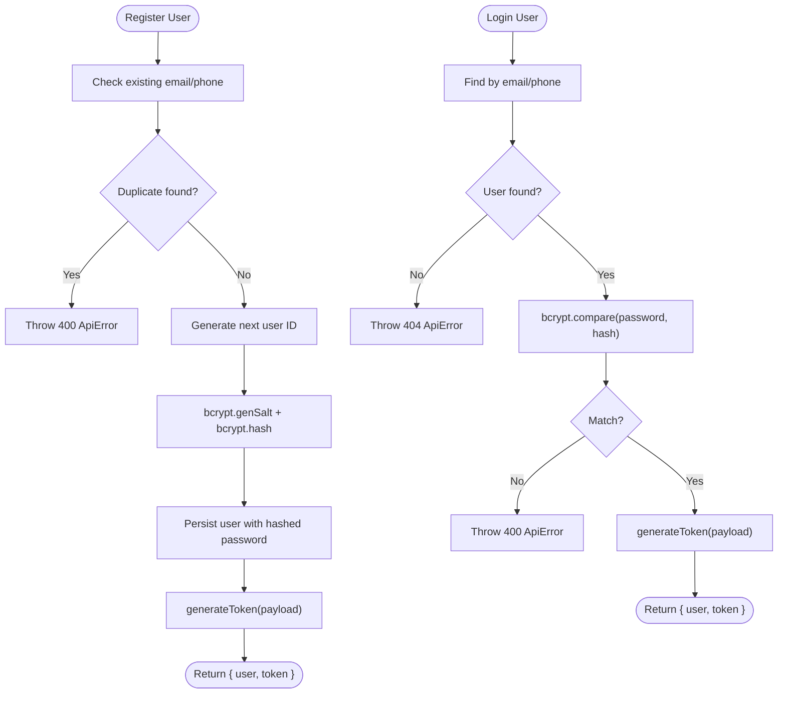
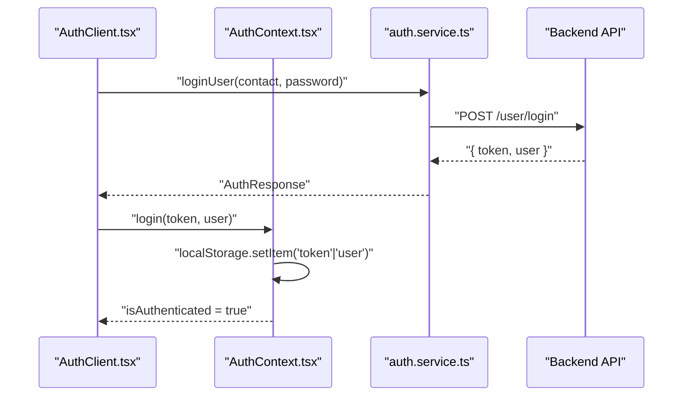
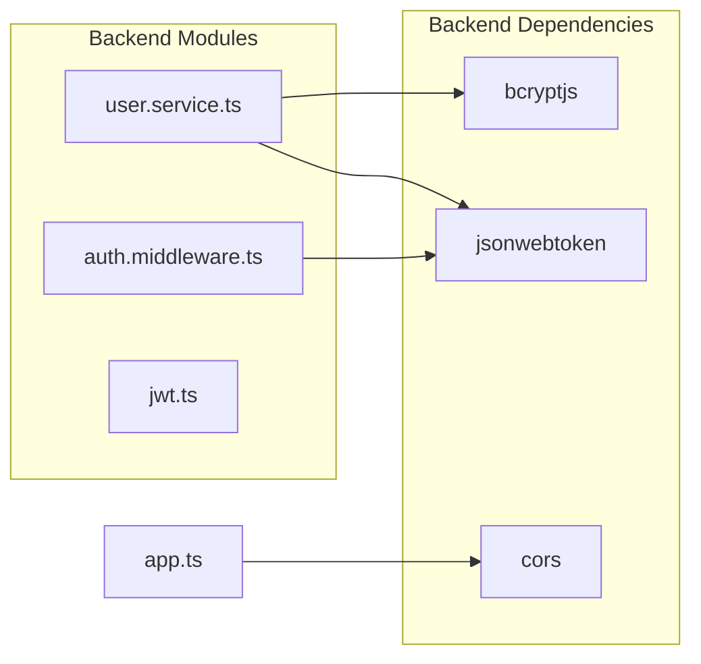

# Security Best Practices & Troubleshooting

<cite>
**Referenced Files in This Document**
- [auth.middleware.ts](file://backend/src/middlewares/auth.middleware.ts)
- [jwt.ts](file://backend/src/utils/jwt.ts)
- [errorHandler.ts](file://backend/src/middlewares/errorHandler.ts)
- [ApiError.ts](file://backend/src/utils/ApiError.ts)
- [user.service.ts](file://backend/src/services/user.service.ts)
- [user.repository.ts](file://backend/src/repositories/user.repository.ts)
- [user.controller.ts](file://backend/src/controllers/user.controller.ts)
- [user.routes.ts](file://backend/src/routers/user.routes.ts)
- [app.ts](file://backend/src/app.ts)
- [auth.service.ts](file://frontend/src/services/auth.service.ts)
- [AuthContext.tsx](file://frontend/src/contexts/AuthContext.tsx)
- [AuthClient.tsx](file://frontend/src/components/auth/AuthClient.tsx)
- [package.json](file://backend/package.json)
- [robots.ts](file://frontend/src/app/robots.ts)
</cite>

## Table of Contents
1. [Introduction](#introduction)
2. [Project Structure](#project-structure)
3. [Core Components](#core-components)
4. [Architecture Overview](#architecture-overview)
5. [Detailed Component Analysis](#detailed-component-analysis)
6. [Dependency Analysis](#dependency-analysis)
7. [Performance Considerations](#performance-considerations)
8. [Troubleshooting Guide](#troubleshooting-guide)
9. [Conclusion](#conclusion)
10. [Appendices](#appendices)

## Introduction
This document provides comprehensive security documentation for the authentication subsystem, focusing on password hashing with bcrypt, token security configurations, and common attack prevention strategies. It also covers error handling patterns, security headers implementation, rate limiting considerations, and practical troubleshooting guides for authentication failures, token expiration issues, and session management problems. Finally, it outlines security audit recommendations and compliance considerations aligned with the current codebase.

## Project Structure
The authentication flow spans the backend API and the frontend client:
- Backend: Express server with JWT-based authentication middleware, bcrypt password hashing, and centralized error handling.
- Frontend: Client-side authentication service, context provider for managing tokens and user state, and UI components for login/signup.

**Diagram sources**
- [app.ts:1-21](file://backend/src/app.ts#L1-L21)
- [user.routes.ts:1-10](file://backend/src/routers/user.routes.ts#L1-L10)
- [user.controller.ts:1-14](file://backend/src/controllers/user.controller.ts#L1-L14)
- [user.service.ts:1-69](file://backend/src/services/user.service.ts#L1-L69)
- [user.repository.ts:1-53](file://backend/src/repositories/user.repository.ts#L1-L53)
- [auth.middleware.ts:1-28](file://backend/src/middlewares/auth.middleware.ts#L1-L28)
- [jwt.ts:1-13](file://backend/src/utils/jwt.ts#L1-L13)
- [errorHandler.ts:1-38](file://backend/src/middlewares/errorHandler.ts#L1-L38)
- [ApiError.ts:1-13](file://backend/src/utils/ApiError.ts#L1-L13)
- [AuthClient.tsx:1-566](file://frontend/src/components/auth/AuthClient.tsx#L1-L566)
- [AuthContext.tsx:1-83](file://frontend/src/contexts/AuthContext.tsx#L1-L83)
- [auth.service.ts:1-36](file://frontend/src/services/auth.service.ts#L1-L36)

**Section sources**
- [app.ts:1-21](file://backend/src/app.ts#L1-L21)
- [user.routes.ts:1-10](file://backend/src/routers/user.routes.ts#L1-L10)
- [AuthClient.tsx:1-566](file://frontend/src/components/auth/AuthClient.tsx#L1-L566)
- [AuthContext.tsx:1-83](file://frontend/src/contexts/AuthContext.tsx#L1-L83)

## Core Components
- Authentication Middleware: Extracts and validates bearer tokens from incoming requests.
- JWT Utilities: Generates and verifies JSON Web Tokens with a configurable secret and expiry.
- Password Hashing: Uses bcrypt to hash passwords during registration and verification during login.
- Error Handling: Centralized error handler with structured responses and logging.
- Frontend Authentication Service: Encodes credentials and manages token persistence in localStorage.

Key security-relevant responsibilities:
- Token lifecycle and validation
- Password storage hygiene
- Error response normalization
- Client-side token persistence

**Section sources**
- [auth.middleware.ts:1-28](file://backend/src/middlewares/auth.middleware.ts#L1-L28)
- [jwt.ts:1-13](file://backend/src/utils/jwt.ts#L1-L13)
- [user.service.ts:1-69](file://backend/src/services/user.service.ts#L1-L69)
- [errorHandler.ts:1-38](file://backend/src/middlewares/errorHandler.ts#L1-L38)
- [auth.service.ts:1-36](file://frontend/src/services/auth.service.ts#L1-L36)
- [AuthContext.tsx:1-83](file://frontend/src/contexts/AuthContext.tsx#L1-L83)

## Architecture Overview
The authentication architecture follows a layered pattern:
- Presentation Layer (Frontend): Handles user input, calls authentication APIs, and persists tokens.
- Application Layer (Backend): Routes incoming requests, applies authentication middleware, and delegates to services.
- Domain Services: Encapsulate business logic for user creation and login, including password hashing and token generation.
- Persistence: Repository layer interacts with the database via Prisma.

**Diagram sources**
- [user.routes.ts:1-10](file://backend/src/routers/user.routes.ts#L1-L10)
- [user.controller.ts:1-14](file://backend/src/controllers/user.controller.ts#L1-L14)
- [user.service.ts:1-69](file://backend/src/services/user.service.ts#L1-L69)
- [user.repository.ts:1-53](file://backend/src/repositories/user.repository.ts#L1-L53)
- [auth.middleware.ts:1-28](file://backend/src/middlewares/auth.middleware.ts#L1-L28)
- [jwt.ts:1-13](file://backend/src/utils/jwt.ts#L1-L13)

## Detailed Component Analysis

### Authentication Middleware
Responsibilities:
- Enforces bearer token presence and format.
- Verifies token signature and decodes payload.
- Propagates errors via the global error handler.

Security considerations:
- Rejects missing or malformed Authorization headers.
- Returns standardized unauthorized responses on failure.

**Diagram sources**
- [auth.middleware.ts:1-28](file://backend/src/middlewares/auth.middleware.ts#L1-L28)
- [jwt.ts:1-13](file://backend/src/utils/jwt.ts#L1-L13)
- [ApiError.ts:1-13](file://backend/src/utils/ApiError.ts#L1-L13)

**Section sources**
- [auth.middleware.ts:1-28](file://backend/src/middlewares/auth.middleware.ts#L1-L28)
- [jwt.ts:1-13](file://backend/src/utils/jwt.ts#L1-L13)
- [ApiError.ts:1-13](file://backend/src/utils/ApiError.ts#L1-L13)

### JWT Utilities
Responsibilities:
- Signs tokens with a secret and sets an expiry.
- Verifies tokens using the same secret.

Security considerations:
- Secret rotation and environment configuration are critical.
- Expiry window should align with application risk tolerance.

**Diagram sources**
- [jwt.ts:1-13](file://backend/src/utils/jwt.ts#L1-L13)

**Section sources**
- [jwt.ts:1-13](file://backend/src/utils/jwt.ts#L1-L13)

### User Service: Registration and Login
Responsibilities:
- Registration: Validates uniqueness, generates next user ID, hashes password, persists user, and issues a token.
- Login: Finds user by email or phone, compares password using bcrypt, and issues a token.

Security considerations:
- Password hashing with bcrypt prevents rainbow table attacks.
- Early exits on duplicate identifiers reduce information leakage.
- Token issuance occurs after successful authentication.

**Diagram sources**
- [user.service.ts:1-69](file://backend/src/services/user.service.ts#L1-L69)
- [user.repository.ts:1-53](file://backend/src/repositories/user.repository.ts#L1-L53)
- [jwt.ts:1-13](file://backend/src/utils/jwt.ts#L1-L13)
- [ApiError.ts:1-13](file://backend/src/utils/ApiError.ts#L1-L13)

**Section sources**
- [user.service.ts:1-69](file://backend/src/services/user.service.ts#L1-L69)
- [user.repository.ts:1-53](file://backend/src/repositories/user.repository.ts#L1-L53)
- [jwt.ts:1-13](file://backend/src/utils/jwt.ts#L1-L13)
- [ApiError.ts:1-13](file://backend/src/utils/ApiError.ts#L1-L13)

### Frontend Authentication Flow
Responsibilities:
- Encodes credentials and sends them to backend endpoints.
- Persists token and user data in localStorage upon successful authentication.
- Provides login/logout actions and checks authentication state.

Security considerations:
- Token stored in localStorage increases XSS risk; consider HttpOnly cookies or secure storage alternatives.
- Avoid logging sensitive data.

**Diagram sources**
- [AuthClient.tsx:1-566](file://frontend/src/components/auth/AuthClient.tsx#L1-L566)
- [AuthContext.tsx:1-83](file://frontend/src/contexts/AuthContext.tsx#L1-L83)
- [auth.service.ts:1-36](file://frontend/src/services/auth.service.ts#L1-L36)
- [user.routes.ts:1-10](file://backend/src/routers/user.routes.ts#L1-L10)

**Section sources**
- [AuthClient.tsx:1-566](file://frontend/src/components/auth/AuthClient.tsx#L1-L566)
- [AuthContext.tsx:1-83](file://frontend/src/contexts/AuthContext.tsx#L1-L83)
- [auth.service.ts:1-36](file://frontend/src/services/auth.service.ts#L1-L36)

## Dependency Analysis
- Backend dependencies include bcryptjs for password hashing, jsonwebtoken for JWT operations, and cors for cross-origin support.
- Frontend does not include explicit rate limiting or CSRF protection libraries; these are recommended additions.

**Diagram sources**
- [package.json:14-27](file://backend/package.json#L14-L27)
- [user.service.ts:1-69](file://backend/src/services/user.service.ts#L1-L69)
- [auth.middleware.ts:1-28](file://backend/src/middlewares/auth.middleware.ts#L1-L28)
- [jwt.ts:1-13](file://backend/src/utils/jwt.ts#L1-L13)
- [app.ts:1-21](file://backend/src/app.ts#L1-L21)

**Section sources**
- [package.json:14-27](file://backend/package.json#L14-L27)
- [app.ts:1-21](file://backend/src/app.ts#L1-L21)

## Performance Considerations
- bcrypt cost factor: The current implementation uses a fixed salt generation. Consider tuning the cost factor for production workloads to balance security and latency.
- Token expiry: Shorter expirations reduce risk but increase refresh frequency; evaluate trade-offs based on user experience and threat model.
- Error handling overhead: Centralized error handling reduces duplication but ensure logs are not excessively verbose to avoid I/O bottlenecks.

[No sources needed since this section provides general guidance]

## Troubleshooting Guide

### Authentication Failures
Symptoms:
- 401 Unauthorized on protected routes.
- Errors indicating missing or invalid token.

Common causes and resolutions:
- Missing Authorization header: Ensure requests include a Bearer token.
- Malformed token: Verify token format and signing secret alignment.
- Expired token: Implement token refresh logic on the client.

Resolution steps:
- Confirm middleware is applied to protected routes.
- Validate JWT secret and expiry settings.
- Check client-side token persistence and transmission.

**Section sources**
- [auth.middleware.ts:1-28](file://backend/src/middlewares/auth.middleware.ts#L1-L28)
- [jwt.ts:1-13](file://backend/src/utils/jwt.ts#L1-L13)
- [AuthContext.tsx:1-83](file://frontend/src/contexts/AuthContext.tsx#L1-L83)

### Token Expiration Issues
Symptoms:
- 401 Unauthorized shortly after login.
- Frequent re-authentication prompts.

Common causes and resolutions:
- Short token expiry: Increase token validity period cautiously.
- Client-side token not refreshed: Implement refresh flow or adjust expiry.
- Clock skew: Ensure server and client clocks are synchronized.

Resolution steps:
- Adjust token expiry configuration.
- Add refresh token mechanism if feasible.
- Monitor server time synchronization.

**Section sources**
- [jwt.ts:1-13](file://backend/src/utils/jwt.ts#L1-L13)
- [AuthClient.tsx:1-566](file://frontend/src/components/auth/AuthClient.tsx#L1-L566)

### Session Management Problems
Symptoms:
- Inconsistent authentication state across browser tabs.
- Logout not clearing credentials.

Common causes and resolutions:
- localStorage isolation: Different tabs share the same storage; ensure atomic updates.
- Missing cleanup: Verify logout removes token and user data.

Resolution steps:
- Use a single source of truth for authentication state.
- Clear localStorage entries on logout and reload or redirect appropriately.

**Section sources**
- [AuthContext.tsx:1-83](file://frontend/src/contexts/AuthContext.tsx#L1-L83)
- [AuthClient.tsx:1-566](file://frontend/src/components/auth/AuthClient.tsx#L1-L566)

### Error Handling Patterns
Symptoms:
- Non-standard error responses.
- Unexpected internal server errors.

Common causes and resolutions:
- Throwing generic errors: Use ApiError for consistent status codes and messages.
- Prisma-specific errors: Normalize database constraint violations.

Resolution steps:
- Centralize error handling with errorHandler.
- Ensure ApiError is used for business logic errors.
- Log structured errors for diagnostics.

**Section sources**
- [errorHandler.ts:1-38](file://backend/src/middlewares/errorHandler.ts#L1-L38)
- [ApiError.ts:1-13](file://backend/src/utils/ApiError.ts#L1-L13)

### Rate Limiting Considerations
Current state:
- No explicit rate limiting is implemented in the backend.

Recommendations:
- Apply rate limits on authentication endpoints to mitigate brute force and credential stuffing attacks.
- Use IP-based or account-based limits with sliding windows.
- Integrate with a rate limiting library and configure per-endpoint quotas.

[No sources needed since this section provides general guidance]

### Security Headers Implementation
Current state:
- No explicit security headers are configured in the backend.

Recommendations:
- Add security headers such as Content-Security-Policy, X-Frame-Options, X-Content-Type-Options, and Strict-Transport-Security.
- Configure CORS policies to restrict origins and methods.
- Enforce HTTPS and secure cookie attributes in production.

[No sources needed since this section provides general guidance]

### Common Attack Prevention Strategies
- Brute Force and Credential Stuffing:
  - Implement rate limiting and account lockout mechanisms.
  - Enforce strong password policies and monitor suspicious activity.
- Cross-Site Scripting (XSS):
  - Sanitize inputs and outputs; avoid storing secrets in localStorage.
  - Consider HttpOnly cookies for tokens.
- Cross-Site Request Forgery (CSRF):
  - Use anti-CSRF tokens for state-changing operations.
- Information Disclosure:
  - Avoid leaking internal error details; use generic messages for clients.
- Secret Management:
  - Store JWT_SECRET securely and rotate periodically.

[No sources needed since this section provides general guidance]

## Conclusion
The current authentication implementation provides a solid foundation with bcrypt-based password hashing and JWT-based session tokens. To strengthen security posture, integrate rate limiting, implement robust security headers, adopt secure token storage practices, and enhance error handling and monitoring. Regular security audits and compliance reviews will help maintain resilience against evolving threats.

[No sources needed since this section summarizes without analyzing specific files]

## Appendices

### Security Audit Recommendations
- Conduct a penetration test focusing on authentication endpoints.
- Review token lifecycle and refresh mechanisms.
- Validate CORS and CSP policies.
- Assess secret management and rotation procedures.
- Evaluate compliance with applicable regulations (e.g., data protection standards).

[No sources needed since this section provides general guidance]

### Compliance Considerations
- Data Protection: Ensure user data is processed lawfully and securely; minimize data retention.
- Access Control: Enforce least privilege and principle of separation of duties.
- Logging and Monitoring: Maintain audit trails for authentication events.
- Incident Response: Establish procedures for breach detection and remediation.

[No sources needed since this section provides general guidance]