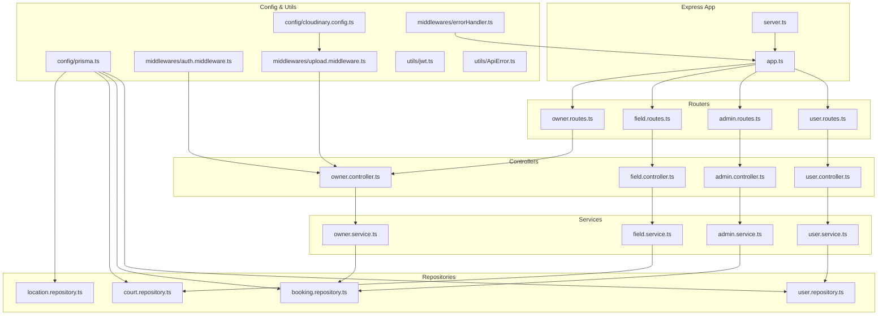
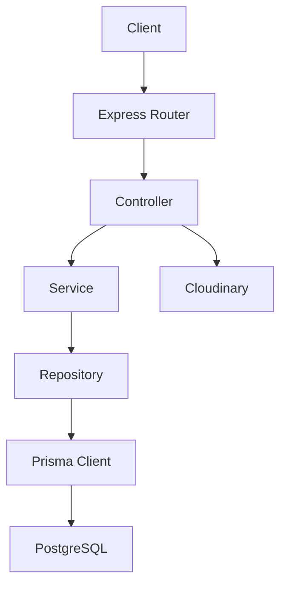
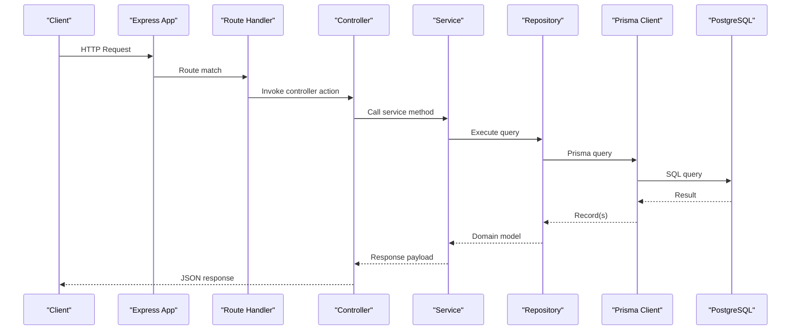
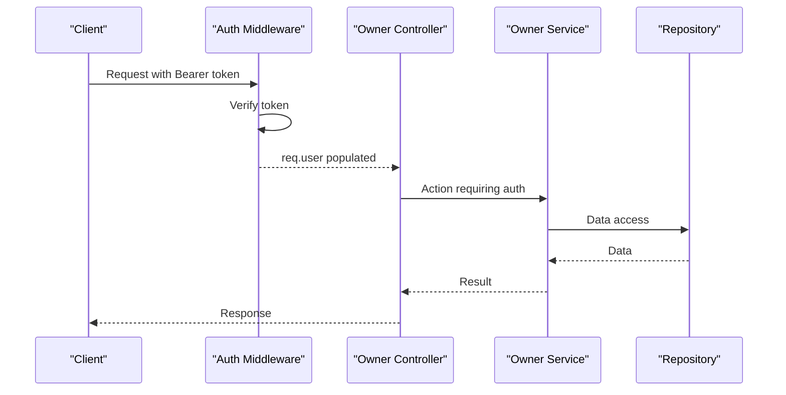
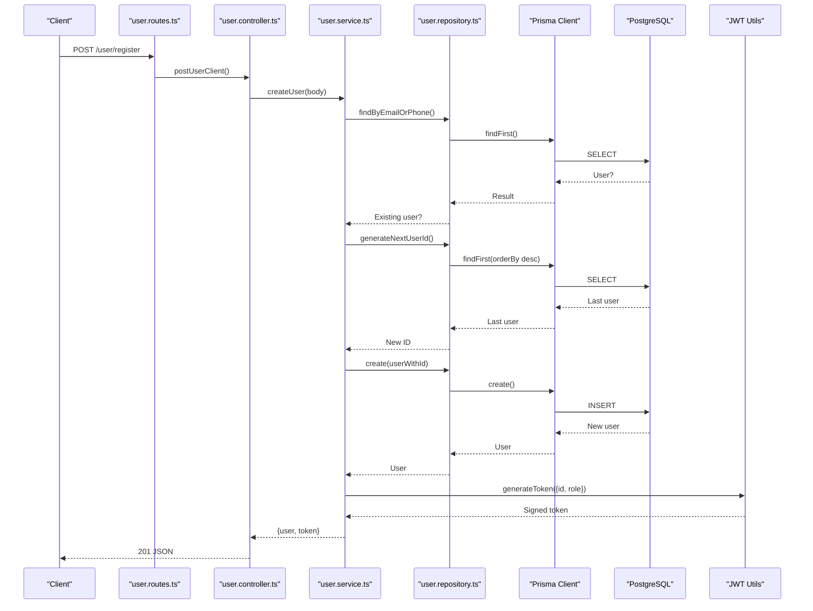
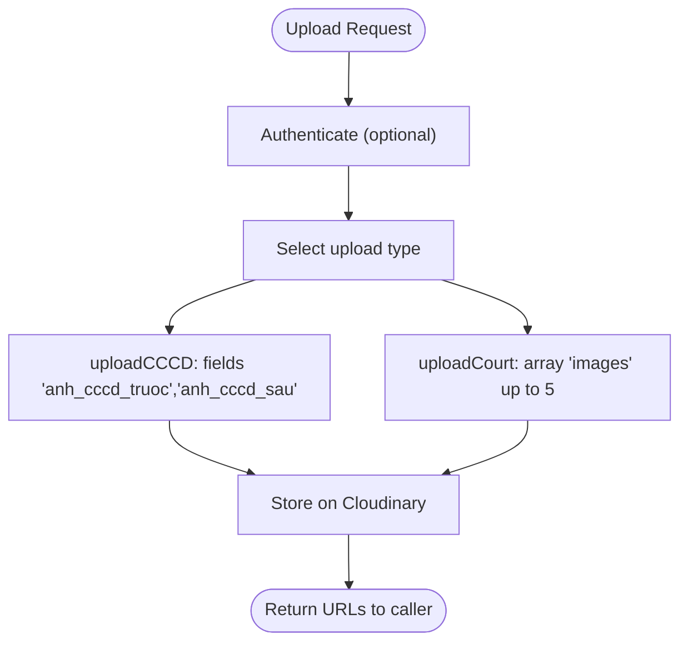
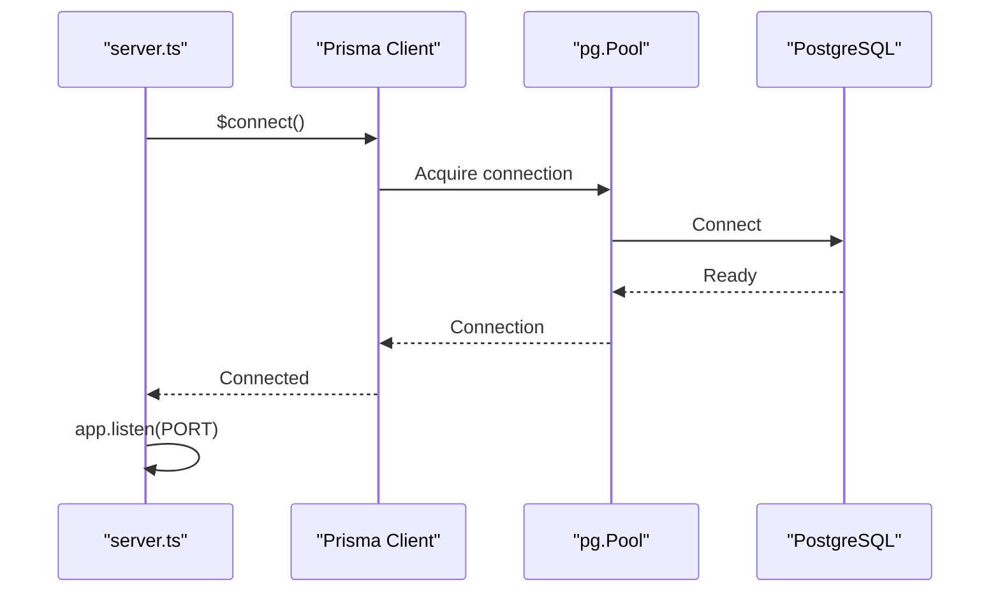
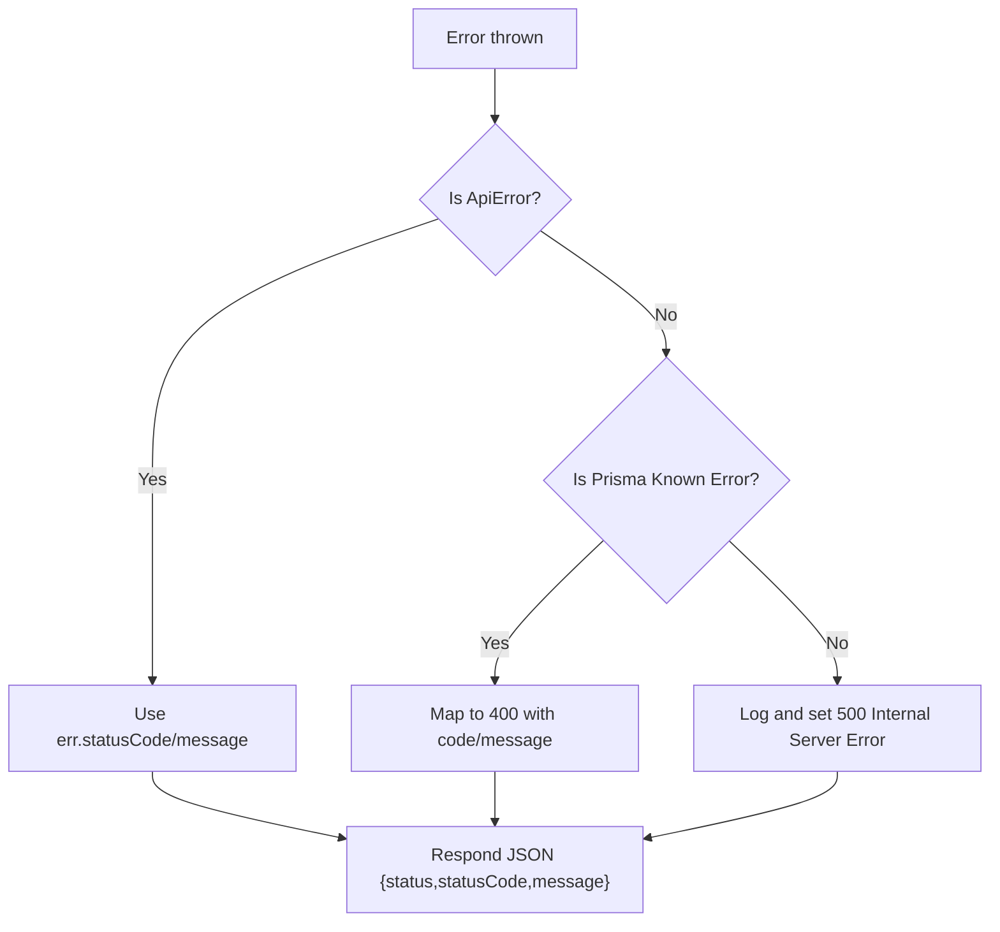
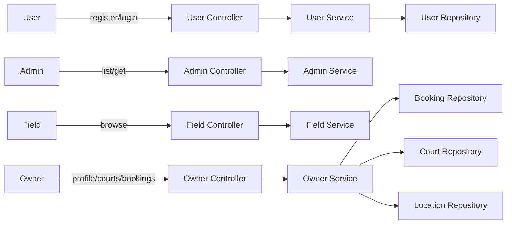
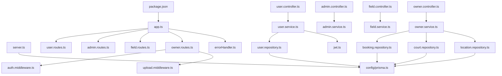

# Backend Architecture

<cite>
**Referenced Files in This Document**
- [app.ts](file://backend/src/app.ts)
- [server.ts](file://backend/src/server.ts)
- [prisma.ts](file://backend/src/config/prisma.ts)
- [errorHandler.ts](file://backend/src/middlewares/errorHandler.ts)
- [auth.middleware.ts](file://backend/src/middlewares/auth.middleware.ts)
- [upload.middleware.ts](file://backend/src/middlewares/upload.middleware.ts)
- [jwt.ts](file://backend/src/utils/jwt.ts)
- [user.routes.ts](file://backend/src/routers/user.routes.ts)
- [admin.routes.ts](file://backend/src/routers/admin.routes.ts)
- [field.routes.ts](file://backend/src/routers/field.routes.ts)
- [owner.routes.ts](file://backend/src/routers/owner.routes.ts)
- [user.controller.ts](file://backend/src/controllers/user.controller.ts)
- [admin.controller.ts](file://backend/src/controllers/admin.controller.ts)
- [field.controller.ts](file://backend/src/controllers/field.controller.ts)
- [owner.controller.ts](file://backend/src/controllers/owner.controller.ts)
- [user.service.ts](file://backend/src/services/user.service.ts)
- [admin.service.ts](file://backend/src/services/admin.service.ts)
- [field.service.ts](file://backend/src/services/field.service.ts)
- [owner.service.ts](file://backend/src/services/owner.service.ts)
- [user.repository.ts](file://backend/src/repositories/user.repository.ts)
- [booking.repository.ts](file://backend/src/repositories/booking.repository.ts)
- [court.repository.ts](file://backend/src/repositories/court.repository.ts)
- [location.repository.ts](file://backend/src/repositories/location.repository.ts)
- [booksport.type.ts](file://backend/src/types/booksport.type.ts)
- [owner.type.ts](file://backend/src/types/owner.type.ts)
- [user.type.ts](file://backend/src/types/user.type.ts)
- [ApiError.ts](file://backend/src/utils/ApiError.ts)
- [cloudinary.config.ts](file://backend/src/config/cloudinary.config.ts)
- [package.json](file://backend/package.json)
</cite>

## Table of Contents
1. [Introduction](#introduction)
2. [Project Structure](#project-structure)
3. [Core Components](#core-components)
4. [Architecture Overview](#architecture-overview)
5. [Detailed Component Analysis](#detailed-component-analysis)
6. [Dependency Analysis](#dependency-analysis)
7. [Performance Considerations](#performance-considerations)
8. [Security Considerations](#security-considerations)
9. [Troubleshooting Guide](#troubleshooting-guide)
10. [Conclusion](#conclusion)

## Introduction
This document describes the backend architecture of a sports facility booking platform built with Express.js. It explains the application’s layered architecture, the MVC pattern implementation, middleware pipeline, error handling, authentication and authorization, database connectivity via Prisma ORM, and operational considerations such as CORS, security, and performance.

## Project Structure
The backend follows a modular, feature-based structure with clear separation of concerns:
- Application bootstrap and middleware registration in the Express app
- Routing per feature domain (user, admin, field, owner)
- Controllers handling HTTP requests and delegating to services
- Services encapsulating business logic
- Repositories abstracting data access via Prisma
- Utilities for JWT token generation/verification and error modeling
- Configuration for database (Prisma with PostgreSQL adapter) and cloud storage (Cloudinary)

**Diagram sources**
- [app.ts:1-21](file://backend/src/app.ts#L1-L21)
- [server.ts:1-20](file://backend/src/server.ts#L1-L20)
- [user.routes.ts:1-10](file://backend/src/routers/user.routes.ts#L1-L10)
- [admin.routes.ts:1-6](file://backend/src/routers/admin.routes.ts#L1-L6)
- [field.routes.ts:1-5](file://backend/src/routers/field.routes.ts#L1-L5)
- [owner.routes.ts:1-23](file://backend/src/routers/owner.routes.ts#L1-L23)
- [user.controller.ts:1-14](file://backend/src/controllers/user.controller.ts#L1-L14)
- [admin.controller.ts](file://backend/src/controllers/admin.controller.ts)
- [field.controller.ts](file://backend/src/controllers/field.controller.ts)
- [owner.controller.ts](file://backend/src/controllers/owner.controller.ts)
- [user.service.ts:1-69](file://backend/src/services/user.service.ts#L1-L69)
- [admin.service.ts](file://backend/src/services/admin.service.ts)
- [field.service.ts](file://backend/src/services/field.service.ts)
- [owner.service.ts](file://backend/src/services/owner.service.ts)
- [user.repository.ts:1-53](file://backend/src/repositories/user.repository.ts#L1-L53)
- [booking.repository.ts](file://backend/src/repositories/booking.repository.ts)
- [court.repository.ts](file://backend/src/repositories/court.repository.ts)
- [location.repository.ts](file://backend/src/repositories/location.repository.ts)
- [prisma.ts:1-10](file://backend/src/config/prisma.ts#L1-L10)
- [cloudinary.config.ts](file://backend/src/config/cloudinary.config.ts)
- [auth.middleware.ts:1-28](file://backend/src/middlewares/auth.middleware.ts#L1-L28)
- [upload.middleware.ts:1-19](file://backend/src/middlewares/upload.middleware.ts#L1-L19)
- [errorHandler.ts:1-38](file://backend/src/middlewares/errorHandler.ts#L1-L38)
- [jwt.ts:1-13](file://backend/src/utils/jwt.ts#L1-L13)
- [ApiError.ts](file://backend/src/utils/ApiError.ts)

**Section sources**
- [app.ts:1-21](file://backend/src/app.ts#L1-L21)
- [server.ts:1-20](file://backend/src/server.ts#L1-L20)
- [package.json:1-41](file://backend/package.json#L1-L41)

## Core Components
- Express application initialization and middleware pipeline
- Global error handling middleware
- Authentication middleware validating JWT tokens
- File upload middleware integrating Cloudinary
- Prisma client configured with PostgreSQL adapter
- JWT utilities for token signing and verification
- Feature-specific routers delegating to controllers
- Service classes implementing business logic
- Repository classes encapsulating Prisma queries
- Type definitions for request/response shapes

**Section sources**
- [app.ts:1-21](file://backend/src/app.ts#L1-L21)
- [errorHandler.ts:1-38](file://backend/src/middlewares/errorHandler.ts#L1-L38)
- [auth.middleware.ts:1-28](file://backend/src/middlewares/auth.middleware.ts#L1-L28)
- [upload.middleware.ts:1-19](file://backend/src/middlewares/upload.middleware.ts#L1-L19)
- [prisma.ts:1-10](file://backend/src/config/prisma.ts#L1-L10)
- [jwt.ts:1-13](file://backend/src/utils/jwt.ts#L1-L13)
- [user.routes.ts:1-10](file://backend/src/routers/user.routes.ts#L1-L10)
- [admin.routes.ts:1-6](file://backend/src/routers/admin.routes.ts#L1-L6)
- [field.routes.ts:1-5](file://backend/src/routers/field.routes.ts#L1-L5)
- [owner.routes.ts:1-23](file://backend/src/routers/owner.routes.ts#L1-L23)
- [user.controller.ts:1-14](file://backend/src/controllers/user.controller.ts#L1-L14)
- [user.service.ts:1-69](file://backend/src/services/user.service.ts#L1-L69)
- [user.repository.ts:1-53](file://backend/src/repositories/user.repository.ts#L1-L53)
- [user.type.ts](file://backend/src/types/user.type.ts)
- [owner.type.ts](file://backend/src/types/owner.type.ts)
- [booksport.type.ts](file://backend/src/types/booksport.type.ts)

## Architecture Overview
The system implements a layered architecture:
- Presentation Layer: Express routes and controllers
- Business Logic Layer: Services
- Data Access Layer: Repositories using Prisma ORM
- Infrastructure: Database connection via Prisma adapter and PostgreSQL, external file storage via Cloudinary

**Diagram sources**
- [app.ts:1-21](file://backend/src/app.ts#L1-L21)
- [user.controller.ts:1-14](file://backend/src/controllers/user.controller.ts#L1-L14)
- [user.service.ts:1-69](file://backend/src/services/user.service.ts#L1-L69)
- [user.repository.ts:1-53](file://backend/src/repositories/user.repository.ts#L1-L53)
- [prisma.ts:1-10](file://backend/src/config/prisma.ts#L1-L10)
- [cloudinary.config.ts](file://backend/src/config/cloudinary.config.ts)

## Detailed Component Analysis

### Express Application and Middleware Pipeline
- Bootstrap initializes environment variables, enables CORS, and parses JSON
- Routes are mounted under logical prefixes (/user, /admin, /field, /owner)
- Global error handler is registered after routes

**Diagram sources**
- [app.ts:1-21](file://backend/src/app.ts#L1-L21)
- [user.controller.ts:1-14](file://backend/src/controllers/user.controller.ts#L1-L14)
- [user.service.ts:1-69](file://backend/src/services/user.service.ts#L1-L69)
- [user.repository.ts:1-53](file://backend/src/repositories/user.repository.ts#L1-L53)
- [prisma.ts:1-10](file://backend/src/config/prisma.ts#L1-L10)

**Section sources**
- [app.ts:1-21](file://backend/src/app.ts#L1-L21)
- [server.ts:1-20](file://backend/src/server.ts#L1-L20)

### Role-Based Authentication and Authorization
- Authentication middleware validates Authorization header and verifies JWT
- On success, decoded payload is attached to the request object for downstream use
- Owner routes demonstrate protected endpoints using the authentication middleware

**Diagram sources**
- [auth.middleware.ts:1-28](file://backend/src/middlewares/auth.middleware.ts#L1-L28)
- [jwt.ts:1-13](file://backend/src/utils/jwt.ts#L1-L13)
- [owner.routes.ts:1-23](file://backend/src/routers/owner.routes.ts#L1-L23)
- [owner.controller.ts](file://backend/src/controllers/owner.controller.ts)
- [owner.service.ts](file://backend/src/services/owner.service.ts)

**Section sources**
- [auth.middleware.ts:1-28](file://backend/src/middlewares/auth.middleware.ts#L1-L28)
- [jwt.ts:1-13](file://backend/src/utils/jwt.ts#L1-L13)
- [owner.routes.ts:1-23](file://backend/src/routers/owner.routes.ts#L1-L23)

### Request/Response Processing Flow (User Registration/Login)
- Router maps POST /user/register and /user/login to controller actions
- Controller delegates to service for business logic
- Service handles validation, hashing, persistence, and token generation
- Repository persists via Prisma

**Diagram sources**
- [user.routes.ts:1-10](file://backend/src/routers/user.routes.ts#L1-L10)
- [user.controller.ts:1-14](file://backend/src/controllers/user.controller.ts#L1-L14)
- [user.service.ts:1-69](file://backend/src/services/user.service.ts#L1-L69)
- [user.repository.ts:1-53](file://backend/src/repositories/user.repository.ts#L1-L53)
- [jwt.ts:1-13](file://backend/src/utils/jwt.ts#L1-L13)
- [prisma.ts:1-10](file://backend/src/config/prisma.ts#L1-L10)

**Section sources**
- [user.routes.ts:1-10](file://backend/src/routers/user.routes.ts#L1-L10)
- [user.controller.ts:1-14](file://backend/src/controllers/user.controller.ts#L1-L14)
- [user.service.ts:1-69](file://backend/src/services/user.service.ts#L1-L69)
- [user.repository.ts:1-53](file://backend/src/repositories/user.repository.ts#L1-L53)
- [jwt.ts:1-13](file://backend/src/utils/jwt.ts#L1-L13)

### File Uploads with Cloudinary
- Multer integrates with Cloudinary storage for owner-related uploads
- Two upload handlers: one for identity documents (before/after) and another for up to five court images
- Upload middleware is applied to owner routes requiring media

**Diagram sources**
- [upload.middleware.ts:1-19](file://backend/src/middlewares/upload.middleware.ts#L1-L19)
- [owner.routes.ts:1-23](file://backend/src/routers/owner.routes.ts#L1-L23)
- [cloudinary.config.ts](file://backend/src/config/cloudinary.config.ts)

**Section sources**
- [upload.middleware.ts:1-19](file://backend/src/middlewares/upload.middleware.ts#L1-L19)
- [owner.routes.ts:1-23](file://backend/src/routers/owner.routes.ts#L1-L23)
- [cloudinary.config.ts](file://backend/src/config/cloudinary.config.ts)

### Database Connection Management and Prisma ORM
- Prisma client is initialized with a PostgreSQL adapter backed by a connection pool
- The server connects to the database before listening for requests
- Repositories encapsulate CRUD operations using Prisma client

**Diagram sources**
- [server.ts:1-20](file://backend/src/server.ts#L1-L20)
- [prisma.ts:1-10](file://backend/src/config/prisma.ts#L1-L10)

**Section sources**
- [prisma.ts:1-10](file://backend/src/config/prisma.ts#L1-L10)
- [server.ts:1-20](file://backend/src/server.ts#L1-L20)

### Error Handling Strategy
- Centralized error handler responds with structured JSON
- Distinguishes application errors, Prisma-known request errors, and unexpected errors
- Logs server-side errors for diagnostics

**Diagram sources**
- [errorHandler.ts:1-38](file://backend/src/middlewares/errorHandler.ts#L1-L38)
- [ApiError.ts](file://backend/src/utils/ApiError.ts)

**Section sources**
- [errorHandler.ts:1-38](file://backend/src/middlewares/errorHandler.ts#L1-L38)
- [ApiError.ts](file://backend/src/utils/ApiError.ts)

### Conceptual Overview
- The platform supports user registration/login, admin user listing, field discovery, and owner-managed courts and bookings
- Authentication is mandatory for owner endpoints; optional for user registration/login
- File uploads are integrated for identity verification and court media

[No sources needed since this diagram shows conceptual workflow, not actual code structure]

[No sources needed since this section doesn't analyze specific source files]

## Dependency Analysis
- Express app depends on routers, middleware, and error handler
- Controllers depend on services
- Services depend on repositories and utilities
- Repositories depend on Prisma client
- Owner routes depend on authentication and upload middleware
- Package dependencies include Express, Prisma, PostgreSQL driver, JWT, bcrypt, Cloudinary, and CORS

**Diagram sources**
- [package.json:1-41](file://backend/package.json#L1-L41)
- [app.ts:1-21](file://backend/src/app.ts#L1-L21)
- [server.ts:1-20](file://backend/src/server.ts#L1-L20)
- [auth.middleware.ts:1-28](file://backend/src/middlewares/auth.middleware.ts#L1-L28)
- [upload.middleware.ts:1-19](file://backend/src/middlewares/upload.middleware.ts#L1-L19)
- [errorHandler.ts:1-38](file://backend/src/middlewares/errorHandler.ts#L1-L38)
- [jwt.ts:1-13](file://backend/src/utils/jwt.ts#L1-L13)
- [prisma.ts:1-10](file://backend/src/config/prisma.ts#L1-L10)
- [user.routes.ts:1-10](file://backend/src/routers/user.routes.ts#L1-L10)
- [admin.routes.ts:1-6](file://backend/src/routers/admin.routes.ts#L1-L6)
- [field.routes.ts:1-5](file://backend/src/routers/field.routes.ts#L1-L5)
- [owner.routes.ts:1-23](file://backend/src/routers/owner.routes.ts#L1-L23)
- [user.controller.ts:1-14](file://backend/src/controllers/user.controller.ts#L1-L14)
- [admin.controller.ts](file://backend/src/controllers/admin.controller.ts)
- [field.controller.ts](file://backend/src/controllers/field.controller.ts)
- [owner.controller.ts](file://backend/src/controllers/owner.controller.ts)
- [user.service.ts:1-69](file://backend/src/services/user.service.ts#L1-L69)
- [admin.service.ts](file://backend/src/services/admin.service.ts)
- [field.service.ts](file://backend/src/services/field.service.ts)
- [owner.service.ts](file://backend/src/services/owner.service.ts)
- [user.repository.ts:1-53](file://backend/src/repositories/user.repository.ts#L1-L53)
- [booking.repository.ts](file://backend/src/repositories/booking.repository.ts)
- [court.repository.ts](file://backend/src/repositories/court.repository.ts)
- [location.repository.ts](file://backend/src/repositories/location.repository.ts)

**Section sources**
- [package.json:1-41](file://backend/package.json#L1-L41)
- [app.ts:1-21](file://backend/src/app.ts#L1-L21)

## Performance Considerations
- Connection pooling: Prisma uses a PostgreSQL connection pool via the adapter, reducing overhead and improving throughput
- Keep-alive and pool sizing: Tune pool settings in production environments for optimal concurrency
- JWT short-lived tokens: Consider shorter expiry times and refresh token strategies for sensitive flows
- Multer and Cloudinary: Limit concurrent uploads and enforce size limits; consider CDN caching for static assets
- Caching: Introduce in-memory or Redis caching for read-heavy endpoints (e.g., field listings)
- Compression: Enable gzip/deflate for large responses
- Monitoring: Add metrics and tracing for latency and error rates

[No sources needed since this section provides general guidance]

## Security Considerations
- CORS: Enabled globally; restrict origins in production to trusted domains
- Authentication: Require Authorization: Bearer <token> for protected routes; validate token signature and claims
- Password hashing: bcrypt is used for secure password hashing
- Input validation: Apply validation libraries and sanitize inputs at the controller/service boundaries
- Content Security: Configure CSP headers and sanitize uploaded content metadata
- Secrets: Store JWT secret and database credentials in environment variables
- Rate limiting: Implement rate limiting for login/register endpoints to prevent brute force attacks
- HTTPS: Enforce TLS termination at the edge/load balancer

**Section sources**
- [app.ts:1-21](file://backend/src/app.ts#L1-L21)
- [auth.middleware.ts:1-28](file://backend/src/middlewares/auth.middleware.ts#L1-L28)
- [jwt.ts:1-13](file://backend/src/utils/jwt.ts#L1-L13)
- [user.service.ts:1-69](file://backend/src/services/user.service.ts#L1-L69)

## Troubleshooting Guide
- Server startup fails: Verify DATABASE_URL and JWT_SECRET environment variables; check Prisma adapter configuration
- 401 Unauthorized: Confirm Authorization header format and token validity; ensure token is not expired
- Duplicate key errors: Prisma-known request errors mapped to user-friendly messages; inspect target field names
- Unexpected errors: Review server logs for stack traces; global error handler returns structured JSON responses

**Section sources**
- [server.ts:1-20](file://backend/src/server.ts#L1-L20)
- [prisma.ts:1-10](file://backend/src/config/prisma.ts#L1-L10)
- [errorHandler.ts:1-38](file://backend/src/middlewares/errorHandler.ts#L1-L38)
- [auth.middleware.ts:1-28](file://backend/src/middlewares/auth.middleware.ts#L1-L28)

## Conclusion
The backend employs a clean, layered architecture with explicit separation between presentation, business logic, and data access. Express middleware ensures consistent request processing, while Prisma and PostgreSQL provide robust data persistence. Authentication relies on JWT with bearer tokens, and file uploads integrate seamlessly with Cloudinary. The global error handler centralizes error responses, and CORS is enabled for cross-origin support. With proper environment configuration, connection pooling, and security hardening, the system is well-positioned for production deployment.