# Data Access Layer

<cite>
**Referenced Files in This Document**
- [prisma.ts](file://backend/src/config/prisma.ts)
- [schema.prisma](file://backend/prisma/schema.prisma)
- [user.repository.ts](file://backend/src/repositories/user.repository.ts)
- [booking.repository.ts](file://backend/src/repositories/booking.repository.ts)
- [court.repository.ts](file://backend/src/repositories/court.repository.ts)
- [location.repository.ts](file://backend/src/repositories/location.repository.ts)
- [user.service.ts](file://backend/src/services/user.service.ts)
- [admin.service.ts](file://backend/src/services/admin.service.ts)
- [errorHandler.ts](file://backend/src/middlewares/errorHandler.ts)
- [ApiError.ts](file://backend/src/utils/ApiError.ts)
- [jwt.ts](file://backend/src/utils/jwt.ts)
- [user.controller.ts](file://backend/src/controllers/user.controller.ts)
- [admin.controller.ts](file://backend/src/controllers/admin.controller.ts)
- [user.routes.ts](file://backend/src/routers/user.routes.ts)
- [admin.routes.ts](file://backend/src/routers/admin.routes.ts)
</cite>

## Table of Contents
1. [Introduction](#introduction)
2. [Project Structure](#project-structure)
3. [Core Components](#core-components)
4. [Architecture Overview](#architecture-overview)
5. [Detailed Component Analysis](#detailed-component-analysis)
6. [Dependency Analysis](#dependency-analysis)
7. [Performance Considerations](#performance-considerations)
8. [Troubleshooting Guide](#troubleshooting-guide)
9. [Conclusion](#conclusion)
10. [Appendices](#appendices)

## Introduction
This document explains the data access layer of the backend, focusing on the repository pattern and database interaction strategies implemented with Prisma ORM. It covers CRUD operations, query optimization, data mapping, the abstraction layer between services and Prisma, transaction handling and connection management, query building, pagination, filtering, error handling, retry mechanisms, and performance monitoring. It also provides examples for extending repositories and implementing complex queries.

## Project Structure
The data access layer is organized around:
- Prisma configuration and schema
- Repositories (one per domain entity)
- Services that orchestrate use cases and delegate persistence to repositories
- Controllers and routes that expose endpoints
- Middleware for global error handling and custom error types

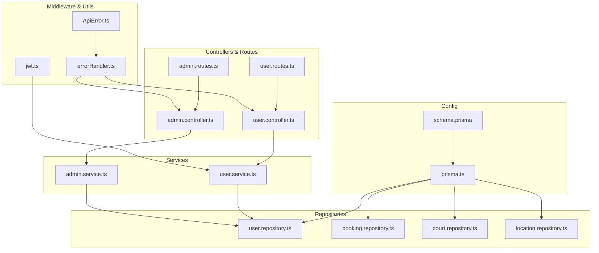

**Diagram sources**
- [prisma.ts:1-10](file://backend/src/config/prisma.ts#L1-L10)
- [schema.prisma:1-126](file://backend/prisma/schema.prisma#L1-L126)
- [user.repository.ts:1-53](file://backend/src/repositories/user.repository.ts#L1-L53)
- [booking.repository.ts:1-49](file://backend/src/repositories/booking.repository.ts#L1-L49)
- [court.repository.ts:1-83](file://backend/src/repositories/court.repository.ts#L1-L83)
- [location.repository.ts:1-51](file://backend/src/repositories/location.repository.ts#L1-L51)
- [user.service.ts:1-69](file://backend/src/services/user.service.ts#L1-L69)
- [admin.service.ts:1-57](file://backend/src/services/admin.service.ts#L1-L57)
- [user.controller.ts:1-14](file://backend/src/controllers/user.controller.ts#L1-L14)
- [admin.controller.ts:1-13](file://backend/src/controllers/admin.controller.ts#L1-L13)
- [user.routes.ts:1-10](file://backend/src/routers/user.routes.ts#L1-L10)
- [admin.routes.ts:1-6](file://backend/src/routers/admin.routes.ts#L1-L6)
- [errorHandler.ts:1-38](file://backend/src/middlewares/errorHandler.ts#L1-L38)
- [ApiError.ts:1-13](file://backend/src/utils/ApiError.ts#L1-L13)
- [jwt.ts:1-13](file://backend/src/utils/jwt.ts#L1-L13)

**Section sources**
- [prisma.ts:1-10](file://backend/src/config/prisma.ts#L1-L10)
- [schema.prisma:1-126](file://backend/prisma/schema.prisma#L1-L126)
- [user.repository.ts:1-53](file://backend/src/repositories/user.repository.ts#L1-L53)
- [booking.repository.ts:1-49](file://backend/src/repositories/booking.repository.ts#L1-L49)
- [court.repository.ts:1-83](file://backend/src/repositories/court.repository.ts#L1-L83)
- [location.repository.ts:1-51](file://backend/src/repositories/location.repository.ts#L1-L51)
- [user.service.ts:1-69](file://backend/src/services/user.service.ts#L1-L69)
- [admin.service.ts:1-57](file://backend/src/services/admin.service.ts#L1-L57)
- [user.controller.ts:1-14](file://backend/src/controllers/user.controller.ts#L1-L14)
- [admin.controller.ts:1-13](file://backend/src/controllers/admin.controller.ts#L1-L13)
- [user.routes.ts:1-10](file://backend/src/routers/user.routes.ts#L1-L10)
- [admin.routes.ts:1-6](file://backend/src/routers/admin.routes.ts#L1-L6)
- [errorHandler.ts:1-38](file://backend/src/middlewares/errorHandler.ts#L1-L38)
- [ApiError.ts:1-13](file://backend/src/utils/ApiError.ts#L1-L13)
- [jwt.ts:1-13](file://backend/src/utils/jwt.ts#L1-L13)

## Core Components
- Prisma client configured with a PostgreSQL adapter and connection pooling
- Domain-specific repositories encapsulating CRUD and query logic
- Services orchestrating business logic and delegating persistence to repositories
- Controllers exposing endpoints and routes
- Global error handling middleware and custom error type
- JWT utilities for authentication tokens

Key responsibilities:
- Prisma configuration: connection pooling, adapter selection, client initialization
- Repositories: encapsulate model-specific queries, data mapping, and ID generation helpers
- Services: coordinate use cases, validation, hashing, and token generation
- Controllers and routes: HTTP entry points
- Error handling: translate domain and Prisma errors into consistent JSON responses
- JWT: sign and verify tokens for authenticated sessions

**Section sources**
- [prisma.ts:1-10](file://backend/src/config/prisma.ts#L1-L10)
- [schema.prisma:1-126](file://backend/prisma/schema.prisma#L1-L126)
- [user.repository.ts:1-53](file://backend/src/repositories/user.repository.ts#L1-L53)
- [booking.repository.ts:1-49](file://backend/src/repositories/booking.repository.ts#L1-L49)
- [court.repository.ts:1-83](file://backend/src/repositories/court.repository.ts#L1-L83)
- [location.repository.ts:1-51](file://backend/src/repositories/location.repository.ts#L1-L51)
- [user.service.ts:1-69](file://backend/src/services/user.service.ts#L1-L69)
- [admin.service.ts:1-57](file://backend/src/services/admin.service.ts#L1-L57)
- [user.controller.ts:1-14](file://backend/src/controllers/user.controller.ts#L1-L14)
- [admin.controller.ts:1-13](file://backend/src/controllers/admin.controller.ts#L1-L13)
- [user.routes.ts:1-10](file://backend/src/routers/user.routes.ts#L1-L10)
- [admin.routes.ts:1-6](file://backend/src/routers/admin.routes.ts#L1-L6)
- [errorHandler.ts:1-38](file://backend/src/middlewares/errorHandler.ts#L1-L38)
- [ApiError.ts:1-13](file://backend/src/utils/ApiError.ts#L1-L13)
- [jwt.ts:1-13](file://backend/src/utils/jwt.ts#L1-L13)

## Architecture Overview
The data access layer follows a layered architecture:
- Presentation: Express routes and controllers
- Application: Services implementing use cases
- Domain/Data: Repositories encapsulating Prisma operations
- Infrastructure: Prisma client with PostgreSQL adapter and connection pooling

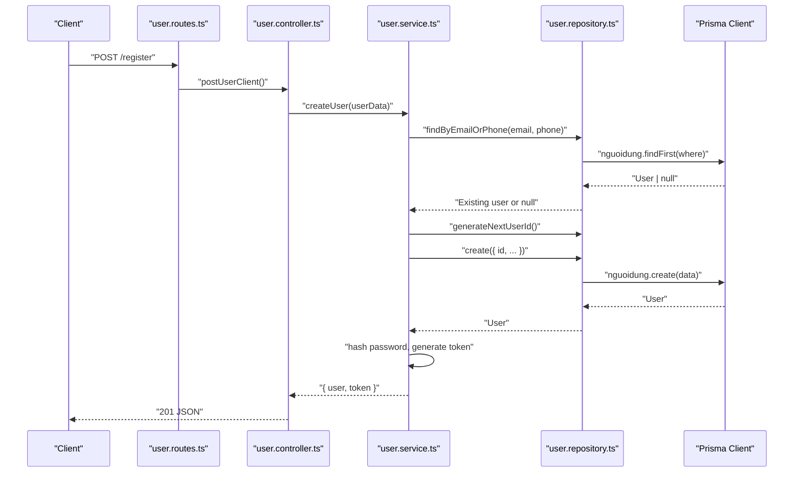

**Diagram sources**
- [user.routes.ts:1-10](file://backend/src/routers/user.routes.ts#L1-L10)
- [user.controller.ts:1-14](file://backend/src/controllers/user.controller.ts#L1-L14)
- [user.service.ts:1-69](file://backend/src/services/user.service.ts#L1-L69)
- [user.repository.ts:1-53](file://backend/src/repositories/user.repository.ts#L1-L53)
- [prisma.ts:1-10](file://backend/src/config/prisma.ts#L1-L10)

**Section sources**
- [user.routes.ts:1-10](file://backend/src/routers/user.routes.ts#L1-L10)
- [user.controller.ts:1-14](file://backend/src/controllers/user.controller.ts#L1-L14)
- [user.service.ts:1-69](file://backend/src/services/user.service.ts#L1-L69)
- [user.repository.ts:1-53](file://backend/src/repositories/user.repository.ts#L1-L53)
- [prisma.ts:1-10](file://backend/src/config/prisma.ts#L1-L10)

## Detailed Component Analysis

### Prisma Configuration and Connection Management
- Uses the Prisma PostgreSQL adapter with a connection pool initialized from DATABASE_URL
- Creates a single PrismaClient instance injected into repositories
- Provides a clean separation between infrastructure concerns and domain logic

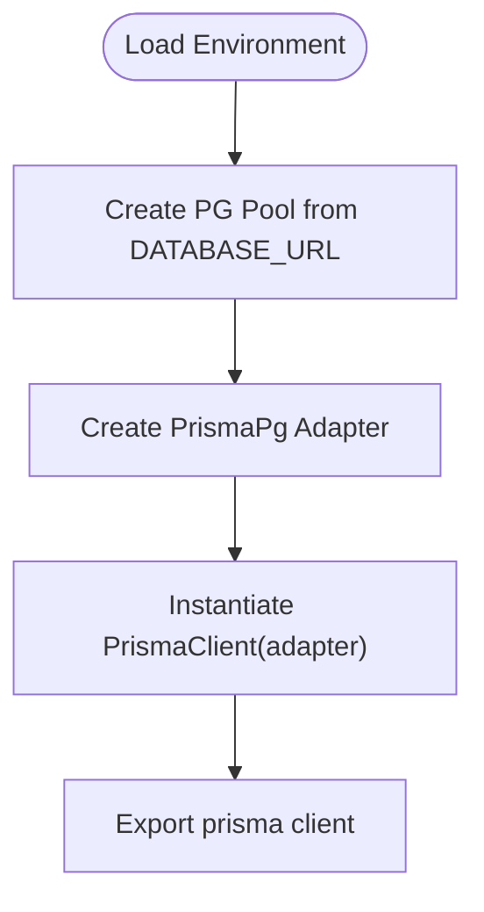

**Diagram sources**
- [prisma.ts:1-10](file://backend/src/config/prisma.ts#L1-L10)

**Section sources**
- [prisma.ts:1-10](file://backend/src/config/prisma.ts#L1-L10)

### Schema Overview and Data Mapping
- Models represent domain entities with explicit primary keys, relations, and constraints
- Relations are defined with foreign keys and optional onDelete/onUpdate actions
- Data types align with Prisma’s PostgreSQL provider (e.g., Decimal, DateTime, Date)

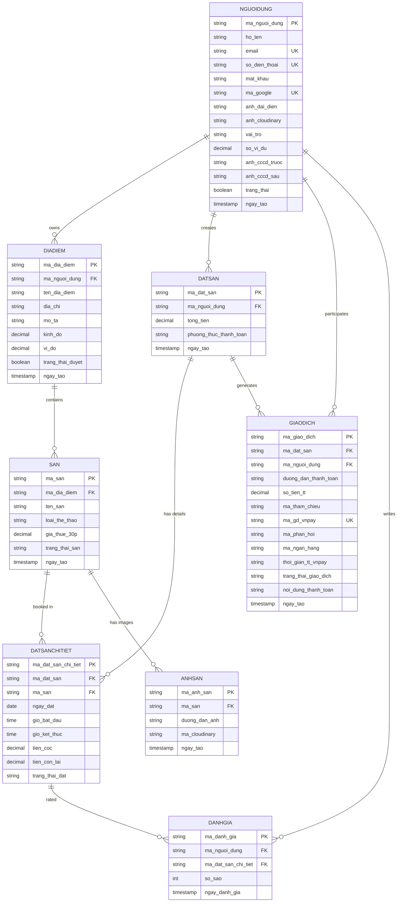

**Diagram sources**
- [schema.prisma:1-126](file://backend/prisma/schema.prisma#L1-L126)

**Section sources**
- [schema.prisma:1-126](file://backend/prisma/schema.prisma#L1-L126)

### Repository Pattern Implementation

#### User Repository
- CRUD operations: findById, findByEmailOrPhone, findAll, create
- Utility: generateNextUserId for deterministic ID generation
- Data mapping: returns Prisma model types directly

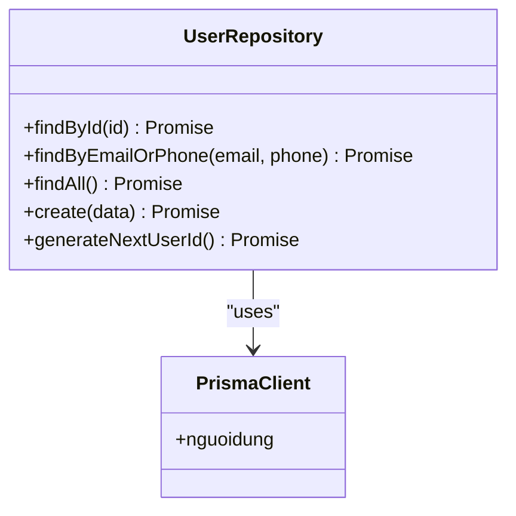

**Diagram sources**
- [user.repository.ts:1-53](file://backend/src/repositories/user.repository.ts#L1-L53)
- [prisma.ts:1-10](file://backend/src/config/prisma.ts#L1-L10)

**Section sources**
- [user.repository.ts:1-53](file://backend/src/repositories/user.repository.ts#L1-L53)

#### Booking Repository
- Query: findByOwnerId with nested include for related entities
- Query: findByIdAndOwnerId with owner verification
- Mutation: updateStatus for booking detail status

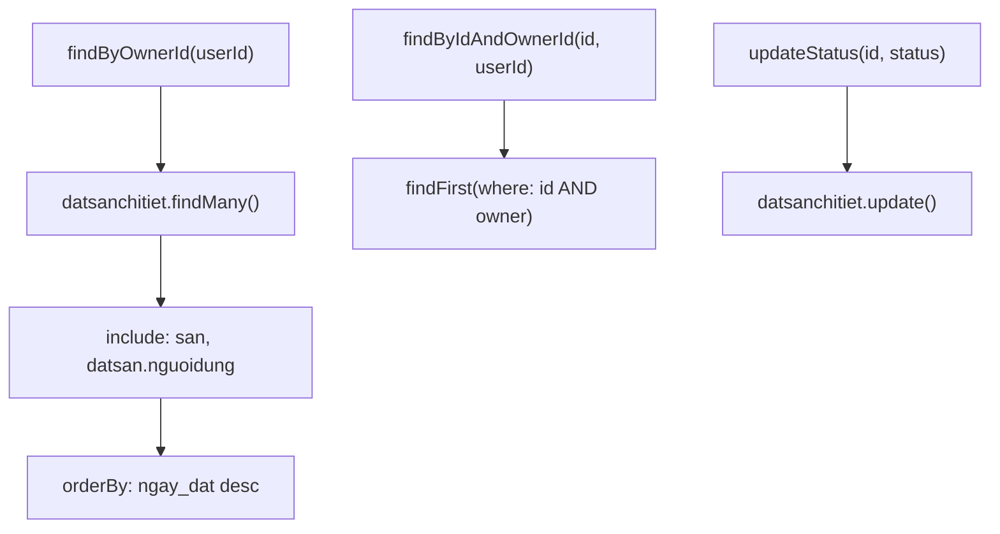

**Diagram sources**
- [booking.repository.ts:1-49](file://backend/src/repositories/booking.repository.ts#L1-L49)

**Section sources**
- [booking.repository.ts:1-49](file://backend/src/repositories/booking.repository.ts#L1-L49)

#### Court Repository
- Query: findByLocationId
- Query: findByIdAndOwnerId with owner verification
- CRUD: findById, create, update
- Bulk: createCourtImages
- Query: findAllWithDetails with nested includes
- Utility: generateNextCourtId

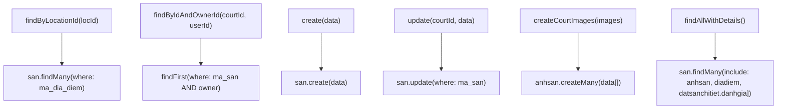

**Diagram sources**
- [court.repository.ts:1-83](file://backend/src/repositories/court.repository.ts#L1-L83)

**Section sources**
- [court.repository.ts:1-83](file://backend/src/repositories/court.repository.ts#L1-L83)

#### Location Repository
- Query: findByOwnerId with nested includes for courts and images
- Query: findFirstByOwnerId
- CRUD: create
- Utility: generateNextLocationId

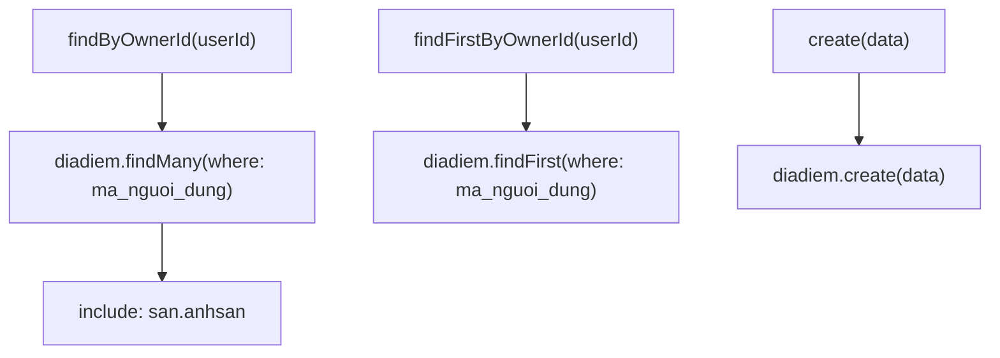

**Diagram sources**
- [location.repository.ts:1-51](file://backend/src/repositories/location.repository.ts#L1-L51)

**Section sources**
- [location.repository.ts:1-51](file://backend/src/repositories/location.repository.ts#L1-L51)

### Abstraction Between Services and Prisma ORM
- Services depend on repository interfaces, not on Prisma directly
- Repositories encapsulate Prisma client usage and expose domain-focused methods
- This design allows swapping adapters or changing ORM without affecting services

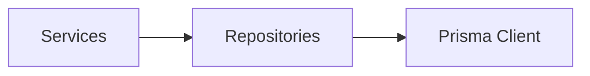

**Diagram sources**
- [user.service.ts:1-69](file://backend/src/services/user.service.ts#L1-L69)
- [admin.service.ts:1-57](file://backend/src/services/admin.service.ts#L1-L57)
- [user.repository.ts:1-53](file://backend/src/repositories/user.repository.ts#L1-L53)
- [booking.repository.ts:1-49](file://backend/src/repositories/booking.repository.ts#L1-L49)
- [court.repository.ts:1-83](file://backend/src/repositories/court.repository.ts#L1-L83)
- [location.repository.ts:1-51](file://backend/src/repositories/location.repository.ts#L1-L51)
- [prisma.ts:1-10](file://backend/src/config/prisma.ts#L1-L10)

**Section sources**
- [user.service.ts:1-69](file://backend/src/services/user.service.ts#L1-L69)
- [admin.service.ts:1-57](file://backend/src/services/admin.service.ts#L1-L57)
- [user.repository.ts:1-53](file://backend/src/repositories/user.repository.ts#L1-L53)
- [booking.repository.ts:1-49](file://backend/src/repositories/booking.repository.ts#L1-L49)
- [court.repository.ts:1-83](file://backend/src/repositories/court.repository.ts#L1-L83)
- [location.repository.ts:1-51](file://backend/src/repositories/location.repository.ts#L1-L51)
- [prisma.ts:1-10](file://backend/src/config/prisma.ts#L1-L10)

### Transaction Handling and Connection Management
- Single PrismaClient instance is exported and reused across repositories
- Connection pooling is managed by the PostgreSQL adapter and underlying pool
- No explicit transaction boundaries are defined in the current repositories; use transactions when multiple writes must succeed or fail together

Recommendations:
- Wrap multi-step writes in a transaction using Prisma’s transaction API
- Keep transactions short-lived and avoid long-running operations inside them

**Section sources**
- [prisma.ts:1-10](file://backend/src/config/prisma.ts#L1-L10)

### Query Building, Pagination, and Filtering Strategies
Current repositories implement:
- Basic filtering via where conditions
- Includes for related entities
- Ordering via orderBy
- No explicit pagination (skip/take) or advanced filters

Recommended enhancements:
- Add pagination parameters (skip, take) to findMany methods
- Support dynamic filters (status, date range, location)
- Use select projections to limit returned fields for read-heavy endpoints

Examples to implement:
- Paginated listings: extend findMany with skip/take
- Advanced filters: add filter objects to repository methods
- Sorting: support multiple sort fields and directions

**Section sources**
- [booking.repository.ts:1-49](file://backend/src/repositories/booking.repository.ts#L1-L49)
- [court.repository.ts:1-83](file://backend/src/repositories/court.repository.ts#L1-L83)
- [location.repository.ts:1-51](file://backend/src/repositories/location.repository.ts#L1-L51)
- [user.repository.ts:1-53](file://backend/src/repositories/user.repository.ts#L1-L53)

### Data Mapping
- Repositories return Prisma model instances directly
- Services transform domain data (e.g., hashed passwords, tokens) before responding
- Consider mapping to DTOs for controllers to reduce exposure of internal models

**Section sources**
- [user.repository.ts:1-53](file://backend/src/repositories/user.repository.ts#L1-L53)
- [user.service.ts:1-69](file://backend/src/services/user.service.ts#L1-L69)

### Extending Repositories and Complex Queries
Examples of extending repositories:
- Add a method to fetch booking details with complex joins and filters
- Implement bulk operations (e.g., createMany for images)
- Add computed aggregations (e.g., average rating) via raw queries or include-based counts

Implementation tips:
- Keep repository methods focused on a single responsibility
- Use include to fetch related data efficiently
- Prefer composition over deeply nested queries

**Section sources**
- [booking.repository.ts:1-49](file://backend/src/repositories/booking.repository.ts#L1-L49)
- [court.repository.ts:1-83](file://backend/src/repositories/court.repository.ts#L1-L83)
- [location.repository.ts:1-51](file://backend/src/repositories/location.repository.ts#L1-L51)

## Dependency Analysis
Repositories depend on the Prisma client; services depend on repositories; controllers depend on services; routes depend on controllers; error handling middleware depends on controllers and services.

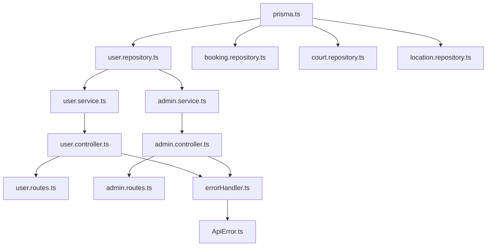

**Diagram sources**
- [prisma.ts:1-10](file://backend/src/config/prisma.ts#L1-L10)
- [user.repository.ts:1-53](file://backend/src/repositories/user.repository.ts#L1-L53)
- [booking.repository.ts:1-49](file://backend/src/repositories/booking.repository.ts#L1-L49)
- [court.repository.ts:1-83](file://backend/src/repositories/court.repository.ts#L1-L83)
- [location.repository.ts:1-51](file://backend/src/repositories/location.repository.ts#L1-L51)
- [user.service.ts:1-69](file://backend/src/services/user.service.ts#L1-L69)
- [admin.service.ts:1-57](file://backend/src/services/admin.service.ts#L1-L57)
- [user.controller.ts:1-14](file://backend/src/controllers/user.controller.ts#L1-L14)
- [admin.controller.ts:1-13](file://backend/src/controllers/admin.controller.ts#L1-L13)
- [user.routes.ts:1-10](file://backend/src/routers/user.routes.ts#L1-L10)
- [admin.routes.ts:1-6](file://backend/src/routers/admin.routes.ts#L1-L6)
- [errorHandler.ts:1-38](file://backend/src/middlewares/errorHandler.ts#L1-L38)
- [ApiError.ts:1-13](file://backend/src/utils/ApiError.ts#L1-L13)

**Section sources**
- [prisma.ts:1-10](file://backend/src/config/prisma.ts#L1-L10)
- [user.repository.ts:1-53](file://backend/src/repositories/user.repository.ts#L1-L53)
- [booking.repository.ts:1-49](file://backend/src/repositories/booking.repository.ts#L1-L49)
- [court.repository.ts:1-83](file://backend/src/repositories/court.repository.ts#L1-L83)
- [location.repository.ts:1-51](file://backend/src/repositories/location.repository.ts#L1-L51)
- [user.service.ts:1-69](file://backend/src/services/user.service.ts#L1-L69)
- [admin.service.ts:1-57](file://backend/src/services/admin.service.ts#L1-L57)
- [user.controller.ts:1-14](file://backend/src/controllers/user.controller.ts#L1-L14)
- [admin.controller.ts:1-13](file://backend/src/controllers/admin.controller.ts#L1-L13)
- [user.routes.ts:1-10](file://backend/src/routers/user.routes.ts#L1-L10)
- [admin.routes.ts:1-6](file://backend/src/routers/admin.routes.ts#L1-L6)
- [errorHandler.ts:1-38](file://backend/src/middlewares/errorHandler.ts#L1-L38)
- [ApiError.ts:1-13](file://backend/src/utils/ApiError.ts#L1-L13)

## Performance Considerations
- Connection pooling: leverage the existing PostgreSQL adapter and pool
- Selectivity: use where conditions and includes judiciously; avoid N+1 queries
- Projections: use select to limit fields for read-heavy endpoints
- Pagination: implement skip/take to avoid large result sets
- Indexes: ensure frequently filtered columns (IDs, emails, phones) are indexed
- Transactions: wrap multi-step writes to minimize partial updates
- Caching: cache read-mostly data (e.g., static lists) with invalidation strategies

[No sources needed since this section provides general guidance]

## Troubleshooting Guide
Common issues and resolutions:
- Duplicate key errors: handled by the global error handler translating Prisma errors into user-friendly messages
- Validation errors: thrown as ApiError with appropriate status codes
- Authentication failures: password comparison errors raise ApiError
- Unexpected errors: logged and responded with generic error payload

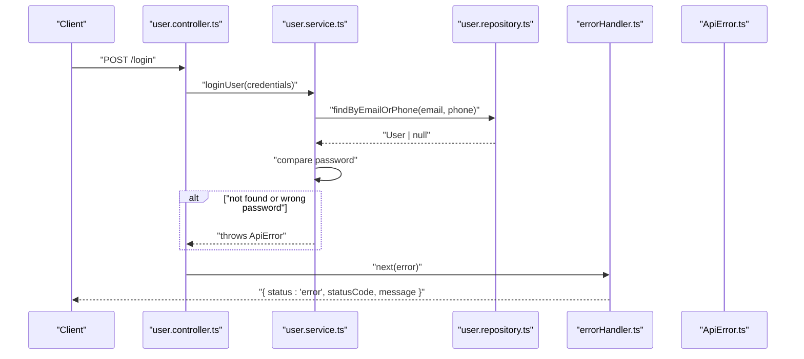

**Diagram sources**
- [user.controller.ts:1-14](file://backend/src/controllers/user.controller.ts#L1-L14)
- [user.service.ts:1-69](file://backend/src/services/user.service.ts#L1-L69)
- [user.repository.ts:1-53](file://backend/src/repositories/user.repository.ts#L1-L53)
- [errorHandler.ts:1-38](file://backend/src/middlewares/errorHandler.ts#L1-L38)
- [ApiError.ts:1-13](file://backend/src/utils/ApiError.ts#L1-L13)

**Section sources**
- [errorHandler.ts:1-38](file://backend/src/middlewares/errorHandler.ts#L1-L38)
- [ApiError.ts:1-13](file://backend/src/utils/ApiError.ts#L1-L13)
- [user.service.ts:1-69](file://backend/src/services/user.service.ts#L1-L69)
- [user.controller.ts:1-14](file://backend/src/controllers/user.controller.ts#L1-L14)

## Conclusion
The data access layer cleanly separates concerns using the repository pattern with Prisma ORM. Repositories encapsulate persistence logic, services orchestrate use cases, and middleware ensures consistent error handling. Current implementations focus on essential CRUD and relation fetching; future enhancements should emphasize pagination, advanced filtering, and transactional safety for complex workflows.

[No sources needed since this section summarizes without analyzing specific files]

## Appendices

### Example: Extending a Repository with Pagination
- Add parameters to findMany methods (skip, take)
- Apply orderBy consistently
- Return paginated results alongside total count

**Section sources**
- [court.repository.ts:1-83](file://backend/src/repositories/court.repository.ts#L1-L83)
- [location.repository.ts:1-51](file://backend/src/repositories/location.repository.ts#L1-L51)

### Example: Implementing a Complex Query with Includes
- Use nested include to fetch related entities
- Apply where conditions to filter by owner or status
- Order results by date or relevance

**Section sources**
- [booking.repository.ts:1-49](file://backend/src/repositories/booking.repository.ts#L1-L49)
- [court.repository.ts:1-83](file://backend/src/repositories/court.repository.ts#L1-L83)
- [location.repository.ts:1-51](file://backend/src/repositories/location.repository.ts#L1-L51)