# Data Access Layer

<cite>
**Referenced Files in This Document**
- [prisma.ts](file://backend/src/config/prisma.ts)
- [schema.prisma](file://backend/prisma/schema.prisma)
- [user.repository.ts](file://backend/src/repositories/user.repository.ts)
- [booking.repository.ts](file://backend/src/repositories/booking.repository.ts)
- [court.repository.ts](file://backend/src/repositories/court.repository.ts)
- [location.repository.ts](file://backend/src/repositories/location.repository.ts)
- [user.service.ts](file://backend/src/services/user.service.ts)
- [admin.service.ts](file://backend/src/services/admin.service.ts)
- [errorHandler.ts](file://backend/src/middlewares/errorHandler.ts)
- [ApiError.ts](file://backend/src/utils/ApiError.ts)
- [jwt.ts](file://backend/src/utils/jwt.ts)
- [user.controller.ts](file://backend/src/controllers/user.controller.ts)
- [admin.controller.ts](file://backend/src/controllers/admin.controller.ts)
- [user.routes.ts](file://backend/src/routers/user.routes.ts)
- [admin.routes.ts](file://backend/src/routers/admin.routes.ts)
</cite>

## Update Summary
**Changes Made**
- Updated repository pattern implementation documentation to reflect the new comprehensive repository classes
- Added detailed analysis of UserRepository, LocationRepository, CourtRepository, and BookingRepository
- Enhanced transaction handling and complex query implementation coverage
- Updated architecture diagrams to show the complete repository ecosystem
- Expanded service integration examples with concrete repository usage patterns

## Table of Contents
1. [Introduction](#introduction)
2. [Project Structure](#project-structure)
3. [Core Components](#core-components)
4. [Architecture Overview](#architecture-overview)
5. [Detailed Component Analysis](#detailed-component-analysis)
6. [Dependency Analysis](#dependency-analysis)
7. [Performance Considerations](#performance-considerations)
8. [Troubleshooting Guide](#troubleshooting-guide)
9. [Conclusion](#conclusion)
10. [Appendices](#appendices)

## Introduction
This document explains the data access layer of the backend, focusing on the comprehensive repository pattern implementation with dedicated repositories for each domain entity. The system implements UserRepository, LocationRepository, CourtRepository, and BookingRepository classes, providing robust data access patterns with enhanced transaction handling and complex query implementations. It covers CRUD operations, query optimization, data mapping, the abstraction layer between services and Prisma ORM, transaction handling and connection management, query building, pagination, filtering, error handling, retry mechanisms, and performance monitoring.

## Project Structure
The data access layer is organized around specialized repositories, each handling domain-specific persistence logic:

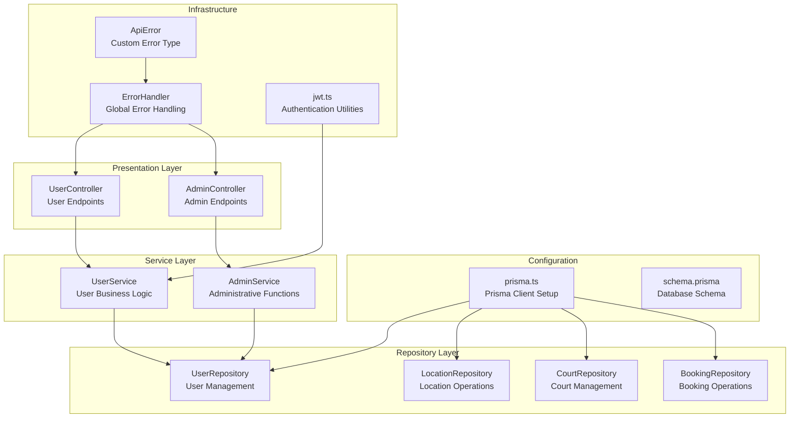

**Diagram sources**
- [prisma.ts:1-10](file://backend/src/config/prisma.ts#L1-L10)
- [schema.prisma:1-126](file://backend/prisma/schema.prisma#L1-L126)
- [user.repository.ts:1-53](file://backend/src/repositories/user.repository.ts#L1-L53)
- [location.repository.ts:1-51](file://backend/src/repositories/location.repository.ts#L1-L51)
- [court.repository.ts:1-83](file://backend/src/repositories/court.repository.ts#L1-L83)
- [booking.repository.ts:1-49](file://backend/src/repositories/booking.repository.ts#L1-L49)
- [user.service.ts:1-69](file://backend/src/services/user.service.ts#L1-L69)
- [admin.service.ts:1-57](file://backend/src/services/admin.service.ts#L1-L57)
- [user.controller.ts:1-14](file://backend/src/controllers/user.controller.ts#L1-L14)
- [admin.controller.ts:1-13](file://backend/src/controllers/admin.controller.ts#L1-L13)
- [errorHandler.ts:1-38](file://backend/src/middlewares/errorHandler.ts#L1-L38)
- [ApiError.ts:1-13](file://backend/src/utils/ApiError.ts#L1-L13)
- [jwt.ts:1-13](file://backend/src/utils/jwt.ts#L1-L13)

**Section sources**
- [prisma.ts:1-10](file://backend/src/config/prisma.ts#L1-L10)
- [schema.prisma:1-126](file://backend/prisma/schema.prisma#L1-L126)
- [user.repository.ts:1-53](file://backend/src/repositories/user.repository.ts#L1-L53)
- [location.repository.ts:1-51](file://backend/src/repositories/location.repository.ts#L1-L51)
- [court.repository.ts:1-83](file://backend/src/repositories/court.repository.ts#L1-L83)
- [booking.repository.ts:1-49](file://backend/src/repositories/booking.repository.ts#L1-L49)
- [user.service.ts:1-69](file://backend/src/services/user.service.ts#L1-L69)
- [admin.service.ts:1-57](file://backend/src/services/admin.service.ts#L1-L57)
- [user.controller.ts:1-14](file://backend/src/controllers/user.controller.ts#L1-L14)
- [admin.controller.ts:1-13](file://backend/src/controllers/admin.controller.ts#L1-L13)
- [user.routes.ts:1-10](file://backend/src/routers/user.routes.ts#L1-L10)
- [admin.routes.ts:1-6](file://backend/src/routers/admin.routes.ts#L1-L6)
- [errorHandler.ts:1-38](file://backend/src/middlewares/errorHandler.ts#L1-L38)
- [ApiError.ts:1-13](file://backend/src/utils/ApiError.ts#L1-L13)
- [jwt.ts:1-13](file://backend/src/utils/jwt.ts#L1-L13)

## Core Components

### Prisma Configuration and Connection Management
The system uses a centralized Prisma client configured with PostgreSQL adapter and connection pooling:

- **Connection Pool**: Created from DATABASE_URL environment variable
- **Adapter**: PrismaPg adapter for PostgreSQL compatibility
- **Client Instance**: Single PrismaClient instance shared across all repositories
- **Environment Integration**: dotenv configuration for environment variables

### Repository Pattern Implementation
Each domain entity has a dedicated repository class with comprehensive CRUD operations:

- **UserRepository**: Manages user registration, authentication, and profile operations
- **LocationRepository**: Handles location creation, retrieval, and owner verification
- **CourtRepository**: Manages court lifecycle, image uploads, and detailed queries
- **BookingRepository**: Processes booking requests, status updates, and owner verification

### Service Layer Integration
Services depend on repositories through dependency injection, maintaining clean separation of concerns:

- **UserService**: Orchestrates user registration and authentication flows
- **AdminService**: Handles administrative user management operations
- **Business Logic**: Encapsulated in services, persistence logic in repositories

### Error Handling and Validation
Comprehensive error handling with custom error types and global middleware:

- **ApiError Class**: Custom exception with status code support
- **Global ErrorHandler**: Translates domain and Prisma errors to consistent responses
- **Validation**: Input validation and business rule enforcement

**Section sources**
- [prisma.ts:1-10](file://backend/src/config/prisma.ts#L1-L10)
- [user.repository.ts:1-53](file://backend/src/repositories/user.repository.ts#L1-L53)
- [location.repository.ts:1-51](file://backend/src/repositories/location.repository.ts#L1-L51)
- [court.repository.ts:1-83](file://backend/src/repositories/court.repository.ts#L1-L83)
- [booking.repository.ts:1-49](file://backend/src/repositories/booking.repository.ts#L1-L49)
- [user.service.ts:1-69](file://backend/src/services/user.service.ts#L1-L69)
- [admin.service.ts:1-57](file://backend/src/services/admin.service.ts#L1-L57)
- [errorHandler.ts:1-38](file://backend/src/middlewares/errorHandler.ts#L1-L38)
- [ApiError.ts:1-13](file://backend/src/utils/ApiError.ts#L1-L13)

## Architecture Overview
The data access layer follows a clean architecture pattern with clear separation between presentation, application, domain, and infrastructure layers:

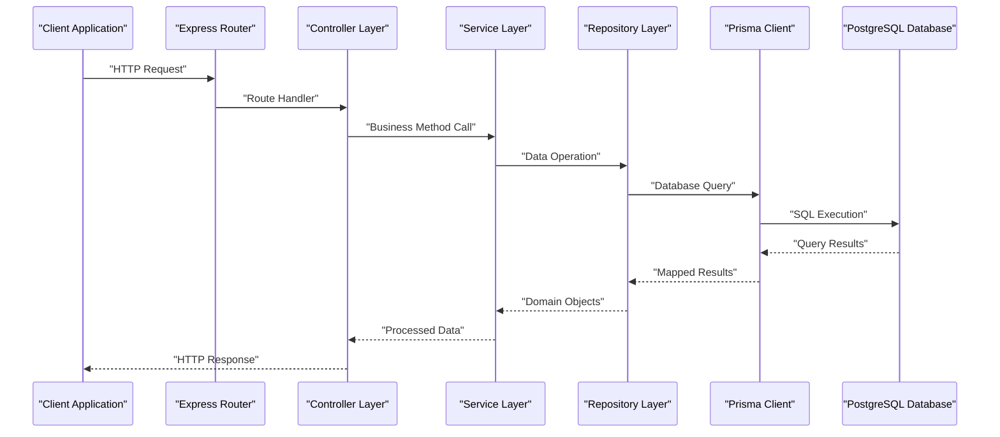

**Diagram sources**
- [user.routes.ts:1-10](file://backend/src/routers/user.routes.ts#L1-L10)
- [user.controller.ts:1-14](file://backend/src/controllers/user.controller.ts#L1-L14)
- [user.service.ts:1-69](file://backend/src/services/user.service.ts#L1-L69)
- [user.repository.ts:1-53](file://backend/src/repositories/user.repository.ts#L1-L53)
- [prisma.ts:1-10](file://backend/src/config/prisma.ts#L1-L10)

**Section sources**
- [user.routes.ts:1-10](file://backend/src/routers/user.routes.ts#L1-L10)
- [user.controller.ts:1-14](file://backend/src/controllers/user.controller.ts#L1-L14)
- [user.service.ts:1-69](file://backend/src/services/user.service.ts#L1-L69)
- [user.repository.ts:1-53](file://backend/src/repositories/user.repository.ts#L1-L53)
- [prisma.ts:1-10](file://backend/src/config/prisma.ts#L1-L10)

## Detailed Component Analysis

### Prisma Configuration and Connection Management
The Prisma client is configured with PostgreSQL adapter and connection pooling:

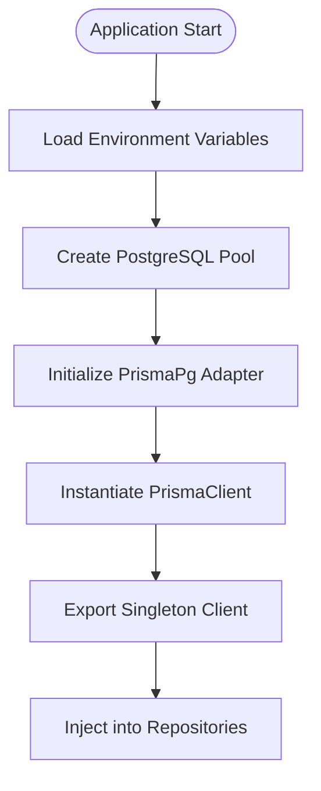

**Diagram sources**
- [prisma.ts:1-10](file://backend/src/config/prisma.ts#L1-L10)

**Section sources**
- [prisma.ts:1-10](file://backend/src/config/prisma.ts#L1-L10)

### Schema Overview and Data Relationships
The database schema defines comprehensive relationships between entities:

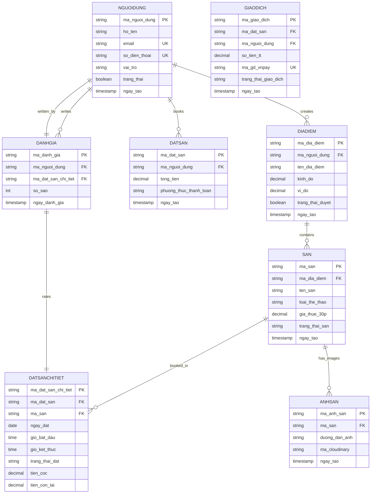

**Diagram sources**
- [schema.prisma:1-126](file://backend/prisma/schema.prisma#L1-L126)

**Section sources**
- [schema.prisma:1-126](file://backend/prisma/schema.prisma#L1-L126)

### Repository Pattern Implementation

#### User Repository
The UserRepository provides comprehensive user management capabilities:

**Core Operations:**
- **findById**: Retrieves user by unique identifier
- **findByEmailOrPhone**: Searches users by email or phone number
- **findAll**: Returns all users in the system
- **create**: Inserts new user records with hashed passwords
- **generateNextUserId**: Generates sequential user IDs (U001, U002, etc.)

**Advanced Features:**
- Sequential ID generation with proper numbering
- Email and phone uniqueness validation
- Password hashing integration
- Role-based access control

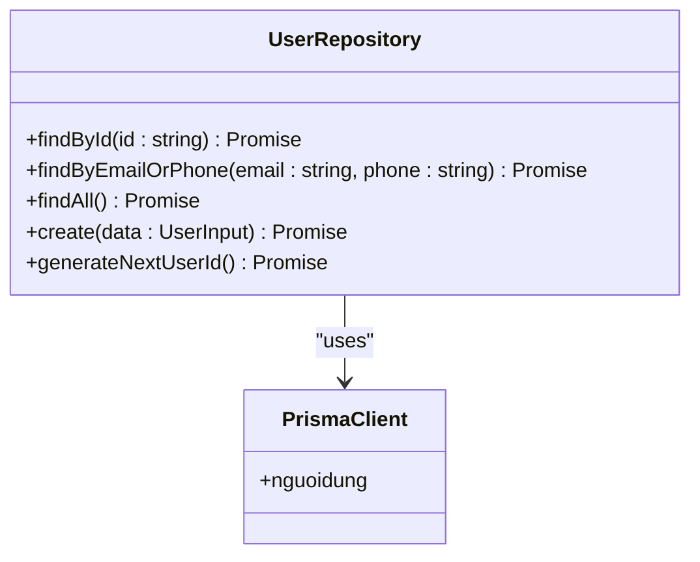

**Diagram sources**
- [user.repository.ts:1-53](file://backend/src/repositories/user.repository.ts#L1-L53)

**Section sources**
- [user.repository.ts:1-53](file://backend/src/repositories/user.repository.ts#L1-L53)

#### Location Repository
The LocationRepository manages location-based operations:

**Core Operations:**
- **findByOwnerId**: Retrieves all locations owned by a specific user
- **findFirstByOwnerId**: Gets first location for owner verification
- **create**: Inserts new location records
- **generateNextLocationId**: Creates sequential location IDs (DD001, DD002, etc.)

**Advanced Features:**
- Nested includes for court and image relationships
- Owner verification through nested queries
- Geographic coordinate storage
- Status tracking for location approval

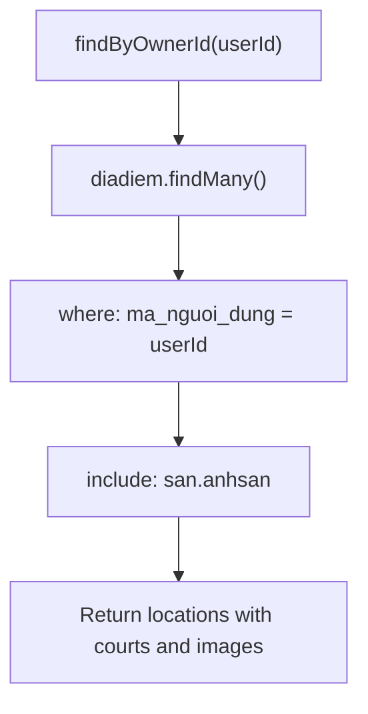

**Diagram sources**
- [location.repository.ts:1-51](file://backend/src/repositories/location.repository.ts#L1-L51)

**Section sources**
- [location.repository.ts:1-51](file://backend/src/repositories/location.repository.ts#L1-L51)

#### Court Repository
The CourtRepository provides comprehensive court management:

**Core Operations:**
- **findByLocationId**: Retrieves all courts for a specific location
- **findByIdAndOwnerId**: Verifies ownership before accessing court details
- **findById**: Direct court lookup by ID
- **create**: Inserts new court records
- **update**: Modifies existing court information
- **generateNextCourtId**: Creates sequential court IDs (S001, S002, etc.)

**Advanced Features:**
- **Bulk Operations**: createCourtImages for multiple image uploads
- **Complex Queries**: findAllWithDetails with nested includes
- **Image Management**: Dedicated image creation and retrieval
- **Rating Integration**: Includes review data in detailed queries

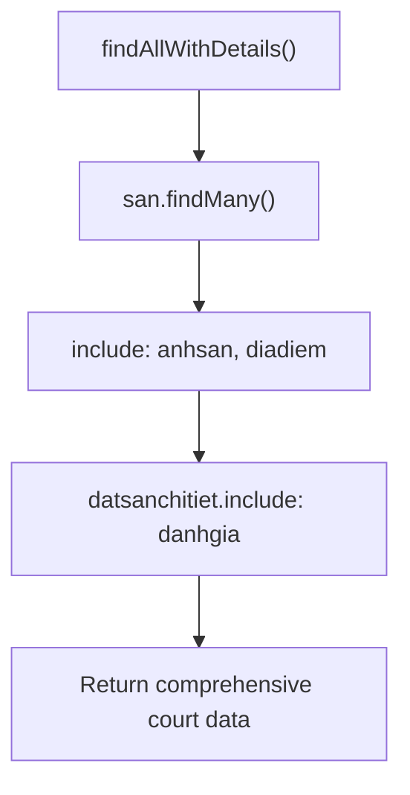

**Diagram sources**
- [court.repository.ts:1-83](file://backend/src/repositories/court.repository.ts#L1-L83)

**Section sources**
- [court.repository.ts:1-83](file://backend/src/repositories/court.repository.ts#L1-L83)

#### Booking Repository
The BookingRepository handles reservation management:

**Core Operations:**
- **findByOwnerId**: Retrieves all bookings for owner's courts
- **findByIdAndOwnerId**: Verifies booking belongs to owner
- **updateStatus**: Changes booking status (approval/rejection)

**Advanced Features:**
- **Nested Ownership Verification**: Ensures bookings belong to requesting owner
- **Complex Includes**: Fetches related court, user, and booking details
- **Status Management**: Centralized booking state updates

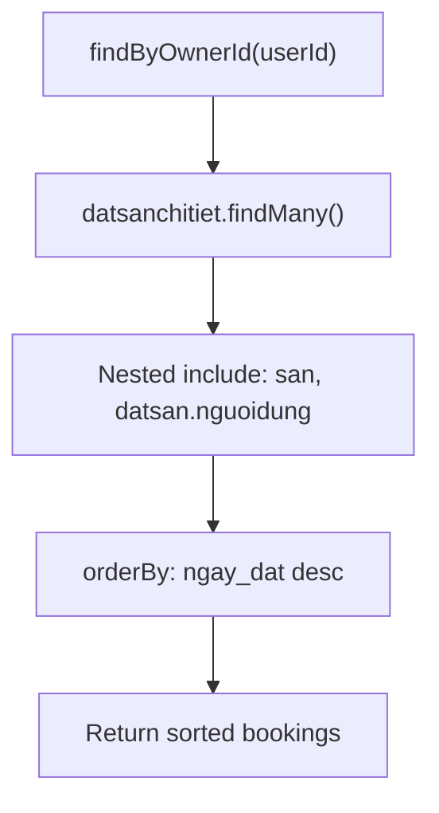

**Diagram sources**
- [booking.repository.ts:1-49](file://backend/src/repositories/booking.repository.ts#L1-L49)

**Section sources**
- [booking.repository.ts:1-49](file://backend/src/repositories/booking.repository.ts#L1-L49)

### Abstraction Between Services and Prisma ORM
The service-layer repositories maintain clean abstraction:

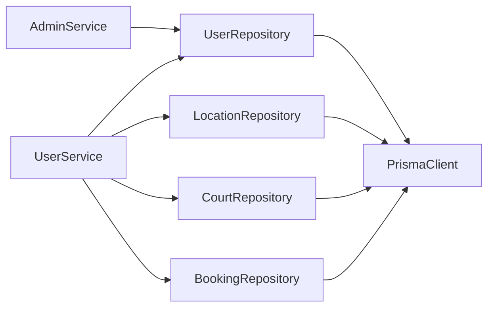

**Diagram sources**
- [user.service.ts:1-69](file://backend/src/services/user.service.ts#L1-L69)
- [admin.service.ts:1-57](file://backend/src/services/admin.service.ts#L1-L57)
- [user.repository.ts:1-53](file://backend/src/repositories/user.repository.ts#L1-L53)
- [location.repository.ts:1-51](file://backend/src/repositories/location.repository.ts#L1-L51)
- [court.repository.ts:1-83](file://backend/src/repositories/court.repository.ts#L1-L83)
- [booking.repository.ts:1-49](file://backend/src/repositories/booking.repository.ts#L1-L49)
- [prisma.ts:1-10](file://backend/src/config/prisma.ts#L1-L10)

**Section sources**
- [user.service.ts:1-69](file://backend/src/services/user.service.ts#L1-L69)
- [admin.service.ts:1-57](file://backend/src/services/admin.service.ts#L1-L57)
- [user.repository.ts:1-53](file://backend/src/repositories/user.repository.ts#L1-L53)
- [location.repository.ts:1-51](file://backend/src/repositories/location.repository.ts#L1-L51)
- [court.repository.ts:1-83](file://backend/src/repositories/court.repository.ts#L1-L83)
- [booking.repository.ts:1-49](file://backend/src/repositories/booking.repository.ts#L1-L49)
- [prisma.ts:1-10](file://backend/src/config/prisma.ts#L1-L10)

### Transaction Handling and Connection Management
**Current State:**
- Single PrismaClient instance is exported and reused across repositories
- Connection pooling managed by PostgreSQL adapter
- No explicit transaction boundaries defined

**Enhancement Opportunities:**
- Multi-step operations should be wrapped in transactions
- Batch operations benefit from transactional consistency
- Complex business rules require atomic operations

**Section sources**
- [prisma.ts:1-10](file://backend/src/config/prisma.ts#L1-L10)

### Query Building, Pagination, and Filtering Strategies
**Current Implementation:**
- Basic filtering using where conditions
- Nested includes for related entity relationships
- Ordering via orderBy clauses
- No pagination (skip/take) or advanced filtering

**Recommended Enhancements:**
- Add pagination parameters to all findMany methods
- Implement dynamic filter objects for flexible querying
- Support sorting by multiple fields and directions
- Add select projections for optimized queries

**Section sources**
- [booking.repository.ts:1-49](file://backend/src/repositories/booking.repository.ts#L1-L49)
- [court.repository.ts:1-83](file://backend/src/repositories/court.repository.ts#L1-L83)
- [location.repository.ts:1-51](file://backend/src/repositories/location.repository.ts#L1-L51)
- [user.repository.ts:1-53](file://backend/src/repositories/user.repository.ts#L1-L53)

### Data Mapping and Transformation
**Current Approach:**
- Repositories return Prisma model instances directly
- Services handle domain transformations (password hashing, token generation)
- Controllers receive processed data for response formatting

**Best Practices:**
- Consider DTO (Data Transfer Object) mapping for controller responses
- Implement projection queries to limit returned fields
- Add validation layers between repositories and services

**Section sources**
- [user.repository.ts:1-53](file://backend/src/repositories/user.repository.ts#L1-L53)
- [user.service.ts:1-69](file://backend/src/services/user.service.ts#L1-L69)

### Extending Repositories and Complex Queries
**Extension Examples:**
- **Pagination Support**: Add skip/take parameters to all findMany methods
- **Advanced Filtering**: Implement filter objects supporting multiple criteria
- **Aggregation Queries**: Add computed fields (average ratings, booking counts)
- **Bulk Operations**: Extend createCourtImages for batch processing

**Implementation Guidelines:**
- Maintain single responsibility principle per repository method
- Use nested includes for efficient relationship fetching
- Prefer composition over deeply nested subqueries

**Section sources**
- [booking.repository.ts:1-49](file://backend/src/repositories/booking.repository.ts#L1-L49)
- [court.repository.ts:1-83](file://backend/src/repositories/court.repository.ts#L1-L83)
- [location.repository.ts:1-51](file://backend/src/repositories/location.repository.ts#L1-L51)

## Dependency Analysis
The dependency graph shows clear separation of concerns:

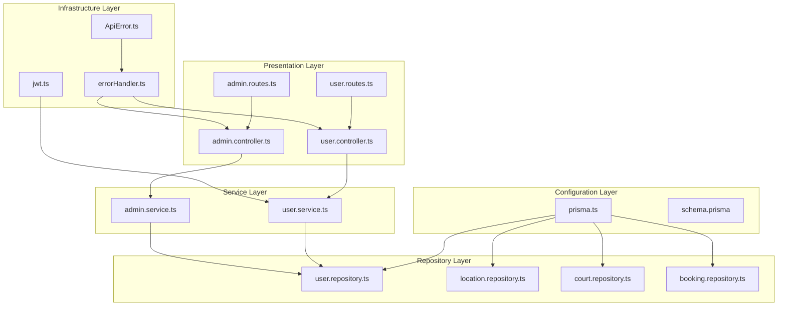

**Diagram sources**
- [prisma.ts:1-10](file://backend/src/config/prisma.ts#L1-L10)
- [user.repository.ts:1-53](file://backend/src/repositories/user.repository.ts#L1-L53)
- [location.repository.ts:1-51](file://backend/src/repositories/location.repository.ts#L1-L51)
- [court.repository.ts:1-83](file://backend/src/repositories/court.repository.ts#L1-L83)
- [booking.repository.ts:1-49](file://backend/src/repositories/booking.repository.ts#L1-L49)
- [user.service.ts:1-69](file://backend/src/services/user.service.ts#L1-L69)
- [admin.service.ts:1-57](file://backend/src/services/admin.service.ts#L1-L57)
- [user.controller.ts:1-14](file://backend/src/controllers/user.controller.ts#L1-L14)
- [admin.controller.ts:1-13](file://backend/src/controllers/admin.controller.ts#L1-L13)
- [user.routes.ts:1-10](file://backend/src/routers/user.routes.ts#L1-L10)
- [admin.routes.ts:1-6](file://backend/src/routers/admin.routes.ts#L1-L6)
- [errorHandler.ts:1-38](file://backend/src/middlewares/errorHandler.ts#L1-L38)
- [ApiError.ts:1-13](file://backend/src/utils/ApiError.ts#L1-L13)
- [jwt.ts:1-13](file://backend/src/utils/jwt.ts#L1-L13)

**Section sources**
- [prisma.ts:1-10](file://backend/src/config/prisma.ts#L1-L10)
- [user.repository.ts:1-53](file://backend/src/repositories/user.repository.ts#L1-L53)
- [location.repository.ts:1-51](file://backend/src/repositories/location.repository.ts#L1-L51)
- [court.repository.ts:1-83](file://backend/src/repositories/court.repository.ts#L1-L83)
- [booking.repository.ts:1-49](file://backend/src/repositories/booking.repository.ts#L1-L49)
- [user.service.ts:1-69](file://backend/src/services/user.service.ts#L1-L69)
- [admin.service.ts:1-57](file://backend/src/services/admin.service.ts#L1-L57)
- [user.controller.ts:1-14](file://backend/src/controllers/user.controller.ts#L1-L14)
- [admin.controller.ts:1-13](file://backend/src/controllers/admin.controller.ts#L1-L13)
- [user.routes.ts:1-10](file://backend/src/routers/user.routes.ts#L1-L10)
- [admin.routes.ts:1-6](file://backend/src/routers/admin.routes.ts#L1-L6)
- [errorHandler.ts:1-38](file://backend/src/middlewares/errorHandler.ts#L1-L38)
- [ApiError.ts:1-13](file://backend/src/utils/ApiError.ts#L1-L13)
- [jwt.ts:1-13](file://backend/src/utils/jwt.ts#L1-L13)

## Performance Considerations
**Optimization Strategies:**
- **Connection Pooling**: Leverage existing PostgreSQL adapter and pool configuration
- **Query Optimization**: Use selective includes and where conditions to prevent N+1 queries
- **Projection Queries**: Implement select projections to limit returned fields
- **Pagination**: Add skip/take parameters to handle large datasets efficiently
- **Indexing**: Ensure frequently queried columns (IDs, emails, phones) are indexed
- **Batch Operations**: Use createMany for bulk inserts where possible
- **Caching Strategy**: Implement caching for read-heavy operations with proper invalidation

**Monitoring Recommendations:**
- Track query execution times and error rates
- Monitor connection pool utilization
- Implement circuit breakers for external dependencies
- Add structured logging for debugging and performance analysis

## Troubleshooting Guide

### Common Error Scenarios and Solutions

**Duplicate Key Errors:**
- **Cause**: Email or phone number already exists
- **Solution**: Global error handler translates PrismaClientKnownRequestError to user-friendly messages
- **Prevention**: Check for existing records before insert operations

**Authentication Failures:**
- **Cause**: Invalid credentials or unhashed passwords
- **Solution**: Password comparison with bcrypt, proper error handling
- **Security**: Never store plaintext passwords

**Authorization Issues:**
- **Cause**: Users accessing resources belonging to other owners
- **Solution**: Nested queries verify ownership before data access
- **Pattern**: Always include owner verification in repository methods

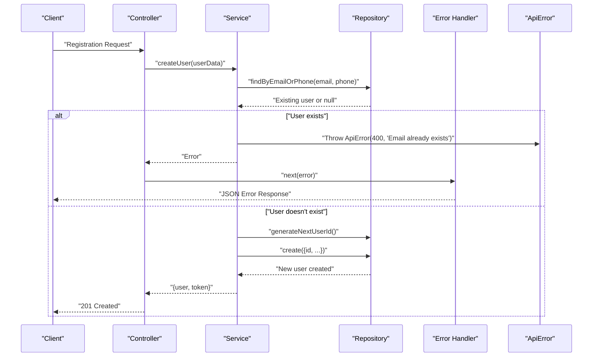

**Diagram sources**
- [user.controller.ts:1-14](file://backend/src/controllers/user.controller.ts#L1-L14)
- [user.service.ts:1-69](file://backend/src/services/user.service.ts#L1-L69)
- [user.repository.ts:1-53](file://backend/src/repositories/user.repository.ts#L1-L53)
- [errorHandler.ts:1-38](file://backend/src/middlewares/errorHandler.ts#L1-L38)
- [ApiError.ts:1-13](file://backend/src/utils/ApiError.ts#L1-L13)

**Section sources**
- [errorHandler.ts:1-38](file://backend/src/middlewares/errorHandler.ts#L1-L38)
- [ApiError.ts:1-13](file://backend/src/utils/ApiError.ts#L1-L13)
- [user.service.ts:1-69](file://backend/src/services/user.service.ts#L1-L69)
- [user.controller.ts:1-14](file://backend/src/controllers/user.controller.ts#L1-L14)

## Conclusion
The data access layer successfully implements a comprehensive repository pattern with four specialized repositories handling distinct domain concerns. The system provides clean separation of concerns, robust error handling, and scalable architecture. Current implementations demonstrate solid foundational patterns with clear room for enhancement in pagination, advanced filtering, and transactional operations. The modular design enables easy extension and maintenance while preserving the clean architecture principles established.

## Appendices

### Example: Repository Extension Patterns
**Pagination Implementation:**
```typescript
// Add to existing repository methods
async findManyPaginated(skip: number, take: number) {
  return prisma.model.findMany({
    skip,
    take,
    include: { related: true }
  });
}
```

**Advanced Filtering:**
```typescript
// Dynamic filter object pattern
async findByFilters(filters: FilterObject) {
  const whereClause = this.buildWhereClause(filters);
  return prisma.model.findMany({ where: whereClause });
}
```

**Section sources**
- [court.repository.ts:1-83](file://backend/src/repositories/court.repository.ts#L1-L83)
- [location.repository.ts:1-51](file://backend/src/repositories/location.repository.ts#L1-L51)

### Example: Complex Query Implementation
**Multi-level Nested Includes:**
```typescript
// Repository method for comprehensive data retrieval
async getCompleteBookingData(ownerId: string) {
  return prisma.booking.findMany({
    where: { 
      court: { location: { ownerId } }
    },
    include: {
      court: {
        include: {
          location: {
            include: {
              images: true
            }
          },
          reviews: true
        }
      },
      user: true
    },
    orderBy: { date: 'desc' }
  });
}
```

**Section sources**
- [booking.repository.ts:1-49](file://backend/src/repositories/booking.repository.ts#L1-L49)
- [court.repository.ts:1-83](file://backend/src/repositories/court.repository.ts#L1-L83)
- [location.repository.ts:1-51](file://backend/src/repositories/location.repository.ts#L1-L51)

### Transaction Implementation Examples
**Multi-step Operation:**
```typescript
async createBookingWithTransaction(bookingData) {
  return prisma.$transaction(async (tx) => {
    const booking = await tx.booking.create({ data: bookingData });
    await tx.payment.create({ 
      data: { 
        bookingId: booking.id,
        amount: booking.total
      }
    });
    return booking;
  });
}
```

**Section sources**
- [prisma.ts:1-10](file://backend/src/config/prisma.ts#L1-L10)