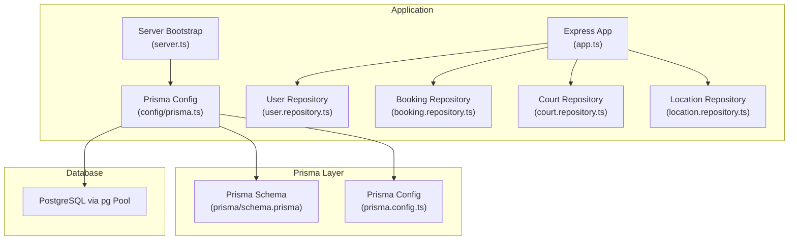
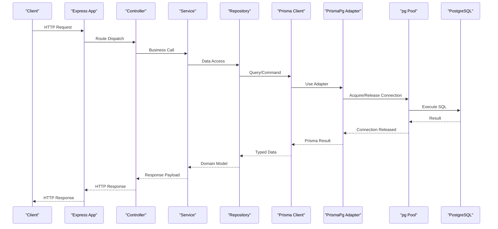
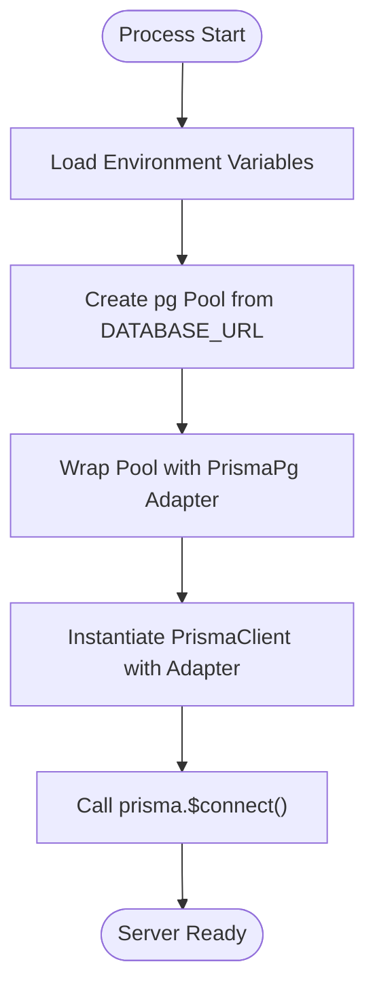
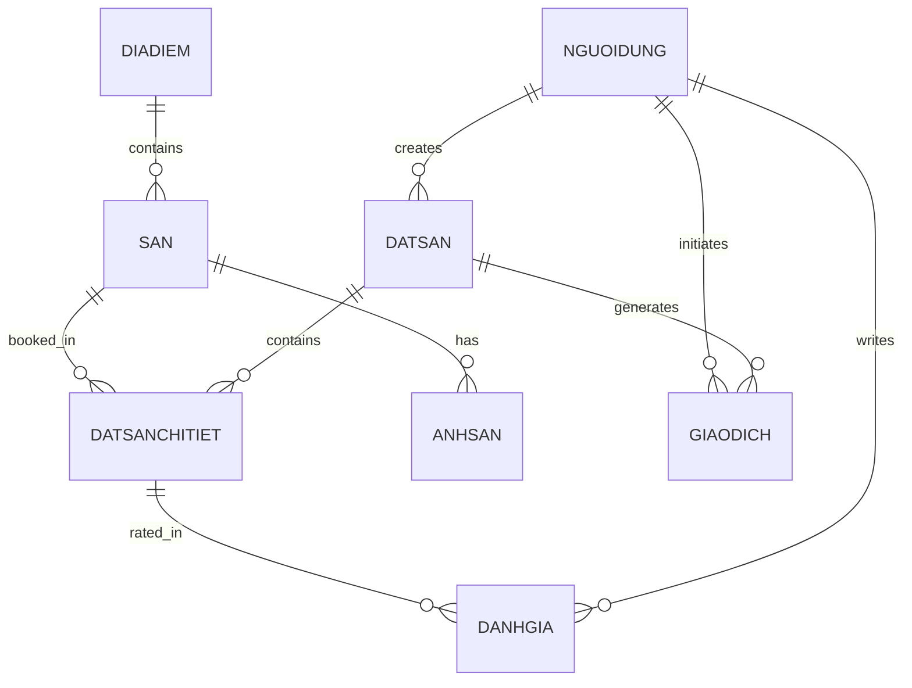
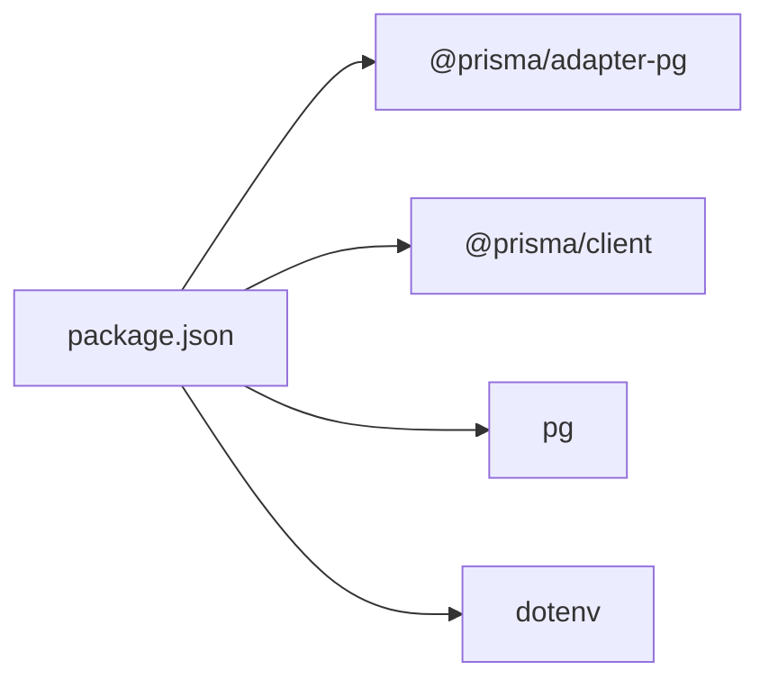

# Database Integration

<cite>
**Referenced Files in This Document**
- [schema.prisma](file://backend/prisma/schema.prisma)
- [prisma.config.ts](file://backend/prisma.config.ts)
- [prisma.ts](file://backend/src/config/prisma.ts)
- [server.ts](file://backend/src/server.ts)
- [app.ts](file://backend/src/app.ts)
- [user.repository.ts](file://backend/src/repositories/user.repository.ts)
- [booking.repository.ts](file://backend/src/repositories/booking.repository.ts)
- [court.repository.ts](file://backend/src/repositories/court.repository.ts)
- [location.repository.ts](file://backend/src/repositories/location.repository.ts)
- [package.json](file://backend/package.json)
</cite>

## Table of Contents
1. [Introduction](#introduction)
2. [Project Structure](#project-structure)
3. [Core Components](#core-components)
4. [Architecture Overview](#architecture-overview)
5. [Detailed Component Analysis](#detailed-component-analysis)
6. [Dependency Analysis](#dependency-analysis)
7. [Performance Considerations](#performance-considerations)
8. [Troubleshooting Guide](#troubleshooting-guide)
9. [Conclusion](#conclusion)
10. [Appendices](#appendices)

## Introduction
This document provides comprehensive database integration documentation for the backend built with Prisma ORM and PostgreSQL. It covers Prisma client setup, connection pooling, migration configuration, schema design, entity relationships, indexing strategies, connection management, query optimization, performance monitoring, seeding, backup, and disaster recovery. It also includes troubleshooting guidance for common database issues.

## Project Structure
The backend integrates Prisma ORM with PostgreSQL via a dedicated adapter and a managed connection pool. The Prisma schema defines the domain model, while the application initializes a single Prisma client instance per process and connects it to the database at startup. Repositories encapsulate data access patterns and leverage Prisma’s type-safe client.

**Diagram sources**
- [server.ts:1-20](file://backend/src/server.ts#L1-L20)
- [prisma.ts:1-10](file://backend/src/config/prisma.ts#L1-L10)
- [prisma.config.ts:1-15](file://backend/prisma.config.ts#L1-L15)
- [schema.prisma:1-126](file://backend/prisma/schema.prisma#L1-L126)

**Section sources**
- [server.ts:1-20](file://backend/src/server.ts#L1-L20)
- [prisma.ts:1-10](file://backend/src/config/prisma.ts#L1-L10)
- [prisma.config.ts:1-15](file://backend/prisma.config.ts#L1-L15)
- [schema.prisma:1-126](file://backend/prisma/schema.prisma#L1-L126)

## Core Components
- Prisma Client and Adapter: The application creates a Prisma client backed by the PrismaPg adapter and a Node.js pg connection pool initialized from DATABASE_URL. This ensures efficient connection reuse and robust database connectivity.
- Connection Lifecycle: The server attempts to connect to the database during startup and logs success or failure. The Prisma client remains connected for the lifetime of the process.
- Repositories: Data access is centralized in repositories that use Prisma queries and relations. They encapsulate CRUD operations and composite queries with includes and filters.

Key implementation references:
- Prisma client initialization and adapter usage: [prisma.ts:6-8](file://backend/src/config/prisma.ts#L6-L8)
- Server-side connection on startup: [server.ts:8](file://backend/src/server.ts#L8)
- Repository usage examples:
  - User repository: [user.repository.ts:1](file://backend/src/repositories/user.repository.ts#L1)
  - Booking repository: [booking.repository.ts:1](file://backend/src/repositories/booking.repository.ts#L1)
  - Court repository: [court.repository.ts:1](file://backend/src/repositories/court.repository.ts#L1)
  - Location repository: [location.repository.ts:1](file://backend/src/repositories/location.repository.ts#L1)

**Section sources**
- [prisma.ts:1-10](file://backend/src/config/prisma.ts#L1-L10)
- [server.ts:1-20](file://backend/src/server.ts#L1-L20)
- [user.repository.ts:1-53](file://backend/src/repositories/user.repository.ts#L1-L53)
- [booking.repository.ts:1-49](file://backend/src/repositories/booking.repository.ts#L1-L49)
- [court.repository.ts:1-83](file://backend/src/repositories/court.repository.ts#L1-L83)
- [location.repository.ts:1-51](file://backend/src/repositories/location.repository.ts#L1-L51)

## Architecture Overview
The database integration follows a layered architecture:
- Express app registers routes and middleware.
- Controllers delegate work to services.
- Services use repositories for data access.
- Repositories interact with the Prisma client.
- Prisma client uses the PrismaPg adapter backed by a pg connection pool.

**Diagram sources**
- [app.ts:1-21](file://backend/src/app.ts#L1-L21)
- [prisma.ts:1-10](file://backend/src/config/prisma.ts#L1-L10)
- [server.ts:1-20](file://backend/src/server.ts#L1-L20)

## Detailed Component Analysis

### Prisma Client Setup and Connection Pooling
- Initialization: A pg Pool is created from DATABASE_URL, then wrapped by PrismaPg adapter, and finally passed to PrismaClient. This enables connection pooling and efficient resource usage.
- Startup Connection: The server calls prisma.$connect() at startup to validate connectivity before serving requests.
- Environment: DATABASE_URL is loaded from environment variables via dotenv.

Implementation references:
- Pool and adapter creation: [prisma.ts:6-7](file://backend/src/config/prisma.ts#L6-L7)
- Prisma client instantiation: [prisma.ts:8](file://backend/src/config/prisma.ts#L8)
- Startup connection: [server.ts:8](file://backend/src/server.ts#L8)

**Diagram sources**
- [prisma.ts:1-10](file://backend/src/config/prisma.ts#L1-L10)
- [server.ts:1-20](file://backend/src/server.ts#L1-L20)

**Section sources**
- [prisma.ts:1-10](file://backend/src/config/prisma.ts#L1-L10)
- [server.ts:1-20](file://backend/src/server.ts#L1-L20)

### Database Schema Design and Entity Relationships
The schema defines core entities and their relationships:
- Entities: nguoidung (users), diadiem (locations), san (courts), datsan (bookings), datsanchitiet (booking details), danhgia (reviews), giaodich (transactions), anhsan (court images).
- Relationships:
  - One-to-many: nguoidung → datsan, datsan → datsanchitiet, diadiem → san, san → datsanchitiet, san → anhsan, nguoidung → danhgia, datsan → giaodich, nguoidung → giaodich.
  - Many-to-one: datsanchitiet → datsan, datsanchitiet → san, anhsan → san, danhgia → nguoidung, danhgia → datsanchitiet, giaodich → datsan, giaodich → nguoidung.
- Indexes and Uniques:
  - Unique constraints on email, so_dien_thoai, ma_google, and ma_gd_vnpay.
  - Additional unique constraint on ma_giao_dich.
  - Default timestamps and enums are defined for auditability and status tracking.

Entity relationship diagram:

**Diagram sources**
- [schema.prisma:10-126](file://backend/prisma/schema.prisma#L10-L126)

Schema highlights and implications:
- Identity generation: Several entities use custom ID prefixes (e.g., U, S, DD, D) with numeric suffixes. Repositories implement helpers to generate the next ID based on the latest record.
- Timestamps: Many entities include creation timestamps with defaults set to current time.
- Status fields: Enum-like strings represent statuses (e.g., booking status, transaction status), enabling simple filtering and reporting.

**Section sources**
- [schema.prisma:10-126](file://backend/prisma/schema.prisma#L10-L126)
- [user.repository.ts:36-49](file://backend/src/repositories/user.repository.ts#L36-L49)
- [court.repository.ts:66-79](file://backend/src/repositories/court.repository.ts#L66-L79)
- [location.repository.ts:34-47](file://backend/src/repositories/location.repository.ts#L34-L47)

### Migration Strategies
- Prisma configuration: The prisma.config.ts file specifies the schema path and migrations directory, and reads the datasource URL from environment variables.
- Migration execution: Migrations are typically applied via Prisma CLI commands (e.g., prisma migrate dev or prisma migrate deploy). The configuration ensures migrations are stored under prisma/migrations and use the configured datasource URL.

Migration configuration references:
- Prisma config definition: [prisma.config.ts:6-14](file://backend/prisma.config.ts#L6-L14)
- Prisma schema reference: [prisma.config.ts:7](file://backend/prisma.config.ts#L7)

Notes:
- The schema contains comments indicating that certain tables require additional setup for check constraints during migrations. Consult Prisma’s documentation for advanced constraint handling.

**Section sources**
- [prisma.config.ts:1-15](file://backend/prisma.config.ts#L1-L15)
- [schema.prisma:19,30,72,91,113:19-19](file://backend/prisma/schema.prisma#L19-L19)
- [schema.prisma:30,72,91,113:30-30](file://backend/prisma/schema.prisma#L30-L30)

### Query Patterns and Optimization
Repositories demonstrate typical query patterns:
- Find by ID or unique fields: UserRepository uses findUnique/findFirst for identity resolution.
- Composite includes: BookingRepository and CourtRepository include related entities (e.g., san, nguoidung, danhgia) to reduce round-trips.
- Filtering and ordering: Queries filter by foreign keys and order by date fields for chronological listings.
- Bulk operations: CourtRepository supports bulk creation of images.

Optimization recommendations:
- Add indexes on frequently filtered columns (e.g., ma_nguoi_dung on related tables) to improve join performance.
- Use select projections to limit returned fields when full objects are unnecessary.
- Prefer pagination for large lists (skip/take) to avoid heavy result sets.
- Monitor slow queries using database logs and Prisma’s query logging capabilities.

Repository references:
- User repository: [user.repository.ts:4-20](file://backend/src/repositories/user.repository.ts#L4-L20)
- Booking repository: [booking.repository.ts:4-25](file://backend/src/repositories/booking.repository.ts#L4-L25)
- Court repository: [court.repository.ts:52-64](file://backend/src/repositories/court.repository.ts#L52-L64)
- Location repository: [location.repository.ts:4-15](file://backend/src/repositories/location.repository.ts#L4-L15)

**Section sources**
- [user.repository.ts:1-53](file://backend/src/repositories/user.repository.ts#L1-L53)
- [booking.repository.ts:1-49](file://backend/src/repositories/booking.repository.ts#L1-L49)
- [court.repository.ts:1-83](file://backend/src/repositories/court.repository.ts#L1-L83)
- [location.repository.ts:1-51](file://backend/src/repositories/location.repository.ts#L1-L51)

### Connection Management
- Single client per process: The Prisma client is instantiated once and reused across the application lifecycle.
- Connection lifecycle: The server establishes a connection at startup and keeps it alive for the process duration.
- Pooling: The underlying pg Pool manages connections, enabling concurrency and reducing overhead.

References:
- Client creation: [prisma.ts:8](file://backend/src/config/prisma.ts#L8)
- Startup connection: [server.ts:8](file://backend/src/server.ts#L8)

**Section sources**
- [prisma.ts:1-10](file://backend/src/config/prisma.ts#L1-L10)
- [server.ts:1-20](file://backend/src/server.ts#L1-L20)

### Performance Monitoring
- Enable Prisma query logging in development to inspect generated SQL and identify bottlenecks.
- Use database performance monitoring tools to track slow queries, index usage, and connection saturation.
- Apply pagination and selective field retrieval to reduce payload sizes and memory usage.

[No sources needed since this section provides general guidance]

### Seeding, Backup, and Disaster Recovery
- Seeding: Seed data can be inserted programmatically or via Prisma’s seed command if configured. Use repository helpers to maintain consistent ID generation and data integrity.
- Backups: Schedule regular logical backups of the PostgreSQL database. Ensure backups capture all relevant schemas and data.
- Disaster Recovery: Test restoration procedures regularly. Maintain offsite backups and document recovery steps for database restoration and service restart.

[No sources needed since this section provides general guidance]

## Dependency Analysis
External dependencies relevant to database integration:
- @prisma/adapter-pg: Bridges Prisma to PostgreSQL via the pg driver.
- @prisma/client: Generated Prisma client used by repositories.
- pg: PostgreSQL driver providing the connection pool.
- dotenv: Loads DATABASE_URL from environment variables.

Dependency references:
- Dependencies: [package.json:14-27](file://backend/package.json#L14-L27)

**Diagram sources**
- [package.json:14-27](file://backend/package.json#L14-L27)

**Section sources**
- [package.json:14-27](file://backend/package.json#L14-L27)

## Performance Considerations
- Connection pooling: Ensure the pool size matches expected concurrency. Monitor pool utilization and adjust as needed.
- Query efficiency: Use includes judiciously; prefer targeted selects and joins to minimize data transfer.
- Indexing: Add appropriate indexes on foreign keys and frequently queried columns to speed up joins and filters.
- Caching: Consider caching read-heavy, static data to reduce database load.
- Logging: Enable query logging in development to identify N+1 queries and inefficient filters.

[No sources needed since this section provides general guidance]

## Troubleshooting Guide
Common issues and resolutions:
- Connection failures at startup:
  - Verify DATABASE_URL format and accessibility from the runtime environment.
  - Confirm the database server is reachable and accepts connections.
  - Check Prisma client initialization and adapter wiring.
  - Reference: [server.ts:8](file://backend/src/server.ts#L8), [prisma.ts:6-8](file://backend/src/config/prisma.ts#L6-L8)
- Migration errors:
  - Review Prisma config for correct schema and datasource URL.
  - Address check constraint warnings indicated in the schema comments.
  - Reference: [prisma.config.ts:6-14](file://backend/prisma.config.ts#L6-L14), [schema.prisma:19,30,72,91,113:19-19](file://backend/prisma/schema.prisma#L19-L19)
- Slow queries:
  - Inspect generated SQL via Prisma logs.
  - Add missing indexes on join and filter columns.
  - Reduce included relations where not necessary.
  - References: [booking.repository.ts:13-20](file://backend/src/repositories/booking.repository.ts#L13-L20), [court.repository.ts:52-64](file://backend/src/repositories/court.repository.ts#L52-L64)
- ID generation anomalies:
  - Ensure repository ID helpers are invoked consistently for new records.
  - Validate ID prefixes and numeric padding logic.
  - References: [user.repository.ts:36-49](file://backend/src/repositories/user.repository.ts#L36-L49), [court.repository.ts:66-79](file://backend/src/repositories/court.repository.ts#L66-L79), [location.repository.ts:34-47](file://backend/src/repositories/location.repository.ts#L34-L47)

**Section sources**
- [server.ts:1-20](file://backend/src/server.ts#L1-L20)
- [prisma.ts:1-10](file://backend/src/config/prisma.ts#L1-L10)
- [prisma.config.ts:1-15](file://backend/prisma.config.ts#L1-L15)
- [schema.prisma:19,30,72,91,113:19-19](file://backend/prisma/schema.prisma#L19-L19)
- [booking.repository.ts:1-49](file://backend/src/repositories/booking.repository.ts#L1-L49)
- [court.repository.ts:1-83](file://backend/src/repositories/court.repository.ts#L1-L83)
- [location.repository.ts:1-51](file://backend/src/repositories/location.repository.ts#L1-L51)
- [user.repository.ts:1-53](file://backend/src/repositories/user.repository.ts#L1-L53)

## Conclusion
The backend employs a clean, scalable database integration using Prisma ORM with PostgreSQL. The setup leverages a connection pool via PrismaPg, centralizes data access in repositories, and provides a clear path for migrations, monitoring, and operational tasks. By applying the recommended indexing, query optimization, and operational practices, the system can achieve reliable performance and maintainability.

[No sources needed since this section summarizes without analyzing specific files]

## Appendices
- Environment variable requirements:
  - DATABASE_URL: Points to the PostgreSQL database endpoint.
  - PORT: Optional server port override.
- Prisma client generation:
  - The generator directive in the schema outputs the Prisma client to the specified path.

**Section sources**
- [schema.prisma:1-4](file://backend/prisma/schema.prisma#L1-L4)
- [prisma.ts:1](file://backend/src/config/prisma.ts#L1)