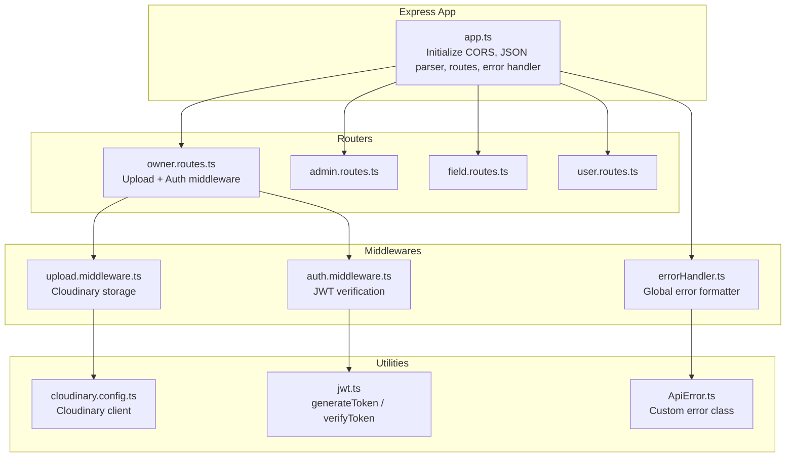
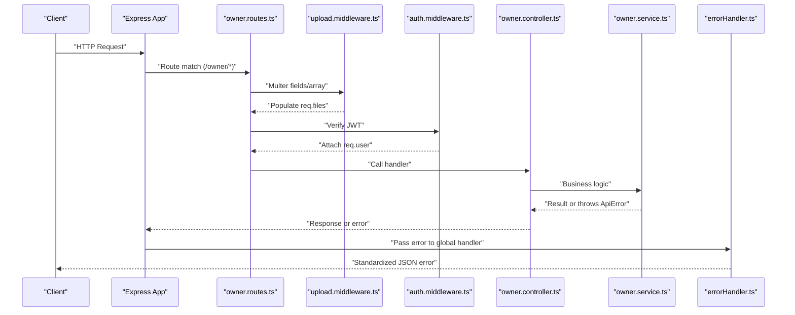
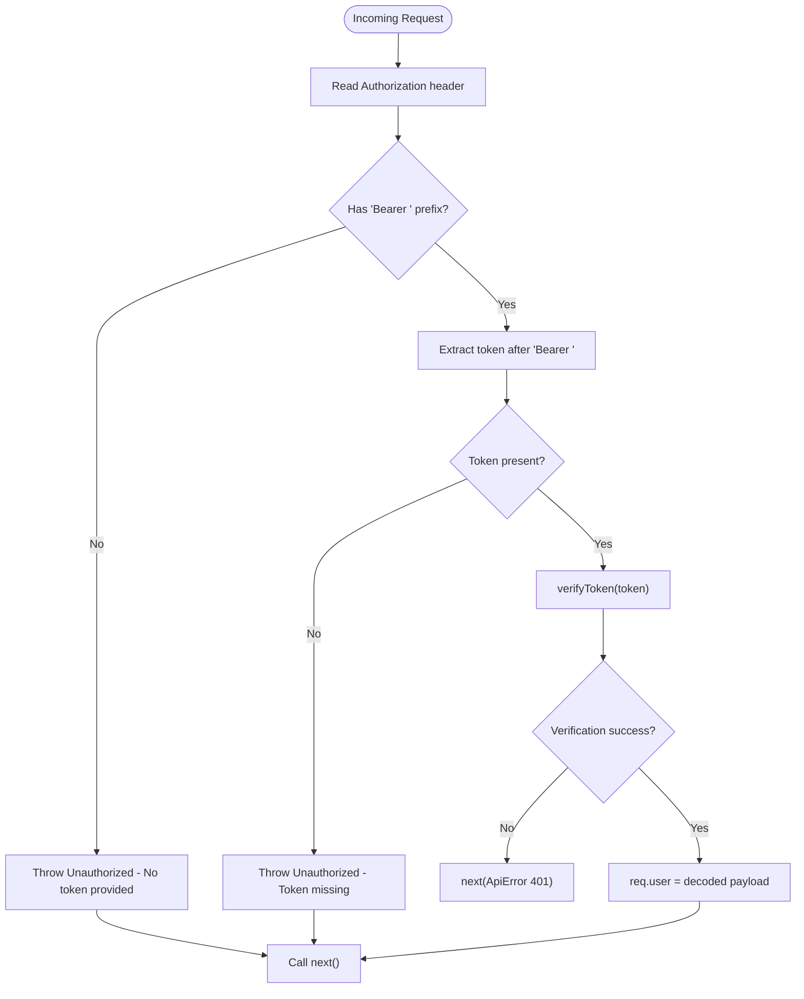
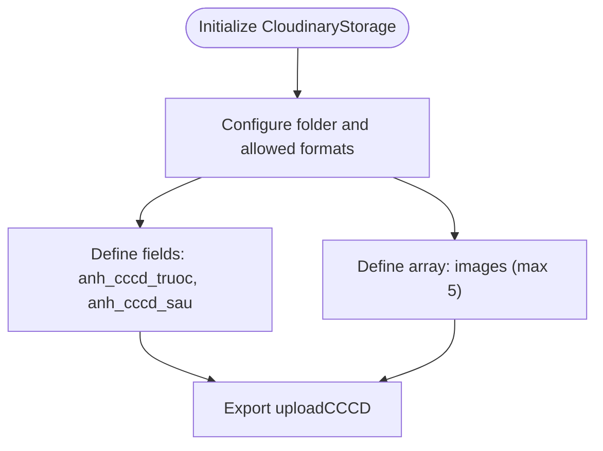
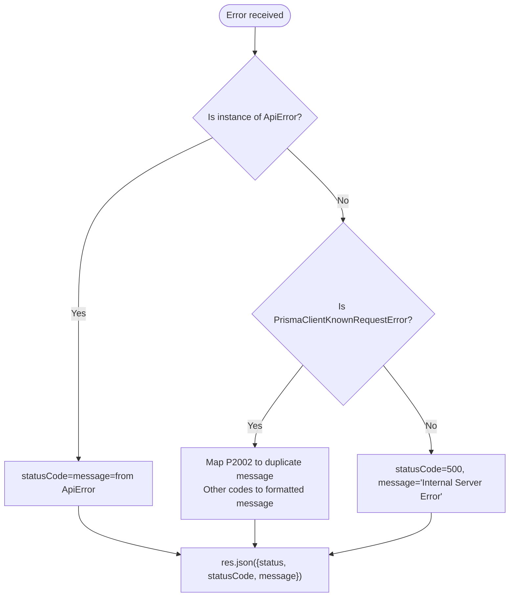
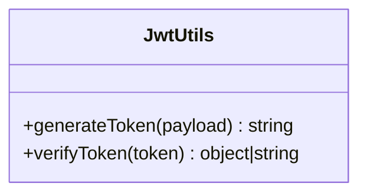
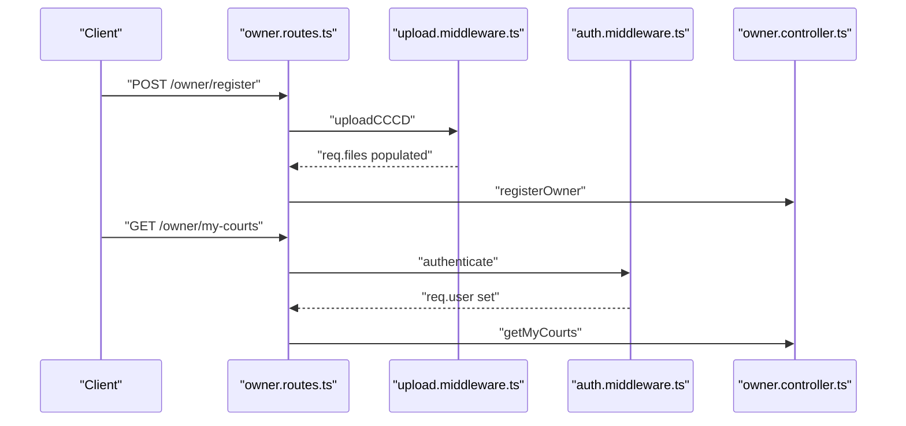
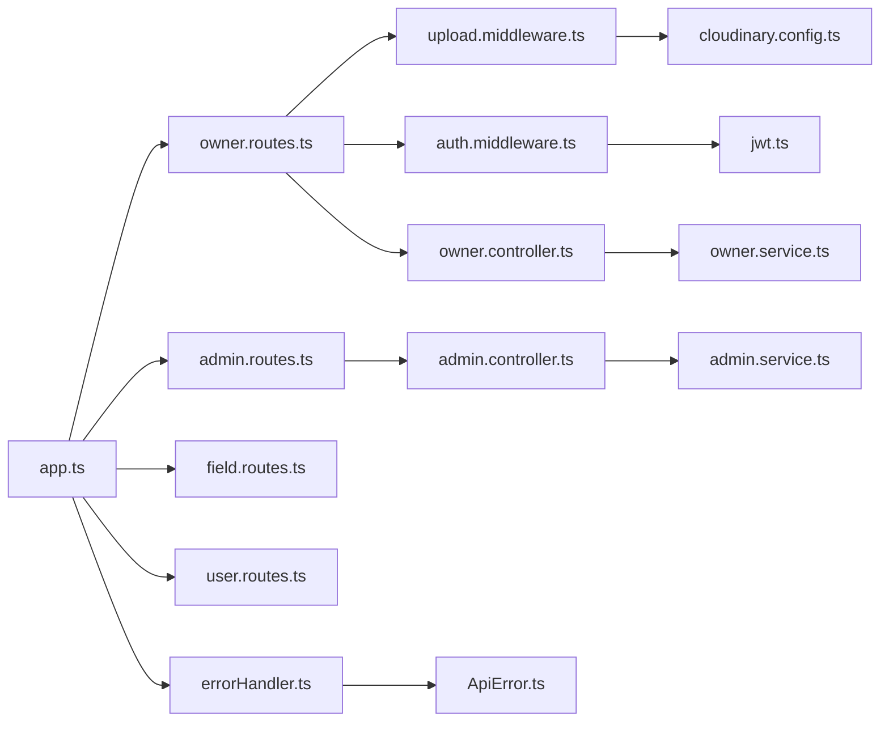

# Middleware Layer

<cite>
**Referenced Files in This Document**
- [auth.middleware.ts](file://backend/src/middlewares/auth.middleware.ts)
- [errorHandler.ts](file://backend/src/middlewares/errorHandler.ts)
- [upload.middleware.ts](file://backend/src/middlewares/upload.middleware.ts)
- [jwt.ts](file://backend/src/utils/jwt.ts)
- [ApiError.ts](file://backend/src/utils/ApiError.ts)
- [cloudinary.config.ts](file://backend/src/config/cloudinary.config.ts)
- [app.ts](file://backend/src/app.ts)
- [server.ts](file://backend/src/server.ts)
- [owner.routes.ts](file://backend/src/routers/owner.routes.ts)
- [user.routes.ts](file://backend/src/routers/user.routes.ts)
- [admin.routes.ts](file://backend/src/routers/admin.routes.ts)
- [field.routes.ts](file://backend/src/routers/field.routes.ts)
- [owner.controller.ts](file://backend/src/controllers/owner.controller.ts)
- [admin.controller.ts](file://backend/src/controllers/admin.controller.ts)
- [owner.service.ts](file://backend/src/services/owner.service.ts)
- [admin.service.ts](file://backend/src/services/admin.service.ts)
</cite>

## Table of Contents
1. [Introduction](#introduction)
2. [Project Structure](#project-structure)
3. [Core Components](#core-components)
4. [Architecture Overview](#architecture-overview)
5. [Detailed Component Analysis](#detailed-component-analysis)
6. [Dependency Analysis](#dependency-analysis)
7. [Performance Considerations](#performance-considerations)
8. [Troubleshooting Guide](#troubleshooting-guide)
9. [Conclusion](#conclusion)
10. [Appendices](#appendices)

## Introduction
This document explains the middleware layer of the backend application, focusing on the request processing pipeline. It covers:
- Authentication middleware and JWT token verification
- Role-based access control patterns
- Error handling middleware and custom error types
- File upload middleware with Cloudinary integration
- Middleware ordering, request/response transformation, and security considerations
- Examples for creating custom middleware and debugging techniques

## Project Structure
The middleware layer is organized under the middlewares directory and integrated into the Express application via routes and global error handling. The application initializes CORS, JSON parsing, routes, and the global error handler.

**Diagram sources**
- [app.ts:1-21](file://backend/src/app.ts#L1-L21)
- [owner.routes.ts:1-23](file://backend/src/routers/owner.routes.ts#L1-L23)
- [admin.routes.ts:1-6](file://backend/src/routers/admin.routes.ts#L1-L6)
- [field.routes.ts:1-5](file://backend/src/routers/field.routes.ts#L1-L5)
- [user.routes.ts:1-10](file://backend/src/routers/user.routes.ts#L1-L10)
- [auth.middleware.ts:1-28](file://backend/src/middlewares/auth.middleware.ts#L1-L28)
- [upload.middleware.ts:1-19](file://backend/src/middlewares/upload.middleware.ts#L1-L19)
- [errorHandler.ts:1-38](file://backend/src/middlewares/errorHandler.ts#L1-L38)
- [jwt.ts:1-13](file://backend/src/utils/jwt.ts#L1-L13)
- [ApiError.ts:1-13](file://backend/src/utils/ApiError.ts#L1-L13)
- [cloudinary.config.ts:1-13](file://backend/src/config/cloudinary.config.ts#L1-L13)

**Section sources**
- [app.ts:1-21](file://backend/src/app.ts#L1-L21)
- [owner.routes.ts:1-23](file://backend/src/routers/owner.routes.ts#L1-L23)
- [admin.routes.ts:1-6](file://backend/src/routers/admin.routes.ts#L1-L6)
- [field.routes.ts:1-5](file://backend/src/routers/field.routes.ts#L1-L5)
- [user.routes.ts:1-10](file://backend/src/routers/user.routes.ts#L1-L10)

## Core Components
- Authentication middleware: Validates Authorization header, extracts Bearer token, verifies JWT, and attaches user payload to the request.
- Upload middleware: Configures Cloudinary-backed storage for image uploads with allowed formats and field-specific rules.
- Error handling middleware: Converts errors into standardized JSON responses, handling custom ApiError instances and specific Prisma errors.
- Utilities: JWT helpers for signing and verifying tokens; custom ApiError class for typed error responses.

Key responsibilities:
- Enforce authentication and attach identity to requests
- Validate and transform multipart/form-data uploads
- Normalize error responses across the API
- Provide reusable JWT utilities

**Section sources**
- [auth.middleware.ts:1-28](file://backend/src/middlewares/auth.middleware.ts#L1-L28)
- [upload.middleware.ts:1-19](file://backend/src/middlewares/upload.middleware.ts#L1-L19)
- [errorHandler.ts:1-38](file://backend/src/middlewares/errorHandler.ts#L1-L38)
- [jwt.ts:1-13](file://backend/src/utils/jwt.ts#L1-L13)
- [ApiError.ts:1-13](file://backend/src/utils/ApiError.ts#L1-L13)

## Architecture Overview
The middleware layer participates in the request lifecycle as follows:
- Express app registers global middleware (CORS, JSON parser, routes, error handler)
- Route-level middleware (authentication and upload) wrap controller handlers
- Controllers delegate to services; services interact with repositories and the database
- Errors bubble up to the global error handler for consistent formatting

**Diagram sources**
- [app.ts:1-21](file://backend/src/app.ts#L1-L21)
- [owner.routes.ts:1-23](file://backend/src/routers/owner.routes.ts#L1-L23)
- [upload.middleware.ts:1-19](file://backend/src/middlewares/upload.middleware.ts#L1-L19)
- [auth.middleware.ts:1-28](file://backend/src/middlewares/auth.middleware.ts#L1-L28)
- [owner.controller.ts:1-110](file://backend/src/controllers/owner.controller.ts#L1-L110)
- [owner.service.ts:1-148](file://backend/src/services/owner.service.ts#L1-L148)
- [errorHandler.ts:1-38](file://backend/src/middlewares/errorHandler.ts#L1-L38)

## Detailed Component Analysis

### Authentication Middleware
Purpose:
- Extracts Authorization header, validates Bearer token presence, verifies JWT, and attaches decoded user payload to the request object.

Processing logic:
- Reads Authorization header; rejects if missing or not prefixed with Bearer
- Splits token from header; rejects if empty
- Verifies token using JWT secret; on success, attaches user to request and continues; otherwise forwards an unauthorized error

Security considerations:
- Enforces Bearer token presence and format
- Relies on centralized JWT secret and expiration
- Attaches user identity for downstream authorization checks

Role-based access control:
- The attached user payload includes role information used by controllers to enforce permissions

**Diagram sources**
- [auth.middleware.ts:9-27](file://backend/src/middlewares/auth.middleware.ts#L9-L27)
- [jwt.ts:10-12](file://backend/src/utils/jwt.ts#L10-L12)
- [ApiError.ts:1-13](file://backend/src/utils/ApiError.ts#L1-L13)

**Section sources**
- [auth.middleware.ts:1-28](file://backend/src/middlewares/auth.middleware.ts#L1-L28)
- [jwt.ts:1-13](file://backend/src/utils/jwt.ts#L1-L13)
- [ApiError.ts:1-13](file://backend/src/utils/ApiError.ts#L1-L13)

### Upload Middleware (Cloudinary Integration)
Purpose:
- Configure Cloudinary-backed storage for image uploads with allowed formats and field-specific rules
- Support multiple fields for owner registration and array uploads for court images

Implementation highlights:
- Uses CloudinaryStorage with configured folder and allowed formats
- Defines named fields for front/back of ID card
- Defines array for multiple court images

Validation rules:
- Allowed formats: jpg, jpeg, png, webp
- Field counts enforced per route binding

**Diagram sources**
- [upload.middleware.ts:5-18](file://backend/src/middlewares/upload.middleware.ts#L5-L18)
- [cloudinary.config.ts:6-10](file://backend/src/config/cloudinary.config.ts#L6-L10)

**Section sources**
- [upload.middleware.ts:1-19](file://backend/src/middlewares/upload.middleware.ts#L1-L19)
- [cloudinary.config.ts:1-13](file://backend/src/config/cloudinary.config.ts#L1-L13)

### Error Handling Middleware
Purpose:
- Convert thrown errors into standardized JSON responses
- Distinguish between custom ApiError instances and Prisma errors
- Log unexpected server errors

Behavior:
- Defaults to internal server error
- If error is ApiError, use its status and message
- If Prisma known request error:
  - Duplicate key error mapped to user-friendly message
  - Other Prisma errors formatted with code and last message line
- Logs errors to console for debugging

**Diagram sources**
- [errorHandler.ts:4-37](file://backend/src/middlewares/errorHandler.ts#L4-L37)
- [ApiError.ts:1-13](file://backend/src/utils/ApiError.ts#L1-L13)

**Section sources**
- [errorHandler.ts:1-38](file://backend/src/middlewares/errorHandler.ts#L1-L38)
- [ApiError.ts:1-13](file://backend/src/utils/ApiError.ts#L1-L13)

### JWT Utilities
Purpose:
- Provide token generation and verification using a secret and expiration
- Centralize JWT configuration for reuse across authentication and token issuance

**Diagram sources**
- [jwt.ts:6-12](file://backend/src/utils/jwt.ts#L6-L12)

**Section sources**
- [jwt.ts:1-13](file://backend/src/utils/jwt.ts#L1-L13)

### Route-Level Middleware Integration
- Owner routes demonstrate:
  - Upload middleware applied to registration and add-court endpoints
  - Authentication middleware applied to protected endpoints
  - Controllers consume req.user and req.files to implement business logic

**Diagram sources**
- [owner.routes.ts:15-20](file://backend/src/routers/owner.routes.ts#L15-L20)
- [upload.middleware.ts:13-18](file://backend/src/middlewares/upload.middleware.ts#L13-L18)
- [auth.middleware.ts:9-27](file://backend/src/middlewares/auth.middleware.ts#L9-L27)
- [owner.controller.ts:6-40](file://backend/src/controllers/owner.controller.ts#L6-L40)

**Section sources**
- [owner.routes.ts:1-23](file://backend/src/routers/owner.routes.ts#L1-L23)
- [owner.controller.ts:1-110](file://backend/src/controllers/owner.controller.ts#L1-L110)

## Dependency Analysis
- app.ts registers global middleware and routes; error handler is registered globally
- owner.routes.ts composes middleware per endpoint: uploadCCCD/uploadCourt for uploads, authenticate for protected endpoints
- auth.middleware.ts depends on jwt.ts for token verification and ApiError.ts for error propagation
- upload.middleware.ts depends on cloudinary.config.ts for Cloudinary client configuration
- controllers depend on services; services depend on repositories and Prisma

**Diagram sources**
- [app.ts:1-21](file://backend/src/app.ts#L1-L21)
- [owner.routes.ts:1-23](file://backend/src/routers/owner.routes.ts#L1-L23)
- [upload.middleware.ts:1-19](file://backend/src/middlewares/upload.middleware.ts#L1-L19)
- [auth.middleware.ts:1-28](file://backend/src/middlewares/auth.middleware.ts#L1-L28)
- [jwt.ts:1-13](file://backend/src/utils/jwt.ts#L1-L13)
- [cloudinary.config.ts:1-13](file://backend/src/config/cloudinary.config.ts#L1-L13)
- [owner.controller.ts:1-110](file://backend/src/controllers/owner.controller.ts#L1-L110)
- [admin.controller.ts:1-13](file://backend/src/controllers/admin.controller.ts#L1-L13)
- [owner.service.ts:1-148](file://backend/src/services/owner.service.ts#L1-L148)
- [admin.service.ts:1-57](file://backend/src/services/admin.service.ts#L1-L57)
- [errorHandler.ts:1-38](file://backend/src/middlewares/errorHandler.ts#L1-L38)
- [ApiError.ts:1-13](file://backend/src/utils/ApiError.ts#L1-L13)

**Section sources**
- [app.ts:1-21](file://backend/src/app.ts#L1-L21)
- [owner.routes.ts:1-23](file://backend/src/routers/owner.routes.ts#L1-L23)
- [errorHandler.ts:1-38](file://backend/src/middlewares/errorHandler.ts#L1-L38)

## Performance Considerations
- JWT verification is lightweight but occurs on every protected request; caching decoded user payloads is generally unnecessary due to short-lived tokens and per-request scope
- Multer with Cloudinary introduces network latency; consider optimizing allowed formats and limiting concurrent uploads
- Global error handler avoids repeated serialization logic and reduces overhead
- Keep middleware order minimal to reduce request processing overhead

## Troubleshooting Guide
Common issues and resolutions:
- Authentication failures:
  - Missing or malformed Authorization header leads to unauthorized errors
  - Invalid/expired token triggers a 401 error forwarded by authentication middleware
- Upload failures:
  - Incorrect field names or exceeding max count cause missing req.files entries
  - Unsupported formats are rejected by Cloudinary storage configuration
- Database errors:
  - Prisma duplicate key errors are normalized to user-friendly messages
  - Unexpected errors are logged with stack traces for debugging

Debugging techniques:
- Inspect req.user and req.files in controllers to confirm middleware behavior
- Add logging around middleware boundaries to trace request flow
- Use the global error handler’s console logs to capture Prisma and server errors

**Section sources**
- [auth.middleware.ts:12-26](file://backend/src/middlewares/auth.middleware.ts#L12-L26)
- [upload.middleware.ts:13-18](file://backend/src/middlewares/upload.middleware.ts#L13-L18)
- [errorHandler.ts:17-30](file://backend/src/middlewares/errorHandler.ts#L17-L30)

## Conclusion
The middleware layer establishes a clean separation of concerns:
- Authentication middleware enforces identity and attaches user context
- Upload middleware standardizes file ingestion with Cloudinary
- Error handling middleware ensures consistent error responses and robust logging
Proper middleware ordering and clear request/response transformations improve maintainability and security.

## Appendices

### Middleware Order Importance
- Global error handler must be registered last to catch errors from all upstream middleware and routes
- Route-level middleware composition determines which handlers receive authenticated or uploaded data
- Authentication should precede business logic to ensure early rejection of invalid requests

**Section sources**
- [app.ts:19](file://backend/src/app.ts#L19)
- [owner.routes.ts:15-20](file://backend/src/routers/owner.routes.ts#L15-L20)

### Request/Response Transformation Examples
- Authentication:
  - Input: Authorization header with Bearer token
  - Output: req.user attached for subsequent handlers
- Upload:
  - Input: multipart/form-data with configured fields
  - Output: req.files populated with Cloudinary URLs and metadata
- Error handling:
  - Input: thrown error (including ApiError and Prisma errors)
  - Output: JSON response with status, statusCode, and message

**Section sources**
- [auth.middleware.ts:9-27](file://backend/src/middlewares/auth.middleware.ts#L9-L27)
- [upload.middleware.ts:13-18](file://backend/src/middlewares/upload.middleware.ts#L13-L18)
- [errorHandler.ts:14-36](file://backend/src/middlewares/errorHandler.ts#L14-L36)

### Creating Custom Middleware
Steps:
- Define a function with signature (req, res, next)
- Perform pre-processing (validation, parsing)
- Call next() to pass control to the next handler or forward errors via next(error)
- Register middleware at the app level or route level depending on scope

Reference points:
- Global registration in app.ts
- Route-level composition in owner.routes.ts

**Section sources**
- [app.ts:19](file://backend/src/app.ts#L19)
- [owner.routes.ts:15-20](file://backend/src/routers/owner.routes.ts#L15-L20)