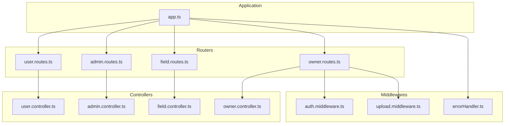
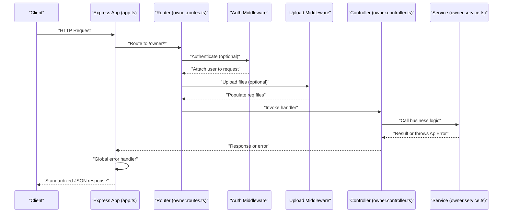
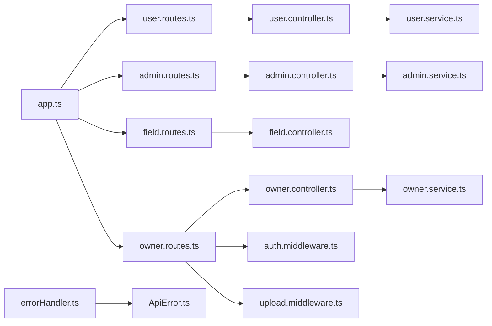

# Routing System

<cite>
**Referenced Files in This Document**
- [app.ts](file://backend/src/app.ts)
- [user.routes.ts](file://backend/src/routers/user.routes.ts)
- [admin.routes.ts](file://backend/src/routers/admin.routes.ts)
- [field.routes.ts](file://backend/src/routers/field.routes.ts)
- [owner.routes.ts](file://backend/src/routers/owner.routes.ts)
- [auth.middleware.ts](file://backend/src/middlewares/auth.middleware.ts)
- [upload.middleware.ts](file://backend/src/middlewares/upload.middleware.ts)
- [errorHandler.ts](file://backend/src/middlewares/errorHandler.ts)
- [user.controller.ts](file://backend/src/controllers/user.controller.ts)
- [admin.controller.ts](file://backend/src/controllers/admin.controller.ts)
- [field.controller.ts](file://backend/src/controllers/field.controller.ts)
- [owner.controller.ts](file://backend/src/controllers/owner.controller.ts)
- [user.service.ts](file://backend/src/services/user.service.ts)
- [admin.service.ts](file://backend/src/services/admin.service.ts)
- [ApiError.ts](file://backend/src/utils/ApiError.ts)
</cite>

## Table of Contents
1. [Introduction](#introduction)
2. [Project Structure](#project-structure)
3. [Core Components](#core-components)
4. [Architecture Overview](#architecture-overview)
5. [Detailed Component Analysis](#detailed-component-analysis)
6. [Dependency Analysis](#dependency-analysis)
7. [Performance Considerations](#performance-considerations)
8. [Troubleshooting Guide](#troubleshooting-guide)
9. [Conclusion](#conclusion)
10. [Appendices](#appendices)

## Introduction
This document describes the routing system for the backend RESTful API. It explains how routes are organized by role (user, admin, field, owner), how middleware is attached, and how requests are validated and handled. It also documents response formatting, error propagation, and conventions for adding new routes while maintaining API consistency.

## Project Structure
The routing system is implemented using Express.js with modular route groups mounted under distinct base paths. Each role has its own router module that defines endpoints and attaches middleware as needed. The central application mounts these routers and registers a global error handler.

**Diagram sources**
- [app.ts:15-19](file://backend/src/app.ts#L15-L19)
- [user.routes.ts:1-10](file://backend/src/routers/user.routes.ts#L1-L10)
- [admin.routes.ts:1-6](file://backend/src/routers/admin.routes.ts#L1-L6)
- [field.routes.ts:1-5](file://backend/src/routers/field.routes.ts#L1-L5)
- [owner.routes.ts:1-23](file://backend/src/routers/owner.routes.ts#L1-L23)
- [auth.middleware.ts:9-27](file://backend/src/middlewares/auth.middleware.ts#L9-L27)
- [upload.middleware.ts:13-18](file://backend/src/middlewares/upload.middleware.ts#L13-L18)
- [errorHandler.ts:5-37](file://backend/src/middlewares/errorHandler.ts#L5-L37)

**Section sources**
- [app.ts:15-19](file://backend/src/app.ts#L15-L19)

## Core Components
- Application bootstrap and middleware pipeline:
  - JSON body parsing and CORS enabled globally.
  - Route groups mounted under /user, /admin, /field, and /owner.
  - Global error handler registered last.

- Modular routers:
  - user.routes.ts: Registration and login endpoints.
  - admin.routes.ts: Listing users and fetching a user by ID.
  - field.routes.ts: Public listing of fields.
  - owner.routes.ts: Owner-specific endpoints with authentication and file upload middleware.

- Middleware:
  - Authentication middleware validates Bearer tokens and attaches user info to the request.
  - Upload middleware integrates Cloudinary via Multer for owner registration and court image uploads.
  - Global error handler normalizes responses and logs unexpected errors.

- Controllers:
  - Implement endpoint logic and delegate to services.
  - Use typed request bodies and parameters where applicable.
  - Propagate errors to the global handler via next().

- Services:
  - Encapsulate business logic and interact with repositories.
  - Throw ApiError for validation and domain errors.

- Error model:
  - ApiError carries HTTP status codes and messages.

**Section sources**
- [app.ts:12-19](file://backend/src/app.ts#L12-L19)
- [user.routes.ts:1-10](file://backend/src/routers/user.routes.ts#L1-L10)
- [admin.routes.ts:1-6](file://backend/src/routers/admin.routes.ts#L1-L6)
- [field.routes.ts:1-5](file://backend/src/routers/field.routes.ts#L1-L5)
- [owner.routes.ts:1-23](file://backend/src/routers/owner.routes.ts#L1-L23)
- [auth.middleware.ts:9-27](file://backend/src/middlewares/auth.middleware.ts#L9-L27)
- [upload.middleware.ts:13-18](file://backend/src/middlewares/upload.middleware.ts#L13-L18)
- [errorHandler.ts:5-37](file://backend/src/middlewares/errorHandler.ts#L5-L37)
- [user.controller.ts:7-13](file://backend/src/controllers/user.controller.ts#L7-L13)
- [admin.controller.ts:4-12](file://backend/src/controllers/admin.controller.ts#L4-L12)
- [field.controller.ts:4-10](file://backend/src/controllers/field.controller.ts#L4-L10)
- [owner.controller.ts:6-40](file://backend/src/controllers/owner.controller.ts#L6-L40)
- [user.service.ts:8-42](file://backend/src/services/user.service.ts#L8-L42)
- [admin.service.ts:7-19](file://backend/src/services/admin.service.ts#L7-L19)
- [ApiError.ts:1-13](file://backend/src/utils/ApiError.ts#L1-L13)

## Architecture Overview
The routing architecture follows a layered pattern:
- app.ts configures the Express app, mounts routers, and registers the error handler.
- Each router module defines endpoints and attaches middleware specific to that role.
- Controllers handle request processing and call services.
- Services encapsulate business logic and may throw ApiError for controlled failures.
- The global error handler converts errors into standardized JSON responses.

**Diagram sources**
- [app.ts:15-19](file://backend/src/app.ts#L15-L19)
- [owner.routes.ts:15-20](file://backend/src/routers/owner.routes.ts#L15-L20)
- [auth.middleware.ts:9-27](file://backend/src/middlewares/auth.middleware.ts#L9-L27)
- [upload.middleware.ts:13-18](file://backend/src/middlewares/upload.middleware.ts#L13-L18)
- [owner.controller.ts:6-40](file://backend/src/controllers/owner.controller.ts#L6-L40)
- [errorHandler.ts:5-37](file://backend/src/middlewares/errorHandler.ts#L5-L37)

## Detailed Component Analysis

### Route Grouping by Role
- User group (/user):
  - Endpoints: POST /register, POST /login.
  - Purpose: Client-side user registration and authentication.
  - Security: No authentication middleware attached at the route level.

- Admin group (/admin):
  - Endpoints: GET /, GET /:id.
  - Purpose: Admin-only user listing and retrieval by ID.
  - Security: No authentication middleware attached at the route level.

- Field group (/field):
  - Endpoints: GET /.
  - Purpose: Public listing of fields.
  - Security: No authentication middleware attached at the route level.

- Owner group (/owner):
  - Endpoints: POST /register, GET /my-courts, POST /add-court, PUT /update-court/:ma_san, GET /my-bookings, PATCH /update-booking-status/:id.
  - Purpose: Owner self-registration, managing courts, viewing and updating bookings.
  - Security: Authentication middleware applied to owner-only endpoints; file upload middleware for registration and court creation.

**Section sources**
- [user.routes.ts:7-8](file://backend/src/routers/user.routes.ts#L7-L8)
- [admin.routes.ts:4-5](file://backend/src/routers/admin.routes.ts#L4-L5)
- [field.routes.ts:4](file://backend/src/routers/field.routes.ts#L4)
- [owner.routes.ts:15-20](file://backend/src/routers/owner.routes.ts#L15-L20)

### Route Parameter Handling and Query String Processing
- Path parameters:
  - Admin: GET /:id extracts user identifier from path.
  - Owner: PUT /update-court/:ma_san and PATCH /update-booking-status/:id extract identifiers from path.
- Query strings:
  - None of the current routes use query parameters. If needed in the future, define explicit extraction and validation in controllers.

Implementation references:
- Admin user by ID: [admin.controller.ts:9-12](file://backend/src/controllers/admin.controller.ts#L9-L12)
- Owner update court: [owner.controller.ts:67-82](file://backend/src/controllers/owner.controller.ts#L67-L82)
- Owner update booking status: [owner.controller.ts:94-109](file://backend/src/controllers/owner.controller.ts#L94-L109)

**Section sources**
- [admin.controller.ts:9-12](file://backend/src/controllers/admin.controller.ts#L9-L12)
- [owner.controller.ts:67-82](file://backend/src/controllers/owner.controller.ts#L67-L82)
- [owner.controller.ts:94-109](file://backend/src/controllers/owner.controller.ts#L94-L109)

### Request Validation and Body Handling
- Strong typing:
  - Controllers use generic Request types with separate Type Parameters for params, query, and body to enforce shape expectations.
- Validation patterns:
  - Services check for duplicates (email/phone), hash passwords, and generate IDs before persistence.
  - Controllers validate required fields (e.g., images for registration, booking status updates) and throw ApiError for missing data.
- Example validations:
  - User registration: [user.service.ts:8-31](file://backend/src/services/user.service.ts#L8-L31)
  - Owner registration: [owner.controller.ts:15-17](file://backend/src/controllers/owner.controller.ts#L15-L17)
  - Owner update booking status: [owner.controller.ts:100-102](file://backend/src/controllers/owner.controller.ts#L100-L102)

**Section sources**
- [user.service.ts:8-31](file://backend/src/services/user.service.ts#L8-L31)
- [owner.controller.ts:15-17](file://backend/src/controllers/owner.controller.ts#L15-L17)
- [owner.controller.ts:100-102](file://backend/src/controllers/owner.controller.ts#L100-L102)

### HTTP Methods, Status Codes, and Response Formatting
- HTTP methods:
  - POST for creation (/user/register, /owner/register, /owner/add-court).
  - GET for retrieval (/user/login is POST but returns data; admin and field listings use GET).
  - PUT for full updates (/owner/update-court/:ma_san).
  - PATCH for partial updates (/owner/update-booking-status/:id).
- Status codes:
  - 200 OK for successful reads and most updates.
  - 201 Created for successful creations.
  - 400 Bad Request for validation errors and missing data.
  - 401 Unauthorized for invalid or missing tokens.
  - 404 Not Found for missing resources.
  - 500 Internal Server Error for unhandled exceptions.
- Response formatting:
  - Standardized error response with fields: status, statusCode, message.
  - Successful responses vary per endpoint (e.g., lists, single items, or custom success payloads with success flags).

References:
- Error response format: [errorHandler.ts:32-36](file://backend/src/middlewares/errorHandler.ts#L32-L36)
- Success responses: [user.controller.ts:9](file://backend/src/controllers/user.controller.ts#L9), [owner.controller.ts:30-36](file://backend/src/controllers/owner.controller.ts#L30-L36), [owner.controller.ts:46](file://backend/src/controllers/owner.controller.ts#L46), [owner.controller.ts:61](file://backend/src/controllers/owner.controller.ts#L61), [owner.controller.ts:78](file://backend/src/controllers/owner.controller.ts#L78), [owner.controller.ts:88](file://backend/src/controllers/owner.controller.ts#L88), [owner.controller.ts:105](file://backend/src/controllers/owner.controller.ts#L105)

**Section sources**
- [errorHandler.ts:32-36](file://backend/src/middlewares/errorHandler.ts#L32-L36)
- [user.controller.ts:9](file://backend/src/controllers/user.controller.ts#L9)
- [owner.controller.ts:30-36](file://backend/src/controllers/owner.controller.ts#L30-L36)
- [owner.controller.ts:46](file://backend/src/controllers/owner.controller.ts#L46)
- [owner.controller.ts:61](file://backend/src/controllers/owner.controller.ts#L61)
- [owner.controller.ts:78](file://backend/src/controllers/owner.controller.ts#L78)
- [owner.controller.ts:88](file://backend/src/controllers/owner.controller.ts#L88)
- [owner.controller.ts:105](file://backend/src/controllers/owner.controller.ts#L105)

### Route Security and Middleware Attachment
- Authentication:
  - Applied to owner endpoints requiring user context.
  - Validates Authorization header presence and Bearer token validity.
  - Attaches decoded user payload to req.user for downstream handlers.
- Upload:
  - Applied to owner registration and court creation to process multiple files.
  - Integrates with Cloudinary via Multer for secure file ingestion.
- Global error handling:
  - Converts ApiError instances to appropriate HTTP status codes.
  - Normalizes Prisma-related errors to user-friendly messages.

References:
- Authentication middleware: [auth.middleware.ts:9-27](file://backend/src/middlewares/auth.middleware.ts#L9-L27)
- Upload middleware: [upload.middleware.ts:13-18](file://backend/src/middlewares/upload.middleware.ts#L13-L18)
- Owner routes with middleware: [owner.routes.ts:15-20](file://backend/src/routers/owner.routes.ts#L15-L20)
- Error handler: [errorHandler.ts:5-37](file://backend/src/middlewares/errorHandler.ts#L5-L37)

**Section sources**
- [auth.middleware.ts:9-27](file://backend/src/middlewares/auth.middleware.ts#L9-L27)
- [upload.middleware.ts:13-18](file://backend/src/middlewares/upload.middleware.ts#L13-L18)
- [owner.routes.ts:15-20](file://backend/src/routers/owner.routes.ts#L15-L20)
- [errorHandler.ts:5-37](file://backend/src/middlewares/errorHandler.ts#L5-L37)

### Error Propagation and Handling
- Controlled failures:
  - Services and controllers throw ApiError with precise status codes and messages.
- Unhandled exceptions:
  - Logged and converted to 500 responses by the global error handler.
- Prisma-specific handling:
  - Known request errors mapped to 400 with contextual messages (e.g., duplicate key).

References:
- ApiError class: [ApiError.ts:1-13](file://backend/src/utils/ApiError.ts#L1-L13)
- Error handler logic: [errorHandler.ts:14-30](file://backend/src/middlewares/errorHandler.ts#L14-L30)
- Controller throwing ApiError: [owner.controller.ts:16](file://backend/src/controllers/owner.controller.ts#L16), [owner.controller.ts:101](file://backend/src/controllers/owner.controller.ts#L101)

**Section sources**
- [ApiError.ts:1-13](file://backend/src/utils/ApiError.ts#L1-L13)
- [errorHandler.ts:14-30](file://backend/src/middlewares/errorHandler.ts#L14-L30)
- [owner.controller.ts:16](file://backend/src/controllers/owner.controller.ts#L16)
- [owner.controller.ts:101](file://backend/src/controllers/owner.controller.ts#L101)

### Adding New Routes and Maintaining Consistency
- Steps to add a new endpoint:
  - Define the route in the appropriate router module with the correct HTTP verb and path.
  - Attach middleware if required (authentication, uploads).
  - Implement the controller handler with typed request parameters/bodies.
  - Add business logic in the service and throw ApiError for validation failures.
  - Return standardized responses with appropriate status codes.
- Consistency guidelines:
  - Use consistent status codes (200/201/400/401/404/500).
  - Standardize error responses via the global error handler.
  - Keep route paths concise and aligned with REST conventions.
  - Validate inputs early in controllers/services and fail fast.

References for patterns:
- New route in router: [owner.routes.ts:15-20](file://backend/src/routers/owner.routes.ts#L15-L20)
- Controller with typed body: [user.controller.ts:7](file://backend/src/controllers/user.controller.ts#L7)
- Service validation and error throwing: [user.service.ts:14-21](file://backend/src/services/user.service.ts#L14-L21)
- Global error normalization: [errorHandler.ts:32-36](file://backend/src/middlewares/errorHandler.ts#L32-L36)

**Section sources**
- [owner.routes.ts:15-20](file://backend/src/routers/owner.routes.ts#L15-L20)
- [user.controller.ts:7](file://backend/src/controllers/user.controller.ts#L7)
- [user.service.ts:14-21](file://backend/src/services/user.service.ts#L14-L21)
- [errorHandler.ts:32-36](file://backend/src/middlewares/errorHandler.ts#L32-L36)

## Dependency Analysis
The routing system exhibits low coupling and high cohesion:
- Routers depend on controllers and optional middlewares.
- Controllers depend on services and may throw ApiError.
- Services depend on repositories and utilities.
- The global error handler depends on ApiError and Prisma error detection.

**Diagram sources**
- [app.ts:15-19](file://backend/src/app.ts#L15-L19)
- [user.routes.ts:1-10](file://backend/src/routers/user.routes.ts#L1-L10)
- [admin.routes.ts:1-6](file://backend/src/routers/admin.routes.ts#L1-L6)
- [field.routes.ts:1-5](file://backend/src/routers/field.routes.ts#L1-L5)
- [owner.routes.ts:1-23](file://backend/src/routers/owner.routes.ts#L1-L23)
- [user.controller.ts:1-14](file://backend/src/controllers/user.controller.ts#L1-L14)
- [admin.controller.ts:1-13](file://backend/src/controllers/admin.controller.ts#L1-L13)
- [field.controller.ts:1-11](file://backend/src/controllers/field.controller.ts#L1-L11)
- [owner.controller.ts:1-110](file://backend/src/controllers/owner.controller.ts#L1-L110)
- [auth.middleware.ts:1-28](file://backend/src/middlewares/auth.middleware.ts#L1-L28)
- [upload.middleware.ts:1-19](file://backend/src/middlewares/upload.middleware.ts#L1-L19)
- [user.service.ts:1-69](file://backend/src/services/user.service.ts#L1-L69)
- [admin.service.ts:1-57](file://backend/src/services/admin.service.ts#L1-L57)
- [errorHandler.ts:1-38](file://backend/src/middlewares/errorHandler.ts#L1-L38)
- [ApiError.ts:1-13](file://backend/src/utils/ApiError.ts#L1-L13)

**Section sources**
- [app.ts:15-19](file://backend/src/app.ts#L15-L19)
- [owner.routes.ts:15-20](file://backend/src/routers/owner.routes.ts#L15-L20)
- [errorHandler.ts:5-37](file://backend/src/middlewares/errorHandler.ts#L5-L37)

## Performance Considerations
- Middleware ordering matters: Place lightweight checks before heavier ones (e.g., avoid expensive operations before authentication).
- Limit payload sizes and enable compression if needed.
- Use pagination for list endpoints to reduce response sizes.
- Centralize error logging and avoid excessive console output in production.

## Troubleshooting Guide
- Authentication failures:
  - Ensure Authorization header is present and starts with Bearer.
  - Verify token validity and expiration.
  - Confirm user exists and is authorized for the requested resource.
- Upload failures:
  - Verify file fields match expected names and counts.
  - Check Cloudinary configuration and permissions.
- Validation errors:
  - Review ApiError messages returned by services and controllers.
  - Confirm request body shapes align with controller typings.
- Database errors:
  - Inspect Prisma error codes and normalize messages via the error handler.

**Section sources**
- [auth.middleware.ts:12-19](file://backend/src/middlewares/auth.middleware.ts#L12-L19)
- [upload.middleware.ts:13-18](file://backend/src/middlewares/upload.middleware.ts#L13-L18)
- [owner.controller.ts:15-17](file://backend/src/controllers/owner.controller.ts#L15-L17)
- [errorHandler.ts:17-26](file://backend/src/middlewares/errorHandler.ts#L17-L26)

## Conclusion
The routing system is modular, secure, and consistent. Each role has dedicated routes with appropriate middleware, and errors are normalized centrally. Following the documented patterns ensures new endpoints remain predictable and maintainable.

## Appendices
- Endpoint summary by group:
  - User: POST /register, POST /login
  - Admin: GET /, GET /:id
  - Field: GET /
  - Owner: POST /register, GET /my-courts, POST /add-court, PUT /update-court/:ma_san, GET /my-bookings, PATCH /update-booking-status/:id

**Section sources**
- [user.routes.ts:7-8](file://backend/src/routers/user.routes.ts#L7-L8)
- [admin.routes.ts:4-5](file://backend/src/routers/admin.routes.ts#L4-L5)
- [field.routes.ts:4](file://backend/src/routers/field.routes.ts#L4)
- [owner.routes.ts:15-20](file://backend/src/routers/owner.routes.ts#L15-L20)