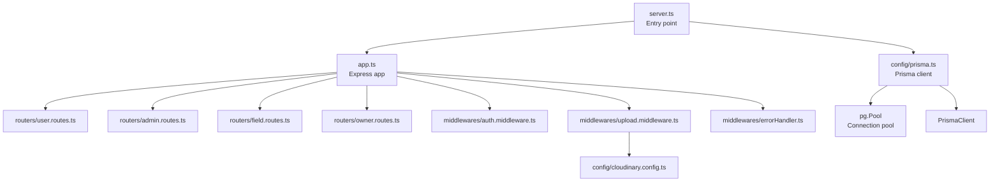
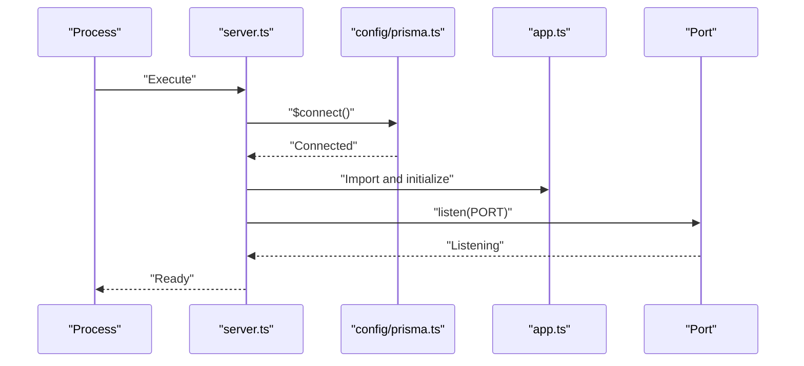
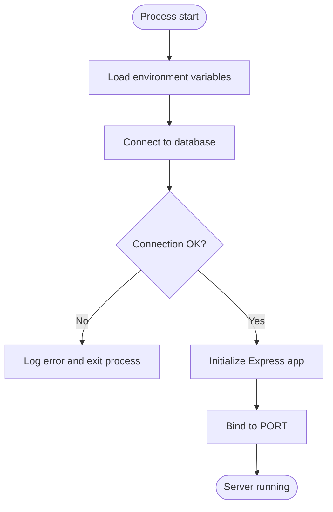
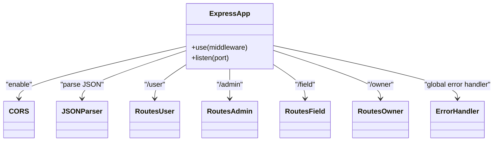
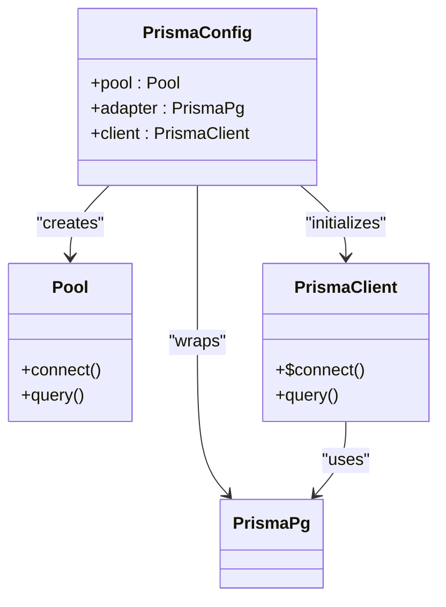
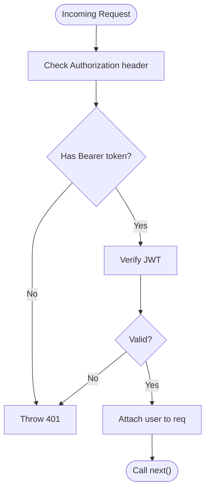
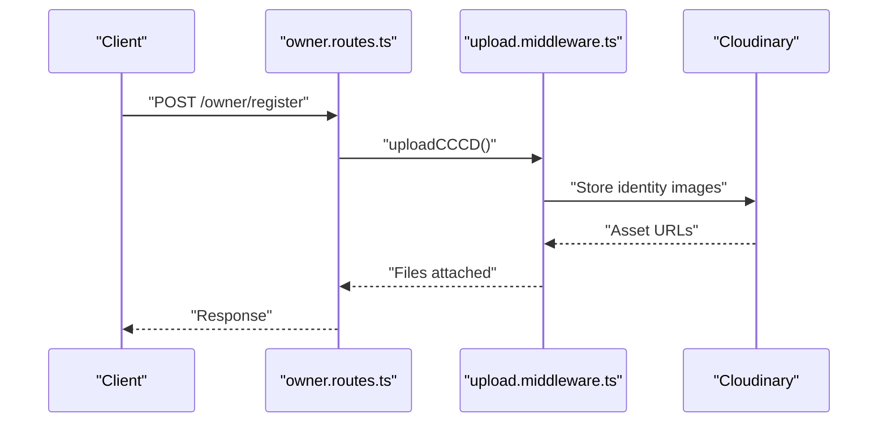
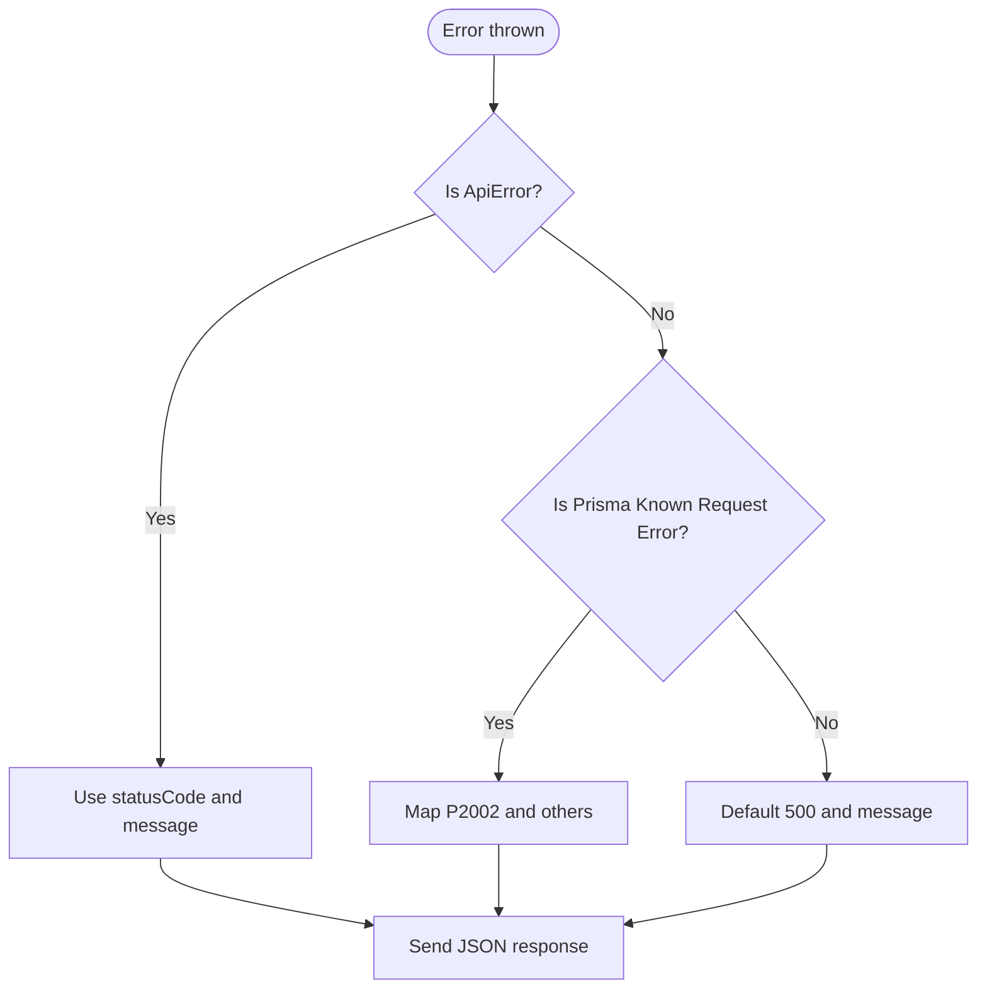
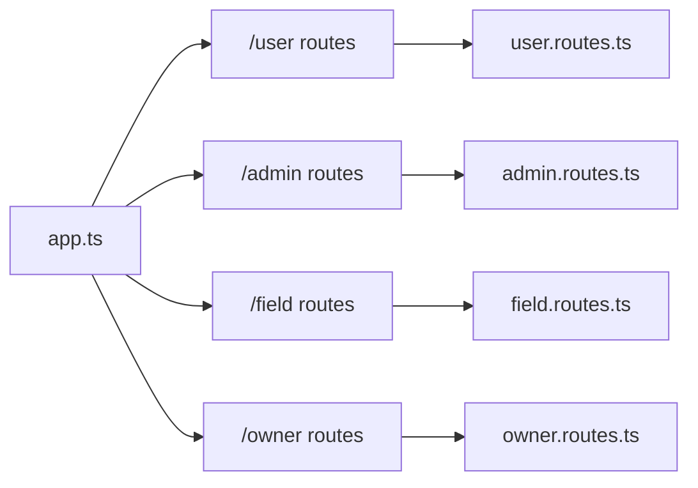
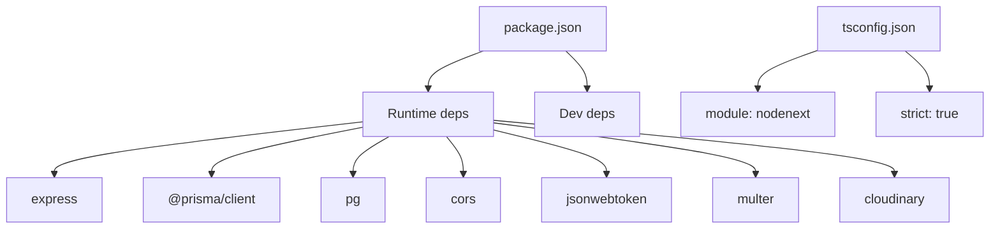

# Server Configuration

<cite>
**Referenced Files in This Document**
- [server.ts](file://backend/src/server.ts)
- [app.ts](file://backend/src/app.ts)
- [prisma.ts](file://backend/src/config/prisma.ts)
- [errorHandler.ts](file://backend/src/middlewares/errorHandler.ts)
- [auth.middleware.ts](file://backend/src/middlewares/auth.middleware.ts)
- [upload.middleware.ts](file://backend/src/middlewares/upload.middleware.ts)
- [user.routes.ts](file://backend/src/routers/user.routes.ts)
- [admin.routes.ts](file://backend/src/routers/admin.routes.ts)
- [field.routes.ts](file://backend/src/routers/field.routes.ts)
- [owner.routes.ts](file://backend/src/routers/owner.routes.ts)
- [ApiError.ts](file://backend/src/utils/ApiError.ts)
- [jwt.ts](file://backend/src/utils/jwt.ts)
- [cloudinary.config.ts](file://backend/src/config/cloudinary.config.ts)
- [schema.prisma](file://backend/prisma/schema.prisma)
- [package.json](file://backend/package.json)
- [tsconfig.json](file://backend/tsconfig.json)
</cite>

## Table of Contents
1. [Introduction](#introduction)
2. [Project Structure](#project-structure)
3. [Core Components](#core-components)
4. [Architecture Overview](#architecture-overview)
5. [Detailed Component Analysis](#detailed-component-analysis)
6. [Dependency Analysis](#dependency-analysis)
7. [Performance Considerations](#performance-considerations)
8. [Troubleshooting Guide](#troubleshooting-guide)
9. [Conclusion](#conclusion)
10. [Appendices](#appendices)

## Introduction
This document explains the server configuration for the Express.js backend. It covers the server startup process, environment variable configuration, application initialization, Express app setup, middleware configuration, port binding, database connection via Prisma, connection pooling strategies, error handling during startup, production versus development differences, security considerations, and performance tuning parameters. It also provides troubleshooting guidance for common startup issues and configuration validation steps.

## Project Structure
The backend follows a modular structure:
- Entry point initializes the server and connects to the database before listening on a port.
- Express app is configured with CORS, JSON body parsing, routes, and a global error handler.
- Prisma client is initialized with a PostgreSQL adapter backed by a connection pool.
- Routes are grouped under logical prefixes (/user, /admin, /field, /owner).
- Middleware handles authentication and file uploads to Cloudinary.
- Utilities provide JWT helpers and a typed error class.

**Diagram sources**
- [server.ts](file://backend/src/server.ts)
- [app.ts](file://backend/src/app.ts)
- [prisma.ts](file://backend/src/config/prisma.ts)
- [user.routes.ts](file://backend/src/routers/user.routes.ts)
- [admin.routes.ts](file://backend/src/routers/admin.routes.ts)
- [field.routes.ts](file://backend/src/routers/field.routes.ts)
- [owner.routes.ts](file://backend/src/routers/owner.routes.ts)
- [auth.middleware.ts](file://backend/src/middlewares/auth.middleware.ts)
- [upload.middleware.ts](file://backend/src/middlewares/upload.middleware.ts)
- [errorHandler.ts](file://backend/src/middlewares/errorHandler.ts)
- [cloudinary.config.ts](file://backend/src/config/cloudinary.config.ts)

**Section sources**
- [server.ts](file://backend/src/server.ts)
- [app.ts](file://backend/src/app.ts)
- [prisma.ts](file://backend/src/config/prisma.ts)
- [package.json](file://backend/package.json)
- [tsconfig.json](file://backend/tsconfig.json)

## Core Components
- Server entry point: Starts the server, connects to the database, and binds to a port.
- Express app: Initializes middleware, registers routes, and applies a global error handler.
- Prisma configuration: Creates a PostgreSQL adapter with a connection pool and a Prisma client.
- Global error handler: Normalizes error responses and logs unexpected errors.
- Authentication middleware: Validates bearer tokens for protected routes.
- Upload middleware: Integrates Cloudinary for image uploads.
- JWT utilities: Generates and verifies tokens with environment-controlled secrets.
- Cloudinary configuration: Loads credentials from environment variables.
- Prisma schema: Defines PostgreSQL models and relations.

**Section sources**
- [server.ts](file://backend/src/server.ts)
- [app.ts](file://backend/src/app.ts)
- [prisma.ts](file://backend/src/config/prisma.ts)
- [errorHandler.ts](file://backend/src/middlewares/errorHandler.ts)
- [auth.middleware.ts](file://backend/src/middlewares/auth.middleware.ts)
- [upload.middleware.ts](file://backend/src/middlewares/upload.middleware.ts)
- [jwt.ts](file://backend/src/utils/jwt.ts)
- [cloudinary.config.ts](file://backend/src/config/cloudinary.config.ts)
- [schema.prisma](file://backend/prisma/schema.prisma)

## Architecture Overview
The startup flow connects the server to the database, starts the Express app, and exposes REST endpoints grouped by domain.

**Diagram sources**
- [server.ts](file://backend/src/server.ts)
- [prisma.ts](file://backend/src/config/prisma.ts)
- [app.ts](file://backend/src/app.ts)

## Detailed Component Analysis

### Server Startup and Initialization
- Port selection: Uses an environment variable with a fallback to a default value.
- Database connection: Establishes a connection to PostgreSQL via Prisma before starting the server.
- Error handling: Catches connection or startup errors, logs them, and exits the process.

**Diagram sources**
- [server.ts](file://backend/src/server.ts)
- [prisma.ts](file://backend/src/config/prisma.ts)
- [app.ts](file://backend/src/app.ts)

**Section sources**
- [server.ts](file://backend/src/server.ts)

### Express App Setup and Middleware
- Environment configuration: Loads .env variables early in the app lifecycle.
- CORS: Enables cross-origin requests.
- Body parsing: Parses JSON payloads.
- Routing: Mounts domain-specific routers under path prefixes.
- Global error handling: Ensures consistent error responses.

**Diagram sources**
- [app.ts](file://backend/src/app.ts)
- [user.routes.ts](file://backend/src/routers/user.routes.ts)
- [admin.routes.ts](file://backend/src/routers/admin.routes.ts)
- [field.routes.ts](file://backend/src/routers/field.routes.ts)
- [owner.routes.ts](file://backend/src/routers/owner.routes.ts)
- [errorHandler.ts](file://backend/src/middlewares/errorHandler.ts)

**Section sources**
- [app.ts](file://backend/src/app.ts)

### Database Connection with Prisma and Connection Pooling
- Adapter: Uses a PostgreSQL adapter for Prisma.
- Pool: A connection pool is created from the PostgreSQL connection string.
- Client: A Prisma client is instantiated with the adapter.
- Schema: PostgreSQL models define entities and relations.

**Diagram sources**
- [prisma.ts](file://backend/src/config/prisma.ts)
- [schema.prisma](file://backend/prisma/schema.prisma)

**Section sources**
- [prisma.ts](file://backend/src/config/prisma.ts)
- [schema.prisma](file://backend/prisma/schema.prisma)

### Authentication Middleware
- Validates Authorization header presence and format.
- Extracts and verifies JWT token.
- Attaches decoded user payload to the request object.

**Diagram sources**
- [auth.middleware.ts](file://backend/src/middlewares/auth.middleware.ts)
- [jwt.ts](file://backend/src/utils/jwt.ts)

**Section sources**
- [auth.middleware.ts](file://backend/src/middlewares/auth.middleware.ts)
- [jwt.ts](file://backend/src/utils/jwt.ts)

### Upload Middleware and Cloudinary
- Configures Cloudinary using environment variables.
- Sets up multer with Cloudinary storage for two use cases:
  - Upload fields: multiple images for a court.
  - Identity documents: front and back images.

**Diagram sources**
- [owner.routes.ts](file://backend/src/routers/owner.routes.ts)
- [upload.middleware.ts](file://backend/src/middlewares/upload.middleware.ts)
- [cloudinary.config.ts](file://backend/src/config/cloudinary.config.ts)

**Section sources**
- [upload.middleware.ts](file://backend/src/middlewares/upload.middleware.ts)
- [cloudinary.config.ts](file://backend/src/config/cloudinary.config.ts)

### Global Error Handler
- Converts generic errors to structured responses.
- Handles typed API errors and specific Prisma errors.
- Logs unexpected errors for diagnostics.

**Diagram sources**
- [errorHandler.ts](file://backend/src/middlewares/errorHandler.ts)
- [ApiError.ts](file://backend/src/utils/ApiError.ts)

**Section sources**
- [errorHandler.ts](file://backend/src/middlewares/errorHandler.ts)
- [ApiError.ts](file://backend/src/utils/ApiError.ts)

### Route Modules
- User routes: Registration and login endpoints.
- Admin routes: Listing users and fetching by ID.
- Field routes: Retrieving fields.
- Owner routes: Registration, managing courts, bookings, and status updates.

**Diagram sources**
- [app.ts](file://backend/src/app.ts)
- [user.routes.ts](file://backend/src/routers/user.routes.ts)
- [admin.routes.ts](file://backend/src/routers/admin.routes.ts)
- [field.routes.ts](file://backend/src/routers/field.routes.ts)
- [owner.routes.ts](file://backend/src/routers/owner.routes.ts)

**Section sources**
- [user.routes.ts](file://backend/src/routers/user.routes.ts)
- [admin.routes.ts](file://backend/src/routers/admin.routes.ts)
- [field.routes.ts](file://backend/src/routers/field.routes.ts)
- [owner.routes.ts](file://backend/src/routers/owner.routes.ts)

## Dependency Analysis
- Runtime dependencies include Express, Prisma client, PostgreSQL driver, CORS, JWT, Multer, and Cloudinary.
- Development dependencies include Prisma, TypeScript, tsx, and related type definitions.
- Module resolution uses ES modules with NodeNext target and strict TypeScript settings.

**Diagram sources**
- [package.json](file://backend/package.json)
- [tsconfig.json](file://backend/tsconfig.json)

**Section sources**
- [package.json](file://backend/package.json)
- [tsconfig.json](file://backend/tsconfig.json)

## Performance Considerations
- Connection pooling: The Prisma PostgreSQL adapter uses a connection pool managed by the PostgreSQL driver. Tune pool size and timeouts at the environment level (e.g., via DATABASE_URL parameters) to match deployment capacity.
- JSON parsing: Enable compression at the reverse proxy or Express middleware for production deployments to reduce payload sizes.
- Static assets: Offload static content to a CDN or reverse proxy to reduce application load.
- Logging: Avoid excessive logging in hot paths; consider sampling or structured logging in production.
- Health checks: Add a GET /health endpoint returning database connectivity status for monitoring.
- Rate limiting: Apply rate limits for authentication endpoints to mitigate brute-force attempts.
- Memory and CPU: Monitor heap snapshots and CPU profiles during load testing; adjust Node.js runtime flags accordingly.

[No sources needed since this section provides general guidance]

## Troubleshooting Guide
Common startup issues and resolutions:
- Database connection failures:
  - Verify DATABASE_URL format and credentials.
  - Ensure the database is reachable from the host and firewall rules allow connections.
  - Confirm Prisma client generation matches the schema.
- Port binding conflicts:
  - Change PORT or stop the conflicting service.
  - On Windows, use PowerShell to check port usage; on Unix-like systems, use netstat or lsof.
- Missing environment variables:
  - Ensure .env contains required keys: DATABASE_URL, JWT_SECRET, and Cloudinary credentials.
  - Confirm dotenv loads in both server.ts and cloudinary.config.ts.
- Authentication errors:
  - Validate Authorization header format and token signature.
  - Check JWT_SECRET consistency across deployments.
- Upload failures:
  - Confirm Cloudinary credentials and folder permissions.
  - Limit file sizes and allowed formats per multer configuration.
- Unexpected errors:
  - Review global error handler logs for stack traces and Prisma error codes.

Validation checklist:
- Run the development script to confirm hot reload works.
- Manually curl endpoints to verify routing and middleware behavior.
- Test database connectivity by invoking a simple Prisma query in a route or script.

**Section sources**
- [server.ts](file://backend/src/server.ts)
- [prisma.ts](file://backend/src/config/prisma.ts)
- [errorHandler.ts](file://backend/src/middlewares/errorHandler.ts)
- [auth.middleware.ts](file://backend/src/middlewares/auth.middleware.ts)
- [upload.middleware.ts](file://backend/src/middlewares/upload.middleware.ts)
- [cloudinary.config.ts](file://backend/src/config/cloudinary.config.ts)
- [jwt.ts](file://backend/src/utils/jwt.ts)

## Conclusion
The backend initializes cleanly by connecting to the database before starting the Express server, applying essential middleware, and exposing domain-specific routes. Prisma manages PostgreSQL connectivity through a robust adapter and connection pool. The global error handler ensures consistent error responses, while authentication and upload middleware support secure and scalable operations. For production, focus on environment hardening, connection pooling tuning, reverse proxy configuration, and observability.

[No sources needed since this section summarizes without analyzing specific files]

## Appendices

### Environment Variables Reference
- Required for database: DATABASE_URL
- Required for JWT: JWT_SECRET
- Required for Cloudinary: CLOUDINARY_CLOUD_NAME, CLOUDINARY_API_KEY, CLOUDINARY_API_SECRET
- Optional for server: PORT (defaults to 3000)

**Section sources**
- [prisma.ts](file://backend/src/config/prisma.ts)
- [jwt.ts](file://backend/src/utils/jwt.ts)
- [cloudinary.config.ts](file://backend/src/config/cloudinary.config.ts)
- [server.ts](file://backend/src/server.ts)