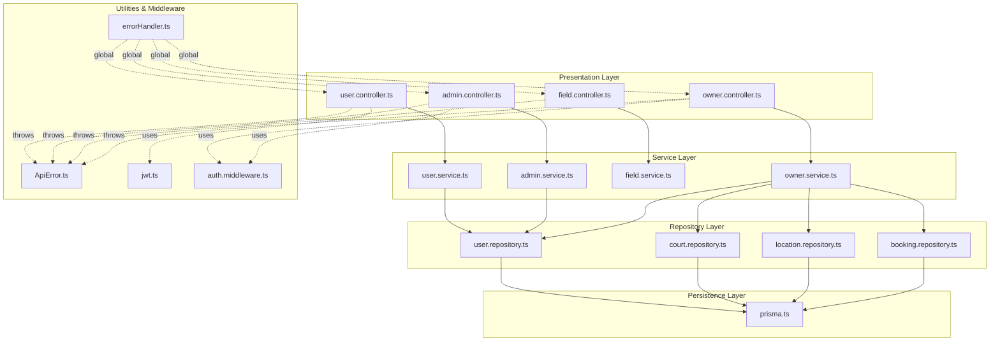
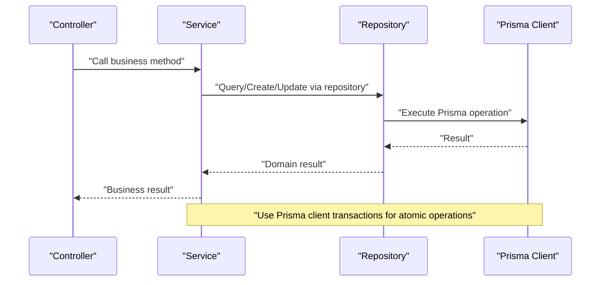
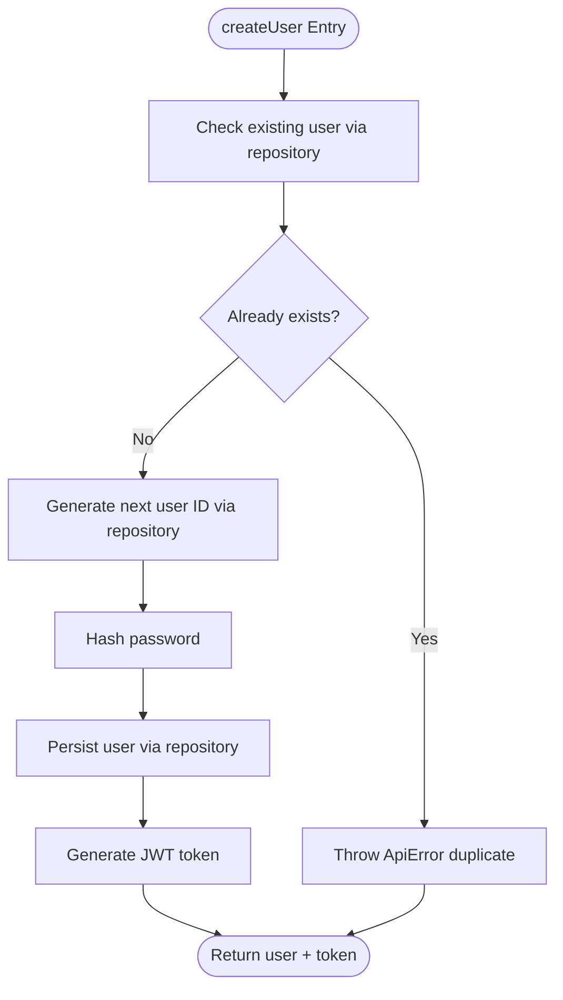
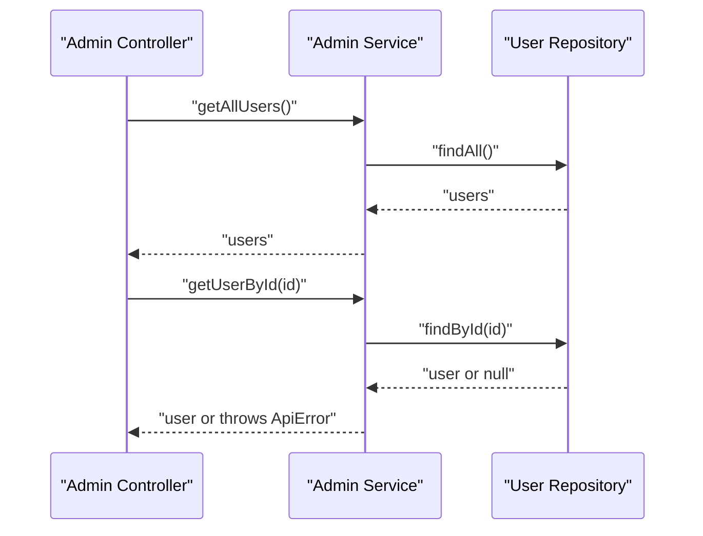
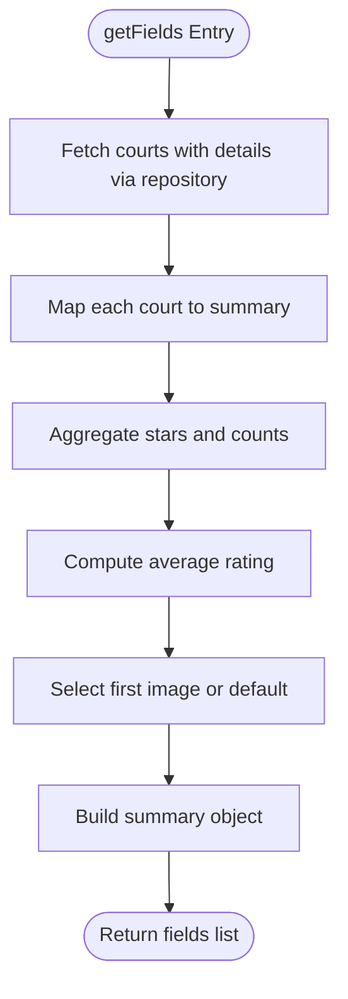
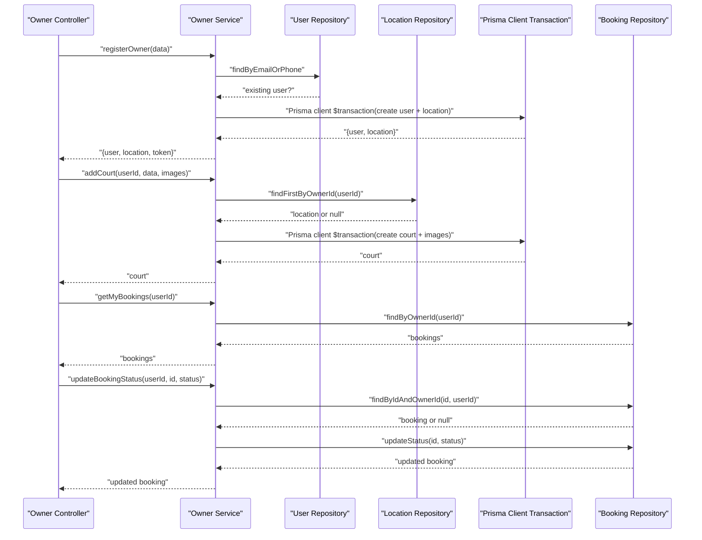
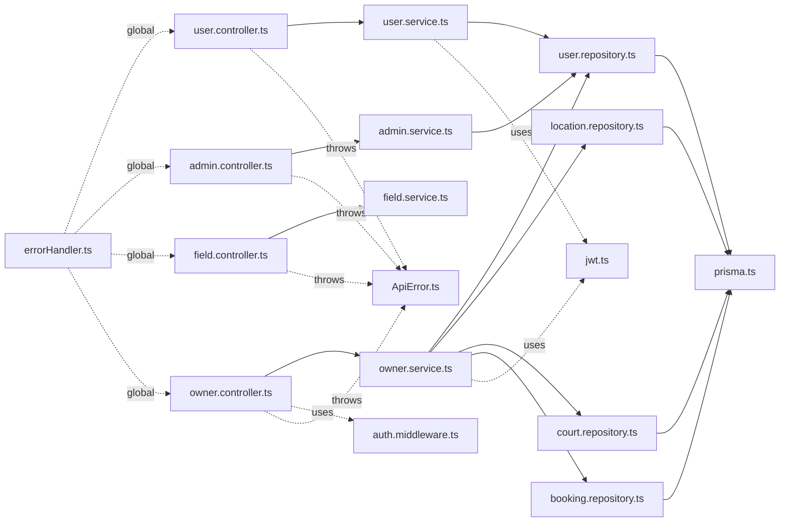
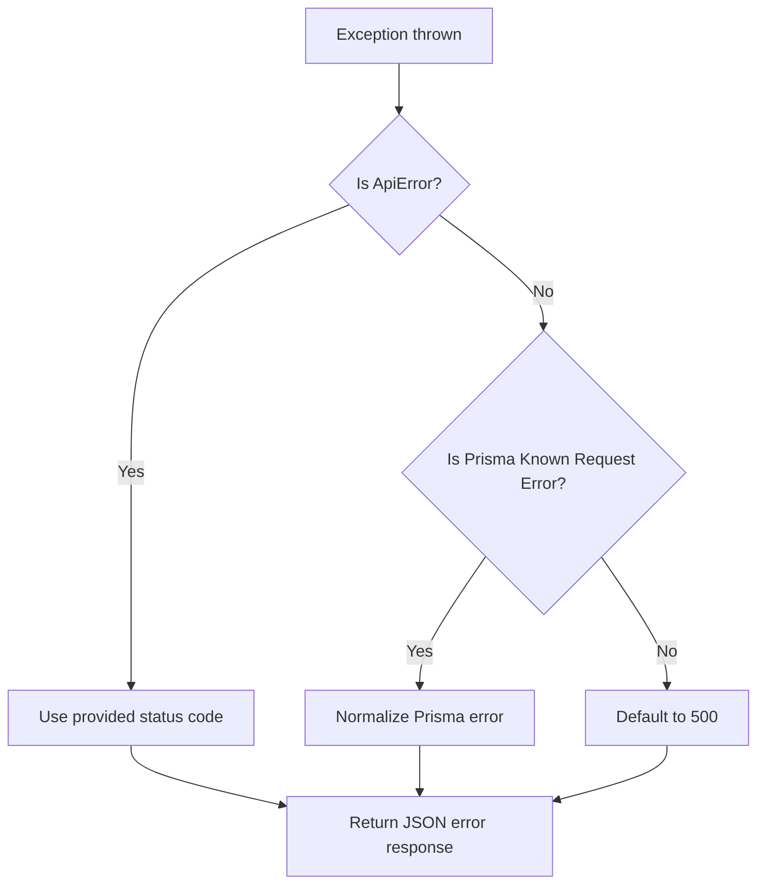

# Service Layer

<cite>
**Referenced Files in This Document**
- [user.service.ts](file://backend/src/services/user.service.ts)
- [admin.service.ts](file://backend/src/services/admin.service.ts)
- [field.service.ts](file://backend/src/services/field.service.ts)
- [owner.service.ts](file://backend/src/services/owner.service.ts)
- [user.repository.ts](file://backend/src/repositories/user.repository.ts)
- [court.repository.ts](file://backend/src/repositories/court.repository.ts)
- [location.repository.ts](file://backend/src/repositories/location.repository.ts)
- [booking.repository.ts](file://backend/src/repositories/booking.repository.ts)
- [user.controller.ts](file://backend/src/controllers/user.controller.ts)
- [admin.controller.ts](file://backend/src/controllers/admin.controller.ts)
- [field.controller.ts](file://backend/src/controllers/field.controller.ts)
- [owner.controller.ts](file://backend/src/controllers/owner.controller.ts)
- [errorHandler.ts](file://backend/src/middlewares/errorHandler.ts)
- [ApiError.ts](file://backend/src/utils/ApiError.ts)
- [prisma.ts](file://backend/src/config/prisma.ts)
- [jwt.ts](file://backend/src/utils/jwt.ts)
- [auth.middleware.ts](file://backend/src/middlewares/auth.middleware.ts)
</cite>

## Update Summary
**Changes Made**
- Enhanced OwnerService with improved transaction handling using Prisma client transactions
- Updated service methods to utilize new repository pattern with dedicated repository classes
- Improved business logic orchestration with better error handling and validation
- Strengthened cross-service coordination through enhanced repository interfaces

## Table of Contents
1. [Introduction](#introduction)
2. [Project Structure](#project-structure)
3. [Core Components](#core-components)
4. [Architecture Overview](#architecture-overview)
5. [Detailed Component Analysis](#detailed-component-analysis)
6. [Enhanced Transaction Management](#enhanced-transaction-management)
7. [Repository Pattern Implementation](#repository-pattern-implementation)
8. [Dependency Analysis](#dependency-analysis)
9. [Performance Considerations](#performance-considerations)
10. [Troubleshooting Guide](#troubleshooting-guide)
11. [Conclusion](#conclusion)
12. [Appendices](#appendices)

## Introduction
This document provides comprehensive service layer documentation for the backend, reflecting recent enhancements to the service architecture. The service layer now features improved transaction handling in OwnerService, updated service methods utilizing a new repository pattern with dedicated repository classes, and enhanced business logic orchestration. The architecture maintains clean separation of concerns while providing robust transaction management and improved error handling strategies.

## Project Structure
The service layer follows a layered architecture with enhanced repository pattern implementation:
- Controllers: HTTP entry points that parse requests, delegate to services, and return responses
- Services: Business logic orchestrators that coordinate repositories, enforce rules, and manage transactions using Prisma client transactions
- Repositories: Dedicated repository classes that encapsulate Prisma queries and ID generation
- Utilities and Middleware: Shared error handling, JWT utilities, and authentication middleware
- Configuration: Prisma client configured with PostgreSQL adapter

**Diagram sources**
- [user.controller.ts:1-14](file://backend/src/controllers/user.controller.ts#L1-L14)
- [admin.controller.ts:1-13](file://backend/src/controllers/admin.controller.ts#L1-L13)
- [field.controller.ts:1-11](file://backend/src/controllers/field.controller.ts#L1-L11)
- [owner.controller.ts:1-110](file://backend/src/controllers/owner.controller.ts#L1-L110)
- [user.service.ts:1-69](file://backend/src/services/user.service.ts#L1-L69)
- [admin.service.ts:1-57](file://backend/src/services/admin.service.ts#L1-L57)
- [field.service.ts:1-42](file://backend/src/services/field.service.ts#L1-L42)
- [owner.service.ts:1-148](file://backend/src/services/owner.service.ts#L1-L148)
- [user.repository.ts:1-53](file://backend/src/repositories/user.repository.ts#L1-L53)
- [court.repository.ts:1-83](file://backend/src/repositories/court.repository.ts#L1-L83)
- [location.repository.ts:1-51](file://backend/src/repositories/location.repository.ts#L1-L51)
- [booking.repository.ts:1-49](file://backend/src/repositories/booking.repository.ts#L1-L49)
- [prisma.ts:1-10](file://backend/src/config/prisma.ts#L1-L10)
- [ApiError.ts:1-13](file://backend/src/utils/ApiError.ts#L1-L13)
- [errorHandler.ts:1-38](file://backend/src/middlewares/errorHandler.ts#L1-L38)
- [jwt.ts](file://backend/src/utils/jwt.ts)
- [auth.middleware.ts](file://backend/src/middlewares/auth.middleware.ts)

**Section sources**
- [user.controller.ts:1-14](file://backend/src/controllers/user.controller.ts#L1-L14)
- [admin.controller.ts:1-13](file://backend/src/controllers/admin.controller.ts#L1-L13)
- [field.controller.ts:1-11](file://backend/src/controllers/field.controller.ts#L1-L11)
- [owner.controller.ts:1-110](file://backend/src/controllers/owner.controller.ts#L1-L110)
- [user.service.ts:1-69](file://backend/src/services/user.service.ts#L1-L69)
- [admin.service.ts:1-57](file://backend/src/services/admin.service.ts#L1-L57)
- [field.service.ts:1-42](file://backend/src/services/field.service.ts#L1-L42)
- [owner.service.ts:1-148](file://backend/src/services/owner.service.ts#L1-L148)
- [user.repository.ts:1-53](file://backend/src/repositories/user.repository.ts#L1-L53)
- [court.repository.ts:1-83](file://backend/src/repositories/court.repository.ts#L1-L83)
- [location.repository.ts:1-51](file://backend/src/repositories/location.repository.ts#L1-L51)
- [booking.repository.ts:1-49](file://backend/src/repositories/booking.repository.ts#L1-L49)
- [prisma.ts:1-10](file://backend/src/config/prisma.ts#L1-L10)
- [ApiError.ts:1-13](file://backend/src/utils/ApiError.ts#L1-L13)
- [errorHandler.ts:1-38](file://backend/src/middlewares/errorHandler.ts#L1-L38)
- [jwt.ts](file://backend/src/utils/jwt.ts)
- [auth.middleware.ts](file://backend/src/middlewares/auth.middleware.ts)

## Core Components
- **User Service**: Handles user registration and login, enforces uniqueness of email/phone, hashes passwords, and generates tokens using dedicated repository pattern
- **Admin Service**: Provides user listing and owner creation flows with duplicate checks and password hashing through centralized repository
- **Field Service**: Aggregates courts with ratings and associated location details for discovery using enhanced repository methods
- **Owner Service**: **Enhanced** - Coordinates owner registration (user + location), creates courts with images, retrieves owner's courts/bookings, and updates booking statuses within ownership boundaries; uses Prisma client transactions for atomicity across multiple operations

**Updated** Enhanced with improved transaction handling using Prisma client transactions instead of repository-level transactions, providing better control over complex multi-step operations.

Key implementation patterns:
- **Enhanced Dependency Injection**: Services depend on dedicated repository classes via constructor parameters or module-scoped instances; repositories depend on the Prisma client
- **Improved Transaction Management**: Owner operations use Prisma client `$transaction` method to ensure atomicity across user and location creation, and across court creation and image insertion
- **Cross-service Coordination**: Owner service coordinates multiple repositories (user, location, court, booking) and uses Prisma relations to enforce ownership constraints
- **Centralized Error Handling**: Enhanced via ApiError and global error handler middleware; Prisma-specific errors are normalized with improved error messages

**Section sources**
- [user.service.ts:1-69](file://backend/src/services/user.service.ts#L1-L69)
- [admin.service.ts:1-57](file://backend/src/services/admin.service.ts#L1-L57)
- [field.service.ts:1-42](file://backend/src/services/field.service.ts#L1-L42)
- [owner.service.ts:1-148](file://backend/src/services/owner.service.ts#L1-L148)
- [user.repository.ts:1-53](file://backend/src/repositories/user.repository.ts#L1-L53)
- [court.repository.ts:1-83](file://backend/src/repositories/court.repository.ts#L1-L83)
- [location.repository.ts:1-51](file://backend/src/repositories/location.repository.ts#L1-L51)
- [booking.repository.ts:1-49](file://backend/src/repositories/booking.repository.ts#L1-L49)
- [errorHandler.ts:1-38](file://backend/src/middlewares/errorHandler.ts#L1-L38)
- [ApiError.ts:1-13](file://backend/src/utils/ApiError.ts#L1-L13)
- [prisma.ts:1-10](file://backend/src/config/prisma.ts#L1-L10)

## Architecture Overview
The service layer adheres to clean architecture principles with enhanced transaction management:
- Controllers are thin and delegate to services
- Services encapsulate business rules and orchestrate repositories using dedicated repository classes
- Repositories abstract persistence and ID generation through specialized classes
- **Enhanced** Transactions are used via Prisma client for complex atomic operations
- Global error handling ensures consistent error responses with improved error categorization

**Diagram sources**
- [user.controller.ts:1-14](file://backend/src/controllers/user.controller.ts#L1-L14)
- [user.service.ts:1-69](file://backend/src/services/user.service.ts#L1-L69)
- [user.repository.ts:1-53](file://backend/src/repositories/user.repository.ts#L1-L53)
- [prisma.ts:1-10](file://backend/src/config/prisma.ts#L1-L10)

## Detailed Component Analysis

### User Service
Responsibilities:
- Validate uniqueness of email/phone during registration
- Generate next user ID using dedicated repository
- Hash password before persisting
- Authenticate users by verifying credentials and generating tokens

Processing logic highlights:
- Duplicate check against email/phone using repository method
- Sequential steps: existence check → next ID generation → hash → persist → token generation

**Diagram sources**
- [user.service.ts:8-42](file://backend/src/services/user.service.ts#L8-L42)
- [user.repository.ts:10-49](file://backend/src/repositories/user.repository.ts#L10-L49)

**Section sources**
- [user.service.ts:1-69](file://backend/src/services/user.service.ts#L1-L69)
- [user.repository.ts:1-53](file://backend/src/repositories/user.repository.ts#L1-L53)
- [jwt.ts](file://backend/src/utils/jwt.ts)

### Admin Service
Responsibilities:
- List all users via repository
- Retrieve a user by ID with 404 handling via repository
- Create owners with duplicate checks, password hashing, and persisted documents

Processing logic highlights:
- Reuses user repository for duplicate checks and persistence
- Returns owner record after creation with enhanced validation

**Diagram sources**
- [admin.controller.ts:1-13](file://backend/src/controllers/admin.controller.ts#L1-L13)
- [admin.service.ts:7-19](file://backend/src/services/admin.service.ts#L7-L19)
- [user.repository.ts:4-8](file://backend/src/repositories/user.repository.ts#L4-L8)

**Section sources**
- [admin.service.ts:1-57](file://backend/src/services/admin.service.ts#L1-L57)
- [admin.controller.ts:1-13](file://backend/src/controllers/admin.controller.ts#L1-L13)
- [user.repository.ts:1-53](file://backend/src/repositories/user.repository.ts#L1-L53)

### Field Service
Responsibilities:
- Aggregate courts with details, compute average rating from reviews, select a representative image, and expose essential fields for discovery

Processing logic highlights:
- Fetches courts with nested includes for images, location, and bookings/reviews via repository
- Computes average stars per court and selects a default image if none exist

**Diagram sources**
- [field.service.ts:4-38](file://backend/src/services/field.service.ts#L4-L38)
- [court.repository.ts:52-64](file://backend/src/repositories/court.repository.ts#L52-L64)

**Section sources**
- [field.service.ts:1-42](file://backend/src/services/field.service.ts#L1-L42)
- [court.repository.ts:1-83](file://backend/src/repositories/court.repository.ts#L1-L83)

### Owner Service
**Enhanced** Responsibilities:
- **Enhanced Registration**: Create user and location in a single Prisma client transaction; set initial role/status; generate token
- **Enhanced Court Management**: List, add, and update with ownership verification using dedicated repository methods
- **Enhanced Booking Management**: List and update status with ownership verification using repository-based validation
- **Improved Business Rules**: Ownership checks via repository queries that traverse relations with enhanced error handling

Processing logic highlights:
- **Enhanced Registration Transaction**: User + location creation via Prisma client `$transaction`
- **Enhanced Add Court Transaction**: Court + images creation via Prisma client `$transaction` with batch image insertion
- **Improved Ownership Checks**: Repository queries that traverse relations with explicit validation
- **Better Error Handling**: Enhanced error messages and validation for all operations

**Diagram sources**
- [owner.controller.ts:6-109](file://backend/src/controllers/owner.controller.ts#L6-L109)
- [owner.service.ts:12-144](file://backend/src/services/owner.service.ts#L12-L144)
- [user.repository.ts:10-16](file://backend/src/repositories/user.repository.ts#L10-L16)
- [location.repository.ts:17-21](file://backend/src/repositories/location.repository.ts#L17-L21)
- [booking.repository.ts:4-45](file://backend/src/repositories/booking.repository.ts#L4-L45)
- [prisma.ts:1-10](file://backend/src/config/prisma.ts#L1-L10)

**Section sources**
- [owner.service.ts:1-148](file://backend/src/services/owner.service.ts#L1-L148)
- [owner.controller.ts:1-110](file://backend/src/controllers/owner.controller.ts#L1-L110)
- [user.repository.ts:1-53](file://backend/src/repositories/user.repository.ts#L1-L53)
- [location.repository.ts:1-51](file://backend/src/repositories/location.repository.ts#L1-L51)
- [court.repository.ts:1-83](file://backend/src/repositories/court.repository.ts#L1-L83)
- [booking.repository.ts:1-49](file://backend/src/repositories/booking.repository.ts#L1-L49)
- [prisma.ts:1-10](file://backend/src/config/prisma.ts#L1-L10)

## Enhanced Transaction Management
**New Section** - The service layer now implements enhanced transaction management using Prisma client transactions for improved atomicity and error handling.

Key improvements:
- **Prisma Client Transactions**: OwnerService uses `prisma.$transaction()` for complex multi-step operations ensuring atomicity
- **Enhanced Error Recovery**: Better rollback mechanisms and error propagation across transaction boundaries
- **Improved Performance**: Reduced database round-trips through batch operations within transactions
- **Stronger Consistency**: Atomic operations prevent partial state scenarios

Transaction patterns implemented:
- **Registration Transaction**: User and location creation happen atomically
- **Court Creation Transaction**: Court and image creation occur together
- **Ownership Validation**: Repository queries ensure data consistency across operations

**Section sources**
- [owner.service.ts:31-59](file://backend/src/services/owner.service.ts#L31-L59)
- [owner.service.ts:85-110](file://backend/src/services/owner.service.ts#L85-L110)
- [prisma.ts:1-10](file://backend/src/config/prisma.ts#L1-L10)

## Repository Pattern Implementation
**New Section** - The service layer now utilizes a dedicated repository pattern with specialized repository classes for improved maintainability and testability.

Key improvements:
- **Dedicated Repository Classes**: Each entity type has its own repository class with focused responsibilities
- **Enhanced Method Organization**: Repository methods are organized by entity type (UserRepository, LocationRepository, etc.)
- **Improved Testability**: Repository classes can be easily mocked and tested independently
- **Better Code Organization**: Clear separation of concerns between services and data access logic

Repository implementations:
- **UserRepository**: Handles all user-related database operations with ID generation
- **LocationRepository**: Manages location data with owner-specific queries
- **CourtRepository**: Handles court operations including image management
- **BookingRepository**: Manages booking operations with ownership validation

**Section sources**
- [user.repository.ts:1-53](file://backend/src/repositories/user.repository.ts#L1-L53)
- [location.repository.ts:1-51](file://backend/src/repositories/location.repository.ts#L1-L51)
- [court.repository.ts:1-83](file://backend/src/repositories/court.repository.ts#L1-L83)
- [booking.repository.ts:1-49](file://backend/src/repositories/booking.repository.ts#L1-L49)

## Dependency Analysis
- Controllers depend on services
- **Enhanced** Services depend on dedicated repository classes
- **Improved** Repositories depend on Prisma client with better abstraction
- Services may depend on utilities (e.g., JWT) and may initiate Prisma client transactions
- Global error handling depends on ApiError

**Diagram sources**
- [user.controller.ts:1-14](file://backend/src/controllers/user.controller.ts#L1-L14)
- [admin.controller.ts:1-13](file://backend/src/controllers/admin.controller.ts#L1-L13)
- [field.controller.ts:1-11](file://backend/src/controllers/field.controller.ts#L1-L11)
- [owner.controller.ts:1-110](file://backend/src/controllers/owner.controller.ts#L1-L110)
- [user.service.ts:1-69](file://backend/src/services/user.service.ts#L1-L69)
- [admin.service.ts:1-57](file://backend/src/services/admin.service.ts#L1-L57)
- [field.service.ts:1-42](file://backend/src/services/field.service.ts#L1-L42)
- [owner.service.ts:1-148](file://backend/src/services/owner.service.ts#L1-L148)
- [user.repository.ts:1-53](file://backend/src/repositories/user.repository.ts#L1-L53)
- [court.repository.ts:1-83](file://backend/src/repositories/court.repository.ts#L1-L83)
- [location.repository.ts:1-51](file://backend/src/repositories/location.repository.ts#L1-L51)
- [booking.repository.ts:1-49](file://backend/src/repositories/booking.repository.ts#L1-L49)
- [prisma.ts:1-10](file://backend/src/config/prisma.ts#L1-L10)
- [ApiError.ts:1-13](file://backend/src/utils/ApiError.ts#L1-L13)
- [errorHandler.ts:1-38](file://backend/src/middlewares/errorHandler.ts#L1-L38)
- [jwt.ts](file://backend/src/utils/jwt.ts)
- [auth.middleware.ts](file://backend/src/middlewares/auth.middleware.ts)

**Section sources**
- [user.controller.ts:1-14](file://backend/src/controllers/user.controller.ts#L1-L14)
- [admin.controller.ts:1-13](file://backend/src/controllers/admin.controller.ts#L1-L13)
- [field.controller.ts:1-11](file://backend/src/controllers/field.controller.ts#L1-L11)
- [owner.controller.ts:1-110](file://backend/src/controllers/owner.controller.ts#L1-L110)
- [user.service.ts:1-69](file://backend/src/services/user.service.ts#L1-L69)
- [admin.service.ts:1-57](file://backend/src/services/admin.service.ts#L1-L57)
- [field.service.ts:1-42](file://backend/src/services/field.service.ts#L1-L42)
- [owner.service.ts:1-148](file://backend/src/services/owner.service.ts#L1-L148)
- [user.repository.ts:1-53](file://backend/src/repositories/user.repository.ts#L1-L53)
- [court.repository.ts:1-83](file://backend/src/repositories/court.repository.ts#L1-L83)
- [location.repository.ts:1-51](file://backend/src/repositories/location.repository.ts#L1-L51)
- [booking.repository.ts:1-49](file://backend/src/repositories/booking.repository.ts#L1-L49)
- [prisma.ts:1-10](file://backend/src/config/prisma.ts#L1-L10)
- [ApiError.ts:1-13](file://backend/src/utils/ApiError.ts#L1-L13)
- [errorHandler.ts:1-38](file://backend/src/middlewares/errorHandler.ts#L1-L38)
- [jwt.ts](file://backend/src/utils/jwt.ts)
- [auth.middleware.ts](file://backend/src/middlewares/auth.middleware.ts)

## Performance Considerations
- **Minimized N+1 Queries**: Use repository includes judiciously (as seen in field and booking repositories) to reduce round-trips
- **Enhanced Batch Operations**: Image creation for courts uses batch insert via `createMany()` to avoid multiple writes
- **Improved ID Generation**: Repositories precompute next identifiers to avoid race conditions and reduce retries
- **Optimized Transactions**: Group related writes using Prisma client transactions to reduce partial states and improve consistency
- **Better Caching Strategy**: Consider caching aggregated metrics (e.g., average ratings) at the service level if needed
- **Enhanced Logging**: Centralized error logging in the global error handler; consider structured logs for production observability

**Updated** Enhanced performance through improved repository pattern and Prisma client transaction optimization.

## Troubleshooting Guide
Common issues and resolutions:
- **Duplicate Key Errors**: Normalized by the global error handler; inspect Prisma error code and meta target for duplicates
- **Authentication Failures**: Ensure correct credentials and that accounts have passwords set
- **Ownership Violations**: Owner endpoints validate ownership; ensure the authenticated user ID matches the resource owner
- **Missing Required Fields**: Owner registration requires identity images; ensure uploads are present
- **Transaction Rollback Issues**: Enhanced error handling now provides better rollback information for failed transactions

**Enhanced** Error handling flow with improved transaction error recovery and better error categorization.

Error handling flow:

**Diagram sources**
- [errorHandler.ts:5-37](file://backend/src/middlewares/errorHandler.ts#L5-L37)
- [ApiError.ts:1-13](file://backend/src/utils/ApiError.ts#L1-L13)

**Section sources**
- [errorHandler.ts:1-38](file://backend/src/middlewares/errorHandler.ts#L1-L38)
- [ApiError.ts:1-13](file://backend/src/utils/ApiError.ts#L1-L13)
- [owner.controller.ts:15-17](file://backend/src/controllers/owner.controller.ts#L15-L17)
- [owner.controller.ts:73-75](file://backend/src/controllers/owner.controller.ts#L73-L75)
- [owner.controller.ts:100-102](file://backend/src/controllers/owner.controller.ts#L100-L102)

## Conclusion
The service layer has been significantly enhanced with improved transaction handling, dedicated repository pattern implementation, and strengthened business logic orchestration. The adoption of Prisma client transactions provides better atomicity guarantees, while the repository pattern improves maintainability and testability. Services continue to enforce business rules, coordinate repositories, and manage transactions where required. Controllers remain thin, delegating to services. A centralized error handling strategy and consistent validation ensure predictable behavior with enhanced error recovery capabilities.

## Appendices

### Extending Services: Best Practices
- Keep business logic in services; avoid duplicating validations across controllers
- **Enhanced** Use dedicated repository classes for all persistence operations; centralize ID generation and includes
- **Improved** Wrap cross-entity writes in Prisma client transactions to maintain consistency
- Throw ApiError for controlled failures; rely on the global error handler for responses
- **New** Leverage the enhanced repository pattern for better code organization and testability
- **New** Implement proper transaction boundaries for complex multi-step operations
- Add logging in services or middleware for operational visibility with enhanced error tracking

### Repository Pattern Best Practices
- **New** Each entity type should have its own dedicated repository class
- **New** Repository methods should be focused and single-purpose
- **New** Use Prisma client methods directly within repositories for data access
- **New** Implement ID generation methods within repositories for consistency
- **New** Use repository interfaces for better testability and mocking capabilities

### Transaction Management Best Practices
- **New** Use Prisma client `$transaction` for complex multi-step operations
- **New** Ensure all related operations are included within the same transaction boundary
- **New** Implement proper error handling and rollback mechanisms
- **New** Consider performance implications of transaction scope and duration
- **New** Use transaction isolation levels appropriately for concurrent operations