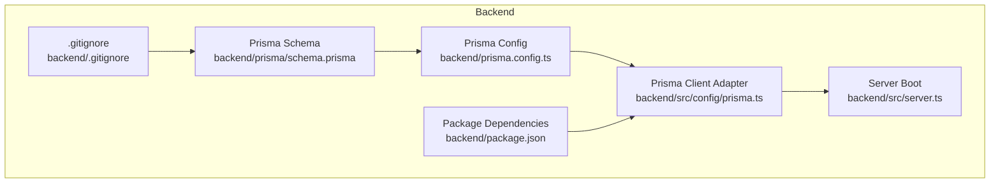
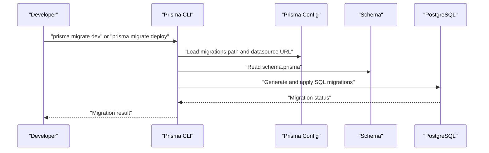
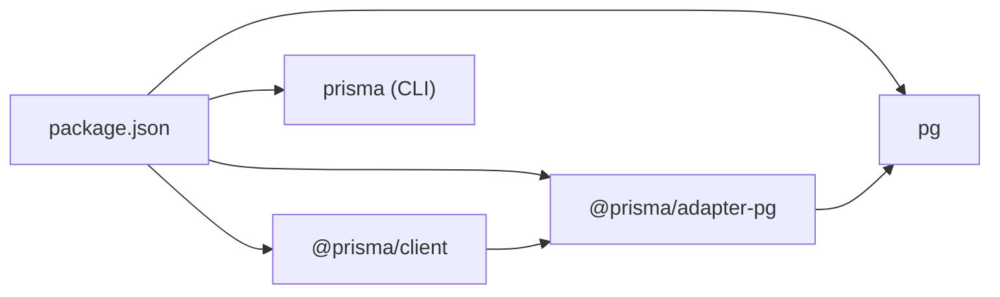
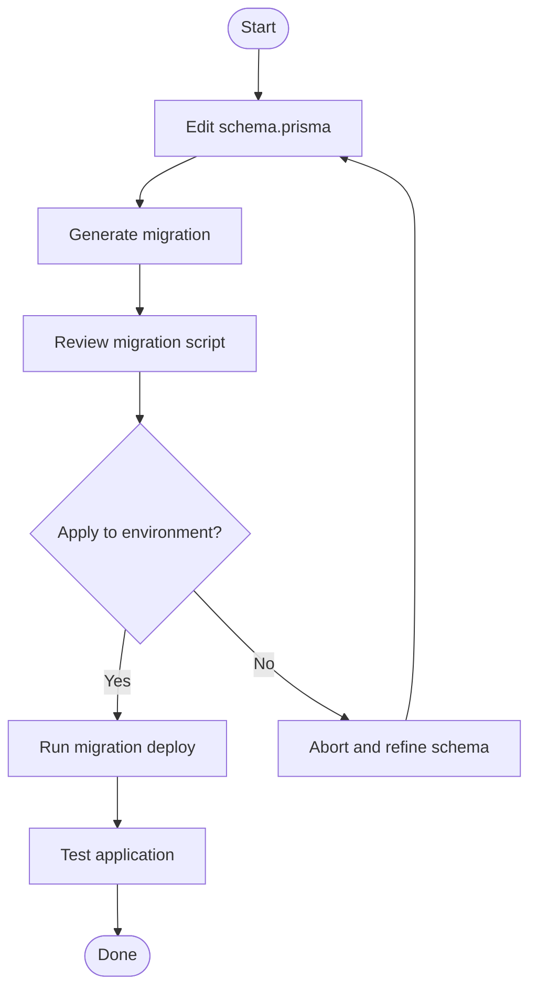

# Database Migration & Seeding

<cite>
**Referenced Files in This Document**
- [schema.prisma](file://backend/prisma/schema.prisma)
- [prisma.config.ts](file://backend/prisma.config.ts)
- [prisma.ts](file://backend/src/config/prisma.ts)
- [server.ts](file://backend/src/server.ts)
- [package.json](file://backend/package.json)
- [.gitignore](file://backend/.gitignore)
</cite>

## Table of Contents
1. [Introduction](#introduction)
2. [Project Structure](#project-structure)
3. [Core Components](#core-components)
4. [Architecture Overview](#architecture-overview)
5. [Detailed Component Analysis](#detailed-component-analysis)
6. [Dependency Analysis](#dependency-analysis)
7. [Performance Considerations](#performance-considerations)
8. [Troubleshooting Guide](#troubleshooting-guide)
9. [Conclusion](#conclusion)
10. [Appendices](#appendices)

## Introduction
This document explains the database migration and seeding procedures for the sports facility booking platform. It covers the Prisma-based schema definition, migration workflow, schema versioning, rollback strategies, and environment-specific configurations. It also documents how to set up seed data, initial data population, and test data, along with production deployment strategies, backup/recovery procedures, and maintenance schedules.

## Project Structure
The backend uses Prisma with PostgreSQL via the Prisma adapter for Postgres. The schema is defined declaratively, and migrations are configured to be stored under a dedicated folder. Environment variables are loaded via dotenv and consumed by both the Prisma configuration and the runtime Prisma client.

**Diagram sources**
- [schema.prisma:1-126](file://backend/prisma/schema.prisma#L1-L126)
- [prisma.config.ts:1-15](file://backend/prisma.config.ts#L1-L15)
- [prisma.ts:1-10](file://backend/src/config/prisma.ts#L1-L10)
- [server.ts:1-20](file://backend/src/server.ts#L1-L20)
- [package.json:1-41](file://backend/package.json#L1-L41)
- [.gitignore:1-5](file://backend/.gitignore#L1-L5)

**Section sources**
- [schema.prisma:1-126](file://backend/prisma/schema.prisma#L1-L126)
- [prisma.config.ts:1-15](file://backend/prisma.config.ts#L1-L15)
- [prisma.ts:1-10](file://backend/src/config/prisma.ts#L1-L10)
- [server.ts:1-20](file://backend/src/server.ts#L1-L20)
- [package.json:1-41](file://backend/package.json#L1-L41)
- [.gitignore:1-5](file://backend/.gitignore#L1-L5)

## Core Components
- Declarative schema: Defines models, relations, and constraints for the PostgreSQL database.
- Prisma configuration: Points to the schema and migration path, and reads the datasource URL from environment variables.
- Prisma client adapter: Uses the Postgres adapter with a connection pool to connect to the database.
- Server bootstrapping: Establishes the database connection before starting the HTTP server.

Key implementation references:
- Schema definition and model relations: [schema.prisma:10-126](file://backend/prisma/schema.prisma#L10-L126)
- Prisma config and migrations path: [prisma.config.ts:6-14](file://backend/prisma.config.ts#L6-L14)
- Prisma client with Postgres adapter: [prisma.ts:6-8](file://backend/src/config/prisma.ts#L6-L8)
- Server startup and database connection: [server.ts:8-9](file://backend/src/server.ts#L8-L9)

**Section sources**
- [schema.prisma:10-126](file://backend/prisma/schema.prisma#L10-L126)
- [prisma.config.ts:6-14](file://backend/prisma.config.ts#L6-L14)
- [prisma.ts:6-8](file://backend/src/config/prisma.ts#L6-L8)
- [server.ts:8-9](file://backend/src/server.ts#L8-L9)

## Architecture Overview
The migration and seeding pipeline integrates Prisma CLI, the Prisma configuration, and the runtime client. Migrations are generated from schema changes and applied to the target environment’s database. Seed scripts can populate initial or test data.

**Diagram sources**
- [prisma.config.ts:6-14](file://backend/prisma.config.ts#L6-L14)
- [schema.prisma:1-126](file://backend/prisma/schema.prisma#L1-L126)

## Detailed Component Analysis

### Prisma Schema Definition
The schema defines the domain models and their relationships. Notable characteristics:
- Provider: PostgreSQL
- Generator: Prisma client with output directed to the backend’s generated client
- Models: Users, Facilities, Bookings, Reviews, Transactions, Locations, Photos, and related relations
- Constraints: Several models include comments indicating additional setup for check constraints

Implementation references:
- Provider and generator configuration: [schema.prisma:1-4](file://backend/prisma/schema.prisma#L1-L4)
- Models and relations: [schema.prisma:10-126](file://backend/prisma/schema.prisma#L10-L126)

Best practices derived from schema:
- Use explicit ID types and defaults for timestamps
- Apply relation directives consistently for referential integrity
- Consider adding indexes for frequently queried columns (e.g., foreign keys)

**Section sources**
- [schema.prisma:1-4](file://backend/prisma/schema.prisma#L1-L4)
- [schema.prisma:10-126](file://backend/prisma/schema.prisma#L10-L126)

### Prisma Configuration and Environment Variables
The Prisma configuration:
- Points to the schema file
- Sets the migrations directory path
- Reads the datasource URL from environment variables

Environment variables:
- DATABASE_URL: Required for connecting to PostgreSQL in both development and production

Implementation references:
- Prisma config and migrations path: [prisma.config.ts:6-14](file://backend/prisma.config.ts#L6-L14)
- Environment variable usage: [prisma.config.ts](file://backend/prisma.config.ts#L12)

Security note:
- The generated client output directory is ignored by version control to prevent accidental exposure of credentials.

**Section sources**
- [prisma.config.ts:6-14](file://backend/prisma.config.ts#L6-L14)
- [.gitignore](file://backend/.gitignore#L5)

### Prisma Client Adapter and Runtime Connection
The runtime Prisma client:
- Loads environment variables via dotenv
- Creates a Postgres connection pool
- Initializes the Prisma client with the Postgres adapter
- Connects to the database during server startup

Implementation references:
- Environment loading and adapter setup: [prisma.ts:1-8](file://backend/src/config/prisma.ts#L1-L8)
- Server-side connection on startup: [server.ts:8-9](file://backend/src/server.ts#L8-L9)

Operational implications:
- The client connects before the HTTP server starts listening
- Errors during connection halt the server startup

**Section sources**
- [prisma.ts:1-8](file://backend/src/config/prisma.ts#L1-L8)
- [server.ts:8-9](file://backend/src/server.ts#L8-L9)

### Migration Workflow and Rollback Strategies
Migration lifecycle:
1. Modify the schema in schema.prisma
2. Generate a migration using the Prisma CLI
3. Review the generated migration script
4. Apply the migration to the target environment
5. For rollbacks, use the appropriate Prisma command

Rollback considerations:
- Prefer safe, reversible changes in migrations
- Use transactions where supported
- Maintain a clean separation between schema and data changes

Implementation references:
- Prisma CLI presence and dependencies: [package.json:35-35](file://backend/package.json#L35-L35)
- Prisma config pointing to migrations path: [prisma.config.ts:8-10](file://backend/prisma.config.ts#L8-L10)

**Section sources**
- [package.json:35-35](file://backend/package.json#L35-L35)
- [prisma.config.ts:8-10](file://backend/prisma.config.ts#L8-L10)

### Seed Data Creation and Initial Population
Seed strategy:
- Create a seed script that initializes core data (e.g., roles, default users, base facilities)
- Optionally create a separate script for test data
- Run the seed script after migrations are applied

Guidelines:
- Keep seeds deterministic and idempotent
- Use unique identifiers and controlled timestamps
- Separate production seeds from test seeds

Note: The repository does not include seed scripts yet. Add them under a dedicated seeds directory and integrate them into CI/CD pipelines.

**Section sources**
- [schema.prisma:92-126](file://backend/prisma/schema.prisma#L92-L126)

### Environment-Specific Configurations
- Local development: Set DATABASE_URL to a local PostgreSQL instance
- Staging: Point DATABASE_URL to a staging database
- Production: Use a managed PostgreSQL service with secure credentials

Security controls:
- Store DATABASE_URL in environment variables
- Exclude .env from version control
- Restrict access to secrets at rest and in transit

Implementation references:
- Environment variable consumption: [prisma.ts:1-1](file://backend/src/config/prisma.ts#L1-L1)
- Version control exclusion: [.gitignore:2-3](file://backend/.gitignore#L2-L3)

**Section sources**
- [prisma.ts:1-1](file://backend/src/config/prisma.ts#L1-L1)
- [.gitignore:2-3](file://backend/.gitignore#L2-L3)

### Deployment Procedures
Recommended deployment steps:
1. Build the backend
2. Apply migrations to the target database
3. Seed initial/test data if applicable
4. Start the server and verify connectivity

Integration points:
- The server attempts to connect to the database before listening
- Ensure the database is reachable and credentials are correct

Implementation references:
- Server startup and connection: [server.ts:6-18](file://backend/src/server.ts#L6-L18)

**Section sources**
- [server.ts:6-18](file://backend/src/server.ts#L6-L18)

## Dependency Analysis
The runtime Prisma client depends on the Postgres adapter and the underlying Postgres driver. The Prisma CLI is a development dependency used for generating and applying migrations.

**Diagram sources**
- [package.json:14-39](file://backend/package.json#L14-L39)

**Section sources**
- [package.json:14-39](file://backend/package.json#L14-L39)

## Performance Considerations
- Index frequently filtered and joined columns in models
- Normalize data carefully to avoid redundant storage
- Use transactions for multi-step writes to maintain consistency
- Monitor long-running migrations and schedule them during maintenance windows

## Troubleshooting Guide
Common issues and resolutions:
- Connection failures: Verify DATABASE_URL and network access to the database
- Migration errors: Inspect the generated migration script and fix schema inconsistencies
- Client generation issues: Ensure the generator block in schema.prisma is correct and rerun client generation

Implementation references:
- Environment loading and adapter initialization: [prisma.ts:1-8](file://backend/src/config/prisma.ts#L1-L8)
- Server-side connection attempt: [server.ts:8-9](file://backend/src/server.ts#L8-L9)

**Section sources**
- [prisma.ts:1-8](file://backend/src/config/prisma.ts#L1-L8)
- [server.ts:8-9](file://backend/src/server.ts#L8-L9)

## Conclusion
The platform uses Prisma with PostgreSQL and a clear separation between schema definition, configuration, and runtime client setup. By following the documented migration workflow, maintaining environment-specific configurations, and establishing seed scripts, teams can reliably evolve the schema, populate data, and deploy safely to production.

## Appendices

### Appendix A: Migration and Rollback Flow

**Diagram sources**
- [prisma.config.ts:8-10](file://backend/prisma.config.ts#L8-L10)
- [schema.prisma:1-4](file://backend/prisma/schema.prisma#L1-L4)

### Appendix B: Backup and Recovery Procedures
- Regular logical backups of the PostgreSQL database
- Store backups securely and test restore procedures periodically
- For point-in-time recovery, enable continuous archiving and WAL retention
- Coordinate with DBAs to automate and monitor backup jobs

### Appendix C: Maintenance Schedules
- Weekly schema reviews and small incremental migrations
- Monthly full backups and log cleanup
- Quarterly performance tuning and index reevaluation