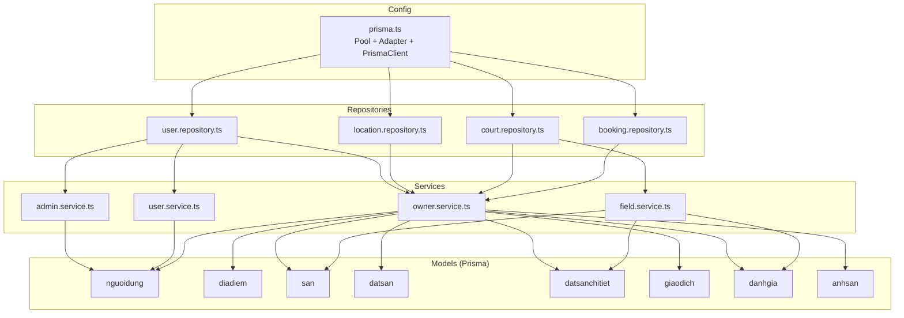
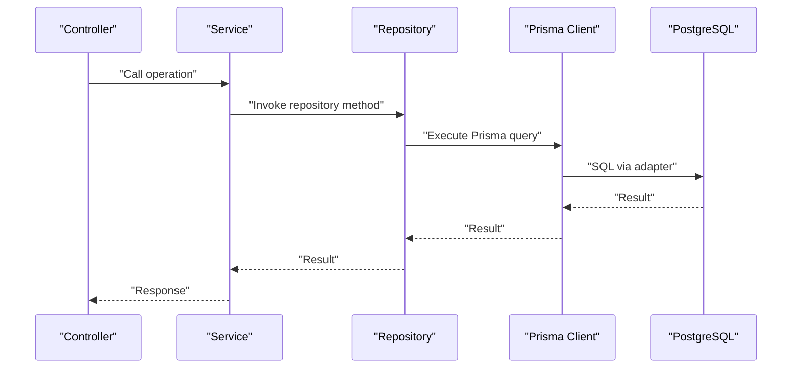
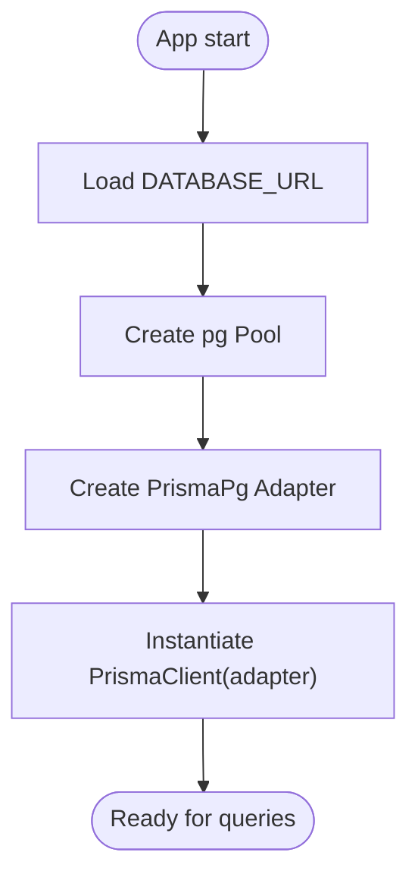
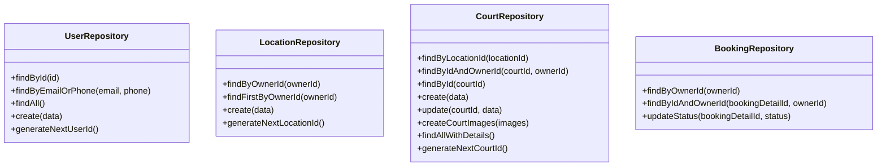
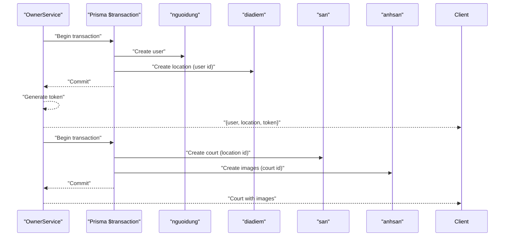
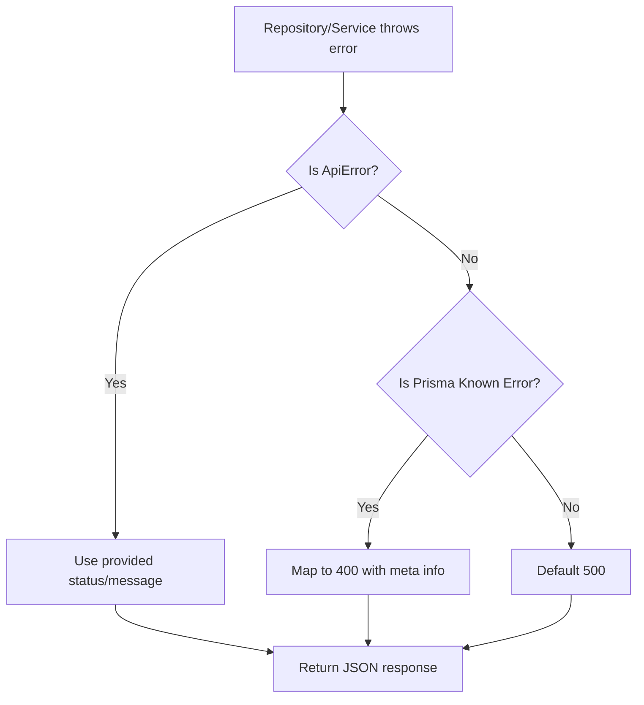
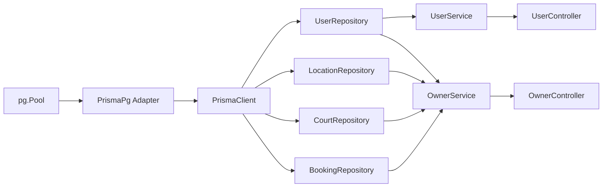
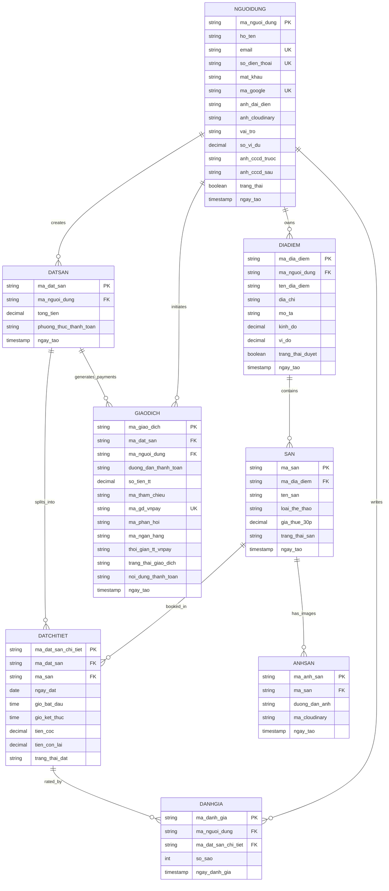

# Database Operations & Access Patterns

<cite>
**Referenced Files in This Document**
- [schema.prisma](file://backend/prisma/schema.prisma)
- [prisma.ts](file://backend/src/config/prisma.ts)
- [user.repository.ts](file://backend/src/repositories/user.repository.ts)
- [location.repository.ts](file://backend/src/repositories/location.repository.ts)
- [court.repository.ts](file://backend/src/repositories/court.repository.ts)
- [booking.repository.ts](file://backend/src/repositories/booking.repository.ts)
- [admin.service.ts](file://backend/src/services/admin.service.ts)
- [field.service.ts](file://backend/src/services/field.service.ts)
- [owner.service.ts](file://backend/src/services/owner.service.ts)
- [user.service.ts](file://backend/src/services/user.service.ts)
- [errorHandler.ts](file://backend/src/middlewares/errorHandler.ts)
- [ApiError.ts](file://backend/src/utils/ApiError.ts)
</cite>

## Table of Contents
1. [Introduction](#introduction)
2. [Project Structure](#project-structure)
3. [Core Components](#core-components)
4. [Architecture Overview](#architecture-overview)
5. [Detailed Component Analysis](#detailed-component-analysis)
6. [Dependency Analysis](#dependency-analysis)
7. [Performance Considerations](#performance-considerations)
8. [Troubleshooting Guide](#troubleshooting-guide)
9. [Conclusion](#conclusion)
10. [Appendices](#appendices)

## Introduction
This document explains database operations and access patterns in the sports facility booking platform. It covers the repository pattern, Prisma-based CRUD and complex queries, joins and aggregations, transaction handling, connection pooling, error handling, and practical query patterns for availability checks, user management, facility searches, and reporting. It also outlines migration and seeding strategies and maintenance operations.

## Project Structure
The backend uses Prisma with a PostgreSQL adapter and a dedicated connection pool. Repositories encapsulate data access, services orchestrate business logic, and controllers expose endpoints. Transactions are used for atomic operations across related entities.

**Diagram sources**
- [prisma.ts:1-10](file://backend/src/config/prisma.ts#L1-L10)
- [user.repository.ts:1-53](file://backend/src/repositories/user.repository.ts#L1-L53)
- [location.repository.ts:1-51](file://backend/src/repositories/location.repository.ts#L1-L51)
- [court.repository.ts:1-83](file://backend/src/repositories/court.repository.ts#L1-L83)
- [booking.repository.ts:1-49](file://backend/src/repositories/booking.repository.ts#L1-L49)
- [admin.service.ts:1-57](file://backend/src/services/admin.service.ts#L1-L57)
- [field.service.ts:1-42](file://backend/src/services/field.service.ts#L1-L42)
- [owner.service.ts:1-148](file://backend/src/services/owner.service.ts#L1-L148)
- [user.service.ts:1-69](file://backend/src/services/user.service.ts#L1-L69)
- [schema.prisma:1-126](file://backend/prisma/schema.prisma#L1-L126)

**Section sources**
- [prisma.ts:1-10](file://backend/src/config/prisma.ts#L1-L10)
- [schema.prisma:1-126](file://backend/prisma/schema.prisma#L1-L126)

## Core Components
- Prisma configuration with PostgreSQL adapter and connection pool
- Repository classes per domain entity with CRUD and specialized queries
- Service classes orchestrating transactions and business logic
- Centralized error handling for API and Prisma-specific errors

Key responsibilities:
- Connection pooling and adapter wiring: [prisma.ts:1-10](file://backend/src/config/prisma.ts#L1-L10)
- User management: [user.repository.ts:1-53](file://backend/src/repositories/user.repository.ts#L1-L53), [user.service.ts:1-69](file://backend/src/services/user.service.ts#L1-L69)
- Facility and location management: [location.repository.ts:1-51](file://backend/src/repositories/location.repository.ts#L1-L51), [court.repository.ts:1-83](file://backend/src/repositories/court.repository.ts#L1-L83), [field.service.ts:1-42](file://backend/src/services/field.service.ts#L1-L42)
- Owner operations and transactions: [owner.service.ts:1-148](file://backend/src/services/owner.service.ts#L1-L148)
- Admin operations: [admin.service.ts:1-57](file://backend/src/services/admin.service.ts#L1-L57)
- Error handling: [errorHandler.ts:1-38](file://backend/src/middlewares/errorHandler.ts#L1-L38), [ApiError.ts:1-13](file://backend/src/utils/ApiError.ts#L1-L13)

**Section sources**
- [prisma.ts:1-10](file://backend/src/config/prisma.ts#L1-L10)
- [user.repository.ts:1-53](file://backend/src/repositories/user.repository.ts#L1-L53)
- [location.repository.ts:1-51](file://backend/src/repositories/location.repository.ts#L1-L51)
- [court.repository.ts:1-83](file://backend/src/repositories/court.repository.ts#L1-L83)
- [booking.repository.ts:1-49](file://backend/src/repositories/booking.repository.ts#L1-L49)
- [admin.service.ts:1-57](file://backend/src/services/admin.service.ts#L1-L57)
- [field.service.ts:1-42](file://backend/src/services/field.service.ts#L1-L42)
- [owner.service.ts:1-148](file://backend/src/services/owner.service.ts#L1-L148)
- [user.service.ts:1-69](file://backend/src/services/user.service.ts#L1-L69)
- [errorHandler.ts:1-38](file://backend/src/middlewares/errorHandler.ts#L1-L38)
- [ApiError.ts:1-13](file://backend/src/utils/ApiError.ts#L1-L13)

## Architecture Overview
The system follows a layered architecture:
- Controllers delegate to Services
- Services use Repositories for data access
- Repositories use Prisma Client configured with a PostgreSQL adapter and connection pool
- Transactions are used for multi-entity writes

**Diagram sources**
- [prisma.ts:1-10](file://backend/src/config/prisma.ts#L1-L10)
- [user.repository.ts:1-53](file://backend/src/repositories/user.repository.ts#L1-L53)
- [owner.service.ts:1-148](file://backend/src/services/owner.service.ts#L1-L148)

## Detailed Component Analysis

### Prisma Configuration and Connection Pooling
- Uses a PostgreSQL adapter with a Node pg Pool for connection pooling
- Environment variable DATABASE_URL supplies credentials and connection string
- Prisma Client is instantiated with the adapter

**Diagram sources**
- [prisma.ts:1-10](file://backend/src/config/prisma.ts#L1-L10)

**Section sources**
- [prisma.ts:1-10](file://backend/src/config/prisma.ts#L1-L10)

### Repository Pattern Implementation
Repositories encapsulate all Prisma operations per domain:
- User repository: find by ID/email/phone, create, generate next user ID
- Location repository: find by owner, create, generate next location ID
- Court repository: find by location, CRUD, create images, fetch with details, generate next court ID
- Booking repository: fetch owner’s bookings, update status

**Diagram sources**
- [user.repository.ts:1-53](file://backend/src/repositories/user.repository.ts#L1-L53)
- [location.repository.ts:1-51](file://backend/src/repositories/location.repository.ts#L1-L51)
- [court.repository.ts:1-83](file://backend/src/repositories/court.repository.ts#L1-L83)
- [booking.repository.ts:1-49](file://backend/src/repositories/booking.repository.ts#L1-L49)

**Section sources**
- [user.repository.ts:1-53](file://backend/src/repositories/user.repository.ts#L1-L53)
- [location.repository.ts:1-51](file://backend/src/repositories/location.repository.ts#L1-L51)
- [court.repository.ts:1-83](file://backend/src/repositories/court.repository.ts#L1-L83)
- [booking.repository.ts:1-49](file://backend/src/repositories/booking.repository.ts#L1-L49)

### Transactions and Multi-Entity Writes
Owner registration and adding courts use Prisma transactions to ensure atomicity across related entities:
- Owner registration: creates a user and a location in a single transaction
- Adding a court: creates the court and associated images in a single transaction

**Diagram sources**
- [owner.service.ts:32-59](file://backend/src/services/owner.service.ts#L32-L59)
- [owner.service.ts:86-110](file://backend/src/services/owner.service.ts#L86-L110)

**Section sources**
- [owner.service.ts:32-59](file://backend/src/services/owner.service.ts#L32-L59)
- [owner.service.ts:86-110](file://backend/src/services/owner.service.ts#L86-L110)

### Complex Queries, Joins, and Aggregations
- Owner booking listing with nested includes for facility and customer:
  - Query path: [booking.repository.ts:4-24](file://backend/src/repositories/booking.repository.ts#L4-L24)
- Facility listing with computed average rating and representative image:
  - Aggregation logic: [field.service.ts:7-38](file://backend/src/services/field.service.ts#L7-L38)
- Location retrieval with facility images included:
  - Query path: [location.repository.ts:4-14](file://backend/src/repositories/location.repository.ts#L4-L14)
- Facility retrieval with images, location, and reviews:
  - Query path: [court.repository.ts:52-63](file://backend/src/repositories/court.repository.ts#L52-L63)

These demonstrate Prisma’s relation include patterns and manual aggregation over loaded relations.

**Section sources**
- [booking.repository.ts:4-24](file://backend/src/repositories/booking.repository.ts#L4-L24)
- [field.service.ts:7-38](file://backend/src/services/field.service.ts#L7-L38)
- [location.repository.ts:4-14](file://backend/src/repositories/location.repository.ts#L4-L14)
- [court.repository.ts:52-63](file://backend/src/repositories/court.repository.ts#L52-L63)

### CRUD Operations
- Users: create, find by ID/email/phone, list, generate next ID
  - Paths: [user.repository.ts:4-34](file://backend/src/repositories/user.repository.ts#L4-L34), [user.service.ts:8-42](file://backend/src/services/user.service.ts#L8-L42)
- Locations: create, find by owner, generate next ID
  - Paths: [location.repository.ts:4-32](file://backend/src/repositories/location.repository.ts#L4-L32)
- Courts: create, update, delete not shown; includes images and details
  - Paths: [court.repository.ts:25-46](file://backend/src/repositories/court.repository.ts#L25-L46), [court.repository.ts:48-63](file://backend/src/repositories/court.repository.ts#L48-L63)
- Bookings: update status and filter by owner
  - Paths: [booking.repository.ts:40-45](file://backend/src/repositories/booking.repository.ts#L40-L45)

**Section sources**
- [user.repository.ts:4-34](file://backend/src/repositories/user.repository.ts#L4-L34)
- [user.service.ts:8-42](file://backend/src/services/user.service.ts#L8-L42)
- [location.repository.ts:4-32](file://backend/src/repositories/location.repository.ts#L4-L32)
- [court.repository.ts:25-46](file://backend/src/repositories/court.repository.ts#L25-L46)
- [court.repository.ts:48-63](file://backend/src/repositories/court.repository.ts#L48-L63)
- [booking.repository.ts:40-45](file://backend/src/repositories/booking.repository.ts#L40-L45)

### Availability Checks and Reporting Patterns
- Availability checks: Use join filters on facility schedules and existing bookings to detect conflicts
  - Example pattern: filter datsanchitiet by facility ID, date, and overlapping time windows
  - Reference model relations: [schema.prisma:43-56](file://backend/prisma/schema.prisma#L43-L56)
- Reporting: Compute average ratings per facility by iterating reviews in memory after fetching
  - Reference aggregation: [field.service.ts:7-38](file://backend/src/services/field.service.ts#L7-L38)

Note: Specific SQL-like availability logic is not present in the current code; implement it using Prisma’s where conditions on related entities.

**Section sources**
- [field.service.ts:7-38](file://backend/src/services/field.service.ts#L7-L38)
- [schema.prisma:43-56](file://backend/prisma/schema.prisma#L43-L56)

### Error Handling and Transaction Safety
- Centralized error handler converts Prisma known request errors (e.g., unique constraint violations) to user-friendly messages
- ApiError is used for explicit business errors with status codes
- Transactions ensure rollback on failures; services catch and propagate errors appropriately

**Diagram sources**
- [errorHandler.ts:14-30](file://backend/src/middlewares/errorHandler.ts#L14-L30)
- [ApiError.ts:1-13](file://backend/src/utils/ApiError.ts#L1-L13)

**Section sources**
- [errorHandler.ts:1-38](file://backend/src/middlewares/errorHandler.ts#L1-L38)
- [ApiError.ts:1-13](file://backend/src/utils/ApiError.ts#L1-L13)

## Dependency Analysis
Repositories depend on Prisma Client; services depend on repositories and coordinate transactions; controllers depend on services. The Prisma adapter depends on the pg Pool.

**Diagram sources**
- [prisma.ts:1-10](file://backend/src/config/prisma.ts#L1-L10)
- [user.repository.ts:1-53](file://backend/src/repositories/user.repository.ts#L1-L53)
- [location.repository.ts:1-51](file://backend/src/repositories/location.repository.ts#L1-L51)
- [court.repository.ts:1-83](file://backend/src/repositories/court.repository.ts#L1-L83)
- [booking.repository.ts:1-49](file://backend/src/repositories/booking.repository.ts#L1-L49)
- [user.service.ts:1-69](file://backend/src/services/user.service.ts#L1-L69)
- [owner.service.ts:1-148](file://backend/src/services/owner.service.ts#L1-L148)

**Section sources**
- [prisma.ts:1-10](file://backend/src/config/prisma.ts#L1-L10)
- [user.repository.ts:1-53](file://backend/src/repositories/user.repository.ts#L1-L53)
- [location.repository.ts:1-51](file://backend/src/repositories/location.repository.ts#L1-L51)
- [court.repository.ts:1-83](file://backend/src/repositories/court.repository.ts#L1-L83)
- [booking.repository.ts:1-49](file://backend/src/repositories/booking.repository.ts#L1-L49)
- [user.service.ts:1-69](file://backend/src/services/user.service.ts#L1-L69)
- [owner.service.ts:1-148](file://backend/src/services/owner.service.ts#L1-L148)

## Performance Considerations
- Connection pooling: Ensure pool size matches workload; monitor connection usage and timeouts
- Query optimization:
  - Use selective where clauses and pagination for large lists
  - Prefer includes only when necessary; avoid N+1 by batching queries
  - Denormalize frequently accessed aggregates (e.g., average ratings) at write time if needed
- Indexes: Add database indexes for commonly filtered columns (IDs, emails, phone numbers)
- Transactions: Keep transaction scope small; avoid long-running transactions
- Caching: Cache static or slowly changing data (e.g., facility metadata) with invalidation on updates

[No sources needed since this section provides general guidance]

## Troubleshooting Guide
Common issues and resolutions:
- Duplicate key errors (unique constraint): handled by centralized error handler and surfaced with user-friendly messages
  - Reference: [errorHandler.ts:17-26](file://backend/src/middlewares/errorHandler.ts#L17-L26)
- Business validation errors: throw ApiError with appropriate status codes
  - Reference: [ApiError.ts:1-13](file://backend/src/utils/ApiError.ts#L1-L13), [owner.service.ts:18-21](file://backend/src/services/owner.service.ts#L18-L21)
- Transaction failures: ensure all related writes are wrapped in a single transaction; rollback occurs automatically on exceptions
  - Reference: [owner.service.ts:32-59](file://backend/src/services/owner.service.ts#L32-L59), [owner.service.ts:86-110](file://backend/src/services/owner.service.ts#L86-L110)

**Section sources**
- [errorHandler.ts:1-38](file://backend/src/middlewares/errorHandler.ts#L1-L38)
- [ApiError.ts:1-13](file://backend/src/utils/ApiError.ts#L1-L13)
- [owner.service.ts:32-59](file://backend/src/services/owner.service.ts#L32-L59)
- [owner.service.ts:86-110](file://backend/src/services/owner.service.ts#L86-L110)

## Conclusion
The platform uses a clean repository-service-controller architecture with Prisma for data access. Transactions ensure data consistency for multi-entity writes, while repositories encapsulate CRUD and complex queries. The centralized error handler improves resilience and user feedback. For optimal performance, apply connection pooling best practices, query optimization, and indexing strategies.

[No sources needed since this section summarizes without analyzing specific files]

## Appendices

### Database Schema Overview
The schema defines core entities and relations for users, facilities, bookings, payments, and media.

**Diagram sources**
- [schema.prisma:10-126](file://backend/prisma/schema.prisma#L10-L126)

### Migration and Seeding Procedures
- Migrations: Use Prisma CLI to generate and apply migrations against the PostgreSQL database
  - Reference: [schema.prisma:1-4](file://backend/prisma/schema.prisma#L1-L4)
- Seeding: Seed initial data (e.g., roles, default users) using Prisma Studio or a seed script executed after migrations
- Maintenance: Monitor slow queries, add missing indexes, and periodically vacuum/analyze the database

[No sources needed since this section provides general guidance]