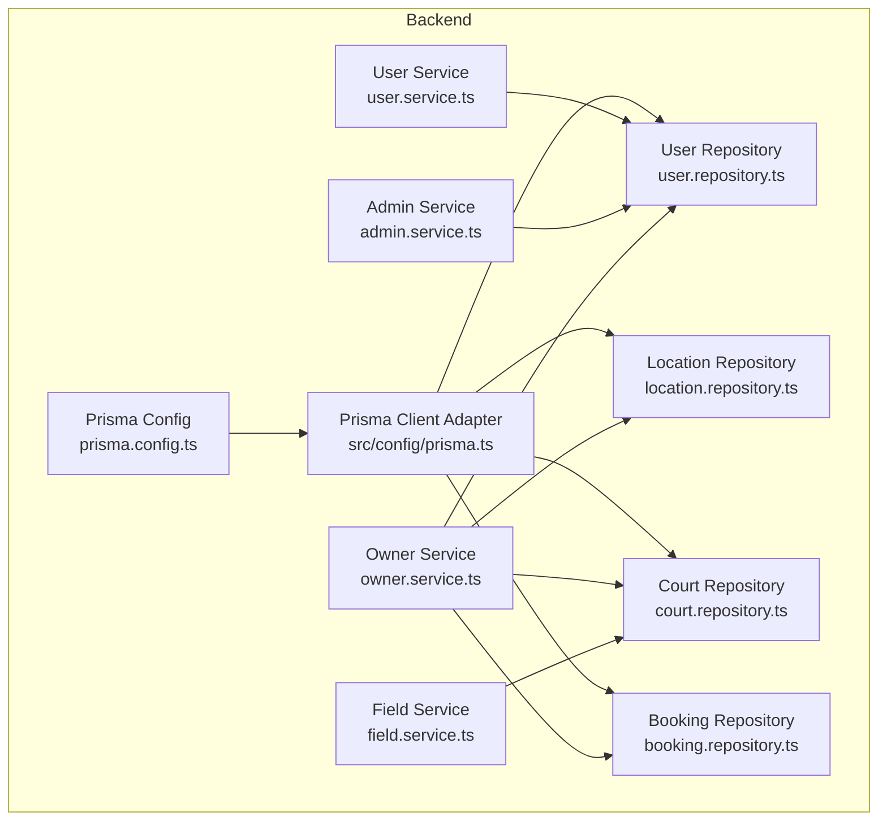
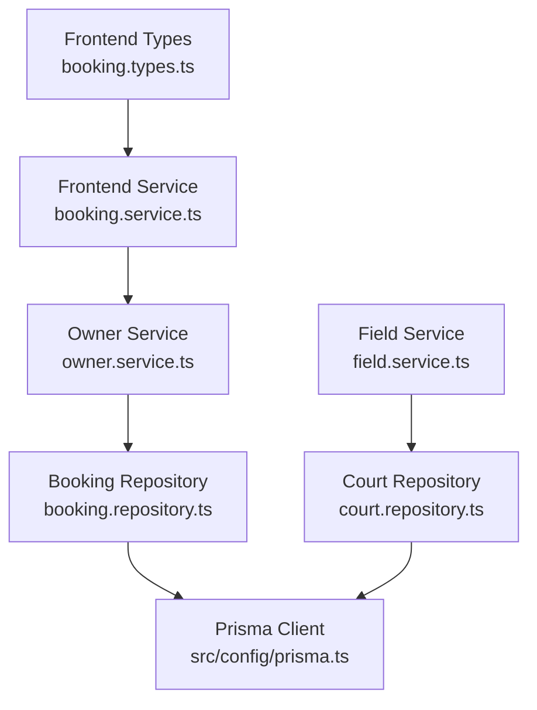
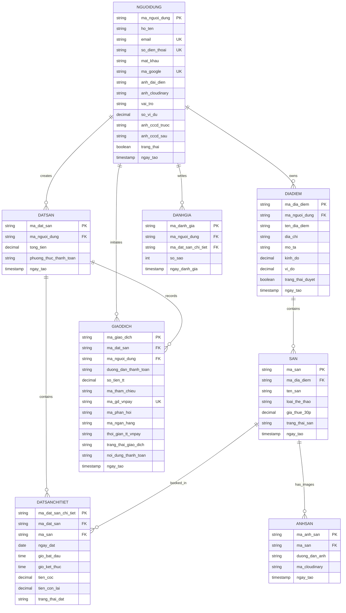
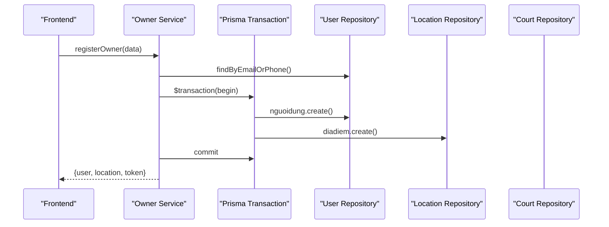
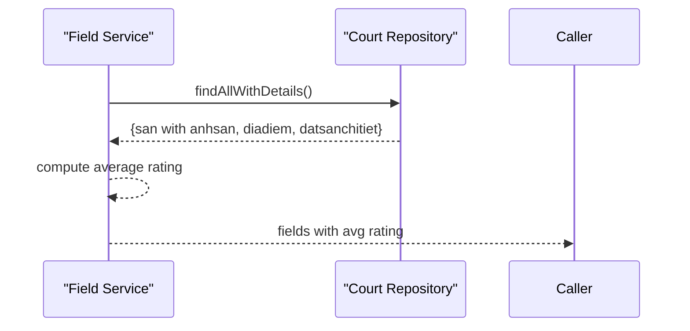
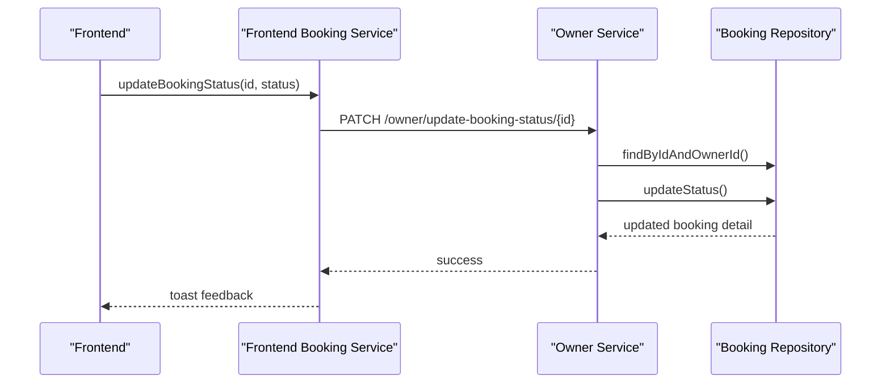
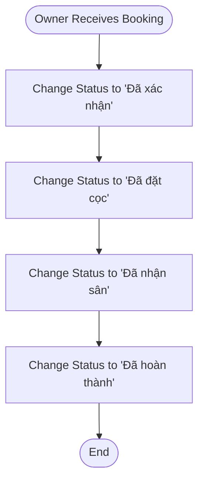
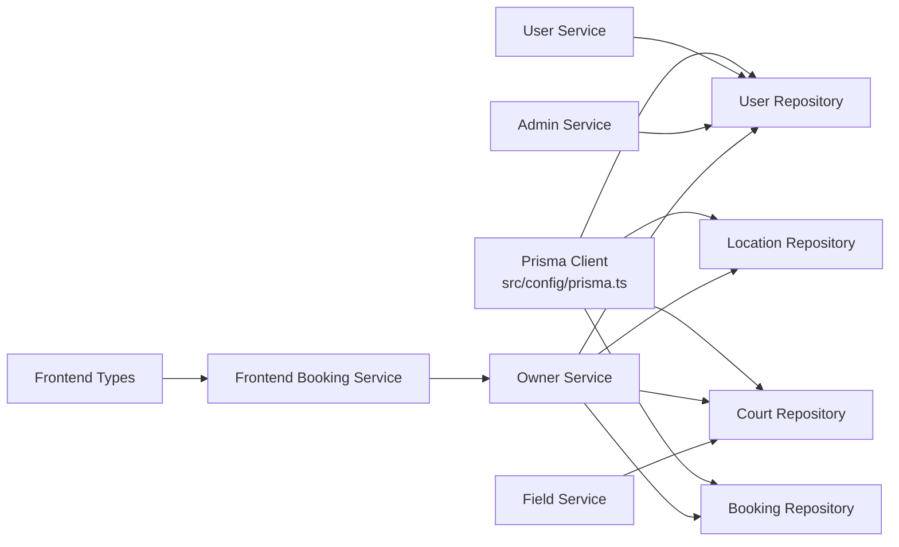

# Database Schema & Models

<cite>
**Referenced Files in This Document**
- [schema.prisma](file://backend/prisma/schema.prisma)
- [prisma.config.ts](file://backend/prisma.config.ts)
- [prisma.ts](file://backend/src/config/prisma.ts)
- [user.repository.ts](file://backend/src/repositories/user.repository.ts)
- [location.repository.ts](file://backend/src/repositories/location.repository.ts)
- [court.repository.ts](file://backend/src/repositories/court.repository.ts)
- [booking.repository.ts](file://backend/src/repositories/booking.repository.ts)
- [user.service.ts](file://backend/src/services/user.service.ts)
- [admin.service.ts](file://backend/src/services/admin.service.ts)
- [owner.service.ts](file://backend/src/services/owner.service.ts)
- [field.service.ts](file://backend/src/services/field.service.ts)
- [booking.types.ts](file://frontend/src/types/booking.types.ts)
- [booking.service.ts](file://frontend/src/services/booking.service.ts)
</cite>

## Table of Contents
1. [Introduction](#introduction)
2. [Project Structure](#project-structure)
3. [Core Components](#core-components)
4. [Architecture Overview](#architecture-overview)
5. [Detailed Component Analysis](#detailed-component-analysis)
6. [Dependency Analysis](#dependency-analysis)
7. [Performance Considerations](#performance-considerations)
8. [Troubleshooting Guide](#troubleshooting-guide)
9. [Conclusion](#conclusion)
10. [Appendices](#appendices)

## Introduction
This document provides comprehensive database schema documentation for the sports facility booking platform. It details the 12 interconnected entities derived from the Prisma schema, including their primary keys, foreign keys, indexes, constraints, and business rule enforcement. It also explains normalization strategies, entity relationship diagrams, sample data structures, query patterns, migration procedures, seeding strategies, and performance optimization techniques.

## Project Structure
The database model is defined declaratively using Prisma ORM with PostgreSQL as the datasource. The schema defines all entities and their relationships. The backend uses Prisma Client with a PostgreSQL adapter and connection pooling. Repositories encapsulate data access patterns, while services orchestrate business logic and enforce domain rules.

**Diagram sources**
- [prisma.config.ts:1-14](file://backend/prisma.config.ts#L1-L14)
- [prisma.ts:1-10](file://backend/src/config/prisma.ts#L1-L10)
- [user.repository.ts:1-53](file://backend/src/repositories/user.repository.ts#L1-L53)
- [location.repository.ts:1-51](file://backend/src/repositories/location.repository.ts#L1-L51)
- [court.repository.ts:1-83](file://backend/src/repositories/court.repository.ts#L1-L83)
- [booking.repository.ts:1-49](file://backend/src/repositories/booking.repository.ts#L1-L49)
- [user.service.ts:1-69](file://backend/src/services/user.service.ts#L1-L69)
- [admin.service.ts:1-57](file://backend/src/services/admin.service.ts#L1-L57)
- [owner.service.ts:1-148](file://backend/src/services/owner.service.ts#L1-L148)
- [field.service.ts:1-42](file://backend/src/services/field.service.ts#L1-L42)

**Section sources**
- [prisma.config.ts:1-14](file://backend/prisma.config.ts#L1-L14)
- [prisma.ts:1-10](file://backend/src/config/prisma.ts#L1-L10)

## Core Components
This section documents each entity, its fields, constraints, and relationships. All entities are defined in the Prisma schema.

- Entity: User (nguoidung)
  - Purpose: Stores user profiles, roles, authentication credentials, and wallet balance.
  - Primary Key: ma_nguoi_dung
  - Unique Constraints: email, so_dien_thoai, ma_google
  - Default Values: vai_tro defaults to "Khách hàng"; so_vi_du defaults to 0.00; trang_thai defaults to false
  - Relationships:
    - One-to-many with Booking (datsan)
    - One-to-many with Review (danhgia)
    - One-to-many with Location (diadiem)
    - One-to-many with Payment (giaodich)

- Entity: Location (diadiem)
  - Purpose: Represents facility locations owned by users.
  - Primary Key: ma_dia_diem
  - Foreign Keys: ma_nguoi_dung references User
  - Indexes: Implicit index on ma_nguoi_dung (due to relation)
  - Relationships:
    - Many-to-one with User
    - One-to-many with Facility (san)

- Entity: Facility (san)
  - Purpose: Represents individual facilities (sports courts) within a location.
  - Primary Key: ma_san
  - Foreign Keys: ma_dia_diem references Location
  - Default Values: trang_thai_san defaults to "Đang hoạt động"
  - Relationships:
    - Many-to-one with Location
    - One-to-many with Facility Image (anhsan)
    - One-to-many with Booking Detail (datsanchitiet)

- Entity: Facility Image (anhsan)
  - Purpose: Stores image records for facilities.
  - Primary Key: ma_anh_san
  - Foreign Keys: ma_san references Facility
  - Relationships:
    - Many-to-one with Facility

- Entity: Booking (datsan)
  - Purpose: Represents top-level booking transactions.
  - Primary Key: ma_dat_san
  - Foreign Keys: ma_nguoi_dung references User
  - Default Values: phuong_thuc_thanh_toan stores payment method; ngay_tao defaults to now()
  - Relationships:
    - Many-to-one with User
    - One-to-many with Booking Detail (datsanchitiet)
    - One-to-many with Payment (giaodich)

- Entity: Booking Detail (datsanchitiet)
  - Purpose: Represents per-facility time slots within a booking.
  - Primary Key: ma_dat_san_chi_tiet
  - Foreign Keys: ma_dat_san references Booking; ma_san references Facility
  - Default Values: trang_thai_dat defaults to "Chờ xử lý"; tien_coc and tien_con_lai default to 0.00
  - Relationships:
    - Many-to-one with Booking
    - Many-to-one with Facility
    - One-to-many with Review (danhgia)

- Entity: Review (danhgia)
  - Purpose: Stores user reviews and ratings for booking details.
  - Primary Key: ma_danh_gia
  - Foreign Keys: ma_nguoi_dung references User; ma_dat_san_chi_tiet references Booking Detail
  - Relationships:
    - Many-to-one with User
    - Many-to-one with Booking Detail

- Entity: Payment (giaodich)
  - Purpose: Records payment transactions for bookings.
  - Primary Key: ma_giao_dich
  - Foreign Keys: ma_dat_san references Booking; ma_nguoi_dung references User
  - Unique Constraints: ma_gd_vnpay
  - Default Values: trang_thai_giao_dich defaults to "Chưa thanh toán"
  - Relationships:
    - Many-to-one with Booking
    - Many-to-one with User

Normalization and Business Rules:
- Strong normalization is applied with explicit foreign keys and referential integrity enforced by relations.
- Surrogate identifiers (VARCHAR(50)) are used for all entities to support custom ID generation strategies.
- Status fields (e.g., trang_thai_dat, trang_thai_giao_dich, trang_thai_san) are constrained to predefined values enforced by application logic and enums.
- Monetary fields use DECIMAL(15,2) to prevent floating-point precision errors.
- Timestamps use DateTime with microsecond precision where applicable.

**Section sources**
- [schema.prisma:10-125](file://backend/prisma/schema.prisma#L10-L125)

## Architecture Overview
The backend uses Prisma Client with a PostgreSQL adapter and connection pooling. Repositories encapsulate CRUD operations, while services coordinate transactions and enforce business rules. Frontend interacts with backend APIs to manage bookings and statuses.

**Diagram sources**
- [booking.types.ts:1-36](file://frontend/src/types/booking.types.ts#L1-L36)
- [booking.service.ts:1-12](file://frontend/src/services/booking.service.ts#L1-L12)
- [owner.service.ts:1-148](file://backend/src/services/owner.service.ts#L1-L148)
- [field.service.ts:1-42](file://backend/src/services/field.service.ts#L1-L42)
- [booking.repository.ts:1-49](file://backend/src/repositories/booking.repository.ts#L1-L49)
- [court.repository.ts:1-83](file://backend/src/repositories/court.repository.ts#L1-L83)
- [prisma.ts:1-10](file://backend/src/config/prisma.ts#L1-L10)

## Detailed Component Analysis

### Entity Relationship Diagram
The following ER diagram maps all 12 entities and their relationships as defined in the schema.

**Diagram sources**
- [schema.prisma:10-125](file://backend/prisma/schema.prisma#L10-L125)

### Sample Data Structures
Representative samples for key entities:

- User (nguoidung)
  - Fields: ma_nguoi_dung, ho_ten, email, so_dien_thoai, vai_tro, so_vi_du, trang_thai, ngay_tao
  - Example: U001, Nguyen Van A, user@example.com, 0901234567, "Khách hàng", 0.00, false, 2025-01-01

- Location (diadiem)
  - Fields: ma_dia_diem, ma_nguoi_dung, ten_dia_diem, dia_chi, kinh_do, vi_do, trang_thai_duyet, ngay_tao
  - Example: DD001, U001, "Sân bóng ABC", "123 Đường XYZ, TP.HCM", 106.8, 10.8, false, 2025-01-01

- Facility (san)
  - Fields: ma_san, ma_dia_diem, ten_san, loai_the_thao, gia_thue_30p, trang_thai_san, ngay_tao
  - Example: S001, DD001, "Sân số 1", "Bóng đá", 150000.00, "Đang hoạt động", 2025-01-01

- Facility Image (anhsan)
  - Fields: ma_anh_san, ma_san, duong_dan_anh, ma_cloudinary, ngay_tao
  - Example: IMG_abcde, S001, "https://example.com/img1.jpg", "cloud_public_id", 2025-01-01

- Booking (datsan)
  - Fields: ma_dat_san, ma_nguoi_dung, tong_tien, phuong_thuc_thanh_toan, ngay_tao
  - Example: BS001, U002, 300000.00, "Chuyển khoản", 2025-01-01

- Booking Detail (datsanchitiet)
  - Fields: ma_dat_san_chi_tiet, ma_dat_san, ma_san, ngay_dat, gio_bat_dau, gio_ket_thuc, tien_coc, tien_con_lai, trang_thai_dat
  - Example: BDC001, BS001, S001, 2025-01-10, 18:00:00, 19:30:00, 150000.00, 150000.00, "Chờ xử lý"

- Review (danhgia)
  - Fields: ma_danh_gia, ma_nguoi_dung, ma_dat_san_chi_tiet, so_sao, ngay_danh_gia
  - Example: DG001, U002, BDC001, 5, 2025-01-10

- Payment (giaodich)
  - Fields: ma_giao_dich, ma_dat_san, ma_nguoi_dung, so_tien_tt, ma_gd_vnpay, trang_thai_giao_dich, ngay_tao
  - Example: GD001, BS001, U002, 300000.00, "VP0000000000001", "Đã thanh toán", 2025-01-01

**Section sources**
- [schema.prisma:10-125](file://backend/prisma/schema.prisma#L10-L125)

### Query Patterns and Workflows

#### Owner Registration and Location/Court Creation

**Diagram sources**
- [owner.service.ts:11-64](file://backend/src/services/owner.service.ts#L11-L64)
- [user.repository.ts:10-16](file://backend/src/repositories/user.repository.ts#L10-L16)
- [location.repository.ts:23-32](file://backend/src/repositories/location.repository.ts#L23-L32)

#### Fetch Owner's Courts and Images

**Diagram sources**
- [field.service.ts:4-38](file://backend/src/services/field.service.ts#L4-L38)
- [court.repository.ts:52-64](file://backend/src/repositories/court.repository.ts#L52-L64)

#### Owner Updates Booking Status

**Diagram sources**
- [booking.service.ts:9-11](file://frontend/src/services/booking.service.ts#L9-L11)
- [owner.service.ts:135-144](file://backend/src/services/owner.service.ts#L135-L144)
- [booking.repository.ts:27-45](file://backend/src/repositories/booking.repository.ts#L27-L45)
- [booking.types.ts:1-36](file://frontend/src/types/booking.types.ts#L1-L36)

#### Booking Detail Status Flow

[No sources needed since this diagram shows conceptual workflow, not actual code structure]

## Dependency Analysis
Repositories depend on Prisma Client. Services depend on repositories and enforce business rules. Frontend types and services drive API interactions.

**Diagram sources**
- [prisma.ts:1-10](file://backend/src/config/prisma.ts#L1-L10)
- [user.repository.ts:1-53](file://backend/src/repositories/user.repository.ts#L1-L53)
- [location.repository.ts:1-51](file://backend/src/repositories/location.repository.ts#L1-L51)
- [court.repository.ts:1-83](file://backend/src/repositories/court.repository.ts#L1-L83)
- [booking.repository.ts:1-49](file://backend/src/repositories/booking.repository.ts#L1-L49)
- [user.service.ts:1-69](file://backend/src/services/user.service.ts#L1-L69)
- [admin.service.ts:1-57](file://backend/src/services/admin.service.ts#L1-L57)
- [owner.service.ts:1-148](file://backend/src/services/owner.service.ts#L1-L148)
- [field.service.ts:1-42](file://backend/src/services/field.service.ts#L1-L42)
- [booking.types.ts:1-36](file://frontend/src/types/booking.types.ts#L1-L36)
- [booking.service.ts:1-12](file://frontend/src/services/booking.service.ts#L1-L12)

**Section sources**
- [prisma.ts:1-10](file://backend/src/config/prisma.ts#L1-L10)
- [user.repository.ts:1-53](file://backend/src/repositories/user.repository.ts#L1-L53)
- [location.repository.ts:1-51](file://backend/src/repositories/location.repository.ts#L1-L51)
- [court.repository.ts:1-83](file://backend/src/repositories/court.repository.ts#L1-L83)
- [booking.repository.ts:1-49](file://backend/src/repositories/booking.repository.ts#L1-L49)
- [user.service.ts:1-69](file://backend/src/services/user.service.ts#L1-L69)
- [admin.service.ts:1-57](file://backend/src/services/admin.service.ts#L1-L57)
- [owner.service.ts:1-148](file://backend/src/services/owner.service.ts#L1-L148)
- [field.service.ts:1-42](file://backend/src/services/field.service.ts#L1-L42)
- [booking.types.ts:1-36](file://frontend/src/types/booking.types.ts#L1-L36)
- [booking.service.ts:1-12](file://frontend/src/services/booking.service.ts#L1-L12)

## Performance Considerations
- Indexing Strategy:
  - Implicit indexes on foreign keys (e.g., ma_nguoi_dung on diadiem, ma_dia_diem on san, ma_dat_san on datsanchitiet, ma_san on anhsan, ma_nguoi_dung on giaodich) improve join performance.
  - Consider adding composite indexes for frequent queries:
    - datsanchitiet(ngay_dat, san.ma_dia_diem) for owner booking filtering
    - giaodich(ma_gd_vnpay) for payment lookup
    - nguoidung(email, so_dien_thoai) for fast user lookup
- Query Optimization:
  - Use selective projections (include only required relations) to reduce payload sizes.
  - Prefer pagination for listing large collections (owners’ courts, bookings).
  - Cache computed averages (e.g., facility star ratings) periodically to avoid repeated aggregations.
- Data Types:
  - DECIMAL(15,2) ensures accurate monetary storage.
  - DateTime with microsecond precision supports precise audit trails.
- Transactions:
  - Group related writes (user + location creation) in a single transaction to maintain consistency and reduce round-trips.

[No sources needed since this section provides general guidance]

## Troubleshooting Guide
Common issues and resolutions:

- Duplicate Email or Phone:
  - Symptom: Registration/login fails with duplicate error.
  - Cause: Unique constraints on email and phone.
  - Resolution: Validate input early and prompt user to use another contact method.

- Booking Status Update Failures:
  - Symptom: Updating booking status returns not found.
  - Cause: Booking does not belong to the owner or ID mismatch.
  - Resolution: Verify ownership via repository checks before updating.

- Payment Reference Conflicts:
  - Symptom: Payment creation fails due to unique ma_gd_vnpay.
  - Cause: Duplicate payment reference.
  - Resolution: Generate unique ma_gd_vnpay per transaction and handle retries.

- ID Generation Gaps:
  - Symptom: Generated IDs skip numbers after restarts.
  - Cause: Sequential generation based on last inserted ID.
  - Resolution: Accept gaps; ensure uniqueness via constraints and avoid relying on sequential order.

**Section sources**
- [user.service.ts:11-21](file://backend/src/services/user.service.ts#L11-L21)
- [owner.service.ts:135-144](file://backend/src/services/owner.service.ts#L135-L144)
- [schema.prisma:72-89](file://backend/prisma/schema.prisma#L72-L89)
- [user.repository.ts:36-49](file://backend/src/repositories/user.repository.ts#L36-L49)

## Conclusion
The database schema employs strong normalization, explicit foreign keys, and carefully chosen data types to model a sports facility booking platform. Entities are interconnected to support user management, facility listings, bookings, payments, and reviews. The backend leverages Prisma for type-safe access, while services enforce business rules and maintain data integrity. Proper indexing, query optimization, and transactional writes ensure scalability and reliability.

[No sources needed since this section summarizes without analyzing specific files]

## Appendices

### Migration Procedures
- Initialize Prisma:
  - Configure datasource URL in environment variables.
  - Run Prisma CLI commands to introspect or migrate against the database.
- Apply Migrations:
  - Use Prisma’s migration workflow to evolve schema safely.
  - Keep migrations deterministic and reversible where possible.

**Section sources**
- [prisma.config.ts:6-14](file://backend/prisma.config.ts#L6-L14)

### Seeding Strategies
- Seed Users:
  - Insert initial admin and owner accounts with hashed passwords.
- Seed Locations and Facilities:
  - Create sample locations and facilities under seeded owners.
- Seed Reviews and Payments:
  - Populate representative reviews and payment records for demonstration.

[No sources needed since this section provides general guidance]