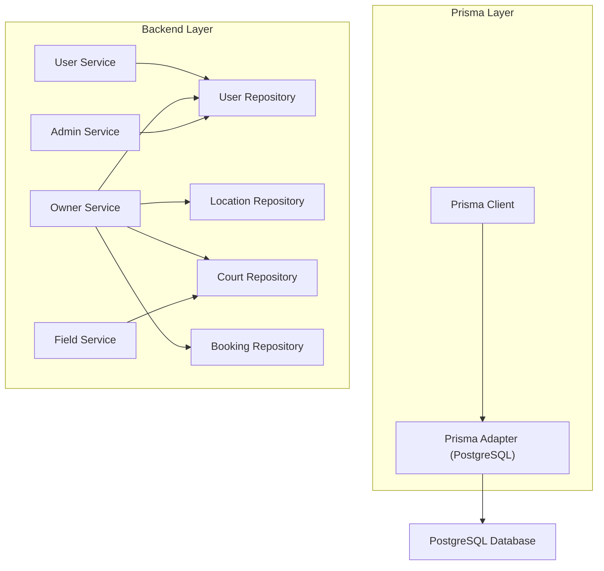
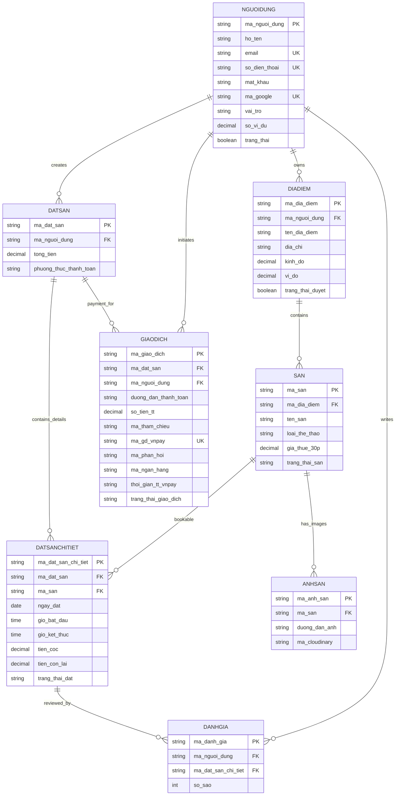
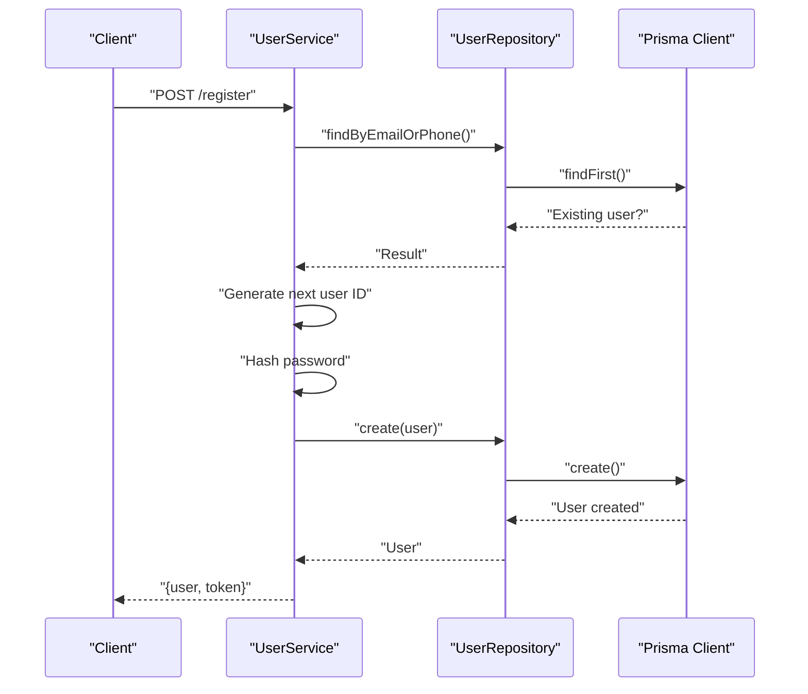
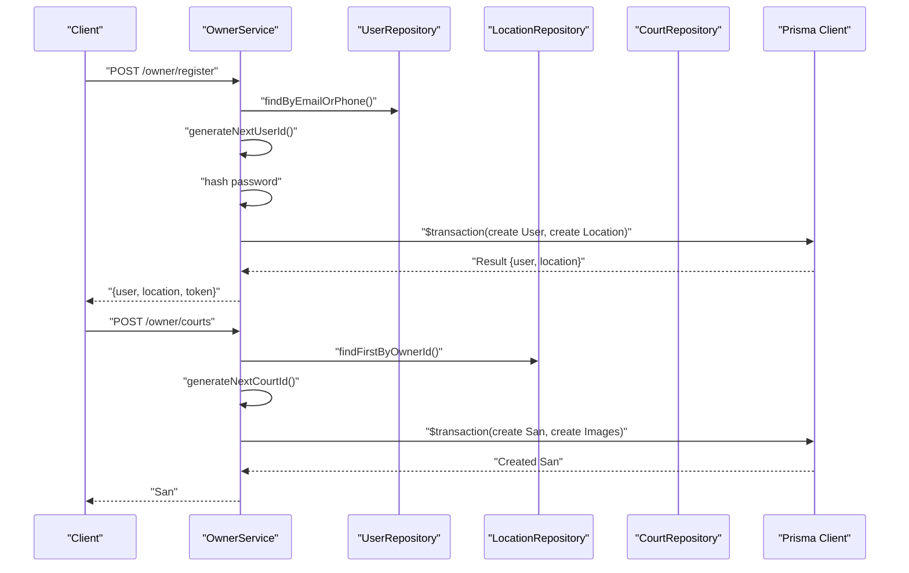
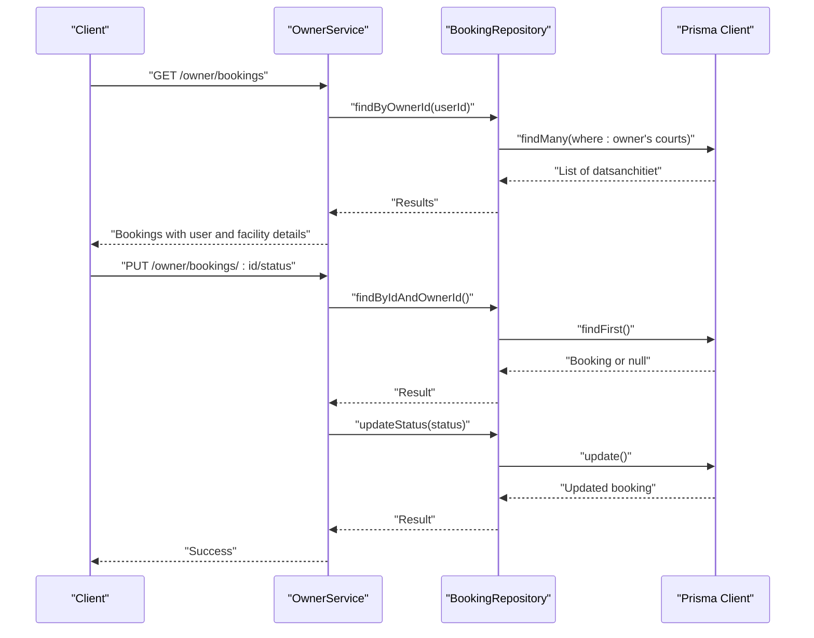
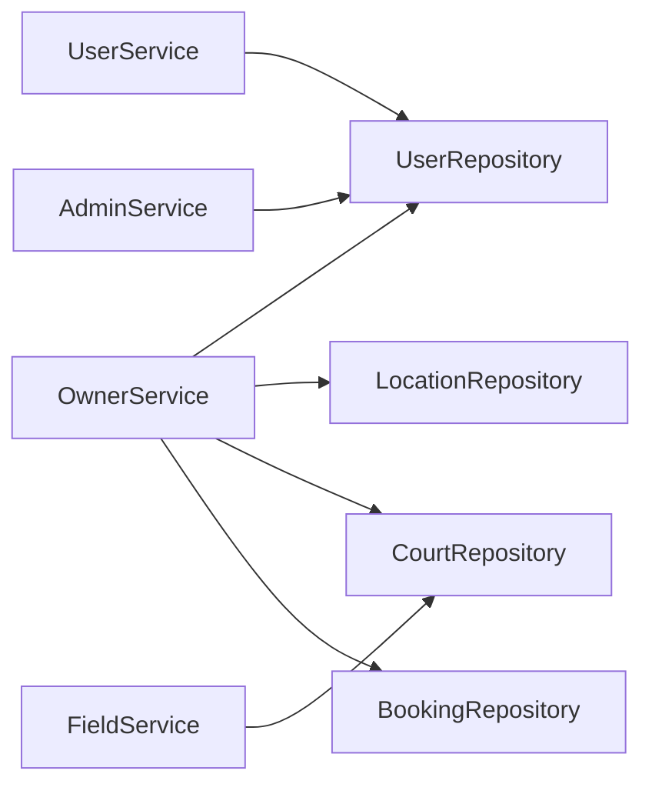

# Entity Relationships & ERD

<cite>
**Referenced Files in This Document**
- [schema.prisma](file://backend/prisma/schema.prisma)
- [prisma.ts](file://backend/src/config/prisma.ts)
- [user.repository.ts](file://backend/src/repositories/user.repository.ts)
- [location.repository.ts](file://backend/src/repositories/location.repository.ts)
- [court.repository.ts](file://backend/src/repositories/court.repository.ts)
- [booking.repository.ts](file://backend/src/repositories/booking.repository.ts)
- [user.service.ts](file://backend/src/services/user.service.ts)
- [owner.service.ts](file://backend/src/services/owner.service.ts)
- [admin.service.ts](file://backend/src/services/admin.service.ts)
- [field.service.ts](file://backend/src/services/field.service.ts)
- [user.type.ts](file://backend/src/types/user.type.ts)
- [owner.type.ts](file://backend/src/types/owner.type.ts)
- [booksport.type.ts](file://backend/src/types/booksport.type.ts)
</cite>

## Table of Contents
1. [Introduction](#introduction)
2. [Project Structure](#project-structure)
3. [Core Components](#core-components)
4. [Architecture Overview](#architecture-overview)
5. [Detailed Component Analysis](#detailed-component-analysis)
6. [Dependency Analysis](#dependency-analysis)
7. [Performance Considerations](#performance-considerations)
8. [Troubleshooting Guide](#troubleshooting-guide)
9. [Conclusion](#conclusion)
10. [Appendices](#appendices)

## Introduction
This document provides comprehensive entity relationship documentation for the sports facility booking platform database. It details the 12 interconnected entities defined in the Prisma schema, including primary keys, foreign keys, cardinalities, referential integrity constraints, and business logic behind each relationship. It also covers cascade behaviors, data consistency rules, and optimization strategies for common operations.

## Project Structure
The database model is defined declaratively in the Prisma schema and mapped to PostgreSQL via Prisma Client. The backend uses a layered architecture:
- Repositories encapsulate raw Prisma queries and ID generation logic
- Services orchestrate business workflows and enforce validation
- Controllers handle HTTP requests and responses
- Types define request/response contracts

**Diagram sources**
- [prisma.ts:1-10](file://backend/src/config/prisma.ts#L1-L10)
- [user.repository.ts:1-53](file://backend/src/repositories/user.repository.ts#L1-L53)
- [location.repository.ts:1-51](file://backend/src/repositories/location.repository.ts#L1-L51)
- [court.repository.ts:1-83](file://backend/src/repositories/court.repository.ts#L1-L83)
- [booking.repository.ts:1-49](file://backend/src/repositories/booking.repository.ts#L1-L49)
- [user.service.ts:1-69](file://backend/src/services/user.service.ts#L1-L69)
- [owner.service.ts:1-148](file://backend/src/services/owner.service.ts#L1-L148)
- [admin.service.ts:1-57](file://backend/src/services/admin.service.ts#L1-L57)
- [field.service.ts:1-42](file://backend/src/services/field.service.ts#L1-L42)

**Section sources**
- [prisma.ts:1-10](file://backend/src/config/prisma.ts#L1-L10)
- [schema.prisma:1-126](file://backend/prisma/schema.prisma#L1-L126)

## Core Components
This section documents the 12 entities and their relationships as defined in the Prisma schema.

- User (nguoidung)
  - Primary key: ma_nguoi_dung
  - Unique constraints: email, so_dien_thoai, ma_google
  - Roles: default "Khách hàng"; owners have role "Chủ sân"
  - Relationships:
    - One-to-many with Booking (datsan)
    - One-to-many with Review (danhgia)
    - One-to-many with Location (diadiem)
    - One-to-many with Payment (giaodich)

- Location (diadiem)
  - Primary key: ma_dia_diem
  - Foreign key: ma_nguoi_dung -> User (nguoidung)
  - Relationships:
    - Many-to-one with User (nguoidung)
    - One-to-many with Facility (san)

- Facility (san)
  - Primary key: ma_san
  - Foreign key: ma_dia_diem -> Location (diadiem)
  - Relationships:
    - Many-to-one with Location (diadiem)
    - One-to-many with BookingDetail (datsanchitiet)
    - One-to-many with Image (anhsan)

- Booking (datsan)
  - Primary key: ma_dat_san
  - Foreign key: ma_nguoi_dung -> User (nguoidung)
  - Relationships:
    - Many-to-one with User (nguoidung)
    - One-to-many with BookingDetail (datsanchitiet)
    - One-to-many with Payment (giaodich)

- BookingDetail (datsanchitiet)
  - Primary key: ma_dat_san_chi_tiet
  - Foreign keys:
    - ma_dat_san -> Booking (datsan)
    - ma_san -> Facility (san)
  - Relationships:
    - Many-to-one with Booking (datsan)
    - Many-to-one with Facility (san)
    - One-to-many with Review (danhgia)

- Payment (giaodich)
  - Primary key: ma_giao_dich
  - Foreign keys:
    - ma_dat_san -> Booking (datsan)
    - ma_nguoi_dung -> User (nguoidung)
  - Relationships:
    - Many-to-one with Booking (datsan)
    - Many-to-one with User (nguoidung)

- Review (danhgia)
  - Primary key: ma_danh_gia
  - Foreign keys:
    - ma_nguoi_dung -> User (nguoidung)
    - ma_dat_san_chi_tiet -> BookingDetail (datsanchitiet)
  - Relationships:
    - Many-to-one with User (nguoidung)
    - Many-to-one with BookingDetail (datsanchitiet)

- Image (anhsan)
  - Primary key: ma_anh_san
  - Foreign key: ma_san -> Facility (san)
  - Relationships:
    - Many-to-one with Facility (san)

Key cardinalities and constraints:
- User 1 — n Booking
- User 1 — n Review
- User 1 — n Location
- User 1 — n Payment
- Location 1 — n Facility
- Facility 1 — n BookingDetail
- Facility 1 — n Image
- Booking 1 — n BookingDetail
- Booking 1 — n Payment
- BookingDetail 1 — n Review

Cascade behaviors:
- All relations use NoAction on delete/update in the Prisma schema. This preserves referential integrity at the application level and relies on explicit transactions and validations in services.

Business logic highlights:
- Owner registration creates a User and a Location in a single transaction.
- Owner adds Facilities to their Location and uploads Images.
- Users can create Bookings for Facilities and leave Reviews.
- Payments are recorded as separate records linked to Bookings.

**Section sources**
- [schema.prisma:10-126](file://backend/prisma/schema.prisma#L10-L126)
- [owner.service.ts:31-59](file://backend/src/services/owner.service.ts#L31-L59)
- [court.repository.ts:48-50](file://backend/src/repositories/court.repository.ts#L48-L50)
- [field.service.ts:7-38](file://backend/src/services/field.service.ts#L7-L38)

## Architecture Overview
The ERD below maps the 12 entities and their relationships. Parent-child hierarchies are shown with arrows pointing from child to parent. Many-to-many relationships are represented as associative links.

**Diagram sources**
- [schema.prisma:10-126](file://backend/prisma/schema.prisma#L10-L126)

## Detailed Component Analysis

### User Management
- Responsibilities:
  - Registration and login for customers
  - Role assignment and account state management
- Key flows:
  - Duplicate detection by email or phone
  - Next ID generation with numeric padding
  - Password hashing before persistence
- Cascade and integrity:
  - NoAction cascades in schema; referential integrity enforced by service-level checks

**Diagram sources**
- [user.service.ts:8-42](file://backend/src/services/user.service.ts#L8-L42)
- [user.repository.ts:10-34](file://backend/src/repositories/user.repository.ts#L10-L34)

**Section sources**
- [user.service.ts:1-69](file://backend/src/services/user.service.ts#L1-L69)
- [user.repository.ts:1-53](file://backend/src/repositories/user.repository.ts#L1-L53)
- [user.type.ts:1-13](file://backend/src/types/user.type.ts#L1-L13)

### Owner Onboarding and Facility Management
- Responsibilities:
  - Owner registration creates a User and a Location in a transaction
  - Add/update Facilities under the owner’s Location
  - Upload Facility images
  - Manage bookings for owned Facilities
- Business logic:
  - Owner ID and Location ID generation with numeric padding
  - Transaction ensures atomicity of User and Location creation
  - Validation prevents unauthorized updates to Facilities

**Diagram sources**
- [owner.service.ts:12-64](file://backend/src/services/owner.service.ts#L12-L64)
- [location.repository.ts:17-32](file://backend/src/repositories/location.repository.ts#L17-L32)
- [court.repository.ts:66-79](file://backend/src/repositories/court.repository.ts#L66-L79)

**Section sources**
- [owner.service.ts:1-148](file://backend/src/services/owner.service.ts#L1-L148)
- [location.repository.ts:1-51](file://backend/src/repositories/location.repository.ts#L1-L51)
- [court.repository.ts:1-83](file://backend/src/repositories/court.repository.ts#L1-L83)
- [owner.type.ts:1-17](file://backend/src/types/owner.type.ts#L1-L17)

### Booking and Review Workflow
- Responsibilities:
  - Retrieve bookings for an owner by joining BookingDetail with Facility and Location
  - Update booking status with ownership verification
  - Aggregate reviews to compute average star ratings for facilities
- Integrity:
  - NoAction cascades; service-level checks ensure ownership before updates

**Diagram sources**
- [owner.service.ts:131-144](file://backend/src/services/owner.service.ts#L131-L144)
- [booking.repository.ts:4-38](file://backend/src/repositories/booking.repository.ts#L4-L38)

**Section sources**
- [booking.repository.ts:1-49](file://backend/src/repositories/booking.repository.ts#L1-L49)
- [field.service.ts:4-38](file://backend/src/services/field.service.ts#L4-L38)

### Data Consistency and Cascade Behaviors
- Current schema uses NoAction for all relations. This means:
  - Deleting a parent does not automatically delete children
  - Updating a parent key requires manual propagation
- Recommended application-level safeguards:
  - Enforce ownership checks before updates/deletes
  - Use transactions for multi-entity writes (as implemented)
  - Validate referential integrity in services before persisting

**Section sources**
- [schema.prisma:16-17](file://backend/prisma/schema.prisma#L16-L17)
- [schema.prisma:26-27](file://backend/prisma/schema.prisma#L26-L27)
- [schema.prisma:37-39](file://backend/prisma/schema.prisma#L37-L39)
- [schema.prisma:54-55](file://backend/prisma/schema.prisma#L54-L55)
- [schema.prisma:87-88](file://backend/prisma/schema.prisma#L87-L88)
- [owner.service.ts:31-59](file://backend/src/services/owner.service.ts#L31-L59)

## Dependency Analysis
The following diagram shows module-level dependencies among repositories and services.

**Diagram sources**
- [user.service.ts:1-69](file://backend/src/services/user.service.ts#L1-L69)
- [owner.service.ts:1-148](file://backend/src/services/owner.service.ts#L1-L148)
- [admin.service.ts:1-57](file://backend/src/services/admin.service.ts#L1-L57)
- [field.service.ts:1-42](file://backend/src/services/field.service.ts#L1-L42)
- [user.repository.ts:1-53](file://backend/src/repositories/user.repository.ts#L1-L53)
- [location.repository.ts:1-51](file://backend/src/repositories/location.repository.ts#L1-L51)
- [court.repository.ts:1-83](file://backend/src/repositories/court.repository.ts#L1-L83)
- [booking.repository.ts:1-49](file://backend/src/repositories/booking.repository.ts#L1-L49)

**Section sources**
- [user.service.ts:1-69](file://backend/src/services/user.service.ts#L1-L69)
- [owner.service.ts:1-148](file://backend/src/services/owner.service.ts#L1-L148)
- [admin.service.ts:1-57](file://backend/src/services/admin.service.ts#L1-L57)
- [field.service.ts:1-42](file://backend/src/services/field.service.ts#L1-L42)

## Performance Considerations
- Indexes and unique constraints:
  - Email, phone, Google ID, and VNPay reference are unique; ensure database maintains these constraints efficiently.
- Query patterns:
  - Use includes selectively to avoid N+1 selects (as seen in repositories).
  - Prefer filtered queries with where clauses to limit result sets.
- Transactions:
  - Group related writes (e.g., User + Location, San + Images) to reduce partial failures and improve consistency.
- ID generation:
  - Numeric padding ensures lexicographic ordering; consider UUIDs if scalability and distributed generation are concerns.

[No sources needed since this section provides general guidance]

## Troubleshooting Guide
Common issues and resolutions:
- Duplicate user registration:
  - Symptom: Registration fails with duplicate email or phone.
  - Resolution: Service checks existence before creating; ensure unique constraints are enforced.
- Unauthorized booking updates:
  - Symptom: Attempt to update booking status fails.
  - Resolution: Service validates ownership via repository; ensure correct user ID is passed.
- Missing location during facility creation:
  - Symptom: Cannot create facility because owner has no location.
  - Resolution: Service retrieves owner’s location; ensure owner registration completed.

**Section sources**
- [user.service.ts:11-21](file://backend/src/services/user.service.ts#L11-L21)
- [owner.service.ts:75-80](file://backend/src/services/owner.service.ts#L75-L80)
- [booking.repository.ts:27-37](file://backend/src/repositories/booking.repository.ts#L27-L37)

## Conclusion
The sports facility booking platform employs a clean relational model with explicit ownership and transactional integrity. The 12 entities form a coherent hierarchy enabling owner-managed facilities, customer bookings, payment tracking, and review aggregation. While the schema currently uses NoAction cascades, the services implement robust ownership checks and transactions to maintain data consistency. Optimizing queries and leveraging unique constraints will support scalable operations.

[No sources needed since this section summarizes without analyzing specific files]

## Appendices

### Entity Attribute Reference
- User (nguoidung): ma_nguoi_dung (PK), email (UK), so_dien_thoai (UK), vai_tro, trang_thai
- Location (diadiem): ma_dia_diem (PK), ma_nguoi_dung (FK), ten_dia_diem, dia_chi, kinh_do, vi_do
- Facility (san): ma_san (PK), ma_dia_diem (FK), ten_san, loai_the_thao, gia_thue_30p, trang_thai_san
- Booking (datsan): ma_dat_san (PK), ma_nguoi_dung (FK), tong_tien, phuong_thuc_thanh_toan
- BookingDetail (datsanchitiet): ma_dat_san_chi_tiet (PK), ma_dat_san (FK), ma_san (FK), ngay_dat, gio_bat_dau, gio_ket_thuc, tien_coc, tien_con_lai, trang_thai_dat
- Payment (giaodich): ma_giao_dich (PK), ma_dat_san (FK), ma_nguoi_dung (FK), so_tien_tt, ma_gd_vnpay (UK), trang_thai_giao_dich
- Review (danhgia): ma_danh_gia (PK), ma_nguoi_dung (FK), ma_dat_san_chi_tiet (FK), so_sao
- Image (anhsan): ma_anh_san (PK), ma_san (FK), duong_dan_anh, ma_cloudinary

**Section sources**
- [schema.prisma:10-126](file://backend/prisma/schema.prisma#L10-L126)