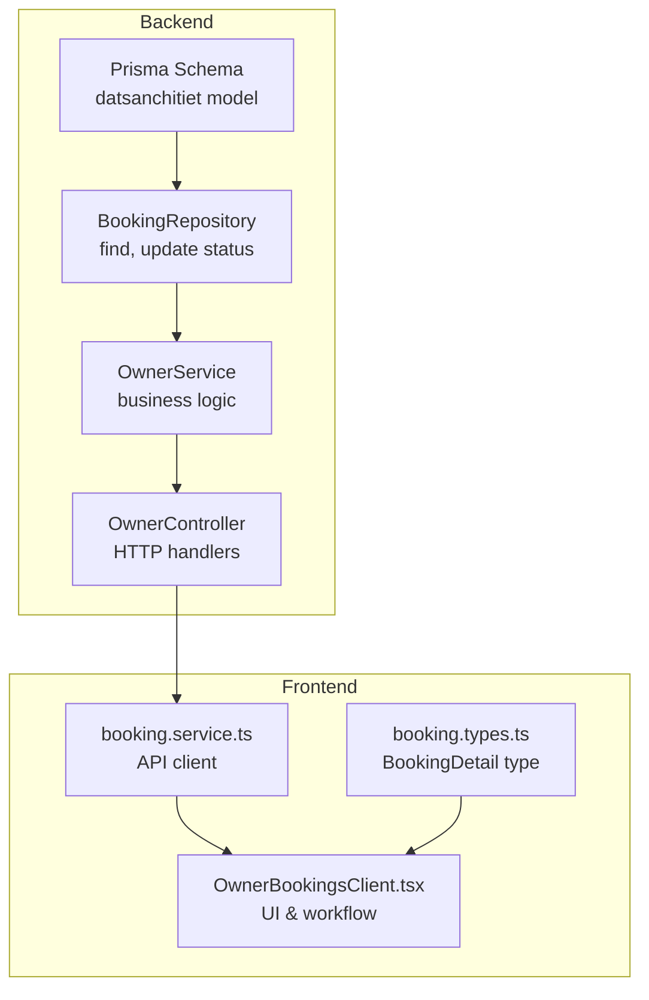
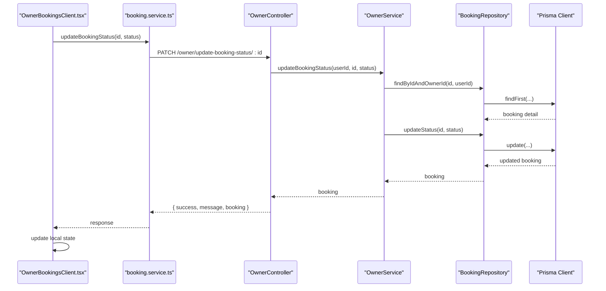
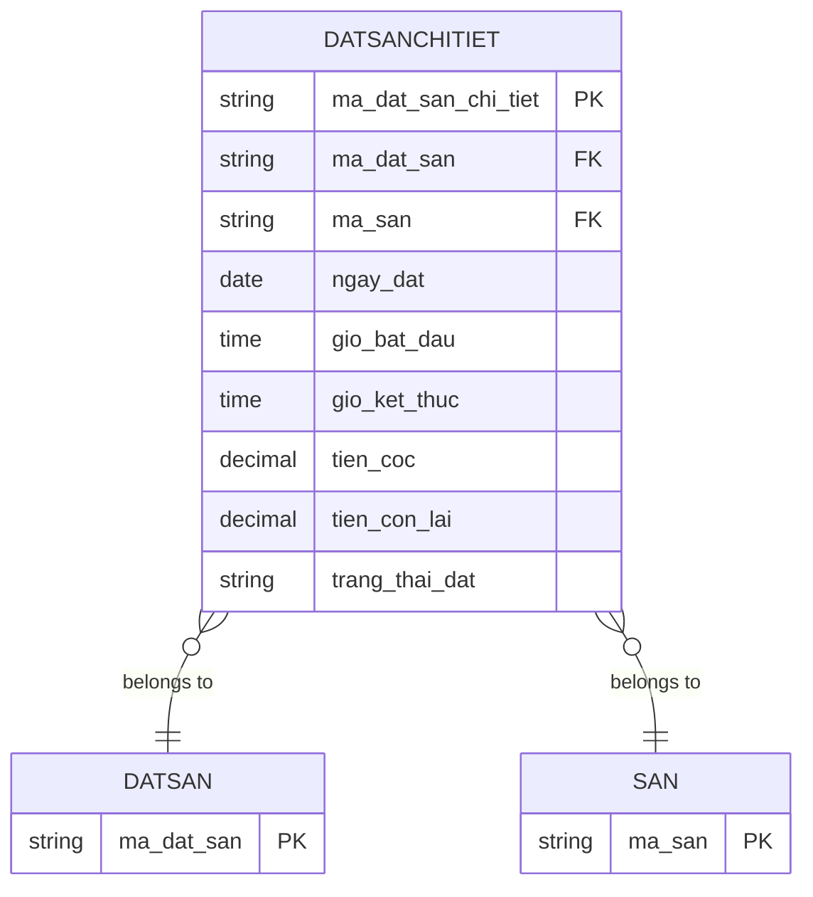
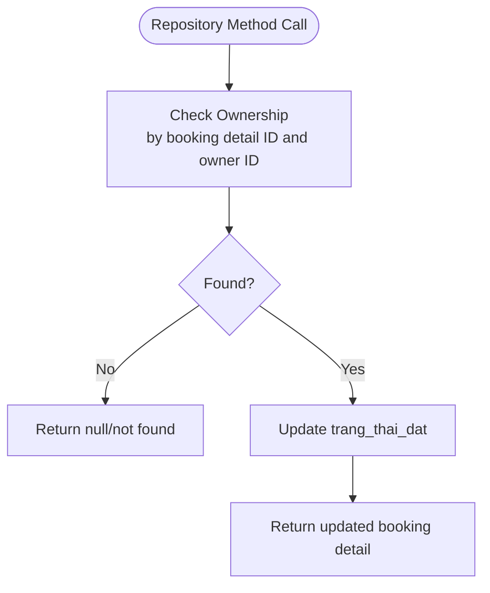
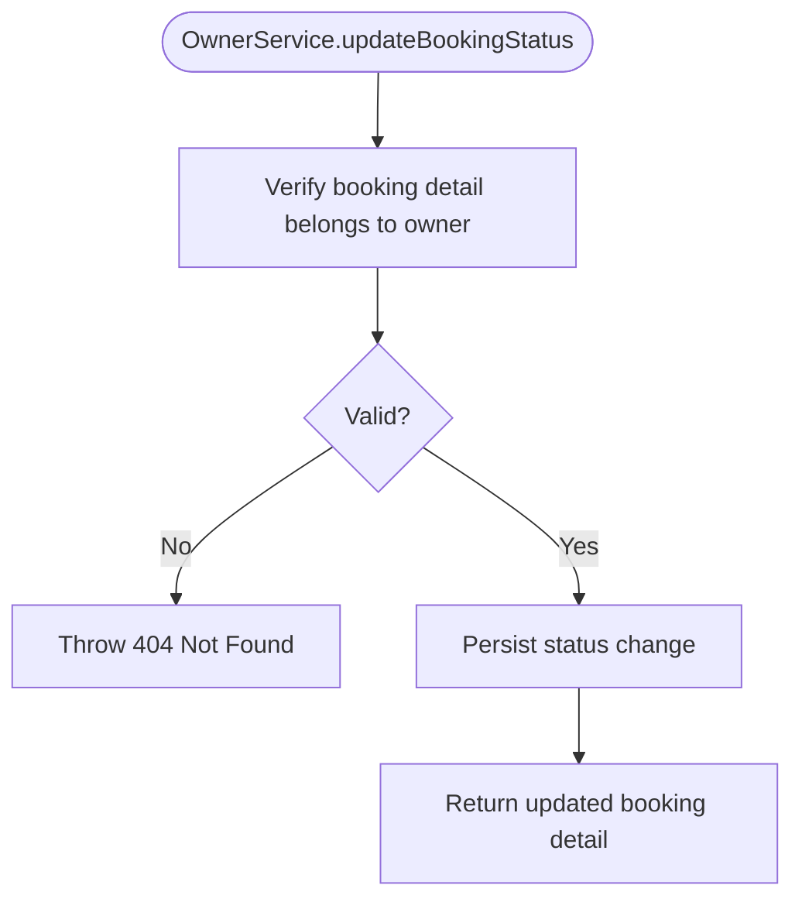
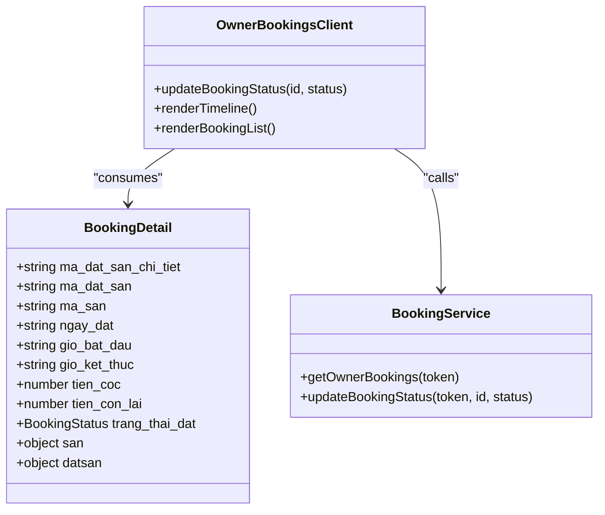
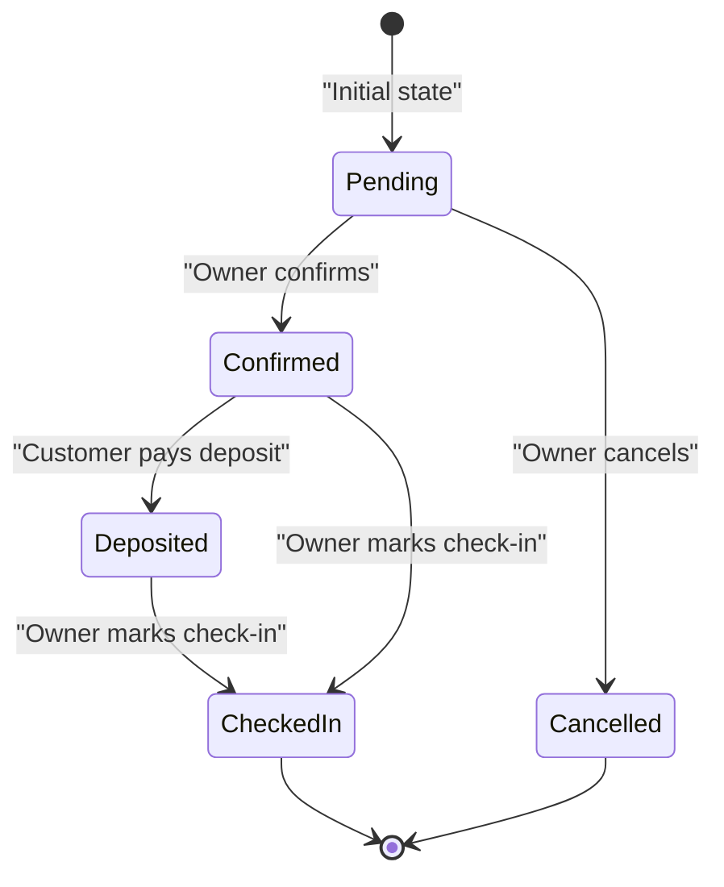
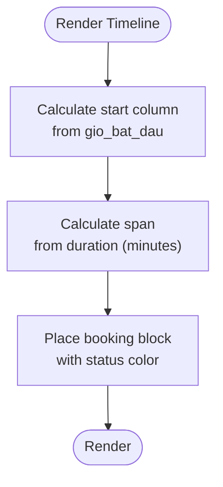
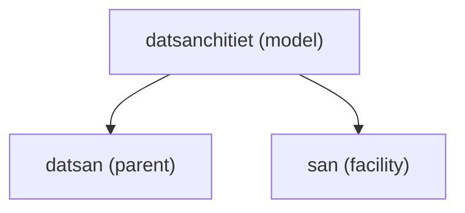

# Booking Detail Model

<cite>
**Referenced Files in This Document**
- [schema.prisma](file://backend/prisma/schema.prisma)
- [booking.repository.ts](file://backend/src/repositories/booking.repository.ts)
- [owner.service.ts](file://backend/src/services/owner.service.ts)
- [owner.controller.ts](file://backend/src/controllers/owner.controller.ts)
- [booking.types.ts](file://frontend/src/types/booking.types.ts)
- [booking.service.ts](file://frontend/src/services/booking.service.ts)
- [OwnerBookingsClient.tsx](file://frontend/src/components/owner/OwnerBookingsClient.tsx)
</cite>

## Table of Contents
1. [Introduction](#introduction)
2. [Project Structure](#project-structure)
3. [Core Components](#core-components)
4. [Architecture Overview](#architecture-overview)
5. [Detailed Component Analysis](#detailed-component-analysis)
6. [Dependency Analysis](#dependency-analysis)
7. [Performance Considerations](#performance-considerations)
8. [Troubleshooting Guide](#troubleshooting-guide)
9. [Conclusion](#conclusion)

## Introduction
This document provides comprehensive documentation for the Booking Detail model (datsanchitiet), which represents individual time slot bookings within a booking transaction. It covers all model fields, relationships to parent and related entities, status management workflow, and the business logic governing booking modifications and cancellations as implemented in the backend services and frontend components.

## Project Structure
The Booking Detail model is defined in the Prisma schema and integrated across backend repositories, services, and controllers, with the frontend consuming and displaying booking details for owners.

**Diagram sources**
- [schema.prisma:43-56](file://backend/prisma/schema.prisma#L43-L56)
- [booking.repository.ts:3-49](file://backend/src/repositories/booking.repository.ts#L3-L49)
- [owner.service.ts:131-144](file://backend/src/services/owner.service.ts#L131-L144)
- [owner.controller.ts:94-109](file://backend/src/controllers/owner.controller.ts#L94-L109)
- [booking.types.ts:3-25](file://frontend/src/types/booking.types.ts#L3-L25)
- [booking.service.ts:4-12](file://frontend/src/services/booking.service.ts#L4-L12)
- [OwnerBookingsClient.tsx:15-51](file://frontend/src/components/owner/OwnerBookingsClient.tsx#L15-L51)

**Section sources**
- [schema.prisma:43-56](file://backend/prisma/schema.prisma#L43-L56)
- [booking.repository.ts:3-49](file://backend/src/repositories/booking.repository.ts#L3-L49)
- [owner.service.ts:131-144](file://backend/src/services/owner.service.ts#L131-L144)
- [owner.controller.ts:94-109](file://backend/src/controllers/owner.controller.ts#L94-L109)
- [booking.types.ts:3-25](file://frontend/src/types/booking.types.ts#L3-L25)
- [booking.service.ts:4-12](file://frontend/src/services/booking.service.ts#L4-L12)
- [OwnerBookingsClient.tsx:15-51](file://frontend/src/components/owner/OwnerBookingsClient.tsx#L15-L51)

## Core Components
The Booking Detail model encapsulates a single time slot reservation with associated financial and status information. It links to the parent Booking transaction and the Facility (court) being booked.

Key fields and relationships:
- Primary key: ma_dat_san_chi_tiet (string identifier)
- Foreign keys: ma_dat_san (to datsan), ma_san (to san)
- Booking date: ngay_dat (date)
- Time slots: gio_bat_dau (time), gio_ket_thuc (time)
- Financials: tien_coc (deposit), tien_con_lai (remaining amount)
- Status: trang_thai_dat (default "Chờ xử lý")
- Relationships:
  - Belongs to datsan (parent booking)
  - Belongs to san (facility/court)

These fields are reflected in the Prisma schema and consumed by the frontend type definitions.

**Section sources**
- [schema.prisma:43-56](file://backend/prisma/schema.prisma#L43-L56)
- [booking.types.ts:3-25](file://frontend/src/types/booking.types.ts#L3-L25)

## Architecture Overview
The Booking Detail workflow spans the database model, backend repositories and services, HTTP controllers, and the frontend UI. Owners can view bookings, update statuses, and process check-ins.

**Diagram sources**
- [OwnerBookingsClient.tsx:44-51](file://frontend/src/components/owner/OwnerBookingsClient.tsx#L44-L51)
- [booking.service.ts:9-11](file://frontend/src/services/booking.service.ts#L9-L11)
- [owner.controller.ts:94-109](file://backend/src/controllers/owner.controller.ts#L94-L109)
- [owner.service.ts:135-144](file://backend/src/services/owner.service.ts#L135-L144)
- [booking.repository.ts:27-45](file://backend/src/repositories/booking.repository.ts#L27-L45)

## Detailed Component Analysis

### Data Model Definition
The Booking Detail model is defined in the Prisma schema with explicit defaults and relations.

**Diagram sources**
- [schema.prisma:43-56](file://backend/prisma/schema.prisma#L43-L56)
- [schema.prisma:31-40](file://backend/prisma/schema.prisma#L31-L40)
- [schema.prisma:114-125](file://backend/prisma/schema.prisma#L114-L125)

**Section sources**
- [schema.prisma:43-56](file://backend/prisma/schema.prisma#L43-L56)

### Backend Repository Layer
The repository handles data access for booking details, including fetching by owner and updating status.

- findByOwnerId: Retrieves booking details for a given owner, including related facility and booking header with user information.
- findByIdAndOwnerId: Validates ownership before allowing status updates.
- updateStatus: Updates the booking detail status.

**Diagram sources**
- [booking.repository.ts:27-45](file://backend/src/repositories/booking.repository.ts#L27-L45)

**Section sources**
- [booking.repository.ts:3-49](file://backend/src/repositories/booking.repository.ts#L3-L49)

### Business Logic and Workflow
The service layer enforces business rules:
- Ownership verification: Ensures the booking detail belongs to the requesting owner.
- Status transitions: Allows updating to predefined statuses exposed to owners.

**Diagram sources**
- [owner.service.ts:135-144](file://backend/src/services/owner.service.ts#L135-L144)

**Section sources**
- [owner.service.ts:131-144](file://backend/src/services/owner.service.ts#L131-L144)

### Frontend Integration and Types
The frontend consumes booking details through typed interfaces and interacts with the backend via API services.

- BookingDetail type defines the shape of booking records, including nested facility and booking header information.
- OwnerBookingsClient renders a timeline and list of bookings, enabling status updates and check-in actions.
- booking.service.ts provides typed API calls for retrieving bookings and updating status.

**Diagram sources**
- [booking.types.ts:3-25](file://frontend/src/types/booking.types.ts#L3-L25)
- [OwnerBookingsClient.tsx:15-51](file://frontend/src/components/owner/OwnerBookingsClient.tsx#L15-L51)
- [booking.service.ts:4-12](file://frontend/src/services/booking.service.ts#L4-L12)

**Section sources**
- [booking.types.ts:3-25](file://frontend/src/types/booking.types.ts#L3-L25)
- [OwnerBookingsClient.tsx:15-51](file://frontend/src/components/owner/OwnerBookingsClient.tsx#L15-L51)
- [booking.service.ts:4-12](file://frontend/src/services/booking.service.ts#L4-L12)

### Status Management Workflow
The system supports a finite set of booking statuses with owner-driven transitions:
- Chờ xử lý (Pending)
- Đã xác nhận (Confirmed)
- Đã đặt cọc (Deposit Paid)
- Đã nhận sân (Checked-in)
- Đã hủy (Cancelled)

The frontend enables:
- Confirming pending bookings
- Cancelling pending bookings
- Marking deposit-paid or confirmed bookings as checked-in
- Visual indicators and totals computed from tien_coc and datsan.tong_tien

**Diagram sources**
- [booking.types.ts:1](file://frontend/src/types/booking.types.ts#L1)
- [OwnerBookingsClient.tsx:195-231](file://frontend/src/components/owner/OwnerBookingsClient.tsx#L195-L231)
- [OwnerBookingsClient.tsx:256-269](file://frontend/src/components/owner/OwnerBookingsClient.tsx#L256-L269)

**Section sources**
- [booking.types.ts:1](file://frontend/src/types/booking.types.ts#L1)
- [OwnerBookingsClient.tsx:195-231](file://frontend/src/components/owner/OwnerBookingsClient.tsx#L195-L231)
- [OwnerBookingsClient.tsx:256-269](file://frontend/src/components/owner/OwnerBookingsClient.tsx#L256-L269)

### Deposit and Remaining Amount Handling
The frontend computes the remaining amount to collect during check-in using:
- datsan.tong_tien (total amount)
- tien_coc (already paid deposit)
- Remaining = total - deposit

This calculation is performed in the check-in modal and displayed to the owner.

**Section sources**
- [OwnerBookingsClient.tsx:256-269](file://frontend/src/components/owner/OwnerBookingsClient.tsx#L256-L269)

### Time Slot Rendering and Timeline Logic
The frontend renders a 24-hour timeline grid (5:00–22:00) with half-hour increments. Each booking detail is positioned based on:
- gio_bat_dau and gio_ket_thuc
- Column index calculated from start time
- Span width calculated from duration in minutes

**Diagram sources**
- [OwnerBookingsClient.tsx:57-70](file://frontend/src/components/owner/OwnerBookingsClient.tsx#L57-L70)
- [OwnerBookingsClient.tsx:147-169](file://frontend/src/components/owner/OwnerBookingsClient.tsx#L147-L169)

**Section sources**
- [OwnerBookingsClient.tsx:57-70](file://frontend/src/components/owner/OwnerBookingsClient.tsx#L57-L70)
- [OwnerBookingsClient.tsx:147-169](file://frontend/src/components/owner/OwnerBookingsClient.tsx#L147-L169)

## Dependency Analysis
The Booking Detail model depends on related entities and is accessed through a layered architecture.

**Diagram sources**
- [schema.prisma:43-56](file://backend/prisma/schema.prisma#L43-L56)
- [schema.prisma:31-40](file://backend/prisma/schema.prisma#L31-L40)
- [schema.prisma:114-125](file://backend/prisma/schema.prisma#L114-L125)

**Section sources**
- [schema.prisma:43-56](file://backend/prisma/schema.prisma#L43-L56)
- [schema.prisma:31-40](file://backend/prisma/schema.prisma#L31-L40)
- [schema.prisma:114-125](file://backend/prisma/schema.prisma#L114-L125)

## Performance Considerations
- Indexing: Ensure database indexes exist on frequently queried fields such as ma_dat_san, ma_san, ngay_dat, and ma_dat_san_chi_tiet to optimize filtering and joins.
- Aggregation: The frontend performs client-side counts and computations; consider server-side aggregation for large datasets to reduce payload sizes.
- Pagination: For extensive booking histories, implement pagination in the repository queries to limit result sets.

## Troubleshooting Guide
Common issues and resolutions:
- Not Found Errors: When updating status fails, verify the booking detail ID and owner association. The service throws a 404 if the booking does not belong to the owner.
- Status Validation: Only predefined statuses are accepted. Ensure the frontend sends valid status values.
- Timeline Positioning: Incorrect time slot rendering often stems from invalid time values or timezone mismatches. Validate gio_bat_dau and gio_ket_thuc formats.

**Section sources**
- [owner.service.ts:139-141](file://backend/src/services/owner.service.ts#L139-L141)
- [owner.controller.ts:100-102](file://backend/src/controllers/owner.controller.ts#L100-L102)
- [OwnerBookingsClient.tsx:57-70](file://frontend/src/components/owner/OwnerBookingsClient.tsx#L57-L70)

## Conclusion
The Booking Detail model (datsanchitiet) provides a structured representation of individual time slot bookings with clear relationships to parent transactions and facilities. The backend enforces ownership and status transitions, while the frontend delivers an intuitive UI for managing bookings, visualizing time slots, and processing check-ins. Adhering to the documented fields, relationships, and workflows ensures consistent behavior across the system.