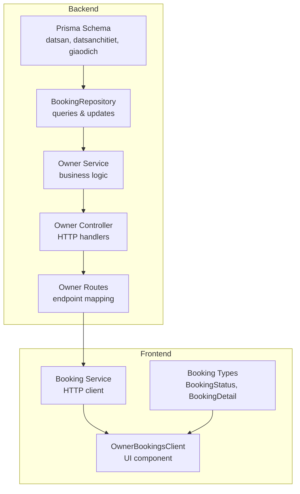
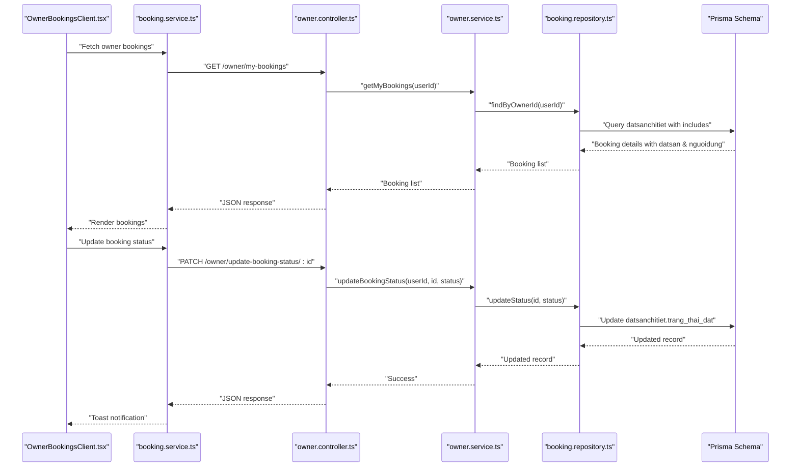
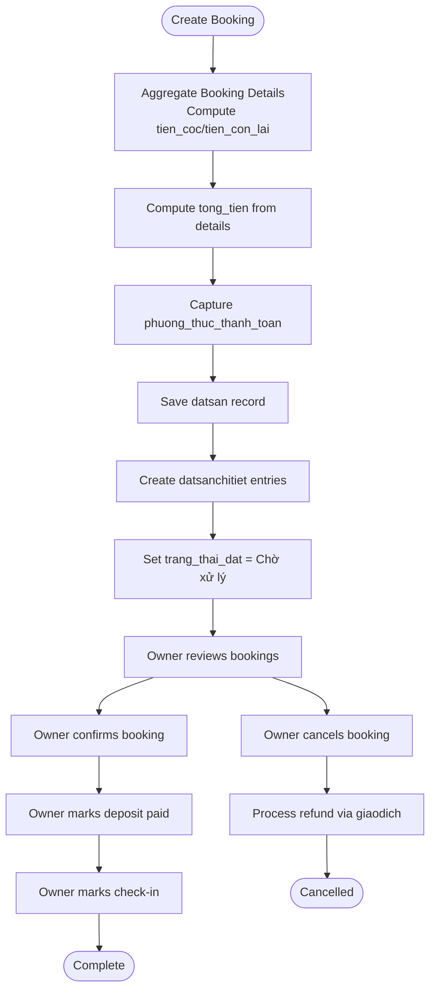
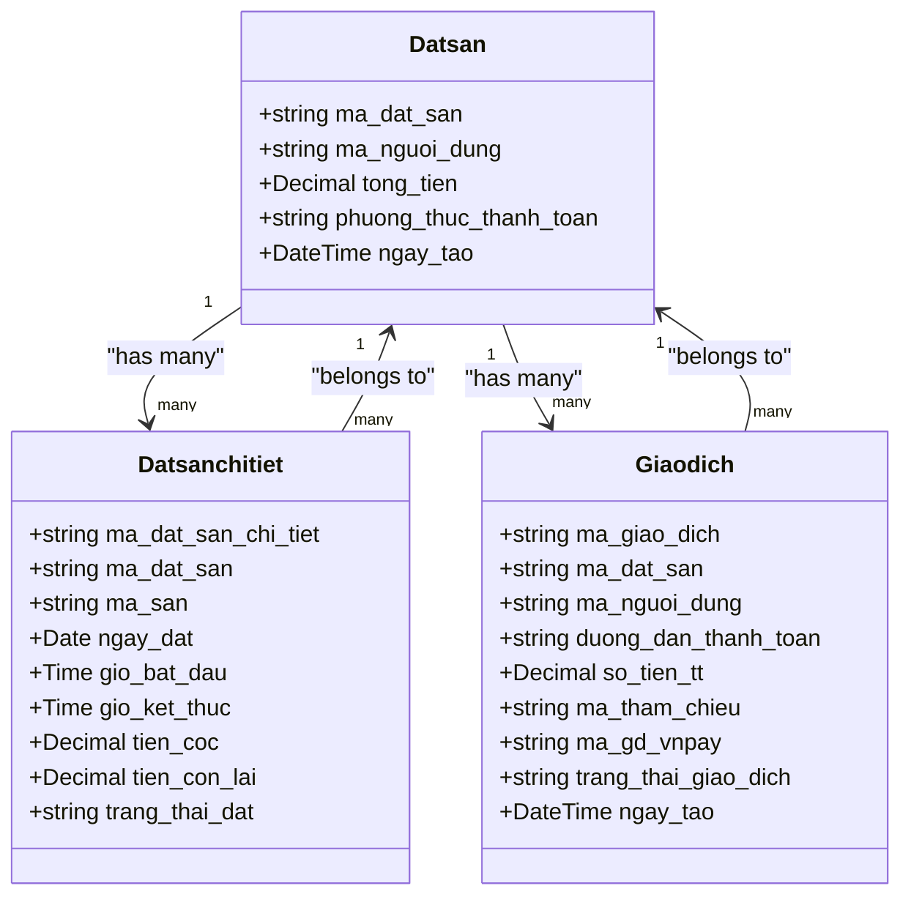

# Booking Model

<cite>
**Referenced Files in This Document**
- [schema.prisma](file://backend/prisma/schema.prisma)
- [booking.repository.ts](file://backend/src/repositories/booking.repository.ts)
- [owner.controller.ts](file://backend/src/controllers/owner.controller.ts)
- [owner.service.ts](file://backend/src/services/owner.service.ts)
- [owner.routes.ts](file://backend/src/routers/owner.routes.ts)
- [booking.types.ts](file://frontend/src/types/booking.types.ts)
- [booking.service.ts](file://frontend/src/services/booking.service.ts)
- [OwnerBookingsClient.tsx](file://frontend/src/components/owner/OwnerBookingsClient.tsx)
</cite>

## Table of Contents
1. [Introduction](#introduction)
2. [Project Structure](#project-structure)
3. [Core Components](#core-components)
4. [Architecture Overview](#architecture-overview)
5. [Detailed Component Analysis](#detailed-component-analysis)
6. [Dependency Analysis](#dependency-analysis)
7. [Performance Considerations](#performance-considerations)
8. [Troubleshooting Guide](#troubleshooting-guide)
9. [Conclusion](#conclusion)

## Introduction
This document provides comprehensive documentation for the Booking model (datsan) representing complete booking transactions in the platform. It explains the schema definition, relationships with related models (BookingDetail and Transaction), lifecycle of bookings, payment processing integration, and business logic for creation, modification, and cancellation. It also covers total amount calculation, payment method validation, and integration with the payment gateway for transaction processing.

## Project Structure
The Booking model is defined in the Prisma schema and integrated across backend services, repositories, controllers, and frontend components. The relevant files include:
- Prisma schema defining the datsan, datsanchitiet, and giaodich models
- Backend repository for booking queries
- Backend controller and service for owner-facing booking operations
- Frontend types and service for booking data exchange
- Frontend component for owner booking management UI

**Diagram sources**
- [schema.prisma:31-89](file://backend/prisma/schema.prisma#L31-L89)
- [booking.repository.ts:1-49](file://backend/src/repositories/booking.repository.ts#L1-L49)
- [owner.controller.ts:84-109](file://backend/src/controllers/owner.controller.ts#L84-L109)
- [owner.service.ts](file://backend/src/services/owner.service.ts)
- [owner.routes.ts](file://backend/src/routers/owner.routes.ts)
- [booking.types.ts:1-37](file://frontend/src/types/booking.types.ts#L1-L37)
- [booking.service.ts:1-12](file://frontend/src/services/booking.service.ts#L1-L12)
- [OwnerBookingsClient.tsx:40-215](file://frontend/src/components/owner/OwnerBookingsClient.tsx#L40-L215)

**Section sources**
- [schema.prisma:31-89](file://backend/prisma/schema.prisma#L31-L89)
- [booking.repository.ts:1-49](file://backend/src/repositories/booking.repository.ts#L1-L49)
- [owner.controller.ts:84-109](file://backend/src/controllers/owner.controller.ts#L84-L109)
- [owner.service.ts](file://backend/src/services/owner.service.ts)
- [owner.routes.ts](file://backend/src/routers/owner.routes.ts)
- [booking.types.ts:1-37](file://frontend/src/types/booking.types.ts#L1-L37)
- [booking.service.ts:1-12](file://frontend/src/services/booking.service.ts#L1-L12)
- [OwnerBookingsClient.tsx:40-215](file://frontend/src/components/owner/OwnerBookingsClient.tsx#L40-L215)

## Core Components
The Booking model (datsan) encapsulates a complete booking transaction. Its primary fields include:
- ma_dat_san (primary key): Unique identifier for the booking transaction
- ma_nguoi_dung (customer): Foreign key linking to the customer (nguoidung)
- tong_tien (total amount): Total booking cost stored as decimal with precision 15, scale 2
- phuong_thuc_thanh_toan (payment method): Payment method identifier stored as varchar(50)
- ngay_tao (created date): Timestamp with default value set to current time

Related models:
- BookingDetail (datsanchitiet): Individual booking slots linked to a booking transaction via ma_dat_san
- Transaction (giaodich): Payment transactions associated with a booking via ma_dat_san

Key relationships:
- One-to-many: datsan → datsanchitiet (via ma_dat_san)
- One-to-many: datsan → giaodich (via ma_dat_san)
- Many-to-one: datsanchitiet → datsan (via ma_dat_san)
- Many-to-one: giaodich → datsan (via ma_dat_san)

**Section sources**
- [schema.prisma:31-89](file://backend/prisma/schema.prisma#L31-L89)

## Architecture Overview
The booking lifecycle spans frontend UI, backend routes, services, repositories, and database models. The flow integrates with payment processing through transaction records.

**Diagram sources**
- [OwnerBookingsClient.tsx:40-215](file://frontend/src/components/owner/OwnerBookingsClient.tsx#L40-L215)
- [booking.service.ts:1-12](file://frontend/src/services/booking.service.ts#L1-L12)
- [owner.controller.ts:84-109](file://backend/src/controllers/owner.controller.ts#L84-L109)
- [owner.service.ts](file://backend/src/services/owner.service.ts)
- [booking.repository.ts:1-49](file://backend/src/repositories/booking.repository.ts#L1-L49)
- [schema.prisma:31-89](file://backend/prisma/schema.prisma#L31-L89)

## Detailed Component Analysis

### Booking Model (datsan)
- Identity: ma_dat_san (primary key)
- Customer: ma_nguoi_dung (foreign key to nguoidung)
- Financials: tong_tien (decimal), phuong_thuc_thanh_toan (varchar)
- Metadata: ngay_tao (timestamp)
- Relationships:
  - Has many datsanchitiet entries
  - Has many giaodich entries
  - Belongs to nguoidung (customer)

Payment processing integration:
- Transactions are recorded in giaodich with fields for payment reference, gateway identifiers, and status
- The booking total (tong_tien) reflects the aggregated cost of booking details

**Section sources**
- [schema.prisma:31-40](file://backend/prisma/schema.prisma#L31-L40)

### BookingDetail Model (datsanchitiet)
- Identity: ma_dat_san_chi_tiet (primary key)
- Transaction linkage: ma_dat_san (foreign key to datsan)
- Schedule: ngay_dat (date), gio_bat_dau/gio_ket_thuc (time)
- Payments: tien_coc (deposit), tien_con_lai (remaining)
- Status: trang_thai_dat (default "Chờ xử lý")
- Relationships:
  - Belongs to datsan
  - Belongs to san (court)

Status lifecycle:
- Chờ xử lý → Đã xác nhận → Đã đặt cọc → Đã nhận sân → Đã hủy

**Section sources**
- [schema.prisma:43-56](file://backend/prisma/schema.prisma#L43-L56)

### Transaction Model (giaodich)
- Identity: ma_giao_dich (primary key)
- Transaction linkage: ma_dat_san (foreign key to datsan)
- Payment metadata: duong_dan_thanh_toan, so_tien_tt, ma_tham_chieu, ma_gd_vnpay
- Bank and status: ma_ngan_hang, trang_thai_giao_dich
- Content: noi_dung_thanh_toan
- Timestamp: ngay_tao

Integration with payment gateway:
- Payment reference fields (ma_tham_chieu, ma_gd_vnpay) support VNPAY integration
- Transaction status (trang_thai_giao_dich) tracks payment outcomes

**Section sources**
- [schema.prisma:73-89](file://backend/prisma/schema.prisma#L73-L89)

### Repository Layer (BookingRepository)
Responsibilities:
- Fetch booking details by owner ID with includes for related entities
- Find specific booking detail by ID and owner ID
- Update booking detail status

Implementation highlights:
- Uses Prisma client to query datsanchitiet with nested includes for san and datsan with nguoidung
- Orders results by ngay_dat descending for chronological listing

**Section sources**
- [booking.repository.ts:1-49](file://backend/src/repositories/booking.repository.ts#L1-L49)

### Service Layer (Owner Service)
Responsibilities:
- Retrieve owner bookings by delegating to repository
- Update booking status by delegating to repository
- Business logic coordination for owner operations

Note: The service coordinates with the repository and controller to enforce business rules and data consistency.

**Section sources**
- [owner.service.ts](file://backend/src/services/owner.service.ts)

### Controller Layer (Owner Controller)
Endpoints:
- GET /owner/my-bookings: Returns owner's bookings with customer and court details
- PATCH /owner/update-booking-status/:id: Updates booking detail status after validation

Validation and error handling:
- Validates presence of required parameters (id, status)
- Throws structured errors for missing data
- Returns success messages aligned with status transitions

**Section sources**
- [owner.controller.ts:84-109](file://backend/src/controllers/owner.controller.ts#L84-L109)

### Frontend Integration
Types:
- BookingStatus: Enumerated statuses used in UI
- BookingDetail: Shape of booking data returned from backend
- Responses: Typed responses for owner bookings and status updates

Service:
- bookingService.getOwnerBookings: Fetches owner bookings
- bookingService.updateBookingStatus: Updates booking status

UI Component:
- OwnerBookingsClient renders booking calendar/grid
- Supports status transitions with toast notifications
- Displays customer and schedule details per booking slot

**Section sources**
- [booking.types.ts:1-37](file://frontend/src/types/booking.types.ts#L1-L37)
- [booking.service.ts:1-12](file://frontend/src/services/booking.service.ts#L1-L12)
- [OwnerBookingsClient.tsx:40-215](file://frontend/src/components/owner/OwnerBookingsClient.tsx#L40-L215)

### Booking Lifecycle and Business Logic
Creation:
- Booking creation involves aggregating individual booking details (datsanchitiet) into a transaction (datsan)
- Total amount (tong_tien) is computed from detail costs (tien_coc and tien_con_lai) during transaction assembly
- Payment method (phuong_thuc_thanh_toan) is captured at the transaction level

Modification:
- Owner updates booking detail status through predefined transitions
- Repository enforces owner permissions by filtering by owner ID
- UI provides controls for confirming, depositing, check-in, and canceling

Cancellation:
- Cancellation status is represented by "Đã hủy"
- Business logic should ensure refund processing through transaction records (giaodich)

Payment Processing Integration:
- Payment gateway integration is supported via transaction records (giaodich)
- Fields such as ma_gd_vnpay and trang_thai_giao_dich indicate payment outcome
- Frontend displays status-aligned messages and transitions

**Diagram sources**
- [schema.prisma:31-89](file://backend/prisma/schema.prisma#L31-L89)
- [booking.repository.ts:1-49](file://backend/src/repositories/booking.repository.ts#L1-L49)
- [owner.controller.ts:84-109](file://backend/src/controllers/owner.controller.ts#L84-L109)
- [OwnerBookingsClient.tsx:40-215](file://frontend/src/components/owner/OwnerBookingsClient.tsx#L40-L215)

## Dependency Analysis
The booking domain depends on:
- Prisma schema for data modeling and relationships
- Repository for data access patterns
- Service for business orchestration
- Controller for HTTP endpoint handling
- Frontend types and service for UI integration

**Diagram sources**
- [schema.prisma:31-89](file://backend/prisma/schema.prisma#L31-L89)

**Section sources**
- [schema.prisma:31-89](file://backend/prisma/schema.prisma#L31-L89)

## Performance Considerations
- Indexing: Ensure foreign keys (ma_dat_san, ma_nguoi_dung, ma_san) are indexed for efficient joins
- Pagination: For large datasets, implement pagination in repository queries
- Selectivity: Use targeted includes to avoid loading unnecessary relations
- Aggregation: Compute tong_tien efficiently at transaction creation time to avoid repeated calculations
- Caching: Cache frequently accessed booking lists for owners to reduce database load

## Troubleshooting Guide
Common issues and resolutions:
- Missing booking details: Verify includes in repository queries for san and datsan with nguoidung
- Status update failures: Ensure owner ID matches the booking detail's venue ownership
- Payment discrepancies: Cross-check giaodich records against datsan totals
- UI status mismatches: Confirm frontend BookingStatus enum aligns with backend statuses

Validation checks:
- Controller validates presence of id and status before processing
- Repository filters by owner ID to prevent unauthorized access
- Frontend types enforce shape consistency for booking data

**Section sources**
- [owner.controller.ts:84-109](file://backend/src/controllers/owner.controller.ts#L84-L109)
- [booking.repository.ts:1-49](file://backend/src/repositories/booking.repository.ts#L1-L49)
- [booking.types.ts:1-37](file://frontend/src/types/booking.types.ts#L1-L37)

## Conclusion
The Booking model (datsan) provides a robust foundation for managing complete booking transactions, integrating booking details and payment records. The defined relationships, lifecycle states, and payment gateway fields enable comprehensive booking management. The backend repository, service, and controller layers coordinate with frontend types and UI components to deliver a cohesive booking experience for owners.