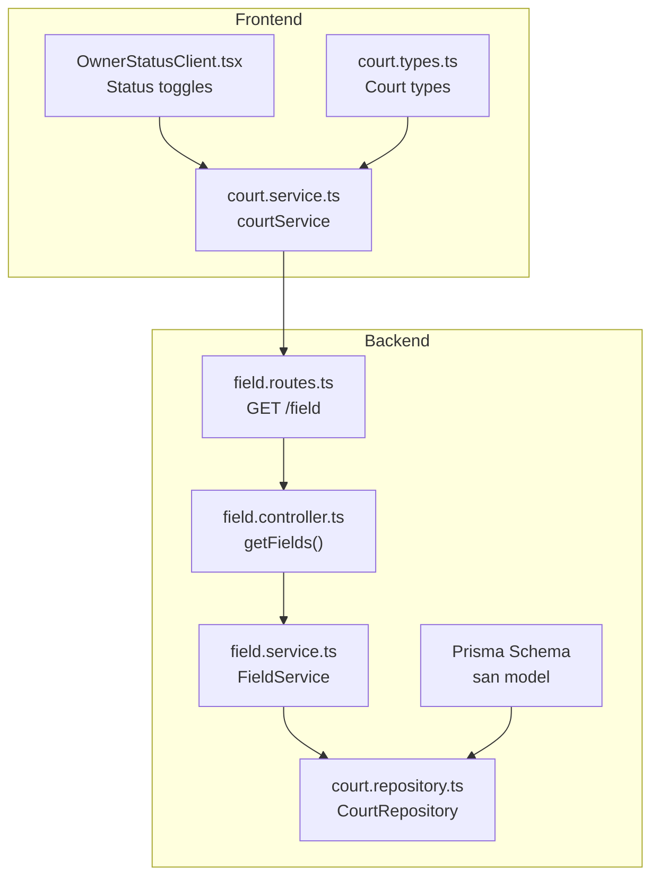
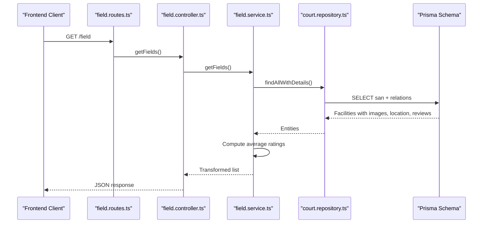
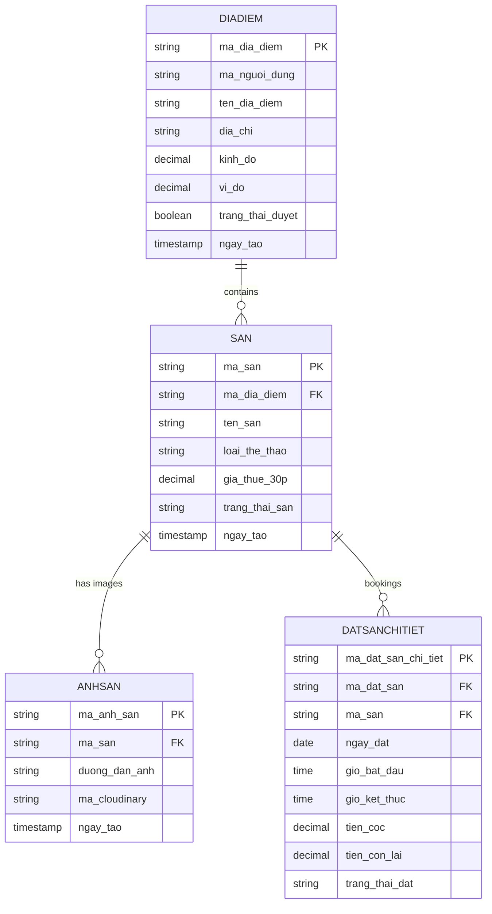
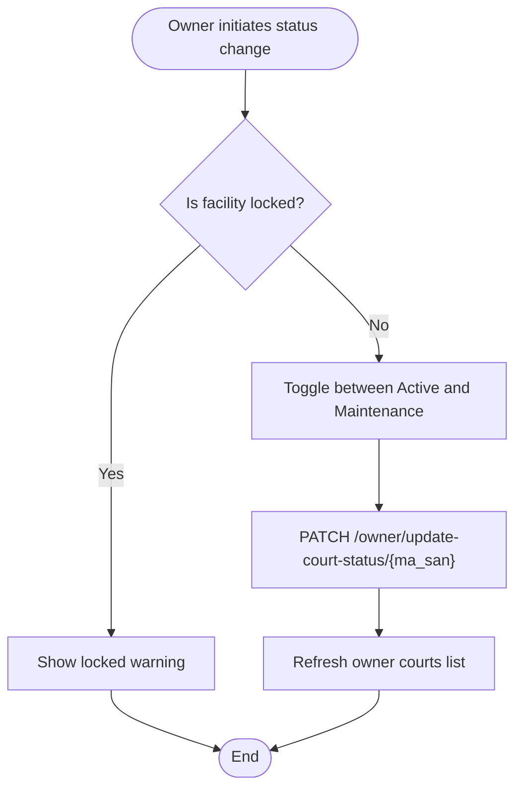
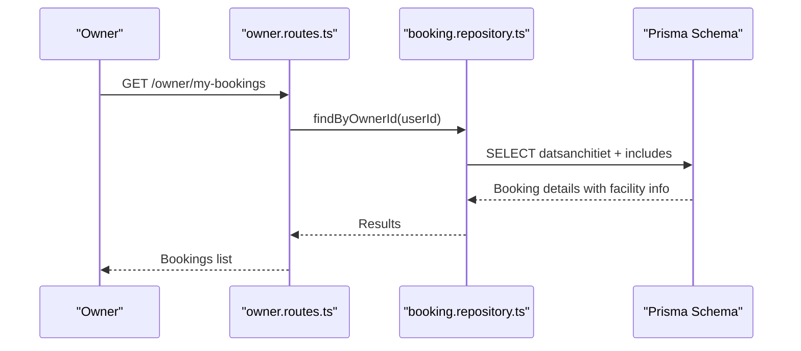
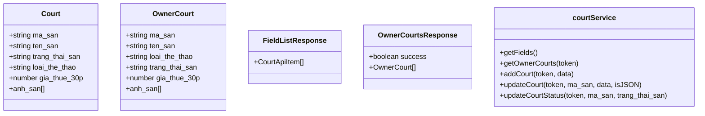
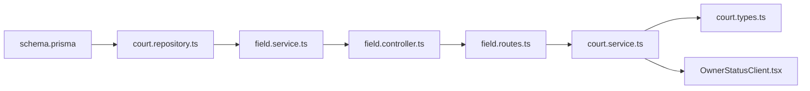
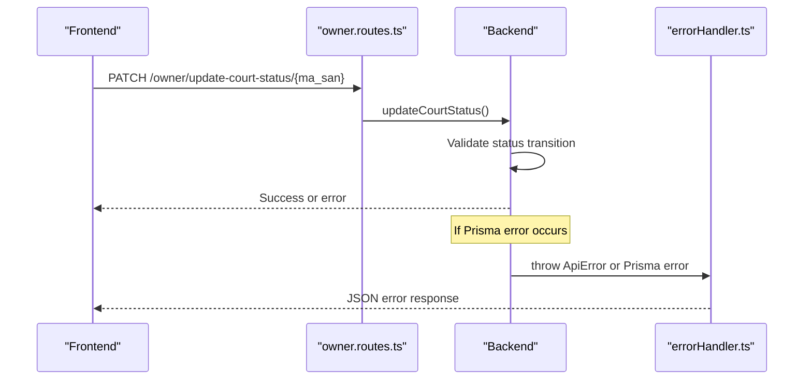

# Facility Model

<cite>
**Referenced Files in This Document**
- [schema.prisma](file://backend/prisma/schema.prisma)
- [field.routes.ts](file://backend/src/routers/field.routes.ts)
- [field.controller.ts](file://backend/src/controllers/field.controller.ts)
- [field.service.ts](file://backend/src/services/field.service.ts)
- [court.repository.ts](file://backend/src/repositories/court.repository.ts)
- [owner.routes.ts](file://backend/src/routers/owner.routes.ts)
- [court.types.ts](file://frontend/src/types/court.types.ts)
- [court.service.ts](file://frontend/src/services/court.service.ts)
- [OwnerStatusClient.tsx](file://frontend/src/components/owner/OwnerStatusClient.tsx)
- [sport.utils.ts](file://frontend/src/utils/sport.utils.ts)
- [booking.repository.ts](file://backend/src/repositories/booking.repository.ts)
- [errorHandler.ts](file://backend/src/middlewares/errorHandler.ts)
</cite>

## Table of Contents
1. [Introduction](#introduction)
2. [Project Structure](#project-structure)
3. [Core Components](#core-components)
4. [Architecture Overview](#architecture-overview)
5. [Detailed Component Analysis](#detailed-component-analysis)
6. [Dependency Analysis](#dependency-analysis)
7. [Performance Considerations](#performance-considerations)
8. [Troubleshooting Guide](#troubleshooting-guide)
9. [Conclusion](#conclusion)

## Introduction
This document provides comprehensive documentation for the Facility model (san) representing sports courts and facilities in the booking platform. It explains all fields, categorization by sports types, pricing structure, operational status management, and relationships with Location and Booking models. It also covers facility activation/deactivation workflows, pricing validation rules, and business logic for facility availability and maintenance status.

## Project Structure
The Facility model resides in the backend Prisma schema and is exposed via Express routes and controllers. Frontend components consume the data through service abstractions and present status controls for owners.

**Diagram sources**
- [schema.prisma:114-125](file://backend/prisma/schema.prisma#L114-L125)
- [field.routes.ts:1-5](file://backend/src/routers/field.routes.ts#L1-L5)
- [field.controller.ts:1-11](file://backend/src/controllers/field.controller.ts#L1-L11)
- [field.service.ts:1-42](file://backend/src/services/field.service.ts#L1-L42)
- [court.repository.ts:1-83](file://backend/src/repositories/court.repository.ts#L1-L83)
- [court.types.ts:1-82](file://frontend/src/types/court.types.ts#L1-L82)
- [court.service.ts:1-26](file://frontend/src/services/court.service.ts#L1-L26)
- [OwnerStatusClient.tsx:1-115](file://frontend/src/components/owner/OwnerStatusClient.tsx#L1-L115)

**Section sources**
- [schema.prisma:114-125](file://backend/prisma/schema.prisma#L114-L125)
- [field.routes.ts:1-5](file://backend/src/routers/field.routes.ts#L1-L5)
- [field.controller.ts:1-11](file://backend/src/controllers/field.controller.ts#L1-L11)
- [field.service.ts:1-42](file://backend/src/services/field.service.ts#L1-L42)
- [court.repository.ts:1-83](file://backend/src/repositories/court.repository.ts#L1-L83)
- [court.types.ts:1-82](file://frontend/src/types/court.types.ts#L1-L82)
- [court.service.ts:1-26](file://frontend/src/services/court.service.ts#L1-L26)
- [OwnerStatusClient.tsx:1-115](file://frontend/src/components/owner/OwnerStatusClient.tsx#L1-L115)

## Core Components
The Facility model (san) encapsulates the core attributes and relationships for sports courts:

- Primary key: ma_san
- Foreign key: ma_dia_diem (links to Location)
- Name: ten_san
- Sports type: loai_the_thao
- Hourly rate: gia_thue_30p (Decimal with precision 15,2)
- Operational status: trang_thai_san (default "Đang hoạt động")
- Creation date: ngay_tao

Relationships:
- One-to-many with Images (anhsan)
- One-to-many with Booking Details (datsanchitiet)
- Many-to-one with Location (diadiem)

Sports categorization supported by the platform includes football, badminton, tennis, and pickleball, with normalization utilities for URLs and display.

**Section sources**
- [schema.prisma:114-125](file://backend/prisma/schema.prisma#L114-L125)
- [court.types.ts:1-10](file://frontend/src/types/court.types.ts#L1-L10)
- [sport.utils.ts:1-15](file://frontend/src/utils/sport.utils.ts#L1-L15)

## Architecture Overview
The system follows a layered architecture:
- Presentation layer (frontend) consumes APIs via services
- Application layer (Express) exposes routes and controllers
- Domain layer (service) orchestrates business logic
- Data access layer (repository) interacts with Prisma
- Data model (Prisma schema) defines entities and constraints

**Diagram sources**
- [field.routes.ts:1-5](file://backend/src/routers/field.routes.ts#L1-L5)
- [field.controller.ts:1-11](file://backend/src/controllers/field.controller.ts#L1-L11)
- [field.service.ts:1-42](file://backend/src/services/field.service.ts#L1-L42)
- [court.repository.ts:52-64](file://backend/src/repositories/court.repository.ts#L52-L64)
- [schema.prisma:114-125](file://backend/prisma/schema.prisma#L114-L125)

## Detailed Component Analysis

### Data Model: Facility (san)
The Facility entity stores court information and maintains operational state and pricing.

**Diagram sources**
- [schema.prisma:10-17](file://backend/prisma/schema.prisma#L10-L17)
- [schema.prisma:58-70](file://backend/prisma/schema.prisma#L58-L70)
- [schema.prisma:114-125](file://backend/prisma/schema.prisma#L114-L125)

Key field definitions and defaults:
- ma_san: Primary key, auto-generated ID pattern
- ma_dia_diem: Foreign key to Location
- ten_san: Facility name
- loai_the_thao: Sports category (football, badminton, tennis, pickleball)
- gia_thue_30p: Price per 30 minutes (Decimal 15,2)
- trang_thai_san: Operational status with default "Đang hoạt động"
- ngay_tao: Creation timestamp

Operational statuses:
- "Đang hoạt động" (Active)
- "Đang bảo trì" (Under Maintenance)
- "Đã khóa" (Locked)

**Section sources**
- [schema.prisma:114-125](file://backend/prisma/schema.prisma#L114-L125)
- [court.types.ts:4](file://frontend/src/types/court.types.ts#L4-L5)

### Business Logic: Pricing Validation and Availability
Pricing structure:
- Rate is stored per 30 minutes (gia_thue_30p)
- Frontend displays normalized price information for user consumption
- Backend enforces database-level numeric precision

Availability and maintenance:
- Active courts appear in listings
- Under-maintenance courts are hidden from active listings
- Locked courts cannot be modified by owners

**Diagram sources**
- [OwnerStatusClient.tsx:16-39](file://frontend/src/components/owner/OwnerStatusClient.tsx#L16-L39)
- [court.service.ts:22-24](file://frontend/src/services/court.service.ts#L22-L24)

**Section sources**
- [court.service.ts:22-24](file://frontend/src/services/court.service.ts#L22-L24)
- [OwnerStatusClient.tsx:16-39](file://frontend/src/components/owner/OwnerStatusClient.tsx#L16-L39)

### Relationship with Location and Booking Models
- Location (diadiem): Many facilities belong to one location; foreign key ma_dia_diem links facilities to locations
- Booking Details (datsanchitiet): One facility can have multiple booking slots; each slot references the facility via ma_san

**Diagram sources**
- [owner.routes.ts:16-20](file://backend/src/routers/owner.routes.ts#L16-L20)
- [booking.repository.ts:3-25](file://backend/src/repositories/booking.repository.ts#L3-L25)
- [schema.prisma:43-56](file://backend/prisma/schema.prisma#L43-L56)

**Section sources**
- [booking.repository.ts:3-25](file://backend/src/repositories/booking.repository.ts#L3-L25)
- [schema.prisma:43-56](file://backend/prisma/schema.prisma#L43-L56)

### Frontend Types and Services
Frontend defines typed interfaces for facility data and exposes service methods for CRUD and status updates.

**Diagram sources**
- [court.types.ts:1-82](file://frontend/src/types/court.types.ts#L1-L82)
- [court.service.ts:1-26](file://frontend/src/services/court.service.ts#L1-L26)

**Section sources**
- [court.types.ts:1-82](file://frontend/src/types/court.types.ts#L1-L82)
- [court.service.ts:1-26](file://frontend/src/services/court.service.ts#L1-L26)

## Dependency Analysis
The Facility model depends on:
- Prisma schema for persistence and constraints
- Repository for data access patterns
- Service for business orchestration
- Controllers for HTTP exposure
- Routes for endpoint definition
- Frontend services and types for presentation and owner actions

**Diagram sources**
- [schema.prisma:114-125](file://backend/prisma/schema.prisma#L114-L125)
- [court.repository.ts:1-83](file://backend/src/repositories/court.repository.ts#L1-L83)
- [field.service.ts:1-42](file://backend/src/services/field.service.ts#L1-L42)
- [field.controller.ts:1-11](file://backend/src/controllers/field.controller.ts#L1-L11)
- [field.routes.ts:1-5](file://backend/src/routers/field.routes.ts#L1-L5)
- [court.service.ts:1-26](file://frontend/src/services/court.service.ts#L1-L26)
- [court.types.ts:1-82](file://frontend/src/types/court.types.ts#L1-L82)
- [OwnerStatusClient.tsx:1-115](file://frontend/src/components/owner/OwnerStatusClient.tsx#L1-L115)

**Section sources**
- [schema.prisma:114-125](file://backend/prisma/schema.prisma#L114-L125)
- [court.repository.ts:1-83](file://backend/src/repositories/court.repository.ts#L1-L83)
- [field.service.ts:1-42](file://backend/src/services/field.service.ts#L1-L42)
- [field.controller.ts:1-11](file://backend/src/controllers/field.controller.ts#L1-L11)
- [field.routes.ts:1-5](file://backend/src/routers/field.routes.ts#L1-L5)
- [court.service.ts:1-26](file://frontend/src/services/court.service.ts#L1-L26)
- [court.types.ts:1-82](file://frontend/src/types/court.types.ts#L1-L82)
- [OwnerStatusClient.tsx:1-115](file://frontend/src/components/owner/OwnerStatusClient.tsx#L1-L115)

## Performance Considerations
- Use selective includes in repository queries to avoid heavy joins when not needed
- Apply pagination for large facility lists
- Cache frequently accessed facility metadata at the application level
- Index foreign keys (ma_dia_diem) for faster lookups
- Normalize sports names for efficient filtering and routing

## Troubleshooting Guide
Common issues and resolutions:
- Duplicate facility IDs: Prisma duplicate key errors are caught and returned as user-friendly messages
- Database constraint violations: Global error handler maps Prisma errors to appropriate HTTP status codes
- Status update failures: Owner status toggles guard against locked facilities and provide feedback

**Diagram sources**
- [owner.routes.ts:18-20](file://backend/src/routers/owner.routes.ts#L18-L20)
- [errorHandler.ts:14-37](file://backend/src/middlewares/errorHandler.ts#L14-L37)

**Section sources**
- [errorHandler.ts:14-37](file://backend/src/middlewares/errorHandler.ts#L14-L37)
- [OwnerStatusClient.tsx:16-39](file://frontend/src/components/owner/OwnerStatusClient.tsx#L16-L39)

## Conclusion
The Facility model (san) provides a robust foundation for managing sports courts, integrating location associations, booking workflows, and operational status controls. Its design supports clear categorization, precise pricing, and maintainable business logic while exposing a clean API surface for both user-facing listings and owner management.