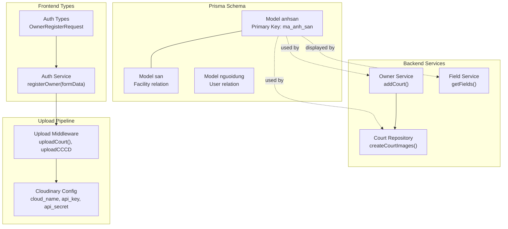
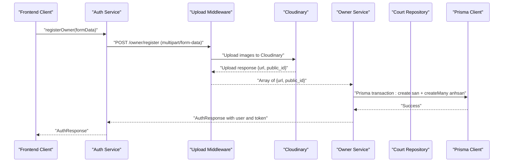
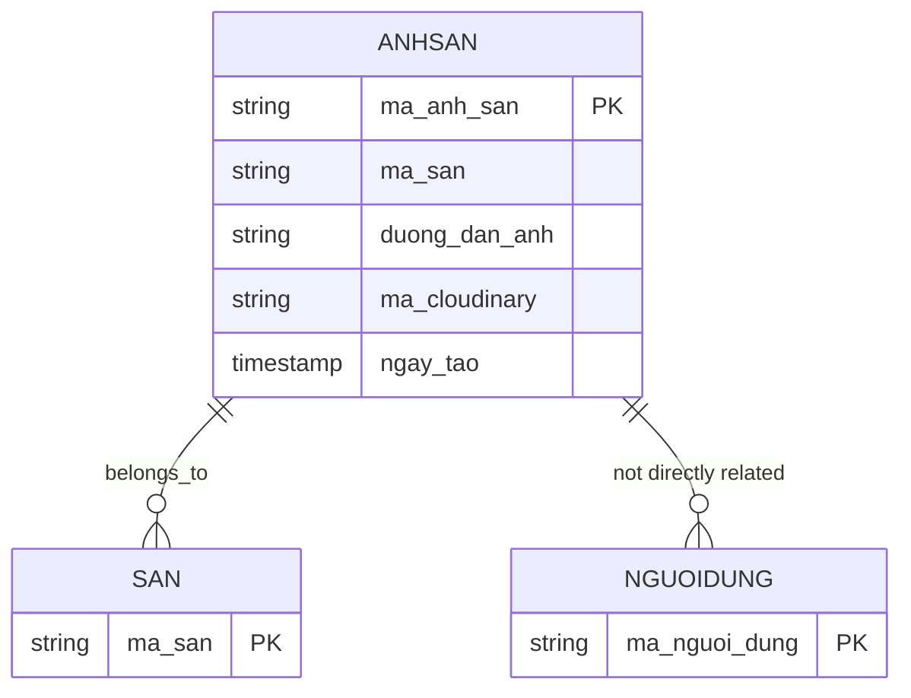
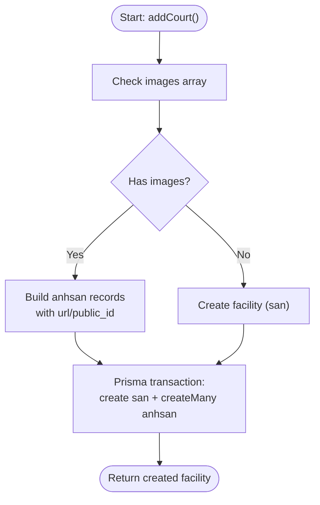
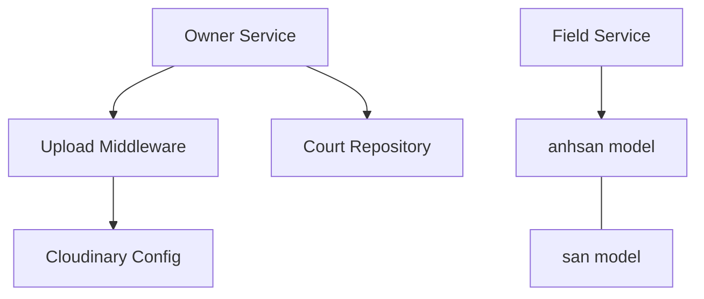

# Image Model

<cite>
**Referenced Files in This Document**
- [schema.prisma](file://backend/prisma/schema.prisma)
- [cloudinary.config.ts](file://backend/src/config/cloudinary.config.ts)
- [upload.middleware.ts](file://backend/src/middlewares/upload.middleware.ts)
- [owner.service.ts](file://backend/src/services/owner.service.ts)
- [court.repository.ts](file://backend/src/repositories/court.repository.ts)
- [field.service.ts](file://backend/src/services/field.service.ts)
- [user.repository.ts](file://backend/src/repositories/user.repository.ts)
- [user.type.ts](file://backend/src/types/user.type.ts)
- [auth.types.ts](file://frontend/src/types/auth.types.ts)
- [auth.service.ts](file://frontend/src/services/auth.service.ts)
</cite>

## Table of Contents
1. [Introduction](#introduction)
2. [Project Structure](#project-structure)
3. [Core Components](#core-components)
4. [Architecture Overview](#architecture-overview)
5. [Detailed Component Analysis](#detailed-component-analysis)
6. [Dependency Analysis](#dependency-analysis)
7. [Performance Considerations](#performance-considerations)
8. [Troubleshooting Guide](#troubleshooting-guide)
9. [Conclusion](#conclusion)

## Introduction
This document provides comprehensive documentation for the Image model (anhsan) that represents media assets for facilities and user profiles. It explains the schema definition, field meanings, relationships with Facility (san) and User (nguoidung) models, and the end-to-end image upload workflow integrated with Cloudinary. It also covers file storage management, CDN integration, responsive image generation considerations, and cleanup procedures for deleted assets.

## Project Structure
The Image model resides in the Prisma schema and is used by backend services and repositories to manage facility images. Cloudinary integration is configured centrally and used by upload middleware for specific workflows. Frontend types and services define how image data is handled during user registration and owner onboarding.

**Diagram sources**
- [schema.prisma:10-17](file://backend/prisma/schema.prisma#L10-L17)
- [owner.service.ts:72-111](file://backend/src/services/owner.service.ts#L72-L111)
- [court.repository.ts:48-50](file://backend/src/repositories/court.repository.ts#L48-L50)
- [field.service.ts:21](file://backend/src/services/field.service.ts#L21)
- [upload.middleware.ts:1-19](file://backend/src/middlewares/upload.middleware.ts#L1-L19)
- [cloudinary.config.ts:6-10](file://backend/src/config/cloudinary.config.ts#L6-L10)
- [auth.types.ts:22-31](file://frontend/src/types/auth.types.ts#L22-L31)
- [auth.service.ts:22-34](file://frontend/src/services/auth.service.ts#L22-L34)

**Section sources**
- [schema.prisma:10-17](file://backend/prisma/schema.prisma#L10-L17)
- [upload.middleware.ts:1-19](file://backend/src/middlewares/upload.middleware.ts#L1-L19)
- [cloudinary.config.ts:6-10](file://backend/src/config/cloudinary.config.ts#L6-L10)
- [owner.service.ts:72-111](file://backend/src/services/owner.service.ts#L72-L111)
- [court.repository.ts:48-50](file://backend/src/repositories/court.repository.ts#L48-L50)
- [field.service.ts:21](file://backend/src/services/field.service.ts#L21)
- [auth.types.ts:22-31](file://frontend/src/types/auth.types.ts#L22-L31)
- [auth.service.ts:22-34](file://frontend/src/services/auth.service.ts#L22-L34)

## Core Components
The Image model (anhsan) stores facility media assets with the following fields:
- ma_anh_san: Primary key for the image record (String, VarChar(50))
- ma_san: Optional foreign key linking to the Facility (san) model (String, VarChar(50))
- duong_dan_anh: The image URL/path stored in the system (String)
- ma_cloudinary: Cloudinary public_id for CDN-managed assets (String)
- ngay_tao: Creation timestamp with default now() (DateTime?)

Relationships:
- One-to-many with Facility (san): anhsan records belong to a single facility
- Optional relation maintained via ma_san field

Usage patterns:
- Facilities can have multiple images stored under anhsan
- Images are associated with a facility via ma_san
- The system supports both Cloudinary-managed URLs and manual uploads

**Section sources**
- [schema.prisma:10-17](file://backend/prisma/schema.prisma#L10-L17)
- [field.service.ts:21](file://backend/src/services/field.service.ts#L21)

## Architecture Overview
The image workflow integrates frontend form submission, backend upload middleware, Cloudinary CDN, and database persistence. The following sequence illustrates the typical flow for facility image uploads during owner onboarding.

**Diagram sources**
- [auth.service.ts:22-34](file://frontend/src/services/auth.service.ts#L22-L34)
- [upload.middleware.ts:13-18](file://backend/src/middlewares/upload.middleware.ts#L13-L18)
- [cloudinary.config.ts:6-10](file://backend/src/config/cloudinary.config.ts#L6-L10)
- [owner.service.ts:72-111](file://backend/src/services/owner.service.ts#L72-L111)
- [court.repository.ts:48-50](file://backend/src/repositories/court.repository.ts#L48-L50)

## Detailed Component Analysis

### Image Model Schema and Relationships
The Image model defines the core data structure for media assets and their associations.

Key points:
- Primary key: ma_anh_san
- Optional foreign key: ma_san links to SAN
- Cloudinary public_id: ma_cloudinary enables CDN optimization and transformations
- Default timestamp: ngay_tao tracks creation time

**Diagram sources**
- [schema.prisma:10-17](file://backend/prisma/schema.prisma#L10-L17)
- [schema.prisma:114-125](file://backend/prisma/schema.prisma#L114-L125)
- [schema.prisma:92-111](file://backend/prisma/schema.prisma#L92-L111)

**Section sources**
- [schema.prisma:10-17](file://backend/prisma/schema.prisma#L10-L17)

### Cloudinary Integration
Cloudinary is configured using environment variables and used by the upload middleware to store and transform images.

Configuration highlights:
- cloud_name, api_key, api_secret loaded from environment
- Storage configured with allowed formats: jpg, jpeg, png, webp
- Folder target: bookingsport/cccd for identity verification documents
- Additional usage for facility images via uploadCourt array('images', 5)

**Section sources**
- [cloudinary.config.ts:6-10](file://backend/src/config/cloudinary.config.ts#L6-L10)
- [upload.middleware.ts:5-11](file://backend/src/middlewares/upload.middleware.ts#L5-L11)
- [upload.middleware.ts:18](file://backend/src/middlewares/upload.middleware.ts#L18)

### Upload Workflow for Facility Images
During owner onboarding, the system creates a facility and associates multiple images. The workflow ensures atomicity and proper linkage.

Steps:
1. Owner registers with identity documents (processed via uploadCCCD)
2. Owner requests to add a facility (processed via uploadCourt)
3. Backend service constructs anhsan records with:
   - ma_anh_san: generated unique identifier
   - ma_san: facility identifier
   - duong_dan_anh: Cloudinary URL
   - ma_cloudinary: Cloudinary public_id
4. Prisma transaction persists facility and images atomically

**Diagram sources**
- [owner.service.ts:72-111](file://backend/src/services/owner.service.ts#L72-L111)
- [court.repository.ts:48-50](file://backend/src/repositories/court.repository.ts#L48-L50)

**Section sources**
- [owner.service.ts:72-111](file://backend/src/services/owner.service.ts#L72-L111)
- [court.repository.ts:48-50](file://backend/src/repositories/court.repository.ts#L48-L50)

### Relationship with Facility and User Models
- Facility association: Each image belongs to a facility via ma_san, enabling retrieval of facility images alongside facility details.
- User profile context: While the Image model itself does not directly reference users, user profile avatars are supported via nguoidung fields (anh_dai_dien, anh_cloudinary), indicating a separate avatar management pathway distinct from facility images.

**Section sources**
- [schema.prisma:10-17](file://backend/prisma/schema.prisma#L10-L17)
- [schema.prisma:92-111](file://backend/prisma/schema.prisma#L92-L111)

### Frontend Integration for Image Submission
Frontend handles owner registration with multipart form data containing identity document images. The form data is constructed and sent to the backend, where upload middleware processes the files via Cloudinary.

Key points:
- FormData includes identity document fields (anh_cccd_truoc, anh_cccd_sau)
- Auth service sends multipart/form-data without manual Content-Type header
- Upload middleware accepts fields for identity documents and arrays for facility images

**Section sources**
- [auth.types.ts:22-31](file://frontend/src/types/auth.types.ts#L22-L31)
- [auth.service.ts:22-34](file://frontend/src/services/auth.service.ts#L22-L34)
- [upload.middleware.ts:13-18](file://backend/src/middlewares/upload.middleware.ts#L13-L18)

### Image Retrieval and Display
Facility images are retrieved and displayed in listings. The system selects a representative image (first image) for facility cards and falls back to a default placeholder if none exist.

Highlights:
- Representative image selection: first anhsan record’s duong_dan_anh
- Fallback to default placeholder when no images are present
- Integration with facility details aggregation in field service

**Section sources**
- [field.service.ts:21](file://backend/src/services/field.service.ts#L21)

## Dependency Analysis
The Image model depends on several backend components for upload, persistence, and presentation.

**Diagram sources**
- [schema.prisma:10-17](file://backend/prisma/schema.prisma#L10-L17)
- [schema.prisma:114-125](file://backend/prisma/schema.prisma#L114-L125)
- [owner.service.ts:72-111](file://backend/src/services/owner.service.ts#L72-L111)
- [court.repository.ts:48-50](file://backend/src/repositories/court.repository.ts#L48-L50)
- [field.service.ts:21](file://backend/src/services/field.service.ts#L21)
- [upload.middleware.ts:1-19](file://backend/src/middlewares/upload.middleware.ts#L1-L19)
- [cloudinary.config.ts:6-10](file://backend/src/config/cloudinary.config.ts#L6-L10)

**Section sources**
- [schema.prisma:10-17](file://backend/prisma/schema.prisma#L10-L17)
- [owner.service.ts:72-111](file://backend/src/services/owner.service.ts#L72-L111)
- [court.repository.ts:48-50](file://backend/src/repositories/court.repository.ts#L48-L50)
- [field.service.ts:21](file://backend/src/services/field.service.ts#L21)
- [upload.middleware.ts:1-19](file://backend/src/middlewares/upload.middleware.ts#L1-L19)
- [cloudinary.config.ts:6-10](file://backend/src/config/cloudinary.config.ts#L6-L10)

## Performance Considerations
- CDN acceleration: Using Cloudinary public_id (ma_cloudinary) enables automatic optimization and CDN delivery.
- Efficient retrieval: Selecting a single representative image per facility reduces payload size in listings.
- Batch insertion: Using createMany for facility images improves write performance during bulk operations.
- Allowed formats: Restricting uploads to jpg, jpeg, png, webp balances quality and compression.

[No sources needed since this section provides general guidance]

## Troubleshooting Guide
Common issues and resolutions:
- Upload failures: Verify Cloudinary credentials and network connectivity; ensure allowed formats match uploaded files.
- Missing images in listings: Confirm that anhsan records exist for the facility and that the first image is accessible.
- Transaction errors: Review Prisma transaction boundaries for facility and image creation; ensure ma_san matches the created facility.
- Identity document uploads: Validate that uploadCCCD middleware receives the expected field names and counts.

**Section sources**
- [cloudinary.config.ts:6-10](file://backend/src/config/cloudinary.config.ts#L6-L10)
- [upload.middleware.ts:13-18](file://backend/src/middlewares/upload.middleware.ts#L13-L18)
- [owner.service.ts:72-111](file://backend/src/services/owner.service.ts#L72-L111)

## Conclusion
The Image model (anhsan) provides a structured way to manage facility media assets with strong ties to the Facility model and seamless Cloudinary integration. The upload pipeline ensures reliable storage and retrieval, while the repository and service layers maintain clean separation of concerns. Proper use of Cloudinary public_id enables CDN optimization and responsive image generation, and the transactional approach guarantees data consistency when creating facilities and associated images.