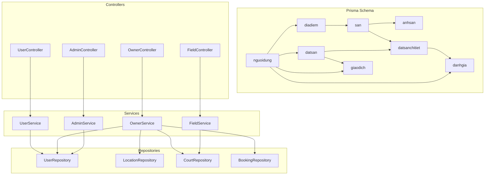
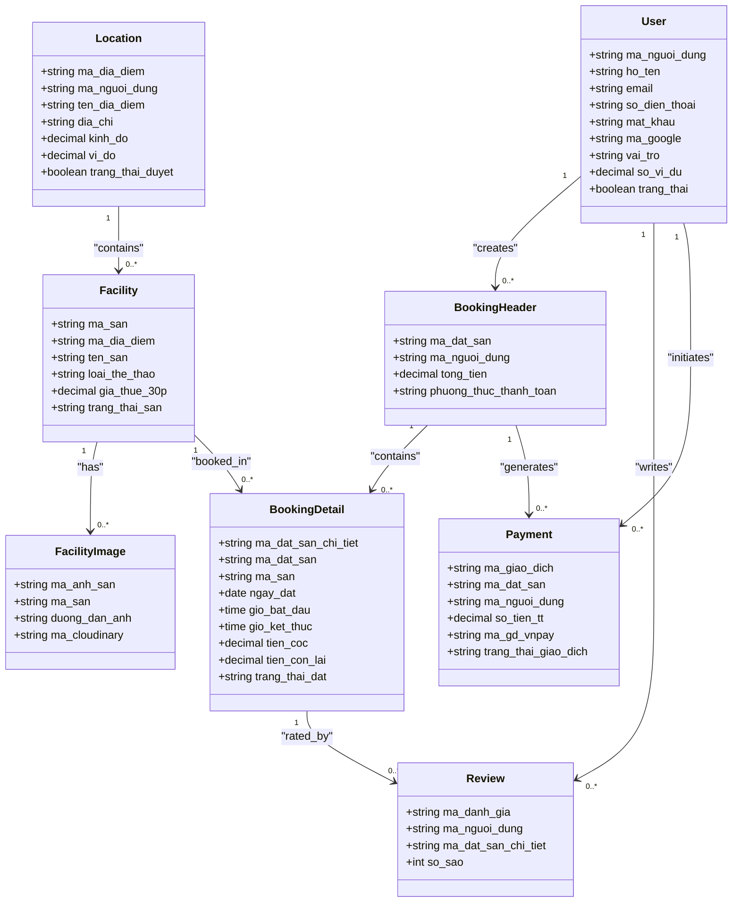
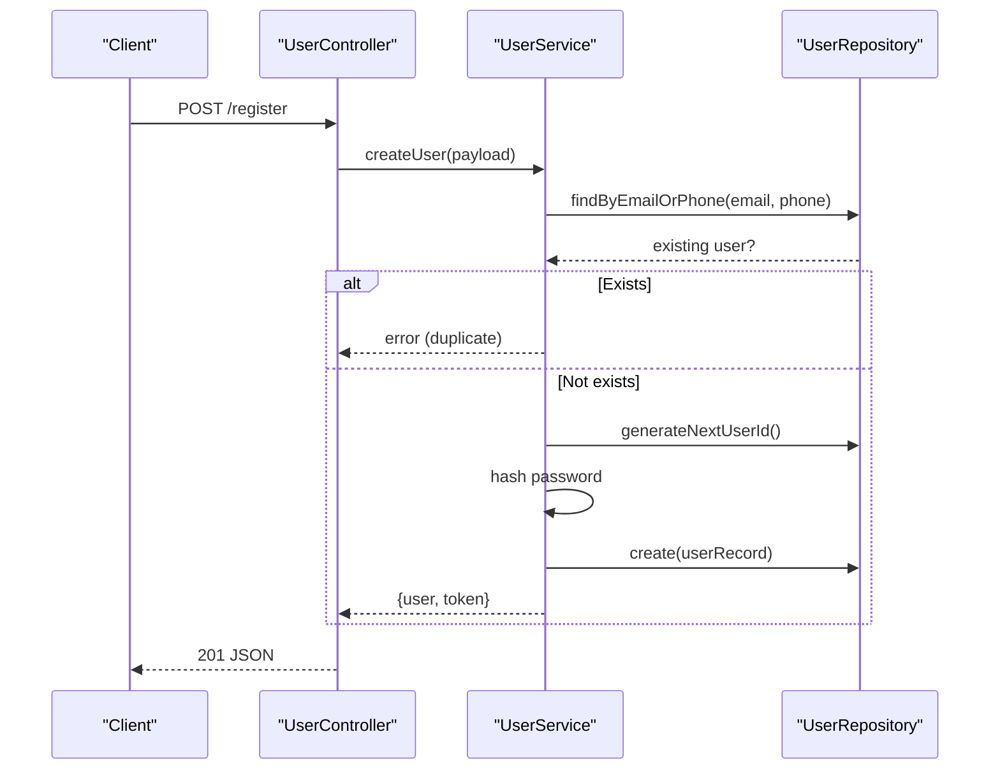
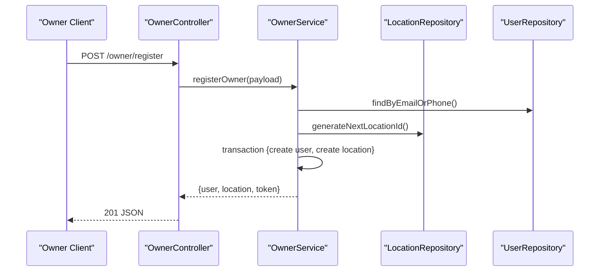
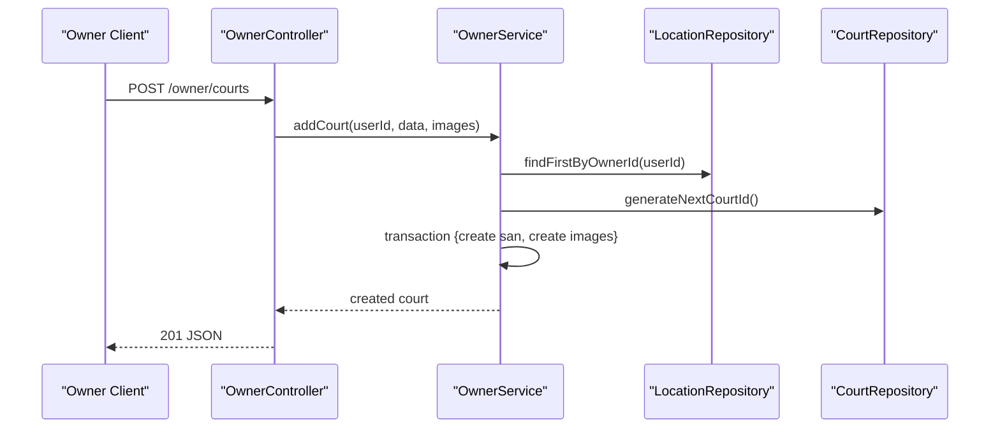
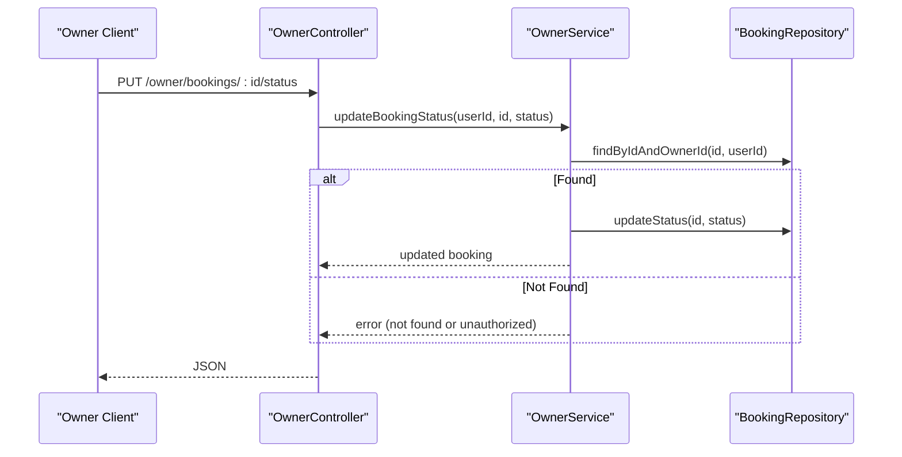
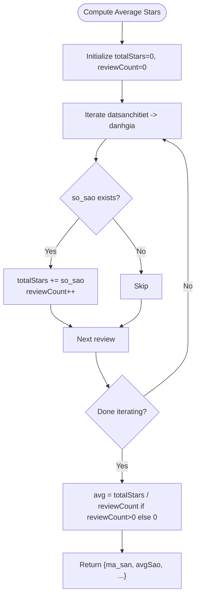
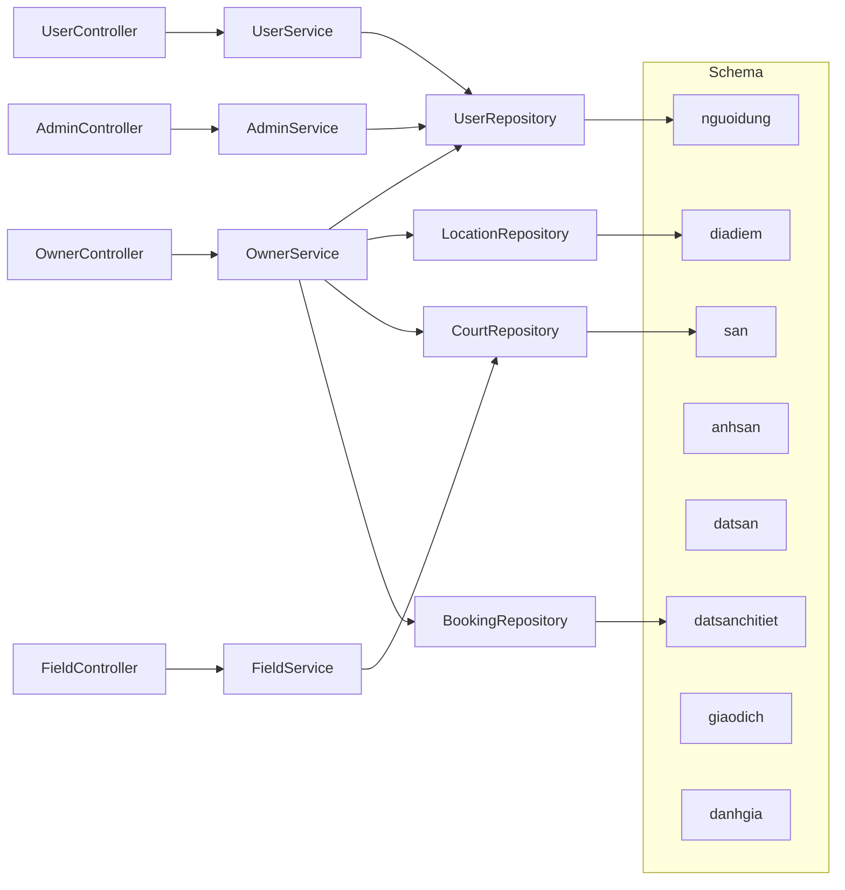

# Individual Data Models

<cite>
**Referenced Files in This Document**
- [schema.prisma](file://backend/prisma/schema.prisma)
- [user.repository.ts](file://backend/src/repositories/user.repository.ts)
- [court.repository.ts](file://backend/src/repositories/court.repository.ts)
- [location.repository.ts](file://backend/src/repositories/location.repository.ts)
- [booking.repository.ts](file://backend/src/repositories/booking.repository.ts)
- [user.service.ts](file://backend/src/services/user.service.ts)
- [owner.service.ts](file://backend/src/services/owner.service.ts)
- [admin.service.ts](file://backend/src/services/admin.service.ts)
- [field.service.ts](file://backend/src/services/field.service.ts)
- [user.controller.ts](file://backend/src/controllers/user.controller.ts)
- [owner.controller.ts](file://backend/src/controllers/owner.controller.ts)
- [admin.controller.ts](file://backend/src/controllers/admin.controller.ts)
- [field.controller.ts](file://backend/src/controllers/field.controller.ts)
- [user.type.ts](file://backend/src/types/user.type.ts)
- [owner.type.ts](file://backend/src/types/owner.type.ts)
- [booksport.type.ts](file://backend/src/types/booksport.type.ts)
</cite>

## Table of Contents
1. [Introduction](#introduction)
2. [Project Structure](#project-structure)
3. [Core Components](#core-components)
4. [Architecture Overview](#architecture-overview)
5. [Detailed Component Analysis](#detailed-component-analysis)
6. [Dependency Analysis](#dependency-analysis)
7. [Performance Considerations](#performance-considerations)
8. [Troubleshooting Guide](#troubleshooting-guide)
9. [Conclusion](#conclusion)
10. [Appendices](#appendices)

## Introduction
This document provides a comprehensive, code-sourced analysis of the 12 interconnected data models in the sports facility booking platform. It covers each entity’s field definitions, data types, constraints, defaults, validation rules, and business significance. It also documents relationships, indexes, unique constraints, and typical query patterns derived from the Prisma schema and repository/service/controller usage.

## Project Structure
The data models are defined in the Prisma schema and accessed through repositories, services, and controllers. The schema defines primary entities and their relations, while repositories encapsulate database queries, services orchestrate business logic, and controllers expose endpoints.

**Diagram sources**
- [schema.prisma](file://backend/prisma/schema.prisma)
- [user.repository.ts](file://backend/src/repositories/user.repository.ts)
- [location.repository.ts](file://backend/src/repositories/location.repository.ts)
- [court.repository.ts](file://backend/src/repositories/court.repository.ts)
- [booking.repository.ts](file://backend/src/repositories/booking.repository.ts)
- [user.service.ts](file://backend/src/services/user.service.ts)
- [owner.service.ts](file://backend/src/services/owner.service.ts)
- [admin.service.ts](file://backend/src/services/admin.service.ts)
- [field.service.ts](file://backend/src/services/field.service.ts)
- [user.controller.ts](file://backend/src/controllers/user.controller.ts)
- [owner.controller.ts](file://backend/src/controllers/owner.controller.ts)
- [admin.controller.ts](file://backend/src/controllers/admin.controller.ts)
- [field.controller.ts](file://backend/src/controllers/field.controller.ts)

**Section sources**
- [schema.prisma](file://backend/prisma/schema.prisma)

## Core Components
This section introduces each of the 12 interconnected models with their business significance, constraints, defaults, and validations observed in the schema and code.

- User (nguoidung)
  - Purpose: Stores customer and owner profiles, authentication credentials, roles, and wallet balance.
  - Key fields and constraints:
    - Identifier: ma_nguoi_dung (primary key, varchar(50))
    - Unique constraints: email (varchar(255)), so_dien_thoai (varchar(20)), ma_google (varchar(255))
    - Defaults: vai_tro default "Khách hàng", so_vi_du default 0.00, trang_thai default false
    - Validation: mat_khau stored as hashed value; role-driven access control enforced in controllers/services
  - Business significance: Enables user registration, login, role-based permissions, and financial tracking.
  - Typical queries: findByEmailOrPhone, findById, create with hashed password, generateNextUserId.
  - Indexes/Uniques: email, so_dien_thoai, ma_google are unique; ma_nguoi_dung is PK.

- Location (diadiem)
  - Purpose: Represents owner-provided facility locations with geographic coordinates.
  - Key fields and constraints:
    - Identifier: ma_dia_diem (primary key, varchar(50))
    - Foreign key: ma_nguoi_dung references nguoidung (on delete no action)
    - Defaults: trang_thai_duyet default false, ngay_tao default now()
    - Validation: coordinates stored as decimal with precision for lat/long
  - Business significance: Links owners to facilities; supports approval workflow and geolocation.
  - Typical queries: findByOwnerId, findFirstByOwnerId, create, generateNextLocationId.
  - Indexes/Uniques: ma_dia_diem PK; ma_nguoi_dung FK.

- Facility (san)
  - Purpose: Defines individual sports courts within a location.
  - Key fields and constraints:
    - Identifier: ma_san (primary key, varchar(50))
    - Foreign key: ma_dia_diem references diadiem (on delete no action)
    - Defaults: trang_thai_san default "Đang hoạt động", ngay_tao default now()
    - Validation: numeric pricing for hourly rates
  - Business significance: Core unit for booking; supports photos and availability.
  - Typical queries: findByLocationId, findById, create, update, generateNextCourtId.
  - Indexes/Uniques: ma_san PK; ma_dia_diem FK.

- Facility Images (anhsan)
  - Purpose: Stores image records linked to facilities.
  - Key fields and constraints:
    - Identifier: ma_anh_san (primary key, varchar(50))
    - Foreign key: ma_san references san (on delete no action)
    - Defaults: ngay_tao default now()
  - Business significance: Provides media for facility listings.
  - Typical queries: createMany for batch image uploads.
  - Indexes/Uniques: ma_anh_san PK; ma_san FK.

- Booking Header (datsan)
  - Purpose: Aggregates booking transactions with totals and payment method.
  - Key fields and constraints:
    - Identifier: ma_dat_san (primary key, varchar(50))
    - Foreign key: ma_nguoi_dung references nguoidung (on delete no action)
    - Defaults: ngay_tao default now()
    - Validation: monetary amounts as decimal with scale/precision
  - Business significance: Tracks transaction-level data for payments and user history.
  - Typical queries: included in owner booking retrieval via nested relations.
  - Indexes/Uniques: ma_dat_san PK; ma_nguoi_dung FK.

- Booking Details (datsanchitiet)
  - Purpose: Encapsulates per-slot booking requests with time slots and status.
  - Key fields and constraints:
    - Identifier: ma_dat_san_chi_tiet (primary key, varchar(50))
    - Foreign keys: ma_dat_san references datsan, ma_san references san (on delete no action)
    - Defaults: tien_coc default 0.00, tien_con_lai default 0.00, trang_thai_dat default "Chờ xử lý"
    - Validation: date/time fields for scheduling; status controlled by owner actions
  - Business significance: Central scheduling unit; owner approval workflow.
  - Typical queries: findByOwnerId, findByIdAndOwnerId, updateStatus.
  - Indexes/Uniques: ma_dat_san_chi_tiet PK; ma_dat_san, ma_san FKs.

- Payment (giaodich)
  - Purpose: Records payment events and transaction metadata.
  - Key fields and constraints:
    - Identifier: ma_giao_dich (primary key, varchar(50))
    - Foreign keys: ma_dat_san references datsan, ma_nguoi_dung references nguoidung (on delete no action)
    - Unique constraint: ma_gd_vnpay (varchar(100))
    - Defaults: trang_thai_giao_dich default "Chưa thanh toán", ngay_tao default now()
    - Validation: amount stored as decimal; optional reference fields for payment providers
  - Business significance: Tracks payment lifecycle and reconciliation.
  - Typical queries: included in booking/payment flows; status updates handled by owner.
  - Indexes/Uniques: ma_giao_dich PK; ma_gd_vnpay unique; ma_dat_san, ma_nguoi_dung FKs.

- Review (danhgia)
  - Purpose: Captures user ratings and timestamps for bookings.
  - Key fields and constraints:
    - Identifier: ma_danh_gia (primary key, varchar(50))
    - Foreign keys: ma_nguoi_dung references nguoidung, ma_dat_san_chi_tiet references datsanchitiet (on delete no action)
    - Defaults: ngay_danh_gia default now()
    - Validation: star rating as integer
  - Business significance: Supports reputation and analytics.
  - Typical queries: aggregated in field listing service for average stars.
  - Indexes/Uniques: ma_danh_gia PK; ma_nguoi_dung, ma_dat_san_chi_tiet FKs.

- Supporting Types (user.type.ts, owner.type.ts, booksport.type.ts)
  - Purpose: Define client-side DTOs for request payloads and local card data.
  - Business significance: Enforce shape of incoming data and UI data structures.

**Section sources**
- [schema.prisma](file://backend/prisma/schema.prisma)
- [user.repository.ts](file://backend/src/repositories/user.repository.ts)
- [location.repository.ts](file://backend/src/repositories/location.repository.ts)
- [court.repository.ts](file://backend/src/repositories/court.repository.ts)
- [booking.repository.ts](file://backend/src/repositories/booking.repository.ts)
- [user.service.ts](file://backend/src/services/user.service.ts)
- [owner.service.ts](file://backend/src/services/owner.service.ts)
- [admin.service.ts](file://backend/src/services/admin.service.ts)
- [field.service.ts](file://backend/src/services/field.service.ts)
- [user.type.ts](file://backend/src/types/user.type.ts)
- [owner.type.ts](file://backend/src/types/owner.type.ts)
- [booksport.type.ts](file://backend/src/types/booksport.type.ts)

## Architecture Overview
The system follows a layered architecture:
- Prisma schema defines entities and relations.
- Repositories encapsulate CRUD and complex queries.
- Services orchestrate business logic, enforce validations, and manage transactions.
- Controllers handle HTTP requests, validate inputs, and delegate to services.

**Diagram sources**
- [schema.prisma](file://backend/prisma/schema.prisma)

## Detailed Component Analysis

### User Model (nguoidung)
- Fields and constraints:
  - ma_nguoi_dung (PK), ho_ten, email (unique), so_dien_thoai (unique), ma_google (unique), vai_tro (default "Khách hàng"), so_vi_du (default 0.00), trang_thai (default false), ngay_tao (default now)
- Business rules:
  - Email/phone uniqueness enforced during registration
  - Password hashing performed before persistence
  - Role determines access control
- Typical queries:
  - findByEmailOrPhone, findById, create, generateNextUserId
- Validation:
  - Password comparison during login
  - Token generation after successful auth
- Sample request payload:
  - [user.type.ts](file://backend/src/types/user.type.ts)
- Sample response payload:
  - [user.controller.ts](file://backend/src/controllers/user.controller.ts)

**Diagram sources**
- [user.controller.ts](file://backend/src/controllers/user.controller.ts)
- [user.service.ts](file://backend/src/services/user.service.ts)
- [user.repository.ts](file://backend/src/repositories/user.repository.ts)

**Section sources**
- [schema.prisma](file://backend/prisma/schema.prisma)
- [user.repository.ts](file://backend/src/repositories/user.repository.ts)
- [user.service.ts](file://backend/src/services/user.service.ts)
- [user.controller.ts](file://backend/src/controllers/user.controller.ts)
- [user.type.ts](file://backend/src/types/user.type.ts)

### Location Model (diadiem)
- Fields and constraints:
  - ma_dia_diem (PK), ma_nguoi_dung (FK), ten_dia_diem, dia_chi, kinh_do, vi_do, trang_thai_duyet (default false), ngay_tao (default now)
- Business rules:
  - Owner association via ma_nguoi_dung
  - Location creation with default coordinates and pending approval
- Typical queries:
  - findByOwnerId, findFirstByOwnerId, create, generateNextLocationId
- Validation:
  - Coordinates stored as decimals; owner-only access enforced in services
- Sample request payload:
  - [owner.type.ts](file://backend/src/types/owner.type.ts)

**Diagram sources**
- [owner.controller.ts](file://backend/src/controllers/owner.controller.ts)
- [owner.service.ts](file://backend/src/services/owner.service.ts)
- [location.repository.ts](file://backend/src/repositories/location.repository.ts)
- [user.repository.ts](file://backend/src/repositories/user.repository.ts)

**Section sources**
- [schema.prisma](file://backend/prisma/schema.prisma)
- [location.repository.ts](file://backend/src/repositories/location.repository.ts)
- [owner.service.ts](file://backend/src/services/owner.service.ts)
- [owner.controller.ts](file://backend/src/controllers/owner.controller.ts)
- [owner.type.ts](file://backend/src/types/owner.type.ts)

### Facility Model (san)
- Fields and constraints:
  - ma_san (PK), ma_dia_diem (FK), ten_san, loai_the_thao, gia_thue_30p, trang_thai_san (default "Đang hoạt động"), ngay_tao (default now)
- Business rules:
  - Belongs to a single location; images and reviews linked via relations
  - Status maintained per facility
- Typical queries:
  - findByLocationId, findById, create, update, generateNextCourtId
- Validation:
  - Price stored as decimal; status defaults applied
- Sample request payload:
  - [owner.type.ts](file://backend/src/types/owner.type.ts)

**Diagram sources**
- [owner.controller.ts](file://backend/src/controllers/owner.controller.ts)
- [owner.service.ts](file://backend/src/services/owner.service.ts)
- [court.repository.ts](file://backend/src/repositories/court.repository.ts)
- [location.repository.ts](file://backend/src/repositories/location.repository.ts)

**Section sources**
- [schema.prisma](file://backend/prisma/schema.prisma)
- [court.repository.ts](file://backend/src/repositories/court.repository.ts)
- [owner.service.ts](file://backend/src/services/owner.service.ts)
- [owner.controller.ts](file://backend/src/controllers/owner.controller.ts)
- [owner.type.ts](file://backend/src/types/owner.type.ts)

### Facility Images Model (anhsan)
- Fields and constraints:
  - ma_anh_san (PK), ma_san (FK), duong_dan_anh, ma_cloudinary, ngay_tao (default now)
- Business rules:
  - One-to-many with facility; batch creation supported
- Typical queries:
  - createMany for image uploads
- Validation:
  - URL and cloudinary identifiers stored as strings

**Section sources**
- [schema.prisma](file://backend/prisma/schema.prisma)
- [court.repository.ts](file://backend/src/repositories/court.repository.ts)
- [owner.service.ts](file://backend/src/services/owner.service.ts)

### Booking Header Model (datsan)
- Fields and constraints:
  - ma_dat_san (PK), ma_nguoi_dung (FK), tong_tien, phuong_thuc_thanh_toan, ngay_tao (default now)
- Business rules:
  - Aggregates payment and user association; linked to booking details and transactions
- Typical queries:
  - Included in owner booking retrieval via nested relations
- Validation:
  - Monetary amounts stored as decimal

**Section sources**
- [schema.prisma](file://backend/prisma/schema.prisma)
- [booking.repository.ts](file://backend/src/repositories/booking.repository.ts)
- [owner.service.ts](file://backend/src/services/owner.service.ts)

### Booking Details Model (datsanchitiet)
- Fields and constraints:
  - ma_dat_san_chi_tiet (PK), ma_dat_san (FK), ma_san (FK), ngay_dat, gio_bat_dau, gio_ket_thuc, tien_coc (default 0.00), tien_con_lai (default 0.00), trang_thai_dat (default "Chờ xử lý")
- Business rules:
  - Scheduling unit; owner-controlled status updates; links to facility and booking header
- Typical queries:
  - findByOwnerId, findByIdAndOwnerId, updateStatus
- Validation:
  - Status transitions enforced by owner actions

**Diagram sources**
- [owner.controller.ts](file://backend/src/controllers/owner.controller.ts)
- [owner.service.ts](file://backend/src/services/owner.service.ts)
- [booking.repository.ts](file://backend/src/repositories/booking.repository.ts)

**Section sources**
- [schema.prisma](file://backend/prisma/schema.prisma)
- [booking.repository.ts](file://backend/src/repositories/booking.repository.ts)
- [owner.service.ts](file://backend/src/services/owner.service.ts)
- [owner.controller.ts](file://backend/src/controllers/owner.controller.ts)

### Payment Model (giaodich)
- Fields and constraints:
  - ma_giao_dich (PK), ma_dat_san (FK), ma_nguoi_dung (FK), so_tien_tt, ma_gd_vnpay (unique), trang_thai_giao_dich (default "Chưa thanh toán"), ngay_tao (default now)
- Business rules:
  - Payment lifecycle tracking; unique payment reference for reconciliation
- Typical queries:
  - Included in booking/payment flows; status updates handled by owner
- Validation:
  - Amount stored as decimal; unique payment reference

**Section sources**
- [schema.prisma](file://backend/prisma/schema.prisma)
- [owner.service.ts](file://backend/src/services/owner.service.ts)

### Review Model (danhgia)
- Fields and constraints:
  - ma_danh_gia (PK), ma_nguoi_dung (FK), ma_dat_san_chi_tiet (FK), so_sao, ngay_danh_gia (default now)
- Business rules:
  - User-to-booking detail rating; aggregated for facility listing
- Typical queries:
  - Aggregated in field listing service for average stars
- Validation:
  - Star rating as integer

**Diagram sources**
- [field.service.ts](file://backend/src/services/field.service.ts)
- [schema.prisma](file://backend/prisma/schema.prisma)

**Section sources**
- [schema.prisma](file://backend/prisma/schema.prisma)
- [field.service.ts](file://backend/src/services/field.service.ts)

### Supporting Types
- UserClient and LoginUserClient (user.type.ts): Define registration and login payload shapes for clients.
- CreateOwner and LoginOwner (owner.type.ts): Define owner registration and login payload shapes.
- LocalCard (booksport.type.ts): Defines a simplified listing card structure with fields like so_sao, loai_the_thao, ten_dia_diem, dia_chi.

**Section sources**
- [user.type.ts](file://backend/src/types/user.type.ts)
- [owner.type.ts](file://backend/src/types/owner.type.ts)
- [booksport.type.ts](file://backend/src/types/booksport.type.ts)

## Dependency Analysis
The following diagram shows how repositories, services, and controllers depend on each other and on the Prisma schema.

**Diagram sources**
- [schema.prisma](file://backend/prisma/schema.prisma)
- [user.repository.ts](file://backend/src/repositories/user.repository.ts)
- [location.repository.ts](file://backend/src/repositories/location.repository.ts)
- [court.repository.ts](file://backend/src/repositories/court.repository.ts)
- [booking.repository.ts](file://backend/src/repositories/booking.repository.ts)
- [user.service.ts](file://backend/src/services/user.service.ts)
- [owner.service.ts](file://backend/src/services/owner.service.ts)
- [admin.service.ts](file://backend/src/services/admin.service.ts)
- [field.service.ts](file://backend/src/services/field.service.ts)
- [user.controller.ts](file://backend/src/controllers/user.controller.ts)
- [owner.controller.ts](file://backend/src/controllers/owner.controller.ts)
- [admin.controller.ts](file://backend/src/controllers/admin.controller.ts)
- [field.controller.ts](file://backend/src/controllers/field.controller.ts)

**Section sources**
- [schema.prisma](file://backend/prisma/schema.prisma)
- [user.repository.ts](file://backend/src/repositories/user.repository.ts)
- [location.repository.ts](file://backend/src/repositories/location.repository.ts)
- [court.repository.ts](file://backend/src/repositories/court.repository.ts)
- [booking.repository.ts](file://backend/src/repositories/booking.repository.ts)
- [user.service.ts](file://backend/src/services/user.service.ts)
- [owner.service.ts](file://backend/src/services/owner.service.ts)
- [admin.service.ts](file://backend/src/services/admin.service.ts)
- [field.service.ts](file://backend/src/services/field.service.ts)
- [user.controller.ts](file://backend/src/controllers/user.controller.ts)
- [owner.controller.ts](file://backend/src/controllers/owner.controller.ts)
- [admin.controller.ts](file://backend/src/controllers/admin.controller.ts)
- [field.controller.ts](file://backend/src/controllers/field.controller.ts)

## Performance Considerations
- Indexes and uniques:
  - Unique constraints on email, phone, and Google ID reduce duplicate registrations and speed up lookups.
  - Unique payment reference (ma_gd_vnpay) prevents duplicate reconciliation.
- Query patterns:
  - Use selective includes to avoid N+1 issues (as seen in owner booking retrieval and field listing).
  - Prefer filtering by foreign keys (e.g., ma_nguoi_dung) to limit scans.
- Transactions:
  - Multi-entity writes (owner registration, court creation) use transactions to maintain consistency and reduce partial writes.
- Pagination and ordering:
  - Ordering by date fields (e.g., ngay_dat desc) supports efficient timeline views.

[No sources needed since this section provides general guidance]

## Troubleshooting Guide
- Duplicate registration errors:
  - Cause: Existing email or phone detected.
  - Resolution: Ensure unique credentials; service throws explicit errors.
  - References: [user.service.ts](file://backend/src/services/user.service.ts), [admin.service.ts](file://backend/src/services/admin.service.ts), [owner.service.ts](file://backend/src/services/owner.service.ts)
- Unauthorized booking updates:
  - Cause: Attempting to change status for a booking not owned by the user.
  - Resolution: Verify ownership via repository checks.
  - References: [booking.repository.ts](file://backend/src/repositories/booking.repository.ts), [owner.service.ts](file://backend/src/services/owner.service.ts)
- Missing required images or documents:
  - Cause: Missing CCCD or image uploads.
  - Resolution: Validate presence of required files before proceeding.
  - References: [owner.controller.ts](file://backend/src/controllers/owner.controller.ts)
- Payment reconciliation:
  - Cause: Missing or duplicate payment reference.
  - Resolution: Ensure unique ma_gd_vnpay and correct amount matching.
  - References: [schema.prisma](file://backend/prisma/schema.prisma)

**Section sources**
- [user.service.ts](file://backend/src/services/user.service.ts)
- [admin.service.ts](file://backend/src/services/admin.service.ts)
- [owner.service.ts](file://backend/src/services/owner.service.ts)
- [booking.repository.ts](file://backend/src/repositories/booking.repository.ts)
- [owner.controller.ts](file://backend/src/controllers/owner.controller.ts)
- [schema.prisma](file://backend/prisma/schema.prisma)

## Conclusion
The 12 interconnected models form a cohesive domain for sports facility booking, with clear ownership, scheduling, payment, and review flows. The schema enforces key constraints and defaults, while repositories and services implement robust validations and transactions. Typical query patterns emphasize filtered joins and nested includes to support owner dashboards, user listings, and payment tracking.

[No sources needed since this section summarizes without analyzing specific files]

## Appendices
- Typical query patterns:
  - Owner’s booking list: [booking.repository.ts](file://backend/src/repositories/booking.repository.ts)
  - Field listing with averages: [field.service.ts](file://backend/src/services/field.service.ts)
  - User registration: [user.service.ts](file://backend/src/services/user.service.ts)
  - Owner registration and location/court creation: [owner.service.ts](file://backend/src/services/owner.service.ts)
- Controllers:
  - [user.controller.ts](file://backend/src/controllers/user.controller.ts)
  - [owner.controller.ts](file://backend/src/controllers/owner.controller.ts)
  - [admin.controller.ts](file://backend/src/controllers/admin.controller.ts)
  - [field.controller.ts](file://backend/src/controllers/field.controller.ts)

**Section sources**
- [booking.repository.ts](file://backend/src/repositories/booking.repository.ts)
- [field.service.ts](file://backend/src/services/field.service.ts)
- [user.service.ts](file://backend/src/services/user.service.ts)
- [owner.service.ts](file://backend/src/services/owner.service.ts)
- [user.controller.ts](file://backend/src/controllers/user.controller.ts)
- [owner.controller.ts](file://backend/src/controllers/owner.controller.ts)
- [admin.controller.ts](file://backend/src/controllers/admin.controller.ts)
- [field.controller.ts](file://backend/src/controllers/field.controller.ts)