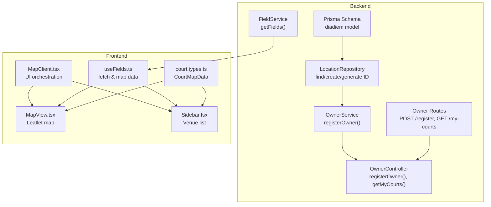
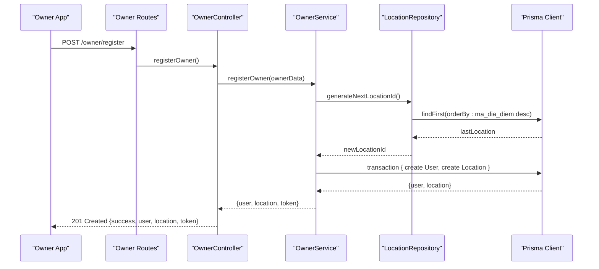
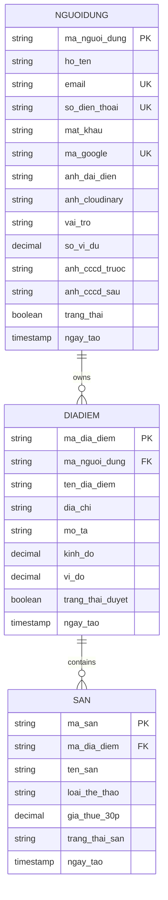
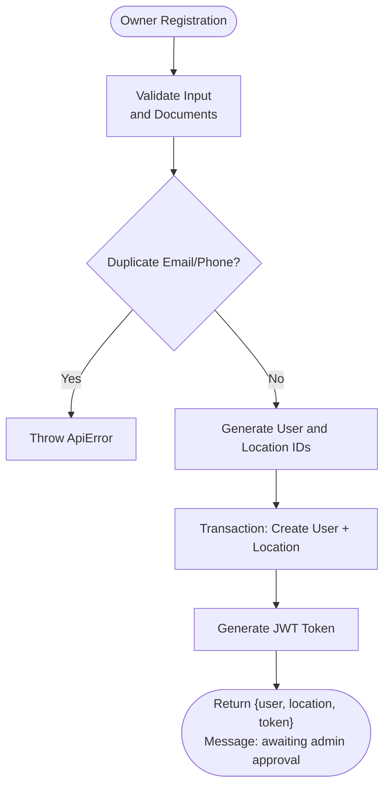
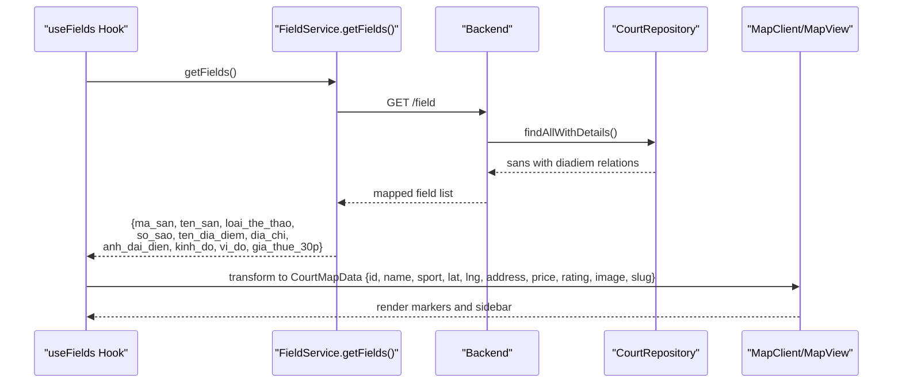
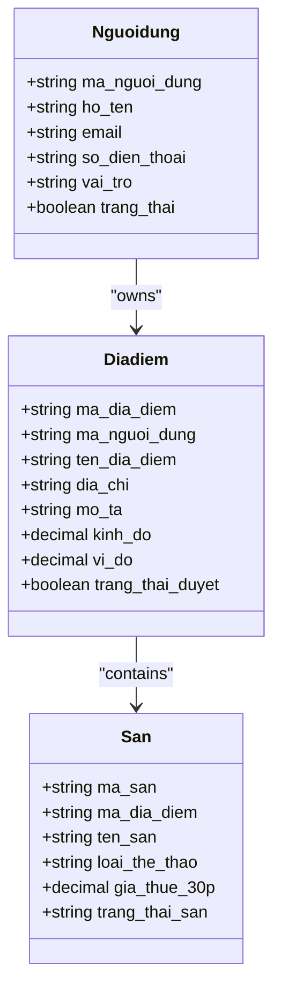
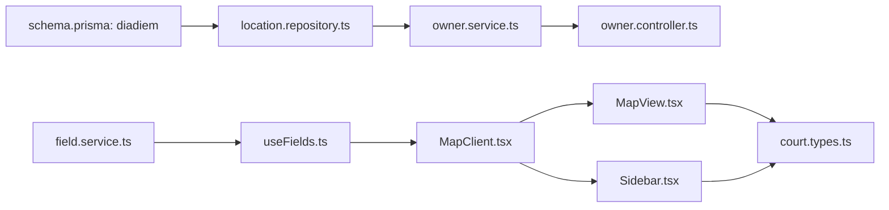

# Location Model

<cite>
**Referenced Files in This Document**
- [schema.prisma](file://backend/prisma/schema.prisma)
- [location.repository.ts](file://backend/src/repositories/location.repository.ts)
- [owner.service.ts](file://backend/src/services/owner.service.ts)
- [field.service.ts](file://backend/src/services/field.service.ts)
- [owner.controller.ts](file://backend/src/controllers/owner.controller.ts)
- [owner.routes.ts](file://backend/src/routers/owner.routes.ts)
- [MapClient.tsx](file://frontend/src/components/map/MapClient.tsx)
- [MapView.tsx](file://frontend/src/components/map/MapView.tsx)
- [Sidebar.tsx](file://frontend/src/components/map/Sidebar.tsx)
- [useFields.ts](file://frontend/src/hooks/useFields.ts)
- [court.types.ts](file://frontend/src/types/court.types.ts)
</cite>

## Table of Contents
1. [Introduction](#introduction)
2. [Project Structure](#project-structure)
3. [Core Components](#core-components)
4. [Architecture Overview](#architecture-overview)
5. [Detailed Component Analysis](#detailed-component-analysis)
6. [Dependency Analysis](#dependency-analysis)
7. [Performance Considerations](#performance-considerations)
8. [Troubleshooting Guide](#troubleshooting-guide)
9. [Conclusion](#conclusion)

## Introduction
This document provides comprehensive documentation for the Location model (diadiem), which represents physical addresses and locations of sports facilities. It explains all fields, the approval workflow, coordinate-based geolocation system, address validation, and relationships with the Facility (san) and User (nguoidung) models. It also details the approval process for facility listings, location verification requirements, and integration with mapping services for venue discovery and distance calculations.

## Project Structure
The Location model is defined in the Prisma schema and is used across backend services and frontend mapping components:
- Backend: Prisma schema defines the diadiem model and relations; repositories and services implement creation and retrieval; controllers expose owner registration and listing endpoints.
- Frontend: Mapping components render venues on a map using latitude/longitude coordinates and present nearby facilities.

**Diagram sources**
- [schema.prisma:58-70](file://backend/prisma/schema.prisma#L58-L70)
- [location.repository.ts:3-47](file://backend/src/repositories/location.repository.ts#L3-L47)
- [owner.service.ts:11-64](file://backend/src/services/owner.service.ts#L11-L64)
- [field.service.ts:3-38](file://backend/src/services/field.service.ts#L3-L38)
- [owner.controller.ts:6-40](file://backend/src/controllers/owner.controller.ts#L6-L40)
- [owner.routes.ts:13-22](file://backend/src/routers/owner.routes.ts#L13-L22)
- [MapClient.tsx:11-61](file://frontend/src/components/map/MapClient.tsx#L11-L61)
- [MapView.tsx:25-61](file://frontend/src/components/map/MapView.tsx#L25-L61)
- [Sidebar.tsx:14-59](file://frontend/src/components/map/Sidebar.tsx#L14-L59)
- [useFields.ts:37-77](file://frontend/src/hooks/useFields.ts#L37-L77)
- [court.types.ts:39-51](file://frontend/src/types/court.types.ts#L39-L51)

**Section sources**
- [schema.prisma:58-70](file://backend/prisma/schema.prisma#L58-L70)
- [owner.routes.ts:13-22](file://backend/src/routers/owner.routes.ts#L13-L22)
- [owner.controller.ts:6-40](file://backend/src/controllers/owner.controller.ts#L6-L40)
- [owner.service.ts:11-64](file://backend/src/services/owner.service.ts#L11-L64)
- [location.repository.ts:3-47](file://backend/src/repositories/location.repository.ts#L3-L47)
- [field.service.ts:3-38](file://backend/src/services/field.service.ts#L3-L38)
- [MapClient.tsx:11-61](file://frontend/src/components/map/MapClient.tsx#L11-L61)
- [MapView.tsx:25-61](file://frontend/src/components/map/MapView.tsx#L25-L61)
- [Sidebar.tsx:14-59](file://frontend/src/components/map/Sidebar.tsx#L14-L59)
- [useFields.ts:37-77](file://frontend/src/hooks/useFields.ts#L37-L77)
- [court.types.ts:39-51](file://frontend/src/types/court.types.ts#L39-L51)

## Core Components
The Location model (diadiem) encapsulates the physical location of a sports facility. Below are the fields and their roles:

- ma_dia_diem (Primary Key): Unique identifier for the location, auto-generated by the repository.
- ma_nguoi_dung (Owner): Foreign key linking the location to the User who owns it.
- ten_dia_diem: Name/title of the location.
- dia_chi: Full street address.
- mo_ta: Optional description of the location.
- kinh_do (Longitude): Decimal coordinate with precision suitable for mapping.
- vi_do (Latitude): Decimal coordinate with precision suitable for mapping.
- trang_thai_duyet (Approval Status): Boolean flag indicating whether the location is approved.
- ngay_tao (Created At): Timestamp of creation.

Relationships:
- One-to-many with Facility (san): Each location can contain multiple facilities.
- Many-to-one with User (nguoidung): Each location belongs to one user/owner.

Key backend operations:
- Creation during owner registration, including ID generation and coordinate assignment.
- Retrieval by owner ID for dashboard and listing views.
- Integration with FieldService for exposing location data to the frontend.

**Section sources**
- [schema.prisma:58-70](file://backend/prisma/schema.prisma#L58-L70)
- [location.repository.ts:3-47](file://backend/src/repositories/location.repository.ts#L3-L47)
- [owner.service.ts:47-56](file://backend/src/services/owner.service.ts#L47-L56)
- [field.service.ts:23-34](file://backend/src/services/field.service.ts#L23-L34)

## Architecture Overview
The Location model participates in two primary flows:
1. Owner Registration Flow: Creates a User and a Location atomically, assigns default coordinates, and returns a JWT token.
2. Venue Discovery Flow: Retrieves facility listings with associated location data (coordinates, address) and renders them on the map.

**Diagram sources**
- [owner.routes.ts:15](file://backend/src/routers/owner.routes.ts#L15)
- [owner.controller.ts:6-40](file://backend/src/controllers/owner.controller.ts#L6-L40)
- [owner.service.ts:11-64](file://backend/src/services/owner.service.ts#L11-L64)
- [location.repository.ts:34-47](file://backend/src/repositories/location.repository.ts#L34-L47)

**Section sources**
- [owner.routes.ts:13-22](file://backend/src/routers/owner.routes.ts#L13-L22)
- [owner.controller.ts:6-40](file://backend/src/controllers/owner.controller.ts#L6-L40)
- [owner.service.ts:11-64](file://backend/src/services/owner.service.ts#L11-L64)
- [location.repository.ts:34-47](file://backend/src/repositories/location.repository.ts#L34-L47)

## Detailed Component Analysis

### Location Model Fields and Constraints
- Primary Key: ma_dia_diem (auto-generated)
- Owner Reference: ma_nguoi_dung (foreign key)
- Address: ten_dia_diem, dia_chi
- Description: mo_ta (optional)
- Coordinates: kinh_do (longitude), vi_do (latitude) with decimal precision
- Approval: trang_thai_duyet (boolean)
- Timestamp: ngay_tao (default now)

**Diagram sources**
- [schema.prisma:58-70](file://backend/prisma/schema.prisma#L58-L70)
- [schema.prisma:92-111](file://backend/prisma/schema.prisma#L92-L111)
- [schema.prisma:114-125](file://backend/prisma/schema.prisma#L114-L125)

**Section sources**
- [schema.prisma:58-70](file://backend/prisma/schema.prisma#L58-L70)
- [schema.prisma:92-111](file://backend/prisma/schema.prisma#L92-L111)
- [schema.prisma:114-125](file://backend/prisma/schema.prisma#L114-L125)

### Location Approval Workflow
The approval workflow integrates user registration and location creation:
- Owner registration triggers creation of a User record with role "Chủ sân" and pending status.
- A Location record is created with default coordinates and linked to the User.
- The system returns a token and indicates the account awaits admin approval.

**Diagram sources**
- [owner.controller.ts:6-40](file://backend/src/controllers/owner.controller.ts#L6-L40)
- [owner.service.ts:11-64](file://backend/src/services/owner.service.ts#L11-L64)
- [location.repository.ts:34-47](file://backend/src/repositories/location.repository.ts#L34-L47)

**Section sources**
- [owner.controller.ts:6-40](file://backend/src/controllers/owner.controller.ts#L6-L40)
- [owner.service.ts:11-64](file://backend/src/services/owner.service.ts#L11-L64)
- [location.repository.ts:34-47](file://backend/src/repositories/location.repository.ts#L34-L47)

### Coordinate-Based Geolocation System
The Location model stores geographic coordinates (longitude and latitude) enabling:
- Venue discovery and map rendering.
- Distance calculations and proximity filtering on the frontend.
- Default map centering and marker placement.

Frontend mapping pipeline:
- Fetch facility listings with coordinates from the backend.
- Map raw data to CourtMapData for UI consumption.
- Render markers on the Leaflet map using lat/lng.
- Allow user interaction to select venues and open details.

**Diagram sources**
- [field.service.ts:3-38](file://backend/src/services/field.service.ts#L3-L38)
- [useFields.ts:37-77](file://frontend/src/hooks/useFields.ts#L37-L77)
- [MapView.tsx:25-61](file://frontend/src/components/map/MapView.tsx#L25-L61)
- [MapClient.tsx:11-61](file://frontend/src/components/map/MapClient.tsx#L11-L61)
- [court.types.ts:39-51](file://frontend/src/types/court.types.ts#L39-L51)

**Section sources**
- [field.service.ts:3-38](file://backend/src/services/field.service.ts#L3-L38)
- [useFields.ts:37-77](file://frontend/src/hooks/useFields.ts#L37-L77)
- [MapView.tsx:25-61](file://frontend/src/components/map/MapView.tsx#L25-L61)
- [MapClient.tsx:11-61](file://frontend/src/components/map/MapClient.tsx#L11-L61)
- [court.types.ts:39-51](file://frontend/src/types/court.types.ts#L39-L51)

### Address Validation and Verification
Address validation and verification requirements observed in the codebase:
- Owner registration requires submission of identification documents (CCCD front/back), enforced by the controller.
- The Location model stores ten_dia_diem and dia_chi for facility addresses.
- Coordinates are included in the Location model; however, the current implementation assigns default values during registration.

Recommendations for enhancement:
- Implement address validation rules (length limits, required fields).
- Add coordinate validation (range checks for longitude/latitude).
- Integrate with a geocoding service to convert addresses to coordinates and vice versa.
- Add manual verification steps for trang_thai_duyet to approve or reject locations.

**Section sources**
- [owner.controller.ts:10-17](file://backend/src/controllers/owner.controller.ts#L10-L17)
- [owner.service.ts:47-56](file://backend/src/services/owner.service.ts#L47-L56)
- [schema.prisma:58-70](file://backend/prisma/schema.prisma#L58-L70)

### Relationship with Facility and User Models
- Location to Facility: One-to-many relation via ma_dia_diem foreign key.
- Location to User: Many-to-one relation via ma_nguoi_dung foreign key.
- Frontend consumption: FieldService aggregates facility data with associated location details for display.

**Diagram sources**
- [schema.prisma:58-70](file://backend/prisma/schema.prisma#L58-L70)
- [schema.prisma:92-111](file://backend/prisma/schema.prisma#L92-L111)
- [schema.prisma:114-125](file://backend/prisma/schema.prisma#L114-L125)

**Section sources**
- [schema.prisma:58-70](file://backend/prisma/schema.prisma#L58-L70)
- [schema.prisma:92-111](file://backend/prisma/schema.prisma#L92-L111)
- [schema.prisma:114-125](file://backend/prisma/schema.prisma#L114-L125)
- [field.service.ts:23-34](file://backend/src/services/field.service.ts#L23-L34)

## Dependency Analysis
The Location model depends on:
- Prisma schema for persistence and relations.
- LocationRepository for ID generation and queries.
- OwnerService for atomic creation during registration.
- FieldService for exposing location data to the frontend.
- Frontend mapping components for rendering and interaction.

**Diagram sources**
- [schema.prisma:58-70](file://backend/prisma/schema.prisma#L58-L70)
- [location.repository.ts:3-47](file://backend/src/repositories/location.repository.ts#L3-L47)
- [owner.service.ts:11-64](file://backend/src/services/owner.service.ts#L11-L64)
- [owner.controller.ts:6-40](file://backend/src/controllers/owner.controller.ts#L6-L40)
- [field.service.ts:3-38](file://backend/src/services/field.service.ts#L3-L38)
- [useFields.ts:37-77](file://frontend/src/hooks/useFields.ts#L37-L77)
- [MapClient.tsx:11-61](file://frontend/src/components/map/MapClient.tsx#L11-L61)
- [MapView.tsx:25-61](file://frontend/src/components/map/MapView.tsx#L25-L61)
- [Sidebar.tsx:14-59](file://frontend/src/components/map/Sidebar.tsx#L14-L59)
- [court.types.ts:39-51](file://frontend/src/types/court.types.ts#L39-L51)

**Section sources**
- [schema.prisma:58-70](file://backend/prisma/schema.prisma#L58-L70)
- [location.repository.ts:3-47](file://backend/src/repositories/location.repository.ts#L3-L47)
- [owner.service.ts:11-64](file://backend/src/services/owner.service.ts#L11-L64)
- [owner.controller.ts:6-40](file://backend/src/controllers/owner.controller.ts#L6-L40)
- [field.service.ts:3-38](file://backend/src/services/field.service.ts#L3-L38)
- [useFields.ts:37-77](file://frontend/src/hooks/useFields.ts#L37-L77)
- [MapClient.tsx:11-61](file://frontend/src/components/map/MapClient.tsx#L11-L61)
- [MapView.tsx:25-61](file://frontend/src/components/map/MapView.tsx#L25-L61)
- [Sidebar.tsx:14-59](file://frontend/src/components/map/Sidebar.tsx#L14-L59)
- [court.types.ts:39-51](file://frontend/src/types/court.types.ts#L39-L51)

## Performance Considerations
- Coordinate Precision: The decimal precision for kinh_do and vi_do is sufficient for mapping accuracy; ensure consistent rounding and caching where appropriate.
- Query Efficiency: LocationRepository includes facility images when fetching owner locations; consider lazy loading or pagination for large datasets.
- Frontend Rendering: Map rendering performance improves with efficient data transformation and minimal re-renders; memoize transformed data.
- Transaction Safety: Atomic creation of User and Location reduces inconsistency and supports reliable approval workflows.

## Troubleshooting Guide
Common issues and resolutions:
- Duplicate Email/Phone During Registration: Controller throws an error if duplicates exist; ensure unique identifiers are validated before submission.
- Missing Required Documents: Controller enforces presence of CCCD images; ensure proper file uploads.
- Default Coordinates: Current registration assigns default coordinates; implement geocoding to set accurate coordinates.
- Approval Status: trang_thai_duyet is not currently managed in the provided code; implement admin controls to approve/reject locations.

**Section sources**
- [owner.controller.ts:10-17](file://backend/src/controllers/owner.controller.ts#L10-L17)
- [owner.service.ts:47-56](file://backend/src/services/owner.service.ts#L47-L56)
- [location.repository.ts:34-47](file://backend/src/repositories/location.repository.ts#L34-L47)

## Conclusion
The Location model (diadiem) serves as the cornerstone for physical venue representation, integrating seamlessly with User and Facility models. The current implementation supports owner registration with automatic location creation, coordinate storage, and frontend mapping integration. Enhancements to address validation, coordinate verification, and explicit approval workflows will strengthen the system’s reliability and user experience.