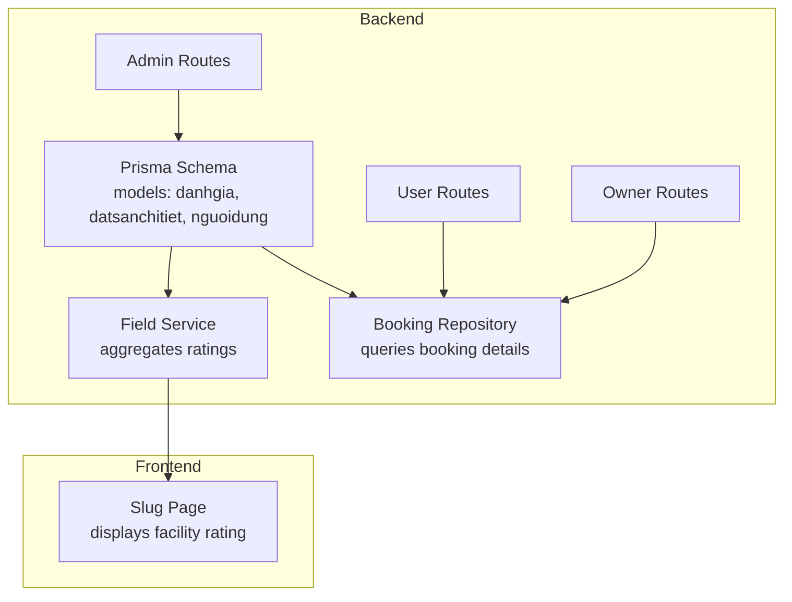
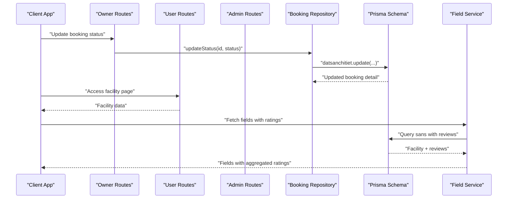
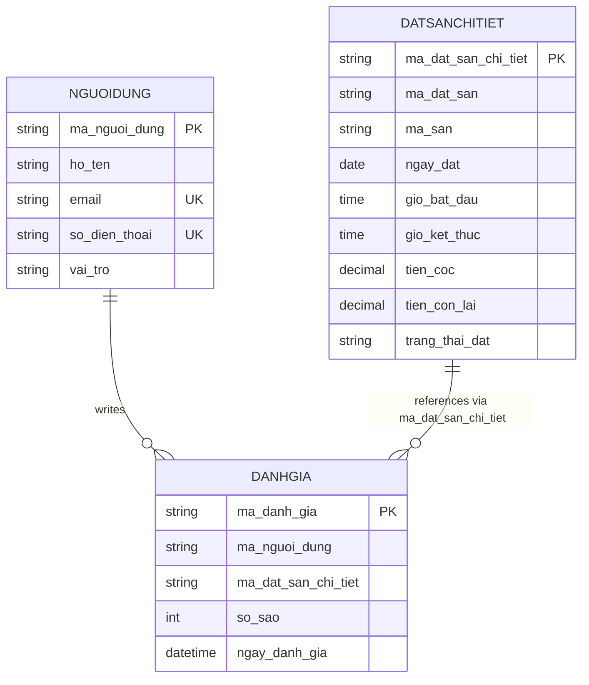
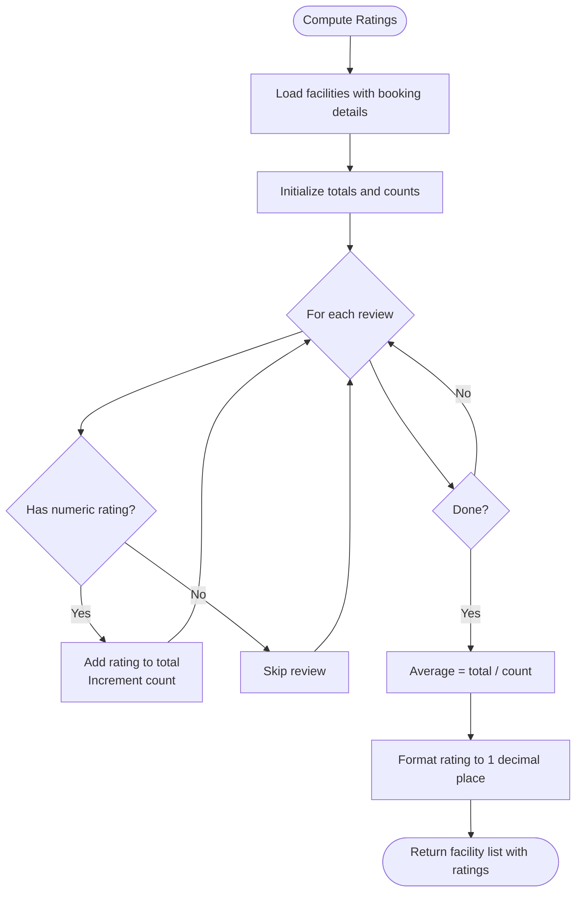
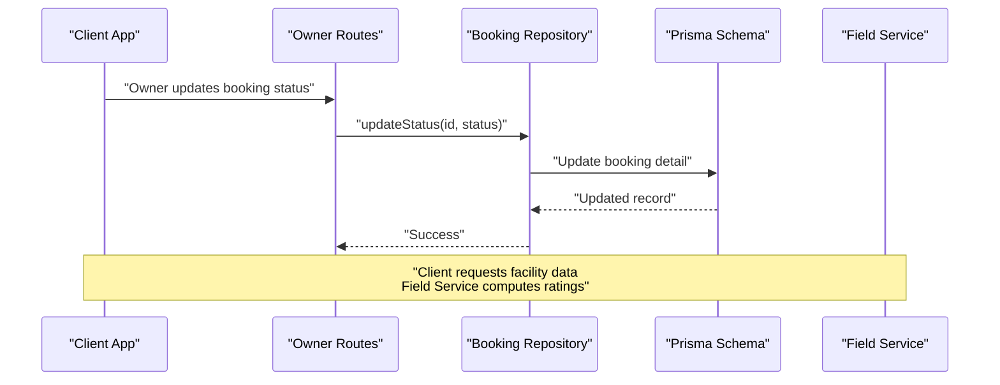
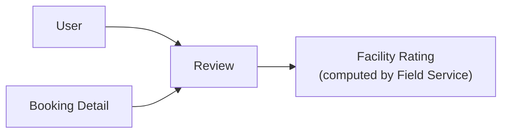

# Review Model

<cite>
**Referenced Files in This Document**
- [schema.prisma](file://backend/prisma/schema.prisma)
- [field.service.ts](file://backend/src/services/field.service.ts)
- [booking.repository.ts](file://backend/src/repositories/booking.repository.ts)
- [user.routes.ts](file://backend/src/routers/user.routes.ts)
- [owner.routes.ts](file://backend/src/routers/owner.routes.ts)
- [admin.routes.ts](file://backend/src/routers/admin.routes.ts)
- [page.tsx](file://frontend/src/app/(user)/courts/[slug]/page.tsx)
</cite>

## Table of Contents
1. [Introduction](#introduction)
2. [Project Structure](#project-structure)
3. [Core Components](#core-components)
4. [Architecture Overview](#architecture-overview)
5. [Detailed Component Analysis](#detailed-component-analysis)
6. [Dependency Analysis](#dependency-analysis)
7. [Performance Considerations](#performance-considerations)
8. [Troubleshooting Guide](#troubleshooting-guide)
9. [Conclusion](#conclusion)

## Introduction
This document describes the Review model (danhgia) that captures user-generated ratings and feedback for sports facilities and their booking experiences. It explains the data model, relationships to Users and BookingDetail records, the star rating aggregation logic, and how reviews integrate with facility visibility and reputation metrics. It also outlines the current review submission workflow, rating validation behavior, and moderation considerations based on the repository’s implementation.

## Project Structure
The Review model is defined in the Prisma schema and is used by backend services to compute facility ratings. Frontend pages consume these ratings for display. The relevant backend routes and repositories support booking lifecycle operations that indirectly enable review participation.

**Diagram sources**
- [schema.prisma:20-28](file://backend/prisma/schema.prisma#L20-L28)
- [field.service.ts:1-42](file://backend/src/services/field.service.ts#L1-L42)
- [booking.repository.ts:1-49](file://backend/src/repositories/booking.repository.ts#L1-L49)
- [user.routes.ts:1-10](file://backend/src/routers/user.routes.ts#L1-L10)
- [owner.routes.ts:1-23](file://backend/src/routers/owner.routes.ts#L1-L23)
- [admin.routes.ts:1-6](file://backend/src/routers/admin.routes.ts#L1-L6)
- [page.tsx:28-52](file://frontend/src/app/(user)/courts/[slug]/page.tsx#L28-L52)

**Section sources**
- [schema.prisma:20-28](file://backend/prisma/schema.prisma#L20-L28)
- [field.service.ts:1-42](file://backend/src/services/field.service.ts#L1-L42)
- [booking.repository.ts:1-49](file://backend/src/repositories/booking.repository.ts#L1-L49)
- [user.routes.ts:1-10](file://backend/src/routers/user.routes.ts#L1-L10)
- [owner.routes.ts:1-23](file://backend/src/routers/owner.routes.ts#L1-L23)
- [admin.routes.ts:1-6](file://backend/src/routers/admin.routes.ts#L1-L6)
- [page.tsx:28-52](file://frontend/src/app/(user)/courts/[slug]/page.tsx#L28-L52)

## Core Components
- Review model (danhgia)
  - Primary key: ma_danh_gia
  - Reviewer: ma_nguoi_dung (foreign key to nguoidung)
  - Booking reference: ma_dat_san_chi_tiet (foreign key to datsanchitiet)
  - Rating: so_sao (integer)
  - Timestamp: ngay_danh_gia (defaults to current time)
  - Relationships:
    - danhgia -> datsanchitiet (one-to-many)
    - danhgia -> nguoidung (one-to-many)

- Rating aggregation
  - The Field Service computes average star ratings per facility by traversing associated booking details and their reviews.

- Booking integration
  - Booking details (datsanchitiet) are queried by owners and users and can be linked to reviews via the ma_dat_san_chi_tiet field.

**Section sources**
- [schema.prisma:20-28](file://backend/prisma/schema.prisma#L20-L28)
- [field.service.ts:7-38](file://backend/src/services/field.service.ts#L7-L38)
- [booking.repository.ts:3-45](file://backend/src/repositories/booking.repository.ts#L3-L45)

## Architecture Overview
The review lifecycle integrates user actions, booking completion, and rating aggregation. Reviews are stored independently and attached to booking details. Facilities’ public ratings are computed server-side and surfaced to clients.

**Diagram sources**
- [owner.routes.ts:19-20](file://backend/src/routers/owner.routes.ts#L19-L20)
- [booking.repository.ts:40-45](file://backend/src/repositories/booking.repository.ts#L40-L45)
- [schema.prisma:43-56](file://backend/prisma/schema.prisma#L43-L56)
- [field.service.ts:4-38](file://backend/src/services/field.service.ts#L4-L38)

## Detailed Component Analysis

### Review Model Definition and Relationships
The Review model encapsulates user feedback and is related to Users and BookingDetails. The Prisma schema defines the fields and relations.

**Diagram sources**
- [schema.prisma:20-28](file://backend/prisma/schema.prisma#L20-L28)
- [schema.prisma:43-56](file://backend/prisma/schema.prisma#L43-L56)
- [schema.prisma:92-111](file://backend/prisma/schema.prisma#L92-L111)

**Section sources**
- [schema.prisma:20-28](file://backend/prisma/schema.prisma#L20-L28)
- [schema.prisma:43-56](file://backend/prisma/schema.prisma#L43-L56)
- [schema.prisma:92-111](file://backend/prisma/schema.prisma#L92-L111)

### Star Rating Aggregation and Facility Visibility
The Field Service aggregates star ratings per facility by iterating over associated booking details and their reviews. Only reviews with a numeric rating contribute to the average.

**Diagram sources**
- [field.service.ts:4-38](file://backend/src/services/field.service.ts#L4-L38)

**Section sources**
- [field.service.ts:4-38](file://backend/src/services/field.service.ts#L4-L38)

### Review Submission Workflow
Current implementation highlights:
- Reviews are modeled and stored in the danhgia table with foreign keys to nguoidung and datsanchitiet.
- There are no explicit review submission endpoints in the user or owner route files visible in the repository snapshot.
- The frontend displays facility ratings and review counts on the facility slug page.

**Diagram sources**
- [owner.routes.ts:19-20](file://backend/src/routers/owner.routes.ts#L19-L20)
- [booking.repository.ts:40-45](file://backend/src/repositories/booking.repository.ts#L40-L45)
- [schema.prisma:43-56](file://backend/prisma/schema.prisma#L43-L56)
- [field.service.ts:4-38](file://backend/src/services/field.service.ts#L4-L38)

**Section sources**
- [schema.prisma:20-28](file://backend/prisma/schema.prisma#L20-L28)
- [owner.routes.ts:19-20](file://backend/src/routers/owner.routes.ts#L19-L20)
- [booking.repository.ts:40-45](file://backend/src/repositories/booking.repository.ts#L40-L45)
- [field.service.ts:4-38](file://backend/src/services/field.service.ts#L4-L38)
- [page.tsx:28-52](file://frontend/src/app/(user)/courts/[slug]/page.tsx#L28-L52)

### Rating Validation Logic
- The so_sao field is an integer in the schema.
- Aggregation logic in the Field Service only includes reviews with a numeric rating value in the average calculation.
- No explicit validation is shown in the repository for rating bounds (e.g., 1–5), but downstream display and computation rely on numeric values.

**Section sources**
- [schema.prisma:24](file://backend/prisma/schema.prisma#L24)
- [field.service.ts:11-18](file://backend/src/services/field.service.ts#L11-L18)

### Review Moderation Process
- The repository snapshot does not expose moderation endpoints or flags for reviews.
- No explicit approval workflow is present in the routes or services examined.

**Section sources**
- [user.routes.ts:1-10](file://backend/src/routers/user.routes.ts#L1-L10)
- [owner.routes.ts:1-23](file://backend/src/routers/owner.routes.ts#L1-L23)
- [admin.routes.ts:1-6](file://backend/src/routers/admin.routes.ts#L1-L6)

### Integration with Booking Completion
- Booking details (datsanchitiet) are queried by owners and users and can be linked to reviews via ma_dat_san_chi_tiet.
- Owner routes include updating booking statuses, which can precede review availability depending on business rules.

**Section sources**
- [booking.repository.ts:3-45](file://backend/src/repositories/booking.repository.ts#L3-L45)
- [owner.routes.ts:19-20](file://backend/src/routers/owner.routes.ts#L19-L20)

## Dependency Analysis
The Review model depends on:
- User identity (nguoidung) for reviewer attribution
- Booking detail (datsanchitiet) for context and linkage to facility usage

**Diagram sources**
- [schema.prisma:20-28](file://backend/prisma/schema.prisma#L20-L28)
- [schema.prisma:43-56](file://backend/prisma/schema.prisma#L43-L56)
- [field.service.ts:4-38](file://backend/src/services/field.service.ts#L4-L38)

**Section sources**
- [schema.prisma:20-28](file://backend/prisma/schema.prisma#L20-L28)
- [schema.prisma:43-56](file://backend/prisma/schema.prisma#L43-L56)
- [field.service.ts:4-38](file://backend/src/services/field.service.ts#L4-L38)

## Performance Considerations
- Aggregation cost: Computing averages per facility iterates over booking details and reviews. For large datasets, consider:
  - Indexing on foreign keys (ma_nguoi_dung, ma_dat_san_chi_tiet)
  - Denormalized rating summaries per facility
  - Caching computed averages
- Network efficiency: The frontend currently displays ratings and counts; avoid redundant queries by batching or caching.

## Troubleshooting Guide
- Missing reviews in aggregation:
  - Verify that booking details are linked to reviews via ma_dat_san_chi_tiet.
  - Confirm that so_sao values are numeric and not null.
- Incorrect average:
  - Ensure only numeric ratings are counted in aggregation logic.
- No review submission endpoint:
  - Implement a dedicated endpoint to create reviews and associate them with booking details after completion.

**Section sources**
- [field.service.ts:11-18](file://backend/src/services/field.service.ts#L11-L18)
- [schema.prisma:24](file://backend/prisma/schema.prisma#L24)

## Conclusion
The Review model (danhgia) is well-defined in the Prisma schema and integrates with Users and BookingDetails. The Field Service aggregates star ratings for facility visibility, while the repository snapshot does not include explicit review submission endpoints, moderation workflows, or strict rating validation. To enhance the system, consider adding review submission endpoints, rating validation, and moderation controls aligned with booking completion events.