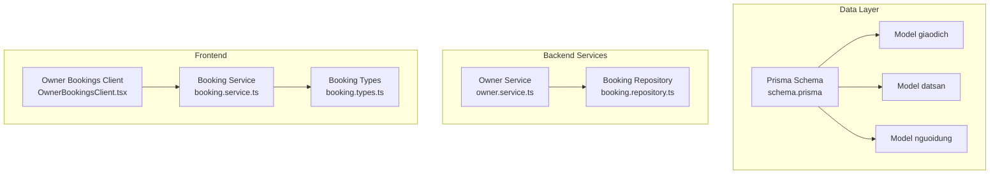
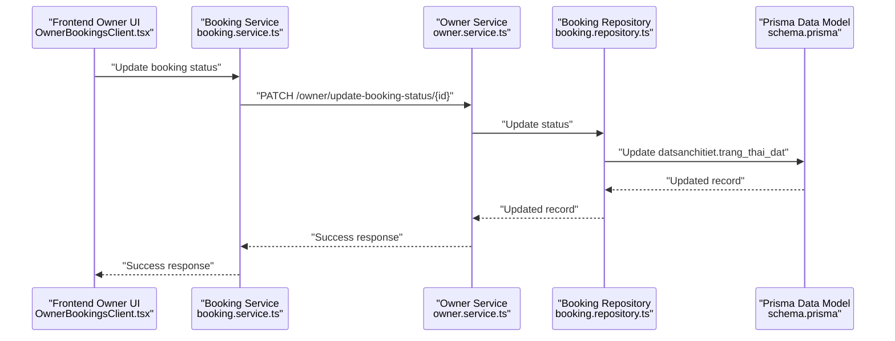
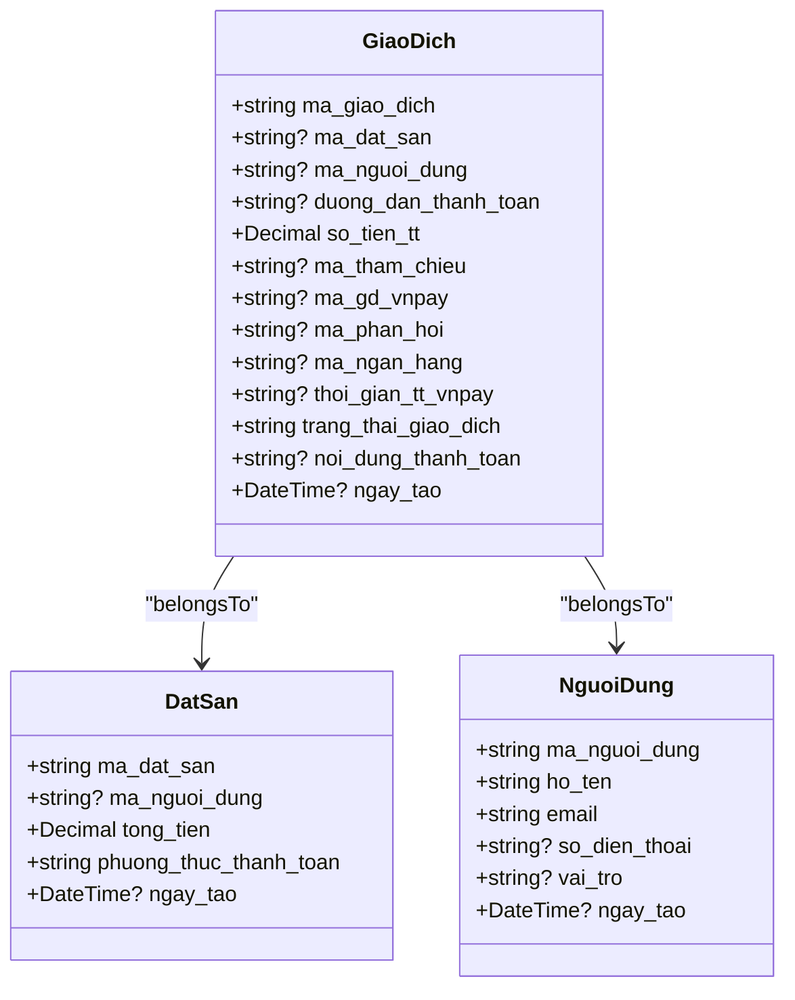
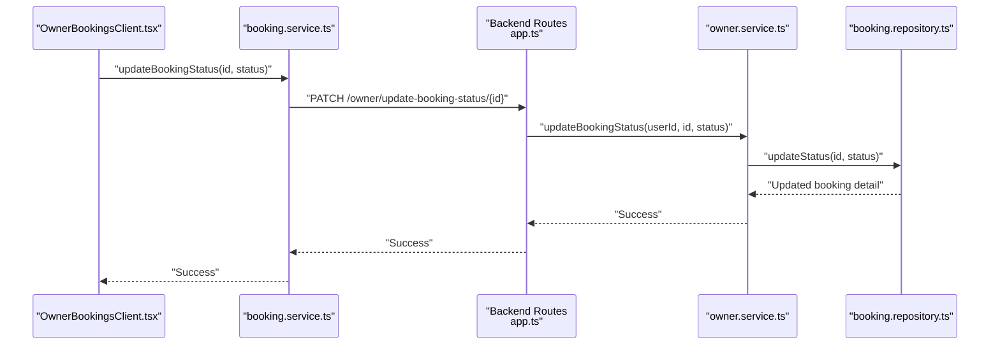
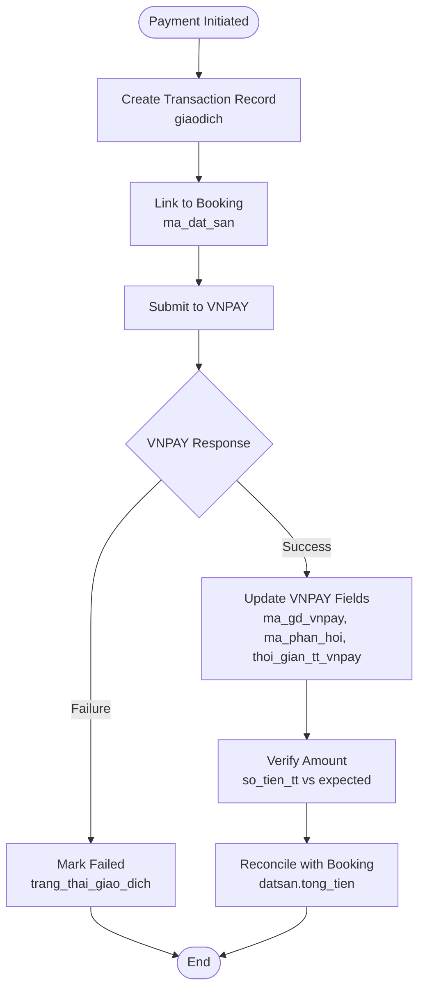
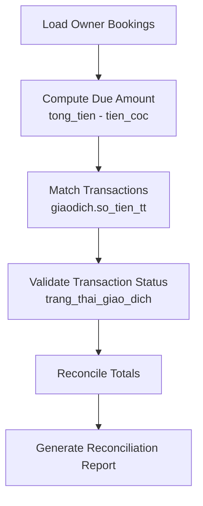
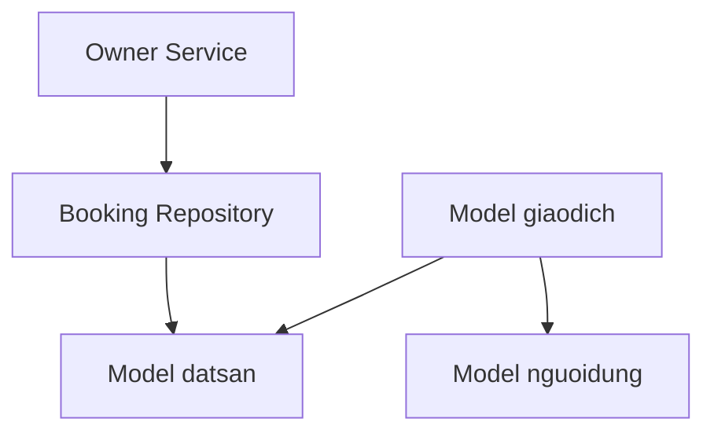

# Transaction Model

<cite>
**Referenced Files in This Document**
- [schema.prisma](file://backend/prisma/schema.prisma)
- [booking.repository.ts](file://backend/src/repositories/booking.repository.ts)
- [owner.service.ts](file://backend/src/services/owner.service.ts)
- [OwnerBookingsClient.tsx](file://frontend/src/components/owner/OwnerBookingsClient.tsx)
- [booking.types.ts](file://frontend/src/types/booking.types.ts)
- [booking.service.ts](file://frontend/src/services/booking.service.ts)
- [app.ts](file://backend/src/app.ts)
</cite>

## Table of Contents
1. [Introduction](#introduction)
2. [Project Structure](#project-structure)
3. [Core Components](#core-components)
4. [Architecture Overview](#architecture-overview)
5. [Detailed Component Analysis](#detailed-component-analysis)
6. [Dependency Analysis](#dependency-analysis)
7. [Performance Considerations](#performance-considerations)
8. [Troubleshooting Guide](#troubleshooting-guide)
9. [Conclusion](#conclusion)

## Introduction
This document provides comprehensive documentation for the Transaction model (giaodich) that represents payment processing and financial transactions in the platform. It explains all fields, their roles, and how they relate to the booking lifecycle. It also documents the VNPAY payment gateway integration, transaction lifecycle, payment verification process, and financial reconciliation workflows as implemented in the codebase.

## Project Structure
The Transaction model is defined in the Prisma schema and integrates with the backend services and frontend components that manage bookings and payments. The key areas involved are:
- Data model definition in Prisma
- Backend service layer for booking status updates
- Frontend components for displaying and confirming booking statuses
- API routing configuration

**Diagram sources**
- [schema.prisma:73-89](file://backend/prisma/schema.prisma#L73-L89)
- [booking.repository.ts:1-49](file://backend/src/repositories/booking.repository.ts#L1-L49)
- [owner.service.ts:135-144](file://backend/src/services/owner.service.ts#L135-L144)
- [OwnerBookingsClient.tsx:44-51](file://frontend/src/components/owner/OwnerBookingsClient.tsx#L44-L51)
- [booking.types.ts:1-36](file://frontend/src/types/booking.types.ts#L1-L36)
- [booking.service.ts:1-12](file://frontend/src/services/booking.service.ts#L1-L12)

**Section sources**
- [schema.prisma:73-89](file://backend/prisma/schema.prisma#L73-L89)
- [booking.repository.ts:1-49](file://backend/src/repositories/booking.repository.ts#L1-L49)
- [owner.service.ts:135-144](file://backend/src/services/owner.service.ts#L135-L144)
- [OwnerBookingsClient.tsx:44-51](file://frontend/src/components/owner/OwnerBookingsClient.tsx#L44-L51)
- [booking.types.ts:1-36](file://frontend/src/types/booking.types.ts#L1-L36)
- [booking.service.ts:1-12](file://frontend/src/services/booking.service.ts#L1-L12)

## Core Components
The Transaction model (giaodich) captures payment-related information for bookings. Below are the fields and their meanings:

- ma_giao_dich (primary key): Unique transaction identifier
- ma_dat_san: Booking reference linking to the booking header
- ma_nguoi_dung: User who performed the transaction
- duong_dan_thanh_toan: Payment proof document path
- so_tien_tt: Amount paid
- ma_tham_chieu: Reference number for the transaction
- ma_gd_vnpay: VNPAY transaction ID (unique)
- ma_phan_hoi: VNPAY response code
- ma_ngan_hang: Bank code associated with the transaction
- thoi_gian_tt_vnpay: Payment time from VNPAY
- trang_thai_giao_dich: Transaction status (default: "Chưa thanh toán")
- noi_dung_thanh_toan: Description of the payment
- ngay_tao: Creation timestamp

These fields enable end-to-end payment tracking, verification against VNPAY, and reconciliation with booking records.

**Section sources**
- [schema.prisma:73-89](file://backend/prisma/schema.prisma#L73-L89)

## Architecture Overview
The payment and transaction flow integrates frontend booking management with backend services and the Prisma data model. The frontend allows owners to confirm bookings and receive payments, while the backend updates booking statuses and persists transaction records.

**Diagram sources**
- [OwnerBookingsClient.tsx:44-51](file://frontend/src/components/owner/OwnerBookingsClient.tsx#L44-L51)
- [booking.service.ts:9-11](file://frontend/src/services/booking.service.ts#L9-L11)
- [owner.service.ts:135-144](file://backend/src/services/owner.service.ts#L135-L144)
- [booking.repository.ts:40-45](file://backend/src/repositories/booking.repository.ts#L40-L45)
- [schema.prisma:43-56](file://backend/prisma/schema.prisma#L43-L56)

## Detailed Component Analysis

### Transaction Model Fields and Relationships
The Transaction model (giaodich) is defined with explicit relationships to booking and user entities. It supports payment tracking and reconciliation by linking to the booking header and user.

**Diagram sources**
- [schema.prisma:73-89](file://backend/prisma/schema.prisma#L73-L89)
- [schema.prisma:31-40](file://backend/prisma/schema.prisma#L31-L40)
- [schema.prisma:92-111](file://backend/prisma/schema.prisma#L92-L111)

**Section sources**
- [schema.prisma:73-89](file://backend/prisma/schema.prisma#L73-L89)
- [schema.prisma:31-40](file://backend/prisma/schema.prisma#L31-L40)
- [schema.prisma:92-111](file://backend/prisma/schema.prisma#L92-L111)

### Booking Status Update Workflow
The frontend owner panel allows updating booking statuses, which triggers backend processing and persistence.

**Diagram sources**
- [OwnerBookingsClient.tsx:44-51](file://frontend/src/components/owner/OwnerBookingsClient.tsx#L44-L51)
- [booking.service.ts:9-11](file://frontend/src/services/booking.service.ts#L9-L11)
- [app.ts:1-21](file://backend/src/app.ts#L1-L21)
- [owner.service.ts:135-144](file://backend/src/services/owner.service.ts#L135-L144)
- [booking.repository.ts:40-45](file://backend/src/repositories/booking.repository.ts#L40-L45)

**Section sources**
- [OwnerBookingsClient.tsx:44-51](file://frontend/src/components/owner/OwnerBookingsClient.tsx#L44-L51)
- [booking.service.ts:9-11](file://frontend/src/services/booking.service.ts#L9-L11)
- [app.ts:1-21](file://backend/src/app.ts#L1-L21)
- [owner.service.ts:135-144](file://backend/src/services/owner.service.ts#L135-L144)
- [booking.repository.ts:40-45](file://backend/src/repositories/booking.repository.ts#L40-L45)

### Transaction Lifecycle and Payment Verification
The transaction lifecycle involves creating payment records linked to bookings and verifying payments via VNPAY. The model includes fields for VNPAY identifiers and response codes, enabling verification and reconciliation.

**Diagram sources**
- [schema.prisma:73-89](file://backend/prisma/schema.prisma#L73-L89)
- [schema.prisma:31-40](file://backend/prisma/schema.prisma#L31-L40)

**Section sources**
- [schema.prisma:73-89](file://backend/prisma/schema.prisma#L73-L89)
- [schema.prisma:31-40](file://backend/prisma/schema.prisma#L31-L40)

### Financial Reconciliation Workflows
Financial reconciliation ties transaction amounts to booking totals and ensures accurate settlement.

**Diagram sources**
- [OwnerBookingsClient.tsx:256-269](file://frontend/src/components/owner/OwnerBookingsClient.tsx#L256-L269)
- [booking.types.ts:17-24](file://frontend/src/types/booking.types.ts#L17-L24)
- [schema.prisma:73-89](file://backend/prisma/schema.prisma#L73-L89)

**Section sources**
- [OwnerBookingsClient.tsx:256-269](file://frontend/src/components/owner/OwnerBookingsClient.tsx#L256-L269)
- [booking.types.ts:17-24](file://frontend/src/types/booking.types.ts#L17-L24)
- [schema.prisma:73-89](file://backend/prisma/schema.prisma#L73-L89)

## Dependency Analysis
The Transaction model depends on related entities and is used by services and repositories to maintain data integrity and support payment workflows.

**Diagram sources**
- [schema.prisma:73-89](file://backend/prisma/schema.prisma#L73-L89)
- [schema.prisma:31-40](file://backend/prisma/schema.prisma#L31-L40)
- [schema.prisma:92-111](file://backend/prisma/schema.prisma#L92-L111)
- [owner.service.ts:135-144](file://backend/src/services/owner.service.ts#L135-L144)
- [booking.repository.ts:1-49](file://backend/src/repositories/booking.repository.ts#L1-L49)

**Section sources**
- [schema.prisma:73-89](file://backend/prisma/schema.prisma#L73-L89)
- [schema.prisma:31-40](file://backend/prisma/schema.prisma#L31-L40)
- [schema.prisma:92-111](file://backend/prisma/schema.prisma#L92-L111)
- [owner.service.ts:135-144](file://backend/src/services/owner.service.ts#L135-L144)
- [booking.repository.ts:1-49](file://backend/src/repositories/booking.repository.ts#L1-L49)

## Performance Considerations
- Indexing: Ensure unique and frequently queried fields (e.g., ma_gd_vnpay, ma_tham_chieu) are indexed for fast lookups during reconciliation.
- Aggregation: Use database aggregation queries to compute totals efficiently rather than loading large datasets into memory.
- Caching: Cache frequently accessed booking and transaction summaries to reduce database load.
- Pagination: Apply pagination when listing transactions and bookings to avoid heavy payloads.

## Troubleshooting Guide
Common issues and resolutions:
- Duplicate VNPAY transaction IDs: Ensure ma_gd_vnpay uniqueness to prevent conflicts.
- Mismatched amounts: Compare so_tien_tt with expected booking totals (tong_tien) and reconcile discrepancies.
- Incorrect statuses: Verify trang_thai_giao_dich transitions align with payment outcomes.
- Missing relations: Confirm ma_dat_san and ma_nguoi_dung foreign keys resolve to valid records.

**Section sources**
- [schema.prisma:73-89](file://backend/prisma/schema.prisma#L73-L89)
- [OwnerBookingsClient.tsx:256-269](file://frontend/src/components/owner/OwnerBookingsClient.tsx#L256-L269)

## Conclusion
The Transaction model (giaodich) provides a robust foundation for payment processing and financial tracking. By linking to bookings and users, and incorporating VNPAY-specific fields, it enables end-to-end payment verification and reconciliation. The frontend and backend components work together to manage booking statuses and persist transaction data, ensuring accurate financial workflows across the platform.