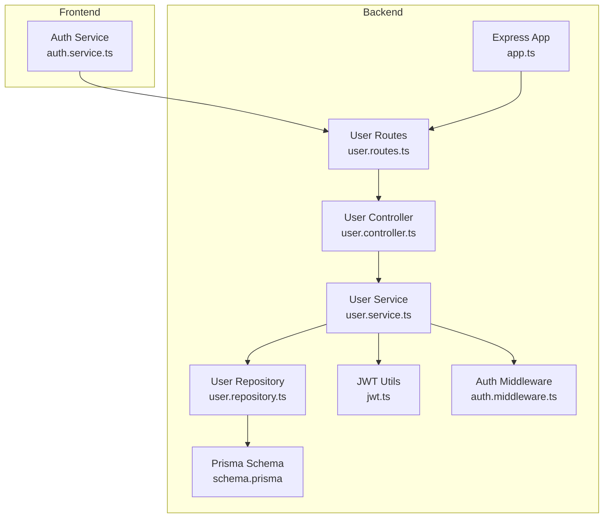
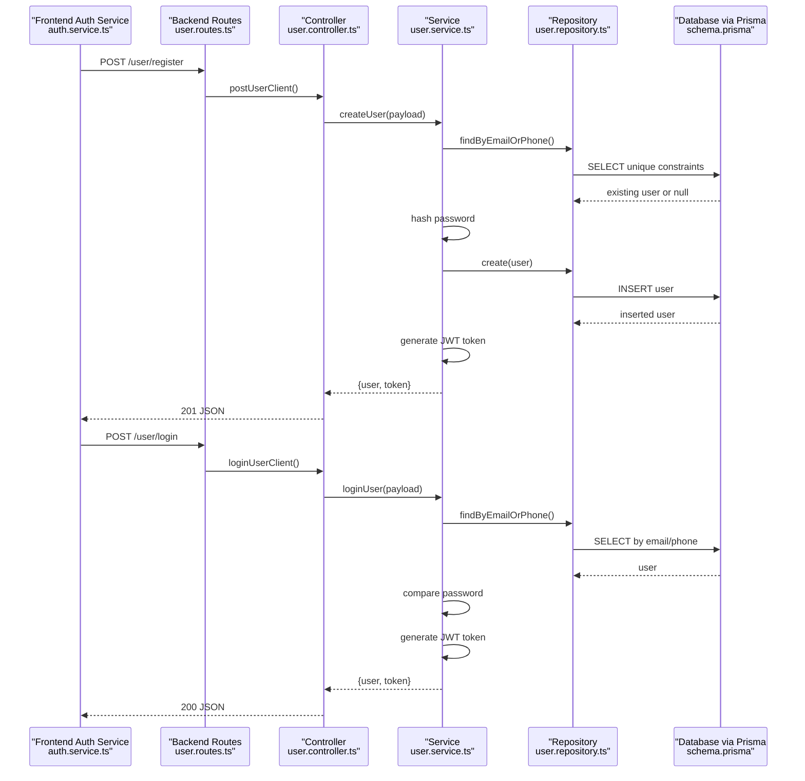
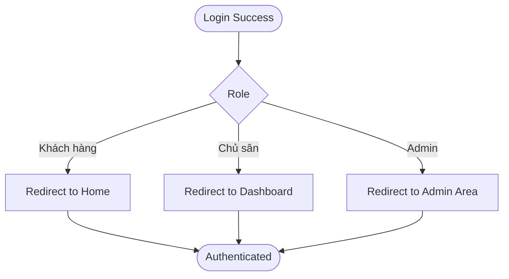
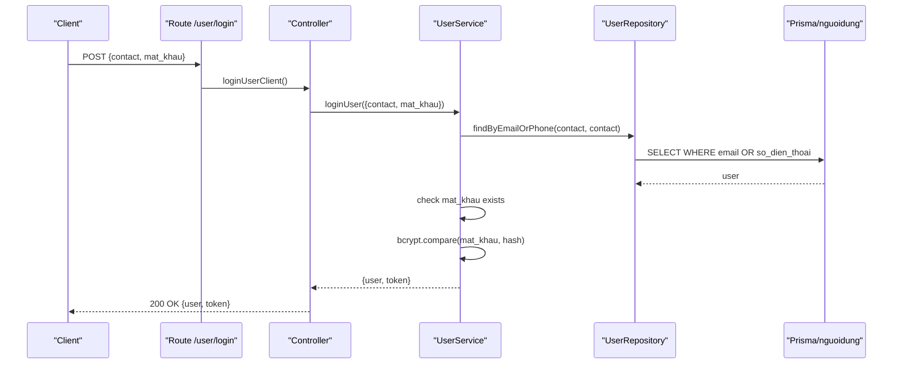
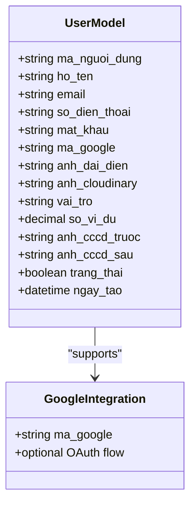
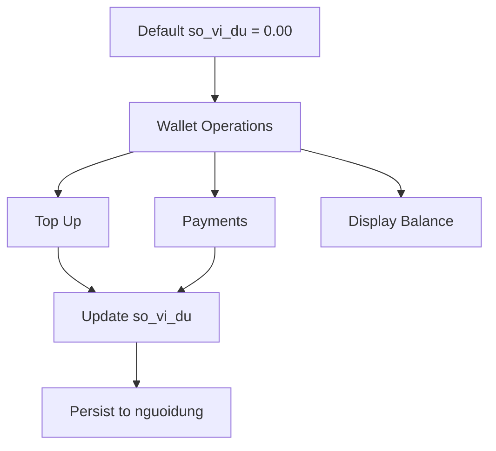
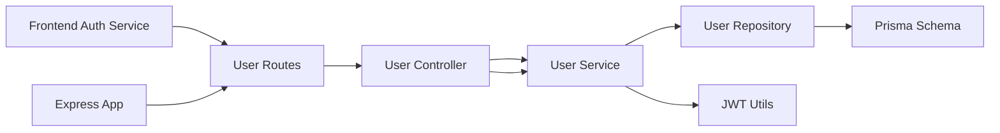

# User Model

<cite>
**Referenced Files in This Document**
- [schema.prisma](file://backend/prisma/schema.prisma)
- [user.type.ts](file://backend/src/types/user.type.ts)
- [user.controller.ts](file://backend/src/controllers/user.controller.ts)
- [user.service.ts](file://backend/src/services/user.service.ts)
- [user.repository.ts](file://backend/src/repositories/user.repository.ts)
- [jwt.ts](file://backend/src/utils/jwt.ts)
- [auth.middleware.ts](file://backend/src/middlewares/auth.middleware.ts)
- [user.routes.ts](file://backend/src/routers/user.routes.ts)
- [app.ts](file://backend/src/app.ts)
- [auth.service.ts](file://frontend/src/services/auth.service.ts)
</cite>

## Table of Contents
1. [Introduction](#introduction)
2. [Project Structure](#project-structure)
3. [Core Components](#core-components)
4. [Architecture Overview](#architecture-overview)
5. [Detailed Component Analysis](#detailed-component-analysis)
6. [Dependency Analysis](#dependency-analysis)
7. [Performance Considerations](#performance-considerations)
8. [Troubleshooting Guide](#troubleshooting-guide)
9. [Conclusion](#conclusion)

## Introduction
This document provides comprehensive documentation for the User model (nguoidung) in the sports facility booking platform. It explains all model fields, role-based access control, authentication flow, password handling, social login integration, and the wallet system. It also covers validation rules, unique constraints, and business logic for user registration, profile management, and account status verification.

## Project Structure
The User model and its related functionality span the backend Prisma schema, Express controllers, services, repositories, middleware, and frontend authentication service. The routes expose registration and login endpoints under the "/user" base path.

**Diagram sources**
- [schema.prisma](file://backend/prisma/schema.prisma)
- [user.routes.ts](file://backend/src/routers/user.routes.ts)
- [user.controller.ts](file://backend/src/controllers/user.controller.ts)
- [user.service.ts](file://backend/src/services/user.service.ts)
- [user.repository.ts](file://backend/src/repositories/user.repository.ts)
- [jwt.ts](file://backend/src/utils/jwt.ts)
- [auth.middleware.ts](file://backend/src/middlewares/auth.middleware.ts)
- [app.ts](file://backend/src/app.ts)
- [auth.service.ts](file://frontend/src/services/auth.service.ts)

**Section sources**
- [app.ts:1-21](file://backend/src/app.ts#L1-L21)
- [user.routes.ts:1-10](file://backend/src/routers/user.routes.ts#L1-L10)

## Core Components
The User model (nguoidung) defines the core data structure for registered users. Below are the fields and their characteristics:

- ma_nguoi_dung (Primary Key): Unique identifier for users, auto-generated by the repository logic.
- ho_ten: Full name of the user.
- email: Email address, unique constraint enforced at the database level.
- so_dien_thoai: Phone number, unique constraint enforced at the database level.
- mat_khau: Hashed password stored after registration or login attempts.
- ma_google: Optional Google identifier, unique constraint enforced at the database level.
- anh_dai_dien: Avatar URL or path.
- anh_cloudinary: Cloudinary image identifier.
- vai_tro: Role with default value "Khách hàng". Possible values include "Khách hàng", "Chủ sân", "Admin".
- so_vi_du: Wallet balance with default 0.00.
- anh_cccd_truoc: Front ID card image URL/path.
- anh_cccd_sau: Back ID card image URL/path.
- trang_thai: Account status flag with default false.
- ngay_tao: Creation timestamp with default current time.

Key constraints and defaults:
- Unique constraints on email, so_dien_thoai, and ma_google.
- Default values for vai_tro ("Khách hàng"), so_vi_du (0.00), trang_thai (false), and ngay_tao (now).

Validation and business rules:
- Registration checks uniqueness of email and phone before creating a user.
- Password hashing is performed during registration.
- Login validates credentials and generates a JWT token containing user id and role.

**Section sources**
- [schema.prisma:92-111](file://backend/prisma/schema.prisma#L92-L111)
- [user.service.ts:8-42](file://backend/src/services/user.service.ts#L8-L42)
- [user.repository.ts:36-49](file://backend/src/repositories/user.repository.ts#L36-L49)

## Architecture Overview
The user authentication and registration flow spans frontend and backend components. The frontend sends requests to backend endpoints, which are handled by controllers, processed by services, persisted via repositories, and validated against the Prisma schema.

**Diagram sources**
- [auth.service.ts:13-20](file://frontend/src/services/auth.service.ts#L13-L20)
- [user.routes.ts:7-8](file://backend/src/routers/user.routes.ts#L7-L8)
- [user.controller.ts:7-13](file://backend/src/controllers/user.controller.ts#L7-L13)
- [user.service.ts:8-65](file://backend/src/services/user.service.ts#L8-L65)
- [user.repository.ts:10-34](file://backend/src/repositories/user.repository.ts#L10-L34)
- [schema.prisma:92-111](file://backend/prisma/schema.prisma#L92-L111)

## Detailed Component Analysis

### User Model Fields and Constraints
- Primary Key: ma_nguoi_dung
- Unique Fields: email, so_dien_thoai, ma_google
- Defaults: vai_tro = "Khách hàng", so_vi_du = 0.00, trang_thai = false, ngay_tao = now()
- Optional Fields: so_dien_thoai, mat_khau, ma_google, anh_dai_dien, anh_cloudinary, anh_cccd_truoc, anh_cccd_sau

Validation and business logic:
- Registration enforces uniqueness of email and phone before inserting a new record.
- Password is hashed before storage.
- Login verifies credentials and throws appropriate errors for not found or invalid password scenarios.

**Section sources**
- [schema.prisma:92-111](file://backend/prisma/schema.prisma#L92-L111)
- [user.service.ts:11-21](file://backend/src/services/user.service.ts#L11-L21)
- [user.repository.ts:36-49](file://backend/src/repositories/user.repository.ts#L36-L49)

### Role-Based Access Control (RBAC)
Roles supported by the model:
- Khách hàng: Default role for regular users
- Chủ sân: Facility owners
- Admin: Administrative users

The JWT payload includes the user's role, enabling downstream middleware and controllers to enforce permissions. The frontend navigates differently based on role upon successful login.

**Diagram sources**
- [user.service.ts:40-64](file://backend/src/services/user.service.ts#L40-L64)
- [auth.middleware.ts:9-27](file://backend/src/middlewares/auth.middleware.ts#L9-L27)
- [auth.service.ts:55-83](file://frontend/src/services/auth.service.ts#L55-L83)

**Section sources**
- [schema.prisma](file://backend/prisma/schema.prisma#L101)
- [user.service.ts:40-64](file://backend/src/services/user.service.ts#L40-L64)
- [auth.middleware.ts:9-27](file://backend/src/middlewares/auth.middleware.ts#L9-L27)
- [auth.service.ts:68-73](file://frontend/src/services/auth.service.ts#L68-L73)

### Authentication Flow and Password Handling
- Registration:
  - Validates uniqueness of email and phone
  - Generates next user ID
  - Hashes password using bcrypt
  - Creates user record with trang_thai enabled
  - Returns user and JWT token
- Login:
  - Finds user by email or phone
  - Ensures password exists for the account
  - Compares provided password with stored hash
  - Returns user and JWT token

**Diagram sources**
- [user.routes.ts](file://backend/src/routers/user.routes.ts#L8)
- [user.controller.ts:11-13](file://backend/src/controllers/user.controller.ts#L11-L13)
- [user.service.ts:44-65](file://backend/src/services/user.service.ts#L44-L65)
- [user.repository.ts:10-16](file://backend/src/repositories/user.repository.ts#L10-L16)

**Section sources**
- [user.service.ts:8-42](file://backend/src/services/user.service.ts#L8-L42)
- [user.service.ts:44-65](file://backend/src/services/user.service.ts#L44-L65)
- [jwt.ts:6-12](file://backend/src/utils/jwt.ts#L6-L12)

### Social Login Integration via Google
The model includes ma_google for optional Google login integration. The frontend contains UI elements for Google login, indicating support for OAuth flows. While the backend currently implements email/phone and password login, the presence of ma_google allows future extension to Google OAuth without schema changes.

**Diagram sources**
- [schema.prisma:92-111](file://backend/prisma/schema.prisma#L92-L111)
- [auth.service.ts:339-356](file://frontend/src/services/auth.service.ts#L339-L356)

**Section sources**
- [schema.prisma](file://backend/prisma/schema.prisma#L98)
- [auth.service.ts:339-356](file://frontend/src/services/auth.service.ts#L339-L356)

### Wallet System (so_vi_du)
The so_vi_du field represents the user's wallet balance with a default of 0.00. The frontend includes a wallet card component, indicating UI support for displaying and managing balances. The backend does not expose explicit wallet endpoints in the provided context, but the field exists for potential future wallet operations.

**Diagram sources**
- [schema.prisma](file://backend/prisma/schema.prisma#L102)
- [auth.service.ts:50-91](file://frontend/src/components/profile/ProfileClient.tsx#L50-L91)

**Section sources**
- [schema.prisma](file://backend/prisma/schema.prisma#L102)
- [auth.service.ts:50-91](file://frontend/src/components/profile/ProfileClient.tsx#L50-L91)

### Validation Rules and Unique Constraints
- Unique constraints enforced by the schema:
  - email: unique
  - so_dien_thoai: unique
  - ma_google: unique
- Additional business validations:
  - Registration prevents duplicate email or phone
  - Login requires existing user and matching password

**Section sources**
- [schema.prisma:95-96](file://backend/prisma/schema.prisma#L95-L96)
- [schema.prisma](file://backend/prisma/schema.prisma#L98)
- [user.service.ts:11-21](file://backend/src/services/user.service.ts#L11-L21)
- [user.repository.ts:10-16](file://backend/src/repositories/user.repository.ts#L10-L16)

### User Registration and Profile Management
- Registration endpoint: POST /user/register
- Profile management:
  - Name, email, phone, and optional avatar fields
  - Optional ID card images for owner registration flow
  - Role assignment defaults to "Khách hàng"

**Section sources**
- [user.routes.ts](file://backend/src/routers/user.routes.ts#L7)
- [user.controller.ts:7-10](file://backend/src/controllers/user.controller.ts#L7-L10)
- [user.type.ts:1-12](file://backend/src/types/user.type.ts#L1-L12)
- [auth.service.ts:13-20](file://frontend/src/services/auth.service.ts#L13-L20)

### Account Status Verification
- trang_thai field defaults to false, indicating accounts require verification
- Upon successful registration, the service enables trang_thai for new users
- Future enhancements can leverage this flag for email verification or admin approval flows

**Section sources**
- [schema.prisma](file://backend/prisma/schema.prisma#L105)
- [user.service.ts](file://backend/src/services/user.service.ts#L37)

## Dependency Analysis
The user module follows a layered architecture with clear separation of concerns:

**Diagram sources**
- [user.routes.ts:1-10](file://backend/src/routers/user.routes.ts#L1-L10)
- [user.controller.ts:1-14](file://backend/src/controllers/user.controller.ts#L1-L14)
- [user.service.ts:1-69](file://backend/src/services/user.service.ts#L1-L69)
- [user.repository.ts:1-53](file://backend/src/repositories/user.repository.ts#L1-L53)
- [jwt.ts:1-13](file://backend/src/utils/jwt.ts#L1-L13)
- [app.ts:1-21](file://backend/src/app.ts#L1-L21)

**Section sources**
- [app.ts:14-18](file://backend/src/app.ts#L14-L18)
- [user.routes.ts:1-10](file://backend/src/routers/user.routes.ts#L1-L10)

## Performance Considerations
- Password hashing uses bcrypt with a moderate cost; consider monitoring hash duration and adjusting cost if needed.
- Unique lookups on email and phone rely on database indexes; ensure proper indexing for high throughput.
- JWT generation and verification are lightweight; cache tokens appropriately on the client-side to reduce network overhead.
- Consider pagination for user lists and lazy loading for profile images to optimize frontend performance.

## Troubleshooting Guide
Common issues and resolutions:
- Duplicate email or phone during registration:
  - The service throws a 400 error when either email or phone already exists.
- Invalid login credentials:
  - 404 if user not found; 400 if password mismatch; 400 if account lacks a password (may be a social login account).
- Missing or invalid JWT:
  - Authentication middleware returns 401 for missing bearer token or invalid token.
- Database constraint violations:
  - Unique constraint failures on email, phone, or Google ID will surface as validation errors; ensure frontend handles these gracefully.

**Section sources**
- [user.service.ts:14-21](file://backend/src/services/user.service.ts#L14-L21)
- [user.service.ts:49-60](file://backend/src/services/user.service.ts#L49-L60)
- [auth.middleware.ts:9-27](file://backend/src/middlewares/auth.middleware.ts#L9-L27)

## Conclusion
The User model (nguoidung) provides a robust foundation for user management in the sports facility booking platform. It supports role-based access control, secure authentication with bcrypt, optional Google integration, and a wallet system. The backend architecture cleanly separates concerns across routes, controllers, services, and repositories, while the frontend integrates seamlessly with authentication flows. Future enhancements can focus on expanding social login capabilities, implementing account verification workflows, and adding wallet transaction endpoints.