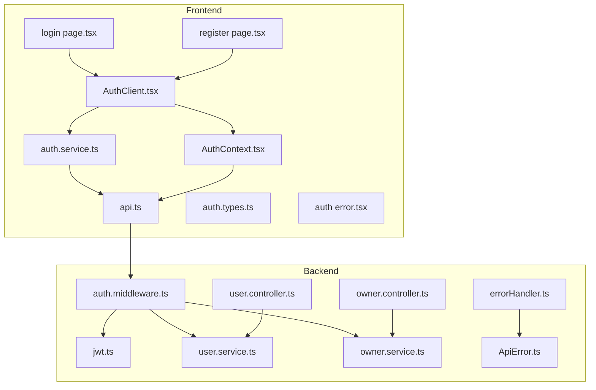
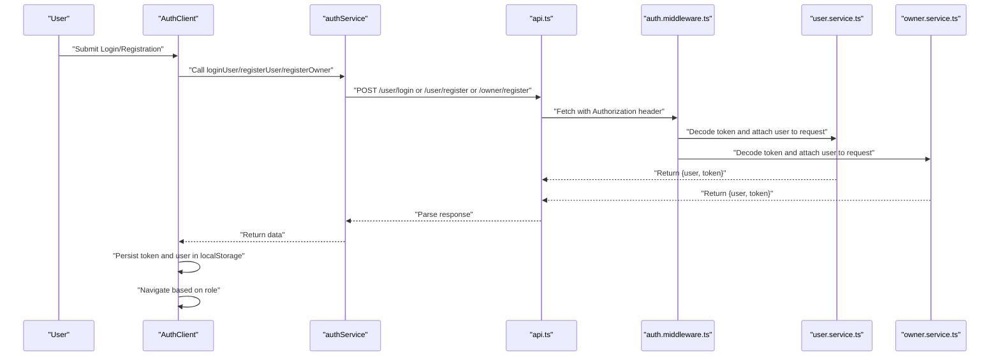
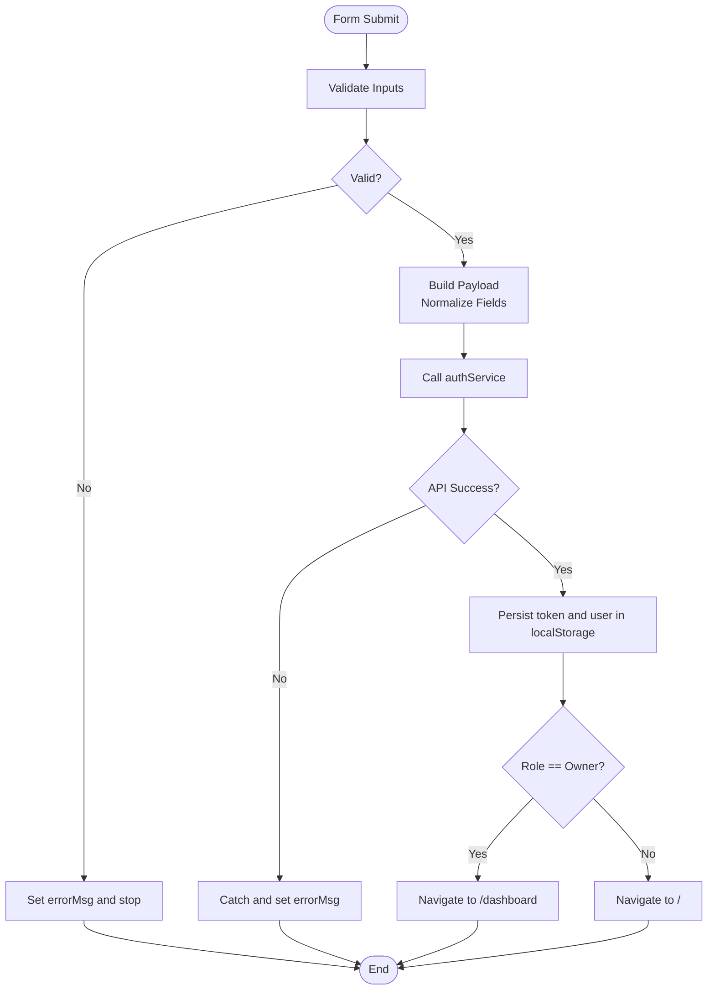
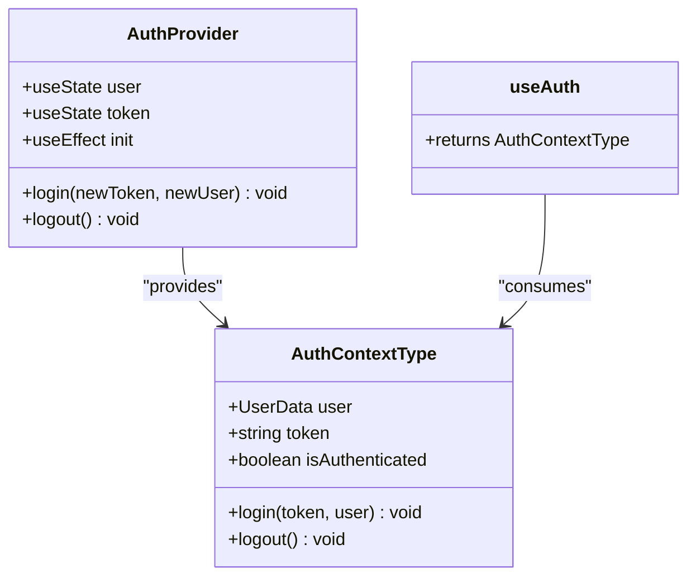
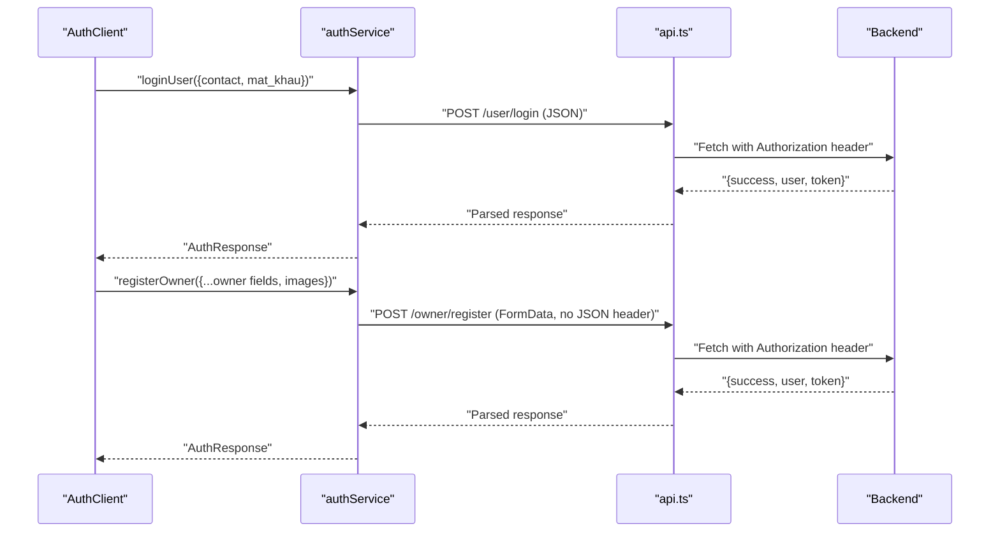
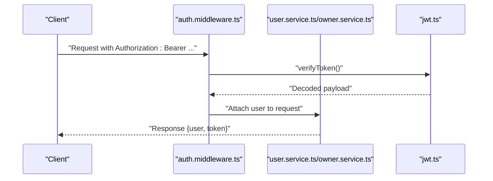
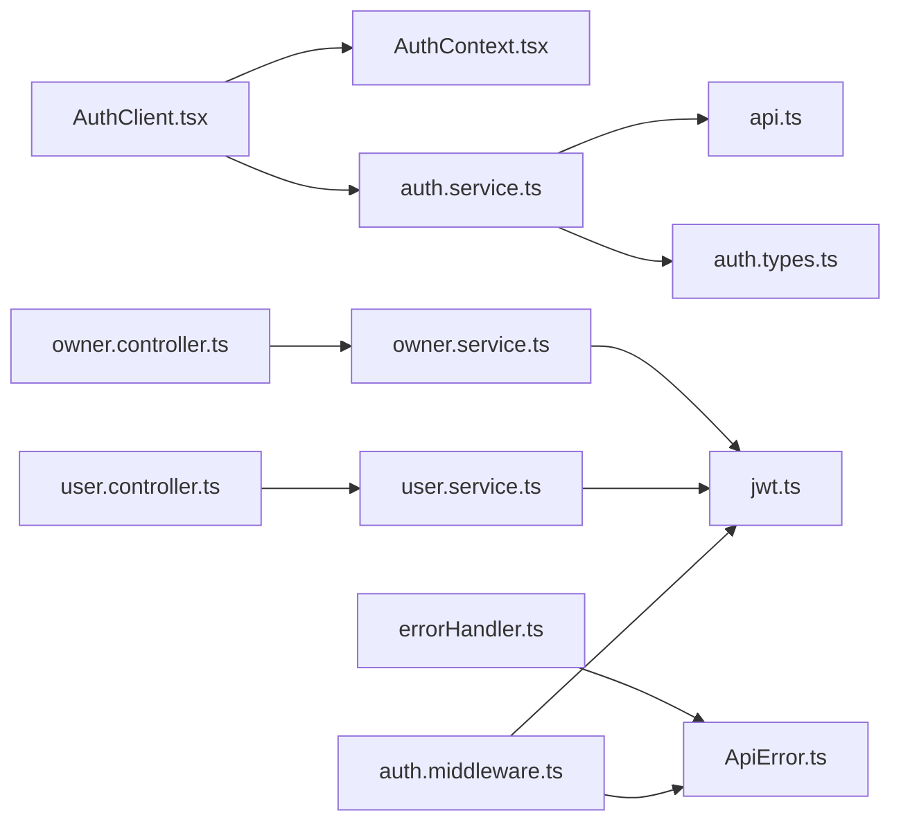

# Authentication Components

<cite>
**Referenced Files in This Document**
- [AuthClient.tsx](file://frontend/src/components/auth/AuthClient.tsx)
- [AuthContext.tsx](file://frontend/src/contexts/AuthContext.tsx)
- [auth.service.ts](file://frontend/src/services/auth.service.ts)
- [api.ts](file://frontend/src/services/api.ts)
- [auth.types.ts](file://frontend/src/types/auth.types.ts)
- [login page.tsx](file://frontend/src/app/(auth)/login/page.tsx)
- [register page.tsx](file://frontend/src/app/(auth)/register/page.tsx)
- [auth error.tsx](file://frontend/src/app/(auth)/error.tsx)
- [auth.middleware.ts](file://backend/src/middlewares/auth.middleware.ts)
- [jwt.ts](file://backend/src/utils/jwt.ts)
- [user.service.ts](file://backend/src/services/user.service.ts)
- [owner.service.ts](file://backend/src/services/owner.service.ts)
- [owner.controller.ts](file://backend/src/controllers/owner.controller.ts)
- [user.controller.ts](file://backend/src/controllers/user.controller.ts)
- [ApiError.ts](file://backend/src/utils/ApiError.ts)
- [errorHandler.ts](file://backend/src/middlewares/errorHandler.ts)
</cite>

## Table of Contents
1. [Introduction](#introduction)
2. [Project Structure](#project-structure)
3. [Core Components](#core-components)
4. [Architecture Overview](#architecture-overview)
5. [Detailed Component Analysis](#detailed-component-analysis)
6. [Dependency Analysis](#dependency-analysis)
7. [Performance Considerations](#performance-considerations)
8. [Troubleshooting Guide](#troubleshooting-guide)
9. [Conclusion](#conclusion)

## Introduction
This document explains the authentication system for the application, focusing on the client-side authentication component, login and registration pages, and authentication context management. It covers JWT token handling, role-based access control, form validation, error handling patterns, and integration with the backend authentication APIs. Security considerations, password validation, and user session management are also addressed, along with examples of authentication flow implementation and custom hook usage.

## Project Structure
The authentication system spans the frontend and backend:
- Frontend:
  - Authentication UI and logic: AuthClient component
  - Authentication context and state management: AuthContext
  - API service wrappers: api.ts and authService.ts
  - Type definitions: auth.types.ts
  - Pages: login and register
  - Error boundary page for authentication routes
- Backend:
  - Authentication middleware and JWT utilities
  - User and owner services and controllers
  - Global error handling

**Diagram sources**
- [AuthClient.tsx:13-566](file://frontend/src/components/auth/AuthClient.tsx#L13-L566)
- [AuthContext.tsx:26-74](file://frontend/src/contexts/AuthContext.tsx#L26-L74)
- [auth.service.ts:4-35](file://frontend/src/services/auth.service.ts#L4-L35)
- [api.ts:1-78](file://frontend/src/services/api.ts#L1-L78)
- [auth.types.ts:1-40](file://frontend/src/types/auth.types.ts#L1-L40)
- [login page.tsx](file://frontend/src/app/(auth)/login/page.tsx#L9-L15)
- [register page.tsx](file://frontend/src/app/(auth)/register/page.tsx#L3-L5)
- [auth error.tsx](file://frontend/src/app/(auth)/error.tsx#L3-L28)
- [auth.middleware.ts:9-27](file://backend/src/middlewares/auth.middleware.ts#L9-L27)
- [jwt.ts:6-12](file://backend/src/utils/jwt.ts#L6-L12)
- [user.service.ts:44-65](file://backend/src/services/user.service.ts#L44-L65)
- [owner.service.ts:12-64](file://backend/src/services/owner.service.ts#L12-L64)
- [owner.controller.ts:6-40](file://backend/src/controllers/owner.controller.ts#L6-L40)
- [user.controller.ts:11-13](file://backend/src/controllers/user.controller.ts#L11-L13)
- [errorHandler.ts:5-37](file://backend/src/middlewares/errorHandler.ts#L5-L37)
- [ApiError.ts:1-12](file://backend/src/utils/ApiError.ts#L1-L12)

**Section sources**
- [login page.tsx](file://frontend/src/app/(auth)/login/page.tsx#L1-L16)
- [register page.tsx](file://frontend/src/app/(auth)/register/page.tsx#L1-L6)
- [AuthClient.tsx:13-566](file://frontend/src/components/auth/AuthClient.tsx#L13-L566)
- [AuthContext.tsx:26-74](file://frontend/src/contexts/AuthContext.tsx#L26-L74)
- [auth.service.ts:4-35](file://frontend/src/services/auth.service.ts#L4-L35)
- [api.ts:1-78](file://frontend/src/services/api.ts#L1-L78)
- [auth.types.ts:1-40](file://frontend/src/types/auth.types.ts#L1-L40)
- [auth.middleware.ts:9-27](file://backend/src/middlewares/auth.middleware.ts#L9-L27)
- [jwt.ts:6-12](file://backend/src/utils/jwt.ts#L6-L12)
- [user.service.ts:44-65](file://backend/src/services/user.service.ts#L44-L65)
- [owner.service.ts:12-64](file://backend/src/services/owner.service.ts#L12-L64)
- [owner.controller.ts:6-40](file://backend/src/controllers/owner.controller.ts#L6-L40)
- [user.controller.ts:11-13](file://backend/src/controllers/user.controller.ts#L11-L13)
- [errorHandler.ts:5-37](file://backend/src/middlewares/errorHandler.ts#L5-L37)
- [ApiError.ts:1-12](file://backend/src/utils/ApiError.ts#L1-L12)

## Core Components
- AuthClient: Client-side authentication UI and logic, including login and registration forms, role selection, password visibility toggles, and navigation after successful authentication.
- AuthContext: Provides authentication state (user, token), login/logout actions, and persistence via localStorage. Exposes a custom hook useAuth for consuming context.
- authService: Wraps API calls for login and registration, normalizing payload fields and handling multipart/form-data for owner registration.
- api: Shared HTTP client with automatic Authorization header injection and response parsing.
- Types: Strongly typed request/response models for authentication operations.
- Pages: login and register pages integrate AuthClient and handle routing and metadata.

Key responsibilities:
- Validate form inputs and show user-friendly error messages.
- Manage loading states during network requests.
- Persist tokens and user data locally.
- Redirect users to appropriate dashboards based on roles.
- Integrate with backend authentication endpoints and middleware.

**Section sources**
- [AuthClient.tsx:13-133](file://frontend/src/components/auth/AuthClient.tsx#L13-L133)
- [AuthContext.tsx:26-74](file://frontend/src/contexts/AuthContext.tsx#L26-L74)
- [auth.service.ts:4-35](file://frontend/src/services/auth.service.ts#L4-L35)
- [api.ts:1-78](file://frontend/src/services/api.ts#L1-L78)
- [auth.types.ts:1-40](file://frontend/src/types/auth.types.ts#L1-L40)
- [login page.tsx](file://frontend/src/app/(auth)/login/page.tsx#L9-L15)
- [register page.tsx](file://frontend/src/app/(auth)/register/page.tsx#L3-L5)

## Architecture Overview
The authentication flow connects the frontend UI to backend services through a layered architecture:
- UI Layer: AuthClient renders forms and orchestrates user actions.
- Service Layer: authService abstracts endpoint-specific logic and payload normalization.
- HTTP Layer: api.ts centralizes fetch logic, headers, and error handling.
- Backend Middleware: auth.middleware.ts validates Authorization headers and decodes JWTs.
- Business Services: user.service.ts and owner.service.ts implement domain logic and token generation.
- Controllers: user.controller.ts and owner.controller.ts expose endpoints and manage uploads.
- Error Handling: errorHandler.ts standardizes error responses; ApiError.ts defines structured errors.

**Diagram sources**
- [AuthClient.tsx:55-133](file://frontend/src/components/auth/AuthClient.tsx#L55-L133)
- [auth.service.ts:4-35](file://frontend/src/services/auth.service.ts#L4-L35)
- [api.ts:19-43](file://frontend/src/services/api.ts#L19-L43)
- [auth.middleware.ts:9-27](file://backend/src/middlewares/auth.middleware.ts#L9-L27)
- [user.service.ts:44-65](file://backend/src/services/user.service.ts#L44-L65)
- [owner.service.ts:12-64](file://backend/src/services/owner.service.ts#L12-L64)

## Detailed Component Analysis

### AuthClient Component
Responsibilities:
- Toggle between login and signup tabs and update URL parameters.
- Manage form state for login and registration, including role selection for owners.
- Validate passwords on signup and surface user-facing error messages.
- Call authService methods and handle loading states.
- Persist authentication state via useAuth and navigate to appropriate route after success.

Props and state:
- Props: none (client component).
- State: activeTab, role, password visibility toggles, form inputs, errorMsg, loading.

Processing logic highlights:
- Login submission composes a normalized payload and calls authService.loginUser, then invokes login from context and navigates based on user role.
- Registration submission checks password confirmation, selects owner or player registration path, and persists token/user similarly.

Integration points:
- Uses useAuth for login/logout and isAuthenticated flag.
- Uses authService for API calls.
- Navigates using Next.js router.

Security considerations:
- Passwords are handled in controlled inputs; confirm password mismatch is validated client-side.
- Authorization header is injected automatically by api.ts when present.

**Diagram sources**
- [AuthClient.tsx:55-133](file://frontend/src/components/auth/AuthClient.tsx#L55-L133)

**Section sources**
- [AuthClient.tsx:13-133](file://frontend/src/components/auth/AuthClient.tsx#L13-L133)

### AuthContext and useAuth Hook
Responsibilities:
- Store user and token in state and persist them in localStorage.
- Provide login and logout functions that update state and storage.
- Expose isAuthenticated flag derived from token presence.
- Initialize state from localStorage on mount.

Usage pattern:
- Wrap the application with AuthProvider to make useAuth available.
- Components consume useAuth to access user/token and call login/logout.

**Diagram sources**
- [AuthContext.tsx:16-74](file://frontend/src/contexts/AuthContext.tsx#L16-L74)

**Section sources**
- [AuthContext.tsx:26-74](file://frontend/src/contexts/AuthContext.tsx#L26-L74)

### authService and API Layer
Responsibilities:
- authService:
  - loginUser: normalizes contact to both email and phone fields for backend compatibility.
  - registerUser: sends player registration payload.
  - registerOwner: constructs FormData for owner registration, including two image uploads.
- api.ts:
  - Injects Authorization header when a token is present.
  - Parses JSON responses and throws on non-OK status.
  - Supports GET, POST, PUT, PATCH with optional JSON content-type.

**Diagram sources**
- [auth.service.ts:4-35](file://frontend/src/services/auth.service.ts#L4-L35)
- [api.ts:19-43](file://frontend/src/services/api.ts#L19-L43)
- [owner.controller.ts:6-40](file://backend/src/controllers/owner.controller.ts#L6-L40)
- [user.controller.ts:11-13](file://backend/src/controllers/user.controller.ts#L11-L13)

**Section sources**
- [auth.service.ts:4-35](file://frontend/src/services/auth.service.ts#L4-L35)
- [api.ts:1-78](file://frontend/src/services/api.ts#L1-L78)

### Backend Authentication Flow
Responsibilities:
- auth.middleware.ts:
  - Validates Authorization header format and extracts token.
  - Verifies token and attaches decoded user to request.
  - Returns 401 on failures.
- user.service.ts and owner.service.ts:
  - Implement login and registration logic, including password hashing and token generation.
  - Return structured responses with user and token.
- owner.controller.ts:
  - Handles owner registration with file uploads and returns standardized response.
- errorHandler.ts:
  - Converts ApiError instances and Prisma errors into consistent JSON responses.

**Diagram sources**
- [auth.middleware.ts:9-27](file://backend/src/middlewares/auth.middleware.ts#L9-L27)
- [jwt.ts:10-12](file://backend/src/utils/jwt.ts#L10-L12)
- [user.service.ts:44-65](file://backend/src/services/user.service.ts#L44-L65)
- [owner.service.ts:12-64](file://backend/src/services/owner.service.ts#L12-L64)

**Section sources**
- [auth.middleware.ts:9-27](file://backend/src/middlewares/auth.middleware.ts#L9-L27)
- [jwt.ts:6-12](file://backend/src/utils/jwt.ts#L6-L12)
- [user.service.ts:44-65](file://backend/src/services/user.service.ts#L44-L65)
- [owner.service.ts:12-64](file://backend/src/services/owner.service.ts#L12-L64)
- [owner.controller.ts:6-40](file://backend/src/controllers/owner.controller.ts#L6-L40)
- [errorHandler.ts:5-37](file://backend/src/middlewares/errorHandler.ts#L5-L37)
- [ApiError.ts:1-12](file://backend/src/utils/ApiError.ts#L1-L12)

### Pages and Error Handling
- login page.tsx: Renders AuthClient inside a suspense boundary with metadata.
- register page.tsx: Redirects to login with tab=signup.
- auth error.tsx: Client error boundary for authentication routes displaying a friendly message and reset action.

**Section sources**
- [login page.tsx](file://frontend/src/app/(auth)/login/page.tsx#L9-L15)
- [register page.tsx](file://frontend/src/app/(auth)/register/page.tsx#L3-L5)
- [auth error.tsx](file://frontend/src/app/(auth)/error.tsx#L3-L28)

## Dependency Analysis
Frontend dependencies:
- AuthClient depends on AuthContext, authService, and Next.js router/searchParams/pathname.
- authService depends on api.ts and auth.types.ts.
- AuthContext depends on localStorage and router for redirects.

Backend dependencies:
- auth.middleware.ts depends on jwt.ts and ApiError.ts.
- user.service.ts and owner.service.ts depend on repositories and jwt.ts.
- owner.controller.ts depends on owner.service.ts and multer-provided files.
- errorHandler.ts depends on ApiError.ts.

**Diagram sources**
- [AuthClient.tsx:4-8](file://frontend/src/components/auth/AuthClient.tsx#L4-L8)
- [AuthContext.tsx:3-4](file://frontend/src/contexts/AuthContext.tsx#L3-L4)
- [auth.service.ts:1-2](file://frontend/src/services/auth.service.ts#L1-L2)
- [api.ts:1-1](file://frontend/src/services/api.ts#L1-L1)
- [auth.types.ts:1-2](file://frontend/src/types/auth.types.ts#L1-L2)
- [auth.middleware.ts:1-3](file://backend/src/middlewares/auth.middleware.ts#L1-L3)
- [jwt.ts:1-4](file://backend/src/utils/jwt.ts#L1-L4)
- [ApiError.ts:1-2](file://backend/src/utils/ApiError.ts#L1-L2)
- [user.service.ts:1-5](file://backend/src/services/user.service.ts#L1-L5)
- [owner.service.ts:1-9](file://backend/src/services/owner.service.ts#L1-L9)
- [owner.controller.ts:1-4](file://backend/src/controllers/owner.controller.ts#L1-L4)
- [user.controller.ts:1-3](file://backend/src/controllers/user.controller.ts#L1-L3)
- [errorHandler.ts:1-2](file://backend/src/middlewares/errorHandler.ts#L1-L2)

**Section sources**
- [AuthClient.tsx:4-8](file://frontend/src/components/auth/AuthClient.tsx#L4-L8)
- [AuthContext.tsx:3-4](file://frontend/src/contexts/AuthContext.tsx#L3-L4)
- [auth.service.ts:1-2](file://frontend/src/services/auth.service.ts#L1-L2)
- [api.ts:1-1](file://frontend/src/services/api.ts#L1-L1)
- [auth.types.ts:1-2](file://frontend/src/types/auth.types.ts#L1-L2)
- [auth.middleware.ts:1-3](file://backend/src/middlewares/auth.middleware.ts#L1-L3)
- [jwt.ts:1-4](file://backend/src/utils/jwt.ts#L1-L4)
- [ApiError.ts:1-2](file://backend/src/utils/ApiError.ts#L1-L2)
- [user.service.ts:1-5](file://backend/src/services/user.service.ts#L1-L5)
- [owner.service.ts:1-9](file://backend/src/services/owner.service.ts#L1-L9)
- [owner.controller.ts:1-4](file://backend/src/controllers/owner.controller.ts#L1-L4)
- [user.controller.ts:1-3](file://backend/src/controllers/user.controller.ts#L1-L3)
- [errorHandler.ts:1-2](file://backend/src/middlewares/errorHandler.ts#L1-L2)

## Performance Considerations
- Minimize re-renders by consolidating form state updates and avoiding unnecessary context providers around heavy subtrees.
- Debounce or throttle network requests where applicable (not currently implemented).
- Keep Authorization header logic centralized in api.ts to avoid redundant header construction.
- Persist only essential data in localStorage to reduce storage overhead.

## Troubleshooting Guide
Common issues and resolutions:
- Unauthorized errors:
  - Verify Authorization header is present and formatted as Bearer token.
  - Ensure token is not expired; regenerate if necessary.
- Duplicate account registration:
  - Backend returns duplicate key errors; ensure unique email/phone before submitting.
- Missing images for owner registration:
  - Owner registration requires both front and back images; ensure files are selected.
- Password mismatch:
  - Client-side validation prevents submission when passwords do not match.
- Network failures:
  - api.ts throws on non-OK responses; check backend logs and connectivity.

**Section sources**
- [auth.middleware.ts:11-19](file://backend/src/middlewares/auth.middleware.ts#L11-L19)
- [errorHandler.ts:17-26](file://backend/src/middlewares/errorHandler.ts#L17-L26)
- [auth.service.ts:22-34](file://frontend/src/services/auth.service.ts#L22-L34)
- [AuthClient.tsx:89-92](file://frontend/src/components/auth/AuthClient.tsx#L89-L92)

## Conclusion
The authentication system combines a robust client-side UI with a secure backend middleware and services. It supports dual roles (player and owner), handles JWT lifecycle, enforces form validation, and integrates seamlessly with Next.js routing and error boundaries. Following the patterns outlined here ensures consistent behavior, strong security, and maintainable code across the application.