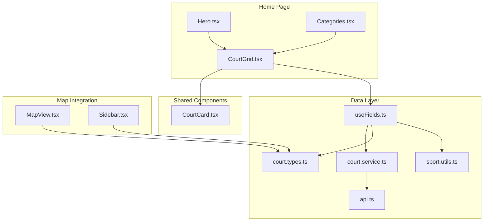
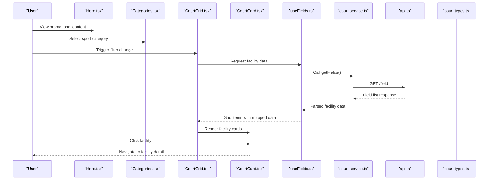
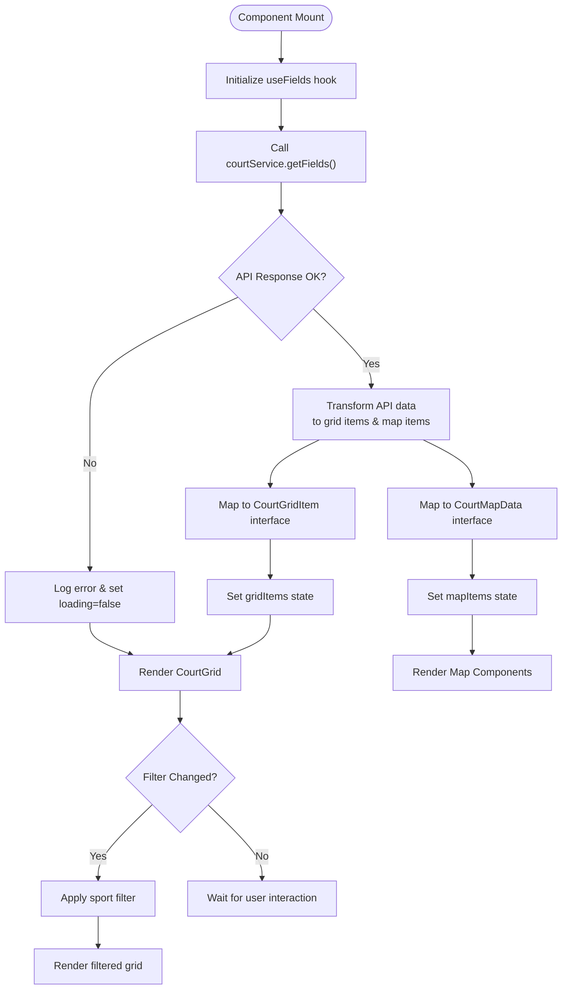
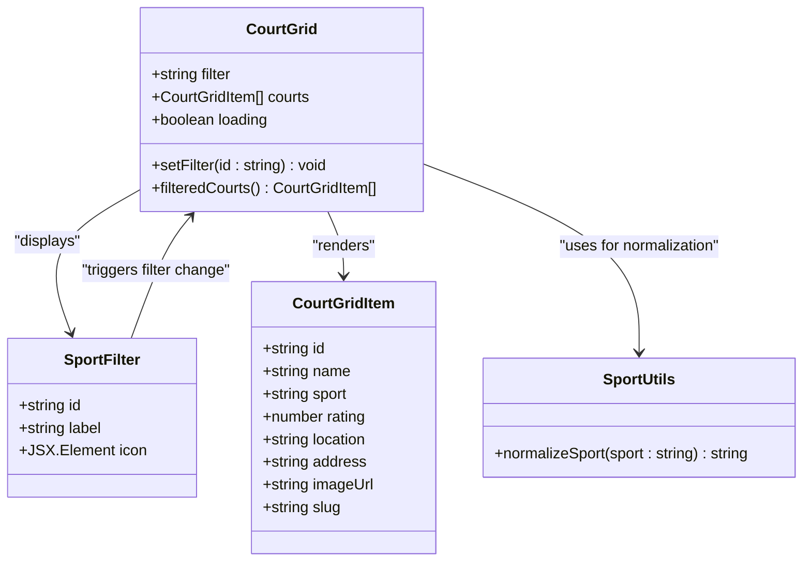
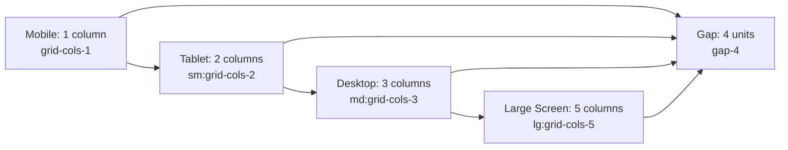
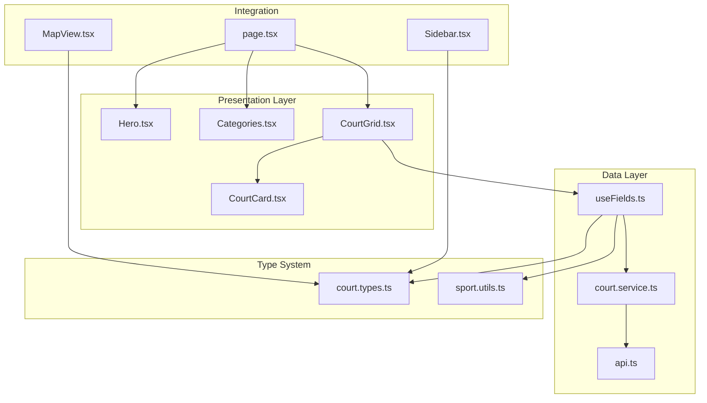
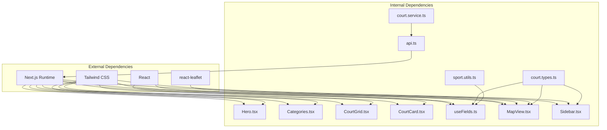

# Facility Management UI

<cite>
**Referenced Files in This Document**
- [Categories.tsx](file://frontend/src/components/home/Categories.tsx)
- [CourtGrid.tsx](file://frontend/src/components/home/CourtGrid.tsx)
- [Hero.tsx](file://frontend/src/components/home/Hero.tsx)
- [CourtCard.tsx](file://frontend/src/components/shared/CourtCard.tsx)
- [court.types.ts](file://frontend/src/types/court.types.ts)
- [sport.utils.ts](file://frontend/src/utils/sport.utils.ts)
- [useFields.ts](file://frontend/src/hooks/useFields.ts)
- [court.service.ts](file://frontend/src/services/court.service.ts)
- [api.ts](file://frontend/src/services/api.ts)
- [page.tsx](file://frontend/src/app/(user)/page.tsx)
- [MapView.tsx](file://frontend/src/components/map/MapView.tsx)
- [Sidebar.tsx](file://frontend/src/components/map/Sidebar.tsx)
</cite>

## Table of Contents
1. [Introduction](#introduction)
2. [Project Structure](#project-structure)
3. [Core Components](#core-components)
4. [Architecture Overview](#architecture-overview)
5. [Detailed Component Analysis](#detailed-component-analysis)
6. [Dependency Analysis](#dependency-analysis)
7. [Performance Considerations](#performance-considerations)
8. [Troubleshooting Guide](#troubleshooting-guide)
9. [Conclusion](#conclusion)

## Introduction
This document provides comprehensive documentation for the facility listing and management user interface components focused on sport facility discovery and booking. It covers the Categories component for sport type filtering, the CourtGrid for displaying facilities in a responsive grid, the Hero component for promotional content, and the CourtCard for individual facility presentation. The documentation explains responsive grid layouts, category filtering mechanisms, facility data binding, interactive elements, component composition patterns, prop interfaces, state management for search and filtering, facility display customization, sorting options, and integration with the booking system.

## Project Structure
The facility management UI is implemented in the frontend application under the Next.js app router. The key components are organized as follows:
- Home page components: Categories, CourtGrid, Hero
- Shared components: CourtCard
- Types and utilities: court.types.ts, sport.utils.ts
- Data fetching: useFields hook
- Services: court.service.ts, api.ts
- Integration pages: user home page, facility detail page
- Map integration: MapView and Sidebar for map-based browsing

**Diagram sources**
- [page.tsx](file://frontend/src/app/(user)/page.tsx#L11-L21)
- [CourtGrid.tsx:17-79](file://frontend/src/components/home/CourtGrid.tsx#L17-L79)
- [CourtCard.tsx:16-73](file://frontend/src/components/shared/CourtCard.tsx#L16-L73)
- [useFields.ts:12-78](file://frontend/src/hooks/useFields.ts#L12-L78)
- [court.service.ts:4-25](file://frontend/src/services/court.service.ts#L4-L25)
- [api.ts:1-78](file://frontend/src/services/api.ts#L1-L78)
- [court.types.ts:1-82](file://frontend/src/types/court.types.ts#L1-L82)
- [sport.utils.ts:5-14](file://frontend/src/utils/sport.utils.ts#L5-L14)
- [MapView.tsx:25-62](file://frontend/src/components/map/MapView.tsx#L25-L62)
- [Sidebar.tsx:14-60](file://frontend/src/components/map/Sidebar.tsx#L14-L60)

**Section sources**
- [page.tsx](file://frontend/src/app/(user)/page.tsx#L1-L22)

## Core Components
This section documents the primary UI components that form the facility listing and management interface.

### Categories Component
The Categories component provides a horizontal scrolling category bar for sport type selection. It displays sport icons and names with hover effects and maintains a clean, accessible interface.

Key characteristics:
- Horizontal scrollable layout with fixed width container
- Responsive design with minimum width constraint
- Hover animations with color transitions
- Dark mode support with appropriate color schemes
- Material Symbols integration for sport icons

**Section sources**
- [Categories.tsx:11-33](file://frontend/src/components/home/Categories.tsx#L11-L33)

### CourtGrid Component
The CourtGrid component serves as the main facility listing interface. It combines filtering controls with a responsive grid layout for displaying facilities.

Core functionality:
- State management for sport filters with local state
- Integration with useFields hook for data fetching
- Responsive grid layout (1 column on mobile to 5 columns on large screens)
- Loading state handling during data fetch
- Empty state messaging when no facilities match filters
- Dynamic filtering based on sport type

Responsive grid behavior:
- Mobile: 1 column
- Tablet: 2 columns
- Desktop: 3 columns
- Large desktop: 5 columns

**Section sources**
- [CourtGrid.tsx:17-79](file://frontend/src/components/home/CourtGrid.tsx#L17-L79)

### Hero Component
The Hero component provides prominent promotional content at the top of the home page. It features an optimized background image with overlay text and animated entrance effects.

Key features:
- Full-width responsive hero section
- Optimized Next.js Image component with fill property
- Gradient overlay for text readability
- Animated entrance effects
- Priority loading for improved performance

**Section sources**
- [Hero.tsx:4-29](file://frontend/src/components/home/Hero.tsx#L4-L29)

### CourtCard Component
The CourtCard component presents individual facility information in a standardized card layout. It includes image display, rating information, location details, and booking actions.

Design elements:
- Aspect-ratio maintained for consistent grid appearance
- Rating badge with star icon and dynamic value display
- Hover effects with scale transformations
- Location information with clipped address display
- Booking action button with hover states
- Responsive typography and spacing

**Section sources**
- [CourtCard.tsx:16-73](file://frontend/src/components/shared/CourtCard.tsx#L16-L73)

## Architecture Overview
The facility management UI follows a unidirectional data flow pattern with clear separation of concerns between presentation, data fetching, and service layers.

**Diagram sources**
- [CourtGrid.tsx:17-79](file://frontend/src/components/home/CourtGrid.tsx#L17-L79)
- [useFields.ts:12-78](file://frontend/src/hooks/useFields.ts#L12-L78)
- [court.service.ts:4-25](file://frontend/src/services/court.service.ts#L4-L25)
- [api.ts:19-27](file://frontend/src/services/api.ts#L19-L27)
- [CourtCard.tsx:16-73](file://frontend/src/components/shared/CourtCard.tsx#L16-L73)

The architecture demonstrates:
- Component composition with clear parent-child relationships
- Centralized data fetching through custom hooks
- Type-safe data transformation between layers
- Responsive design patterns integrated throughout
- Interactive elements with proper state management

## Detailed Component Analysis

### Data Flow and State Management
The data flow in the facility management system follows a predictable pattern from API consumption to UI rendering.

**Diagram sources**
- [useFields.ts:17-78](file://frontend/src/hooks/useFields.ts#L17-L78)
- [court.service.ts:5-7](file://frontend/src/services/court.service.ts#L5-L7)
- [api.ts:19-27](file://frontend/src/services/api.ts#L19-L27)

### Filtering Mechanism
The filtering mechanism operates at the component level with the following characteristics:

**Diagram sources**
- [CourtGrid.tsx:17-79](file://frontend/src/components/home/CourtGrid.tsx#L17-L79)
- [sport.utils.ts:5-14](file://frontend/src/utils/sport.utils.ts#L5-L14)
- [court.types.ts:27-36](file://frontend/src/types/court.types.ts#L27-L36)

Filtering behavior:
- Local state management within CourtGrid component
- Real-time filtering without API calls
- Support for "all" filter to show all facilities
- Sport name normalization for consistent matching
- Visual feedback through active filter highlighting

### Responsive Grid Layout Implementation
The responsive grid layout adapts to different screen sizes using Tailwind CSS grid utilities:

**Diagram sources**
- [CourtGrid.tsx:66-74](file://frontend/src/components/home/CourtGrid.tsx#L66-L74)

### Component Composition Patterns
The components follow established React composition patterns with clear separation of concerns:

**Diagram sources**
- [page.tsx](file://frontend/src/app/(user)/page.tsx#L11-L21)
- [CourtGrid.tsx:17-79](file://frontend/src/components/home/CourtGrid.tsx#L17-L79)
- [CourtCard.tsx:16-73](file://frontend/src/components/shared/CourtCard.tsx#L16-L73)
- [useFields.ts:12-78](file://frontend/src/hooks/useFields.ts#L12-L78)
- [court.service.ts:4-25](file://frontend/src/services/court.service.ts#L4-L25)
- [api.ts:1-78](file://frontend/src/services/api.ts#L1-L78)
- [court.types.ts:1-82](file://frontend/src/types/court.types.ts#L1-L82)
- [sport.utils.ts:5-14](file://frontend/src/utils/sport.utils.ts#L5-L14)
- [MapView.tsx:25-62](file://frontend/src/components/map/MapView.tsx#L25-L62)
- [Sidebar.tsx:14-60](file://frontend/src/components/map/Sidebar.tsx#L14-L60)

## Dependency Analysis
The component dependencies demonstrate a well-structured architecture with clear boundaries between layers.

**Diagram sources**
- [Hero.tsx:1-29](file://frontend/src/components/home/Hero.tsx#L1-L29)
- [Categories.tsx:1-33](file://frontend/src/components/home/Categories.tsx#L1-L33)
- [CourtGrid.tsx:1-79](file://frontend/src/components/home/CourtGrid.tsx#L1-L79)
- [CourtCard.tsx:1-73](file://frontend/src/components/shared/CourtCard.tsx#L1-L73)
- [useFields.ts:1-78](file://frontend/src/hooks/useFields.ts#L1-L78)
- [court.service.ts:1-26](file://frontend/src/services/court.service.ts#L1-L26)
- [api.ts:1-78](file://frontend/src/services/api.ts#L1-L78)
- [court.types.ts:1-82](file://frontend/src/types/court.types.ts#L1-L82)
- [sport.utils.ts:1-15](file://frontend/src/utils/sport.utils.ts#L1-L15)
- [MapView.tsx:1-62](file://frontend/src/components/map/MapView.tsx#L1-L62)
- [Sidebar.tsx:1-60](file://frontend/src/components/map/Sidebar.tsx#L1-L60)

Key dependency observations:
- Minimal external dependencies with clear integration points
- Strong typing throughout the data pipeline
- Separation of concerns between UI and data layers
- Extensible architecture supporting additional integrations

**Section sources**
- [court.types.ts:1-82](file://frontend/src/types/court.types.ts#L1-L82)
- [sport.utils.ts:1-15](file://frontend/src/utils/sport.utils.ts#L1-L15)

## Performance Considerations
The facility management UI incorporates several performance optimization strategies:

### Data Fetching Optimization
- Single API call returning both grid and map data
- Cancelable requests to prevent state updates after component unmount
- Loading states to prevent unnecessary re-renders
- Efficient data transformation minimizing object creation

### Rendering Optimization
- Responsive grid with appropriate column counts per breakpoint
- Lazy loading for images with priority handling
- CSS transitions optimized for performance
- Minimal reflows through strategic use of transform properties

### State Management Efficiency
- Local filtering reduces API calls
- Memoized data transformations
- Efficient list rendering with proper keys
- Debounced interactions where applicable

## Troubleshooting Guide
Common issues and their solutions:

### Data Loading Issues
- **Symptom**: Empty grid or infinite loading spinner
- **Cause**: API failure or network issues
- **Solution**: Check API endpoint accessibility and network connectivity

### Filtering Not Working
- **Symptom**: Filters don't change results
- **Cause**: Sport name normalization mismatch
- **Solution**: Verify sport name mapping in normalization utility

### Image Loading Problems
- **Symptom**: Missing or broken facility images
- **Cause**: Incorrect image URLs or missing fallbacks
- **Solution**: Implement proper fallback image handling

### Responsive Layout Breaks
- **Symptom**: Grid items misaligned on certain screen sizes
- **Cause**: CSS conflicts or missing responsive utilities
- **Solution**: Verify Tailwind responsive class usage

**Section sources**
- [useFields.ts:62-66](file://frontend/src/hooks/useFields.ts#L62-L66)
- [sport.utils.ts:5-14](file://frontend/src/utils/sport.utils.ts#L5-L14)
- [CourtGrid.tsx:29-37](file://frontend/src/components/home/CourtGrid.tsx#L29-L37)

## Conclusion
The facility management UI components provide a robust, scalable foundation for sport facility discovery and booking. The architecture emphasizes clear separation of concerns, type safety, and responsive design. The modular component structure allows for easy extension and maintenance while maintaining consistent user experience across different devices and interaction patterns.

The implementation demonstrates best practices in React development including proper state management, efficient data fetching, and thoughtful user interface design. The integration points with the booking system and map services provide a foundation for future enhancements while maintaining performance and usability standards.