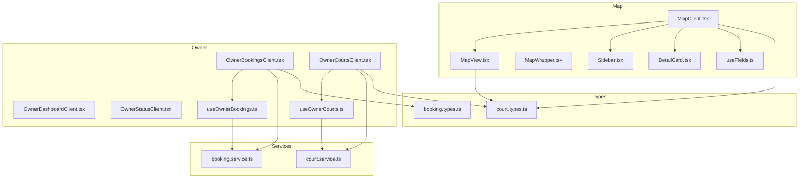
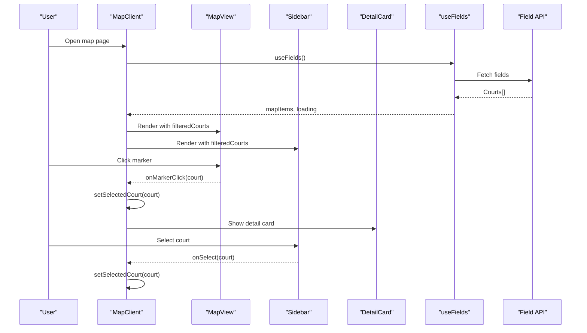
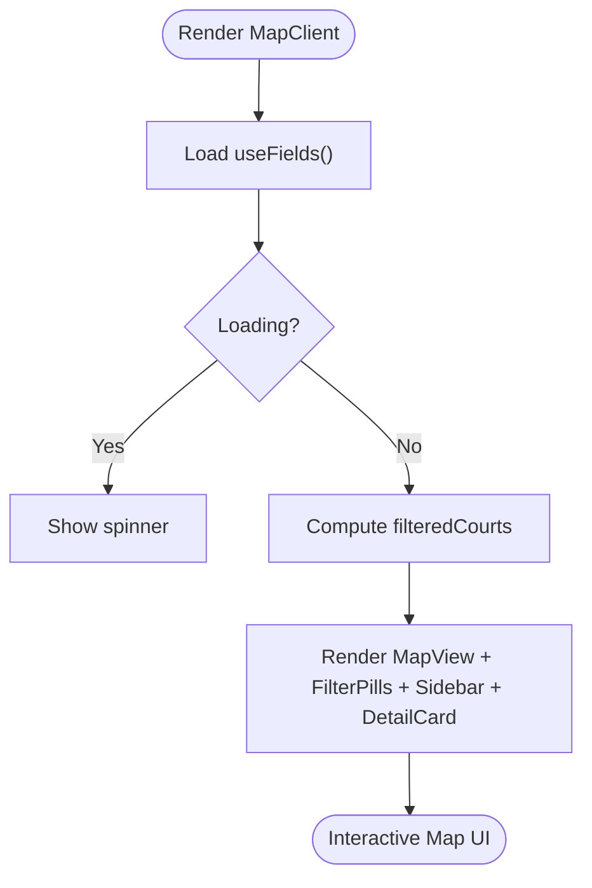
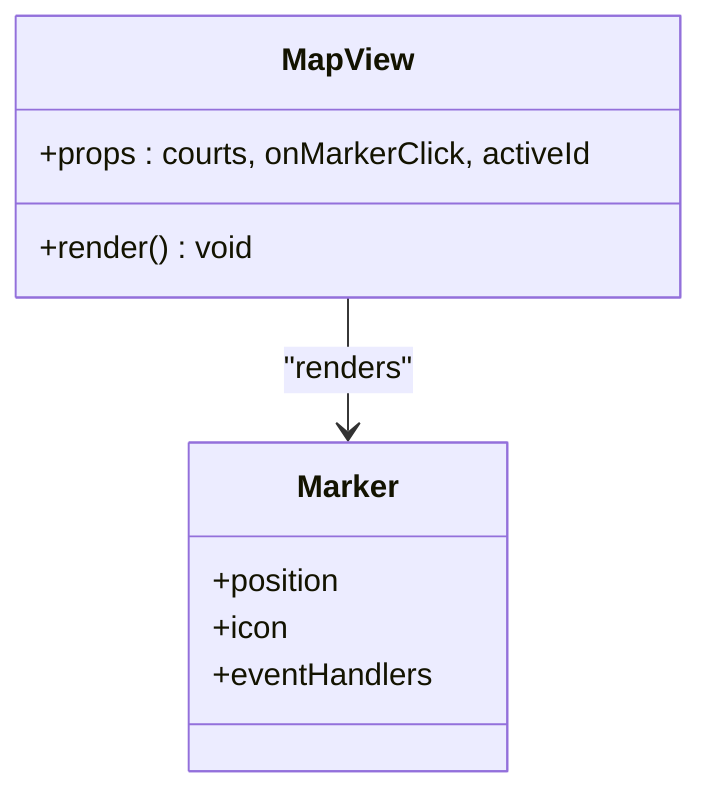
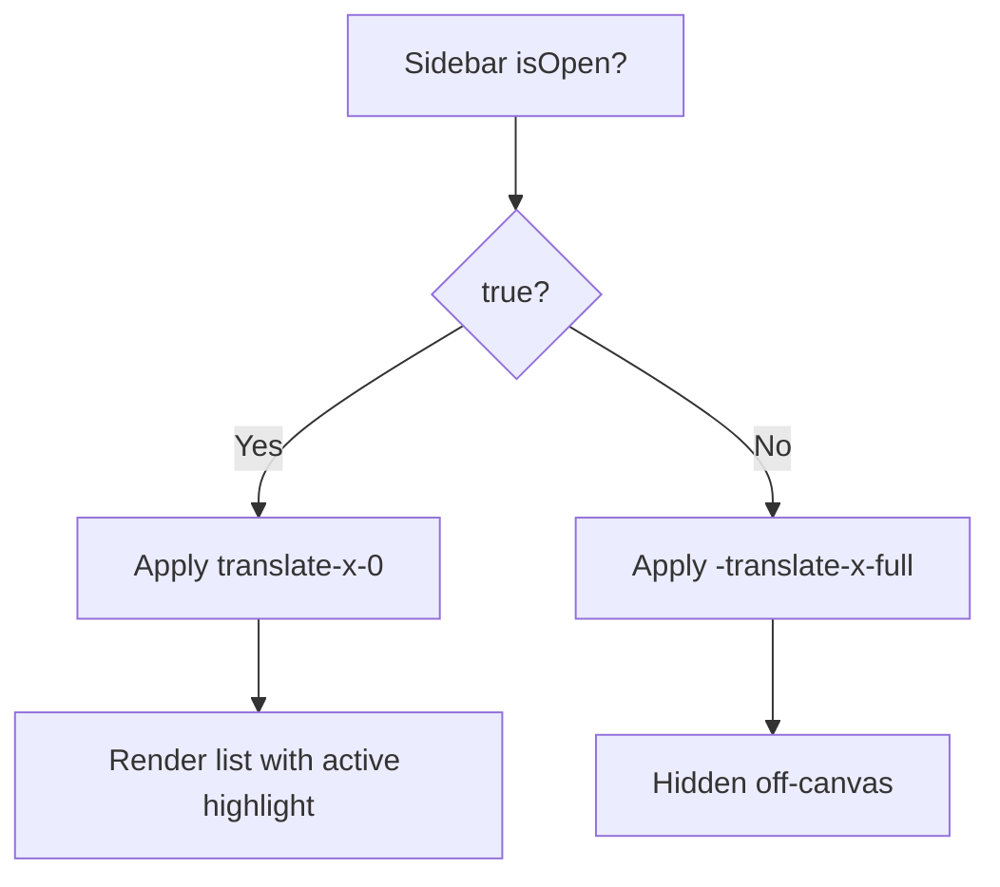
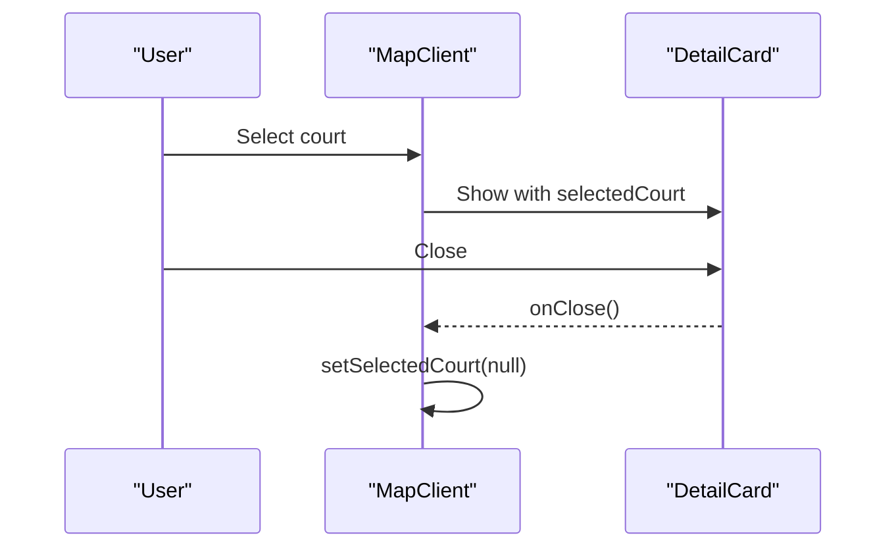
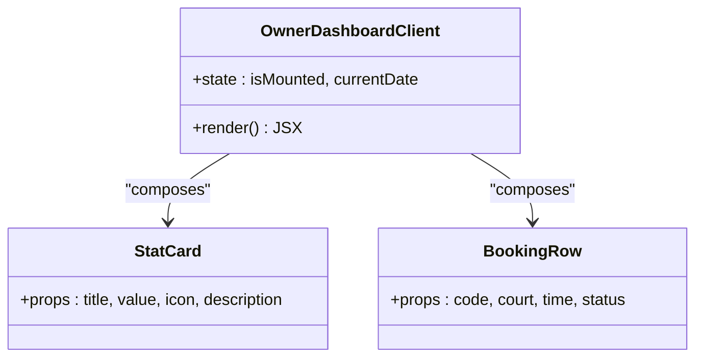
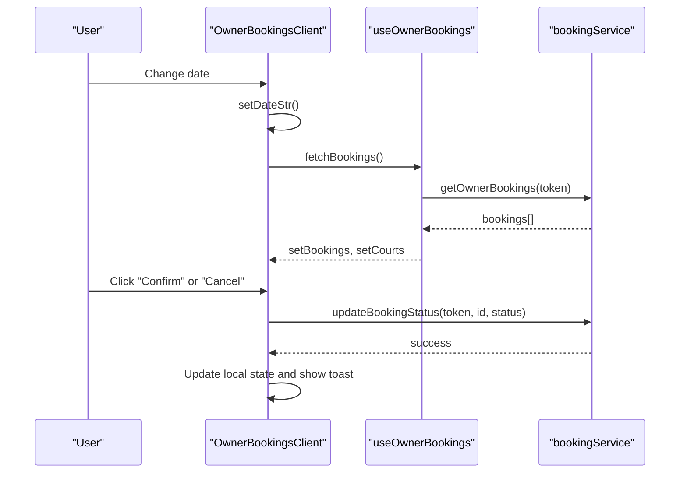
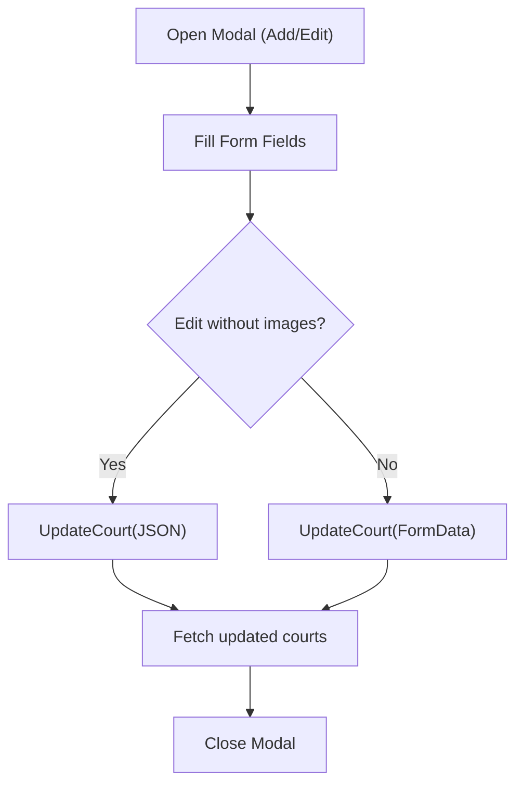
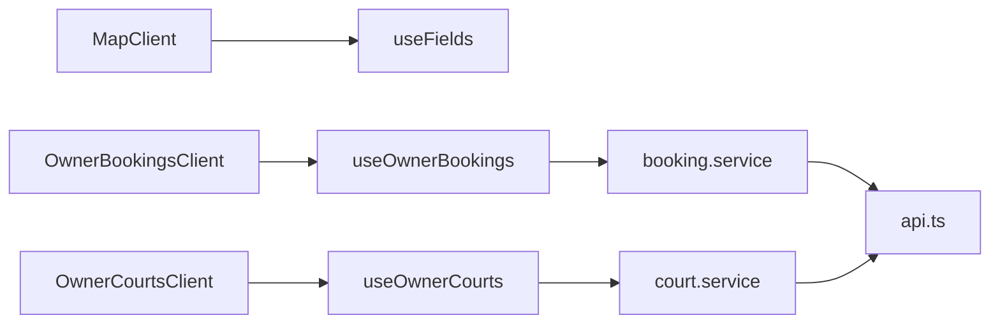

# Feature Components & UI

<cite>
**Referenced Files in This Document**
- [MapClient.tsx](file://frontend/src/components/map/MapClient.tsx)
- [MapView.tsx](file://frontend/src/components/map/MapView.tsx)
- [MapWrapper.tsx](file://frontend/src/components/map/MapWrapper.tsx)
- [Sidebar.tsx](file://frontend/src/components/map/Sidebar.tsx)
- [DetailCard.tsx](file://frontend/src/components/map/DetailCard.tsx)
- [useFields.ts](file://frontend/src/hooks/useFields.ts)
- [OwnerDashboardClient.tsx](file://frontend/src/components/owner/OwnerDashboardClient.tsx)
- [OwnerBookingsClient.tsx](file://frontend/src/components/owner/OwnerBookingsClient.tsx)
- [OwnerCourtsClient.tsx](file://frontend/src/components/owner/OwnerCourtsClient.tsx)
- [OwnerStatusClient.tsx](file://frontend/src/components/owner/OwnerStatusClient.tsx)
- [useOwnerBookings.ts](file://frontend/src/hooks/useOwnerBookings.ts)
- [useOwnerCourts.ts](file://frontend/src/hooks/useOwnerCourts.ts)
- [booking.service.ts](file://frontend/src/services/booking.service.ts)
- [court.service.ts](file://frontend/src/services/court.service.ts)
- [booking.types.ts](file://frontend/src/types/booking.types.ts)
- [court.types.ts](file://frontend/src/types/court.types.ts)
</cite>

## Table of Contents
1. [Introduction](#introduction)
2. [Project Structure](#project-structure)
3. [Core Components](#core-components)
4. [Architecture Overview](#architecture-overview)
5. [Detailed Component Analysis](#detailed-component-analysis)
6. [Dependency Analysis](#dependency-analysis)
7. [Performance Considerations](#performance-considerations)
8. [Accessibility and Responsive Design](#accessibility-and-responsive-design)
9. [Troubleshooting Guide](#troubleshooting-guide)
10. [Conclusion](#conclusion)
11. [Appendices](#appendices)

## Introduction
This document explains the platform’s feature-rich user interface components with a focus on:
- Interactive map integration using Leaflet and react-leaflet
- Facility listing and search experiences
- Booking system components for owners
- Owner dashboard interfaces
- Admin management tools

It covers component composition patterns, prop interfaces, event handling, state management, responsive design, accessibility, cross-browser compatibility, usage examples, customization options, and integration guidelines for extending the UI.

## Project Structure
The UI is organized by feature domains:
- Map module: MapClient, MapView, MapWrapper, Sidebar, DetailCard
- Owner module: OwnerDashboardClient, OwnerBookingsClient, OwnerCourtsClient, OwnerStatusClient
- Hooks: useFields, useOwnerBookings, useOwnerCourts
- Services: booking.service, court.service
- Types: booking.types, court.types

**Diagram sources**
- [MapClient.tsx:11-61](file://frontend/src/components/map/MapClient.tsx#L11-L61)
- [MapView.tsx:25-61](file://frontend/src/components/map/MapView.tsx#L25-L61)
- [MapWrapper.tsx:5-8](file://frontend/src/components/map/MapWrapper.tsx#L5-L8)
- [Sidebar.tsx:14-59](file://frontend/src/components/map/Sidebar.tsx#L14-L59)
- [DetailCard.tsx:12-60](file://frontend/src/components/map/DetailCard.tsx#L12-L60)
- [useFields.ts](file://frontend/src/hooks/useFields.ts)
- [OwnerDashboardClient.tsx:30-139](file://frontend/src/components/owner/OwnerDashboardClient.tsx#L30-L139)
- [OwnerBookingsClient.tsx:15-322](file://frontend/src/components/owner/OwnerBookingsClient.tsx#L15-L322)
- [OwnerCourtsClient.tsx:18-464](file://frontend/src/components/owner/OwnerCourtsClient.tsx#L18-L464)
- [OwnerStatusClient.tsx:12-84](file://frontend/src/components/owner/OwnerStatusClient.tsx#L12-L84)
- [useOwnerBookings.ts:8-66](file://frontend/src/hooks/useOwnerBookings.ts#L8-L66)
- [useOwnerCourts.ts:8-94](file://frontend/src/hooks/useOwnerCourts.ts#L8-L94)
- [booking.service.ts:4-12](file://frontend/src/services/booking.service.ts#L4-L12)
- [court.service.ts:4-25](file://frontend/src/services/court.service.ts#L4-L25)
- [booking.types.ts:1-37](file://frontend/src/types/booking.types.ts#L1-L37)
- [court.types.ts:1-82](file://frontend/src/types/court.types.ts#L1-L82)

**Section sources**
- [MapClient.tsx:11-61](file://frontend/src/components/map/MapClient.tsx#L11-L61)
- [OwnerBookingsClient.tsx:15-322](file://frontend/src/components/owner/OwnerBookingsClient.tsx#L15-L322)
- [OwnerCourtsClient.tsx:18-464](file://frontend/src/components/owner/OwnerCourtsClient.tsx#L18-L464)

## Core Components
- MapClient orchestrates map, filters, sidebar, and detail card. It manages filter state, selection state, and sidebar visibility, and delegates data fetching to useFields.
- MapView renders the Leaflet map, markers with custom icons, and auto-centers on selection.
- Sidebar lists filtered courts with selection and active highlighting.
- DetailCard displays selected court details and a “Book Now” action.
- OwnerDashboardClient presents stats, recent bookings, and performance metrics.
- OwnerBookingsClient renders a real-time timeline and a list of bookings with status controls and a check-in modal.
- OwnerCourtsClient manages listing, filtering, search, CRUD modals, and status toggles.
- OwnerStatusClient provides a compact status list with toggle actions and badges.

**Section sources**
- [MapClient.tsx:11-61](file://frontend/src/components/map/MapClient.tsx#L11-L61)
- [MapView.tsx:25-61](file://frontend/src/components/map/MapView.tsx#L25-L61)
- [Sidebar.tsx:14-59](file://frontend/src/components/map/Sidebar.tsx#L14-L59)
- [DetailCard.tsx:12-60](file://frontend/src/components/map/DetailCard.tsx#L12-L60)
- [OwnerDashboardClient.tsx:30-139](file://frontend/src/components/owner/OwnerDashboardClient.tsx#L30-L139)
- [OwnerBookingsClient.tsx:15-322](file://frontend/src/components/owner/OwnerBookingsClient.tsx#L15-L322)
- [OwnerCourtsClient.tsx:18-464](file://frontend/src/components/owner/OwnerCourtsClient.tsx#L18-L464)
- [OwnerStatusClient.tsx:12-84](file://frontend/src/components/owner/OwnerStatusClient.tsx#L12-L84)

## Architecture Overview
The UI follows a layered pattern:
- Components: Presentational and composite UI elements
- Hooks: Encapsulate data fetching and state logic
- Services: Abstract API calls
- Types: Define shapes for props and responses

**Diagram sources**
- [MapClient.tsx:11-61](file://frontend/src/components/map/MapClient.tsx#L11-L61)
- [MapView.tsx:25-61](file://frontend/src/components/map/MapView.tsx#L25-L61)
- [Sidebar.tsx:14-59](file://frontend/src/components/map/Sidebar.tsx#L14-L59)
- [DetailCard.tsx:12-60](file://frontend/src/components/map/DetailCard.tsx#L12-L60)
- [useFields.ts](file://frontend/src/hooks/useFields.ts)

**Section sources**
- [MapClient.tsx:11-61](file://frontend/src/components/map/MapClient.tsx#L11-L61)
- [MapView.tsx:25-61](file://frontend/src/components/map/MapView.tsx#L25-L61)
- [Sidebar.tsx:14-59](file://frontend/src/components/map/Sidebar.tsx#L14-L59)
- [DetailCard.tsx:12-60](file://frontend/src/components/map/DetailCard.tsx#L12-L60)

## Detailed Component Analysis

### Map Module

#### MapClient
- Responsibilities: Manage filter, selection, sidebar visibility, and pass props to child components.
- Props: None (owns state)
- Events: onMarkerClick, onFilterChange, onSelect, onClose
- State: filter, selectedCourt, isSidebarOpen
- Data: filteredCourts computed from useFields()

**Diagram sources**
- [MapClient.tsx:11-61](file://frontend/src/components/map/MapClient.tsx#L11-L61)

**Section sources**
- [MapClient.tsx:11-61](file://frontend/src/components/map/MapClient.tsx#L11-L61)

#### MapView
- Responsibilities: Render Leaflet map, tiles, markers, and re-center on selection.
- Props: courts[], onMarkerClick(), activeId?
- Event handling: Marker click triggers parent callback
- Customization: Custom marker icon with active state

**Diagram sources**
- [MapView.tsx:19-23](file://frontend/src/components/map/MapView.tsx#L19-L23)
- [MapView.tsx:45-52](file://frontend/src/components/map/MapView.tsx#L45-L52)

**Section sources**
- [MapView.tsx:19-23](file://frontend/src/components/map/MapView.tsx#L19-L23)
- [MapView.tsx:25-61](file://frontend/src/components/map/MapView.tsx#L25-L61)

#### Sidebar
- Responsibilities: List filtered courts, highlight active, handle selection and close.
- Props: isOpen, courts, onClose, onSelect, activeId?

**Diagram sources**
- [Sidebar.tsx:14-59](file://frontend/src/components/map/Sidebar.tsx#L14-L59)

**Section sources**
- [Sidebar.tsx:14-59](file://frontend/src/components/map/Sidebar.tsx#L14-L59)

#### DetailCard
- Responsibilities: Show selected court banner, rating, address, and “Book Now” link.
- Props: court, onClose

**Diagram sources**
- [DetailCard.tsx:12-60](file://frontend/src/components/map/DetailCard.tsx#L12-L60)
- [MapClient.tsx:53-58](file://frontend/src/components/map/MapClient.tsx#L53-L58)

**Section sources**
- [DetailCard.tsx:12-60](file://frontend/src/components/map/DetailCard.tsx#L12-L60)
- [MapClient.tsx:53-58](file://frontend/src/components/map/MapClient.tsx#L53-L58)

#### MapWrapper
- Responsibilities: Dynamically import MapClient to avoid SSR issues.

**Section sources**
- [MapWrapper.tsx:5-8](file://frontend/src/components/map/MapWrapper.tsx#L5-L8)

### Owner Dashboard and Booking System

#### OwnerDashboardClient
- Responsibilities: Render stats cards, recent bookings table, and performance bar.
- Props: None (own state)
- State: currentDate, isMounted (hydration guard)
- Composition: Uses shared ui/card and ui/button

**Diagram sources**
- [OwnerDashboardClient.tsx:30-139](file://frontend/src/components/owner/OwnerDashboardClient.tsx#L30-L139)
- [OwnerDashboardClient.tsx:142-155](file://frontend/src/components/owner/OwnerDashboardClient.tsx#L142-L155)
- [OwnerDashboardClient.tsx:157-176](file://frontend/src/components/owner/OwnerDashboardClient.tsx#L157-L176)

**Section sources**
- [OwnerDashboardClient.tsx:30-139](file://frontend/src/components/owner/OwnerDashboardClient.tsx#L30-L139)

#### OwnerBookingsClient
- Responsibilities: Timeline view and recent bookings list with status updates and check-in modal.
- Props: None (own state)
- State: dateStr, checkinData, showToast
- Computed: filteredBookings by selected date, counts per status
- Events: prev/next day, open/close check-in, confirm status
- Timeline: grid layout with time slots mapped from start/end times

**Diagram sources**
- [OwnerBookingsClient.tsx:15-322](file://frontend/src/components/owner/OwnerBookingsClient.tsx#L15-L322)
- [useOwnerBookings.ts:8-66](file://frontend/src/hooks/useOwnerBookings.ts#L8-L66)
- [booking.service.ts:4-12](file://frontend/src/services/booking.service.ts#L4-L12)

**Section sources**
- [OwnerBookingsClient.tsx:15-322](file://frontend/src/components/owner/OwnerBookingsClient.tsx#L15-L322)
- [useOwnerBookings.ts:8-66](file://frontend/src/hooks/useOwnerBookings.ts#L8-L66)
- [booking.service.ts:4-12](file://frontend/src/services/booking.service.ts#L4-L12)

#### OwnerCourtsClient
- Responsibilities: Search, filter, CRUD modals, status toggles, and image uploads.
- Props: None (own state)
- State: search, filterType, modals, form fields
- Events: open modal (add/edit), submit form, toggle status, delete confirm
- Service integration: add/update via FormData or JSON depending on edits

**Diagram sources**
- [OwnerCourtsClient.tsx:93-149](file://frontend/src/components/owner/OwnerCourtsClient.tsx#L93-L149)
- [court.service.ts:17-20](file://frontend/src/services/court.service.ts#L17-L20)

**Section sources**
- [OwnerCourtsClient.tsx:18-464](file://frontend/src/components/owner/OwnerCourtsClient.tsx#L18-L464)
- [court.service.ts:13-25](file://frontend/src/services/court.service.ts#L13-L25)

#### OwnerStatusClient
- Responsibilities: Compact list of courts with status toggle and badges.
- Props: None (own state)
- State: updatingId (prevent concurrent updates)
- Events: toggle status, toast feedback

**Section sources**
- [OwnerStatusClient.tsx:12-84](file://frontend/src/components/owner/OwnerStatusClient.tsx#L12-L84)

### Hooks and Services

#### useOwnerBookings
- Responsibilities: Fetch owner bookings, extract unique courts for timeline, update booking status.
- Returns: bookings[], courts[], loading, fetchBookings(), updateBookingStatus()

**Section sources**
- [useOwnerBookings.ts:8-66](file://frontend/src/hooks/useOwnerBookings.ts#L8-L66)

#### useOwnerCourts
- Responsibilities: Fetch owner courts, toggle status, add/update court.
- Returns: courts[], loading, fetchCourts(), toggleCourtStatus(), addCourt(), updateCourt()

**Section sources**
- [useOwnerCourts.ts:8-94](file://frontend/src/hooks/useOwnerCourts.ts#L8-L94)

#### booking.service
- Methods: getOwnerBookings(token), updateBookingStatus(token, id, status)

**Section sources**
- [booking.service.ts:4-12](file://frontend/src/services/booking.service.ts#L4-L12)

#### court.service
- Methods: getFields(), getOwnerCourts(token), addCourt(token, FormData), updateCourt(token, ma_san, data, isJSON), updateCourtStatus(token, ma_san, trang_thai_san)

**Section sources**
- [court.service.ts:4-25](file://frontend/src/services/court.service.ts#L4-L25)

### Type Definitions
- Booking types: BookingDetail, OwnerBookingsResponse, UpdateBookingStatusResponse
- Court types: Court, CourtApiItem, CourtGridItem, CourtMapData, OwnerCourt, FieldListResponse, OwnerCourtsResponse, AddCourtResponse, UpdateCourtResponse

**Section sources**
- [booking.types.ts:1-37](file://frontend/src/types/booking.types.ts#L1-L37)
- [court.types.ts:1-82](file://frontend/src/types/court.types.ts#L1-L82)

## Dependency Analysis
- MapClient depends on useFields for data and passes callbacks to child components.
- OwnerBookingsClient depends on useOwnerBookings and booking.service.
- OwnerCourtsClient depends on useOwnerCourts and court.service.
- All services depend on a shared api abstraction (apiGet, apiPost, apiPut, apiPatch).

**Diagram sources**
- [MapClient.tsx:8](file://frontend/src/components/map/MapClient.tsx#L8)
- [useOwnerBookings.ts:4-5](file://frontend/src/hooks/useOwnerBookings.ts#L4-L5)
- [useOwnerCourts.ts:4-5](file://frontend/src/hooks/useOwnerCourts.ts#L4-L5)
- [booking.service.ts:1](file://frontend/src/services/booking.service.ts#L1)
- [court.service.ts:1](file://frontend/src/services/court.service.ts#L1)

**Section sources**
- [MapClient.tsx:8](file://frontend/src/components/map/MapClient.tsx#L8)
- [useOwnerBookings.ts:4-5](file://frontend/src/hooks/useOwnerBookings.ts#L4-L5)
- [useOwnerCourts.ts:4-5](file://frontend/src/hooks/useOwnerCourts.ts#L4-L5)
- [booking.service.ts:1](file://frontend/src/services/booking.service.ts#L1)
- [court.service.ts:1](file://frontend/src/services/court.service.ts#L1)

## Performance Considerations
- Map rendering: Use filtered data and memoized computations to minimize re-renders. Consider virtualizing long lists in the sidebar if data grows large.
- Timeline rendering: Precompute grid columns and spans; avoid unnecessary DOM updates by relying on CSS transforms and minimal state changes.
- Image handling: Lazy load images in cards and modals; limit image sizes and formats to optimize bandwidth.
- API calls: Debounce search/filter inputs; cache results where appropriate; batch updates for status toggles.
- Animations: Keep transitions lightweight; disable animations during heavy operations.

## Accessibility and Responsive Design
- Accessibility
  - Use semantic HTML and ARIA roles where custom containers replace native elements (e.g., custom sliders, buttons).
  - Ensure sufficient color contrast for status badges and interactive elements.
  - Provide keyboard navigation support for modals and timelines.
  - Screen reader-friendly labels for icons and buttons.
- Responsive Design
  - Mobile-first layout with breakpoint-based grid adjustments (e.g., grid-cols-1 sm:grid-cols-2 lg:grid-cols-3 xl:grid-cols-4).
  - Flexible sidebar with off-canvas behavior and overlay dismissal.
  - Adaptive typography and spacing for small screens.
  - Touch-friendly targets for buttons and controls.

## Troubleshooting Guide
- Map does not render on SSR
  - Ensure MapClient is dynamically imported and rendered only on the client.
  - Verify tile provider URL and network access.
- Markers not clickable
  - Confirm event handlers are attached and activeId is correctly passed.
- Sidebar not opening
  - Check isOpen prop and transform classes; ensure z-index stacking is correct.
- Booking status updates fail
  - Verify token availability and service method signatures.
  - Inspect toast/error messages for failure reasons.
- Court status toggle stuck
  - Check updatingId guard to prevent concurrent updates.
- Timeline misalignment
  - Validate time calculations for grid-column and span; ensure consistent time parsing.

**Section sources**
- [MapWrapper.tsx:5-8](file://frontend/src/components/map/MapWrapper.tsx#L5-L8)
- [OwnerBookingsClient.tsx:44-51](file://frontend/src/components/owner/OwnerBookingsClient.tsx#L44-L51)
- [OwnerStatusClient.tsx:17-40](file://frontend/src/components/owner/OwnerStatusClient.tsx#L17-L40)

## Conclusion
The platform’s UI combines a powerful map experience with robust owner tools. Components are modular, state is centralized via hooks, and services encapsulate API concerns. Following the patterns and guidelines here enables consistent extension and maintenance across features.

## Appendices

### Component Usage Examples
- Map integration
  - Wrap MapClient with MapWrapper to avoid SSR issues.
  - Provide a filter pill component to control sport filters and toggle sidebar visibility.
- Owner dashboard
  - Use OwnerDashboardClient for KPIs and recent activity summaries.
- Booking management
  - Use OwnerBookingsClient for timeline and recent bookings; integrate with useOwnerBookings for live updates.
- Court management
  - Use OwnerCourtsClient for listing, filtering, and modals; integrate with useOwnerCourts for CRUD operations.

### Customization Options
- Theming: Adjust Tailwind classes for colors, shadows, and spacing.
- Icons: Replace material-symbols or lucide-react icons with preferred sets.
- Map tiles: Switch tile providers or add overlays.
- Status badges: Extend status mapping and styling in OwnerStatusClient and OwnerBookingsClient.

### Integration Guidelines
- Prop interfaces: Always define explicit props for child components to improve readability and type safety.
- Event callbacks: Pass callbacks from parent to children to maintain unidirectional data flow.
- State management: Prefer React state for UI state; use hooks for data/state logic.
- Services: Keep service methods focused and return typed responses for easier consumption.
- Accessibility: Add aria-* attributes and keyboard handlers for custom controls.