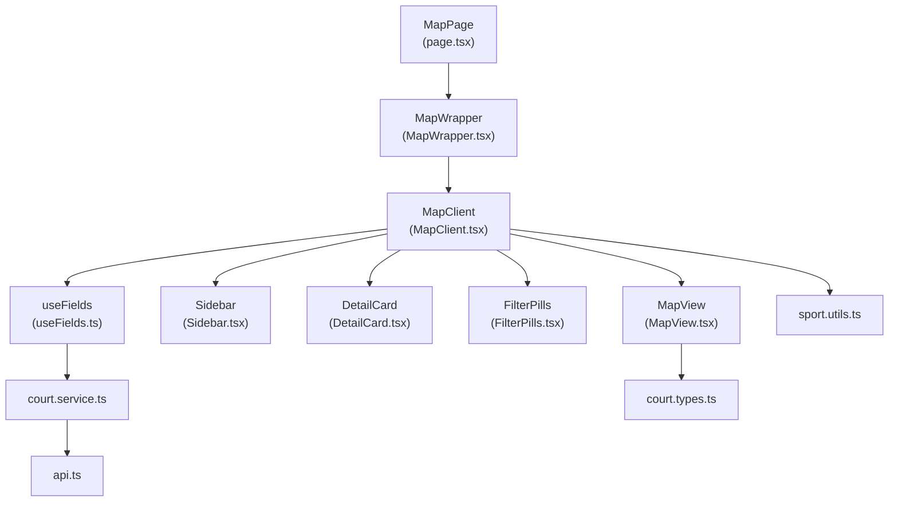
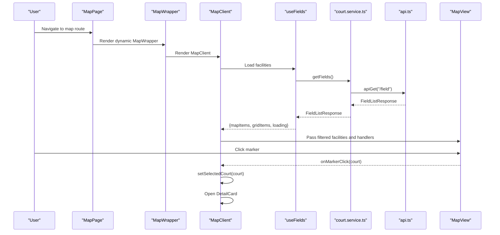
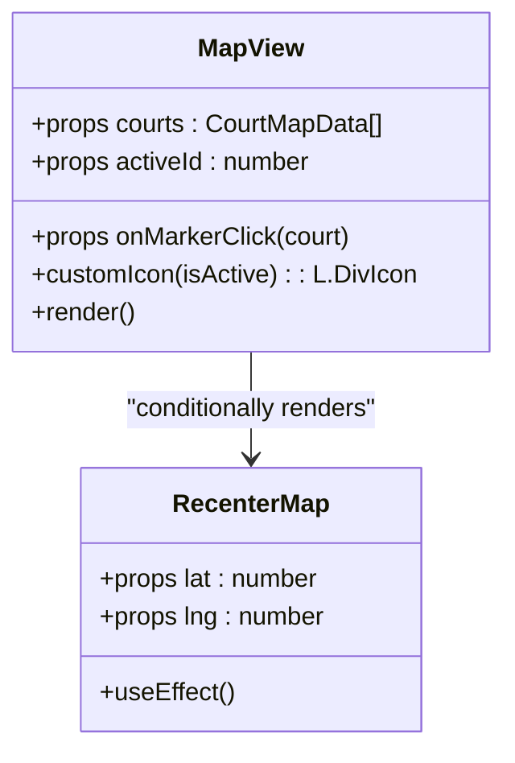
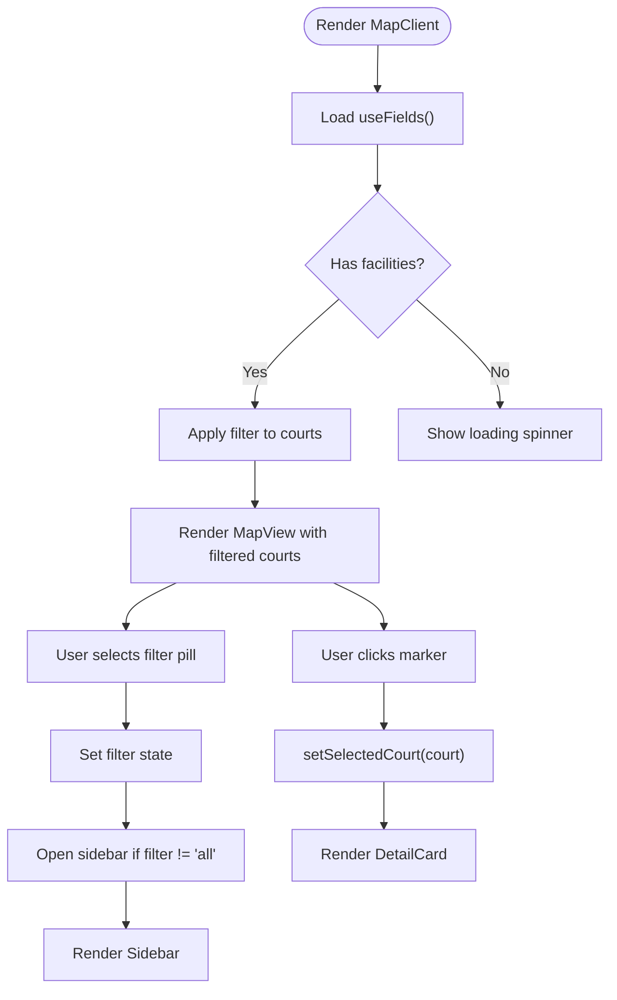
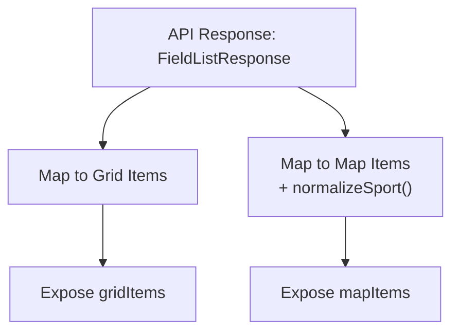
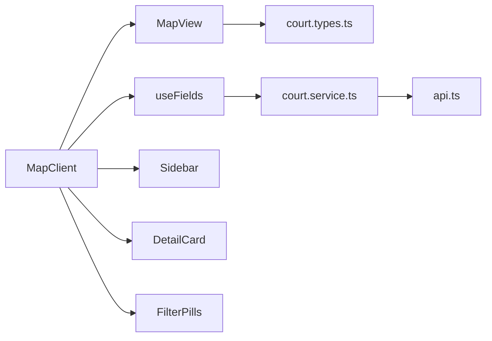

# Interactive Map Integration

<cite>
**Referenced Files in This Document**
- [page.tsx](file://frontend/src/app/(user)/map/page.tsx)
- [MapWrapper.tsx](file://frontend/src/components/map/MapWrapper.tsx)
- [MapClient.tsx](file://frontend/src/components/map/MapClient.tsx)
- [MapView.tsx](file://frontend/src/components/map/MapView.tsx)
- [Sidebar.tsx](file://frontend/src/components/map/Sidebar.tsx)
- [DetailCard.tsx](file://frontend/src/components/map/DetailCard.tsx)
- [FilterPills.tsx](file://frontend/src/components/map/FilterPills.tsx)
- [useFields.ts](file://frontend/src/hooks/useFields.ts)
- [court.types.ts](file://frontend/src/types/court.types.ts)
- [sport.utils.ts](file://frontend/src/utils/sport.utils.ts)
- [api.ts](file://frontend/src/services/api.ts)
- [court.service.ts](file://frontend/src/services/court.service.ts)
</cite>

## Table of Contents
1. [Introduction](#introduction)
2. [Project Structure](#project-structure)
3. [Core Components](#core-components)
4. [Architecture Overview](#architecture-overview)
5. [Detailed Component Analysis](#detailed-component-analysis)
6. [Dependency Analysis](#dependency-analysis)
7. [Performance Considerations](#performance-considerations)
8. [Troubleshooting Guide](#troubleshooting-guide)
9. [Conclusion](#conclusion)

## Introduction
This document explains the interactive map integration system used to discover sports facilities on an interactive map. It covers the MapView component with custom markers, map positioning, and event handling; the MapClient wrapper for client-side rendering; DetailCard for facility information display; Sidebar for filtering controls; and FilterPills for category selection. It also documents Leaflet integration, Google Maps tile layers, custom marker styling with active state indicators, responsive behavior, coordinate handling, zoom controls, and user interaction patterns. Examples of map initialization, marker clustering, and facility selection workflows are included.

## Project Structure
The map feature is implemented under the frontend/src/components/map directory and orchestrated by a Next.js page. The runtime is client-side only, with dynamic imports to avoid server-side rendering of map libraries.

**Diagram sources**
- [page.tsx:1-15](file://frontend/src/app/(user)/map/page.tsx#L1-L15)
- [MapWrapper.tsx:1-9](file://frontend/src/components/map/MapWrapper.tsx#L1-L9)
- [MapClient.tsx:1-62](file://frontend/src/components/map/MapClient.tsx#L1-L62)
- [MapView.tsx:1-62](file://frontend/src/components/map/MapView.tsx#L1-L62)
- [Sidebar.tsx:1-60](file://frontend/src/components/map/Sidebar.tsx#L1-L60)
- [DetailCard.tsx:1-61](file://frontend/src/components/map/DetailCard.tsx#L1-L61)
- [FilterPills.tsx:1-40](file://frontend/src/components/map/FilterPills.tsx#L1-L40)
- [useFields.ts:1-78](file://frontend/src/hooks/useFields.ts#L1-L78)
- [court.service.ts:1-26](file://frontend/src/services/court.service.ts#L1-L26)
- [api.ts:1-78](file://frontend/src/services/api.ts#L1-L78)
- [court.types.ts:1-82](file://frontend/src/types/court.types.ts#L1-L82)
- [sport.utils.ts:1-15](file://frontend/src/utils/sport.utils.ts#L1-L15)

**Section sources**
- [page.tsx:1-15](file://frontend/src/app/(user)/map/page.tsx#L1-L15)
- [MapWrapper.tsx:1-9](file://frontend/src/components/map/MapWrapper.tsx#L1-L9)

## Core Components
- MapView: Renders the Leaflet map with Google Maps tiles, custom red markers, and handles marker clicks and re-centering.
- MapClient: Orchestrates filters, selection state, sidebar visibility, and renders DetailCard when a facility is selected.
- Sidebar: Displays filtered facilities as a scrollable list with active highlighting and selection callbacks.
- DetailCard: Shows facility banner, rating, address, and action buttons.
- FilterPills: Provides category pills for filtering facilities by sport type.
- useFields: Fetches facility data from the backend and normalizes it for both grid and map views.
- Types and Utilities: Define data shapes and normalize sport names for consistent filtering.

**Section sources**
- [MapView.tsx:1-62](file://frontend/src/components/map/MapView.tsx#L1-L62)
- [MapClient.tsx:1-62](file://frontend/src/components/map/MapClient.tsx#L1-L62)
- [Sidebar.tsx:1-60](file://frontend/src/components/map/Sidebar.tsx#L1-L60)
- [DetailCard.tsx:1-61](file://frontend/src/components/map/DetailCard.tsx#L1-L61)
- [FilterPills.tsx:1-40](file://frontend/src/components/map/FilterPills.tsx#L1-L40)
- [useFields.ts:1-78](file://frontend/src/hooks/useFields.ts#L1-L78)
- [court.types.ts:1-82](file://frontend/src/types/court.types.ts#L1-L82)
- [sport.utils.ts:1-15](file://frontend/src/utils/sport.utils.ts#L1-L15)

## Architecture Overview
The system follows a unidirectional data flow:
- The page renders a dynamic MapWrapper to avoid SSR.
- MapClient manages state: filter, selected facility, and sidebar open/close.
- useFields fetches data via court.service.ts, which calls api.ts.
- MapView renders the map with Google Maps tiles and custom markers; clicking a marker triggers selection.
- Sidebar displays filtered results and supports selection.
- DetailCard shows the selected facility’s details.

**Diagram sources**
- [page.tsx:1-15](file://frontend/src/app/(user)/map/page.tsx#L1-L15)
- [MapWrapper.tsx:1-9](file://frontend/src/components/map/MapWrapper.tsx#L1-L9)
- [MapClient.tsx:1-62](file://frontend/src/components/map/MapClient.tsx#L1-L62)
- [useFields.ts:1-78](file://frontend/src/hooks/useFields.ts#L1-L78)
- [court.service.ts:1-26](file://frontend/src/services/court.service.ts#L1-L26)
- [api.ts:1-78](file://frontend/src/services/api.ts#L1-L78)
- [MapView.tsx:1-62](file://frontend/src/components/map/MapView.tsx#L1-L62)

## Detailed Component Analysis

### MapView Component
- Purpose: Renders the Leaflet map container, Google Maps tile layer, and custom markers.
- Custom Markers: Uses Leaflet divIcon with HTML content to render a red location icon and an optional active state indicator.
- Event Handling: Attaches click handlers to markers to notify parent components of selection.
- Positioning: Centers the map at a default coordinate and fly-to target coordinates when an active facility is selected.
- Tile Layer: Loads Google Maps tiles from the official tile endpoint.

**Diagram sources**
- [MapView.tsx:19-62](file://frontend/src/components/map/MapView.tsx#L19-L62)

**Section sources**
- [MapView.tsx:1-62](file://frontend/src/components/map/MapView.tsx#L1-L62)
- [court.types.ts:38-51](file://frontend/src/types/court.types.ts#L38-L51)

### MapClient Wrapper
- Purpose: Client-side orchestrator managing filter state, selected facility, and sidebar visibility.
- Filtering: Applies a sport filter pill selection to reduce visible facilities.
- Selection: Handles marker clicks and opens DetailCard for the selected facility.
- Sidebar: Conditionally opens the sidebar when a filter other than "all" is applied.

**Diagram sources**
- [MapClient.tsx:11-62](file://frontend/src/components/map/MapClient.tsx#L11-L62)
- [FilterPills.tsx:20-40](file://frontend/src/components/map/FilterPills.tsx#L20-L40)
- [Sidebar.tsx:14-60](file://frontend/src/components/map/Sidebar.tsx#L14-L60)
- [DetailCard.tsx:12-61](file://frontend/src/components/map/DetailCard.tsx#L12-L61)

**Section sources**
- [MapClient.tsx:1-62](file://frontend/src/components/map/MapClient.tsx#L1-L62)

### Sidebar Component
- Purpose: Presents a sliding panel with filtered facilities.
- Interaction: Clicking a facility triggers selection and closes the sidebar.
- Active Highlight: Highlights the currently selected facility with a primary border.

**Section sources**
- [Sidebar.tsx:1-60](file://frontend/src/components/map/Sidebar.tsx#L1-L60)

### DetailCard Component
- Purpose: Displays facility details in a floating card at the bottom-left.
- Content: Banner image, rating, address, and a link to the facility page.
- Interaction: Close button dismisses the card.

**Section sources**
- [DetailCard.tsx:1-61](file://frontend/src/components/map/DetailCard.tsx#L1-L61)

### FilterPills Component
- Purpose: Provides category pills for filtering facilities by sport type.
- Options: Includes "all" and several sports with icons and labels.
- Behavior: Calls back to MapClient to update filter and toggle sidebar.

**Section sources**
- [FilterPills.tsx:1-40](file://frontend/src/components/map/FilterPills.tsx#L1-L40)

### Data Fetching and Normalization
- useFields: Fetches facilities from the backend and maps them into two shapes:
  - Grid items for list views
  - Map items with numeric IDs, coordinates, formatted price, and normalized sport
- sport.utils.normalizeSport: Converts Vietnamese sport names to URL-safe slugs for consistent filtering.

**Diagram sources**
- [useFields.ts:12-78](file://frontend/src/hooks/useFields.ts#L12-L78)
- [sport.utils.ts:5-14](file://frontend/src/utils/sport.utils.ts#L5-L14)
- [court.types.ts:13-24](file://frontend/src/types/court.types.ts#L13-L24)
- [court.types.ts:39-51](file://frontend/src/types/court.types.ts#L39-L51)

**Section sources**
- [useFields.ts:1-78](file://frontend/src/hooks/useFields.ts#L1-L78)
- [court.service.ts:1-26](file://frontend/src/services/court.service.ts#L1-L26)
- [api.ts:1-78](file://frontend/src/services/api.ts#L1-L78)
- [sport.utils.ts:1-15](file://frontend/src/utils/sport.utils.ts#L1-L15)
- [court.types.ts:1-82](file://frontend/src/types/court.types.ts#L1-L82)

## Dependency Analysis
- Runtime Dependencies:
  - react-leaflet for Leaflet integration
  - Next.js dynamic imports for client-only rendering
- Internal Dependencies:
  - MapClient depends on useFields for data
  - MapView depends on types for coordinates and identifiers
  - FilterPills and Sidebar depend on MapClient state
  - DetailCard depends on selected facility data

**Diagram sources**
- [MapClient.tsx:1-62](file://frontend/src/components/map/MapClient.tsx#L1-L62)
- [useFields.ts:1-78](file://frontend/src/hooks/useFields.ts#L1-L78)
- [court.service.ts:1-26](file://frontend/src/services/court.service.ts#L1-L26)
- [api.ts:1-78](file://frontend/src/services/api.ts#L1-L78)
- [MapView.tsx:1-62](file://frontend/src/components/map/MapView.tsx#L1-L62)
- [court.types.ts:1-82](file://frontend/src/types/court.types.ts#L1-L82)

**Section sources**
- [MapClient.tsx:1-62](file://frontend/src/components/map/MapClient.tsx#L1-L62)
- [useFields.ts:1-78](file://frontend/src/hooks/useFields.ts#L1-L78)
- [court.service.ts:1-26](file://frontend/src/services/court.service.ts#L1-L26)
- [api.ts:1-78](file://frontend/src/services/api.ts#L1-L78)
- [MapView.tsx:1-62](file://frontend/src/components/map/MapView.tsx#L1-L62)
- [court.types.ts:1-82](file://frontend/src/types/court.types.ts#L1-L82)

## Performance Considerations
- Client-only Rendering: Dynamic imports prevent SSR overhead for map libraries.
- Minimal Re-renders: MapView only re-renders markers when the filtered list changes; active marker updates rely on props.
- Coordinate Fallbacks: Defaults are provided if coordinates are missing, preventing runtime errors.
- Responsive Layout: Absolute-positioned overlays (filters, sidebar, detail card) adapt to viewport width and height.
- Zoom Controls: Disabled in MapView to simplify UI; fly-to provides smooth transitions on selection.

[No sources needed since this section provides general guidance]

## Troubleshooting Guide
- Tiles Not Loading:
  - Verify the Google Maps tile URL is reachable and accessible from the environment.
  - Confirm the page is rendered client-side to avoid SSR restrictions.
- Coordinates Missing:
  - useFields provides fallback coordinates if vi_do or kinh_do are null.
- No Facilities Displayed:
  - Check the API response shape and confirm normalization of sport names.
  - Ensure the filter is not excluding all results unintentionally.
- Marker Clicks Not Responding:
  - Confirm onMarkerClick handler is passed down and that activeId updates correctly.
- Sidebar Not Opening:
  - Ensure filter change toggles sidebar state and that the sidebar receives isOpen prop.

**Section sources**
- [MapView.tsx:37-62](file://frontend/src/components/map/MapView.tsx#L37-L62)
- [MapClient.tsx:11-62](file://frontend/src/components/map/MapClient.tsx#L11-L62)
- [useFields.ts:40-58](file://frontend/src/hooks/useFields.ts#L40-L58)
- [FilterPills.tsx:20-40](file://frontend/src/components/map/FilterPills.tsx#L20-L40)

## Conclusion
The interactive map integration combines a clean client-side architecture with Leaflet and Google Maps tiles. Custom markers with active state indicators, responsive overlays, and a streamlined filtering workflow deliver a robust user experience. The system is extensible for advanced features such as clustering, custom overlays, and enhanced accessibility.