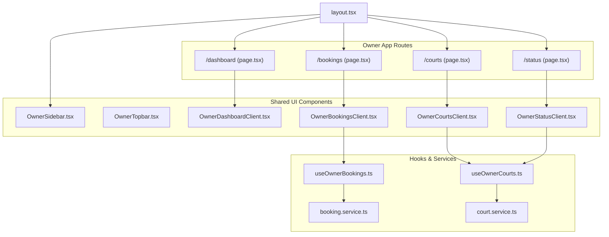
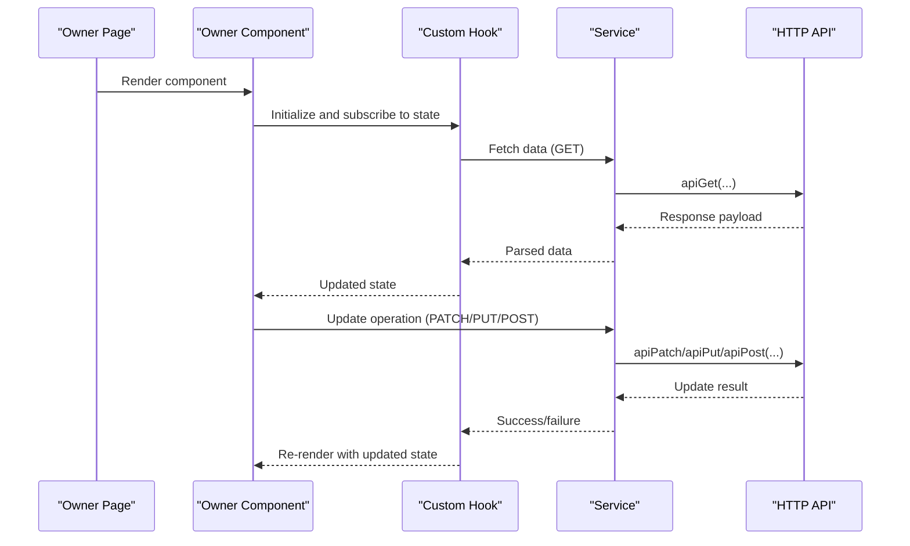
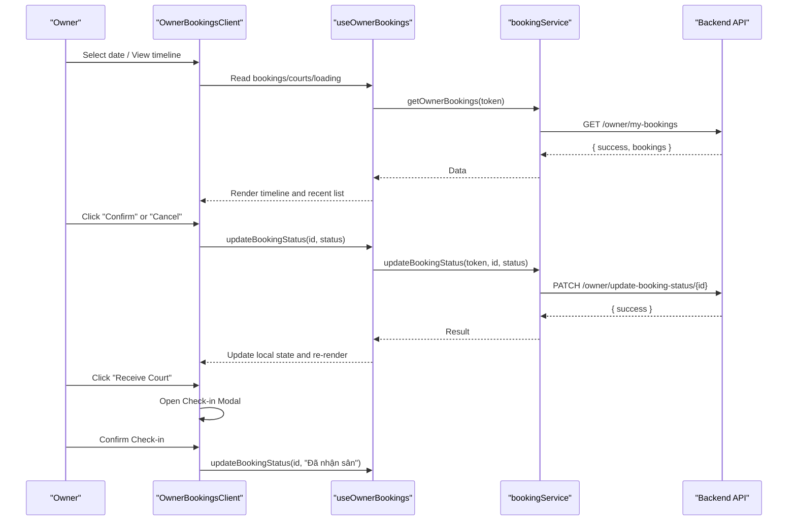
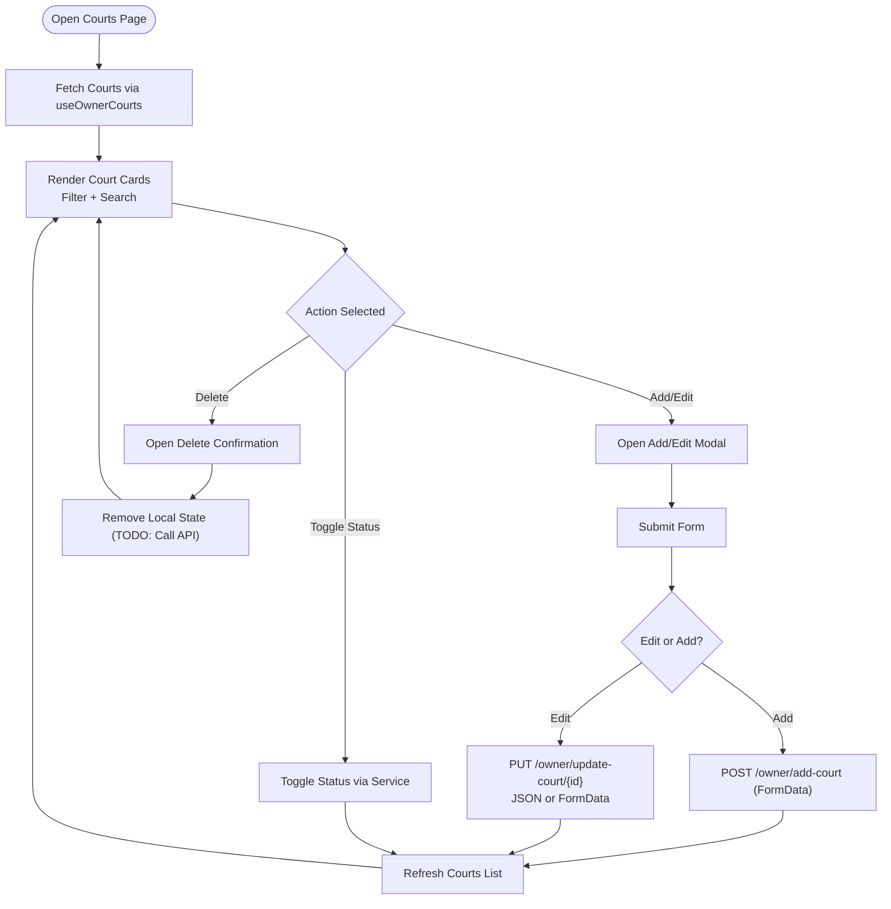
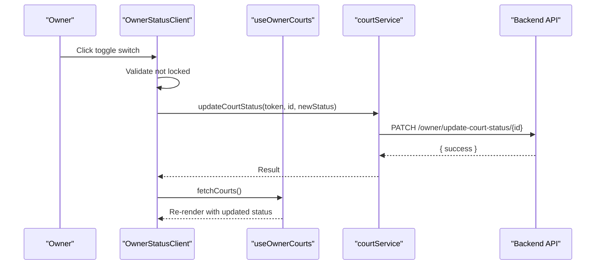
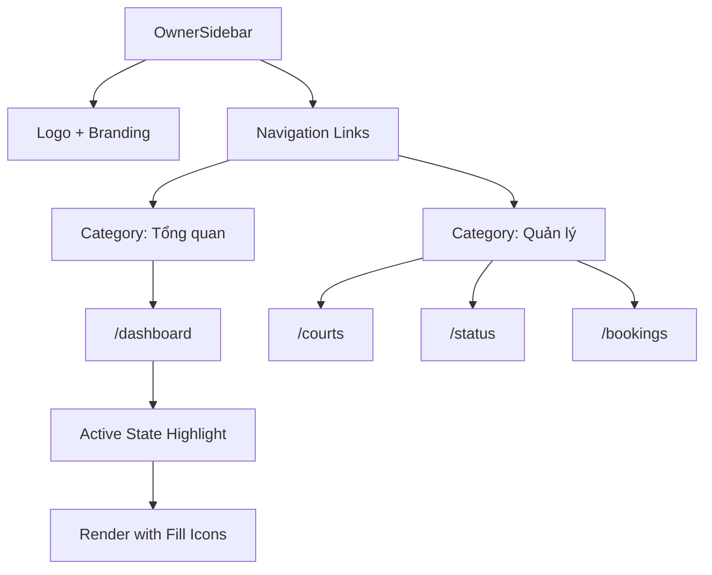
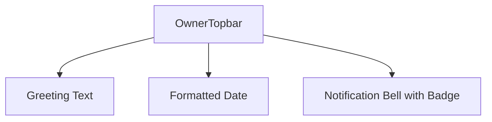
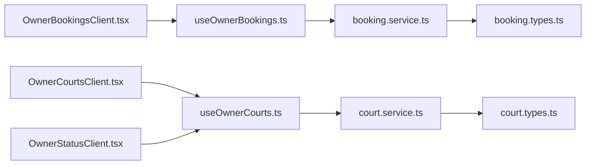

# Owner Dashboard UI

<cite>
**Referenced Files in This Document**
- [OwnerDashboardClient.tsx](file://frontend/src/components/owner/OwnerDashboardClient.tsx)
- [OwnerBookingsClient.tsx](file://frontend/src/components/owner/OwnerBookingsClient.tsx)
- [OwnerCourtsClient.tsx](file://frontend/src/components/owner/OwnerCourtsClient.tsx)
- [OwnerStatusClient.tsx](file://frontend/src/components/owner/OwnerStatusClient.tsx)
- [OwnerSidebar.tsx](file://frontend/src/components/owner/OwnerSidebar.tsx)
- [OwnerTopbar.tsx](file://frontend/src/components/owner/OwnerTopbar.tsx)
- [useOwnerBookings.ts](file://frontend/src/hooks/useOwnerBookings.ts)
- [useOwnerCourts.ts](file://frontend/src/hooks/useOwnerCourts.ts)
- [booking.service.ts](file://frontend/src/services/booking.service.ts)
- [court.service.ts](file://frontend/src/services/court.service.ts)
- [booking.types.ts](file://frontend/src/types/booking.types.ts)
- [court.types.ts](file://frontend/src/types/court.types.ts)
- [layout.tsx](file://frontend/src/app/(owner)/layout.tsx)
- [dashboard/page.tsx](file://frontend/src/app/(owner)/dashboard/page.tsx)
- [bookings/page.tsx](file://frontend/src/app/(owner)/bookings/page.tsx)
- [courts/page.tsx](file://frontend/src/app/(owner)/courts/page.tsx)
- [status/page.tsx](file://frontend/src/app/(owner)/status/page.tsx)
</cite>

## Table of Contents
1. [Introduction](#introduction)
2. [Project Structure](#project-structure)
3. [Core Components](#core-components)
4. [Architecture Overview](#architecture-overview)
5. [Detailed Component Analysis](#detailed-component-analysis)
6. [Dependency Analysis](#dependency-analysis)
7. [Performance Considerations](#performance-considerations)
8. [Troubleshooting Guide](#troubleshooting-guide)
9. [Conclusion](#conclusion)

## Introduction
This document provides comprehensive documentation for the owner dashboard user interface components. It covers the main dashboard, booking management, facility administration, and facility status control. It also explains the sidebar navigation, topbar components, and owner-specific data visualization. The guide details booking status management, facility CRUD operations, revenue tracking, analytics display, component state management, form handling for facility updates, and real-time booking notifications. Examples of owner workflow implementations and administrative task automation are included to help developers and administrators implement and maintain the system effectively.

## Project Structure
The owner dashboard is organized as a Next.js application with route-based pages and shared UI components. The owner-facing routes are grouped under the (owner) app directory, each page rendering a dedicated client component. Shared UI components reside under the owner folder, while reusable hooks and services encapsulate data fetching and state logic.

**Diagram sources**
- [layout.tsx:1-20](file://frontend/src/app/(owner)/layout.tsx#L1-L20)
- [dashboard/page.tsx:1-11](file://frontend/src/app/(owner)/dashboard/page.tsx#L1-L11)
- [bookings/page.tsx:1-11](file://frontend/src/app/(owner)/bookings/page.tsx#L1-L11)
- [courts/page.tsx:1-11](file://frontend/src/app/(owner)/courts/page.tsx#L1-L11)
- [status/page.tsx:1-11](file://frontend/src/app/(owner)/status/page.tsx#L1-L11)
- [OwnerSidebar.tsx:1-90](file://frontend/src/components/owner/OwnerSidebar.tsx#L1-L90)
- [OwnerTopbar.tsx:1-37](file://frontend/src/components/owner/OwnerTopbar.tsx#L1-L37)
- [OwnerDashboardClient.tsx:1-176](file://frontend/src/components/owner/OwnerDashboardClient.tsx#L1-L176)
- [OwnerBookingsClient.tsx:1-323](file://frontend/src/components/owner/OwnerBookingsClient.tsx#L1-L323)
- [OwnerCourtsClient.tsx:1-465](file://frontend/src/components/owner/OwnerCourtsClient.tsx#L1-L465)
- [OwnerStatusClient.tsx:1-116](file://frontend/src/components/owner/OwnerStatusClient.tsx#L1-L116)
- [useOwnerBookings.ts:1-67](file://frontend/src/hooks/useOwnerBookings.ts#L1-L67)
- [useOwnerCourts.ts:1-95](file://frontend/src/hooks/useOwnerCourts.ts#L1-L95)
- [booking.service.ts:1-13](file://frontend/src/services/booking.service.ts#L1-L13)
- [court.service.ts:1-26](file://frontend/src/services/court.service.ts#L1-L26)

**Section sources**
- [layout.tsx:1-20](file://frontend/src/app/(owner)/layout.tsx#L1-L20)
- [OwnerSidebar.tsx:1-90](file://frontend/src/components/owner/OwnerSidebar.tsx#L1-L90)

## Core Components
This section introduces the primary owner dashboard components and their responsibilities:
- OwnerDashboardClient: Renders owner overview statistics, recent bookings, and performance metrics.
- OwnerBookingsClient: Manages booking timelines, status updates, and check-in flows.
- OwnerCourtsClient: Handles facility CRUD operations, filtering, and bulk status toggles.
- OwnerStatusClient: Provides a quick overview and toggle for facility operational statuses.
- OwnerSidebar: Implements owner navigation and branding.
- OwnerTopbar: Displays contextual date and notification indicators.

Key capabilities:
- Real-time booking notifications and status transitions.
- Facility CRUD with image uploads and optional JSON or multipart payloads.
- Revenue tracking and analytics visualization.
- Responsive layout with Tailwind-based styling and interactive modals.

**Section sources**
- [OwnerDashboardClient.tsx:30-176](file://frontend/src/components/owner/OwnerDashboardClient.tsx#L30-L176)
- [OwnerBookingsClient.tsx:15-323](file://frontend/src/components/owner/OwnerBookingsClient.tsx#L15-L323)
- [OwnerCourtsClient.tsx:18-465](file://frontend/src/components/owner/OwnerCourtsClient.tsx#L18-L465)
- [OwnerStatusClient.tsx:11-116](file://frontend/src/components/owner/OwnerStatusClient.tsx#L11-L116)
- [OwnerSidebar.tsx:13-90](file://frontend/src/components/owner/OwnerSidebar.tsx#L13-L90)
- [OwnerTopbar.tsx:5-37](file://frontend/src/components/owner/OwnerTopbar.tsx#L5-L37)

## Architecture Overview
The owner dashboard follows a layered architecture:
- Page routes render dedicated client components.
- Client components use custom hooks to manage state and call service functions.
- Services encapsulate API interactions via a shared HTTP utility.
- Types define the shape of API responses and domain entities.

**Diagram sources**
- [dashboard/page.tsx:8-10](file://frontend/src/app/(owner)/dashboard/page.tsx#L8-L10)
- [bookings/page.tsx:8-10](file://frontend/src/app/(owner)/bookings/page.tsx#L8-L10)
- [courts/page.tsx:8-10](file://frontend/src/app/(owner)/courts/page.tsx#L8-L10)
- [status/page.tsx:8-10](file://frontend/src/app/(owner)/status/page.tsx#L8-L10)
- [OwnerBookingsClient.tsx:16](file://frontend/src/components/owner/OwnerBookingsClient.tsx#L16)
- [OwnerCourtsClient.tsx:19](file://frontend/src/components/owner/OwnerCourtsClient.tsx#L19)
- [OwnerStatusClient.tsx:12](file://frontend/src/components/owner/OwnerStatusClient.tsx#L12)
- [useOwnerBookings.ts:14-33](file://frontend/src/hooks/useOwnerBookings.ts#L14-L33)
- [useOwnerCourts.ts:13-25](file://frontend/src/hooks/useOwnerCourts.ts#L13-L25)
- [booking.service.ts:5-11](file://frontend/src/services/booking.service.ts#L5-L11)
- [court.service.ts:9-24](file://frontend/src/services/court.service.ts#L9-L24)

## Detailed Component Analysis

### OwnerDashboardClient
Responsibilities:
- Renders owner overview cards (wallet balance, total bookings, monthly revenue, active courts).
- Displays a recent bookings table with status badges.
- Shows a performance leaderboard for high-performing facilities.
- Provides a “Create new court” action.

State and rendering:
- Uses client-side hydration guard to avoid SSR mismatches.
- Computes current date for header display.
- Defines StatCard and BookingRow subcomponents for reuse.

Data visualization:
- Static stats for demonstration; can be extended to fetch live metrics.

**Diagram sources**
- [OwnerDashboardClient.tsx:30-176](file://frontend/src/components/owner/OwnerDashboardClient.tsx#L30-L176)

**Section sources**
- [OwnerDashboardClient.tsx:30-176](file://frontend/src/components/owner/OwnerDashboardClient.tsx#L30-L176)

### OwnerBookingsClient
Responsibilities:
- Displays a timeline view of bookings across courts for a selected date.
- Allows owners to confirm pending bookings and mark check-ins.
- Shows a summary panel of booking counts per status.
- Provides a modal for check-in confirmation with payment breakdown.

State management:
- Tracks selected date, check-in modal data, and toast notifications.
- Uses hook-provided data and mutation functions for bookings and courts.

Booking status management:
- Transitions pending to confirmed or cancelled.
- Moves deposited or confirmed to checked-in after payment reconciliation.

**Diagram sources**
- [OwnerBookingsClient.tsx:16](file://frontend/src/components/owner/OwnerBookingsClient.tsx#L16)
- [useOwnerBookings.ts:14-57](file://frontend/src/hooks/useOwnerBookings.ts#L14-L57)
- [booking.service.ts:5-11](file://frontend/src/services/booking.service.ts#L5-L11)

**Section sources**
- [OwnerBookingsClient.tsx:15-323](file://frontend/src/components/owner/OwnerBookingsClient.tsx#L15-L323)
- [useOwnerBookings.ts:8-66](file://frontend/src/hooks/useOwnerBookings.ts#L8-L66)
- [booking.types.ts:1-37](file://frontend/src/types/booking.types.ts#L1-L37)

### OwnerCourtsClient
Responsibilities:
- Lists owner’s courts with filtering by sport type and search term.
- Supports add/edit forms with image upload handling.
- Enables status toggling per court and deletion confirmation.
- Integrates with owner-specific court APIs.

Form handling:
- Adds new courts via multipart/form-data.
- Updates existing courts with optional image replacement.
- Resets form state after successful save.

**Diagram sources**
- [OwnerCourtsClient.tsx:18-465](file://frontend/src/components/owner/OwnerCourtsClient.tsx#L18-L465)
- [useOwnerCourts.ts:13-94](file://frontend/src/hooks/useOwnerCourts.ts#L13-L94)
- [court.service.ts:9-24](file://frontend/src/services/court.service.ts#L9-L24)
- [court.types.ts:53-82](file://frontend/src/types/court.types.ts#L53-L82)

**Section sources**
- [OwnerCourtsClient.tsx:18-465](file://frontend/src/components/owner/OwnerCourtsClient.tsx#L18-L465)
- [useOwnerCourts.ts:8-94](file://frontend/src/hooks/useOwnerCourts.ts#L8-L94)
- [court.types.ts:53-82](file://frontend/src/types/court.types.ts#L53-L82)

### OwnerStatusClient
Responsibilities:
- Presents a concise list of courts with status badges and a toggle switch.
- Prevents updates if a court is locked.
- Uses toast feedback for success/error states.

**Diagram sources**
- [OwnerStatusClient.tsx:11-116](file://frontend/src/components/owner/OwnerStatusClient.tsx#L11-L116)
- [useOwnerCourts.ts:13-25](file://frontend/src/hooks/useOwnerCourts.ts#L13-L25)
- [court.service.ts:22-24](file://frontend/src/services/court.service.ts#L22-L24)

**Section sources**
- [OwnerStatusClient.tsx:11-116](file://frontend/src/components/owner/OwnerStatusClient.tsx#L11-L116)
- [useOwnerCourts.ts:34-54](file://frontend/src/hooks/useOwnerCourts.ts#L34-L54)

### Sidebar Navigation
Responsibilities:
- Provides fixed sidebar navigation with icons and categorized links.
- Highlights active route based on pathname.
- Includes branding and logout affordance.

**Diagram sources**
- [OwnerSidebar.tsx:13-90](file://frontend/src/components/owner/OwnerSidebar.tsx#L13-L90)

**Section sources**
- [OwnerSidebar.tsx:13-90](file://frontend/src/components/owner/OwnerSidebar.tsx#L13-L90)

### Topbar Components
Responsibilities:
- Displays current date and notification indicator.
- Provides contextual greeting and date formatting.

**Diagram sources**
- [OwnerTopbar.tsx:5-37](file://frontend/src/components/owner/OwnerTopbar.tsx#L5-L37)

**Section sources**
- [OwnerTopbar.tsx:5-37](file://frontend/src/components/owner/OwnerTopbar.tsx#L5-L37)

## Dependency Analysis
The components rely on shared hooks and services to manage state and API interactions. The hooks encapsulate data fetching and mutations, while services abstract HTTP requests. Types define the contract for API responses.

**Diagram sources**
- [OwnerBookingsClient.tsx:16](file://frontend/src/components/owner/OwnerBookingsClient.tsx#L16)
- [OwnerCourtsClient.tsx:19](file://frontend/src/components/owner/OwnerCourtsClient.tsx#L19)
- [OwnerStatusClient.tsx:12](file://frontend/src/components/owner/OwnerStatusClient.tsx#L12)
- [useOwnerBookings.ts:8-66](file://frontend/src/hooks/useOwnerBookings.ts#L8-L66)
- [useOwnerCourts.ts:8-94](file://frontend/src/hooks/useOwnerCourts.ts#L8-L94)
- [booking.service.ts:4-12](file://frontend/src/services/booking.service.ts#L4-L12)
- [court.service.ts:4-25](file://frontend/src/services/court.service.ts#L4-L25)
- [booking.types.ts:1-37](file://frontend/src/types/booking.types.ts#L1-L37)
- [court.types.ts:1-82](file://frontend/src/types/court.types.ts#L1-L82)

**Section sources**
- [useOwnerBookings.ts:8-66](file://frontend/src/hooks/useOwnerBookings.ts#L8-L66)
- [useOwnerCourts.ts:8-94](file://frontend/src/hooks/useOwnerCourts.ts#L8-L94)
- [booking.service.ts:4-12](file://frontend/src/services/booking.service.ts#L4-L12)
- [court.service.ts:4-25](file://frontend/src/services/court.service.ts#L4-L25)
- [booking.types.ts:1-37](file://frontend/src/types/booking.types.ts#L1-L37)
- [court.types.ts:1-82](file://frontend/src/types/court.types.ts#L1-L82)

## Performance Considerations
- Minimize re-renders by leveraging memoized callbacks in hooks and avoiding unnecessary state updates.
- Defer heavy computations (e.g., timeline column calculations) to pure functions and cache results where appropriate.
- Use skeleton loaders during initial fetches to improve perceived performance.
- Optimize image assets for court listings and ensure lazy loading where applicable.
- Debounce search inputs to reduce frequent re-fetches.

## Troubleshooting Guide
Common issues and resolutions:
- Hydration mismatch on dashboard: Ensure client-side guards are in place when rendering date-dependent content.
- Toast notifications not appearing: Verify toast provider is initialized globally and network requests succeed.
- Timeline not rendering: Confirm that fetched bookings include valid start/end timestamps and that the selected date matches booking dates.
- Form submission errors: Validate required fields and ensure FormData is constructed correctly for multipart uploads.
- Status toggle failures: Check that the selected court is not locked and that the token is present.

**Section sources**
- [OwnerDashboardClient.tsx:34-49](file://frontend/src/components/owner/OwnerDashboardClient.tsx#L34-L49)
- [OwnerBookingsClient.tsx:44-51](file://frontend/src/components/owner/OwnerBookingsClient.tsx#L44-L51)
- [OwnerCourtsClient.tsx:93-149](file://frontend/src/components/owner/OwnerCourtsClient.tsx#L93-L149)
- [OwnerStatusClient.tsx:16-39](file://frontend/src/components/owner/OwnerStatusClient.tsx#L16-L39)

## Conclusion
The owner dashboard UI provides a comprehensive set of tools for managing bookings, facilities, and operational statuses. By leveraging custom hooks, typed services, and modular components, the system supports efficient workflows, real-time updates, and a scalable foundation for future enhancements. The documented patterns enable consistent development practices and reliable maintenance across the owner-facing features.