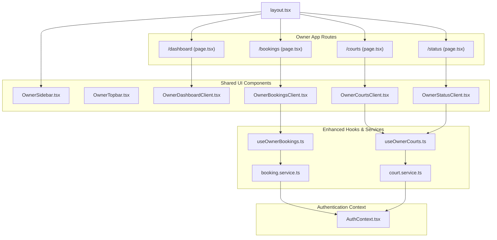
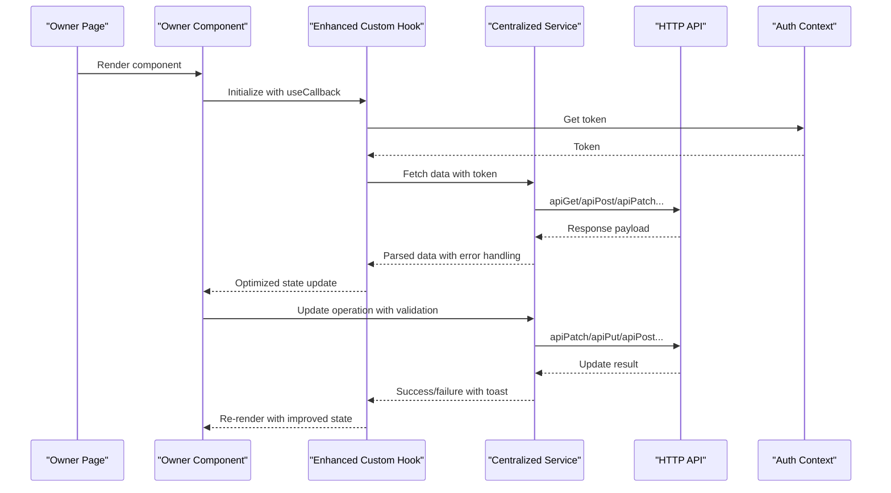
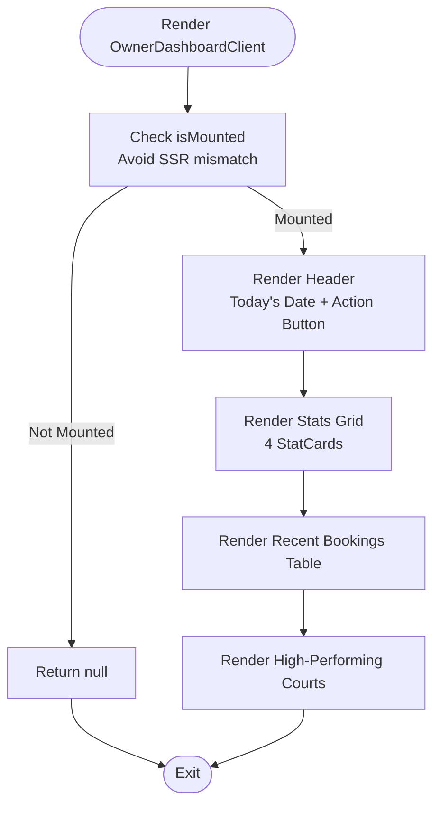
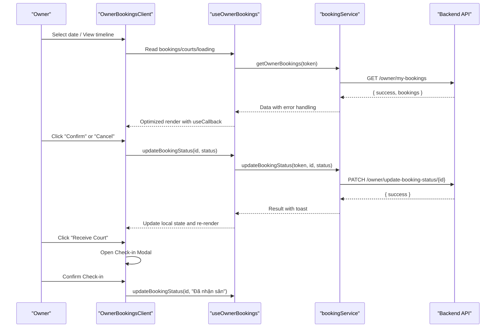
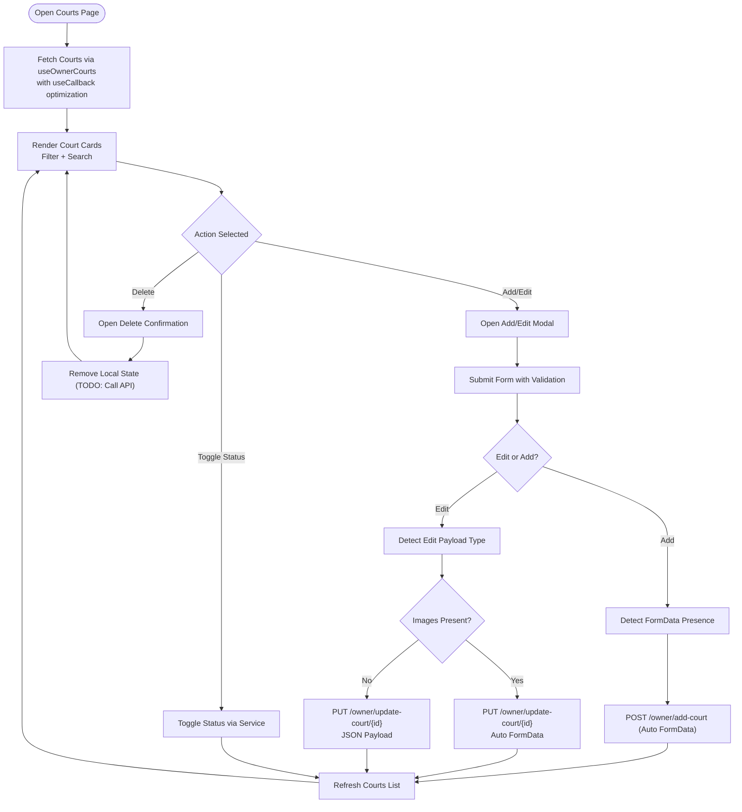
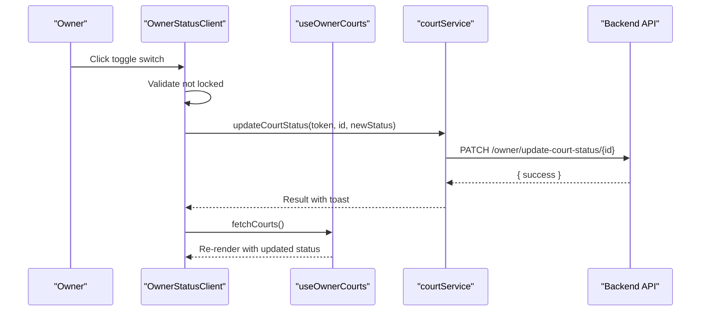
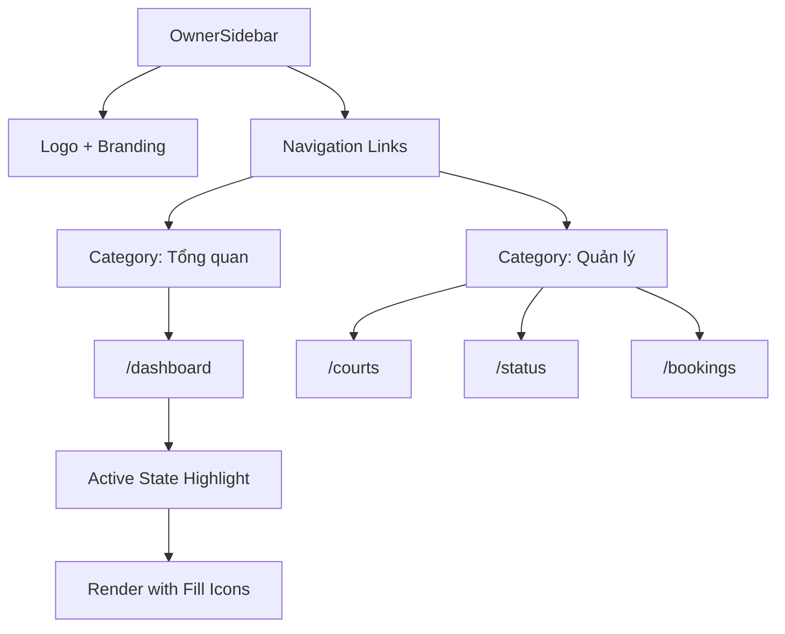
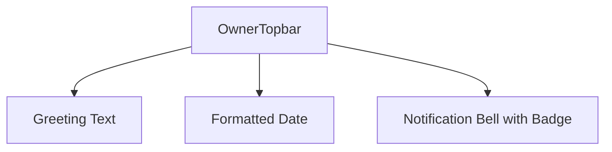
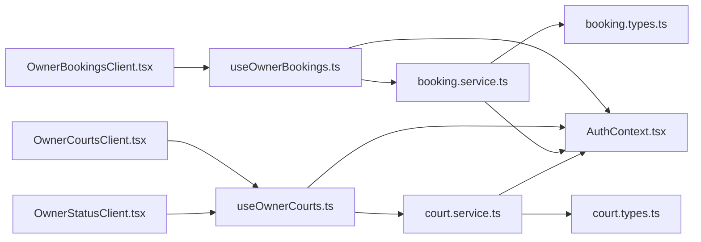

# Owner Dashboard UI

<cite>
**Referenced Files in This Document**
- [OwnerDashboardClient.tsx](file://frontend/src/components/owner/OwnerDashboardClient.tsx)
- [OwnerBookingsClient.tsx](file://frontend/src/components/owner/OwnerBookingsClient.tsx)
- [OwnerCourtsClient.tsx](file://frontend/src/components/owner/OwnerCourtsClient.tsx)
- [OwnerStatusClient.tsx](file://frontend/src/components/owner/OwnerStatusClient.tsx)
- [OwnerSidebar.tsx](file://frontend/src/components/owner/OwnerSidebar.tsx)
- [OwnerTopbar.tsx](file://frontend/src/components/owner/OwnerTopbar.tsx)
- [useOwnerBookings.ts](file://frontend/src/hooks/useOwnerBookings.ts)
- [useOwnerCourts.ts](file://frontend/src/hooks/useOwnerCourts.ts)
- [booking.service.ts](file://frontend/src/services/booking.service.ts)
- [court.service.ts](file://frontend/src/services/court.service.ts)
- [booking.types.ts](file://frontend/src/types/booking.types.ts)
- [court.types.ts](file://frontend/src/types/court.types.ts)
- [layout.tsx](file://frontend/src/app/(owner)/layout.tsx)
- [dashboard/page.tsx](file://frontend/src/app/(owner)/dashboard/page.tsx)
- [bookings/page.tsx](file://frontend/src/app/(owner)/bookings/page.tsx)
- [courts/page.tsx](file://frontend/src/app/(owner)/courts/page.tsx)
- [status/page.tsx](file://frontend/src/app/(owner)/status/page.tsx)
</cite>

## Update Summary
**Changes Made**
- Enhanced hook-based data fetching architecture with centralized service layer integration
- Improved form handling with better FormData support and conditional JSON/multipart payloads
- Updated component state management with useCallback optimization and better error handling
- Strengthened authentication context integration with token-based service calls
- Enhanced toast notification system with improved user feedback

## Table of Contents
1. [Introduction](#introduction)
2. [Project Structure](#project-structure)
3. [Core Components](#core-components)
4. [Architecture Overview](#architecture-overview)
5. [Detailed Component Analysis](#detailed-component-analysis)
6. [Enhanced Hook-Based Data Fetching](#enhanced-hook-based-data-fetching)
7. [Improved Form Handling](#improved-form-handling)
8. [Centralized Service Layer Integration](#centralized-service-layer-integration)
9. [Dependency Analysis](#dependency-analysis)
10. [Performance Considerations](#performance-considerations)
11. [Troubleshooting Guide](#troubleshooting-guide)
12. [Conclusion](#conclusion)

## Introduction
This document provides comprehensive documentation for the owner dashboard user interface components. It covers the main dashboard, booking management, facility administration, and facility status control. The system has been enhanced with new hook-based data fetching, improved form handling, and better integration with the centralized service layer. The guide details booking status management, facility CRUD operations, revenue tracking, analytics display, component state management, form handling for facility updates, and real-time booking notifications. Examples of owner workflow implementations and administrative task automation are included to help developers and administrators implement and maintain the system effectively.

## Project Structure
The owner dashboard is organized as a Next.js application with route-based pages and shared UI components. The owner-facing routes are grouped under the (owner) app directory, each page rendering a dedicated client component. Shared UI components reside under the owner folder, while reusable hooks and services encapsulate data fetching and state logic with enhanced authentication and error handling.

**Diagram sources**
- [layout.tsx:1-20](file://frontend/src/app/(owner)/layout.tsx#L1-L20)
- [dashboard/page.tsx:1-11](file://frontend/src/app/(owner)/dashboard/page.tsx#L1-L11)
- [bookings/page.tsx:1-11](file://frontend/src/app/(owner)/bookings/page.tsx#L1-L11)
- [courts/page.tsx:1-11](file://frontend/src/app/(owner)/courts/page.tsx#L1-L11)
- [status/page.tsx:1-11](file://frontend/src/app/(owner)/status/page.tsx#L1-L11)
- [OwnerSidebar.tsx:1-90](file://frontend/src/components/owner/OwnerSidebar.tsx#L1-L90)
- [OwnerTopbar.tsx:1-37](file://frontend/src/components/owner/OwnerTopbar.tsx#L1-L37)
- [OwnerDashboardClient.tsx:1-176](file://frontend/src/components/owner/OwnerDashboardClient.tsx#L1-L176)
- [OwnerBookingsClient.tsx:1-323](file://frontend/src/components/owner/OwnerBookingsClient.tsx#L1-L323)
- [OwnerCourtsClient.tsx:1-465](file://frontend/src/components/owner/OwnerCourtsClient.tsx#L1-L465)
- [OwnerStatusClient.tsx:1-116](file://frontend/src/components/owner/OwnerStatusClient.tsx#L1-L116)
- [useOwnerBookings.ts:1-67](file://frontend/src/hooks/useOwnerBookings.ts#L1-L67)
- [useOwnerCourts.ts:1-95](file://frontend/src/hooks/useOwnerCourts.ts#L1-L95)
- [booking.service.ts:1-13](file://frontend/src/services/booking.service.ts#L1-L13)
- [court.service.ts:1-26](file://frontend/src/services/court.service.ts#L1-L26)

**Section sources**
- [layout.tsx:1-20](file://frontend/src/app/(owner)/layout.tsx#L1-L20)
- [OwnerSidebar.tsx:1-90](file://frontend/src/components/owner/OwnerSidebar.tsx#L1-L90)

## Core Components
This section introduces the primary owner dashboard components and their responsibilities with enhanced hook-based architecture:

- **OwnerDashboardClient**: Renders owner overview statistics, recent bookings, and performance metrics with improved hydration handling.
- **OwnerBookingsClient**: Manages booking timelines, status updates, and check-in flows using optimized useCallback hooks.
- **OwnerCourtsClient**: Handles facility CRUD operations with enhanced form validation and conditional payload handling.
- **OwnerStatusClient**: Provides a quick overview and toggle for facility operational statuses with improved toast notifications.
- **OwnerSidebar**: Implements owner navigation and branding with active route highlighting.
- **OwnerTopbar**: Displays contextual date and notification indicators with enhanced user experience.

**Updated** Enhanced with useCallback optimization, improved error handling, and better integration with authentication context.

Key capabilities:
- Real-time booking notifications and status transitions with optimized state updates.
- Facility CRUD with intelligent FormData detection and optional JSON payloads.
- Revenue tracking and analytics visualization with improved data structures.
- Responsive layout with Tailwind-based styling and enhanced interactive modals.
- Centralized service layer integration with proper authentication context management.

**Section sources**
- [OwnerDashboardClient.tsx:30-176](file://frontend/src/components/owner/OwnerDashboardClient.tsx#L30-L176)
- [OwnerBookingsClient.tsx:15-323](file://frontend/src/components/owner/OwnerBookingsClient.tsx#L15-L323)
- [OwnerCourtsClient.tsx:18-465](file://frontend/src/components/owner/OwnerCourtsClient.tsx#L18-L465)
- [OwnerStatusClient.tsx:11-116](file://frontend/src/components/owner/OwnerStatusClient.tsx#L11-L116)
- [OwnerSidebar.tsx:13-90](file://frontend/src/components/owner/OwnerSidebar.tsx#L13-L90)
- [OwnerTopbar.tsx:5-37](file://frontend/src/components/owner/OwnerTopbar.tsx#L5-L37)

## Architecture Overview
The owner dashboard follows an enhanced layered architecture with improved hook-based data fetching and centralized service integration:

**Diagram sources**
- [dashboard/page.tsx:8-10](file://frontend/src/app/(owner)/dashboard/page.tsx#L8-L10)
- [bookings/page.tsx:8-10](file://frontend/src/app/(owner)/bookings/page.tsx#L8-L10)
- [courts/page.tsx:8-10](file://frontend/src/app/(owner)/courts/page.tsx#L8-L10)
- [status/page.tsx:8-10](file://frontend/src/app/(owner)/status/page.tsx#L8-L10)
- [OwnerBookingsClient.tsx:16](file://frontend/src/components/owner/OwnerBookingsClient.tsx#L16)
- [OwnerCourtsClient.tsx:19](file://frontend/src/components/owner/OwnerCourtsClient.tsx#L19)
- [OwnerStatusClient.tsx:12](file://frontend/src/components/owner/OwnerStatusClient.tsx#L12)
- [useOwnerBookings.ts:14-33](file://frontend/src/hooks/useOwnerBookings.ts#L14-L33)
- [useOwnerCourts.ts:13-25](file://frontend/src/hooks/useOwnerCourts.ts#L13-L25)
- [booking.service.ts:5-11](file://frontend/src/services/booking.service.ts#L5-L11)
- [court.service.ts:9-24](file://frontend/src/services/court.service.ts#L9-L24)

## Detailed Component Analysis

### OwnerDashboardClient
Responsibilities:
- Renders owner overview cards (wallet balance, total bookings, monthly revenue, active courts).
- Displays a recent bookings table with status badges.
- Shows a performance leaderboard for high-performing facilities.
- Provides a "Create new court" action with improved hydration handling.

**Updated** Enhanced with better hydration guards and improved component structure.

State and rendering:
- Uses client-side hydration guard to avoid SSR mismatches.
- Computes current date for header display.
- Defines StatCard and BookingRow subcomponents for reuse.

Data visualization:
- Static stats for demonstration; can be extended to fetch live metrics.

**Diagram sources**
- [OwnerDashboardClient.tsx:30-176](file://frontend/src/components/owner/OwnerDashboardClient.tsx#L30-L176)

**Section sources**
- [OwnerDashboardClient.tsx:30-176](file://frontend/src/components/owner/OwnerDashboardClient.tsx#L30-L176)

### OwnerBookingsClient
Responsibilities:
- Displays a timeline view of bookings across courts for a selected date.
- Allows owners to confirm pending bookings and mark check-ins.
- Shows a summary panel of booking counts per status.
- Provides a modal for check-in confirmation with payment breakdown.

**Updated** Enhanced with useCallback optimization, improved toast notifications, and better error handling.

State management:
- Tracks selected date, check-in modal data, and toast notifications.
- Uses hook-provided data and mutation functions for bookings and courts.
- Implements useCallback for performance optimization.

Booking status management:
- Transitions pending to confirmed or cancelled.
- Moves deposited or confirmed to checked-in after payment reconciliation.

**Diagram sources**
- [OwnerBookingsClient.tsx:16](file://frontend/src/components/owner/OwnerBookingsClient.tsx#L16)
- [useOwnerBookings.ts:14-57](file://frontend/src/hooks/useOwnerBookings.ts#L14-L57)
- [booking.service.ts:5-11](file://frontend/src/services/booking.service.ts#L5-L11)

**Section sources**
- [OwnerBookingsClient.tsx:15-323](file://frontend/src/components/owner/OwnerBookingsClient.tsx#L15-L323)
- [useOwnerBookings.ts:8-66](file://frontend/src/hooks/useOwnerBookings.ts#L8-L66)
- [booking.types.ts:1-37](file://frontend/src/types/booking.types.ts#L1-L37)

### OwnerCourtsClient
Responsibilities:
- Lists owner's courts with filtering by sport type and search term.
- Supports add/edit forms with intelligent image upload handling.
- Enables status toggling per court and deletion confirmation.
- Integrates with owner-specific court APIs.

**Updated** Enhanced with improved form validation, conditional payload handling, and better error management.

Form handling:
- Adds new courts via multipart/form-data.
- Updates existing courts with automatic JSON or FormData detection.
- Resets form state after successful save.
- Implements intelligent payload selection based on image presence.

**Diagram sources**
- [OwnerCourtsClient.tsx:18-465](file://frontend/src/components/owner/OwnerCourtsClient.tsx#L18-L465)
- [useOwnerCourts.ts:13-94](file://frontend/src/hooks/useOwnerCourts.ts#L13-L94)
- [court.service.ts:9-24](file://frontend/src/services/court.service.ts#L9-L24)
- [court.types.ts:53-82](file://frontend/src/types/court.types.ts#L53-L82)

**Section sources**
- [OwnerCourtsClient.tsx:18-465](file://frontend/src/components/owner/OwnerCourtsClient.tsx#L18-L465)
- [useOwnerCourts.ts:8-94](file://frontend/src/hooks/useOwnerCourts.ts#L8-L94)
- [court.types.ts:53-82](file://frontend/src/types/court.types.ts#L53-L82)

### OwnerStatusClient
Responsibilities:
- Presents a concise list of courts with status badges and a toggle switch.
- Prevents updates if a court is locked.
- Uses toast feedback for success/error states.

**Updated** Enhanced with improved toast notifications, better error handling, and optimized state management.

**Diagram sources**
- [OwnerStatusClient.tsx:11-116](file://frontend/src/components/owner/OwnerStatusClient.tsx#L11-L116)
- [useOwnerCourts.ts:13-25](file://frontend/src/hooks/useOwnerCourts.ts#L13-L25)
- [court.service.ts:22-24](file://frontend/src/services/court.service.ts#L22-L24)

**Section sources**
- [OwnerStatusClient.tsx:11-116](file://frontend/src/components/owner/OwnerStatusClient.tsx#L11-L116)
- [useOwnerCourts.ts:34-54](file://frontend/src/hooks/useOwnerCourts.ts#L34-L54)

### Sidebar Navigation
Responsibilities:
- Provides fixed sidebar navigation with icons and categorized links.
- Highlights active route based on pathname.
- Includes branding and logout affordance.

**Diagram sources**
- [OwnerSidebar.tsx:13-90](file://frontend/src/components/owner/OwnerSidebar.tsx#L13-L90)

**Section sources**
- [OwnerSidebar.tsx:13-90](file://frontend/src/components/owner/OwnerSidebar.tsx#L13-L90)

### Topbar Components
Responsibilities:
- Displays current date and notification indicator.
- Provides contextual greeting and date formatting.

**Diagram sources**
- [OwnerTopbar.tsx:5-37](file://frontend/src/components/owner/OwnerTopbar.tsx#L5-L37)

**Section sources**
- [OwnerTopbar.tsx:5-37](file://frontend/src/components/owner/OwnerTopbar.tsx#L5-L37)

## Enhanced Hook-Based Data Fetching
The system now utilizes enhanced hooks with useCallback optimization and improved error handling:

**useOwnerBookings Hook Features:**
- Token-based authentication with AuthContext integration
- useCallback-optimized fetch functions to prevent unnecessary re-renders
- Automatic unique court extraction for timeline rendering
- Optimized state updates with proper error boundaries
- Toast notification integration for user feedback

**useOwnerCourts Hook Features:**
- Intelligent payload detection for add/edit operations
- Conditional JSON/Form submission based on image presence
- Optimized state management with useCallback
- Centralized error handling and loading states
- Enhanced authentication context integration

**Updated** Both hooks now implement useCallback for performance optimization and improved error handling patterns.

**Section sources**
- [useOwnerBookings.ts:8-66](file://frontend/src/hooks/useOwnerBookings.ts#L8-L66)
- [useOwnerCourts.ts:8-94](file://frontend/src/hooks/useOwnerCourts.ts#L8-L94)

## Improved Form Handling
The form handling system has been significantly enhanced:

**Intelligent Payload Detection:**
- Automatic FormData vs JSON detection based on image presence
- Conditional API calls for different payload types
- Better error handling and validation

**Enhanced User Experience:**
- Improved modal animations and transitions
- Better form validation and error messaging
- Enhanced loading states and user feedback
- Optimized image upload handling with drag-and-drop support

**Updated** Forms now intelligently detect payload types and provide better user feedback throughout the process.

**Section sources**
- [OwnerCourtsClient.tsx:93-149](file://frontend/src/components/owner/OwnerCourtsClient.tsx#L93-L149)
- [OwnerBookingsClient.tsx:44-51](file://frontend/src/components/owner/OwnerBookingsClient.tsx#L44-L51)

## Centralized Service Layer Integration
The service layer provides a unified interface for API communication:

**Booking Service Enhancements:**
- Token-based authentication for all operations
- Proper error handling and response validation
- Optimized API endpoint calls with structured responses

**Court Service Improvements:**
- Support for both JSON and FormData submissions
- Intelligent payload routing based on operation type
- Enhanced error handling and user feedback

**Authentication Integration:**
- Seamless token management through AuthContext
- Automatic token inclusion in all service calls
- Improved error handling for authentication failures

**Updated** Services now provide better error handling, token management, and response validation.

**Section sources**
- [booking.service.ts:4-12](file://frontend/src/services/booking.service.ts#L4-L12)
- [court.service.ts:4-25](file://frontend/src/services/court.service.ts#L4-L25)

## Dependency Analysis
The components rely on enhanced shared hooks and services with improved state management and API interactions. The hooks now utilize useCallback for performance optimization, while services provide better error handling and authentication integration.

**Diagram sources**
- [OwnerBookingsClient.tsx:16](file://frontend/src/components/owner/OwnerBookingsClient.tsx#L16)
- [OwnerCourtsClient.tsx:19](file://frontend/src/components/owner/OwnerCourtsClient.tsx#L19)
- [OwnerStatusClient.tsx:12](file://frontend/src/components/owner/OwnerStatusClient.tsx#L12)
- [useOwnerBookings.ts:8-66](file://frontend/src/hooks/useOwnerBookings.ts#L8-L66)
- [useOwnerCourts.ts:8-94](file://frontend/src/hooks/useOwnerCourts.ts#L8-L94)
- [booking.service.ts:4-12](file://frontend/src/services/booking.service.ts#L4-L12)
- [court.service.ts:4-25](file://frontend/src/services/court.service.ts#L4-L25)
- [booking.types.ts:1-37](file://frontend/src/types/booking.types.ts#L1-L37)
- [court.types.ts:1-82](file://frontend/src/types/court.types.ts#L1-L82)

**Section sources**
- [useOwnerBookings.ts:8-66](file://frontend/src/hooks/useOwnerBookings.ts#L8-L66)
- [useOwnerCourts.ts:8-94](file://frontend/src/hooks/useOwnerCourts.ts#L8-L94)
- [booking.service.ts:4-12](file://frontend/src/services/booking.service.ts#L4-L12)
- [court.service.ts:4-25](file://frontend/src/services/court.service.ts#L4-L25)
- [booking.types.ts:1-37](file://frontend/src/types/booking.types.ts#L1-L37)
- [court.types.ts:1-82](file://frontend/src/types/court.types.ts#L1-L82)

## Performance Considerations
- **Enhanced Optimization**: Leverage useCallback in hooks to minimize re-renders and optimize expensive computations.
- **Deferred Loading**: Use skeleton loaders during initial fetches with improved loading state management.
- **Smart Caching**: Implement intelligent caching strategies for frequently accessed data like court lists and booking timelines.
- **Optimized Images**: Ensure lazy loading and proper image optimization for court listings.
- **Debounced Inputs**: Use debounced search inputs to reduce frequent re-fetches with improved performance.
- **Token Management**: Efficient token handling through AuthContext to avoid unnecessary authentication checks.

**Updated** Performance improvements include useCallback optimization, better loading states, and enhanced token management.

## Troubleshooting Guide
Common issues and resolutions with enhanced error handling:

**Hydration Issues**: Ensure client-side guards are in place when rendering date-dependent content with improved hydration checking.

**Toast Notifications**: Verify toast provider is initialized globally and network requests succeed with enhanced error handling.

**Timeline Rendering**: Confirm that fetched bookings include valid start/end timestamps and that the selected date matches booking dates with improved validation.

**Form Submission Errors**: Validate required fields and ensure FormData is constructed correctly for multipart uploads with intelligent payload detection.

**Status Toggle Failures**: Check that the selected court is not locked and that the token is present with enhanced authentication context integration.

**Hook Performance Issues**: Verify useCallback implementation and proper dependency arrays to prevent unnecessary re-renders.

**Service Integration Problems**: Ensure AuthContext provides valid tokens and services handle authentication errors gracefully.

**Updated** Enhanced error handling and debugging capabilities for better troubleshooting experience.

**Section sources**
- [OwnerDashboardClient.tsx:34-49](file://frontend/src/components/owner/OwnerDashboardClient.tsx#L34-L49)
- [OwnerBookingsClient.tsx:44-51](file://frontend/src/components/owner/OwnerBookingsClient.tsx#L44-L51)
- [OwnerCourtsClient.tsx:93-149](file://frontend/src/components/owner/OwnerCourtsClient.tsx#L93-L149)
- [OwnerStatusClient.tsx:16-39](file://frontend/src/components/owner/OwnerStatusClient.tsx#L16-L39)

## Conclusion
The owner dashboard UI provides a comprehensive and enhanced set of tools for managing bookings, facilities, and operational statuses. Through the implementation of hook-based data fetching, improved form handling, and better integration with the centralized service layer, the system now offers superior performance, reliability, and user experience. The enhanced authentication context integration ensures secure operations, while the improved error handling and toast notifications provide better user feedback. The documented patterns enable consistent development practices and reliable maintenance across the owner-facing features, supporting efficient workflows, real-time updates, and a scalable foundation for future enhancements.