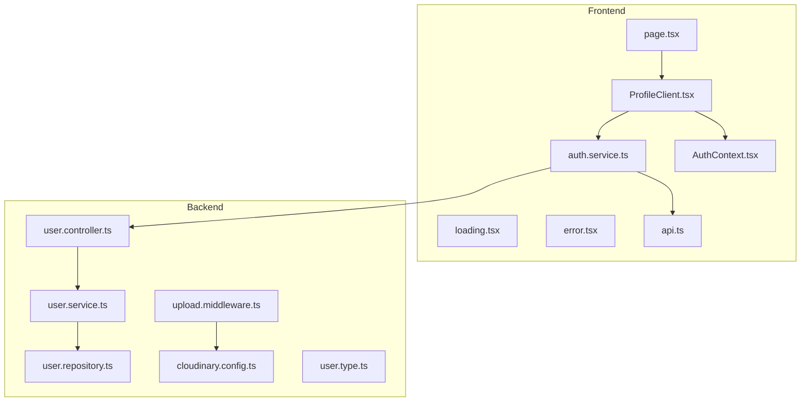
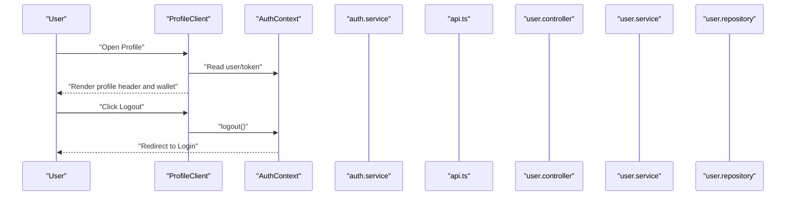
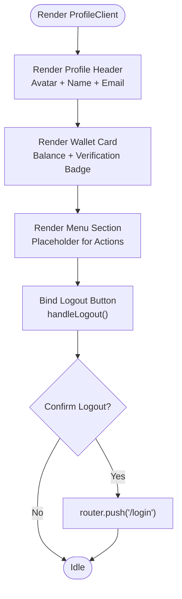
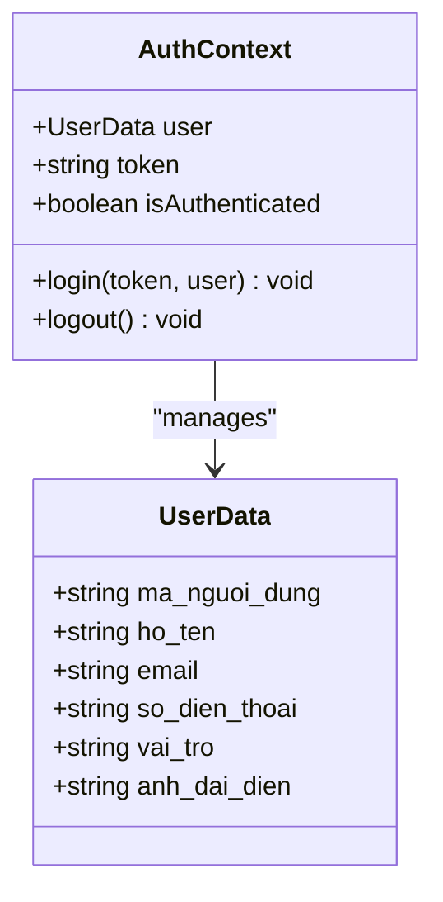
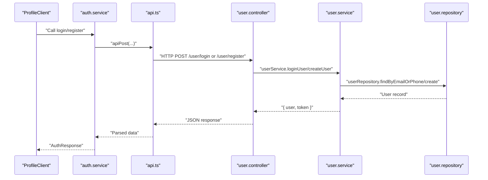
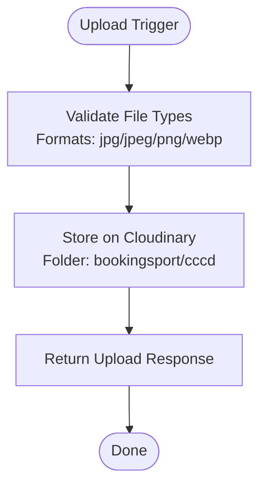
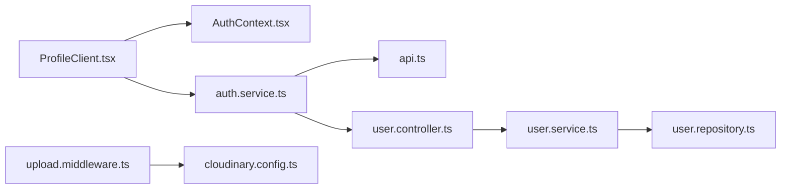

# Profile Management UI

<cite>
**Referenced Files in This Document**
- [ProfileClient.tsx](file://frontend/src/components/profile/ProfileClient.tsx)
- [page.tsx](file://frontend/src/app/(user)/profile/page.tsx)
- [loading.tsx](file://frontend/src/app/(user)/profile/loading.tsx)
- [error.tsx](file://frontend/src/app/(user)/profile/error.tsx)
- [api.ts](file://frontend/src/services/api.ts)
- [auth.service.ts](file://frontend/src/services/auth.service.ts)
- [AuthContext.tsx](file://frontend/src/contexts/AuthContext.tsx)
- [user.controller.ts](file://backend/src/controllers/user.controller.ts)
- [user.service.ts](file://backend/src/services/user.service.ts)
- [user.repository.ts](file://backend/src/repositories/user.repository.ts)
- [cloudinary.config.ts](file://backend/src/config/cloudinary.config.ts)
- [upload.middleware.ts](file://backend/src/middlewares/upload.middleware.ts)
- [user.type.ts](file://backend/src/types/user.type.ts)
</cite>

## Table of Contents
1. [Introduction](#introduction)
2. [Project Structure](#project-structure)
3. [Core Components](#core-components)
4. [Architecture Overview](#architecture-overview)
5. [Detailed Component Analysis](#detailed-component-analysis)
6. [Dependency Analysis](#dependency-analysis)
7. [Performance Considerations](#performance-considerations)
8. [Troubleshooting Guide](#troubleshooting-guide)
9. [Conclusion](#conclusion)
10. [Appendices](#appendices)

## Introduction
This document provides comprehensive documentation for the user profile management interface components. It focuses on the ProfileClient component responsible for displaying user profile information, managing personal details, wallet balance visualization, and logout actions. It also explains the underlying data flow, authentication integration, and how profile-related data is persisted and retrieved. The guide covers responsive layouts, error handling, and practical examples for integrating profile updates and avatar uploads.

## Project Structure
The profile management UI is organized around a dedicated client-side component and supporting pages for loading and error states. The frontend communicates with backend APIs through a unified service layer, while authentication state is managed centrally.

**Diagram sources**
- [ProfileClient.tsx:1-125](file://frontend/src/components/profile/ProfileClient.tsx#L1-L125)
- [page.tsx:1-11](file://frontend/src/app/(user)/profile/page.tsx#L1-L11)
- [loading.tsx:1-26](file://frontend/src/app/(user)/profile/loading.tsx#L1-L26)
- [error.tsx:1-29](file://frontend/src/app/(user)/profile/error.tsx#L1-L29)
- [auth.service.ts:1-36](file://frontend/src/services/auth.service.ts#L1-L36)
- [api.ts:1-78](file://frontend/src/services/api.ts#L1-L78)
- [AuthContext.tsx:1-83](file://frontend/src/contexts/AuthContext.tsx#L1-L83)
- [user.controller.ts:1-14](file://backend/src/controllers/user.controller.ts#L1-L14)
- [user.service.ts:1-69](file://backend/src/services/user.service.ts#L1-L69)
- [user.repository.ts:1-53](file://backend/src/repositories/user.repository.ts#L1-L53)
- [upload.middleware.ts:1-19](file://backend/src/middlewares/upload.middleware.ts#L1-L19)
- [cloudinary.config.ts:1-13](file://backend/src/config/cloudinary.config.ts#L1-L13)
- [user.type.ts:1-13](file://backend/src/types/user.type.ts#L1-L13)

**Section sources**
- [ProfileClient.tsx:1-125](file://frontend/src/components/profile/ProfileClient.tsx#L1-L125)
- [page.tsx:1-11](file://frontend/src/app/(user)/profile/page.tsx#L1-L11)
- [loading.tsx:1-26](file://frontend/src/app/(user)/profile/loading.tsx#L1-L26)
- [error.tsx:1-29](file://frontend/src/app/(user)/profile/error.tsx#L1-L29)

## Core Components
- ProfileClient: Renders the user profile header with avatar, name, email, and action buttons; displays wallet balance; and provides logout functionality.
- Profile Page: Wraps the client component and sets metadata.
- Loading/Error Pages: Provide fallback UI during profile data loading and error scenarios.
- Authentication Context: Manages user session and token lifecycle.
- API Services: Encapsulate HTTP requests and response handling.
- Backend Controllers/Services/Repositories: Implement user registration and login flows, and manage data persistence.

Key responsibilities:
- ProfileClient handles UI rendering and user interactions (logout).
- AuthContext persists and exposes user data and token.
- API services centralize HTTP communication with the backend.
- Backend services coordinate validation, hashing, and persistence.

**Section sources**
- [ProfileClient.tsx:6-125](file://frontend/src/components/profile/ProfileClient.tsx#L6-L125)
- [page.tsx:8-10](file://frontend/src/app/(user)/profile/page.tsx#L8-L10)
- [AuthContext.tsx:26-83](file://frontend/src/contexts/AuthContext.tsx#L26-L83)
- [api.ts:19-78](file://frontend/src/services/api.ts#L19-L78)
- [user.controller.ts:7-14](file://backend/src/controllers/user.controller.ts#L7-L14)
- [user.service.ts:8-65](file://backend/src/services/user.service.ts#L8-L65)
- [user.repository.ts:4-49](file://backend/src/repositories/user.repository.ts#L4-L49)

## Architecture Overview
The profile UI integrates with the authentication context and API services to present user data and enable actions like logout. Backend endpoints support user registration and login, while file upload middleware and Cloudinary configuration facilitate avatar and identity document uploads.

**Diagram sources**
- [ProfileClient.tsx:9-13](file://frontend/src/components/profile/ProfileClient.tsx#L9-L13)
- [AuthContext.tsx:53-59](file://frontend/src/contexts/AuthContext.tsx#L53-L59)

## Detailed Component Analysis

### ProfileClient Component
Responsibilities:
- Render profile header with avatar placeholder and user details.
- Display wallet balance card with verification indicator.
- Provide logout action integrated with authentication context.
- Maintain responsive layout using Tailwind classes.

Notable behaviors:
- Uses Next.js Image for avatar rendering.
- Implements confirm dialog before logout.
- Applies dark mode-aware styling and gradients for visual polish.

**Diagram sources**
- [ProfileClient.tsx:15-125](file://frontend/src/components/profile/ProfileClient.tsx#L15-L125)

**Section sources**
- [ProfileClient.tsx:6-125](file://frontend/src/components/profile/ProfileClient.tsx#L6-L125)

### Profile Page Wrapper
Responsibilities:
- Set metadata for SEO and browser tab.
- Render the ProfileClient component.

**Section sources**
- [page.tsx:3-10](file://frontend/src/app/(user)/profile/page.tsx#L3-L10)

### Loading and Error States
- Loading skeleton: Provides animated placeholders for avatar, wallet, and menu items.
- Error UI: Displays a friendly message and a retry button when profile data fails to load.

**Section sources**
- [loading.tsx:1-26](file://frontend/src/app/(user)/profile/loading.tsx#L1-L26)
- [error.tsx:1-29](file://frontend/src/app/(user)/profile/error.tsx#L1-L29)

### Authentication Context and Data Binding
- Stores user data and token in localStorage.
- Exposes login/logout functions and an isAuthenticated flag.
- Integrates with ProfileClient to read current user/session state.

**Diagram sources**
- [AuthContext.tsx:6-22](file://frontend/src/contexts/AuthContext.tsx#L6-L22)
- [AuthContext.tsx:26-83](file://frontend/src/contexts/AuthContext.tsx#L26-L83)

**Section sources**
- [AuthContext.tsx:26-83](file://frontend/src/contexts/AuthContext.tsx#L26-L83)

### API Layer and Backend Integration
- Unified HTTP helpers encapsulate GET/POST/PUT/PATCH with optional JSON or multipart/form-data.
- Authentication headers are automatically attached when a token is present.
- Frontend services construct request bodies and call backend endpoints.

**Diagram sources**
- [auth.service.ts:5-20](file://frontend/src/services/auth.service.ts#L5-L20)
- [api.ts:19-59](file://frontend/src/services/api.ts#L19-L59)
- [user.controller.ts:7-14](file://backend/src/controllers/user.controller.ts#L7-L14)
- [user.service.ts:8-65](file://backend/src/services/user.service.ts#L8-L65)
- [user.repository.ts:10-34](file://backend/src/repositories/user.repository.ts#L10-L34)

**Section sources**
- [api.ts:19-78](file://frontend/src/services/api.ts#L19-L78)
- [auth.service.ts:1-36](file://frontend/src/services/auth.service.ts#L1-L36)
- [user.controller.ts:7-14](file://backend/src/controllers/user.controller.ts#L7-L14)
- [user.service.ts:8-65](file://backend/src/services/user.service.ts#L8-L65)
- [user.repository.ts:10-34](file://backend/src/repositories/user.repository.ts#L10-L34)

### File Upload Handling (Avatar and Identity Documents)
- Cloudinary configuration defines credentials and bucket-like folder structure.
- Multer-based upload middleware supports:
  - Identity document uploads (front/back images) for owner registration.
  - Optional: Extend similar patterns for user avatar uploads if needed.
- Allowed formats and folder constraints are enforced by the middleware.

**Diagram sources**
- [cloudinary.config.ts:6-10](file://backend/src/config/cloudinary.config.ts#L6-L10)
- [upload.middleware.ts:5-16](file://backend/src/middlewares/upload.middleware.ts#L5-L16)

**Section sources**
- [cloudinary.config.ts:1-13](file://backend/src/config/cloudinary.config.ts#L1-L13)
- [upload.middleware.ts:1-19](file://backend/src/middlewares/upload.middleware.ts#L1-L19)

### Personal Information Management
- Current profile UI displays static user details (name, email).
- To enable editing, integrate form fields bound to user data and call appropriate backend endpoints (e.g., PATCH/PUT) via API services.
- Validation patterns should mirror existing request structures and error handling.

[No sources needed since this section provides general guidance]

### Profile Update Workflows and Data Persistence
- Registration/Login flows are implemented in backend services and controllers.
- Data persistence uses Prisma repository methods with bcrypt hashing for passwords.
- Token generation ensures secure session management.

**Section sources**
- [user.service.ts:8-65](file://backend/src/services/user.service.ts#L8-L65)
- [user.repository.ts:22-49](file://backend/src/repositories/user.repository.ts#L22-L49)
- [user.type.ts:1-13](file://backend/src/types/user.type.ts#L1-L13)

### Responsive Form Layouts and Styling
- ProfileClient uses Tailwind classes for responsive spacing, typography, and dark mode compatibility.
- Apply similar patterns when adding editable forms for profile updates.

**Section sources**
- [ProfileClient.tsx:16-48](file://frontend/src/components/profile/ProfileClient.tsx#L16-L48)

### Error Handling for Profile Modifications
- Frontend error UI provides a clear message and a retry mechanism.
- API helpers throw errors on non-OK responses, enabling centralized error handling.

**Section sources**
- [error.tsx:10-28](file://frontend/src/app/(user)/profile/error.tsx#L10-L28)
- [api.ts:11-17](file://frontend/src/services/api.ts#L11-L17)

### Examples and Best Practices
- Profile data binding: Use AuthContext to read and update user state.
- Avatar upload integration: Follow the existing multipart/form-data pattern used by owner registration.
- User preference management: Persist preferences in localStorage or backend as appropriate.

**Section sources**
- [AuthContext.tsx:26-83](file://frontend/src/contexts/AuthContext.tsx#L26-L83)
- [auth.service.ts:22-34](file://frontend/src/services/auth.service.ts#L22-L34)

## Dependency Analysis
The profile UI depends on:
- Authentication context for user/session state.
- API services for HTTP communication.
- Backend controllers/services for data operations.
- Upload middleware and Cloudinary for media handling.

**Diagram sources**
- [ProfileClient.tsx:1-125](file://frontend/src/components/profile/ProfileClient.tsx#L1-L125)
- [AuthContext.tsx:1-83](file://frontend/src/contexts/AuthContext.tsx#L1-L83)
- [auth.service.ts:1-36](file://frontend/src/services/auth.service.ts#L1-L36)
- [api.ts:1-78](file://frontend/src/services/api.ts#L1-L78)
- [user.controller.ts:1-14](file://backend/src/controllers/user.controller.ts#L1-L14)
- [user.service.ts:1-69](file://backend/src/services/user.service.ts#L1-L69)
- [user.repository.ts:1-53](file://backend/src/repositories/user.repository.ts#L1-L53)
- [upload.middleware.ts:1-19](file://backend/src/middlewares/upload.middleware.ts#L1-L19)
- [cloudinary.config.ts:1-13](file://backend/src/config/cloudinary.config.ts#L1-L13)

**Section sources**
- [ProfileClient.tsx:1-125](file://frontend/src/components/profile/ProfileClient.tsx#L1-L125)
- [AuthContext.tsx:1-83](file://frontend/src/contexts/AuthContext.tsx#L1-L83)
- [api.ts:1-78](file://frontend/src/services/api.ts#L1-L78)
- [user.controller.ts:1-14](file://backend/src/controllers/user.controller.ts#L1-L14)
- [user.service.ts:1-69](file://backend/src/services/user.service.ts#L1-L69)
- [user.repository.ts:1-53](file://backend/src/repositories/user.repository.ts#L1-L53)
- [upload.middleware.ts:1-19](file://backend/src/middlewares/upload.middleware.ts#L1-L19)
- [cloudinary.config.ts:1-13](file://backend/src/config/cloudinary.config.ts#L1-L13)

## Performance Considerations
- Minimize re-renders by keeping profile data in context/state and avoiding unnecessary props drilling.
- Use skeleton loaders for improved perceived performance during data fetches.
- Optimize image sizes and leverage lazy loading for avatars and wallet backgrounds.

[No sources needed since this section provides general guidance]

## Troubleshooting Guide
Common issues and resolutions:
- Profile not loading: Verify authentication token and user data in localStorage; check network requests and error UI.
- Logout not working: Ensure AuthContext logout clears localStorage and redirects to the login route.
- Upload failures: Confirm Cloudinary credentials and allowed formats; validate multipart/form-data construction.

**Section sources**
- [AuthContext.tsx:53-59](file://frontend/src/contexts/AuthContext.tsx#L53-L59)
- [error.tsx:10-28](file://frontend/src/app/(user)/profile/error.tsx#L10-L28)
- [cloudinary.config.ts:6-10](file://backend/src/config/cloudinary.config.ts#L6-L10)

## Conclusion
The profile management UI is a focused, responsive component that integrates with authentication and API layers to deliver a polished user experience. While the current implementation emphasizes display and logout, extending it to support profile edits, avatar uploads, and preference management follows established patterns in the codebase. Backend services and middleware provide robust foundations for data validation, persistence, and media handling.

## Appendices
- Example references for extending profile editing:
  - [auth.service.ts:5-20](file://frontend/src/services/auth.service.ts#L5-L20)
  - [api.ts:45-59](file://frontend/src/services/api.ts#L45-L59)
  - [user.controller.ts:7-14](file://backend/src/controllers/user.controller.ts#L7-L14)
  - [upload.middleware.ts:5-16](file://backend/src/middlewares/upload.middleware.ts#L5-L16)