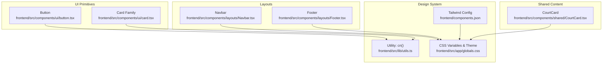
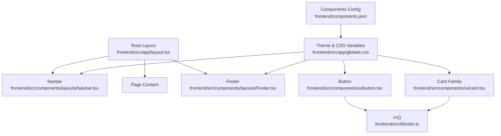
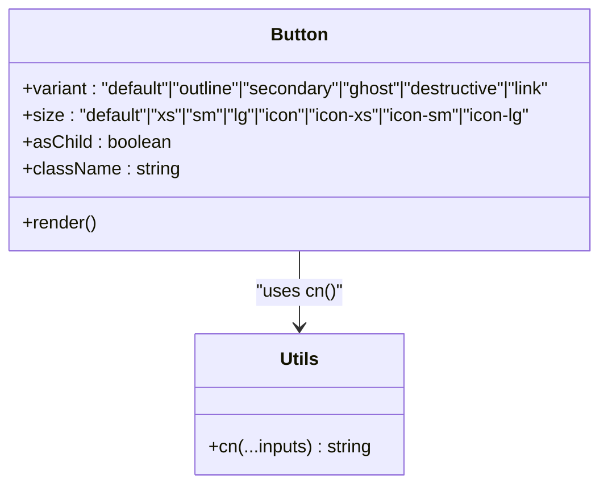
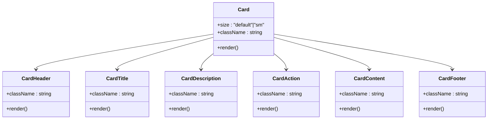
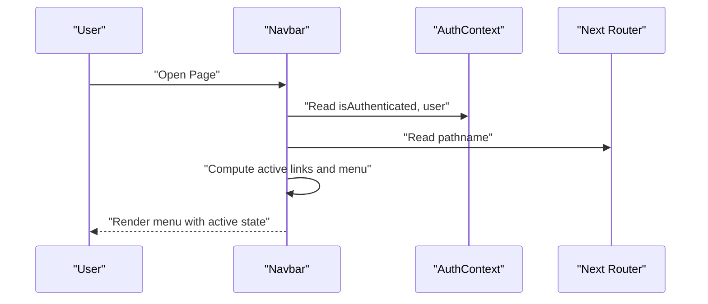
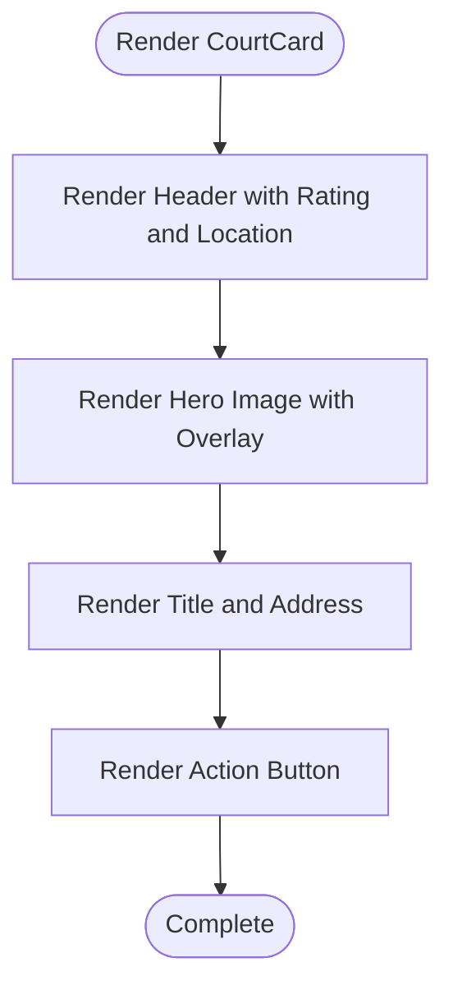
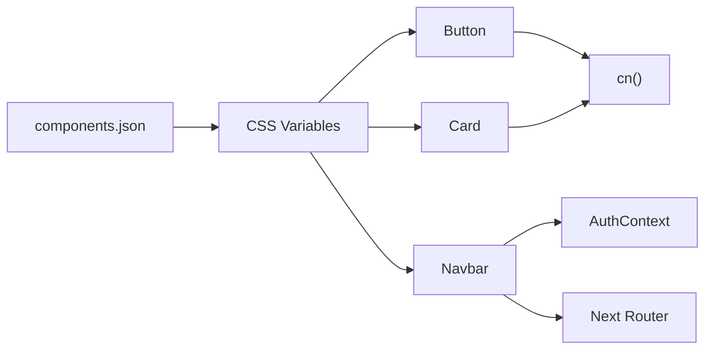

# Shared UI Components

<cite>
**Referenced Files in This Document**
- [button.tsx](file://frontend/src/components/ui/button.tsx)
- [card.tsx](file://frontend/src/components/ui/card.tsx)
- [Navbar.tsx](file://frontend/src/components/layouts/Navbar.tsx)
- [Footer.tsx](file://frontend/src/components/layouts/Footer.tsx)
- [CourtCard.tsx](file://frontend/src/components/shared/CourtCard.tsx)
- [utils.ts](file://frontend/src/lib/utils.ts)
- [components.json](file://frontend/components.json)
- [globals.css](file://frontend/src/app/globals.css)
- [layout.tsx](file://frontend/src/app/layout.tsx)
</cite>

## Table of Contents
1. [Introduction](#introduction)
2. [Project Structure](#project-structure)
3. [Core Components](#core-components)
4. [Architecture Overview](#architecture-overview)
5. [Detailed Component Analysis](#detailed-component-analysis)
6. [Dependency Analysis](#dependency-analysis)
7. [Performance Considerations](#performance-considerations)
8. [Troubleshooting Guide](#troubleshooting-guide)
9. [Conclusion](#conclusion)
10. [Appendices](#appendices)

## Introduction
This document describes the shared UI components and layout elements used across the application. It focuses on:
- Button component with variant styles and interactive states
- Card component family for content presentation
- Layout components including Navbar and Footer
It explains component props, styling variants, accessibility features, responsive behavior, design system integration, theme customization, composition patterns, and extension guidelines.

## Project Structure
Reusable UI components live under the frontend/src/components directory, organized by domain and shared UI:
- Shared UI primitives: frontend/src/components/ui
- Layouts: frontend/src/components/layouts
- Shared content cards: frontend/src/components/shared

Design system integration is configured via Tailwind CSS, shadcn/radix-nova style, and CSS variables for theming.

**Diagram sources**
- [button.tsx:1-68](file://frontend/src/components/ui/button.tsx#L1-L68)
- [card.tsx:1-104](file://frontend/src/components/ui/card.tsx#L1-L104)
- [Navbar.tsx:1-119](file://frontend/src/components/layouts/Navbar.tsx#L1-L119)
- [Footer.tsx:1-20](file://frontend/src/components/layouts/Footer.tsx#L1-L20)
- [CourtCard.tsx:1-73](file://frontend/src/components/shared/CourtCard.tsx#L1-L73)
- [utils.ts:1-7](file://frontend/src/lib/utils.ts#L1-L7)
- [components.json:1-26](file://frontend/components.json#L1-L26)
- [globals.css:1-130](file://frontend/src/app/globals.css#L1-L130)

**Section sources**
- [button.tsx:1-68](file://frontend/src/components/ui/button.tsx#L1-L68)
- [card.tsx:1-104](file://frontend/src/components/ui/card.tsx#L1-L104)
- [Navbar.tsx:1-119](file://frontend/src/components/layouts/Navbar.tsx#L1-L119)
- [Footer.tsx:1-20](file://frontend/src/components/layouts/Footer.tsx#L1-L20)
- [CourtCard.tsx:1-73](file://frontend/src/components/shared/CourtCard.tsx#L1-L73)
- [utils.ts:1-7](file://frontend/src/lib/utils.ts#L1-L7)
- [components.json:1-26](file://frontend/components.json#L1-L26)
- [globals.css:1-130](file://frontend/src/app/globals.css#L1-L130)

## Core Components
This section documents the primary reusable components and their capabilities.

### Button
- Purpose: Unified control element with variant and size variants, accessible states, and semantic support for icons and child elements.
- Props:
  - className: Optional additional classes
  - variant: One of default, outline, secondary, ghost, destructive, link
  - size: One of default, xs, sm, lg, icon, icon-xs, icon-sm, icon-lg
  - asChild: Render as a slot wrapper for composition
  - Additional button attributes: disabled, type, form-related props, event handlers
- Interactive states and accessibility:
  - Focus-visible ring and border highlighting
  - Hover, active, disabled, invalid states handled via variants and data attributes
  - Supports nested SVG icons sized appropriately
- Composition pattern:
  - asChild leverages Radix Slot to wrap links, spans, or other elements while preserving semantics
- Styling variants:
  - Uses class-variance-authority (cva) to compose base classes with variant-specific classes
  - Integrates with theme tokens (primary, secondary, destructive, muted, etc.) and CSS variables
- Responsive behavior:
  - Size variants adjust height, padding, and icon sizing; responsive-friendly defaults
- Usage examples (paths):
  - [Navbar.tsx:105-110](file://frontend/src/components/layouts/Navbar.tsx#L105-L110) uses the button as a sign-up CTA
  - [DetailCard.tsx:50-55](file://frontend/src/components/map/DetailCard.tsx#L50-L55) uses the button for booking action

**Section sources**
- [button.tsx:7-42](file://frontend/src/components/ui/button.tsx#L7-L42)
- [button.tsx:44-65](file://frontend/src/components/ui/button.tsx#L44-L65)
- [Navbar.tsx:105-110](file://frontend/src/components/layouts/Navbar.tsx#L105-L110)
- [DetailCard.tsx:50-55](file://frontend/src/components/map/DetailCard.tsx#L50-L55)

### Card Family
- Purpose: Structured content containers with header, title, description, content, action, and footer slots.
- Props:
  - Card: className, size (default | sm)
  - CardHeader/CardTitle/CardDescription/CardAction/CardContent/CardFooter: className
- Slots and composition:
  - Uses data-slot attributes to enable CSS targeting and conditional layouts
  - Supports nested images with automatic rounded corners on first/last image
  - Footer presence adjusts inner spacing
- Variants:
  - size="sm" reduces gaps and paddings for compact layouts
- Accessibility:
  - Semantic grouping via div elements; no ARIA roles required beyond standard HTML
- Responsive behavior:
  - Adapts spacing and typography based on size and presence of action/description
- Usage examples (paths):
  - [CourtCard.tsx:24-70](file://frontend/src/components/shared/CourtCard.tsx#L24-L70) composes Card with images and actions
  - [DetailCard.tsx:12-59](file://frontend/src/components/map/DetailCard.tsx#L12-L59) composes Card for map detail panel

**Section sources**
- [card.tsx:5-21](file://frontend/src/components/ui/card.tsx#L5-L21)
- [card.tsx:23-34](file://frontend/src/components/ui/card.tsx#L23-L34)
- [card.tsx:36-47](file://frontend/src/components/ui/card.tsx#L36-L47)
- [card.tsx:49-57](file://frontend/src/components/ui/card.tsx#L49-L57)
- [card.tsx:59-69](file://frontend/src/components/ui/card.tsx#L59-L69)
- [card.tsx:72-80](file://frontend/src/components/ui/card.tsx#L72-L80)
- [card.tsx:82-93](file://frontend/src/components/ui/card.tsx#L82-L93)
- [CourtCard.tsx:24-70](file://frontend/src/components/shared/CourtCard.tsx#L24-L70)
- [DetailCard.tsx:12-59](file://frontend/src/components/map/DetailCard.tsx#L12-L59)

### Navbar
- Purpose: Top navigation bar with logo, desktop menu, and authentication controls.
- Features:
  - Dynamic menu items based on authentication and user role
  - Active link highlighting using Next.js pathname
  - Avatar with fallback avatar/icon
  - Responsive behavior: mobile menu hidden, desktop menu visible on medium screens and up
- Accessibility:
  - Uses semantic links and buttons
  - Focus styles applied via theme
- Styling and theme:
  - Backdrop blur, sticky positioning, and dark mode-aware colors
- Usage examples (paths):
  - [layout.tsx:28-47](file://frontend/src/app/layout.tsx#L28-L47) wraps pages with Navbar

**Section sources**
- [Navbar.tsx:9-36](file://frontend/src/components/layouts/Navbar.tsx#L9-L36)
- [Navbar.tsx:37-118](file://frontend/src/components/layouts/Navbar.tsx#L37-L118)
- [layout.tsx:28-47](file://frontend/src/app/layout.tsx#L28-L47)

### Footer
- Purpose: Persistent footer with social links and copyright.
- Features:
  - Social media links
  - Copyright text with current year
- Styling and theme:
  - Dark mode-aware background and text colors

**Section sources**
- [Footer.tsx:1-20](file://frontend/src/components/layouts/Footer.tsx#L1-L20)

## Architecture Overview
The UI system integrates:
- Design system configuration: radix-nova style, CSS variables, and Tailwind
- Utility functions: cn() merges and deduplicates classes
- Theming: CSS variables define primary, secondary, destructive, card, foreground, background, and radii
- Layouts: Navbar and Footer provide global scaffolding

**Diagram sources**
- [layout.tsx:28-47](file://frontend/src/app/layout.tsx#L28-L47)
- [Navbar.tsx:1-119](file://frontend/src/components/layouts/Navbar.tsx#L1-L119)
- [Footer.tsx:1-20](file://frontend/src/components/layouts/Footer.tsx#L1-L20)
- [button.tsx:1-68](file://frontend/src/components/ui/button.tsx#L1-L68)
- [card.tsx:1-104](file://frontend/src/components/ui/card.tsx#L1-L104)
- [utils.ts:1-7](file://frontend/src/lib/utils.ts#L1-L7)
- [globals.css:1-130](file://frontend/src/app/globals.css#L1-L130)
- [components.json:1-26](file://frontend/components.json#L1-L26)

## Detailed Component Analysis

### Button Component Analysis
- Implementation pattern:
  - Base classes and variant rules defined via cva
  - Conditional rendering via asChild to support composition
  - Data attributes for slot and variant enable targeted styling
- Data structures and complexity:
  - O(1) render cost per button; variant computation is constant-time
- Dependencies:
  - class-variance-authority for variants
  - Radix Slot for composition
  - cn() for class merging
- Accessibility:
  - Focus-visible ring and border highlight
  - Disabled state prevents interactions
  - Invalid state styling via aria-invalid
- Performance:
  - Minimal DOM nodes; efficient class composition

**Diagram sources**
- [button.tsx:44-65](file://frontend/src/components/ui/button.tsx#L44-L65)
- [utils.ts:4-6](file://frontend/src/lib/utils.ts#L4-L6)

**Section sources**
- [button.tsx:7-42](file://frontend/src/components/ui/button.tsx#L7-L42)
- [button.tsx:44-65](file://frontend/src/components/ui/button.tsx#L44-L65)
- [utils.ts:1-7](file://frontend/src/lib/utils.ts#L1-L7)

### Card Component Family Analysis
- Implementation pattern:
  - Multiple small components composing a cohesive card container
  - Data attributes drive conditional layouts and spacing
- Data structures and complexity:
  - O(1) per slot; layout complexity depends on children count
- Dependencies:
  - cn() for class merging
- Accessibility:
  - Semantic grouping via divs; no extra ARIA roles
- Performance:
  - Lightweight wrappers; minimal reflow risk

**Diagram sources**
- [card.tsx:5-21](file://frontend/src/components/ui/card.tsx#L5-L21)
- [card.tsx:23-34](file://frontend/src/components/ui/card.tsx#L23-L34)
- [card.tsx:36-47](file://frontend/src/components/ui/card.tsx#L36-L47)
- [card.tsx:49-57](file://frontend/src/components/ui/card.tsx#L49-L57)
- [card.tsx:59-69](file://frontend/src/components/ui/card.tsx#L59-L69)
- [card.tsx:72-80](file://frontend/src/components/ui/card.tsx#L72-L80)
- [card.tsx:82-93](file://frontend/src/components/ui/card.tsx#L82-L93)

**Section sources**
- [card.tsx:1-104](file://frontend/src/components/ui/card.tsx#L1-L104)

### Navbar Component Analysis
- Implementation pattern:
  - Client-side navigation with Next.js hooks
  - Conditional rendering based on authentication and user role
  - Dynamic active link detection
- Data structures and complexity:
  - O(n) over nav links; negligible runtime cost
- Dependencies:
  - Auth context for user state
  - Next.js router for pathname
- Accessibility:
  - Semantic links and buttons; focus styles inherited from theme
- Performance:
  - Mount guard to avoid hydration mismatch
  - Minimal re-renders via memoized link list

**Diagram sources**
- [Navbar.tsx:9-36](file://frontend/src/components/layouts/Navbar.tsx#L9-L36)
- [layout.tsx:28-47](file://frontend/src/app/layout.tsx#L28-L47)

**Section sources**
- [Navbar.tsx:1-119](file://frontend/src/components/layouts/Navbar.tsx#L1-L119)

### Footer Component Analysis
- Implementation pattern:
  - Stateless functional component with static content
- Data structures and complexity:
  - O(1) rendering cost
- Dependencies:
  - None external
- Accessibility:
  - Links without special roles; readable text

**Section sources**
- [Footer.tsx:1-20](file://frontend/src/components/layouts/Footer.tsx#L1-L20)

### Content Card Composition Example
- Composition pattern:
  - Shared content card composes Card, images, and actions
- Data structures and complexity:
  - O(1) per card; image optimization via Next/Image
- Dependencies:
  - Next/Image for optimized images
  - Link for navigation

**Diagram sources**
- [CourtCard.tsx:16-72](file://frontend/src/components/shared/CourtCard.tsx#L16-L72)

**Section sources**
- [CourtCard.tsx:1-73](file://frontend/src/components/shared/CourtCard.tsx#L1-L73)

## Dependency Analysis
- Internal dependencies:
  - UI components depend on cn() for class merging
  - Navbar depends on AuthContext and Next router
  - Theme tokens are centralized in CSS variables
- External dependencies:
  - class-variance-authority for variants
  - Radix Slot for composition
  - Tailwind CSS and shadcn configuration

**Diagram sources**
- [button.tsx:1-6](file://frontend/src/components/ui/button.tsx#L1-L6)
- [card.tsx:1-4](file://frontend/src/components/ui/card.tsx#L1-L4)
- [Navbar.tsx:4-6](file://frontend/src/components/layouts/Navbar.tsx#L4-L6)
- [utils.ts:4-6](file://frontend/src/lib/utils.ts#L4-L6)
- [components.json:1-26](file://frontend/components.json#L1-L26)
- [globals.css:1-130](file://frontend/src/app/globals.css#L1-L130)

**Section sources**
- [button.tsx:1-6](file://frontend/src/components/ui/button.tsx#L1-L6)
- [card.tsx:1-4](file://frontend/src/components/ui/card.tsx#L1-L4)
- [Navbar.tsx:4-6](file://frontend/src/components/layouts/Navbar.tsx#L4-L6)
- [utils.ts:1-7](file://frontend/src/lib/utils.ts#L1-L7)
- [components.json:1-26](file://frontend/components.json#L1-L26)
- [globals.css:1-130](file://frontend/src/app/globals.css#L1-L130)

## Performance Considerations
- Prefer variant and size props over ad-hoc classes to keep styles predictable and cacheable.
- Use asChild for composition to avoid unnecessary DOM wrappers.
- Leverage CSS variables for theme updates without rebuilding components.
- Keep Card content minimal to reduce layout thrashing.
- Use Next/Image for optimized images in content cards.

## Troubleshooting Guide
- Button does not reflect variant:
  - Ensure variant and size are passed and not overridden by className.
  - Verify data-slot and data-variant attributes are present for styling hooks.
- Button icon sizing incorrect:
  - Icons without explicit size classes inherit a default size; ensure proper icon sizing classes.
- Card layout broken:
  - Confirm data-slot attributes match expectations and size prop is set consistently.
  - Avoid conflicting margins/padding on children.
- Navbar active link not highlighted:
  - Check pathname matching logic and ensure route alignment.
- Theme not updating:
  - Confirm CSS variables are defined and Tailwind is configured to use them.

**Section sources**
- [button.tsx:56-64](file://frontend/src/components/ui/button.tsx#L56-L64)
- [card.tsx:10-19](file://frontend/src/components/ui/card.tsx#L10-L19)
- [Navbar.tsx:50-65](file://frontend/src/components/layouts/Navbar.tsx#L50-L65)
- [globals.css:51-118](file://frontend/src/app/globals.css#L51-L118)

## Conclusion
The shared UI components provide a consistent, theme-aware, and accessible foundation for the application. By leveraging variants, slots, and CSS variables, components remain flexible and maintainable. The Navbar and Footer offer robust layout scaffolding, while the Button and Card families support diverse content and interaction patterns.

## Appendices

### Design System Integration and Theme Customization
- Style framework: radix-nova
- Tailwind configuration: CSS variables enabled, base color neutral
- Theme tokens: primary, secondary, destructive, card, foreground, background, border, input, ring, radii
- Global CSS variables define light and dark modes

**Section sources**
- [components.json:3-12](file://frontend/components.json#L3-L12)
- [globals.css:7-49](file://frontend/src/app/globals.css#L7-L49)
- [globals.css:51-118](file://frontend/src/app/globals.css#L51-L118)

### Component Composition Patterns
- Use asChild to wrap links or spans with Button semantics.
- Compose Card with CardHeader, CardTitle, CardDescription, CardAction, CardContent, and CardFooter for structured layouts.
- Pass size="sm" for compact presentations.

**Section sources**
- [button.tsx:54-54](file://frontend/src/components/ui/button.tsx#L54-L54)
- [card.tsx:23-34](file://frontend/src/components/ui/card.tsx#L23-L34)
- [card.tsx:82-93](file://frontend/src/components/ui/card.tsx#L82-L93)