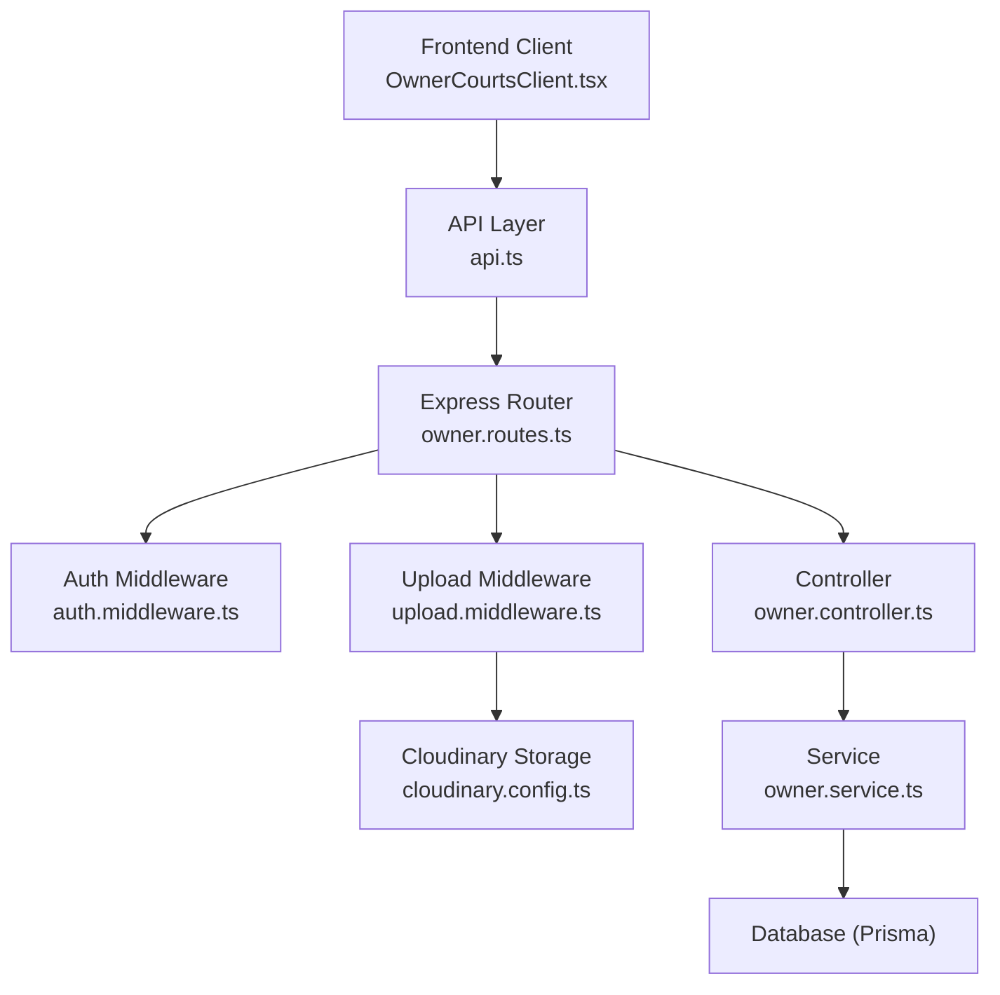
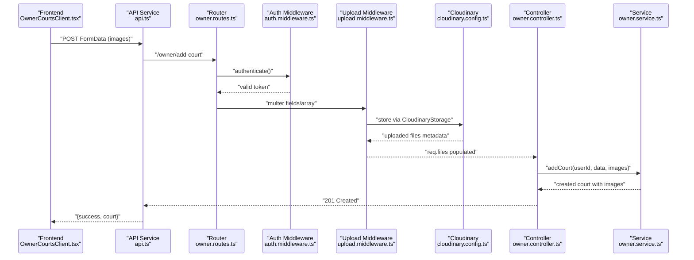
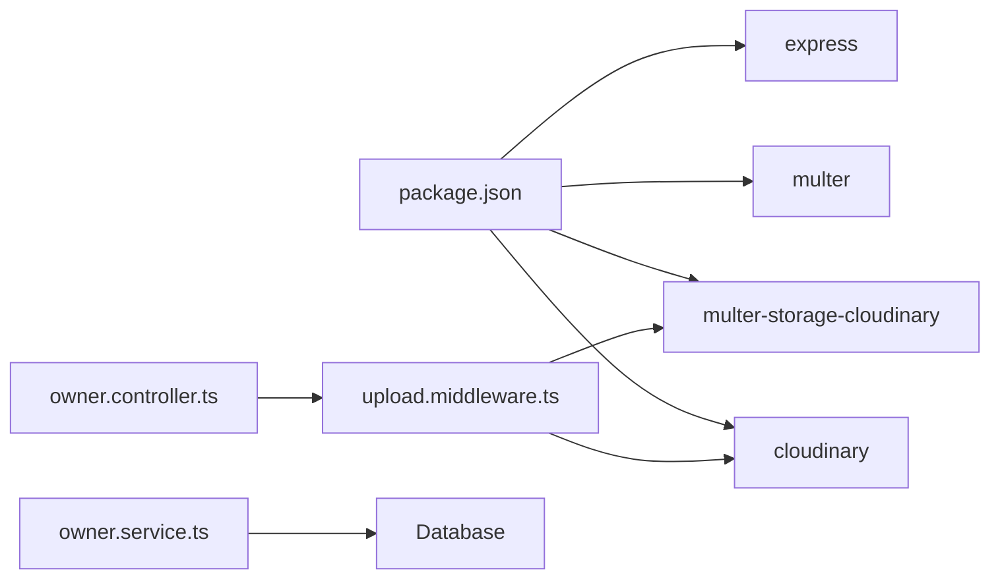

# File Upload & Cloud Storage

<cite>
**Referenced Files in This Document**
- [cloudinary.config.ts](file://backend/src/config/cloudinary.config.ts)
- [upload.middleware.ts](file://backend/src/middlewares/upload.middleware.ts)
- [errorHandler.ts](file://backend/src/middlewares/errorHandler.ts)
- [ApiError.ts](file://backend/src/utils/ApiError.ts)
- [auth.middleware.ts](file://backend/src/middlewares/auth.middleware.ts)
- [owner.controller.ts](file://backend/src/controllers/owner.controller.ts)
- [owner.service.ts](file://backend/src/services/owner.service.ts)
- [owner.routes.ts](file://backend/src/routers/owner.routes.ts)
- [court.service.ts](file://frontend/src/services/court.service.ts)
- [OwnerCourtsClient.tsx](file://frontend/src/components/owner/OwnerCourtsClient.tsx)
- [api.ts](file://frontend/src/services/api.ts)
- [package.json](file://backend/package.json)
</cite>

## Table of Contents
1. [Introduction](#introduction)
2. [Project Structure](#project-structure)
3. [Core Components](#core-components)
4. [Architecture Overview](#architecture-overview)
5. [Detailed Component Analysis](#detailed-component-analysis)
6. [Dependency Analysis](#dependency-analysis)
7. [Performance Considerations](#performance-considerations)
8. [Troubleshooting Guide](#troubleshooting-guide)
9. [Conclusion](#conclusion)
10. [Appendices](#appendices)

## Introduction
This document explains the file upload and cloud storage implementation for the application, focusing on Cloudinary integration, image optimization, and file management strategies. It covers upload middleware, validation rules, security considerations, storage optimization, CDN integration, responsive image generation, progress tracking, error handling, cleanup procedures, and best practices for file naming and organization.

## Project Structure
The file upload pipeline spans the frontend and backend:
- Frontend collects images via HTML forms and sends multipart/form-data to the backend.
- Backend routes validate authentication, applies Cloudinary-backed multer storage, and persists metadata to the database.
- Cloudinary stores the uploaded assets and returns asset identifiers used for retrieval and transformations.

**Diagram sources**
- [OwnerCourtsClient.tsx](file://frontend/src/components/owner/OwnerCourtsClient.tsx)
- [api.ts](file://frontend/src/services/api.ts)
- [owner.routes.ts](file://backend/src/routers/owner.routes.ts)
- [auth.middleware.ts](file://backend/src/middlewares/auth.middleware.ts)
- [upload.middleware.ts](file://backend/src/middlewares/upload.middleware.ts)
- [cloudinary.config.ts](file://backend/src/config/cloudinary.config.ts)
- [owner.controller.ts](file://backend/src/controllers/owner.controller.ts)
- [owner.service.ts](file://backend/src/services/owner.service.ts)

**Section sources**
- [owner.routes.ts:1-23](file://backend/src/routers/owner.routes.ts#L1-L23)
- [auth.middleware.ts:1-28](file://backend/src/middlewares/auth.middleware.ts#L1-L28)
- [upload.middleware.ts:1-19](file://backend/src/middlewares/upload.middleware.ts#L1-L19)
- [cloudinary.config.ts:1-13](file://backend/src/config/cloudinary.config.ts#L1-L13)
- [owner.controller.ts:1-110](file://backend/src/controllers/owner.controller.ts#L1-L110)
- [owner.service.ts:1-148](file://backend/src/services/owner.service.ts#L1-L148)
- [OwnerCourtsClient.tsx:1-465](file://frontend/src/components/owner/OwnerCourtsClient.tsx#L1-L465)
- [api.ts:1-78](file://frontend/src/services/api.ts#L1-L78)

## Core Components
- Cloudinary configuration: Centralized credentials and client initialization.
- Multer with Cloudinary storage: Defines allowed formats, target folder, and upload handlers.
- Authentication middleware: Ensures protected routes require a valid bearer token.
- Upload routes: Expose endpoints for owner registration (CCCD images) and court image uploads.
- Controllers: Extract uploaded files, validate presence, and delegate to services.
- Services: Persist image metadata to the database alongside entity records.
- Frontend integration: Builds FormData and sends multipart requests with optional images.

Key implementation references:
- Cloudinary config: [cloudinary.config.ts:1-13](file://backend/src/config/cloudinary.config.ts#L1-L13)
- Upload middleware: [upload.middleware.ts:1-19](file://backend/src/middlewares/upload.middleware.ts#L1-L19)
- Auth middleware: [auth.middleware.ts:1-28](file://backend/src/middlewares/auth.middleware.ts#L1-L28)
- Routes: [owner.routes.ts:1-23](file://backend/src/routers/owner.routes.ts#L1-L23)
- Controller (CCCD upload): [owner.controller.ts:6-40](file://backend/src/controllers/owner.controller.ts#L6-L40)
- Controller (court images): [owner.controller.ts:52-65](file://backend/src/controllers/owner.controller.ts#L52-L65)
- Service (persist images): [owner.service.ts:72-111](file://backend/src/services/owner.service.ts#L72-L111)
- Frontend form and service: [OwnerCourtsClient.tsx:93-149](file://frontend/src/components/owner/OwnerCourtsClient.tsx#L93-L149), [court.service.ts:13-20](file://frontend/src/services/court.service.ts#L13-L20), [api.ts:29-43](file://frontend/src/services/api.ts#L29-L43)

**Section sources**
- [cloudinary.config.ts:1-13](file://backend/src/config/cloudinary.config.ts#L1-L13)
- [upload.middleware.ts:1-19](file://backend/src/middlewares/upload.middleware.ts#L1-L19)
- [auth.middleware.ts:1-28](file://backend/src/middlewares/auth.middleware.ts#L1-L28)
- [owner.routes.ts:1-23](file://backend/src/routers/owner.routes.ts#L1-L23)
- [owner.controller.ts:6-40](file://backend/src/controllers/owner.controller.ts#L6-L40)
- [owner.controller.ts:52-65](file://backend/src/controllers/owner.controller.ts#L52-L65)
- [owner.service.ts:72-111](file://backend/src/services/owner.service.ts#L72-L111)
- [OwnerCourtsClient.tsx:93-149](file://frontend/src/components/owner/OwnerCourtsClient.tsx#L93-L149)
- [court.service.ts:13-20](file://frontend/src/services/court.service.ts#L13-L20)
- [api.ts:29-43](file://frontend/src/services/api.ts#L29-L43)

## Architecture Overview
The upload flow integrates frontend, backend, and Cloudinary:
- Frontend builds FormData and sends multipart requests.
- Backend routes apply authentication and upload middleware.
- Multer-storage-cloudinary uploads to Cloudinary and populates req.files.
- Controller extracts file metadata and passes to service.
- Service persists image records with Cloudinary identifiers.

**Diagram sources**
- [OwnerCourtsClient.tsx:124-134](file://frontend/src/components/owner/OwnerCourtsClient.tsx#L124-L134)
- [api.ts:29-43](file://frontend/src/services/api.ts#L29-L43)
- [owner.routes.ts:17-17](file://backend/src/routers/owner.routes.ts#L17-L17)
- [auth.middleware.ts:9-27](file://backend/src/middlewares/auth.middleware.ts#L9-L27)
- [upload.middleware.ts:1-19](file://backend/src/middlewares/upload.middleware.ts#L1-L19)
- [cloudinary.config.ts:1-13](file://backend/src/config/cloudinary.config.ts#L1-L13)
- [owner.controller.ts:52-65](file://backend/src/controllers/owner.controller.ts#L52-L65)
- [owner.service.ts:72-111](file://backend/src/services/owner.service.ts#L72-L111)

## Detailed Component Analysis

### Cloudinary Configuration
- Initializes the Cloudinary SDK with environment variables for cloud name, API key, and API secret.
- Provides a singleton client used by multer-storage-cloudinary.

Implementation highlights:
- Environment-driven configuration ensures portability across environments.
- Centralized client enables consistent transformations and folder policies.

**Section sources**
- [cloudinary.config.ts:1-13](file://backend/src/config/cloudinary.config.ts#L1-L13)

### Upload Middleware
- Defines CloudinaryStorage with:
  - Target folder for uploads.
  - Allowed formats: jpg, jpeg, png, webp.
- Exposes two upload handlers:
  - Fields for two specific files (CCCD front/back).
  - Array for multiple images per court.

Validation and limits:
- Max count enforced per field.
- Allowed formats restrict to modern, optimized image codecs.

**Section sources**
- [upload.middleware.ts:1-19](file://backend/src/middlewares/upload.middleware.ts#L1-L19)

### Authentication Middleware
- Validates Authorization header for bearer tokens.
- Decodes token and attaches user identity to request for downstream use.

Security implications:
- Protects upload endpoints requiring owner privileges.
- Prevents unauthorized uploads.

**Section sources**
- [auth.middleware.ts:1-28](file://backend/src/middlewares/auth.middleware.ts#L1-L28)

### Route Handlers
- Registration endpoint accepts two specific images via fields.
- Add court endpoint accepts multiple images via array.

Routing specifics:
- Apply upload middleware before controller logic.
- Enforce authentication for owner-only endpoints.

**Section sources**
- [owner.routes.ts:15-20](file://backend/src/routers/owner.routes.ts#L15-L20)

### Controller Logic
- Extracts uploaded files from req.files and constructs image metadata arrays.
- Validates required files for registration.
- Delegates persistence to service layer.

Frontend-to-backend mapping:
- Frontend sends FormData with keys aligned to middleware expectations.

**Section sources**
- [owner.controller.ts:6-40](file://backend/src/controllers/owner.controller.ts#L6-L40)
- [owner.controller.ts:52-65](file://backend/src/controllers/owner.controller.ts#L52-L65)

### Service Layer
- Persists court records and associated images in a single transaction.
- Stores image URL and Cloudinary public identifier for later retrieval and transformations.

Data model alignment:
- Image records include a Cloudinary public identifier for CDN access and future transformations.

**Section sources**
- [owner.service.ts:72-111](file://backend/src/services/owner.service.ts#L72-L111)

### Frontend Integration
- Builds FormData with optional image files.
- Sends multipart requests to backend endpoints.
- Handles success and error feedback.

Client-side UX:
- Drag-and-drop zone for images with accept constraints.
- Conditional submission logic for edit vs. add flows.

**Section sources**
- [OwnerCourtsClient.tsx:93-149](file://frontend/src/components/owner/OwnerCourtsClient.tsx#L93-L149)
- [court.service.ts:13-20](file://frontend/src/services/court.service.ts#L13-L20)
- [api.ts:29-43](file://frontend/src/services/api.ts#L29-L43)

### Error Handling
- Centralized error handler responds with structured JSON.
- Distinguishes API errors and Prisma-specific errors.
- Logs unexpected server errors for diagnostics.

**Section sources**
- [errorHandler.ts:1-38](file://backend/src/middlewares/errorHandler.ts#L1-L38)
- [ApiError.ts:1-13](file://backend/src/utils/ApiError.ts#L1-L13)

## Dependency Analysis
External libraries and integrations:
- Cloudinary SDK and multer-storage-cloudinary for cloud uploads.
- Multer for multipart parsing and Cloudinary-backed storage.
- Express for routing and middleware chain.

**Diagram sources**
- [package.json:14-27](file://backend/package.json#L14-L27)
- [upload.middleware.ts:1-3](file://backend/src/middlewares/upload.middleware.ts#L1-L3)
- [owner.controller.ts:1-5](file://backend/src/controllers/owner.controller.ts#L1-L5)
- [owner.service.ts:1-11](file://backend/src/services/owner.service.ts#L1-L11)

**Section sources**
- [package.json:14-27](file://backend/package.json#L14-L27)

## Performance Considerations
- Image formats: Restrict to jpg, jpeg, png, webp to leverage modern compression and reduce payload sizes.
- Folder organization: Use dedicated folders per resource type to simplify lifecycle management.
- CDN delivery: Cloudinary serves assets globally; ensure URLs are cached and compressed.
- Batch uploads: Limit concurrent uploads and enforce reasonable counts per request.
- Metadata storage: Store only necessary metadata (URL and public identifier) to minimize database bloat.
- Transformation caching: Reuse transformations and leverage Cloudinary’s CDN cache for repeated requests.

[No sources needed since this section provides general guidance]

## Troubleshooting Guide
Common issues and resolutions:
- Missing images during registration: Ensure both required fields are present; controller validates presence and throws a client error if missing.
- Authentication failures: Verify Authorization header format and token validity; middleware rejects invalid or missing tokens.
- Prisma-related errors: Centralized error handler maps known database errors to user-friendly messages.
- Upload failures: Confirm allowed formats and folder permissions; verify Cloudinary credentials and network connectivity.

Operational checks:
- Environment variables for Cloudinary are loaded before client initialization.
- Multer middleware is applied before controllers to populate req.files.
- Frontend sends multipart/form-data with correct field names.

**Section sources**
- [owner.controller.ts:15-17](file://backend/src/controllers/owner.controller.ts#L15-L17)
- [auth.middleware.ts:12-19](file://backend/src/middlewares/auth.middleware.ts#L12-L19)
- [errorHandler.ts:17-26](file://backend/src/middlewares/errorHandler.ts#L17-L26)
- [cloudinary.config.ts:4-10](file://backend/src/config/cloudinary.config.ts#L4-L10)
- [upload.middleware.ts:5-11](file://backend/src/middlewares/upload.middleware.ts#L5-L11)

## Conclusion
The system integrates Cloudinary seamlessly with Express and Prisma to support secure, validated, and optimized file uploads. By enforcing allowed formats, organizing assets by folder, and persisting minimal metadata, the solution balances performance, scalability, and maintainability. The frontend provides intuitive image selection, while the backend enforces authentication and robust error handling.

[No sources needed since this section summarizes without analyzing specific files]

## Appendices

### Upload Flow Validation Rules
- Allowed formats: jpg, jpeg, png, webp.
- Maximum per field: 1 for CCCD images.
- Maximum per request: 5 for court images.
- Required fields for registration: Both CCCD images must be present.

**Section sources**
- [upload.middleware.ts:8-11](file://backend/src/middlewares/upload.middleware.ts#L8-L11)
- [upload.middleware.ts:13-18](file://backend/src/middlewares/upload.middleware.ts#L13-L18)
- [owner.controller.ts:15-17](file://backend/src/controllers/owner.controller.ts#L15-L17)

### Security Considerations
- Authentication: All owner endpoints require a valid bearer token.
- Input validation: Middleware and controller validate presence and format.
- Secrets management: Cloudinary credentials are loaded from environment variables.

**Section sources**
- [auth.middleware.ts:9-27](file://backend/src/middlewares/auth.middleware.ts#L9-L27)
- [cloudinary.config.ts:4-10](file://backend/src/config/cloudinary.config.ts#L4-L10)

### CDN and Responsive Images
- Cloudinary delivers assets via CDN; store URLs and public identifiers for later transformations.
- Recommended transformations: Resize, quality, format conversion, and cropping for thumbnails and listings.
- Lazy loading and modern formats (webp) improve perceived performance.

[No sources needed since this section provides general guidance]

### Cleanup Procedures
- Cloudinary: Use public identifiers to manage and delete assets when records are removed.
- Database: Remove image records in the same transaction as parent entities to maintain referential integrity.

**Section sources**
- [owner.service.ts:98-107](file://backend/src/services/owner.service.ts#L98-L107)