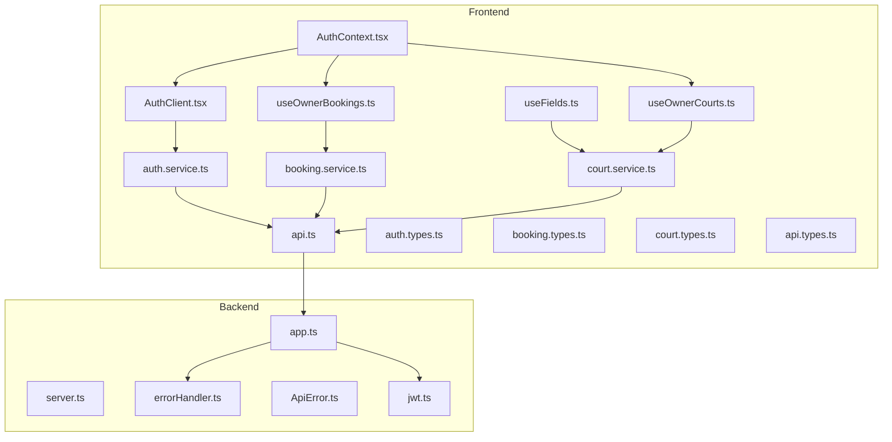
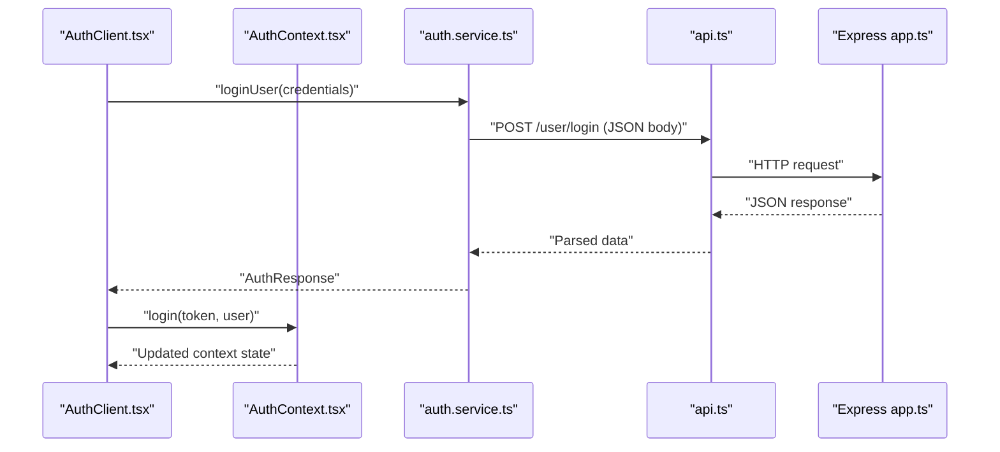
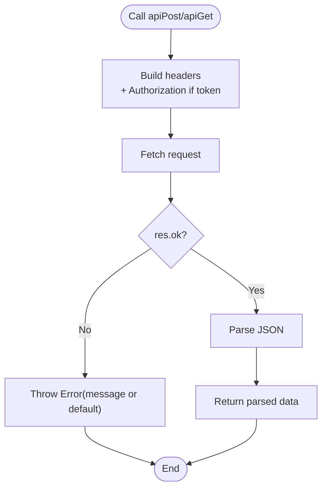
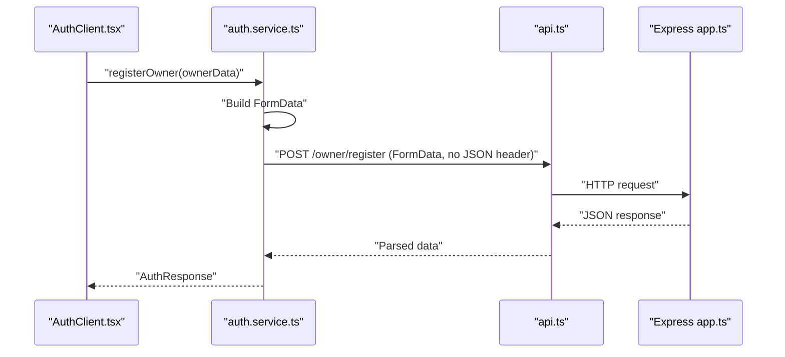
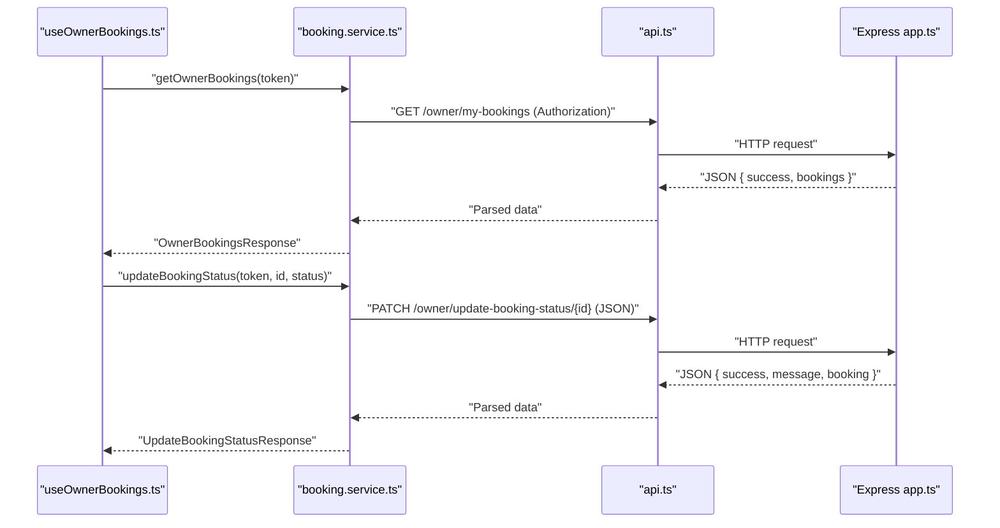
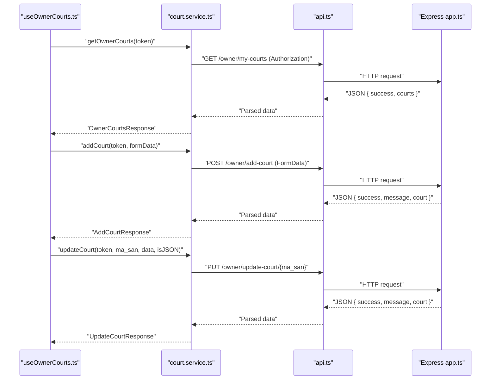
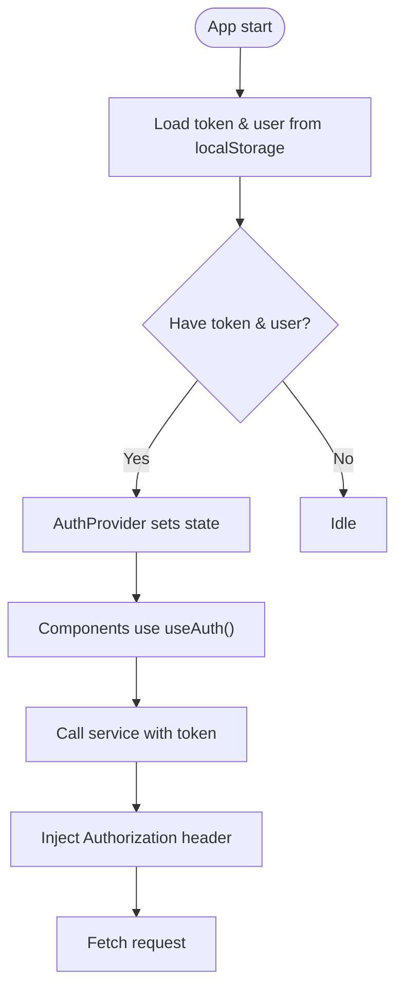
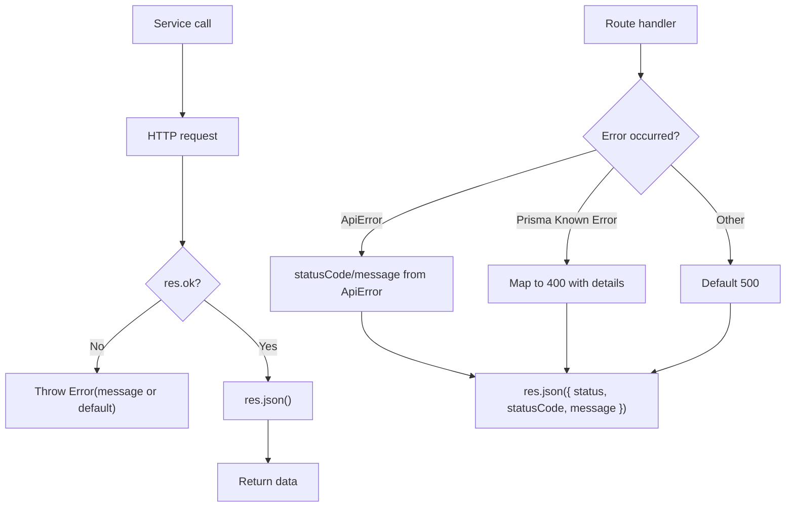
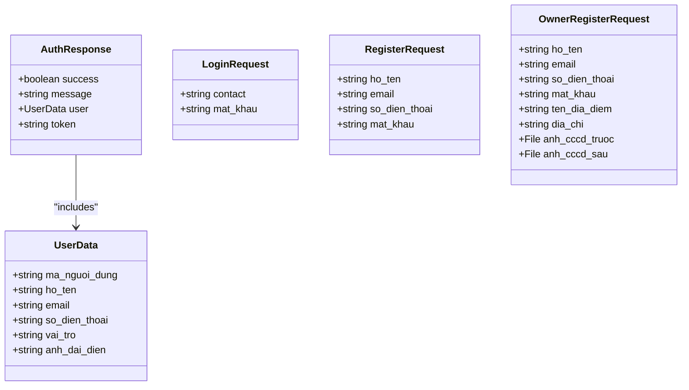
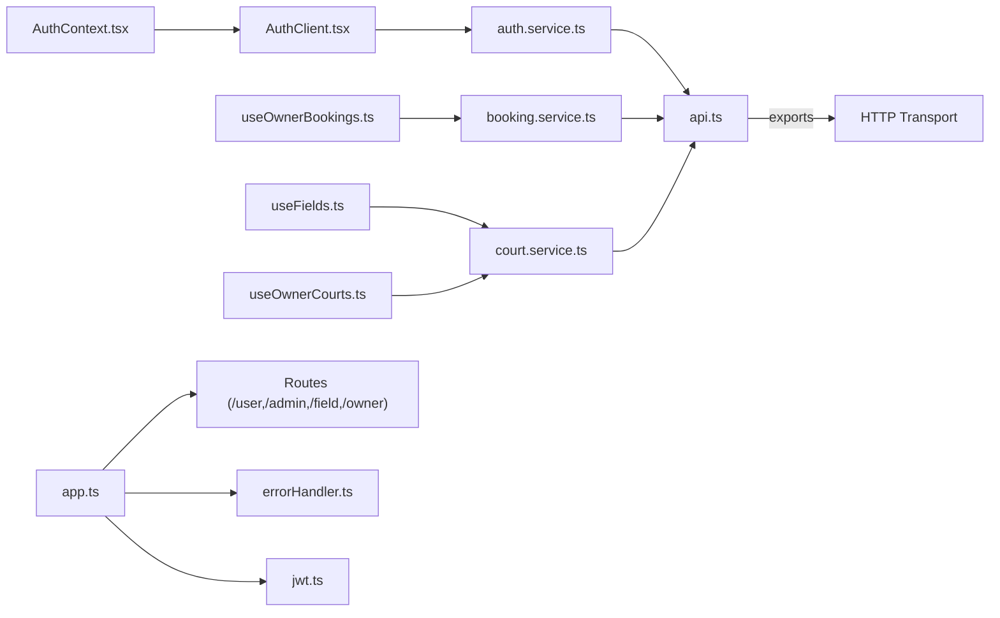

# API Integration Layer

<cite>
**Referenced Files in This Document**
- [api.ts](file://frontend/src/services/api.ts)
- [auth.service.ts](file://frontend/src/services/auth.service.ts)
- [booking.service.ts](file://frontend/src/services/booking.service.ts)
- [court.service.ts](file://frontend/src/services/court.service.ts)
- [AuthContext.tsx](file://frontend/src/contexts/AuthContext.tsx)
- [AuthClient.tsx](file://frontend/src/components/auth/AuthClient.tsx)
- [useFields.ts](file://frontend/src/hooks/useFields.ts)
- [useOwnerBookings.ts](file://frontend/src/hooks/useOwnerBookings.ts)
- [useOwnerCourts.ts](file://frontend/src/hooks/useOwnerCourts.ts)
- [api.types.ts](file://frontend/src/types/api.types.ts)
- [auth.types.ts](file://frontend/src/types/auth.types.ts)
- [booking.types.ts](file://frontend/src/types/booking.types.ts)
- [court.types.ts](file://frontend/src/types/court.types.ts)
- [app.ts](file://backend/src/app.ts)
- [server.ts](file://backend/src/server.ts)
- [errorHandler.ts](file://backend/src/middlewares/errorHandler.ts)
- [ApiError.ts](file://backend/src/utils/ApiError.ts)
- [jwt.ts](file://backend/src/utils/jwt.ts)
</cite>

## Table of Contents
1. [Introduction](#introduction)
2. [Project Structure](#project-structure)
3. [Core Components](#core-components)
4. [Architecture Overview](#architecture-overview)
5. [Detailed Component Analysis](#detailed-component-analysis)
6. [Dependency Analysis](#dependency-analysis)
7. [Performance Considerations](#performance-considerations)
8. [Troubleshooting Guide](#troubleshooting-guide)
9. [Conclusion](#conclusion)
10. [Appendices](#appendices)

## Introduction
This document describes the API integration layer and service abstractions for the frontend, focusing on HTTP client configuration, request/response handling, error management, and service-layer implementations for authentication, booking management, and facility services. It also covers authentication token management, request interceptors, response parsing, error boundaries, retry strategies, offline handling, API versioning, rate limiting, performance optimization, service composition, dependency injection, and testing strategies for API integrations.

## Project Structure
The frontend API integration layer is organized around:
- A centralized HTTP client module exporting typed helpers for GET, POST, PUT, PATCH requests.
- Service modules that encapsulate domain-specific API calls and transform payloads/responses.
- Type-safe request/response interfaces for consistent data contracts.
- React hooks that orchestrate service calls and manage UI state.
- An authentication context managing tokens and user state persisted in local storage.
- Backend Express application wiring routes, middleware, and global error handling.

**Diagram sources**
- [AuthClient.tsx:1-566](file://frontend/src/components/auth/AuthClient.tsx#L1-L566)
- [useFields.ts:1-78](file://frontend/src/hooks/useFields.ts#L1-L78)
- [useOwnerBookings.ts:1-67](file://frontend/src/hooks/useOwnerBookings.ts#L1-L67)
- [useOwnerCourts.ts:1-95](file://frontend/src/hooks/useOwnerCourts.ts#L1-L95)
- [AuthContext.tsx:1-83](file://frontend/src/contexts/AuthContext.tsx#L1-L83)
- [api.ts:1-78](file://frontend/src/services/api.ts#L1-L78)
- [auth.service.ts:1-36](file://frontend/src/services/auth.service.ts#L1-L36)
- [booking.service.ts:1-13](file://frontend/src/services/booking.service.ts#L1-L13)
- [court.service.ts:1-26](file://frontend/src/services/court.service.ts#L1-L26)
- [auth.types.ts:1-40](file://frontend/src/types/auth.types.ts#L1-L40)
- [booking.types.ts:1-37](file://frontend/src/types/booking.types.ts#L1-L37)
- [court.types.ts:1-82](file://frontend/src/types/court.types.ts#L1-L82)
- [api.types.ts:1-6](file://frontend/src/types/api.types.ts#L1-L6)
- [app.ts:1-21](file://backend/src/app.ts#L1-L21)
- [server.ts:1-20](file://backend/src/server.ts#L1-L20)
- [errorHandler.ts:1-38](file://backend/src/middlewares/errorHandler.ts#L1-L38)
- [ApiError.ts:1-13](file://backend/src/utils/ApiError.ts#L1-L13)
- [jwt.ts:1-13](file://backend/src/utils/jwt.ts#L1-L13)

**Section sources**
- [api.ts:1-78](file://frontend/src/services/api.ts#L1-L78)
- [auth.service.ts:1-36](file://frontend/src/services/auth.service.ts#L1-L36)
- [booking.service.ts:1-13](file://frontend/src/services/booking.service.ts#L1-L13)
- [court.service.ts:1-26](file://frontend/src/services/court.service.ts#L1-L26)
- [AuthContext.tsx:1-83](file://frontend/src/contexts/AuthContext.tsx#L1-L83)
- [AuthClient.tsx:1-566](file://frontend/src/components/auth/AuthClient.tsx#L1-L566)
- [useFields.ts:1-78](file://frontend/src/hooks/useFields.ts#L1-L78)
- [useOwnerBookings.ts:1-67](file://frontend/src/hooks/useOwnerBookings.ts#L1-L67)
- [useOwnerCourts.ts:1-95](file://frontend/src/hooks/useOwnerCourts.ts#L1-L95)
- [api.types.ts:1-6](file://frontend/src/types/api.types.ts#L1-L6)
- [auth.types.ts:1-40](file://frontend/src/types/auth.types.ts#L1-L40)
- [booking.types.ts:1-37](file://frontend/src/types/booking.types.ts#L1-L37)
- [court.types.ts:1-82](file://frontend/src/types/court.types.ts#L1-L82)
- [app.ts:1-21](file://backend/src/app.ts#L1-L21)
- [server.ts:1-20](file://backend/src/server.ts#L1-L20)
- [errorHandler.ts:1-38](file://backend/src/middlewares/errorHandler.ts#L1-L38)
- [ApiError.ts:1-13](file://backend/src/utils/ApiError.ts#L1-L13)
- [jwt.ts:1-13](file://backend/src/utils/jwt.ts#L1-L13)

## Core Components
- Centralized HTTP client:
  - Base URL resolution from environment.
  - Typed helpers for GET, POST, PUT, PATCH with optional JSON content-type and Authorization header injection.
  - Unified response parsing and error propagation.
- Service layer:
  - Authentication service: login, user registration, owner registration (multipart/form-data).
  - Booking service: fetch owner bookings and update booking status.
  - Facility service: fetch public fields, owner courts, add/update courts, update court status.
- Type system:
  - Generic API response wrapper and domain-specific request/response interfaces.
- React integration:
  - Hooks orchestrating service calls and state updates.
  - Authentication context persisting token and user data in local storage.

Key implementation references:
- HTTP client and response handling: [api.ts:1-78](file://frontend/src/services/api.ts#L1-L78)
- Authentication service: [auth.service.ts:1-36](file://frontend/src/services/auth.service.ts#L1-L36)
- Booking service: [booking.service.ts:1-13](file://frontend/src/services/booking.service.ts#L1-L13)
- Facility service: [court.service.ts:1-26](file://frontend/src/services/court.service.ts#L1-L26)
- Types: [api.types.ts:1-6](file://frontend/src/types/api.types.ts#L1-L6), [auth.types.ts:1-40](file://frontend/src/types/auth.types.ts#L1-L40), [booking.types.ts:1-37](file://frontend/src/types/booking.types.ts#L1-L37), [court.types.ts:1-82](file://frontend/src/types/court.types.ts#L1-L82)
- Hooks: [useFields.ts:1-78](file://frontend/src/hooks/useFields.ts#L1-L78), [useOwnerBookings.ts:1-67](file://frontend/src/hooks/useOwnerBookings.ts#L1-L67), [useOwnerCourts.ts:1-95](file://frontend/src/hooks/useOwnerCourts.ts#L1-L95)
- Auth context: [AuthContext.tsx:1-83](file://frontend/src/contexts/AuthContext.tsx#L1-L83)

**Section sources**
- [api.ts:1-78](file://frontend/src/services/api.ts#L1-L78)
- [auth.service.ts:1-36](file://frontend/src/services/auth.service.ts#L1-L36)
- [booking.service.ts:1-13](file://frontend/src/services/booking.service.ts#L1-L13)
- [court.service.ts:1-26](file://frontend/src/services/court.service.ts#L1-L26)
- [api.types.ts:1-6](file://frontend/src/types/api.types.ts#L1-L6)
- [auth.types.ts:1-40](file://frontend/src/types/auth.types.ts#L1-L40)
- [booking.types.ts:1-37](file://frontend/src/types/booking.types.ts#L1-L37)
- [court.types.ts:1-82](file://frontend/src/types/court.types.ts#L1-L82)
- [useFields.ts:1-78](file://frontend/src/hooks/useFields.ts#L1-L78)
- [useOwnerBookings.ts:1-67](file://frontend/src/hooks/useOwnerBookings.ts#L1-L67)
- [useOwnerCourts.ts:1-95](file://frontend/src/hooks/useOwnerCourts.ts#L1-L95)
- [AuthContext.tsx:1-83](file://frontend/src/contexts/AuthContext.tsx#L1-L83)

## Architecture Overview
The frontend integrates with the backend via a typed HTTP client. Services encapsulate route-specific logic and payload transformations. Hooks coordinate service calls and state updates. The backend exposes routes under /user, /admin, /field, and /owner, with a global error handler and JWT utilities.

**Diagram sources**
- [AuthClient.tsx:55-83](file://frontend/src/components/auth/AuthClient.tsx#L55-L83)
- [AuthContext.tsx:46-69](file://frontend/src/contexts/AuthContext.tsx#L46-L69)
- [auth.service.ts:5-11](file://frontend/src/services/auth.service.ts#L5-L11)
- [api.ts:29-43](file://frontend/src/services/api.ts#L29-L43)
- [app.ts:15-18](file://backend/src/app.ts#L15-L18)

**Section sources**
- [AuthClient.tsx:55-83](file://frontend/src/components/auth/AuthClient.tsx#L55-L83)
- [AuthContext.tsx:46-69](file://frontend/src/contexts/AuthContext.tsx#L46-L69)
- [auth.service.ts:5-11](file://frontend/src/services/auth.service.ts#L5-L11)
- [api.ts:29-43](file://frontend/src/services/api.ts#L29-L43)
- [app.ts:15-18](file://backend/src/app.ts#L15-L18)

## Detailed Component Analysis

### HTTP Client and Response Handling
- Base URL resolution from environment variable.
- Helper functions for GET, POST, PUT, PATCH with:
  - Optional JSON content-type and Authorization header injection.
  - Body support for both JSON string and FormData.
- Unified response parsing:
  - Parse JSON and throw on non-OK status using a generic message fallback.
- Exported base URL for potential reuse.

**Diagram sources**
- [api.ts:19-27](file://frontend/src/services/api.ts#L19-L27)
- [api.ts:29-43](file://frontend/src/services/api.ts#L29-L43)
- [api.ts:11-17](file://frontend/src/services/api.ts#L11-L17)

**Section sources**
- [api.ts:1-78](file://frontend/src/services/api.ts#L1-L78)

### Authentication Service
- Login: transforms contact into email and phone fields, sends JSON payload.
- User registration: sends user details as JSON.
- Owner registration: builds FormData and sends multipart payload.
- Uses centralized HTTP client with JSON or multipart support.

**Diagram sources**
- [auth.service.ts:22-34](file://frontend/src/services/auth.service.ts#L22-L34)
- [api.ts:29-43](file://frontend/src/services/api.ts#L29-L43)
- [app.ts:18](file://backend/src/app.ts#L18)

**Section sources**
- [auth.service.ts:1-36](file://frontend/src/services/auth.service.ts#L1-L36)

### Booking Management Service
- Fetch owner bookings via GET with token.
- Update booking status via PATCH with token and status payload.

**Diagram sources**
- [booking.service.ts:5-11](file://frontend/src/services/booking.service.ts#L5-L11)
- [api.ts:19-27](file://frontend/src/services/api.ts#L19-L27)
- [api.ts:61-75](file://frontend/src/services/api.ts#L61-L75)
- [app.ts:18](file://backend/src/app.ts#L18)

**Section sources**
- [booking.service.ts:1-13](file://frontend/src/services/booking.service.ts#L1-L13)

### Facility Services
- Public fields: GET /field returning list of items.
- Owner courts: GET /owner/my-courts with token.
- Add court: POST /owner/add-court with FormData.
- Update court: PUT /owner/update-court/{ma_san} with optional JSON or raw body.
- Update court status: PATCH /owner/update-court-status/{ma_san} with JSON.

**Diagram sources**
- [court.service.ts:9-20](file://frontend/src/services/court.service.ts#L9-L20)
- [court.service.ts:13-19](file://frontend/src/services/court.service.ts#L13-L19)
- [api.ts:45-59](file://frontend/src/services/api.ts#L45-L59)
- [app.ts:18](file://backend/src/app.ts#L18)

**Section sources**
- [court.service.ts:1-26](file://frontend/src/services/court.service.ts#L1-L26)

### Authentication Token Management and Interceptors
- Token and user persistence in local storage via AuthContext.
- Automatic Authorization header injection in HTTP client helpers.
- No explicit interceptor layer; token management is centralized in the HTTP client and consumed by services.

**Diagram sources**
- [AuthContext.tsx:32-51](file://frontend/src/contexts/AuthContext.tsx#L32-L51)
- [api.ts:3-9](file://frontend/src/services/api.ts#L3-L9)

**Section sources**
- [AuthContext.tsx:1-83](file://frontend/src/contexts/AuthContext.tsx#L1-L83)
- [api.ts:1-78](file://frontend/src/services/api.ts#L1-L78)

### Response Parsing and Error Management
- Centralized response parser throws on non-OK responses with a message fallback.
- Frontend components catch errors and surface user-facing messages.
- Backend global error handler normalizes errors to JSON with status, statusCode, and message.
- Domain-specific ApiError class enables controlled HTTP status propagation.

**Diagram sources**
- [api.ts:11-17](file://frontend/src/services/api.ts#L11-L17)
- [errorHandler.ts:5-37](file://backend/src/middlewares/errorHandler.ts#L5-L37)
- [ApiError.ts:1-13](file://backend/src/utils/ApiError.ts#L1-L13)

**Section sources**
- [api.ts:11-17](file://frontend/src/services/api.ts#L11-L17)
- [errorHandler.ts:1-38](file://backend/src/middlewares/errorHandler.ts#L1-L38)
- [ApiError.ts:1-13](file://backend/src/utils/ApiError.ts#L1-L13)

### Data Transformation and Type Safety
- Frontend types define request/response contracts for authentication, bookings, and courts.
- Hooks transform backend payloads into UI-friendly shapes (e.g., grid and map items).
- Consistent use of generics in HTTP helpers ensures compile-time safety.

**Diagram sources**
- [auth.types.ts:1-40](file://frontend/src/types/auth.types.ts#L1-L40)

**Section sources**
- [auth.types.ts:1-40](file://frontend/src/types/auth.types.ts#L1-L40)
- [booking.types.ts:1-37](file://frontend/src/types/booking.types.ts#L1-L37)
- [court.types.ts:1-82](file://frontend/src/types/court.types.ts#L1-L82)
- [api.types.ts:1-6](file://frontend/src/types/api.types.ts#L1-L6)

### API Endpoint Patterns
- Public endpoints:
  - GET /field
- Protected endpoints (require Authorization):
  - GET /owner/my-bookings
  - PATCH /owner/update-booking-status/{id}
  - GET /owner/my-courts
  - POST /owner/add-court
  - PUT /owner/update-court/{ma_san}
  - PATCH /owner/update-court-status/{ma_san}
- Authentication endpoints:
  - POST /user/login
  - POST /user/register
  - POST /owner/register

**Section sources**
- [court.service.ts:5-24](file://frontend/src/services/court.service.ts#L5-L24)
- [booking.service.ts:5-11](file://frontend/src/services/booking.service.ts#L5-L11)
- [auth.service.ts:5-34](file://frontend/src/services/auth.service.ts#L5-L34)
- [app.ts:15-18](file://backend/src/app.ts#L15-L18)

### Caching Mechanisms
- No explicit caching layer is present in the frontend API integration layer.
- Consider implementing in-memory cache keyed by URL and token for idempotent GET requests.

[No sources needed since this section provides general guidance]

### Error Boundary Implementation
- Frontend components catch errors during service calls and display user-facing messages.
- Hooks centralize error logging and state updates.
- Backend provides a global error handler returning structured JSON errors.

**Section sources**
- [AuthClient.tsx:74-82](file://frontend/src/components/auth/AuthClient.tsx#L74-L82)
- [useOwnerBookings.ts:28-32](file://frontend/src/hooks/useOwnerBookings.ts#L28-L32)
- [useOwnerCourts.ts:20-24](file://frontend/src/hooks/useOwnerCourts.ts#L20-L24)
- [errorHandler.ts:5-37](file://backend/src/middlewares/errorHandler.ts#L5-L37)

### Retry Strategies and Offline Handling
- No built-in retry or offline handling is implemented in the current integration layer.
- Recommended approaches:
  - Retry on transient network errors with exponential backoff.
  - Queue requests and replay after reconnection for offline scenarios.

[No sources needed since this section provides general guidance]

### API Versioning and Rate Limiting
- No explicit versioning scheme or rate-limiting middleware is configured in the backend.
- Recommendations:
  - Add version prefix to routes or headers.
  - Integrate rate limiting middleware per route or globally.

**Section sources**
- [app.ts:1-21](file://backend/src/app.ts#L1-L21)

### Performance Optimization Techniques
- Minimize payload sizes (avoid sending unnecessary fields).
- Use selective updates (PATCH) and partial payloads.
- Debounce/fetch-while-typing for search/filter endpoints.
- Lazy-load images and defer non-critical computations.

[No sources needed since this section provides general guidance]

### Service Composition, Dependency Injection, and Testing Strategies
- Service composition:
  - Keep services pure and delegate HTTP concerns to the HTTP client.
  - Compose services in hooks to orchestrate multiple API calls.
- Dependency injection:
  - Pass token and HTTP client instances to services for testability.
- Testing strategies:
  - Mock HTTP client functions to isolate service logic.
  - Snapshot tests for transformed data in hooks.
  - Unit tests for service functions with mocked responses.

[No sources needed since this section provides general guidance]

## Dependency Analysis
The frontend depends on:
- HTTP client for transport and headers.
- Service modules for domain logic.
- Hooks for orchestrating calls and state.
- Types for compile-time safety.

Backend depends on:
- Routes for endpoint exposure.
- Middleware for error handling.
- Utilities for JWT and error modeling.

**Diagram sources**
- [api.ts:1-78](file://frontend/src/services/api.ts#L1-L78)
- [auth.service.ts:1-36](file://frontend/src/services/auth.service.ts#L1-L36)
- [booking.service.ts:1-13](file://frontend/src/services/booking.service.ts#L1-L13)
- [court.service.ts:1-26](file://frontend/src/services/court.service.ts#L1-L26)
- [useFields.ts:1-78](file://frontend/src/hooks/useFields.ts#L1-L78)
- [useOwnerBookings.ts:1-67](file://frontend/src/hooks/useOwnerBookings.ts#L1-L67)
- [useOwnerCourts.ts:1-95](file://frontend/src/hooks/useOwnerCourts.ts#L1-L95)
- [AuthContext.tsx:1-83](file://frontend/src/contexts/AuthContext.tsx#L1-L83)
- [AuthClient.tsx:1-566](file://frontend/src/components/auth/AuthClient.tsx#L1-L566)
- [app.ts:1-21](file://backend/src/app.ts#L1-L21)
- [errorHandler.ts:1-38](file://backend/src/middlewares/errorHandler.ts#L1-L38)
- [jwt.ts:1-13](file://backend/src/utils/jwt.ts#L1-L13)

**Section sources**
- [api.ts:1-78](file://frontend/src/services/api.ts#L1-L78)
- [auth.service.ts:1-36](file://frontend/src/services/auth.service.ts#L1-L36)
- [booking.service.ts:1-13](file://frontend/src/services/booking.service.ts#L1-L13)
- [court.service.ts:1-26](file://frontend/src/services/court.service.ts#L1-L26)
- [useFields.ts:1-78](file://frontend/src/hooks/useFields.ts#L1-L78)
- [useOwnerBookings.ts:1-67](file://frontend/src/hooks/useOwnerBookings.ts#L1-L67)
- [useOwnerCourts.ts:1-95](file://frontend/src/hooks/useOwnerCourts.ts#L1-L95)
- [AuthContext.tsx:1-83](file://frontend/src/contexts/AuthContext.tsx#L1-L83)
- [AuthClient.tsx:1-566](file://frontend/src/components/auth/AuthClient.tsx#L1-L566)
- [app.ts:1-21](file://backend/src/app.ts#L1-L21)
- [errorHandler.ts:1-38](file://backend/src/middlewares/errorHandler.ts#L1-L38)
- [jwt.ts:1-13](file://backend/src/utils/jwt.ts#L1-L13)

## Performance Considerations
- Prefer PATCH/PUT for partial updates to reduce payload size.
- Normalize and memoize transformed data in hooks to avoid redundant computations.
- Defer non-critical UI updates until after data is fetched.
- Use pagination or filtering to limit initial payload sizes.

[No sources needed since this section provides general guidance]

## Troubleshooting Guide
Common issues and resolutions:
- Authentication failures:
  - Verify token presence and validity; check Authorization header injection.
  - Inspect thrown error messages from response parsing.
- Network errors:
  - Wrap service calls with try/catch and display user-friendly messages.
  - Implement retry logic for transient failures.
- Backend errors:
  - Review global error handler responses and logs.
  - Ensure ApiError usage for controlled status propagation.

**Section sources**
- [api.ts:11-17](file://frontend/src/services/api.ts#L11-L17)
- [AuthClient.tsx:74-82](file://frontend/src/components/auth/AuthClient.tsx#L74-L82)
- [errorHandler.ts:5-37](file://backend/src/middlewares/errorHandler.ts#L5-L37)

## Conclusion
The API integration layer provides a clean separation between HTTP transport, service logic, and UI orchestration. It leverages typed contracts, centralized response handling, and a simple token management model. Extending the layer with retry/backoff, offline handling, caching, and versioning will further improve robustness and performance.

## Appendices
- Environment configuration:
  - NEXT_PUBLIC_API_URL for frontend base URL.
  - JWT_SECRET and PORT for backend.
- Route coverage:
  - User: login, register.
  - Owner: my-bookings, update-booking-status, my-courts, add-court, update-court, update-court-status.
  - Field: list.

**Section sources**
- [api.ts:1](file://frontend/src/services/api.ts#L1)
- [server.ts:4](file://backend/src/server.ts#L4)
- [jwt.ts:3](file://backend/src/utils/jwt.ts#L3)
- [app.ts:15-18](file://backend/src/app.ts#L15-L18)