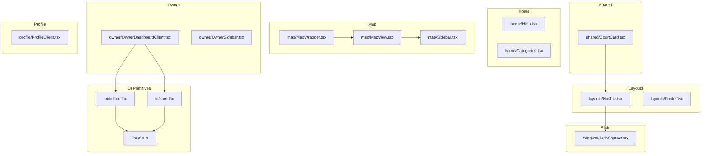
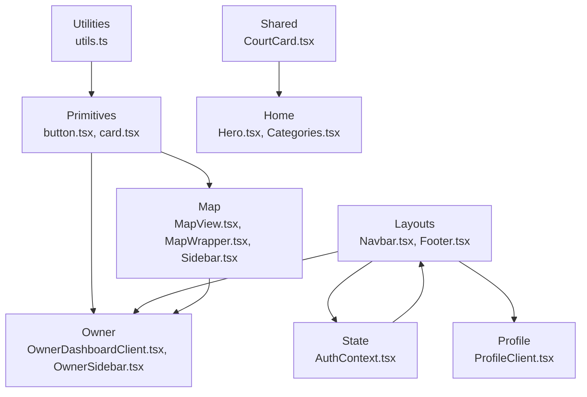
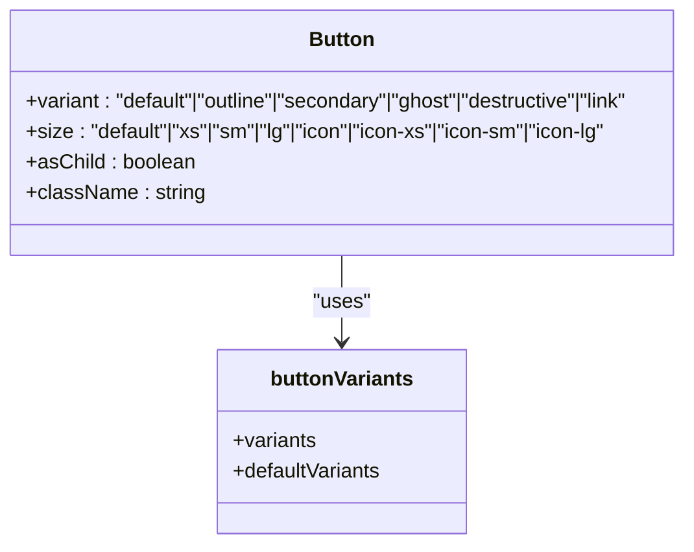
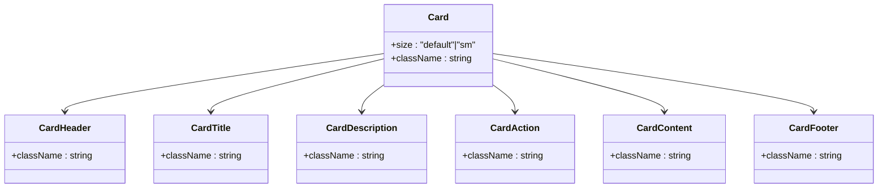
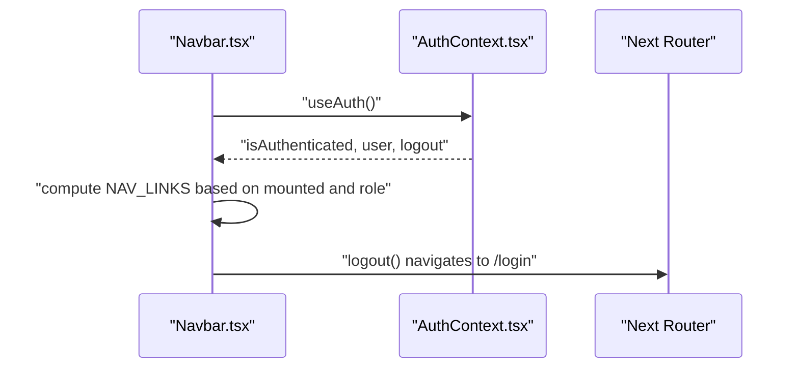
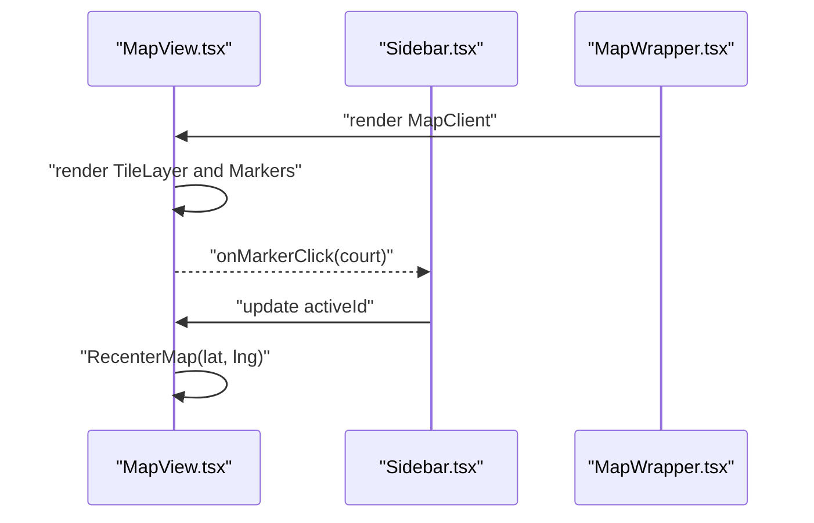
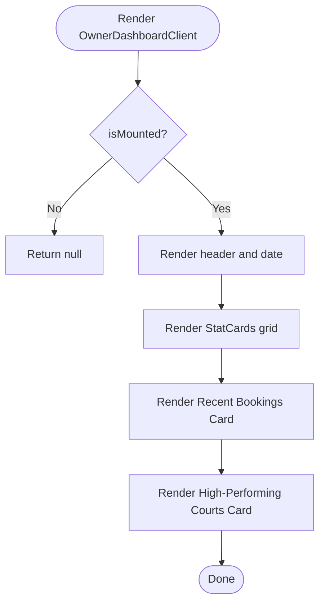
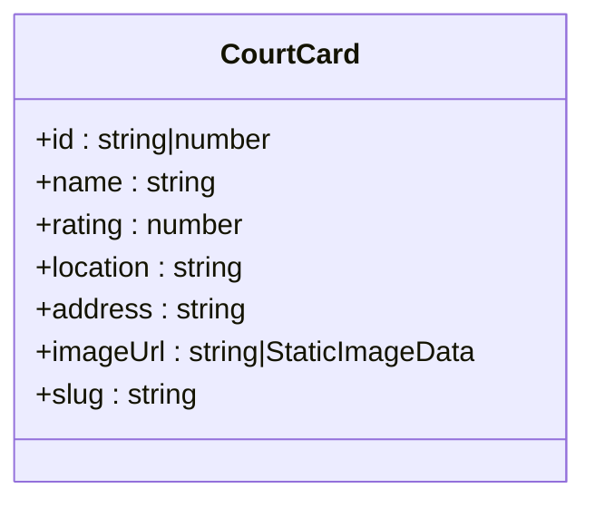
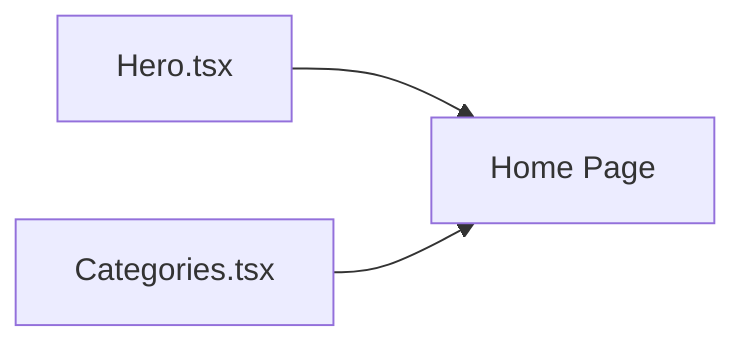
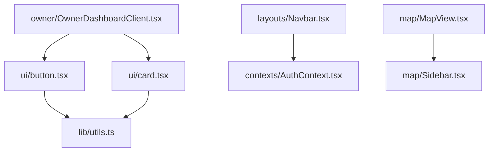

# Component Architecture

<cite>
**Referenced Files in This Document**
- [button.tsx](file://frontend/src/components/ui/button.tsx)
- [card.tsx](file://frontend/src/components/ui/card.tsx)
- [utils.ts](file://frontend/src/lib/utils.ts)
- [Navbar.tsx](file://frontend/src/components/layouts/Navbar.tsx)
- [Footer.tsx](file://frontend/src/components/layouts/Footer.tsx)
- [CourtCard.tsx](file://frontend/src/components/shared/CourtCard.tsx)
- [Hero.tsx](file://frontend/src/components/home/Hero.tsx)
- [Categories.tsx](file://frontend/src/components/home/Categories.tsx)
- [MapView.tsx](file://frontend/src/components/map/MapView.tsx)
- [MapWrapper.tsx](file://frontend/src/components/map/MapWrapper.tsx)
- [Sidebar.tsx](file://frontend/src/components/map/Sidebar.tsx)
- [OwnerDashboardClient.tsx](file://frontend/src/components/owner/OwnerDashboardClient.tsx)
- [OwnerSidebar.tsx](file://frontend/src/components/owner/OwnerSidebar.tsx)
- [ProfileClient.tsx](file://frontend/src/components/profile/ProfileClient.tsx)
- [AuthContext.tsx](file://frontend/src/contexts/AuthContext.tsx)
</cite>

## Table of Contents
1. [Introduction](#introduction)
2. [Project Structure](#project-structure)
3. [Core Components](#core-components)
4. [Architecture Overview](#architecture-overview)
5. [Detailed Component Analysis](#detailed-component-analysis)
6. [Dependency Analysis](#dependency-analysis)
7. [Performance Considerations](#performance-considerations)
8. [Troubleshooting Guide](#troubleshooting-guide)
9. [Conclusion](#conclusion)
10. [Appendices](#appendices)

## Introduction
This document describes the component architecture and design system of the frontend application. It focuses on the component hierarchy, reusable UI patterns, composition strategies, shared components, layout components, and utility components. It also documents prop interfaces, component contracts, design system implementation, variants, styling conventions, testing strategies, accessibility considerations, performance optimizations, state management, event handling, and integration patterns with the broader application.

## Project Structure
The frontend is organized around feature-based components under src/components, with dedicated folders for shared, UI primitives, layouts, maps, owners, profiles, and home pages. Shared utilities and styling helpers live under src/lib, while global state is centralized via a React Context provider.

**Diagram sources**
- [button.tsx:1-68](file://frontend/src/components/ui/button.tsx#L1-L68)
- [card.tsx:1-104](file://frontend/src/components/ui/card.tsx#L1-L104)
- [utils.ts:1-7](file://frontend/src/lib/utils.ts#L1-L7)
- [Navbar.tsx:1-119](file://frontend/src/components/layouts/Navbar.tsx#L1-L119)
- [Footer.tsx:1-20](file://frontend/src/components/layouts/Footer.tsx#L1-L20)
- [CourtCard.tsx:1-73](file://frontend/src/components/shared/CourtCard.tsx#L1-L73)
- [Hero.tsx:1-29](file://frontend/src/components/home/Hero.tsx#L1-L29)
- [Categories.tsx:1-33](file://frontend/src/components/home/Categories.tsx#L1-L33)
- [MapView.tsx:1-62](file://frontend/src/components/map/MapView.tsx#L1-L62)
- [MapWrapper.tsx:1-9](file://frontend/src/components/map/MapWrapper.tsx#L1-L9)
- [Sidebar.tsx:1-60](file://frontend/src/components/map/Sidebar.tsx#L1-L60)
- [OwnerDashboardClient.tsx:1-176](file://frontend/src/components/owner/OwnerDashboardClient.tsx#L1-L176)
- [OwnerSidebar.tsx:1-90](file://frontend/src/components/owner/OwnerSidebar.tsx#L1-L90)
- [ProfileClient.tsx:1-125](file://frontend/src/components/profile/ProfileClient.tsx#L1-L125)
- [AuthContext.tsx:1-83](file://frontend/src/contexts/AuthContext.tsx#L1-L83)

**Section sources**
- [button.tsx:1-68](file://frontend/src/components/ui/button.tsx#L1-L68)
- [card.tsx:1-104](file://frontend/src/components/ui/card.tsx#L1-L104)
- [utils.ts:1-7](file://frontend/src/lib/utils.ts#L1-L7)
- [Navbar.tsx:1-119](file://frontend/src/components/layouts/Navbar.tsx#L1-L119)
- [Footer.tsx:1-20](file://frontend/src/components/layouts/Footer.tsx#L1-L20)
- [CourtCard.tsx:1-73](file://frontend/src/components/shared/CourtCard.tsx#L1-L73)
- [Hero.tsx:1-29](file://frontend/src/components/home/Hero.tsx#L1-L29)
- [Categories.tsx:1-33](file://frontend/src/components/home/Categories.tsx#L1-L33)
- [MapView.tsx:1-62](file://frontend/src/components/map/MapView.tsx#L1-L62)
- [MapWrapper.tsx:1-9](file://frontend/src/components/map/MapWrapper.tsx#L1-L9)
- [Sidebar.tsx:1-60](file://frontend/src/components/map/Sidebar.tsx#L1-L60)
- [OwnerDashboardClient.tsx:1-176](file://frontend/src/components/owner/OwnerDashboardClient.tsx#L1-L176)
- [OwnerSidebar.tsx:1-90](file://frontend/src/components/owner/OwnerSidebar.tsx#L1-L90)
- [ProfileClient.tsx:1-125](file://frontend/src/components/profile/ProfileClient.tsx#L1-L125)
- [AuthContext.tsx:1-83](file://frontend/src/contexts/AuthContext.tsx#L1-L83)

## Core Components
This section documents the design system primitives and shared components that form the foundation of the UI.

- Button primitive with variant and size variants using class variance authority and a slot-based composition pattern.
- Card composite component with header, title, description, action, content, and footer slots supporting size variants.
- Utility class merging helper for Tailwind-based styling.

Key characteristics:
- Prop contracts define variant and size options for buttons and card sizes.
- Composition via data attributes and slot semantics enables consistent styling and behavior.
- Styling uses Tailwind utilities merged via a central helper.

**Section sources**
- [button.tsx:7-42](file://frontend/src/components/ui/button.tsx#L7-L42)
- [button.tsx:44-65](file://frontend/src/components/ui/button.tsx#L44-L65)
- [card.tsx:5-21](file://frontend/src/components/ui/card.tsx#L5-L21)
- [card.tsx:23-34](file://frontend/src/components/ui/card.tsx#L23-L34)
- [card.tsx:36-47](file://frontend/src/components/ui/card.tsx#L36-L47)
- [card.tsx:49-57](file://frontend/src/components/ui/card.tsx#L49-L57)
- [card.tsx:59-69](file://frontend/src/components/ui/card.tsx#L59-L69)
- [card.tsx:72-80](file://frontend/src/components/ui/card.tsx#L72-L80)
- [card.tsx:82-92](file://frontend/src/components/ui/card.tsx#L82-L92)
- [utils.ts:4-6](file://frontend/src/lib/utils.ts#L4-L6)

## Architecture Overview
The component architecture follows a layered design:
- Primitive UI components (button, card) encapsulate styling and variants.
- Composite components (OwnerDashboardClient, MapView, Sidebar) orchestrate primitives and external libraries.
- Layout components (Navbar, Footer) provide cross-cutting UI scaffolding.
- Shared components (CourtCard) encapsulate domain-specific visuals.
- Global state (AuthContext) integrates with UI via hooks.

**Diagram sources**
- [button.tsx:1-68](file://frontend/src/components/ui/button.tsx#L1-L68)
- [card.tsx:1-104](file://frontend/src/components/ui/card.tsx#L1-L104)
- [utils.ts:1-7](file://frontend/src/lib/utils.ts#L1-L7)
- [Navbar.tsx:1-119](file://frontend/src/components/layouts/Navbar.tsx#L1-L119)
- [Footer.tsx:1-20](file://frontend/src/components/layouts/Footer.tsx#L1-L20)
- [CourtCard.tsx:1-73](file://frontend/src/components/shared/CourtCard.tsx#L1-L73)
- [Hero.tsx:1-29](file://frontend/src/components/home/Hero.tsx#L1-L29)
- [Categories.tsx:1-33](file://frontend/src/components/home/Categories.tsx#L1-L33)
- [MapView.tsx:1-62](file://frontend/src/components/map/MapView.tsx#L1-L62)
- [MapWrapper.tsx:1-9](file://frontend/src/components/map/MapWrapper.tsx#L1-L9)
- [Sidebar.tsx:1-60](file://frontend/src/components/map/Sidebar.tsx#L1-L60)
- [OwnerDashboardClient.tsx:1-176](file://frontend/src/components/owner/OwnerDashboardClient.tsx#L1-L176)
- [OwnerSidebar.tsx:1-90](file://frontend/src/components/owner/OwnerSidebar.tsx#L1-L90)
- [ProfileClient.tsx:1-125](file://frontend/src/components/profile/ProfileClient.tsx#L1-L125)
- [AuthContext.tsx:1-83](file://frontend/src/contexts/AuthContext.tsx#L1-L83)

## Detailed Component Analysis

### Button Primitive
The Button component demonstrates:
- Variants: default, outline, secondary, ghost, destructive, link.
- Sizes: default, xs, sm, lg, icon, icon-xs, icon-sm, icon-lg.
- Composition: asChild pattern using a slot to render either a native button or a custom element.
- Contract: accepts standard button props plus variant/size/asChild.

**Diagram sources**
- [button.tsx:7-42](file://frontend/src/components/ui/button.tsx#L7-L42)
- [button.tsx:44-65](file://frontend/src/components/ui/button.tsx#L44-L65)

**Section sources**
- [button.tsx:7-42](file://frontend/src/components/ui/button.tsx#L7-L42)
- [button.tsx:44-65](file://frontend/src/components/ui/button.tsx#L44-L65)

### Card Composite Component
The Card family exposes a cohesive layout contract:
- Card: base container with optional size.
- CardHeader/CardTitle/CardDescription/CardAction/CardContent/CardFooter: semantic slots.
- Contract: supports size variants and data attributes for styling.

**Diagram sources**
- [card.tsx:5-21](file://frontend/src/components/ui/card.tsx#L5-L21)
- [card.tsx:23-34](file://frontend/src/components/ui/card.tsx#L23-L34)
- [card.tsx:36-47](file://frontend/src/components/ui/card.tsx#L36-L47)
- [card.tsx:49-57](file://frontend/src/components/ui/card.tsx#L49-L57)
- [card.tsx:59-69](file://frontend/src/components/ui/card.tsx#L59-L69)
- [card.tsx:72-80](file://frontend/src/components/ui/card.tsx#L72-L80)
- [card.tsx:82-92](file://frontend/src/components/ui/card.tsx#L82-L92)

**Section sources**
- [card.tsx:5-21](file://frontend/src/components/ui/card.tsx#L5-L21)
- [card.tsx:23-34](file://frontend/src/components/ui/card.tsx#L23-L34)
- [card.tsx:36-47](file://frontend/src/components/ui/card.tsx#L36-L47)
- [card.tsx:49-57](file://frontend/src/components/ui/card.tsx#L49-L57)
- [card.tsx:59-69](file://frontend/src/components/ui/card.tsx#L59-L69)
- [card.tsx:72-80](file://frontend/src/components/ui/card.tsx#L72-L80)
- [card.tsx:82-92](file://frontend/src/components/ui/card.tsx#L82-L92)

### Navbar Layout Component
The Navbar integrates routing, authentication, and conditional rendering:
- Uses Next.js navigation and client-side effects.
- Conditionally renders links based on authentication and user role.
- Provides avatar and logout actions.

**Diagram sources**
- [Navbar.tsx:9-19](file://frontend/src/components/layouts/Navbar.tsx#L9-L19)
- [Navbar.tsx:21-35](file://frontend/src/components/layouts/Navbar.tsx#L21-L35)
- [AuthContext.tsx:26-59](file://frontend/src/contexts/AuthContext.tsx#L26-L59)

**Section sources**
- [Navbar.tsx:9-19](file://frontend/src/components/layouts/Navbar.tsx#L9-L19)
- [Navbar.tsx:21-35](file://frontend/src/components/layouts/Navbar.tsx#L21-L35)
- [AuthContext.tsx:26-59](file://frontend/src/contexts/AuthContext.tsx#L26-L59)

### Map View and Sidebar
The map module composes Leaflet with a sidebar and dynamic client rendering:
- MapView renders markers and centers on selection.
- Sidebar lists courts and handles selection.
- MapWrapper defers client rendering to avoid SSR issues.

**Diagram sources**
- [MapView.tsx:25-61](file://frontend/src/components/map/MapView.tsx#L25-L61)
- [Sidebar.tsx:14-59](file://frontend/src/components/map/Sidebar.tsx#L14-L59)
- [MapWrapper.tsx:7-8](file://frontend/src/components/map/MapWrapper.tsx#L7-L8)

**Section sources**
- [MapView.tsx:25-61](file://frontend/src/components/map/MapView.tsx#L25-L61)
- [Sidebar.tsx:14-59](file://frontend/src/components/map/Sidebar.tsx#L14-L59)
- [MapWrapper.tsx:7-8](file://frontend/src/components/map/MapWrapper.tsx#L7-L8)

### Owner Dashboard
The OwnerDashboardClient orchestrates statistics, recent bookings, and performance metrics using Card and Button primitives.

**Diagram sources**
- [OwnerDashboardClient.tsx:30-49](file://frontend/src/components/owner/OwnerDashboardClient.tsx#L30-L49)
- [OwnerDashboardClient.tsx:67-92](file://frontend/src/components/owner/OwnerDashboardClient.tsx#L67-L92)
- [OwnerDashboardClient.tsx:94-137](file://frontend/src/components/owner/OwnerDashboardClient.tsx#L94-L137)

**Section sources**
- [OwnerDashboardClient.tsx:30-49](file://frontend/src/components/owner/OwnerDashboardClient.tsx#L30-L49)
- [OwnerDashboardClient.tsx:67-92](file://frontend/src/components/owner/OwnerDashboardClient.tsx#L67-L92)
- [OwnerDashboardClient.tsx:94-137](file://frontend/src/components/owner/OwnerDashboardClient.tsx#L94-L137)

### Shared Components Library
CourtCard encapsulates a court item with image, rating, location, and a call-to-action link.

**Diagram sources**
- [CourtCard.tsx:6-23](file://frontend/src/components/shared/CourtCard.tsx#L6-L23)

**Section sources**
- [CourtCard.tsx:6-23](file://frontend/src/components/shared/CourtCard.tsx#L6-L23)

### Home Page Components
Hero and Categories provide promotional and discovery UI.

**Diagram sources**
- [Hero.tsx:4-27](file://frontend/src/components/home/Hero.tsx#L4-L27)
- [Categories.tsx:11-32](file://frontend/src/components/home/Categories.tsx#L11-L32)

**Section sources**
- [Hero.tsx:4-27](file://frontend/src/components/home/Hero.tsx#L4-L27)
- [Categories.tsx:11-32](file://frontend/src/components/home/Categories.tsx#L11-L32)

## Dependency Analysis
Component dependencies and coupling:
- UI primitives depend on a shared utility for class merging.
- Layout components depend on global state for authentication.
- Composite components depend on primitives and third-party libraries (Leaflet).
- Shared components are standalone and reusable across pages.

**Diagram sources**
- [utils.ts:4-6](file://frontend/src/lib/utils.ts#L4-L6)
- [button.tsx:1-6](file://frontend/src/components/ui/button.tsx#L1-L6)
- [card.tsx:1-3](file://frontend/src/components/ui/card.tsx#L1-L3)
- [Navbar.tsx:6-11](file://frontend/src/components/layouts/Navbar.tsx#L6-L11)
- [AuthContext.tsx:24-26](file://frontend/src/contexts/AuthContext.tsx#L24-L26)
- [MapView.tsx:1-6](file://frontend/src/components/map/MapView.tsx#L1-L6)
- [Sidebar.tsx:1-5](file://frontend/src/components/map/Sidebar.tsx#L1-L5)
- [OwnerDashboardClient.tsx:12-13](file://frontend/src/components/owner/OwnerDashboardClient.tsx#L12-L13)

**Section sources**
- [utils.ts:4-6](file://frontend/src/lib/utils.ts#L4-L6)
- [button.tsx:1-6](file://frontend/src/components/ui/button.tsx#L1-L6)
- [card.tsx:1-3](file://frontend/src/components/ui/card.tsx#L1-L3)
- [Navbar.tsx:6-11](file://frontend/src/components/layouts/Navbar.tsx#L6-L11)
- [AuthContext.tsx:24-26](file://frontend/src/contexts/AuthContext.tsx#L24-L26)
- [MapView.tsx:1-6](file://frontend/src/components/map/MapView.tsx#L1-L6)
- [Sidebar.tsx:1-5](file://frontend/src/components/map/Sidebar.tsx#L1-L5)
- [OwnerDashboardClient.tsx:12-13](file://frontend/src/components/owner/OwnerDashboardClient.tsx#L12-L13)

## Performance Considerations
- Client-only rendering: MapWrapper defers client rendering to prevent SSR mismatches.
- Conditional mounting: Navbar delays rendering until hydrated to avoid hydration errors.
- Image optimization: Next/Image used with fill and sizes for responsive images.
- Minimal re-renders: Prefer memoization for expensive computations and stable callbacks.
- CSS transitions: Keep animations lightweight; avoid layout thrashing by batching DOM reads/writes.
- Event handlers: Bind handlers in component scope to avoid unnecessary closures.

[No sources needed since this section provides general guidance]

## Troubleshooting Guide
Common issues and resolutions:
- Hydration mismatch: Ensure client-only components are rendered after mount (e.g., Navbar mounted flag).
- Authentication state not persisting: Verify localStorage keys and parsing in AuthContext.
- Map not centered: Confirm activeId and marker data alignment; ensure RecenterMap receives valid coordinates.
- Styling conflicts: Use the shared cn utility to merge classes and avoid conflicting Tailwind directives.

**Section sources**
- [Navbar.tsx:14-19](file://frontend/src/components/layouts/Navbar.tsx#L14-L19)
- [AuthContext.tsx:32-44](file://frontend/src/contexts/AuthContext.tsx#L32-L44)
- [MapView.tsx:54-59](file://frontend/src/components/map/MapView.tsx#L54-L59)
- [utils.ts:4-6](file://frontend/src/lib/utils.ts#L4-L6)

## Conclusion
The component architecture emphasizes:
- A strong design system with variant-driven primitives (Button, Card).
- Composable layouts and shared components for reuse.
- Clear separation of concerns: primitives, composites, layouts, and state.
- Practical performance and accessibility patterns aligned with Next.js and React best practices.

[No sources needed since this section summarizes without analyzing specific files]

## Appendices

### Component Contracts and Prop Interfaces
- Button
  - Props: variant, size, asChild, and standard button attributes.
  - Variants: default, outline, secondary, ghost, destructive, link.
  - Sizes: default, xs, sm, lg, icon, icon-xs, icon-sm, icon-lg.
- Card
  - Props: size, and standard div attributes.
  - Slots: header, title, description, action, content, footer.
  - Sizes: default, sm.
- Navbar
  - Props: none (consumes AuthContext and Next router).
  - Behavior: conditional navigation based on authentication and role.
- MapView
  - Props: courts array, onMarkerClick handler, optional activeId.
  - Behavior: renders markers and recenters on selection.
- Sidebar
  - Props: isOpen, courts, onClose, onSelect, optional activeId.
  - Behavior: toggles visibility and highlights selected item.
- OwnerDashboardClient
  - Props: none (client component).
  - Behavior: renders stats, recent bookings, and performance charts using Card and Button.
- ProfileClient
  - Props: none (client component).
  - Behavior: renders profile info, wallet, and logout action.
- AuthContext
  - Exposes: user, token, login, logout, isAuthenticated.
  - Persistence: localStorage-backed.

**Section sources**
- [button.tsx:44-65](file://frontend/src/components/ui/button.tsx#L44-L65)
- [card.tsx:5-21](file://frontend/src/components/ui/card.tsx#L5-L21)
- [Navbar.tsx:9-35](file://frontend/src/components/layouts/Navbar.tsx#L9-L35)
- [MapView.tsx:19-23](file://frontend/src/components/map/MapView.tsx#L19-L23)
- [Sidebar.tsx:6-12](file://frontend/src/components/map/Sidebar.tsx#L6-L12)
- [OwnerDashboardClient.tsx:30-46](file://frontend/src/components/owner/OwnerDashboardClient.tsx#L30-L46)
- [ProfileClient.tsx:6-13](file://frontend/src/components/profile/ProfileClient.tsx#L6-L13)
- [AuthContext.tsx:16-22](file://frontend/src/contexts/AuthContext.tsx#L16-L22)