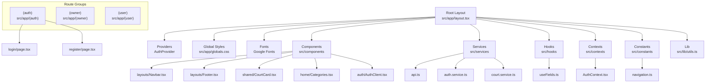
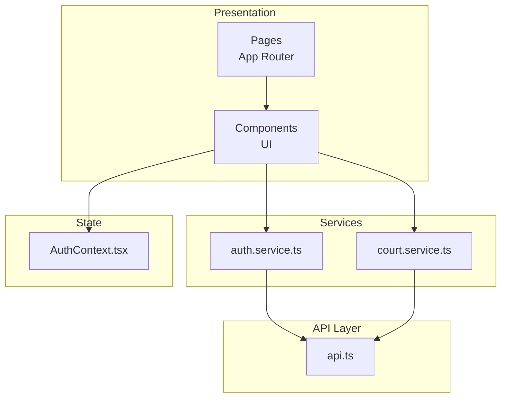
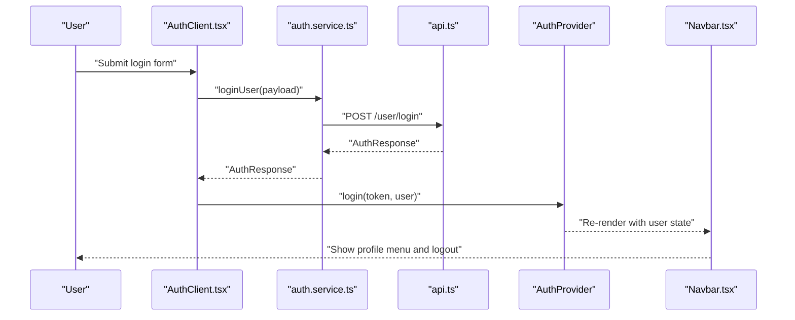
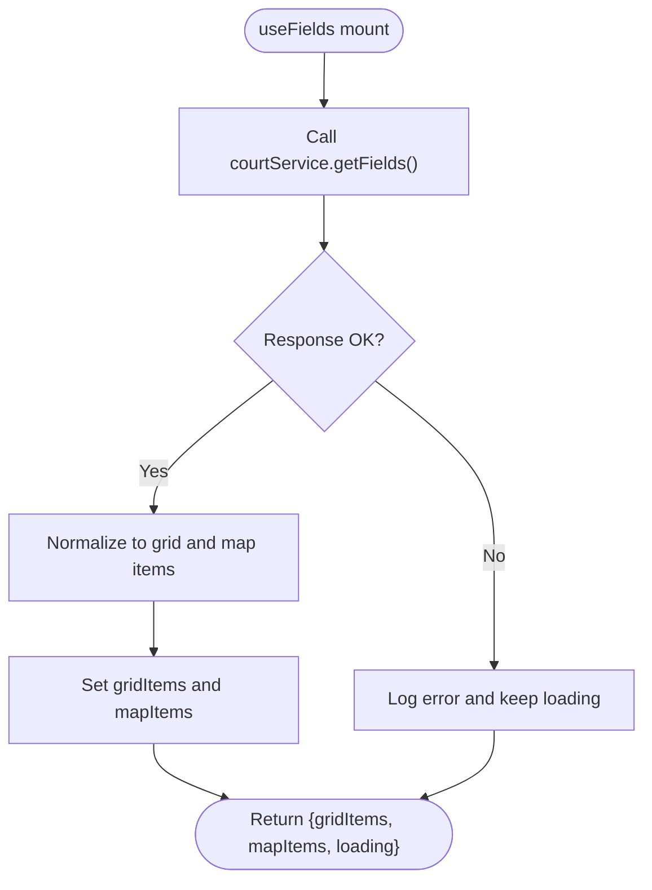
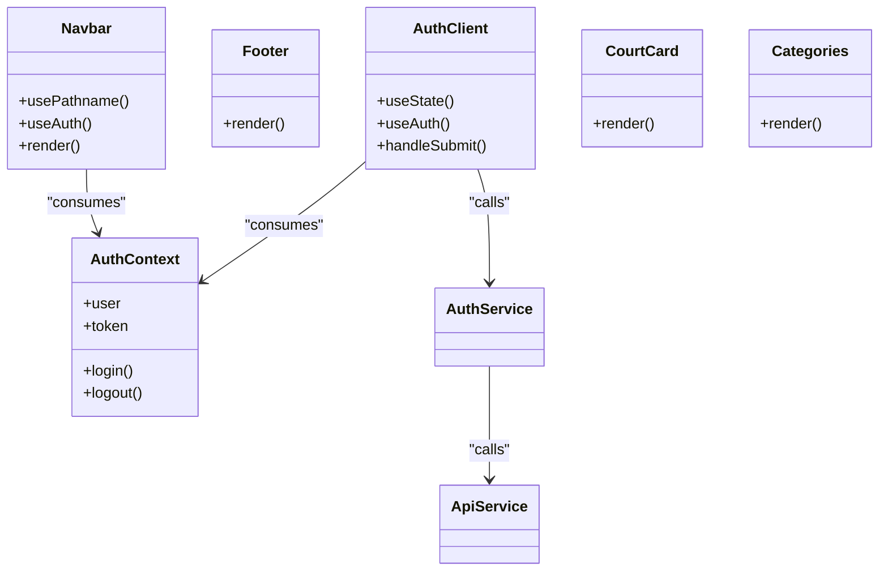
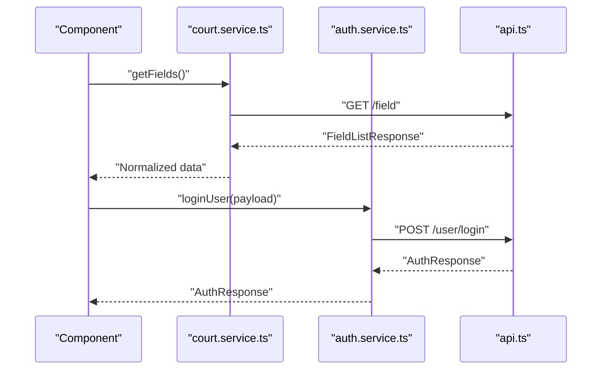
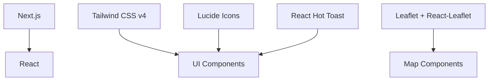

# Frontend Architecture

<cite>
**Referenced Files in This Document**
- [layout.tsx](file://frontend/src/app/layout.tsx)
- [AuthContext.tsx](file://frontend/src/contexts/AuthContext.tsx)
- [api.ts](file://frontend/src/services/api.ts)
- [auth.service.ts](file://frontend/src/services/auth.service.ts)
- [court.service.ts](file://frontend/src/services/court.service.ts)
- [useFields.ts](file://frontend/src/hooks/useFields.ts)
- [navigation.ts](file://frontend/src/constants/navigation.ts)
- [Navbar.tsx](file://frontend/src/components/layouts/Navbar.tsx)
- [Footer.tsx](file://frontend/src/components/layouts/Footer.tsx)
- [AuthClient.tsx](file://frontend/src/components/auth/AuthClient.tsx)
- [page.tsx](file://frontend/src/app/(auth)/login/page.tsx)
- [CourtCard.tsx](file://frontend/src/components/shared/CourtCard.tsx)
- [Categories.tsx](file://frontend/src/components/home/Categories.tsx)
- [utils.ts](file://frontend/src/lib/utils.ts)
- [package.json](file://frontend/package.json)
</cite>

## Table of Contents
1. [Introduction](#introduction)
2. [Project Structure](#project-structure)
3. [Core Components](#core-components)
4. [Architecture Overview](#architecture-overview)
5. [Detailed Component Analysis](#detailed-component-analysis)
6. [Dependency Analysis](#dependency-analysis)
7. [Performance Considerations](#performance-considerations)
8. [Troubleshooting Guide](#troubleshooting-guide)
9. [Conclusion](#conclusion)

## Introduction
This document describes the frontend architecture of the Next.js application. It covers the App Router structure, page-based routing, component hierarchy, React Context API for authentication state, reusable UI patterns, styling with Tailwind CSS, API integration layer, service abstractions, data fetching strategies, performance optimizations, lazy loading, and responsive design principles.

## Project Structure
The frontend follows Next.js App Router conventions with route groups and pages organized by feature. The root layout initializes global providers and fonts, while route groups encapsulate related pages such as authentication, owner dashboards, and user-facing areas. Shared components, services, and utilities are placed under dedicated folders for maintainability.

**Diagram sources**
- [layout.tsx:1-50](file://frontend/src/app/layout.tsx#L1-L50)
- [page.tsx:1-16](file://frontend/src/app/(auth)/login/page.tsx#L1-L16)
- [AuthContext.tsx:1-83](file://frontend/src/contexts/AuthContext.tsx#L1-L83)
- [api.ts:1-83](file://frontend/src/services/api.ts#L1-L83)
- [auth.service.ts:1-36](file://frontend/src/services/auth.service.ts#L1-L36)
- [court.service.ts:1-26](file://frontend/src/services/court.service.ts#L1-L26)
- [useFields.ts:1-78](file://frontend/src/hooks/useFields.ts#L1-L78)
- [navigation.ts:1-25](file://frontend/src/constants/navigation.ts#L1-L25)
- [Navbar.tsx:1-119](file://frontend/src/components/layouts/Navbar.tsx#L1-L119)
- [Footer.tsx:1-20](file://frontend/src/components/layouts/Footer.tsx#L1-L20)
- [AuthClient.tsx:1-566](file://frontend/src/components/auth/AuthClient.tsx#L1-L566)
- [CourtCard.tsx:1-73](file://frontend/src/components/shared/CourtCard.tsx#L1-L73)
- [Categories.tsx:1-33](file://frontend/src/components/home/Categories.tsx#L1-L33)
- [utils.ts:1-7](file://frontend/src/lib/utils.ts#L1-L7)

**Section sources**
- [layout.tsx:1-50](file://frontend/src/app/layout.tsx#L1-L50)
- [page.tsx:1-16](file://frontend/src/app/(auth)/login/page.tsx#L1-L16)

## Core Components
- Root layout initializes metadata, fonts, and wraps children with the AuthProvider to expose authentication state globally.
- Authentication provider manages user session state, persists credentials to localStorage, and redirects after logout.
- API service layer abstracts HTTP requests with centralized headers and response handling.
- Service modules encapsulate domain-specific operations (authentication, courts) and delegate to the API layer.
- Hooks orchestrate data fetching and normalization for components.
- UI components are reusable, styled with Tailwind CSS, and organized by feature and shared patterns.

**Section sources**
- [layout.tsx:26-48](file://frontend/src/app/layout.tsx#L26-L48)
- [AuthContext.tsx:26-74](file://frontend/src/contexts/AuthContext.tsx#L26-L74)
- [api.ts:8-22](file://frontend/src/services/api.ts#L8-L22)
- [auth.service.ts:4-35](file://frontend/src/services/auth.service.ts#L4-L35)
- [court.service.ts:4-25](file://frontend/src/services/court.service.ts#L4-L25)
- [useFields.ts:12-77](file://frontend/src/hooks/useFields.ts#L12-L77)

## Architecture Overview
The frontend uses a layered architecture:
- Presentation Layer: Pages and components implement UI and user interactions.
- Services Layer: Typed service functions encapsulate API calls.
- API Layer: Unified HTTP client handles base URL, auth headers, and response parsing.
- State Management: React Context provides authentication state across the app.
- Utilities: Shared helpers for class merging and UI composition.

**Diagram sources**
- [page.tsx:9-15](file://frontend/src/app/(auth)/login/page.tsx#L9-L15)
- [AuthClient.tsx:13-133](file://frontend/src/components/auth/AuthClient.tsx#L13-L133)
- [auth.service.ts:4-35](file://frontend/src/services/auth.service.ts#L4-L35)
- [court.service.ts:4-25](file://frontend/src/services/court.service.ts#L4-L25)
- [api.ts:24-82](file://frontend/src/services/api.ts#L24-L82)
- [AuthContext.tsx:26-74](file://frontend/src/contexts/AuthContext.tsx#L26-L74)

## Detailed Component Analysis

### Authentication Flow
The authentication flow integrates the AuthProvider, AuthClient component, and auth service. It supports login and registration for two roles and updates the UI based on authentication state.

**Diagram sources**
- [AuthClient.tsx:55-83](file://frontend/src/components/auth/AuthClient.tsx#L55-L83)
- [auth.service.ts:5-11](file://frontend/src/services/auth.service.ts#L5-L11)
- [api.ts:24-32](file://frontend/src/services/api.ts#L24-L32)
- [AuthContext.tsx:46-51](file://frontend/src/contexts/AuthContext.tsx#L46-L51)
- [Navbar.tsx:9-119](file://frontend/src/components/layouts/Navbar.tsx#L9-L119)

**Section sources**
- [AuthClient.tsx:13-133](file://frontend/src/components/auth/AuthClient.tsx#L13-L133)
- [auth.service.ts:4-35](file://frontend/src/services/auth.service.ts#L4-L35)
- [api.ts:24-32](file://frontend/src/services/api.ts#L24-L32)
- [AuthContext.tsx:26-74](file://frontend/src/contexts/AuthContext.tsx#L26-L74)
- [Navbar.tsx:9-119](file://frontend/src/components/layouts/Navbar.tsx#L9-L119)

### Data Fetching with useFields Hook
The useFields hook orchestrates fetching public field lists, normalizing data for both grid and map views. It demonstrates cancellation on unmount to prevent state updates after component unmount.

**Diagram sources**
- [useFields.ts:12-77](file://frontend/src/hooks/useFields.ts#L12-L77)
- [court.service.ts:5-7](file://frontend/src/services/court.service.ts#L5-L7)

**Section sources**
- [useFields.ts:12-77](file://frontend/src/hooks/useFields.ts#L12-L77)
- [court.service.ts:4-7](file://frontend/src/services/court.service.ts#L4-L7)

### Component Organization and Reusable Patterns
- Shared components: CourtCard renders a standardized card for courts with image, rating, location, and action.
- Home components: Categories provides a horizontal category selector.
- Layout components: Navbar adapts menu items based on authentication and user role; Footer provides branding and links.
- Utility: cn merges Tailwind classes safely.

**Diagram sources**
- [Navbar.tsx:9-119](file://frontend/src/components/layouts/Navbar.tsx#L9-L119)
- [Footer.tsx:1-20](file://frontend/src/components/layouts/Footer.tsx#L1-L20)
- [AuthClient.tsx:13-133](file://frontend/src/components/auth/AuthClient.tsx#L13-L133)
- [CourtCard.tsx:16-73](file://frontend/src/components/shared/CourtCard.tsx#L16-L73)
- [Categories.tsx:11-33](file://frontend/src/components/home/Categories.tsx#L11-L33)
- [AuthContext.tsx:26-74](file://frontend/src/contexts/AuthContext.tsx#L26-L74)

**Section sources**
- [Navbar.tsx:9-119](file://frontend/src/components/layouts/Navbar.tsx#L9-L119)
- [Footer.tsx:1-20](file://frontend/src/components/layouts/Footer.tsx#L1-L20)
- [AuthClient.tsx:13-133](file://frontend/src/components/auth/AuthClient.tsx#L13-L133)
- [CourtCard.tsx:16-73](file://frontend/src/components/shared/CourtCard.tsx#L16-L73)
- [Categories.tsx:11-33](file://frontend/src/components/home/Categories.tsx#L11-L33)
- [utils.ts:4-6](file://frontend/src/lib/utils.ts#L4-L6)

### Styling Approach with Tailwind CSS
- Global typography and font variables are configured in the root layout.
- Components apply Tailwind utilities for responsive layouts, spacing, colors, and interactive states.
- The cn utility merges classes safely, preventing conflicts and simplifying variants.

**Section sources**
- [layout.tsx:3-6](file://frontend/src/app/layout.tsx#L3-L6)
- [layout.tsx:43-46](file://frontend/src/app/layout.tsx#L43-L46)
- [utils.ts:4-6](file://frontend/src/lib/utils.ts#L4-L6)

### API Integration and Service Abstractions
- api.ts centralizes HTTP methods with automatic Authorization header injection and unified response parsing.
- auth.service.ts and court.service.ts define typed contracts for domain operations and delegate to the API layer.
- Environment-driven base URL ensures flexibility across environments.

**Diagram sources**
- [court.service.ts:5-7](file://frontend/src/services/court.service.ts#L5-L7)
- [auth.service.ts:5-11](file://frontend/src/services/auth.service.ts#L5-L11)
- [api.ts:24-32](file://frontend/src/services/api.ts#L24-L32)

**Section sources**
- [api.ts:1-83](file://frontend/src/services/api.ts#L1-L83)
- [auth.service.ts:4-35](file://frontend/src/services/auth.service.ts#L4-L35)
- [court.service.ts:4-25](file://frontend/src/services/court.service.ts#L4-L25)

## Dependency Analysis
External dependencies relevant to frontend architecture include Next.js, React, Tailwind CSS v4, and UI libraries. These enable the App Router, client-side rendering, responsive design, and interactive components.

**Diagram sources**
- [package.json:11-39](file://frontend/package.json#L11-L39)

**Section sources**
- [package.json:11-39](file://frontend/package.json#L11-L39)

## Performance Considerations
- Lazy loading and streaming: The login page uses Suspense to defer heavy client components until hydration completes.
- Hydration safety: Root layout includes a hydration warning suppression flag to avoid mismatches during SSR/SSG.
- Image optimization: Components leverage Next.js Image with appropriate sizes and lazy loading attributes.
- State persistence: Authentication state is persisted in localStorage to reduce re-authentication overhead.
- Responsive design: Tailwind utilities and breakpoints ensure efficient rendering across devices.

**Section sources**
- [page.tsx:10-14](file://frontend/src/app/(auth)/login/page.tsx#L10-L14)
- [layout.tsx:34-48](file://frontend/src/app/layout.tsx#L34-L48)
- [CourtCard.tsx:33-40](file://frontend/src/components/shared/CourtCard.tsx#L33-L40)
- [AuthContext.tsx:32-44](file://frontend/src/contexts/AuthContext.tsx#L32-L44)

## Troubleshooting Guide
- Authentication errors: The auth service throws on non-OK responses; ensure proper error handling and user feedback.
- Navigation links: Centralized navigation constants help maintain consistent links across components.
- Logout behavior: The AuthProvider redirects to the login route after logout; verify routing and middleware on the backend.
- API failures: The API layer parses JSON and throws on non-OK responses; check network tab and backend logs.

**Section sources**
- [auth.service.ts:5-11](file://frontend/src/services/auth.service.ts#L5-L11)
- [api.ts:16-22](file://frontend/src/services/api.ts#L16-L22)
- [navigation.ts:6-24](file://frontend/src/constants/navigation.ts#L6-L24)
- [AuthContext.tsx:53-59](file://frontend/src/contexts/AuthContext.tsx#L53-L59)

## Conclusion
The frontend employs a clean, layered architecture with strong separation of concerns. The App Router organizes routes by feature, the Context API centralizes authentication state, and service modules encapsulate API interactions. Tailwind CSS and reusable components promote consistency and responsiveness. Performance is addressed through lazy loading, optimized images, and state persistence. The design supports scalable enhancements and maintainable development practices.