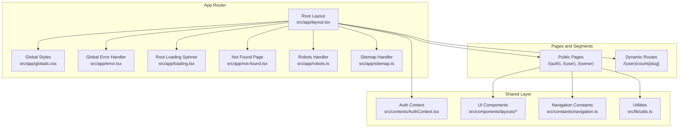
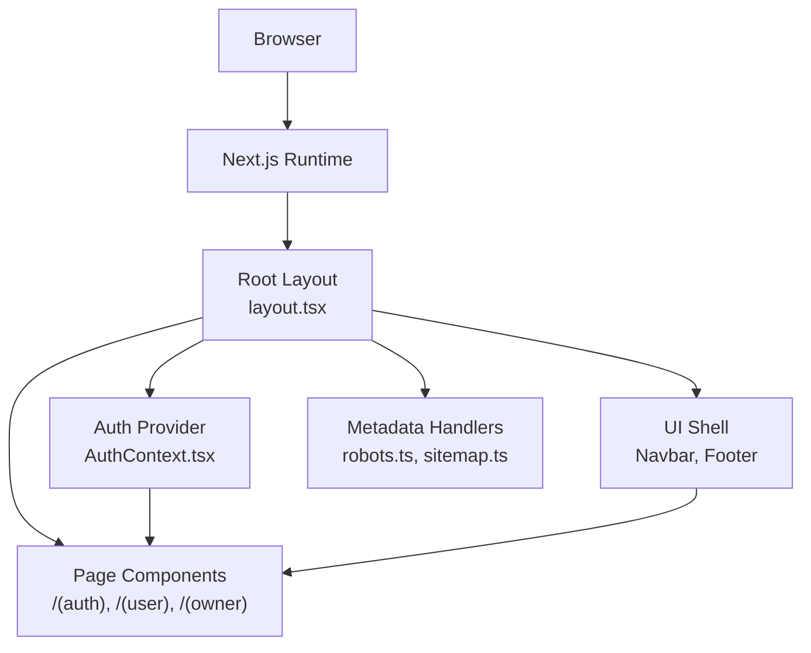
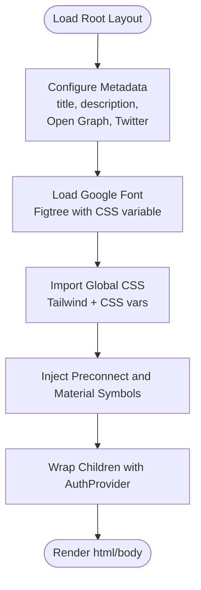
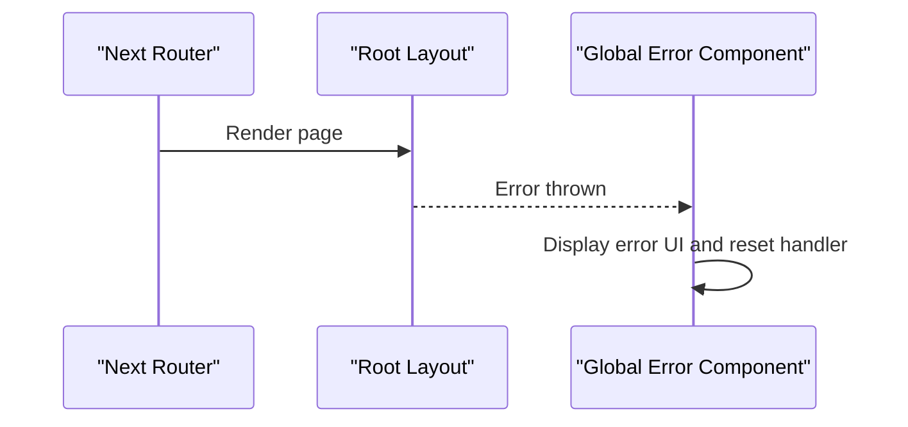
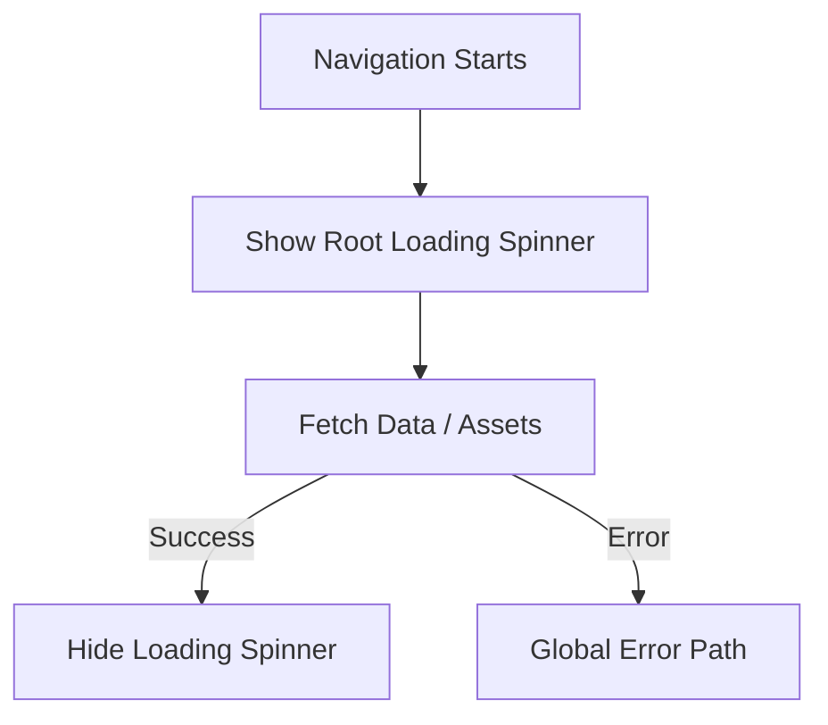
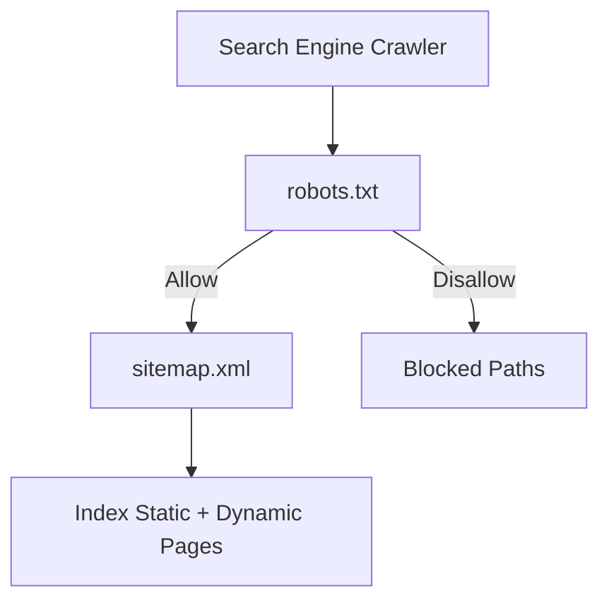
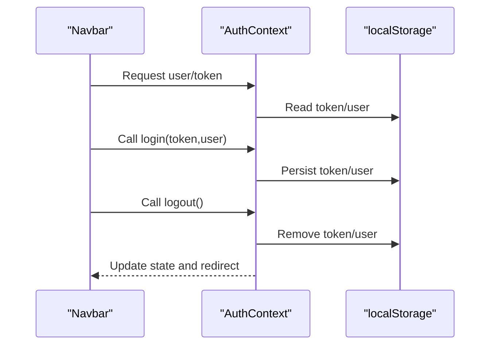
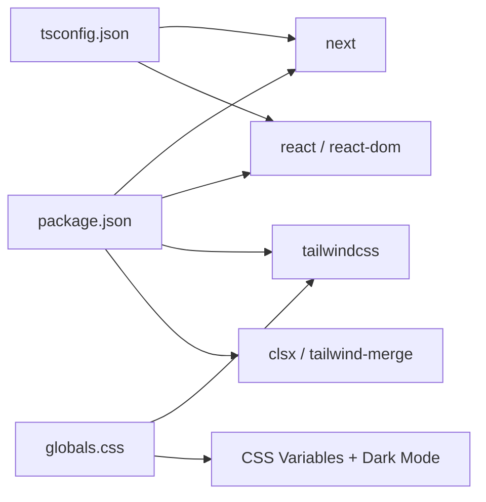

# Next.js Application Structure

<cite>
**Referenced Files in This Document**
- [layout.tsx](file://frontend/src/app/layout.tsx)
- [globals.css](file://frontend/src/app/globals.css)
- [error.tsx](file://frontend/src/app/error.tsx)
- [loading.tsx](file://frontend/src/app/loading.tsx)
- [not-found.tsx](file://frontend/src/app/not-found.tsx)
- [robots.ts](file://frontend/src/app/robots.ts)
- [sitemap.ts](file://frontend/src/app/sitemap.ts)
- [next.config.ts](file://frontend/next.config.ts)
- [package.json](file://frontend/package.json)
- [tsconfig.json](file://frontend/tsconfig.json)
- [AuthContext.tsx](file://frontend/src/contexts/AuthContext.tsx)
- [Navbar.tsx](file://frontend/src/components/layouts/Navbar.tsx)
- [Footer.tsx](file://frontend/src/components/layouts/Footer.tsx)
- [navigation.ts](file://frontend/src/constants/navigation.ts)
- [utils.ts](file://frontend/src/lib/utils.ts)
</cite>

## Table of Contents
1. [Introduction](#introduction)
2. [Project Structure](#project-structure)
3. [Core Components](#core-components)
4. [Architecture Overview](#architecture-overview)
5. [Detailed Component Analysis](#detailed-component-analysis)
6. [Dependency Analysis](#dependency-analysis)
7. [Performance Considerations](#performance-considerations)
8. [Troubleshooting Guide](#troubleshooting-guide)
9. [Conclusion](#conclusion)
10. [Appendices](#appendices)

## Introduction
This document explains the Next.js application structure and configuration for the frontend. It covers the App Router setup, file-based routing conventions, page hierarchy, root layout configuration, metadata management, global styling, configuration options, build optimization, performance enhancements, static generation strategies, dynamic routes, error handling patterns, SEO optimization, Open Graph integration, asset optimization, font loading strategies, and responsive design.

## Project Structure
The frontend follows Next.js App Router conventions under the src/app directory. Routing is derived from the filesystem, with special folders and files enabling layouts, loading states, errors, and not-found handlers. Shared UI and business logic live under src/components, src/contexts, src/services, and src/lib. Global styles are centralized in src/app/globals.css, while metadata endpoints (robots.txt and sitemap.xml) are generated via route handlers.

**Diagram sources**
- [layout.tsx:1-50](file://frontend/src/app/layout.tsx#L1-L50)
- [globals.css:1-130](file://frontend/src/app/globals.css#L1-L130)
- [error.tsx:1-30](file://frontend/src/app/error.tsx#L1-L30)
- [loading.tsx:1-11](file://frontend/src/app/loading.tsx#L1-L11)
- [not-found.tsx:1-37](file://frontend/src/app/not-found.tsx#L1-L37)
- [robots.ts:1-30](file://frontend/src/app/robots.ts#L1-L30)
- [sitemap.ts:1-48](file://frontend/src/app/sitemap.ts#L1-L48)
- [AuthContext.tsx:1-83](file://frontend/src/contexts/AuthContext.tsx#L1-L83)
- [Navbar.tsx:1-119](file://frontend/src/components/layouts/Navbar.tsx#L1-L119)
- [navigation.ts:1-25](file://frontend/src/constants/navigation.ts#L1-L25)
- [utils.ts:1-7](file://frontend/src/lib/utils.ts#L1-L7)

**Section sources**
- [layout.tsx:1-50](file://frontend/src/app/layout.tsx#L1-L50)
- [globals.css:1-130](file://frontend/src/app/globals.css#L1-L130)
- [error.tsx:1-30](file://frontend/src/app/error.tsx#L1-L30)
- [loading.tsx:1-11](file://frontend/src/app/loading.tsx#L1-L11)
- [not-found.tsx:1-37](file://frontend/src/app/not-found.tsx#L1-L37)
- [robots.ts:1-30](file://frontend/src/app/robots.ts#L1-L30)
- [sitemap.ts:1-48](file://frontend/src/app/sitemap.ts#L1-L48)

## Core Components
- Root Layout: Defines HTML wrapper, metadata, fonts, global styles, and the AuthProvider context.
- Global Styles: Tailwind-based theme with CSS variables, dark mode support, and layering.
- Global Error: Client-side global error boundary with reset action.
- Root Loading: Skeleton spinner shown during page transitions.
- Not Found: Friendly 404 page with navigation.
- Robots and Sitemap: Generated metadata for SEO and indexing.
- Auth Context: Client-side authentication state with localStorage persistence.
- UI Shell: Navbar and Footer components integrate with routing and auth.

**Section sources**
- [layout.tsx:1-50](file://frontend/src/app/layout.tsx#L1-L50)
- [globals.css:1-130](file://frontend/src/app/globals.css#L1-L130)
- [error.tsx:1-30](file://frontend/src/app/error.tsx#L1-L30)
- [loading.tsx:1-11](file://frontend/src/app/loading.tsx#L1-L11)
- [not-found.tsx:1-37](file://frontend/src/app/not-found.tsx#L1-L37)
- [robots.ts:1-30](file://frontend/src/app/robots.ts#L1-L30)
- [sitemap.ts:1-48](file://frontend/src/app/sitemap.ts#L1-L48)
- [AuthContext.tsx:1-83](file://frontend/src/contexts/AuthContext.tsx#L1-L83)
- [Navbar.tsx:1-119](file://frontend/src/components/layouts/Navbar.tsx#L1-L119)
- [Footer.tsx:1-20](file://frontend/src/components/layouts/Footer.tsx#L1-L20)

## Architecture Overview
The application uses Next.js App Router with a single root layout wrapping all pages. Authentication state is provided via a context provider injected at the root. UI components consume routing and auth state to render appropriate menus and actions. Metadata and SEO assets are generated via dedicated route handlers.

**Diagram sources**
- [layout.tsx:1-50](file://frontend/src/app/layout.tsx#L1-L50)
- [AuthContext.tsx:1-83](file://frontend/src/contexts/AuthContext.tsx#L1-L83)
- [Navbar.tsx:1-119](file://frontend/src/components/layouts/Navbar.tsx#L1-L119)
- [Footer.tsx:1-20](file://frontend/src/components/layouts/Footer.tsx#L1-L20)
- [robots.ts:1-30](file://frontend/src/app/robots.ts#L1-L30)
- [sitemap.ts:1-48](file://frontend/src/app/sitemap.ts#L1-L48)

## Detailed Component Analysis

### Root Layout and Metadata
- Metadata base URL, title template, description, Open Graph, and Twitter cards are configured at the root level.
- Font loading uses next/font/google with a CSS variable for the sans-serif family.
- Global CSS is imported and styled with Tailwind v4, CSS variables, and dark mode variants.
- Material Symbols are preconnected and loaded via external stylesheet.
- AuthProvider wraps children to share authentication state across pages.
- HTML lang is set to Vietnamese; hydration warnings are suppressed at the root.

**Diagram sources**
- [layout.tsx:1-50](file://frontend/src/app/layout.tsx#L1-L50)
- [globals.css:1-130](file://frontend/src/app/globals.css#L1-L130)

**Section sources**
- [layout.tsx:1-50](file://frontend/src/app/layout.tsx#L1-L50)
- [globals.css:1-130](file://frontend/src/app/globals.css#L1-L130)

### Global Error Handling
- A client-side global error component renders a localized error message and a reset button.
- It uses Tailwind classes and Material Symbols for icons.
- Integrates with Next.js App Router’s global error boundary.

**Diagram sources**
- [error.tsx:1-30](file://frontend/src/app/error.tsx#L1-L30)
- [layout.tsx:1-50](file://frontend/src/app/layout.tsx#L1-L50)

**Section sources**
- [error.tsx:1-30](file://frontend/src/app/error.tsx#L1-L30)

### Loading States
- Root loading spinner provides a consistent skeleton during navigation and data fetching.
- Uses CSS animations and Tailwind utilities for visual feedback.

**Diagram sources**
- [loading.tsx:1-11](file://frontend/src/app/loading.tsx#L1-L11)

**Section sources**
- [loading.tsx:1-11](file://frontend/src/app/loading.tsx#L1-L11)

### Not Found Handling
- Dedicated 404 page with branding, message, and a link back to the homepage.
- Uses Tailwind spacing and color tokens aligned with global theme.

**Section sources**
- [not-found.tsx:1-37](file://frontend/src/app/not-found.tsx#L1-L37)

### SEO and Metadata: Robots and Sitemap
- robots.txt disallows crawlers from admin, owner, and user-private routes while allowing general paths and linking to sitemap.xml.
- sitemap.xml is generated programmatically from mock data, including dynamic court pages and key static pages with frequency and priority hints.

**Diagram sources**
- [robots.ts:1-30](file://frontend/src/app/robots.ts#L1-L30)
- [sitemap.ts:1-48](file://frontend/src/app/sitemap.ts#L1-L48)

**Section sources**
- [robots.ts:1-30](file://frontend/src/app/robots.ts#L1-L30)
- [sitemap.ts:1-48](file://frontend/src/app/sitemap.ts#L1-L48)

### Authentication Context and UI Integration
- AuthProvider stores token and user in localStorage and exposes login/logout and isAuthenticated flag.
- Navbar conditionally renders menu items and avatar/profile/logout based on authentication and role.
- Footer provides social links and copyright.

**Diagram sources**
- [AuthContext.tsx:1-83](file://frontend/src/contexts/AuthContext.tsx#L1-L83)
- [Navbar.tsx:1-119](file://frontend/src/components/layouts/Navbar.tsx#L1-L119)
- [Footer.tsx:1-20](file://frontend/src/components/layouts/Footer.tsx#L1-L20)

**Section sources**
- [AuthContext.tsx:1-83](file://frontend/src/contexts/AuthContext.tsx#L1-L83)
- [Navbar.tsx:1-119](file://frontend/src/components/layouts/Navbar.tsx#L1-L119)
- [Footer.tsx:1-20](file://frontend/src/components/layouts/Footer.tsx#L1-L20)

### Navigation Constants and Utilities
- navigation.ts centralizes nav items per role for reuse across components.
- utils.ts provides a composable className merging utility using clsx and tailwind-merge.

**Section sources**
- [navigation.ts:1-25](file://frontend/src/constants/navigation.ts#L1-L25)
- [utils.ts:1-7](file://frontend/src/lib/utils.ts#L1-L7)

## Dependency Analysis
- Next.js runtime and React are managed via package.json scripts and dependencies.
- TypeScript configuration enables strict checks, JSX transform, bundler module resolution, and path aliases.
- Tailwind v4 is configured via PostCSS pipeline; CSS variables and dark mode tokens are defined globally.
- Material Symbols are loaded via CDN with preconnect for performance.

**Diagram sources**
- [package.json:1-39](file://frontend/package.json#L1-L39)
- [tsconfig.json:1-35](file://frontend/tsconfig.json#L1-L35)
- [globals.css:1-130](file://frontend/src/app/globals.css#L1-L130)

**Section sources**
- [package.json:1-39](file://frontend/package.json#L1-L39)
- [tsconfig.json:1-35](file://frontend/tsconfig.json#L1-L35)
- [globals.css:1-130](file://frontend/src/app/globals.css#L1-L130)

## Performance Considerations
- React Compiler: Enabled in next.config.ts to optimize component compilation.
- Font Optimization: next/font/google loads fonts with CSS variable fallbacks and minimal FOIT.
- Asset Optimization: Material Symbols preconnect reduces DNS lookup latency.
- CSS Delivery: Tailwind v4 with CSS variables minimizes runtime style recalculation.
- Build Pipeline: TypeScript strict mode and incremental builds improve DX and CI stability.

**Section sources**
- [next.config.ts:1-9](file://frontend/next.config.ts#L1-L9)
- [layout.tsx:1-50](file://frontend/src/app/layout.tsx#L1-L50)
- [globals.css:1-130](file://frontend/src/app/globals.css#L1-L130)
- [package.json:1-39](file://frontend/package.json#L1-L39)

## Troubleshooting Guide
- Hydration Mismatches: Root layout suppresses hydration warnings; verify client/server rendering parity in child components.
- Auth State Persistence: If login/logout does not persist, check localStorage availability and parsing errors in AuthProvider.
- Navigation Links: Ensure pathnames match between Navbar and route segments; use usePathname for accurate matching.
- Sitemap Generation: Confirm mock data keys align with dynamic route slugs; replace mock with database-backed queries in production.
- Robots Disallow Lists: Verify disallowed paths reflect current backend restrictions and avoid indexing sensitive areas.

**Section sources**
- [layout.tsx:1-50](file://frontend/src/app/layout.tsx#L1-L50)
- [AuthContext.tsx:1-83](file://frontend/src/contexts/AuthContext.tsx#L1-L83)
- [Navbar.tsx:1-119](file://frontend/src/components/layouts/Navbar.tsx#L1-L119)
- [sitemap.ts:1-48](file://frontend/src/app/sitemap.ts#L1-L48)
- [robots.ts:1-30](file://frontend/src/app/robots.ts#L1-L30)

## Conclusion
The application leverages Next.js App Router conventions with a robust root layout, centralized metadata, global styling, and a cohesive authentication and UI shell. SEO is addressed via robots.txt and sitemap.xml handlers, while performance benefits from React Compiler, optimized fonts, and efficient CSS delivery. Dynamic routes and error/loading boundaries provide a resilient user experience.

## Appendices

### Routing Conventions and Hierarchy
- File-based routing: folders become route segments; page.tsx is the route entry.
- Grouping: parentheses (auth), (user), (owner) isolate route groups without affecting URLs.
- Special files: layout.tsx, loading.tsx, error.tsx, not-found.tsx, and page.tsx define structure and UX.
- Dynamic routes: [slug] captures parameters; used for individual court pages.

**Section sources**
- [layout.tsx:1-50](file://frontend/src/app/layout.tsx#L1-L50)
- [not-found.tsx:1-37](file://frontend/src/app/not-found.tsx#L1-L37)

### Static Generation Strategies
- Sitemap generation is server-rendered at build/runtime; consider caching or generating at build time for large datasets.
- Robots.txt is generated statically; keep disallow lists minimal and maintainable.

**Section sources**
- [sitemap.ts:1-48](file://frontend/src/app/sitemap.ts#L1-L48)
- [robots.ts:1-30](file://frontend/src/app/robots.ts#L1-L30)

### Open Graph and Social Media Tags
- Open Graph site metadata and images are configured at the root layout.
- Twitter summary card is enabled; customize image and alt text for optimal previews.

**Section sources**
- [layout.tsx:1-50](file://frontend/src/app/layout.tsx#L1-L50)

### Responsive Design Implementation
- Tailwind utilities and CSS variables drive responsive breakpoints and typography.
- Navbar adapts menu visibility and avatar text based on viewport and authentication state.

**Section sources**
- [globals.css:1-130](file://frontend/src/app/globals.css#L1-L130)
- [Navbar.tsx:1-119](file://frontend/src/components/layouts/Navbar.tsx#L1-L119)