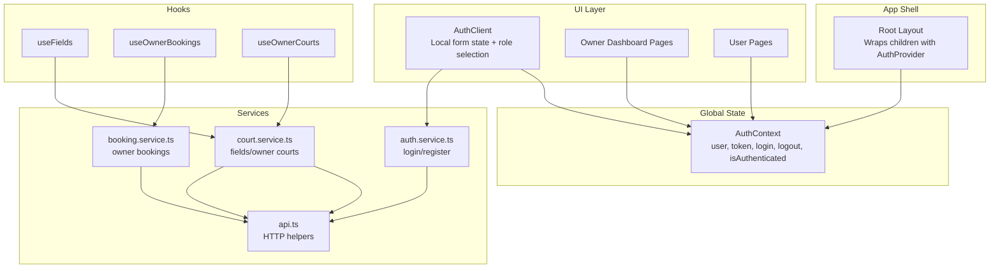
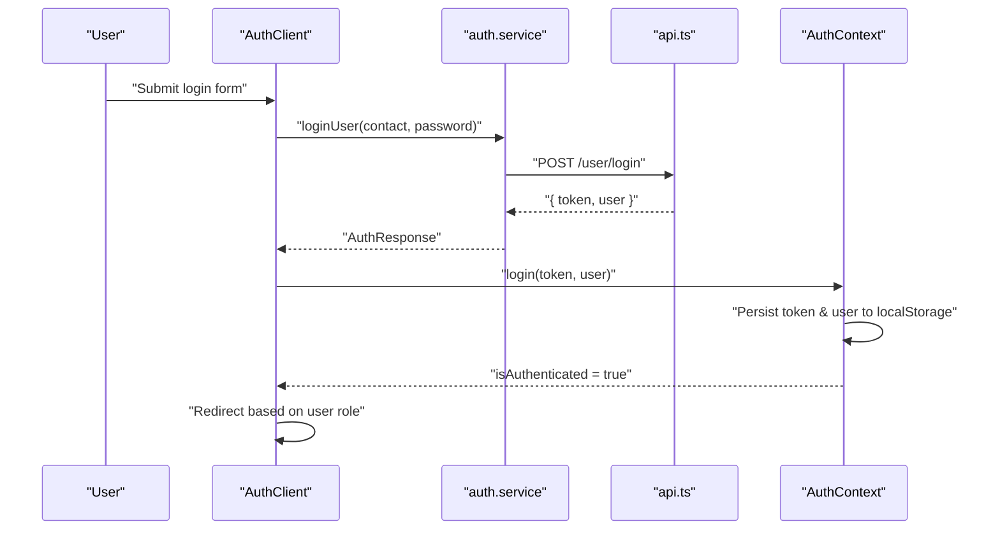
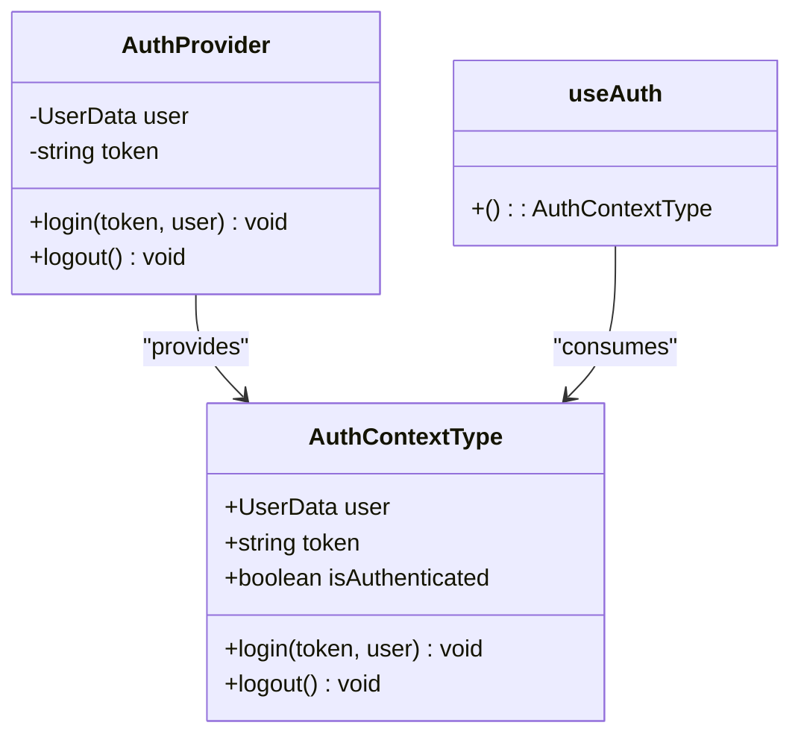
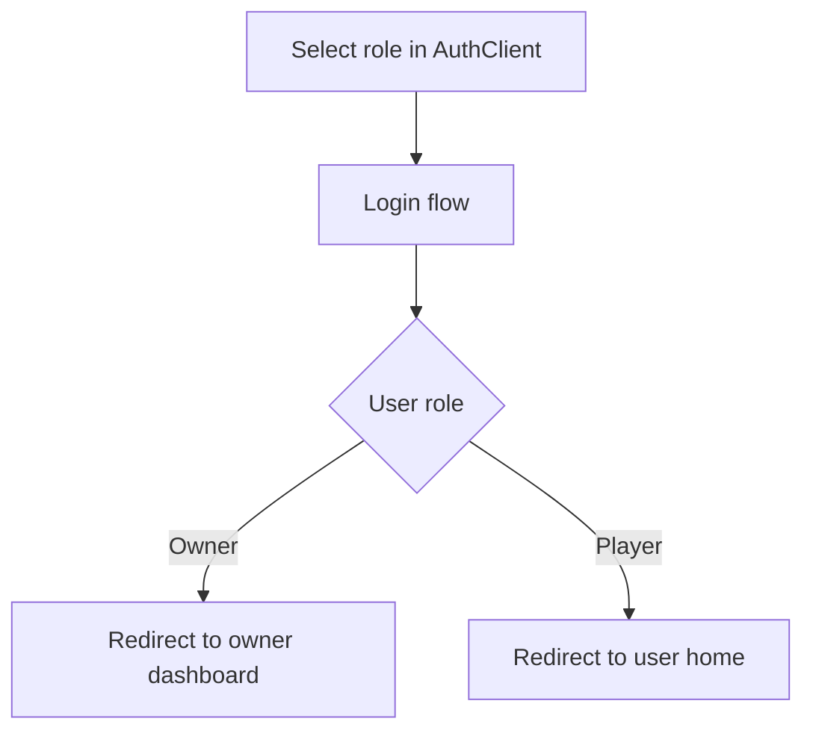
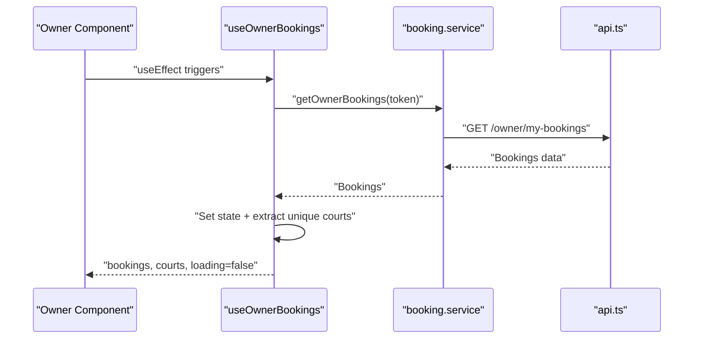
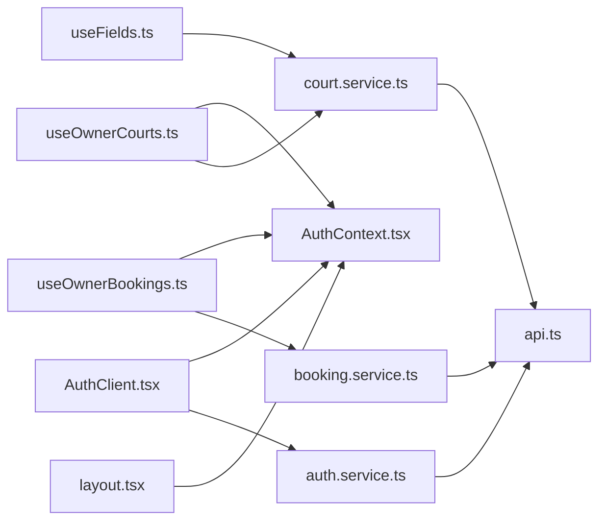

# State Management

<cite>
**Referenced Files in This Document**
- [AuthContext.tsx](file://frontend/src/contexts/AuthContext.tsx)
- [AuthClient.tsx](file://frontend/src/components/auth/AuthClient.tsx)
- [auth.service.ts](file://frontend/src/services/auth.service.ts)
- [api.ts](file://frontend/src/services/api.ts)
- [layout.tsx](file://frontend/src/app/layout.tsx)
- [useFields.ts](file://frontend/src/hooks/useFields.ts)
- [useOwnerBookings.ts](file://frontend/src/hooks/useOwnerBookings.ts)
- [useOwnerCourts.ts](file://frontend/src/hooks/useOwnerCourts.ts)
- [court.service.ts](file://frontend/src/services/court.service.ts)
- [booking.service.ts](file://frontend/src/services/booking.service.ts)
- [sport.utils.ts](file://frontend/src/utils/sport.utils.ts)
- [auth.types.ts](file://frontend/src/types/auth.types.ts)
- [court.types.ts](file://frontend/src/types/court.types.ts)
- [booking.types.ts](file://frontend/src/types/booking.types.ts)
- [api.types.ts](file://frontend/src/types/api.types.ts)
</cite>

## Update Summary
**Changes Made**
- Added comprehensive documentation for new custom hooks: useFields, useOwnerBookings, and useOwnerCourts
- Enhanced service layer documentation covering auth.service.ts, booking.service.ts, and court.service.ts
- Updated type system documentation with new types directory structure
- Expanded architecture diagrams to reflect the complete state management flow
- Added detailed analysis of authentication state management and session handling
- Included comprehensive coverage of role-based state management patterns

## Table of Contents
1. [Introduction](#introduction)
2. [Project Structure](#project-structure)
3. [Core Components](#core-components)
4. [Architecture Overview](#architecture-overview)
5. [Detailed Component Analysis](#detailed-component-analysis)
6. [Dependency Analysis](#dependency-analysis)
7. [Performance Considerations](#performance-considerations)
8. [Troubleshooting Guide](#troubleshooting-guide)
9. [Conclusion](#conclusion)
10. [Appendices](#appendices)

## Introduction
This document explains the state management implementation using React Context API and custom hooks. It covers authentication state management, global state patterns, and local state strategies. It documents the AuthContext implementation, user session handling, role-based state management, and custom hook patterns for data fetching, caching, and state synchronization. It also addresses state persistence strategies, memory management, performance optimization techniques, state update patterns, error boundaries, debugging approaches, state composition, context provider organization, and integration with external APIs.

## Project Structure
The state management spans three layers:
- Global state: Authentication state managed by a Context Provider wrapping the entire app.
- Local state: Component-scoped state for UI interactions (tabs, forms, visibility toggles).
- Custom hooks: Encapsulate data fetching, caching, and state synchronization for domain-specific features.

**Diagram sources**
- [layout.tsx:26-44](file://frontend/src/app/layout.tsx#L26-L44)
- [AuthContext.tsx:24-74](file://frontend/src/contexts/AuthContext.tsx#L24-L74)
- [AuthClient.tsx:13-133](file://frontend/src/components/auth/AuthClient.tsx#L13-L133)
- [auth.service.ts:4-35](file://frontend/src/services/auth.service.ts#L4-L35)
- [api.ts:19-77](file://frontend/src/services/api.ts#L19-L77)
- [useFields.ts:12-77](file://frontend/src/hooks/useFields.ts#L12-L77)
- [court.service.ts:4-25](file://frontend/src/services/court.service.ts#L4-L25)
- [booking.service.ts:4-12](file://frontend/src/services/booking.service.ts#L4-L12)

**Section sources**
- [layout.tsx:26-44](file://frontend/src/app/layout.tsx#L26-L44)
- [AuthContext.tsx:24-74](file://frontend/src/contexts/AuthContext.tsx#L24-L74)

## Core Components
- AuthContext: Provides authentication state and actions to the entire app. Persists token and user data to localStorage and restores them on mount.
- AuthClient: Manages local UI state for login/signup tabs, role selection, and form inputs. Uses AuthContext to persist session and redirects based on role.
- Custom hooks:
  - useFields: Fetches and normalizes public field lists for grid and map views.
  - useOwnerBookings: Loads owner's bookings, extracts unique courts, and updates booking statuses.
  - useOwnerCourts: Loads owner's courts, toggles status, adds, and updates courts.

Key patterns:
- Global state via Context for authentication.
- Local state per component for UI interactions.
- Hooks encapsulate side effects and keep components declarative.

**Section sources**
- [AuthContext.tsx:7-22](file://frontend/src/contexts/AuthContext.tsx#L7-L22)
- [AuthContext.tsx:26-74](file://frontend/src/contexts/AuthContext.tsx#L26-L74)
- [AuthClient.tsx:13-133](file://frontend/src/components/auth/AuthClient.tsx#L13-L133)
- [useFields.ts:12-77](file://frontend/src/hooks/useFields.ts#L12-L77)
- [useOwnerBookings.ts:8-66](file://frontend/src/hooks/useOwnerBookings.ts#L8-L66)
- [useOwnerCourts.ts:8-94](file://frontend/src/hooks/useOwnerCourts.ts#L8-L94)

## Architecture Overview
The authentication lifecycle integrates UI, service, and persistence layers.

**Diagram sources**
- [AuthClient.tsx:55-83](file://frontend/src/components/auth/AuthClient.tsx#L55-L83)
- [auth.service.ts:5-11](file://frontend/src/services/auth.service.ts#L5-L11)
- [api.ts:29-43](file://frontend/src/services/api.ts#L29-L43)
- [AuthContext.tsx:46-59](file://frontend/src/contexts/AuthContext.tsx#L46-L59)

## Detailed Component Analysis

### AuthContext Implementation
AuthContext defines the shape of authentication state and exposes login/logout actions. It restores persisted state from localStorage on mount and synchronizes localStorage with state updates. It computes isAuthenticated from token presence.

**Diagram sources**
- [AuthContext.tsx:16-22](file://frontend/src/contexts/AuthContext.tsx#L16-L22)
- [AuthContext.tsx:26-74](file://frontend/src/contexts/AuthContext.tsx#L26-L74)
- [AuthContext.tsx:76-82](file://frontend/src/contexts/AuthContext.tsx#L76-L82)

**Section sources**
- [AuthContext.tsx:26-74](file://frontend/src/contexts/AuthContext.tsx#L26-L74)
- [AuthContext.tsx:76-82](file://frontend/src/contexts/AuthContext.tsx#L76-L82)

### Authentication State Management and Session Handling
- Initialization: On mount, AuthProvider reads token and user from localStorage and sets state accordingly.
- Login: Updates state and persists token/user. Redirects after login depend on role.
- Logout: Clears state and removes persisted data, then navigates to login.

```mermaid
flowchart TD
Start(["Mount AuthProvider"]) --> Load["Read token & user from localStorage"]
Load --> HasData{"Both present?"}
HasData --> |Yes| Restore["Set state from localStorage"]
HasData --> |No| Idle["Start fresh"]
Restore --> Ready(["Ready"])
Idle --> Ready
subgraph "Login Flow"
Submit["Form submit"] --> CallAPI["Call auth service"]
CallAPI --> Save["Persist token & user"]
Save --> Update["Update context state"]
Update --> Redirect["Navigate by role"]
end
```

**Diagram sources**
- [AuthContext.tsx:32-44](file://frontend/src/contexts/AuthContext.tsx#L32-L44)
- [AuthContext.tsx:46-59](file://frontend/src/contexts/AuthContext.tsx#L46-L59)
- [AuthClient.tsx:55-83](file://frontend/src/components/auth/AuthClient.tsx#L55-L83)

**Section sources**
- [AuthContext.tsx:32-44](file://frontend/src/contexts/AuthContext.tsx#L32-L44)
- [AuthContext.tsx:46-59](file://frontend/src/contexts/AuthContext.tsx#L46-L59)
- [AuthClient.tsx:55-83](file://frontend/src/components/auth/AuthClient.tsx#L55-L83)

### Role-Based State Management
- Role selection is handled locally in AuthClient (player vs owner).
- After login, the UI redirects to appropriate dashboards based on user role.
- Owner-specific hooks (useOwnerBookings, useOwnerCourts) rely on token availability to guard requests.

**Diagram sources**
- [AuthClient.tsx:19-133](file://frontend/src/components/auth/AuthClient.tsx#L19-L133)
- [useOwnerBookings.ts:9-33](file://frontend/src/hooks/useOwnerBookings.ts#L9-L33)
- [useOwnerCourts.ts:9-25](file://frontend/src/hooks/useOwnerCourts.ts#L9-L25)

**Section sources**
- [AuthClient.tsx:19-133](file://frontend/src/components/auth/AuthClient.tsx#L19-L133)
- [useOwnerBookings.ts:9-33](file://frontend/src/hooks/useOwnerBookings.ts#L9-L33)
- [useOwnerCourts.ts:9-25](file://frontend/src/hooks/useOwnerCourts.ts#L9-L25)

### Custom Hook Patterns for Data Fetching, Caching, and State Synchronization
- useFields: Fetches public fields, maps to grid and map items, and manages loading state. Uses cancellation flag to prevent state updates after unmount.
- useOwnerBookings: Fetches owner bookings, derives unique courts, and updates booking status with optimistic UI updates.
- useOwnerCourts: Fetches owner courts, toggles status, adds, and updates courts with optimistic UI updates.

**Diagram sources**
- [useOwnerBookings.ts:14-40](file://frontend/src/hooks/useOwnerBookings.ts#L14-L40)
- [booking.service.ts:5-11](file://frontend/src/services/booking.service.ts#L5-L11)
- [api.ts:19-27](file://frontend/src/services/api.ts#L19-L27)

**Section sources**
- [useFields.ts:12-77](file://frontend/src/hooks/useFields.ts#L12-L77)
- [useOwnerBookings.ts:8-66](file://frontend/src/hooks/useOwnerBookings.ts#L8-L66)
- [useOwnerCourts.ts:8-94](file://frontend/src/hooks/useOwnerCourts.ts#L8-L94)

### State Persistence Strategies
- Auth state persistence: localStorage stores token and user. AuthProvider hydrates on mount; login/logout updates persistence.
- Hook persistence: useFields caches transformed data in component-local state until re-fetch is needed.

Best practices:
- Always clear persisted tokens on logout.
- Avoid storing sensitive data beyond necessity.
- Keep localStorage writes minimal and synchronous.

**Section sources**
- [AuthContext.tsx:32-44](file://frontend/src/contexts/AuthContext.tsx#L32-L44)
- [AuthContext.tsx:46-59](file://frontend/src/contexts/AuthContext.tsx#L46-L59)
- [useFields.ts:12-77](file://frontend/src/hooks/useFields.ts#L12-L77)

### Memory Management and Performance Optimization
- Cancellation pattern: useFields sets a cancellation flag to avoid state updates after component unmount.
- useCallback: useOwnerBookings and useOwnerCourts memoize async functions to reduce re-renders.
- Optimistic updates: Hooks update UI immediately upon mutation and reconcile on success/failure.
- Normalization: sport.utils normalizes sport names to stable slugs to avoid unnecessary re-computation.

Recommendations:
- Debounce frequent UI updates.
- Use selective re-renders with shallow comparisons.
- Consider background refetch strategies for stale data.

**Section sources**
- [useFields.ts:17-74](file://frontend/src/hooks/useFields.ts#L17-L74)
- [useOwnerBookings.ts:14-33](file://frontend/src/hooks/useOwnerBookings.ts#L14-L33)
- [useOwnerCourts.ts:13-25](file://frontend/src/hooks/useOwnerCourts.ts#L13-L25)
- [sport.utils.ts:5-14](file://frontend/src/utils/sport.utils.ts#L5-L14)

### State Update Patterns, Error Boundaries, and Debugging Approaches
- Error handling: Services and hooks throw or log errors; UI surfaces user-friendly messages.
- Error boundaries: Wrap critical regions to catch errors and display fallback UI.
- Debugging:
  - Log token and user on login/logout.
  - Track hook lifecycles (mount/unmount) and request/response shapes.
  - Inspect localStorage keys during development.

**Section sources**
- [auth.service.ts:5-35](file://frontend/src/services/auth.service.ts#L5-L35)
- [useOwnerBookings.ts:28-32](file://frontend/src/hooks/useOwnerBookings.ts#L28-L32)
- [useOwnerCourts.ts:20-23](file://frontend/src/hooks/useOwnerCourts.ts#L20-L23)

### State Composition and Context Provider Organization
- Provider placement: AuthProvider wraps all pages in RootLayout to ensure global availability.
- Composition: AuthContext composes with domain hooks (useOwnerBookings, useOwnerCourts) to build richer UIs.
- Separation of concerns: UI state remains local; global state remains centralized.

**Section sources**
- [layout.tsx:26-44](file://frontend/src/app/layout.tsx#L26-L44)
- [AuthContext.tsx:26-74](file://frontend/src/contexts/AuthContext.tsx#L26-L74)

### Integration with External APIs
- HTTP helpers: api.ts centralizes headers, response handling, and request methods.
- Service layer: auth.service, court.service, booking.service translate domain calls to HTTP requests.
- Type safety: Strongly typed request/response interfaces ensure correctness across layers.

**Section sources**
- [api.ts:3-9](file://frontend/src/services/api.ts#L3-L9)
- [api.ts:19-77](file://frontend/src/services/api.ts#L19-L77)
- [auth.service.ts:4-35](file://frontend/src/services/auth.service.ts#L4-L35)
- [court.service.ts:4-25](file://frontend/src/services/court.service.ts#L4-L25)
- [booking.service.ts:4-12](file://frontend/src/services/booking.service.ts#L4-L12)
- [auth.types.ts:10-39](file://frontend/src/types/auth.types.ts#L10-L39)
- [court.types.ts:13-81](file://frontend/src/types/court.types.ts#L13-L81)
- [booking.types.ts:3-36](file://frontend/src/types/booking.types.ts#L3-L36)

## Dependency Analysis

**Diagram sources**
- [AuthClient.tsx:19](file://frontend/src/components/auth/AuthClient.tsx#L19)
- [auth.service.ts:1](file://frontend/src/services/auth.service.ts#L1)
- [api.ts:1](file://frontend/src/services/api.ts#L1)
- [useFields.ts:3](file://frontend/src/hooks/useFields.ts#L3)
- [court.service.ts:1](file://frontend/src/services/court.service.ts#L1)
- [useOwnerBookings.ts:4](file://frontend/src/hooks/useOwnerBookings.ts#L4)
- [booking.service.ts:1](file://frontend/src/services/booking.service.ts#L1)
- [useOwnerCourts.ts:4](file://frontend/src/hooks/useOwnerCourts.ts#L4)
- [layout.tsx:26](file://frontend/src/app/layout.tsx#L26)
- [AuthContext.tsx:24](file://frontend/src/contexts/AuthContext.tsx#L24)

**Section sources**
- [AuthClient.tsx:19](file://frontend/src/components/auth/AuthClient.tsx#L19)
- [auth.service.ts:1](file://frontend/src/services/auth.service.ts#L1)
- [api.ts:1](file://frontend/src/services/api.ts#L1)
- [useFields.ts:3](file://frontend/src/hooks/useFields.ts#L3)
- [court.service.ts:1](file://frontend/src/services/court.service.ts#L1)
- [useOwnerBookings.ts:4](file://frontend/src/hooks/useOwnerBookings.ts#L4)
- [booking.service.ts:1](file://frontend/src/services/booking.service.ts#L1)
- [useOwnerCourts.ts:4](file://frontend/src/hooks/useOwnerCourts.ts#L4)
- [layout.tsx:26](file://frontend/src/app/layout.tsx#L26)
- [AuthContext.tsx:24](file://frontend/src/contexts/AuthContext.tsx#L24)

## Performance Considerations
- Prefer memoized callbacks in hooks to minimize re-renders.
- Use cancellation flags to avoid state updates after unmount.
- Normalize and cache derived data to reduce recomputation.
- Batch UI updates and avoid synchronous heavy work on render.

## Troubleshooting Guide
Common issues and resolutions:
- Login fails silently: Verify service responses and ensure error messages are propagated to UI.
- Token not persisted: Confirm localStorage keys and AuthProvider hydration logic.
- Stale data after mutations: Ensure optimistic updates and subsequent refetches.
- Hook causing excessive re-renders: Wrap async functions with useCallback and avoid inline function definitions.

**Section sources**
- [AuthContext.tsx:32-44](file://frontend/src/contexts/AuthContext.tsx#L32-L44)
- [useFields.ts:17-74](file://frontend/src/hooks/useFields.ts#L17-L74)
- [useOwnerBookings.ts:28-32](file://frontend/src/hooks/useOwnerBookings.ts#L28-L32)
- [useOwnerCourts.ts:20-23](file://frontend/src/hooks/useOwnerCourts.ts#L20-L23)

## Conclusion
The application employs a clean separation of global and local state. AuthContext centralizes authentication state with robust persistence and role-aware redirection. Custom hooks encapsulate data fetching and synchronization, enabling reusable, testable logic. The service layer ensures consistent HTTP interactions with strong typing. Following the recommended patterns improves maintainability, performance, and developer experience.

## Appendices
- Types and contracts:
  - Authentication: [auth.types.ts:1-40](file://frontend/src/types/auth.types.ts#L1-L40)
  - Courts: [court.types.ts:1-82](file://frontend/src/types/court.types.ts#L1-L82)
  - Bookings: [booking.types.ts:1-37](file://frontend/src/types/booking.types.ts#L1-L37)
  - API Base Types: [api.types.ts:1-6](file://frontend/src/types/api.types.ts#L1-L6)
- Utilities:
  - Sport normalization: [sport.utils.ts:5-14](file://frontend/src/utils/sport.utils.ts#L5-L14)